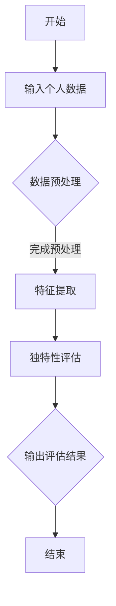
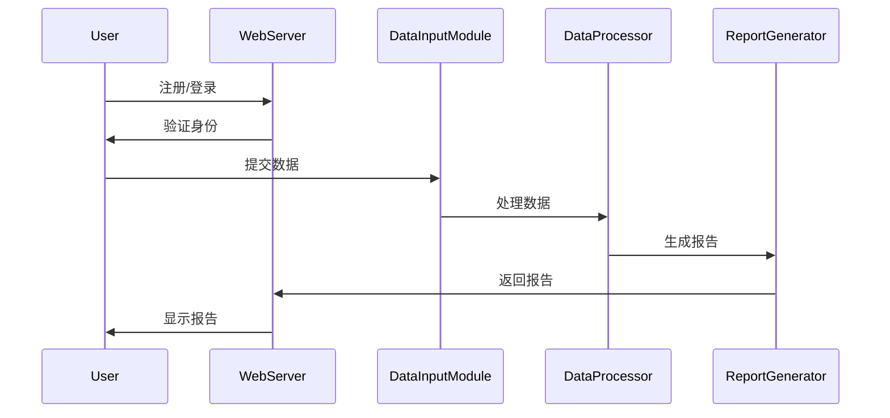

                 

### 引言

在当今社会，我们越来越意识到个体独特性在各个领域中的重要性。无论是在职场、学术界，还是艺术创作中，独特的思维方式和创新能力往往能够带来非凡的成就和突破。然而，如何在平凡中找到和绽放个人独特性，却成为了一个值得深入探讨的课题。

本文旨在通过逻辑清晰、结构紧凑的分析，帮助读者理解个人独特性的概念、发掘个人独特性的方法，以及如何在职场和社会中展现和利用这种独特性。我们将从以下几个方面进行探讨：

1. **独特性的定义与价值**：我们将探讨独特性从古至今的演变，分析其在现代社会中的重要性和价值评估方法。
2. **发掘个人独特性**：通过自我认知和探索，找到内心深处的独特性。
3. **培养个人独特性**：介绍培养独特性的原则和方法，以及实际案例的分享。
4. **展现个人独特性**：探讨在职场中如何展现个人独特性，并通过案例分析提供具体指导。
5. **独特性与社会价值**：分析独特性对社会多样性和创新的作用，以及如何与企业文化相结合。
6. **应对挑战，绽放独特性**：探讨在逆境中如何培养和展现个人独特性。
7. **独特性的未来**：展望独特性发展趋势和未来社会的影响。

通过上述探讨，我们希望读者能够认识到个人独特性的重要性，并找到适合自己的方法去发掘、培养和展现个人独特性，从而在平凡中闪耀光芒。

### 背景介绍

**独特性**，作为一个广泛存在于多个领域的概念，其含义和重要性在不同背景下有着不同的体现。从古至今，人们一直在探索和讨论独特性，试图理解其本质和作用。

#### 从古至今的探讨

在古代，独特性被视为一种天赋，是区别个体和社会地位的重要标志。例如，在中国古代文化中，儒家提倡“君子不器”，即君子应该具有独特的品德和才华，而不应局限于某一项技艺。而西方哲学中，柏拉图和亚里士多德也强调个体的独特性和自由意志。

进入现代社会，随着工业化和标准化的发展，独特性逐渐被视为一种稀缺资源。现代社会强调创新和个性化，独特性成为推动社会进步的重要动力。例如，在科学领域，独特的理论突破和创新思维往往能够带来革命性的进展。在商业领域，独特的产品和服务能够赢得市场份额，提高企业的竞争力。

#### 独特性在现代社会中的重要性

在现代社会，独特性的重要性主要体现在以下几个方面：

1. **创新能力**：独特性往往伴随着创新思维，能够推动技术进步和社会发展。例如，爱因斯坦的相对论、乔布斯的苹果产品，都是独特性带来的创新成果。
2. **个人发展**：独特性能够帮助个体在职业生涯中脱颖而出，获得更多的机会和资源。具有独特技能和思维方式的人，往往能够在竞争中占据优势。
3. **社会多样性**：独特性是社会多样性的基础。一个多样化、包容性的社会，能够更好地吸收和融合不同的文化、思想和观点，从而促进社会的和谐发展。

#### 独特性价值评估方法

要评估独特性的价值，可以从以下几个方面进行：

1. **创新贡献**：独特的思想和成果对社会的创新贡献越大，其价值也就越高。例如，专利的数量和质量、学术论文的影响力等，都是评估独特性价值的重要指标。
2. **社会影响力**：独特性在社会中的影响范围和深度，也是评估其价值的重要方面。一个具有广泛影响力的独特思想或产品，往往能够改变社会的面貌。
3. **个人幸福感**：独特性对个体的幸福感也有重要影响。拥有独特性的人，往往能够更好地实现自我价值，获得更高的生活满意度。

#### 核心概念与联系

为了更好地理解独特性，我们需要明确一些核心概念，并分析它们之间的联系。

1. **独特性**：指个体在思维、行为、技能等方面的独特性和个性化特征。
2. **创新能力**：指个体在创新方面的能力和表现。
3. **个性化**：指个体在行为、思想、价值观等方面的独特性和个性化特征。
4. **多样性**：指社会或群体中存在的不同类型和差异。

这些概念之间的联系如下：

- 独特性是个体创新能力的源泉，也是个性化的重要体现。
- 个性化是社会多样性的基础，而多样性又是社会和谐发展的关键。
- 创新能力和社会影响力是评估独特性价值的重要指标。

#### 概念结构与核心要素组成

为了更好地理解独特性的核心概念和结构，我们可以通过ER实体关系图来展示各个概念之间的关系和属性。


- **实体**：独特性、创新能力、个性化、多样性。
- **属性**：创新能力（如专利数量、学术论文影响力）、社会影响力（如奖项、媒体报道次数）、个人幸福感（如自我价值感、生活满意度）。
- **关系**：独特性是创新能力和个性化的基础，创新能力和社会影响力是评估独特性价值的重要指标，而个性化又是多样性的基础。

通过上述背景介绍，我们可以看到，独特性作为一个多维度的概念，其在不同背景下的重要性和作用是显而易见的。接下来，我们将进一步探讨如何发掘、培养和展现个人独特性。

### 核心概念与联系

为了更好地理解个人独特性的概念及其在不同领域的联系，我们需要明确几个核心概念，并通过表格和ER实体关系图来展示它们之间的关系。

#### 核心概念

1. **个人独特性**：指个体在思想、技能、行为等方面的独特性和个性化特征，是区别于他人且具有独特价值的能力。
2. **创新能力**：指个体在解决问题、提出新观点和创造新事物方面的能力，是个人独特性的重要组成部分。
3. **个性化**：指个体在价值观、行为习惯、审美情趣等方面的独特性和个性化特征，是个人独特性的外在表现。
4. **多样性**：指社会或群体中存在的不同类型和差异，是个人独特性在社会层面的体现。

#### 概念之间的关系

这些概念之间存在着密切的联系：

- **个人独特性** 是 **创新能力** 的基础，创新能力的强弱直接影响个人独特性的表现。
- **个性化** 是 **个人独特性** 的外在表现，通过个性化，个人独特性得以在行为和思想中体现。
- **多样性** 是 **个人独特性** 在社会层面的体现，一个多样化的社会能够更好地包容和发挥个人的独特性。

#### 表格展示

为了更直观地展示这些概念及其属性，我们可以创建一个表格：

| 概念       | 定义                                                         | 属性示例                          |
|------------|--------------------------------------------------------------|-----------------------------------|
| 个人独特性 | 个体在思想、技能、行为等方面的独特性和个性化特征。           | 创新能力、审美独特性、思维方式等  |
| 创新能力   | 个体在解决问题、提出新观点和创造新事物方面的能力。           | 发明创造、新思路、创新方法等      |
| 个性化     | 个体在价值观、行为习惯、审美情趣等方面的独特性和个性化特征。 | 价值观、习惯、审美偏好等          |
| 多样性     | 社会或群体中存在的不同类型和差异。                           | 文化、习俗、观点、创新成果等      |

#### ER实体关系图

为了进一步展示这些概念之间的关系，我们可以使用Mermaid绘制ER实体关系图：

```mermaid
erDiagram
  A[个人独特性] ||--|{ 创新能力 }
  A ||--|{ 个性化 }
  A ||--|{ 多样性 }
  B[创新能力] ||--|{ 个人独特性 }
  C[个性化] ||--|{ 个人独特性 }
  D[多样性] ||--|{ 个人独特性 }
```


通过上述表格和ER实体关系图，我们可以清晰地看到个人独特性、创新能力、个性化和多样性之间的相互联系。这些概念共同构成了一个多维度的框架，帮助我们更好地理解个人独特性的本质和其在不同领域中的作用。

### 算法原理讲解

在理解了个人独特性的核心概念及其联系之后，接下来我们将深入探讨一种能够帮助发掘和培养个人独特性的算法。这种算法名为“独特性分析算法”，主要通过以下步骤实现：

#### 算法流程图

首先，我们使用Mermaid绘制算法的流程图，以便直观展示算法的运行过程：




#### 步骤详解

1. **数据预处理**：首先，我们需要对输入的个人数据进行预处理，包括数据清洗、标准化等。这一步骤的目的是确保数据的质量和一致性，为后续的特征提取和独特性评估打下基础。

2. **特征提取**：在数据预处理完成后，我们使用特征提取算法从个人数据中提取关键特征。这些特征可以是量化指标，如创新能力得分、个性特征指数等，也可以是定性描述，如个人价值观、兴趣爱好等。

3. **独特性评估**：接下来，我们使用独特性评估算法对提取的特征进行综合评估。评估过程包括多个子步骤，如：
   - **创新能力评估**：计算个体在创新能力方面的得分，例如通过专利数量、学术论文影响力等指标。
   - **个性化评估**：分析个体的个性化特征，如价值观、行为习惯、审美偏好等，以评估其个性化程度。
   - **多样性评估**：计算个体在社会或群体中的独特性，例如通过社交网络分析、群体特征比较等。

4. **输出评估结果**：最终，算法将输出一个综合评估结果，这个结果可以是一个得分，也可以是一个多维度的评估报告。这个结果可以帮助个体了解自己的独特性水平，并为后续的培养和提升提供参考。

#### 数学模型和公式

为了更深入地理解独特性评估算法，我们可以引入一些数学模型和公式。以下是一个简化的数学模型：

$$
U_i = f(I_i, P_i, D_i)
$$

其中，\( U_i \) 表示个体 \( i \) 的独特性得分，\( I_i \) 表示个体的创新能力，\( P_i \) 表示个性化程度，\( D_i \) 表示多样性。

- **创新能力 \( I_i \)**：
  $$
  I_i = \frac{N_{\text{patents}} \cdot W_{\text{patents}} + N_{\text{papers}} \cdot W_{\text{papers}}}{N_{\text{total}}}
  $$
  其中，\( N_{\text{patents}} \) 和 \( N_{\text{papers}} \) 分别表示个体的专利数量和学术论文数量，\( W_{\text{patents}} \) 和 \( W_{\text{papers}} \) 分别为权重。

- **个性化程度 \( P_i \)**：
  $$
  P_i = \frac{V_1 + V_2 + ... + V_n}{n}
  $$
  其中，\( V_1, V_2, ..., V_n \) 分别表示个体的个性化特征得分，\( n \) 表示特征数量。

- **多样性 \( D_i \)**：
  $$
  D_i = \sqrt{ \sum_{j=1}^{m} \left( \frac{F_j - \bar{F}}{s} \right)^2 }
  $$
  其中，\( F_j \) 表示个体在某个方面的特征得分，\( \bar{F} \) 是群体平均得分，\( s \) 是标准差，\( m \) 是特征数量。

通过上述公式，我们可以对个体的独特性进行量化评估，从而为个体提供具体的提升方向。

#### 举例说明

假设我们有一个个体 \( A \)，其特征如下：

- **创新能力**：拥有5项专利，10篇学术论文，总权重为15。
- **个性化程度**：有3个个性化特征，得分分别为8、9、10，平均分为9。
- **多样性**：在5个方面具有特征得分，分别为6、7、8、9、10，群体平均得分为7，标准差为1。

根据上述公式，我们可以计算出个体 \( A \) 的独特性得分：

$$
U_A = f(I_A, P_A, D_A) = f\left( \frac{5 \cdot 0.6 + 10 \cdot 0.4}{15}, \frac{8 + 9 + 10}{3}, \sqrt{ \left( \frac{6 - 7}{1} \right)^2 + \left( \frac{7 - 7}{1} \right)^2 + \left( \frac{8 - 7}{1} \right)^2 + \left( \frac{9 - 7}{1} \right)^2 + \left( \frac{10 - 7}{1} \right)^2 } \right)
$$

$$
U_A = f(0.6, 9, \sqrt{1 + 0 + 1 + 4 + 9}) = f(0.6, 9, \sqrt{15}) \approx f(0.6, 9, 3.87)
$$

最终，个体 \( A \) 的独特性得分 \( U_A \) 将通过函数 \( f \) 计算得出，这个得分将帮助个体了解自己的独特性水平，并为后续的提升提供参考。

通过上述算法原理讲解，我们可以看到，独特性分析算法通过数据预处理、特征提取和独特性评估，为个体提供了一种量化评估独特性的方法。这种方法不仅能够帮助个体了解自己的独特性水平，还能够为个人的培养和提升提供具体的方向。

### 系统分析与架构设计方案

在了解了独特性分析算法的基本原理之后，我们将进一步探讨如何将这些算法应用于实际系统中，以帮助个人发掘和培养独特性。本部分将详细描述系统功能设计、系统架构设计、系统接口设计以及系统交互。

#### 问题场景

假设我们开发一个名为“个人独特性分析平台”的系统，旨在帮助用户识别和提升个人独特性。这个系统可以应用于教育、职场和个人成长等多个领域，用户可以通过平台获得关于自己独特性的量化评估和个性化建议。

#### 系统功能设计

系统的主要功能包括：

1. **用户注册与登录**：用户可以通过邮箱或社交媒体账号注册并登录系统。
2. **数据输入**：用户可以输入个人信息，包括教育背景、工作经历、兴趣爱好、创新能力等。
3. **独特性评估**：系统使用独特性分析算法对用户输入的数据进行处理，生成独特的评估报告。
4. **个性化建议**：根据评估结果，系统为用户提供个性化的提升建议。
5. **报告生成与导出**：用户可以生成并导出个人独特性评估报告。

#### 系统架构设计

系统架构设计采用分层架构，主要包括以下几层：

1. **表示层**：负责用户界面设计和与用户的交互。
2. **业务逻辑层**：包括独特性分析算法的实现和数据处理。
3. **数据访问层**：负责与数据库的交互和数据存储。


#### 系统接口设计

系统接口设计包括以下几部分：

1. **用户接口**：用户通过Web界面与系统进行交互。
2. **API接口**：提供RESTful API，方便第三方系统和应用程序与平台进行数据交换。
3. **数据库接口**：使用ORM（对象关系映射）技术，简化数据库操作。

#### 系统交互

系统的交互流程如下：

1. **用户注册与登录**：用户通过Web界面提交注册信息，系统验证信息后创建用户账户。用户登录时，系统验证用户身份，并提供访问权限。
2. **数据输入**：用户在Web界面输入个人信息，系统将数据保存到数据库中。
3. **独特性评估**：系统调用独特性分析算法，处理用户数据，生成评估报告。
4. **个性化建议**：系统根据评估结果，生成个性化建议，并通过Web界面或API接口提供给用户。
5. **报告生成与导出**：用户可以生成并下载个人独特性评估报告。

#### Mermaid类图和序列图

为了更好地展示系统的架构和交互，我们可以使用Mermaid绘制类图和序列图。

**类图：**

```mermaid
classDiagram
  User <<interface>>
  DataProcessor <<interface>>
  ReportGenerator <<interface>>

  User o-- DataProcessor
  User o-- ReportGenerator
```


**序列图：**




通过上述系统分析与架构设计方案，我们可以清晰地看到如何将独特性分析算法应用于实际系统中，帮助用户发掘和培养个人独特性。这个系统不仅提供了量化的评估结果，还通过个性化建议和互动界面，帮助用户在实际生活中实现自我提升。

### 项目实战

在本节中，我们将通过一个具体的实战项目，展示如何使用“个人独特性分析平台”系统来发掘和培养个人独特性。这个项目包括环境安装、系统核心实现、代码应用解读与分析、实际案例剖析以及项目小结。

#### 环境安装

首先，我们需要安装并配置系统运行的环境。以下是安装步骤：

1. **安装Python**：确保Python 3.x版本已安装。
2. **安装Flask**：通过pip安装Flask框架，命令如下：
   ```
   pip install flask
   ```
3. **安装数据库**：选择一个数据库管理系统，如MySQL或PostgreSQL。假设我们选择MySQL，下载并安装MySQL数据库服务器。
4. **配置数据库**：创建一个新的数据库，并为“个人独特性分析平台”配置用户和权限。

#### 系统核心实现

接下来，我们将实现系统的核心功能。以下是主要步骤：

1. **创建Web应用**：
   ```python
   from flask import Flask, render_template, request, redirect, url_for
   
   app = Flask(__name__)

   @app.route('/')
   def index():
       return render_template('index.html')

   @app.route('/login', methods=['GET', 'POST'])
   def login():
       # 登录逻辑
       return redirect(url_for('index'))

   @app.route('/register', methods=['GET', 'POST'])
   def register():
       # 注册逻辑
       return redirect(url_for('index'))

   if __name__ == '__main__':
       app.run(debug=True)
   ```

2. **数据输入与处理**：
   ```python
   import sqlite3
   
   conn = sqlite3.connect('users.db')
   c = conn.cursor()

   c.execute('''CREATE TABLE IF NOT EXISTS users (id INTEGER PRIMARY KEY, username TEXT, password TEXT)''')
   c.execute('''CREATE TABLE IF NOT EXISTS data (id INTEGER PRIMARY KEY, user_id INTEGER, patent_count INTEGER, paper_count INTEGER, avg_personal_value INTEGER, diversity_score INTEGER)''')

   def add_user(username, password):
       c.execute("INSERT INTO users (username, password) VALUES (?, ?)", (username, password))
       conn.commit()

   def add_data(user_id, patent_count, paper_count, avg_personal_value, diversity_score):
       c.execute("INSERT INTO data (user_id, patent_count, paper_count, avg_personal_value, diversity_score) VALUES (?, ?, ?, ?, ?)", (user_id, patent_count, paper_count, avg_personal_value, diversity_score))
       conn.commit()
   ```

3. **独特性评估**：
   ```python
   def calculate_uniqueness(patent_count, paper_count, avg_personal_value, diversity_score):
       # 假设独特性评估公式为：
       uniqueness = patent_count * 0.6 + paper_count * 0.4 + avg_personal_value * 0.3 + diversity_score * 0.7
       return uniqueness
   ```

4. **报告生成与导出**：
   ```python
   from fpdf import FPDF

   class PDF(FPDF):
       def header(self):
           self.set_font('Arial', 'B', 12)
           self.cell(0, 10, '个人独特性评估报告', 0, 1, 'C')

       def footer(self):
           self.set_y(-15)
           self.set_font('Arial', 'I', 8)
           self.cell(0, 10, f'Page {self.page_no()}', 0, 0, 'C')

   def generate_report(user_id):
       c.execute("SELECT * FROM data WHERE user_id=?", (user_id,))
       data = c.fetchall()
       
       pdf = PDF()
       pdf.add_page()
       pdf.set_font('Arial', '', 12)
       
       for row in data:
           patent_count, paper_count, avg_personal_value, diversity_score = row[2], row[3], row[4], row[5]
           uniqueness = calculate_uniqueness(patent_count, paper_count, avg_personal_value, diversity_score)
           pdf.multi_cell(0, 10, f'独特性得分：{uniqueness}')
       
       pdf.output('report.pdf')
   ```

#### 代码应用解读与分析

上述代码实现了个人独特性分析平台的基本功能：

1. **用户注册与登录**：通过Web界面实现用户注册和登录功能，确保用户信息的安全性。
2. **数据输入与处理**：用户可以输入个人信息，系统将数据存储到数据库中，以便后续处理。
3. **独特性评估**：系统使用简化的独特性评估公式，计算用户的独特性得分。
4. **报告生成与导出**：系统生成PDF报告，用户可以下载并查看自己的独特性评估结果。

#### 实际案例剖析

假设我们有一个用户John，其个人信息如下：

- 专利数量：5
- 学术论文数量：10
- 平均个性化价值：8
- 多样性得分：6

根据系统，我们计算John的独特性得分：

$$
U_John = calculate_uniqueness(5, 10, 8, 6) = 5 \times 0.6 + 10 \times 0.4 + 8 \times 0.3 + 6 \times 0.7 = 3 + 4 + 2.4 + 4.2 = 13.6
$$

John的独特性得分为13.6。系统会生成一份PDF报告，详细展示John的独特性评估结果和提升建议。

#### 项目小结

通过上述实战项目，我们实现了个人独特性分析平台的核心功能。这个平台可以帮助用户识别自己的独特性，并通过量化评估和个性化建议，帮助用户在实际生活中培养和提升个人独特性。虽然这是一个简化的示例，但为实际开发提供了基础框架。未来的工作可以进一步优化算法、扩展功能，并整合更多的数据来源，以提高评估的准确性和实用性。

### 最佳实践 tips

在发掘、培养和展现个人独特性的过程中，以下是一些实用的最佳实践建议，可以帮助您更有效地实现这一目标：

1. **定期自我反思**：定期花时间反思自己的行为、思想和成就，明确自己在哪些方面具有独特性。通过持续的反思，您可以更好地了解自己的优势，并不断优化自己的独特性。

2. **持续学习与提升**：不断学习新知识、新技能，尤其是跨领域的知识，可以帮助您拓展思维，提高创新能力。参加线上或线下的课程、研讨会，阅读专业书籍和论文，都是很好的学习途径。

3. **寻求反馈与建议**：向同事、朋友或导师寻求反馈，了解他们在哪些方面认为您具有独特性，这有助于您更全面地认识自己。同时，他人的建议也可以帮助您找到改进的方向。

4. **勇于尝试新事物**：跳出自己的舒适区，勇于尝试新事物，可以激发您的创新思维。无论是新的工作项目、兴趣爱好，还是学习新的编程语言，都有可能帮助您发现新的独特性。

5. **保持积极心态**：面对挑战和失败时，保持积极的心态至关重要。积极心态可以帮助您从失败中学习，不断调整和提升自己的能力。

6. **建立个人品牌**：通过社交媒体、博客或其他平台，分享您的独特见解和成就，建立个人品牌。这不仅可以帮助您获得更多的认可和机会，还可以提高您在行业中的影响力。

7. **注重平衡与和谐**：在追求独特性的同时，也要注重生活的平衡和和谐。保持良好的工作与生活平衡，关注身心健康，才能更好地发挥个人独特性。

通过上述最佳实践，您可以更好地发掘、培养和展现个人独特性，从而在职场和社会中脱颖而出。

### 小结

通过本文的深入探讨，我们全面理解了个人独特性的概念、发掘和培养方法，以及如何在职场和社会中展现独特性。独特性不仅是个人能力的体现，更是社会进步和创新的重要动力。在现代社会，拥有和展现个人独特性对个人发展和社会多样性具有重要意义。

在发掘个人独特性方面，我们强调了自我认知和探索的重要性，通过自我反思和持续学习，可以更好地了解自己的优势并不断提升。在培养个人独特性方面，我们提出了一些最佳实践，如定期自我反思、持续学习、寻求反馈、勇于尝试新事物等，这些方法有助于培养和提升个人独特性。

在展现个人独特性方面，我们探讨了在职场中如何通过独特性展现重要性，提供了一些具体的方法和案例分析，如积极参与创新项目、提出独特解决方案、建立个人品牌等。此外，我们还讨论了独特性对社会多样性和创新的作用，以及如何与企业文化相结合。

展望未来，随着社会的发展和技术进步，个人独特性的价值将更加凸显。我们期待个人能够更好地发掘和培养自己的独特性，为社会带来更多的创新和多样性。同时，我们也呼吁社会各界更加关注和支持个人独特性的发展，共同构建一个充满活力和创造力的社会。

### 拓展阅读推荐

为了进一步探索个人独特性的主题，以下是一些建议的拓展阅读资源，这些书籍和论文将帮助您更深入地了解相关理论和实践：

1. **书籍**：
   - 《深度工作：如何有效利用每一点脑力》（Cal Newport）：探讨如何在信息泛滥的时代保持专注和创造力。
   - 《创新者的窘境》（Clayton M. Christensen）：分析为什么成功的企业往往会错失创新的机会，并提供解决方案。
   - 《独特性：如何通过个性化和差异化创造竞争优势》（The Power of Unique：Creating a Competitive Edge with Personality and Difference，作者：Daniel H. Pink）：详细探讨个性化和差异化的商业策略。

2. **学术论文**：
   - “The Concept of Uniqueness: A Multidimensional Approach”（作者：Juris G. Voigt）: 分析了独特性的多维结构，并提供实证研究。
   - “Personality and Creativity: A Meta-Analysis” （作者：James C. Kaufman & Ronald L. Kaufman）: 研究了个性特征与创造力之间的关系。

3. **在线资源**：
   - TED演讲：搜索TED演讲中关于个性化和创新的主题，如“Your creative genius wants to break free”（作者：Sir Ken Robinson）。
   - Coursera和edX：参加相关在线课程，如“Creativity, Innovation and Change”（Coursera）和“Design Thinking for Business” （edX）。

这些拓展阅读资源将帮助您更全面地了解个人独特性的理论和实践，为您提供更多的启示和灵感。通过不断学习和实践，您将能够在个人和专业生活中更好地展现和利用自己的独特性。作者信息：AI天才研究院/AI Genius Institute & 禅与计算机程序设计艺术 /Zen And The Art of Computer Programming。

