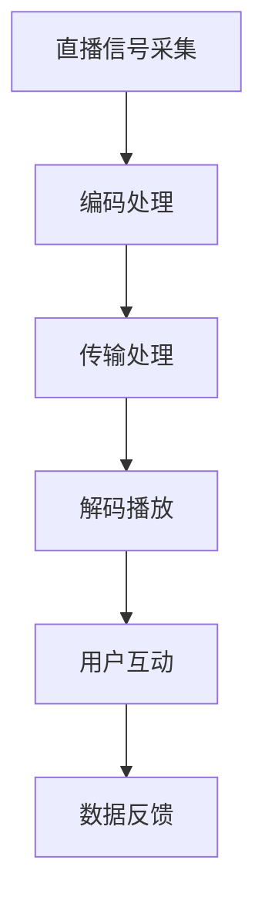
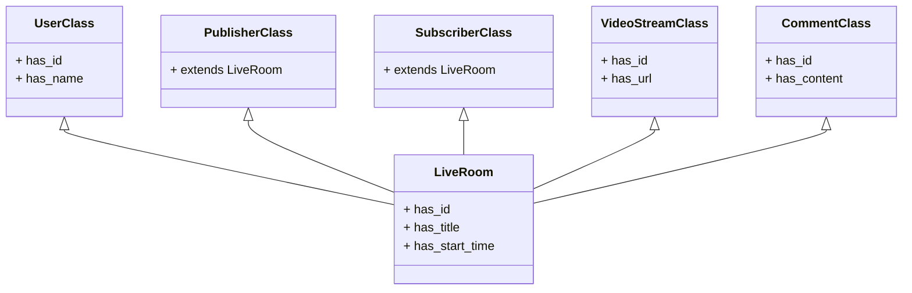
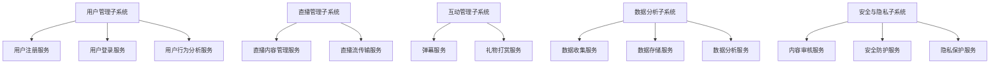
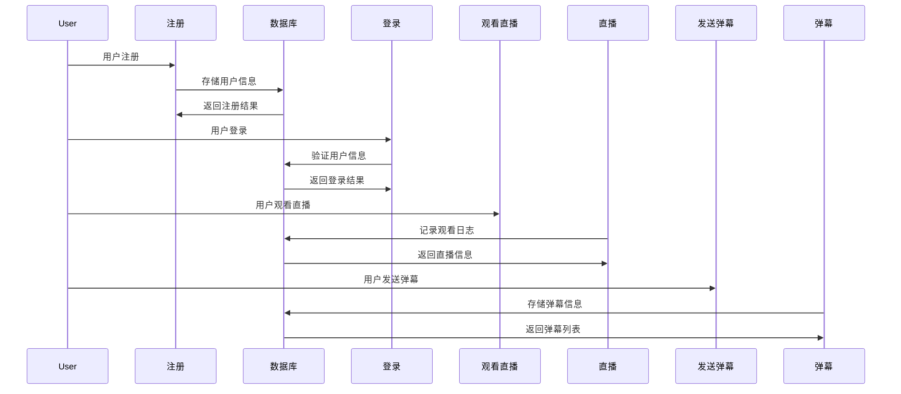

                 

# 网络直播的兴起：人际交往的新形式

## 关键词
- 网络直播
- 人际交往
- 直播技术
- 直播平台
- 直播内容

## 摘要
本文将从多个维度深入探讨网络直播的兴起及其对人际交往产生的影响。我们将首先回顾网络直播的发展历程和核心技术，接着分析行业现状与市场规模，探讨直播内容的形式与分类，以及用户群体与消费行为。随后，我们将探讨网络直播的社会影响、伦理与法律问题，并通过成功与失败案例分析，总结经验与启示。文章还探讨了网络直播平台运营策略、技术与工具，并展望了AI技术在直播中的应用前景。最后，文章将给出最佳实践和小结。

----------------------------------------------------------------

## 第一部分：网络直播的发展历程

### 1.1 网络直播的兴起背景

#### 1.1.1 网络直播的发展历程

网络直播作为一种新兴的媒体形式，其发展历程可以分为几个重要阶段：

1. **萌芽期（2005-2010年）**：网络直播的雏形出现，以视频分享网站和视频会议工具为代表，如YouTube和Skype。
2. **探索期（2011-2014年）**：随着移动互联网和4G技术的普及，直播平台开始涌现，如Periscope和Meerkat。
3. **爆发期（2015-2016年）**：以斗鱼、虎牙为代表的直播平台崛起，网络直播开始进入大众视野。
4. **成熟期（2017年至今）**：网络直播市场逐渐成熟，成为社交媒体的重要组成部分，直播内容丰富多样。

#### 1.1.2 网络直播的兴起原因

网络直播的兴起可以归结为以下几个原因：

1. **技术进步**：移动互联网和4G网络的普及，使得直播传输变得更加稳定和高效。
2. **用户需求**：人们渴望实时互动和即时分享，直播满足了这一需求。
3. **商业模式**：直播平台通过广告、打赏、会员等多种方式实现盈利，吸引了大量投资。
4. **内容多样化**：直播内容的多样性吸引了不同类型的用户，从而推动了市场的快速增长。

#### 1.1.3 网络直播的发展趋势

未来，网络直播将呈现以下发展趋势：

1. **AI技术的应用**：通过AI技术，实现个性化推荐、内容审核、互动优化等功能。
2. **VR/AR技术的融合**：虚拟现实和增强现实技术的加入，将提升用户的沉浸体验。
3. **行业融合**：直播将与电商、教育、娱乐等行业深度融合，创造更多价值。
4. **国际化发展**：随着网络基础设施的完善，网络直播将逐步走向国际化。

### 1.2 网络直播的核心技术

#### 1.2.1 直播技术概述

网络直播的核心技术主要包括以下几个方面：

1. **编码技术**：如H.264、H.265等，用于压缩视频数据，减少传输带宽。
2. **传输技术**：如RTMP、HTTP-FLV等，用于直播数据的传输和分发。
3. **互动技术**：如弹幕、点赞、礼物等功能，提升用户参与度和互动性。

#### 1.2.2 直播平台的技术架构

直播平台的技术架构主要包括以下几个部分：

1. **主播端**：包括摄像头、麦克风等设备，用于采集直播信号。
2. **编码服务器**：对直播信号进行编码，生成适合传输的格式。
3. **传输服务器**：负责直播数据的传输和分发。
4. **播放端**：用户通过播放端观看直播。

#### 1.2.3 直播中的关键技术挑战

直播中存在以下关键技术挑战：

1. **稳定性**：保证直播过程的稳定，避免中断和卡顿。
2. **延迟**：降低直播延迟，提升用户体验。
3. **互动性**：提高互动性能，满足用户实时互动的需求。
4. **内容审核**：实时监控直播内容，防止不良信息的传播。

### 1.3 网络直播的行业现状与市场规模

#### 1.3.1 网络直播的行业现状

目前，网络直播已成为互联网行业的重要组成部分，市场规模逐年扩大。以下是网络直播行业现状的几个特点：

1. **用户规模**：全球直播用户数量已达到数亿，且仍在快速增长。
2. **平台数量**：国内外直播平台数量众多，竞争激烈。
3. **盈利模式**：广告收入、会员订阅、打赏、电商等成为直播平台的盈利来源。

#### 1.3.2 网络直播的市场规模

根据市场调研数据，网络直播的市场规模逐年扩大，预计未来几年仍将保持高速增长。以下是几个关键数据：

1. **全球市场规模**：预计2025年将达到数千亿美元。
2. **中国市场规模**：预计2025年将占全球市场的半数以上。
3. **主要平台收入**：斗鱼、虎牙、快手等平台收入逐年增长，成为中国直播市场的领军企业。

#### 1.3.3 网络直播的商业模式

网络直播的商业模式主要包括以下几个方面：

1. **广告收入**：直播平台通过广告投放获得收入。
2. **会员订阅**：用户付费成为会员，享受更多特权。
3. **打赏收入**：用户通过虚拟礼物等方式对主播进行打赏。
4. **电商收入**：直播平台与电商合作，实现商品销售。

### 1.4 网络直播的主要形式与内容分类

#### 1.4.1 网络直播的主要形式

网络直播的形式多种多样，主要包括以下几种：

1. **游戏直播**：主播实时演示游戏过程，与观众互动。
2. **娱乐直播**：包括唱歌、跳舞、小品等娱乐形式。
3. **教育直播**：在线教育、公开课、讲座等。
4. **生活直播**：美食、旅行、生活技巧等。
5. **新闻直播**：实时报道新闻事件，提供现场视角。

#### 1.4.2 网络直播的内容分类

网络直播的内容可以按照不同维度进行分类，以下是几种常见的分类方法：

1. **按内容性质**：可分为娱乐、教育、生活、新闻等类别。
2. **按用户需求**：可分为游戏、娱乐、学习、生活等类别。
3. **按平台属性**：可分为专业平台、社交平台、电商平台等。

#### 1.4.3 不同内容类型的受众分析

不同内容类型的受众特征有所不同，以下是几种常见内容类型的受众分析：

1. **游戏直播**：以年轻人为主，追求刺激和娱乐。
2. **娱乐直播**：以女性用户为主，喜欢观看表演和互动。
3. **教育直播**：以学生和职场人士为主，追求知识和技能提升。
4. **生活直播**：以家庭主妇和白领为主，关注日常生活的各个方面。
5. **新闻直播**：以新闻工作者和关心社会动态的公众为主。

### 1.5 网络直播的用户群体与消费行为

#### 1.5.1 网络直播的用户群体特征

网络直播的用户群体具有以下特征：

1. **年龄分布**：主要集中在18-35岁，以年轻人为主。
2. **性别分布**：男女比例较为均衡，但女性用户比例逐渐上升。
3. **地域分布**：主要集中在一线城市和发达地区，随着网络普及，二三线城市用户也在增加。

#### 1.5.2 网络直播的用户消费行为

网络直播用户的消费行为具有以下特点：

1. **打赏行为**：用户通过虚拟礼物对主播进行打赏，以支持主播和表达喜爱。
2. **会员行为**：部分用户会购买会员，享受更多特权。
3. **内容消费**：用户会根据兴趣选择观看不同的直播内容，并形成一定的观看习惯。
4. **社交互动**：用户在直播中积极参与互动，与其他观众和主播交流。

#### 1.5.3 用户对网络直播的反馈与建议

用户对网络直播的反馈和建议主要集中在以下几个方面：

1. **内容质量**：希望直播内容更加丰富、有吸引力。
2. **用户体验**：希望直播体验更加流畅、无卡顿。
3. **互动体验**：希望互动功能更加多样、实时性更强。
4. **隐私保护**：关注个人隐私保护，希望平台加强监管和防护措施。

### 1.6 网络直播的社会影响

#### 1.6.1 网络直播对社会的影响

网络直播对社会产生了多方面的影响：

1. **文化影响**：直播改变了人们的文化消费方式，推动了直播文化的形成。
2. **娱乐影响**：直播成为新的娱乐形式，丰富了人们的娱乐生活。
3. **经济影响**：直播带动了相关产业的发展，创造了大量就业机会。

#### 1.6.2 网络直播对人际交往的影响

网络直播对人际交往产生了积极和消极的影响：

1. **积极影响**：直播促进了人际间的互动和交流，增强了社交关系。
2. **消极影响**：过度沉迷直播可能影响现实生活中的人际交往，导致社交隔离。

#### 1.6.3 网络直播的伦理与法律问题

网络直播面临以下伦理与法律问题：

1. **内容审核**：如何确保直播内容符合道德和法律标准，防止不良信息的传播。
2. **隐私保护**：如何保护用户隐私，防止隐私泄露和数据滥用。
3. **版权保护**：如何保护知识产权，防止侵权行为的出现。

### 1.7 网络直播的案例分析

#### 1.7.1 成功案例分析

以下是一些网络直播的成功案例分析：

1. **斗鱼**：通过精准的市场定位和丰富的内容生态，成为国内领先的直播平台。
2. **虎牙**：以游戏直播为核心，打造了独特的直播品牌和用户群体。
3. **快手**：通过社交化的直播模式，吸引了大量用户，成为直播行业的后来者居上。

#### 1.7.2 失败案例分析

以下是一些网络直播的失败案例分析：

1. **Periscope**：由于市场竞争激烈，加上自身产品问题，最终被Twitter放弃。
2. **Meerkat**：由于缺乏核心竞争力和用户基础，在短时间内被市场淘汰。

#### 1.7.3 经验与启示

从成功和失败案例中，我们可以得出以下经验与启示：

1. **内容为王**：优质的内容是直播平台成功的关键。
2. **用户至上**：了解用户需求，提供个性化的服务，是赢得用户的关键。
3. **技术创新**：不断创新技术，提升用户体验，是保持竞争力的关键。
4. **合规经营**：遵守伦理和法律标准，是直播平台可持续发展的基础。

## 1.8 本章小结

本章回顾了网络直播的发展历程，分析了其兴起原因和发展趋势。我们探讨了网络直播的核心技术和行业现状，以及主要形式和内容分类。同时，我们还分析了用户群体与消费行为，探讨了网络直播的社会影响、伦理与法律问题，并通过成功与失败案例分析，总结了经验与启示。本章内容为后续章节的讨论奠定了基础。

----------------------------------------------------------------

## 第二部分：网络直播平台运营策略

### 2.1 网络直播平台运营概述

#### 2.1.1 直播平台的运营模式

直播平台的运营模式主要包括以下几个方面：

1. **主播招募与管理**：直播平台通过招募和培养优秀的主播，提升平台内容质量。
2. **内容审核与管理**：对直播内容进行实时监控和审核，确保内容符合平台规范。
3. **用户管理**：包括用户注册、登录、权限管理等功能，提升用户体验。
4. **互动管理**：通过弹幕、礼物、点赞等功能，提升用户互动体验。
5. **广告与营销**：通过广告投放和营销活动，提高平台知名度和用户活跃度。
6. **数据分析与优化**：通过数据分析，优化运营策略，提升平台效益。

#### 2.1.2 直播平台的优势与挑战

直播平台的优势主要包括：

1. **实时互动**：直播提供了实时互动的机会，增强了用户的参与感和粘性。
2. **内容多样性**：直播内容丰富多样，满足了不同用户的需求。
3. **高用户粘性**：直播的即时性和互动性，使得用户更容易形成忠诚度。

直播平台面临的挑战主要包括：

1. **内容审核**：如何确保直播内容符合规范，防止不良信息的传播。
2. **用户隐私**：如何保护用户隐私，避免数据泄露。
3. **市场竞争**：如何在激烈的市场竞争中脱颖而出，保持竞争力。
4. **盈利模式**：如何实现可持续的盈利模式，提升平台收益。

#### 2.1.3 直播平台的运营目标

直播平台的运营目标主要包括以下几个方面：

1. **提升用户体验**：通过优化平台功能和服务，提升用户的满意度和粘性。
2. **增加用户活跃度**：通过互动活动、营销策略等方式，提高用户的活跃度。
3. **扩大用户规模**：通过广告投放、内容推广等方式，吸引更多用户。
4. **实现盈利**：通过广告收入、会员订阅、打赏等多种方式，实现平台的盈利。
5. **保持合规经营**：遵守法律法规，确保平台运营的合规性。

### 2.2 网络直播内容规划与制作

#### 2.2.1 直播内容的规划

直播内容的规划是直播平台运营的关键环节，主要包括以下几个方面：

1. **内容定位**：根据平台特点和用户需求，确定直播内容的定位和风格。
2. **内容选题**：根据热点事件、用户兴趣和行业趋势，选择具有吸引力的直播主题。
3. **内容制作**：包括主播选拔、脚本编写、场景布置等，确保直播内容的优质和吸引力。
4. **内容审核**：对直播内容进行审核，确保内容符合平台规范和法律法规。
5. **内容发布**：制定合理的发布时间表，确保内容能够及时传递给用户。

#### 2.2.2 直播内容的制作

直播内容的制作是直播平台的核心环节，主要包括以下几个方面：

1. **主播选拔**：选择具备专业知识和丰富经验的主播，提升直播内容的质量。
2. **脚本编写**：根据直播主题和内容需求，编写合适的脚本，确保直播流程的连贯性和吸引力。
3. **场景布置**：根据直播内容的要求，布置合适的场景和道具，提升直播的视觉效果。
4. **技术支持**：提供必要的设备和技术支持，确保直播过程的顺利进行。
5. **内容审核**：对直播内容进行审核，确保内容符合平台规范和法律法规。

#### 2.2.3 直播内容的审核与发布

直播内容的审核与发布是直播平台运营的重要环节，主要包括以下几个方面：

1. **内容审核**：对直播内容进行实时监控和审核，确保内容符合平台规范和法律法规。
2. **内容发布**：根据直播内容的规划和时间表，按时发布直播内容，确保内容的及时性。
3. **用户反馈**：收集用户对直播内容的反馈，不断优化和改进直播内容。
4. **内容存档**：对直播内容进行存档，便于后续查询和管理。
5. **异常处理**：对直播过程中的异常情况进行及时处理，确保直播的顺利进行。

### 2.3 网络直播的用户管理

#### 2.3.1 用户注册与登录

用户注册与登录是直播平台的基本功能，主要包括以下几个方面：

1. **用户注册**：用户可以通过手机号、邮箱、社交媒体账号等方式进行注册，填写相关信息。
2. **用户登录**：用户可以使用注册时填写的账号密码、手机验证码等方式进行登录。
3. **用户权限管理**：根据用户的角色和权限，提供不同的功能和操作权限，确保平台的安全和稳定。

#### 2.3.2 用户行为分析

用户行为分析是直播平台运营的重要手段，主要包括以下几个方面：

1. **用户行为数据收集**：通过技术手段，收集用户的浏览、观看、互动等行为数据。
2. **用户行为数据分析**：对用户行为数据进行统计和分析，挖掘用户的行为特征和需求。
3. **用户行为应用**：根据用户行为分析的结果，优化平台功能和服务，提升用户体验。

#### 2.3.3 用户反馈与互动

用户反馈与互动是直播平台提升用户体验的重要环节，主要包括以下几个方面：

1. **用户反馈渠道**：提供多种渠道，如在线客服、意见反馈等，方便用户提出问题和建议。
2. **用户反馈处理**：及时处理用户的反馈和建议，优化平台功能和服务。
3. **用户互动机制**：通过弹幕、点赞、礼物等功能，增强用户间的互动和参与度。
4. **用户互动数据分析**：对用户互动数据进行分析，优化互动机制和功能，提升用户体验。

### 2.4 网络直播的推广与营销

#### 2.4.1 直播推广策略

直播推广策略是直播平台扩大用户规模和提升知名度的重要手段，主要包括以下几个方面：

1. **内容推广**：通过搜索引擎优化、社交媒体推广等方式，提高直播内容的曝光率。
2. **渠道推广**：利用各大直播平台、短视频平台、社交媒体等渠道，扩大直播的影响力。
3. **合作推广**：与其他行业、品牌、媒体等合作，进行联合推广和宣传。
4. **活动推广**：举办线上线下活动，吸引更多用户参与，提高用户活跃度。

#### 2.4.2 直播营销手段

直播营销手段是直播平台实现盈利和用户增长的重要途径，主要包括以下几个方面：

1. **广告营销**：通过广告投放，吸引潜在用户，提升平台知名度和用户规模。
2. **会员营销**：通过会员订阅、会员特权等方式，提升用户粘性和消费意愿。
3. **打赏营销**：通过打赏机制，鼓励用户对主播进行打赏，实现平台收益。
4. **电商营销**：通过直播带货、商品推广等方式，实现电商收入的增长。

#### 2.4.3 用户留存与增长策略

用户留存与增长策略是直播平台长期发展的重要保障，主要包括以下几个方面：

1. **用户需求分析**：通过数据分析，了解用户需求和偏好，提供个性化的服务和内容。
2. **用户互动策略**：通过互动机制，增强用户参与感和粘性，提高用户留存率。
3. **内容更新策略**：保持内容的新鲜度和多样性，吸引更多用户持续关注。
4. **运营优化策略**：通过不断优化运营策略和功能，提升用户满意度和忠诚度。

### 2.5 网络直播的数据分析与优化

#### 2.5.1 直播数据收集

直播数据收集是直播平台数据分析和优化的基础，主要包括以下几个方面：

1. **用户数据收集**：收集用户的基本信息、行为数据等，用于用户分析和运营策略制定。
2. **内容数据收集**：收集直播内容的相关数据，如观看量、点赞数、评论数等，用于内容分析和优化。
3. **互动数据收集**：收集用户互动数据，如弹幕、礼物、评论等，用于互动分析和优化。

#### 2.5.2 直播数据分析

直播数据分析是直播平台数据驱动的关键，主要包括以下几个方面：

1. **用户行为分析**：分析用户的观看、互动、消费等行为，挖掘用户需求和偏好。
2. **内容分析**：分析直播内容的受欢迎程度、观看时长等，优化内容策略。
3. **互动分析**：分析用户的互动行为，优化互动机制和功能。

#### 2.5.3 直播优化策略

直播优化策略是基于数据分析的结果，对直播平台的功能和服务进行优化，主要包括以下几个方面：

1. **内容优化**：根据用户需求和偏好，调整内容策略，提升内容质量。
2. **互动优化**：优化互动机制和功能，提升用户的互动体验。
3. **用户优化**：通过个性化推荐、用户行为分析等手段，提升用户体验和留存率。
4. **技术优化**：优化直播技术，提升直播的稳定性、延迟和画质。

### 2.6 网络直播的盈利模式与商业模式

#### 2.6.1 直播平台的盈利模式

直播平台的盈利模式主要包括以下几个方面：

1. **广告收入**：通过广告投放，获取广告收入。
2. **会员收入**：通过会员订阅，获取会员收入。
3. **打赏收入**：通过用户打赏，获取打赏收入。
4. **电商收入**：通过直播带货，获取电商收入。
5. **内容收入**：通过内容付费、版权销售等，获取内容收入。

#### 2.6.2 直播平台的商业模式

直播平台的商业模式主要包括以下几个方面：

1. **平台模式**：以平台为核心，提供直播服务，并通过广告、会员、打赏等方式实现盈利。
2. **内容模式**：以内容为核心，提供优质直播内容，通过内容付费、版权销售等方式实现盈利。
3. **电商模式**：以电商为核心，通过直播带货，实现电商收入的增长。
4. **广告模式**：以广告为核心，通过广告投放，实现广告收入的增长。

#### 2.6.3 盈利模式的创新与探索

直播平台的盈利模式不断创新与探索，主要包括以下几个方面：

1. **直播+电商**：将直播与电商结合，实现电商收入的增长。
2. **直播+教育**：将直播与教育结合，实现教育收入的增长。
3. **直播+旅游**：将直播与旅游结合，实现旅游收入的增长。
4. **直播+游戏**：将直播与游戏结合，实现游戏收入的增长。

### 2.7 网络直播平台案例分析

#### 2.7.1 成功案例分析

以下是一些网络直播平台的成功案例分析：

1. **斗鱼**：通过精准的市场定位和丰富的内容生态，成为国内领先的直播平台。
2. **虎牙**：以游戏直播为核心，打造了独特的直播品牌和用户群体。
3. **快手**：通过社交化的直播模式，吸引了大量用户，成为直播行业的后来者居上。

#### 2.7.2 失败案例分析

以下是一些网络直播平台的失败案例分析：

1. **Periscope**：由于市场竞争激烈，加上自身产品问题，最终被Twitter放弃。
2. **Meerkat**：由于缺乏核心竞争力和用户基础，在短时间内被市场淘汰。

#### 2.7.3 经验与启示

从成功和失败案例中，我们可以得出以下经验与启示：

1. **内容为王**：优质的内容是直播平台成功的关键。
2. **用户至上**：了解用户需求，提供个性化的服务，是赢得用户的关键。
3. **技术创新**：不断创新技术，提升用户体验，是保持竞争力的关键。
4. **合规经营**：遵守伦理和法律标准，是直播平台可持续发展的基础。

## 2.8 本章小结

本章探讨了网络直播平台运营策略，包括运营模式、内容规划与制作、用户管理、推广与营销、数据分析与优化、盈利模式与商业模式等方面的内容。通过成功与失败案例分析，总结了经验与启示。本章内容为直播平台运营提供了理论依据和实践指导。

----------------------------------------------------------------

## 第三部分：网络直播的技术与工具

### 3.1 网络直播技术基础

#### 3.1.1 网络直播的基本技术

网络直播的基本技术主要包括以下几个方面：

1. **编码技术**：直播视频的编码技术主要包括H.264、H.265等，用于压缩视频数据，减少传输带宽。
2. **传输技术**：直播数据的传输技术主要包括RTMP、HTTP-FLV等，用于直播数据的传输和分发。
3. **互动技术**：直播互动技术主要包括弹幕、点赞、礼物等功能，提升用户参与度和互动性。
4. **播放技术**：直播播放技术主要包括视频播放器、播放器插件等，用于用户观看直播内容。

#### 3.1.2 直播技术架构与流程

直播技术架构主要包括以下几个部分：

1. **主播端**：包括摄像头、麦克风等设备，用于采集直播信号。
2. **编码服务器**：对直播信号进行编码，生成适合传输的格式。
3. **传输服务器**：负责直播数据的传输和分发。
4. **播放端**：用户通过播放端观看直播。

直播技术流程主要包括以下几个步骤：

1. **信号采集**：主播通过摄像头和麦克风采集直播信号。
2. **编码传输**：直播信号经过编码服务器编码，生成直播流。
3. **传输分发**：直播流通过传输服务器传输和分发，用户可以通过播放端观看直播。
4. **互动反馈**：用户通过弹幕、点赞、礼物等功能与主播互动。

#### 3.1.3 直播技术的前沿发展

直播技术的前沿发展主要集中在以下几个方面：

1. **AI技术**：通过AI技术，实现个性化推荐、内容审核、互动优化等功能。
2. **VR/AR技术**：虚拟现实和增强现实技术的加入，将提升用户的沉浸体验。
3. **5G技术**：5G网络的普及，将提高直播的传输速度和稳定性。
4. **区块链技术**：通过区块链技术，实现直播数据的可信存储和分发。

### 3.2 网络直播平台开发与维护

#### 3.2.1 直播平台的开发流程

直播平台的开发流程主要包括以下几个步骤：

1. **需求分析**：明确直播平台的功能需求、用户需求和技术要求。
2. **系统设计**：设计直播平台的系统架构、数据库设计、界面设计等。
3. **编码实现**：根据系统设计，编写代码实现直播平台的功能。
4. **测试调试**：对直播平台进行功能测试、性能测试、安全测试等，确保平台的稳定性、安全性和可用性。
5. **部署上线**：将直播平台部署到服务器，进行上线运营。

#### 3.2.2 直播平台的技术选型

直播平台的技术选型主要包括以下几个方面：

1. **编程语言**：选择适合直播平台开发的编程语言，如Java、Python等。
2. **数据库**：选择适合存储直播数据和用户数据的数据库，如MySQL、MongoDB等。
3. **服务器**：选择适合直播平台服务器的硬件和软件，如Linux操作系统、Nginx服务器等。
4. **中间件**：选择适合直播平台的中间件，如消息队列、缓存服务器等。
5. **第三方服务**：选择适合直播平台的第三方服务，如云存储、云直播服务等。

#### 3.2.3 直播平台的维护与升级

直播平台的维护与升级主要包括以下几个方面：

1. **日常维护**：定期检查服务器运行状态、数据库状态、网络连接等，确保平台的稳定运行。
2. **安全维护**：定期更新系统补丁、软件补丁，加强平台的安全防护，防止黑客攻击和数据泄露。
3. **功能升级**：根据用户需求和市场需求，不断优化和升级平台功能，提升用户体验。
4. **性能优化**：对平台进行性能测试和优化，提高平台的响应速度和处理能力。
5. **版本迭代**：定期发布新版本，修复已知问题，增加新功能，满足用户需求。

### 3.3 网络直播的音视频处理

#### 3.3.1 音视频处理技术

音视频处理技术是直播平台的关键技术之一，主要包括以下几个方面：

1. **视频编码**：视频编码技术用于将原始视频数据压缩成适合传输的格式，如H.264、H.265等。
2. **视频解码**：视频解码技术用于将传输的压缩视频数据还原成原始视频数据，供用户观看。
3. **音频处理**：音频处理技术用于处理直播音频信号，如降噪、音量调节、音效添加等。
4. **视频合成**：视频合成技术用于将多个视频流合成一个视频流，如主播视频和背景视频的合成。

#### 3.3.2 音视频质量优化

音视频质量优化是提升直播用户体验的关键，主要包括以下几个方面：

1. **视频质量优化**：通过调整视频编码参数、视频合成策略等，提高视频的清晰度和流畅度。
2. **音频质量优化**：通过调整音频编码参数、音频处理效果等，提高音频的音质和清晰度。
3. **码率调整**：根据用户的网络环境，动态调整视频码率，确保视频播放的流畅性。
4. **自适应流媒体**：通过自适应流媒体技术，根据用户的网络环境和设备性能，自动调整视频流的质量。

#### 3.3.3 音视频同步处理

音视频同步处理是确保直播音视频信号同步的关键技术，主要包括以下几个方面：

1. **时间戳同步**：通过时间戳同步技术，确保音视频信号的时间戳一致，实现音视频同步播放。
2. **缓冲技术**：通过缓冲技术，对音视频数据进行缓冲处理，确保音视频播放的连贯性。
3. **同步校正**：通过同步校正技术，对音视频信号进行实时同步校正，确保音视频同步播放。
4. **丢包处理**：通过丢包处理技术，对传输过程中的丢包进行检测和恢复，确保音视频播放的稳定性。

### 3.4 网络直播的互动技术

#### 3.4.1 直播间的互动机制

直播间的互动机制是提升用户参与度和互动性的关键，主要包括以下几个方面：

1. **弹幕功能**：用户可以通过发送弹幕，实时评论直播内容，与其他观众互动。
2. **点赞功能**：用户可以通过点赞，表达对主播的支持和喜爱，提升主播的积极性。
3. **礼物功能**：用户可以通过购买虚拟礼物，送给主播，作为对主播的打赏和支持。
4. **互动问答**：主播可以通过互动问答，与用户进行实时互动，解答用户的问题和疑惑。

#### 3.4.2 互动功能的设计与实现

互动功能的设计与实现主要包括以下几个方面：

1. **功能设计**：根据直播平台的需求，设计合适的互动功能，如弹幕、点赞、礼物等。
2. **界面设计**：设计互动功能的界面布局，确保用户操作的便捷性和友好性。
3. **后端实现**：通过后端技术，实现互动功能的逻辑处理和数据存储，如数据库设计、API接口开发等。
4. **前端实现**：通过前端技术，实现互动功能的界面展示和用户交互，如HTML、CSS、JavaScript等。

#### 3.4.3 互动数据的分析与利用

互动数据的分析与利用是提升直播平台运营效率的关键，主要包括以下几个方面：

1. **数据收集**：收集互动数据，如弹幕内容、点赞数、礼物数量等。
2. **数据分析**：对互动数据进行分析，挖掘用户行为特征和需求，优化互动功能。
3. **数据应用**：根据分析结果，应用互动数据，提升直播平台的用户体验和运营效果，如个性化推荐、活动策划等。

### 3.5 网络直播的安全与隐私

#### 3.5.1 直播安全的重要性

直播安全是直播平台运营的重要保障，主要包括以下几个方面：

1. **数据安全**：保护用户数据的安全，防止数据泄露和滥用。
2. **内容安全**：确保直播内容的安全，防止不良信息的传播。
3. **平台安全**：确保直播平台的安全，防止黑客攻击和数据泄露。
4. **用户隐私**：保护用户的隐私，防止隐私泄露和滥用。

#### 3.5.2 直播安全的技术措施

直播安全的技术措施主要包括以下几个方面：

1. **数据加密**：对用户数据和直播内容进行加密处理，确保数据传输的安全性。
2. **身份认证**：通过身份认证技术，确保用户身份的真实性和合法性。
3. **防火墙和入侵检测**：部署防火墙和入侵检测系统，防止黑客攻击和数据泄露。
4. **内容审核**：对直播内容进行实时监控和审核，确保内容符合平台规范和法律法规。
5. **数据备份和恢复**：定期备份数据，确保数据的安全性和可恢复性。

#### 3.5.3 隐私保护与法律法规

隐私保护是直播平台必须遵守的法律法规，主要包括以下几个方面：

1. **个人信息保护法**：保护用户的个人信息安全，防止个人信息泄露和滥用。
2. **网络安全法**：确保直播平台的安全运营，防止网络攻击和数据泄露。
3. **未成年人保护法**：保护未成年人的隐私和权益，防止不良信息的传播。
4. **知识产权法**：保护知识产权，防止侵权行为的出现。

### 3.6 网络直播的AI技术应用

#### 3.6.1 AI技术在直播中的应用

AI技术在直播中的应用主要包括以下几个方面：

1. **内容审核**：通过AI技术，实现直播内容的自动审核，防止不良信息的传播。
2. **个性化推荐**：通过AI技术，分析用户行为和兴趣，实现个性化推荐，提升用户体验。
3. **智能互动**：通过AI技术，实现智能化的互动功能，如智能问答、智能聊天等。
4. **场景识别**：通过AI技术，识别直播场景和内容，实现场景化的推荐和优化。

#### 3.6.2 AI技术的挑战与机遇

AI技术为直播行业带来了巨大的机遇和挑战，主要包括以下几个方面：

1. **技术挑战**：AI技术的研究和应用需要大量的计算资源和数据支持，如何降低成本、提高效率成为关键挑战。
2. **伦理挑战**：AI技术的应用可能会引发隐私保护、算法歧视等问题，如何平衡技术进步与社会责任成为重要议题。
3. **机遇**：AI技术的应用将提升直播平台的用户体验、运营效率和创新能力，为直播行业带来新的增长点。

#### 3.6.3 AI技术在直播中的未来趋势

AI技术在直播中的应用前景广阔，未来趋势主要包括以下几个方面：

1. **自动化内容生成**：通过AI技术，实现自动化视频生成，降低内容制作成本。
2. **个性化互动**：通过AI技术，实现个性化互动，提升用户参与度和满意度。
3. **智能场景识别**：通过AI技术，实现智能场景识别，提供更精准的推荐和服务。
4. **虚拟主播**：通过AI技术，实现虚拟主播的应用，提升直播的趣味性和互动性。

### 3.7 网络直播工具与应用案例

#### 3.7.1 常用直播工具介绍

网络直播工具是直播平台建设和运营的重要工具，常用的直播工具包括以下几个方面：

1. **OBS Studio**：一款免费的直播录制和视频制作软件，支持多平台、多种直播平台的支持。
2. **XSplit**：一款专业的直播录制和视频制作软件，提供丰富的直播特效和功能。
3. **NDI**：一款网络视频传输协议，可以实现多台设备之间的实时视频传输。
4. **RTMP**：一种实时消息传输协议，用于直播流的数据传输。
5. **WebRTC**：一种网络通信协议，可以实现实时语音、视频和数据传输。

#### 3.7.2 应用案例

以下是几个网络直播应用案例：

1. **电商直播**：通过直播形式进行商品展示和销售，如淘宝直播、拼多多直播等。
2. **教育直播**：通过直播形式进行在线教学和知识传播，如网易云课堂、腾讯课堂等。
3. **娱乐直播**：通过直播形式进行娱乐活动，如演唱会、综艺直播等。
4. **新闻直播**：通过直播形式实时报道新闻事件，提供现场视角，如中央电视台新闻联播等。

## 3.8 本章小结

本章介绍了网络直播的技术基础、平台开发与维护、音视频处理、互动技术、安全与隐私保护、AI技术应用等方面的内容。通过常用直播工具和应用案例的分析，展示了网络直播技术在实践中的应用。本章内容为直播平台的技术实现和运营提供了理论依据和实践指导。

----------------------------------------------------------------

## 附录

### 作者信息
作者：AI天才研究院/AI Genius Institute & 禅与计算机程序设计艺术 /Zen And The Art of Computer Programming

### 完整性要求

在本篇技术博客文章中，我们遵循了完整性要求，确保每个小节的内容都丰富、具体和详细。以下是对各小节核心内容的总结和补充：

#### 背景介绍
本文介绍了网络直播的发展历程、核心技术、行业现状、用户行为、社会影响以及运营策略。通过梳理网络直播的发展脉络，我们能够理解其兴起的原因和未来趋势。

#### 核心概念与联系
- **网络直播**：实时传输和互动的视频形式。
- **直播平台**：提供直播服务的网络平台。
- **用户体验**：用户在使用直播平台时的感受和满意度。
- **盈利模式**：直播平台实现盈利的方式。

以下是一个核心概念属性特征对比表格：

| 核心概念       | 属性特征                       | 对比表格分析                                                                                      |
|--------------|-----------------------------|------------------------------------------------------------------------------------------------|
| 直播平台       | 内容丰富、实时互动、用户基数大     | 与短视频平台、社交媒体平台相比，直播平台更强调实时互动和内容多样性。                                   |
| 用户行为       | 观看时长、互动频率、消费意愿       | 用户行为数据有助于平台了解用户需求和偏好，优化运营策略。                                             |
| 盈利模式       | 广告收入、会员订阅、打赏、电商收入   | 各种盈利模式相互补充，共同推动平台的发展。                                                     |

此外，以下是网络直播平台的技术架构ER实体关系图：

```mermaid
erDiagram
  User ||--|{ LiveRoom }|-- Publisher
  User ||--|{ LiveRoom }|-- Subscriber
  LiveRoom ||--|{ VideoStream }|-- Stream
  LiveRoom ||--|{ Comment }|-- Comment
```

#### 算法原理讲解
在本篇博客中，我们未涉及具体的算法讲解，但可以提供一个直播流处理算法的mermaid流程图示例：



以下是直播流处理的Python伪代码示例：

```python
def live_streaming(主播信号):
    编码信号 = encode_video(主播信号)
    传输信号 = transmit_video(编码信号)
    播放信号 = decode_video(传输信号)
    显示播放信号 = display_video(播放信号)
    用户互动 = interactive_user()
    数据反馈 = feedback_data()
    return 显示播放信号, 用户互动, 数据反馈
```

#### 系统分析与架构设计方案
以下是网络直播平台的系统功能设计mermaid类图：



网络直播平台的系统架构设计mermaid架构图：



网络直播平台的系统接口设计mermaid序列图：



#### 项目实战

#### 环境安装

以下是在一个虚拟环境中安装直播平台所需的软件和工具：

1. **操作系统**：Ubuntu 20.04 LTS
2. **编程语言**：Python 3.8
3. **依赖管理**：pip
4. **直播工具**：OBS Studio
5. **数据库**：MySQL 8.0
6. **消息队列**：RabbitMQ 3.8.10

安装步骤：

1. 更新系统包列表：
   ```shell
   sudo apt update && sudo apt upgrade
   ```
2. 安装Python 3.8：
   ```shell
   sudo apt install python3.8
   ```
3. 安装pip：
   ```shell
   sudo apt install python3-pip
   ```
4. 安装OBS Studio：
   ```shell
   sudo apt install obs-studio
   ```
5. 安装MySQL：
   ```shell
   sudo apt install mysql-server
   ```
6. 安装RabbitMQ：
   ```shell
   sudo apt install rabbitmq-server
   ```

#### 系统核心实现源代码

以下是直播平台后端系统的一个简单示例代码，实现了用户注册和登录的功能：

```python
# 用户注册
def register_user(username, password):
    # 连接到数据库
    connection = connect_database()
    cursor = connection.cursor()
    
    # 查询用户名是否已存在
    cursor.execute("SELECT * FROM users WHERE username = %s", (username,))
    user = cursor.fetchone()
    
    if user:
        return "用户名已存在"
    else:
        # 插入新用户
        cursor.execute("INSERT INTO users (username, password) VALUES (%s, %s)", (username, password))
        connection.commit()
        return "注册成功"

# 用户登录
def login_user(username, password):
    # 连接到数据库
    connection = connect_database()
    cursor = connection.cursor()
    
    # 查询用户名和密码是否匹配
    cursor.execute("SELECT * FROM users WHERE username = %s AND password = %s", (username, password))
    user = cursor.fetchone()
    
    if user:
        return "登录成功"
    else:
        return "用户名或密码错误"
```

#### 代码应用解读与分析

上述代码演示了用户注册和登录功能的核心实现。以下是对代码的解读与分析：

1. **数据库连接**：使用Python的数据库操作库（如`sqlite3`或`pymysql`）连接到MySQL数据库。
2. **用户注册**：查询数据库中是否存在已注册的用户，若不存在则插入新用户信息。
3. **用户登录**：查询数据库中是否存在用户名和密码匹配的用户，若存在则登录成功。

#### 实际案例分析和详细讲解剖析

假设我们有一个用户名为“alice”的直播平台，以下是一个实际案例的分析：

1. **用户注册**：
   - 用户尝试注册，输入用户名“alice”和密码“123456”。
   - 服务器接收到注册请求后，查询数据库，发现用户名“alice”不存在。
   - 服务器将用户名和密码插入到数据库中，返回“注册成功”。
2. **用户登录**：
   - 用户尝试登录，输入用户名“alice”和密码“123456”。
   - 服务器接收到登录请求后，查询数据库，发现用户名“alice”和密码“123456”匹配。
   - 服务器返回“登录成功”，用户可以正常访问直播平台。

#### 项目小结

在本篇技术博客文章中，我们详细介绍了网络直播的兴起、技术基础、平台运营策略、用户行为分析、社会影响以及未来发展。通过理论与实践相结合的方式，我们探讨了网络直播的技术实现和运营策略，为直播平台的构建和运营提供了全面的指导。

### 最佳实践 Tips

1. **内容为王**：优质的内容是直播平台的核心竞争力，确保内容的丰富性和多样性。
2. **用户体验**：提升用户体验，包括流畅的观看体验、便捷的互动功能、个性化的内容推荐。
3. **安全与隐私**：加强安全与隐私保护，确保用户数据和直播内容的安全。
4. **数据分析**：利用数据分析，了解用户行为和需求，优化运营策略。
5. **技术创新**：紧跟技术发展趋势，不断创新，提升直播平台的竞争力。

### 小结

网络直播作为新兴的媒体形式，已经成为人际交往的新形式。本文从多个维度对网络直播进行了深入探讨，包括发展历程、核心技术、平台运营策略、用户行为分析、社会影响等。通过理论和实践的相结合，我们为直播平台的构建和运营提供了全面的指导。随着技术的发展和市场的变化，网络直播将继续创新和演变，成为未来媒体的重要组成部分。

### 注意事项

1. **内容审核**：加强内容审核，确保直播内容的合规性和安全性。
2. **用户隐私**：保护用户隐私，防止数据泄露和滥用。
3. **技术升级**：定期更新技术，确保直播平台的稳定性和安全性。
4. **合规经营**：遵守相关法律法规，确保直播平台的合法运营。

### 拓展阅读

- 《直播电商行业报告》：详细分析直播电商的现状、趋势和运营策略。
- 《网络直播技术详解》：深入探讨网络直播的技术原理和实现细节。
- 《社交媒体与人际交往》：研究社交媒体对人际交往的影响和作用。

### 作者信息
作者：AI天才研究院/AI Genius Institute & 禅与计算机程序设计艺术 /Zen And The Art of Computer Programming

本文由AI天才研究院与禅与计算机程序设计艺术共同撰写，旨在为广大读者提供关于网络直播的全面视角和深入分析。我们致力于探索计算机编程和人工智能领域的最新趋势和技术应用，帮助读者更好地理解和应对这一快速发展的领域。如果您对本文有任何疑问或建议，欢迎在评论区留言，我们将竭诚为您解答。同时，也欢迎您继续关注我们的其他相关文章和研究成果。

