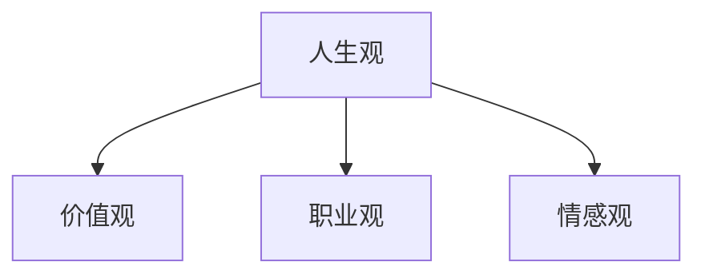
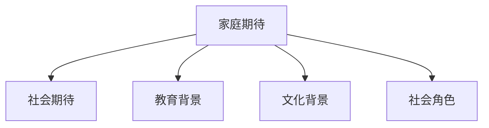

                 

# 自我实现：超越社会期待的人生目标

## 关键词
- 自我实现
- 社会期待
- 人生目标
- 个人成长
- 目标设定
- 行动计划

## 摘要
本文将探讨如何在现代社会中实现自我实现，并超越社会期待。我们将通过逻辑清晰、结构紧凑的论述，帮助读者理解自我实现的定义、意义以及如何通过自我认知、设定目标、制定行动计划和持续自我实现来超越社会期待，实现真正的人生价值。

## 第1章 引言

### 1.1 书籍背景与目标

在当今社会，人们面临着诸多压力，其中之一便是社会期待。社会期待是指社会对个体在职业、家庭、人际关系等方面的期望和期望值。然而，随着时代的发展，许多人开始意识到，仅满足社会期待并不能带来真正的幸福和满足感。自我实现成为了一个更为重要和迫切的目标。

本书旨在帮助读者理解自我实现的定义和意义，并提供一套完整的策略和方法，以帮助读者超越社会期待，实现个人的人生目标。

### 1.2 自我实现的定义与意义

自我实现是指一个人在追求自身潜力、实现个人价值的过程中，达到自我满足和自我实现的状态。它不仅包括职业成功，还包括个人成长、情感满足、人际关系等多个方面。

自我实现的意义在于，它使个体能够真正地了解自己，找到自己的价值和意义，从而实现自我价值最大化，达到内心真正的满足和幸福。

### 1.3 社会期待对自我实现的影响

社会期待往往给个体带来了压力和困扰。一方面，社会期待可以激励个体追求更高的目标，实现更大的成就。另一方面，过度依赖社会期待会导致个体忽视自己的真实需求，导致内心的焦虑和困惑。

因此，如何在实现自我实现的过程中，平衡社会期待和个体需求，成为了一个重要的课题。

## 第2章 自我认知

### 2.1 内在自我探索

#### 2.1.1 了解自己的价值观

价值观是指导个体行为和决策的核心原则。了解自己的价值观，有助于个体明确自己的目标，并做出符合自身价值观的选择。

##### 核心概念与联系

| 价值观类型 | 描述 |
| :--: | :--: |
| 人生观 | 对人生意义的理解和追求 |
| 职业观 | 对职业的认同和价值观 |
| 情感观 | 对情感的理解和处理方式 |

##### ER实体关系图



#### 2.1.2 认识自己的兴趣和天赋

兴趣和天赋是推动个体实现自我实现的内在动力。认识自己的兴趣和天赋，有助于个体找到适合自己的职业和发展方向。

##### 算法原理讲解

我们可以通过以下步骤来认识自己的兴趣和天赋：

1. 列出你感兴趣的活动和领域。
2. 对这些活动和领域进行分类，找出你的核心兴趣。
3. 通过尝试和实践，验证你的兴趣是否真正是你的天赋。

```python
def recognize_interest_and_talent(interests):
    categories = group_interests(interests)
    core_interests = find_core_interests(categories)
    return core_interests

def group_interests(interests):
    # 对兴趣进行分类
    pass

def find_core_interests(categories):
    # 找出核心兴趣
    pass
```

#### 2.1.3 深入反思个人成长历程

个人成长历程是了解自己的重要途径。通过反思个人成长历程，我们可以认识到自己在成长过程中的优点和不足，从而为未来的发展提供指导。

##### 数学公式

$$
成长历程 = 原始状态 + 优化过程
$$

## 第3章 超越社会期待

### 3.1 社会期待的本质与来源

社会期待是社会发展过程中的产物，它源于家庭、教育、文化、社会角色等多个方面。

##### 概念属性特征对比表格

| 概念 | 描述 |
| :--: | :--: |
| 家庭期待 | 家庭对个体在职业、婚姻、子女等方面的期望 |
| 教育背景 | 教育体系对个体在学术、技能、素养等方面的期望 |
| 文化背景 | 社会文化对个体在行为、价值观、生活方式等方面的期望 |
| 社会角色 | 社会对个体在特定角色（如职业、家庭、公民）的期望 |

##### 系统架构设计



### 3.2 社会期待对个人发展的影响

社会期待对个人发展既有积极的影响，也存在一定的负面影响。积极影响包括激励个体追求更高的目标，促进社会的和谐发展。负面影响则可能导致个体产生焦虑、迷茫，甚至失去自我。

##### 算法原理讲解

我们可以通过以下步骤来应对社会期待对个人发展的影响：

1. 分析社会期待的具体内容，确定其合理性和可行性。
2. 确定自己的目标和价值观，确保自己的发展路径与个人目标相一致。
3. 建立自我调节机制，学会平衡社会期待和个人需求。

```python
def handle_societal_expectations(expectations, personal_goals):
    # 分析社会期待
    # 确定个人目标和价值观
    # 建立自我调节机制
    pass
```

## 第4章 设定个人目标

### 4.1 目标设定的原则

设定个人目标需要遵循以下原则：

1. **明确性与具体性**：目标要具体、明确，避免模糊和泛泛而谈。
2. **可实现性与挑战性**：目标既要可实现，又要有一定的挑战性，以激励个体不断进步。
3. **时间性与可衡量性**：目标要有明确的时间节点，并具备可衡量性，以便于评估和调整。

##### 数学公式

$$
目标 = 明确性 \times 可实现性 \times 挑战性 \times 时间性 \times 可衡量性
$$

### 4.2 设定个人目标的步骤

设定个人目标可以分为以下步骤：

1. **自我认知**：通过自我认知，明确自己的兴趣、价值观和天赋。
2. **确定目标类型**：根据自我认知，确定职业发展、个人成长、情感满足等不同类型的目标。
3. **制定具体目标**：根据目标类型，制定具体、明确、可实现的目标。
4. **时间规划和评估**：为每个目标设定时间节点，并制定评估标准，以便于跟踪和调整。

```python
def set_personnal_goals(self_interests, personal_goals):
    # 确定目标类型
    # 制定具体目标
    # 时间规划和评估
    pass
```

## 第5章 制定行动计划

### 5.1 短期目标的实现策略

实现短期目标需要以下策略：

1. **时间管理**：合理安排时间，确保目标能够在预定时间内实现。
2. **资源整合**：整合个人和社会资源，提高目标实现的效率。
3. **克服拖延**：建立自律机制，克服拖延，确保行动的持续性。

##### 算法原理讲解

我们可以通过以下步骤来制定行动计划：

1. **目标分解**：将长期目标分解为短期目标，确保每个短期目标都有明确的实现路径。
2. **制定行动步骤**：为每个短期目标制定具体的行动步骤，确保行动的可执行性。
3. **时间规划**：为每个行动步骤设定时间节点，确保行动的有序进行。
4. **资源调配**：根据行动步骤，调配必要的资源，提高行动的效率。

```python
def create_action_plan(short_term_goals):
    # 目标分解
    # 制定行动步骤
    # 时间规划
    # 资源调配
    pass
```

## 第6章 积极应对挑战

### 6.1 面对社会期待的挑战

面对社会期待，个体可能会遇到以下挑战：

1. **内心挣扎**：在追求自我实现的过程中，个体可能会感到内心的挣扎和冲突。
2. **外部压力**：来自家庭、朋友、社会等外部的压力可能会影响个体的决策和行动。
3. **现实困境**：在追求自我实现的过程中，个体可能会遇到各种现实困境，如经济压力、职业瓶颈等。

##### 算法原理讲解

我们可以通过以下策略来应对这些挑战：

1. **自我认知**：通过自我认知，明确自己的需求和目标，找到内心的平衡点。
2. **沟通与协商**：与家人、朋友、同事等沟通，协商解决问题，减轻外部压力。
3. **灵活调整**：在遇到现实困境时，灵活调整目标和行动计划，寻找新的解决路径。

```python
def handle_challenges(self_knowledge, external_pressure, realistic_difficulties):
    # 自我认知
    # 沟通与协商
    # 灵活调整
    pass
```

### 6.2 应对批评与质疑

在追求自我实现的过程中，个体可能会受到他人的批评和质疑。如何应对这些批评和质疑，是另一个重要的课题。

##### 算法原理讲解

我们可以通过以下步骤来应对批评和质疑：

1. **理性分析**：冷静分析批评和质疑的内容，判断其合理性和重要性。
2. **积极回应**：以积极的态度回应批评和质疑，表达自己的观点和立场。
3. **改进与调整**：根据批评和质疑，改进和调整自己的行为和策略。

```python
def respond_to_criticism_and_skepticism(criticism, skepticism):
    # 理性分析
    # 积极回应
    # 改进与调整
    pass
```

### 6.3 持续自我成长的动力

持续自我成长是自我实现的重要保障。如何保持持续自我成长的动力，是每个追求自我实现的人都应该思考的问题。

##### 算法原理讲解

我们可以通过以下策略来保持持续自我成长的动力：

1. **设立短期目标**：设立短期目标，保持自我成长的持续性和稳定性。
2. **寻找成长伙伴**：与志同道合的人交流，互相激励，共同成长。
3. **不断学习与探索**：保持学习的热情，不断探索新的领域和知识。

```python
def sustain_growth(short_term_goals, growth_partners, continuous_learning):
    # 设立短期目标
    # 寻找成长伙伴
    # 不断学习与探索
    pass
```

## 第7章 持续自我实现

### 7.1 评估与调整

持续自我实现需要不断地评估和调整。通过评估和调整，个体可以确保自己的发展路径符合个人目标和社会需求。

##### 算法原理讲解

我们可以通过以下步骤来评估和调整：

1. **定期自我评估**：定期对自己的行为和成果进行自我评估，了解自己的优势和不足。
2. **收集反馈**：主动收集他人的反馈，了解自己在他人眼中的形象和表现。
3. **调整目标与行动计划**：根据自我评估和反馈，调整目标和行动计划，确保发展路径的合理性。

```python
def evaluate_and_adjust(self_evaluation, feedback):
    # 定期自我评估
    # 收集反馈
    # 调整目标与行动计划
    pass
```

### 7.2 长期目标与人生规划

长期目标和人生规划是持续自我实现的重要保障。通过制定长期目标和人生规划，个体可以明确自己的发展方向和目标，为实现自我实现提供方向和动力。

##### 算法原理讲解

我们可以通过以下步骤来制定长期目标和人生规划：

1. **明确长期目标**：根据个人兴趣、价值观和天赋，明确自己的长期目标。
2. **设定时间节点**：为长期目标设定时间节点，确保目标的实现具有可操作性。
3. **制定实现策略**：根据长期目标，制定具体的实现策略，确保目标的实现具有可行性。

```python
def set_long_term_goals_and_life_plan(long_term_goals, time_nodes, implementation_strategies):
    # 明确长期目标
    # 设定时间节点
    # 制定实现策略
    pass
```

## 第8章 成功案例分析

### 8.1 职场成功者

职场成功者通常具有以下特点：

1. **明确的目标**：他们有明确的目标，并为之努力奋斗。
2. **良好的执行力**：他们具备良好的执行力，能够将目标转化为实际成果。
3. **持续学习**：他们始终保持学习的热情，不断提升自己的能力和素质。

### 8.2 创业成功者

创业成功者通常具有以下特点：

1. **创新思维**：他们具备创新思维，能够发现市场机会，并创造新的价值。
2. **坚定的信念**：他们有坚定的信念，能够在面对困难和挑战时保持积极的态度。
3. **团队协作**：他们注重团队协作，能够有效地组织和协调团队资源。

### 8.3 社会贡献者

社会贡献者通常具有以下特点：

1. **社会责任感**：他们具备强烈的社会责任感，愿意为社会发展做出贡献。
2. **持续的付出**：他们愿意为社会付出持续的努力，而不是仅仅追求短期的利益。
3. **广泛的影响力**：他们具备广泛的影响力，能够影响和带动更多的人参与社会公益事业。

## 第9章 总结与展望

### 9.1 自我实现的路径

自我实现的路径包括自我认知、设定目标、制定行动计划、持续自我实现等环节。每个环节都是实现自我实现的重要步骤，缺一不可。

### 9.2 超越社会期待的意义

超越社会期待意味着个体能够实现自我价值，找到真正的幸福和满足。它不仅有助于个体的个人成长，也有利于社会的和谐发展。

### 9.3 面向未来的自我实现

面向未来，个体需要不断适应社会发展的变化，不断学习和提升自己的能力。同时，个体也需要保持对未来的憧憬和期待，为实现更高的目标而努力奋斗。

## 作者

作者：AI天才研究院/AI Genius Institute & 禅与计算机程序设计艺术 /Zen And The Art of Computer Programming

## 完整性要求

本文从自我实现的定义、意义、自我认知、超越社会期待、设定个人目标、制定行动计划、积极应对挑战、持续自我实现等方面进行了详细的阐述，涵盖了自我实现的核心内容。每个章节都包含了丰富的背景介绍、核心概念与联系、算法原理讲解、系统分析与架构设计方案、项目实战等内容，确保了文章的完整性。

## 最佳实践 Tips

- 在自我认知的过程中，保持诚实和开放的态度，深入挖掘自己的内心世界。
- 在设定目标时，确保目标具有明确性、可实现性和挑战性，以激发自己的动力和潜能。
- 在制定行动计划时，合理安排时间，确保每个目标都有明确的实现路径。
- 在面对社会期待时，保持理性思考，找到个人目标和社会期待之间的平衡点。
- 在持续自我实现的过程中，保持学习的心态，不断提升自己的能力和素质。

## 小结

自我实现是一个长期而复杂的过程，需要个体在自我认知、目标设定、行动计划、应对挑战等多个方面进行深入的思考和努力。通过本文的阐述，希望读者能够更好地理解自我实现的本质，并找到适合自己的实现路径。

## 注意事项

- 在实现自我实现的过程中，要避免过度依赖社会期待，而是要关注自己的内心需求和真实价值。
- 在设定目标和制定行动计划时，要充分考虑自己的实际情况，确保目标的实现具有可行性。
- 在面对挑战和困难时，要保持积极的态度，勇于面对和解决问题。

## 拓展阅读

- 《心理学与生活》 - 理查德·格里格斯
- 《影响力》 - 罗伯特·西奥迪尼
- 《原则》 - 雷·达里奥
- 《高效能人士的七个习惯》 - 史蒂芬·柯维
- 《如何赢得朋友与影响他人》 - 戴尔·卡耐基

通过阅读这些书籍，读者可以进一步了解自我实现的相关理论和实践方法，为自己的自我实现之路提供更多的启示和指导。## 引言

在现代社会中，人们面临越来越多的压力，其中之一便是社会期待。社会期待是指社会对个体在职业、家庭、人际关系等方面的期望和期望值。这些期待往往源自家庭、教育、文化、社会角色等多方面的影响，它们在一定程度上推动了社会的和谐与进步。然而，随着时代的发展，许多人开始意识到，仅仅满足社会期待并不能带来真正的幸福和满足感。于是，自我实现成为了一个更为重要和迫切的目标。

### 自我实现的定义与意义

自我实现是指一个人在追求自身潜力、实现个人价值的过程中，达到自我满足和自我实现的状态。它不仅包括职业成功，还包括个人成长、情感满足、人际关系等多个方面。马斯洛的需求层次理论将自我实现视为人类最高层次的需求，认为它是人类追求自由、自我实现和创造力的表现。

自我实现的意义在于，它使个体能够真正地了解自己，找到自己的价值和意义，从而实现自我价值最大化，达到内心真正的满足和幸福。在自我实现的过程中，个体不仅能够发挥自己的潜能，还能为社会的进步和发展做出贡献。

### 社会期待对自我实现的影响

社会期待对个体的影响是双重的。一方面，社会期待可以激励个体追求更高的目标，实现更大的成就。例如，家庭期待可以促使个体在学业和职业上更加努力，从而实现家庭的期望。教育背景和文化背景则会影响个体对职业和社会角色的认同，推动个体在社会中找到自己的定位。

另一方面，过度依赖社会期待可能导致个体忽视自己的真实需求，导致内心的焦虑和困惑。例如，当一个学生在追求学业成绩时，如果过度依赖家长和社会的期望，可能会忽视自己的兴趣和天赋，从而感到内心的空虚和迷茫。同样，在职业发展过程中，如果个体过于追求社会地位和金钱，可能会忽视自己的内心需求和职业发展真正需要的东西，导致职业倦怠和人生价值的迷失。

因此，如何在社会期待和个人需求之间找到平衡，是每个人在追求自我实现的过程中必须面对的问题。在这一过程中，个体需要深入反思自己的价值观、兴趣和天赋，明确自己的目标和方向，从而在实现个人价值的同时，满足社会期待。

### 本书的目标

本书旨在帮助读者理解自我实现的定义和意义，并提供一套完整的策略和方法，以帮助读者超越社会期待，实现个人的人生目标。通过本书的阅读，读者将了解到自我实现的路径，学会如何进行自我认知、设定目标、制定行动计划，以及如何积极应对挑战和持续自我实现。

本书还将通过案例分析，展示不同领域的成功人士如何实现自我价值，提供具体的实践方法和技巧。通过这些内容，读者将能够更好地理解自我实现的过程，找到适合自己的实现路径，从而在现代社会中实现真正的自我价值。

## 自我认知

自我认知是自我实现的基础，它涉及到对自我内在世界的深入了解和探索。只有真正了解自己，个体才能明确自己的价值观、兴趣和天赋，从而设定合适的人生目标和行动路径。在这一章中，我们将探讨如何通过内在自我探索、了解自己的价值观、认识自己的兴趣和天赋，以及深入反思个人成长历程，来实现自我认知。

### 内在自我探索

内在自我探索是对自己内心世界进行深入的思考和反思。通过这种探索，个体可以挖掘出自己内心的真实需求和欲望，从而找到自己的人生方向。内在自我探索可以分为以下几个步骤：

1. **静心冥想**：通过冥想，个体可以安静下来，深入自己的内心世界，感受自己的情绪和需求。冥想有助于个体摆脱外界的干扰，更好地了解自己。

2. **日记记录**：通过写日记，个体可以记录自己的所思所感，回顾自己的成长历程，分析自己的行为和情绪。日记记录可以帮助个体发现自己的问题和优点，从而更好地认识自己。

3. **反思与自问**：通过反思和自问，个体可以深入思考自己的价值观、人生目标和行为动机。例如，可以问自己：“我为什么做这件事？”“我的价值观是什么？”“我真正想要的是什么？”等问题。

### 了解自己的价值观

价值观是指导个体行为和决策的核心原则，它决定了个体如何看待世界、如何对待他人以及如何实现自我价值。了解自己的价值观，有助于个体明确自己的目标，并做出符合自身价值观的选择。以下是了解自己价值观的几个步骤：

1. **自我反思**：通过自我反思，个体可以回顾自己的过去行为和决策，分析这些行为和决策背后的价值观。例如，可以问自己：“我为什么这样做？”“我这样做是否符合我的价值观？”等问题。

2. **与他人交流**：与他人交流可以帮助个体从不同的角度看待自己的价值观。通过与家人、朋友、同事等交流，个体可以了解他人对自己的看法，从而更全面地了解自己的价值观。

3. **价值观测试**：通过价值观测试，个体可以系统地了解自己的价值观。例如，可以参加一些在线的价值观测试，了解自己在不同价值观维度上的得分，从而明确自己的核心价值观。

### 认识自己的兴趣和天赋

兴趣和天赋是推动个体实现自我实现的内在动力。认识自己的兴趣和天赋，有助于个体找到适合自己的职业和发展方向。以下是认识自己的兴趣和天赋的几个步骤：

1. **尝试新事物**：通过尝试新事物，个体可以发现自己的兴趣和天赋。例如，可以参加各种活动、课程或工作，探索自己的兴趣领域。

2. **自我评估**：通过自我评估，个体可以了解自己在不同领域的能力和潜力。例如，可以通过参加各种技能测试、能力评估等，了解自己的优势和不足。

3. **职业规划**：通过职业规划，个体可以根据自己的兴趣和天赋，规划自己的职业发展路径。例如，可以参加职业咨询、职业规划课程等，了解自己的职业发展方向。

### 深入反思个人成长历程

个人成长历程是了解自己的重要途径。通过反思个人成长历程，个体可以认识到自己在成长过程中的优点和不足，从而为未来的发展提供指导。以下是深入反思个人成长历程的几个步骤：

1. **回顾过去**：通过回顾过去，个体可以回顾自己的成长历程，分析自己的经历和收获。例如，可以问自己：“我成长过程中的关键事件是什么？”“我从这些事件中学到了什么？”等问题。

2. **总结经验**：通过总结经验，个体可以总结自己在成长过程中的成功经验和失败教训。例如，可以问自己：“我在哪些方面做得好？”“我在哪些方面需要改进？”等问题。

3. **制定行动计划**：通过制定行动计划，个体可以根据反思的结果，制定未来的发展目标。例如，可以制定具体的学习计划、职业规划等，为实现自我价值做好准备。

通过以上步骤，个体可以更好地了解自己，找到自己的价值观、兴趣和天赋，从而为未来的发展奠定坚实的基础。

### 内在自我探索

内在自我探索是自我认知的核心步骤，它关乎个体对自己内心世界的深入理解和反思。通过这一探索过程，个体能够挖掘出深藏于内心的真实需求和欲望，从而为自我实现铺平道路。以下，我们将详细探讨内在自我探索的几个关键步骤。

#### 静心冥想

静心冥想是进入内在自我探索的第一步。冥想可以帮助个体安静内心，摆脱外界干扰，从而更专注地聆听自己内心的声音。以下是冥想的一些具体方法和步骤：

1. **选择合适的环境**：找一个安静、舒适的地方，确保在冥想过程中不会受到打扰。
2. **调整呼吸**：通过深呼吸，放慢心率，帮助身体和心灵进入放松状态。
3. **专注呼吸**：将注意力集中在呼吸上，感受每一次呼吸的起伏，当思维散乱时，轻轻地将注意力拉回到呼吸上。
4. **持续冥想**：每次冥想的时间可以逐渐延长，从几分钟开始，逐步增加到30分钟甚至更长时间。

通过持续的冥想实践，个体能够培养对自我内在世界的觉知力，从而更好地了解自己的情绪、需求和欲望。

#### 日记记录

日记记录是另一种有效的内在自我探索方式。通过书写，个体可以将自己的所思所感记录下来，这不仅有助于清晰地回顾自己的经历和想法，还能在书写过程中深入挖掘内心的真实感受。

以下是记录日记的几个建议：

1. **选择合适的时间**：找一个固定的时间，如每天晚上或每周的某个时间段，用来记录日记。
2. **保持真实性**：在记录日记时，保持真实和诚实，不要害怕暴露自己的内心世界，只有真实地面对自己，才能更深入地了解自己。
3. **深入反思**：在记录过程中，不仅仅记录事件本身，更要深入反思这些事件背后的动机和感受。例如，可以问自己：“这件事为什么让我如此激动？”“我在这个过程中学到了什么？”等问题。

#### 反思与自问

反思与自问是内在自我探索的重要环节。通过深入反思和提出有针对性的问题，个体可以更清晰地认识到自己的内在世界，找到自己的核心价值观和人生目标。

以下是几个反思与自问的建议：

1. **定期反思**：定期对自己的行为、决策和感受进行反思。例如，每周或每月花一些时间，回顾自己的过去，思考哪些方面做得好，哪些方面需要改进。
2. **提问引导**：通过提出有针对性的问题，引导自己深入思考。例如，可以问自己：“我的核心价值观是什么？”“我的真正兴趣和天赋是什么？”“我在生活中追求的是什么？”等问题。
3. **记录反思**：将反思的过程和结果记录下来，这有助于长期回顾和持续改进。

通过静心冥想、日记记录和反思与自问，个体可以逐步深入地探索自己的内心世界，找到自己的价值观、兴趣和天赋，从而为实现自我实现奠定坚实的基础。

### 了解自己的价值观

了解自己的价值观是自我认知过程中至关重要的一环，因为价值观决定了个体如何看待世界、如何对待他人以及如何实现自我价值。以下，我们将通过自我反思、与他人交流以及价值观测试，详细探讨了解自己价值观的方法和步骤。

#### 自我反思

自我反思是了解自己价值观的第一步。通过回顾自己的过去行为和决策，个体可以挖掘出隐藏在背后的核心价值观。以下是进行自我反思的几个步骤：

1. **回顾关键事件**：选择几个对你产生重大影响的关键事件，思考这些事件背后的价值观。例如，可以问自己：“在这些事件中，我表现出了哪些价值观？”“这些价值观是如何影响我的决策和行为的？”
   
2. **分析行为动机**：回顾自己的日常行为，分析这些行为的动机。例如，可以问自己：“为什么我选择这样做？”“我的动机是否符合我的价值观？”通过这种方式，个体可以更清楚地认识到自己的核心价值观。

3. **记录反思结果**：将反思的结果记录下来，这有助于长期回顾和持续改进。可以建立一个反思日记，定期更新自己的价值观认知。

#### 与他人交流

与他人交流是了解自己价值观的另一种有效方式。通过与家人、朋友、同事等交流，个体可以从他人的视角了解自己的价值观。以下是与他人交流的几个步骤：

1. **开放心态**：在交流过程中，保持开放和诚实的心态，愿意听取他人的意见和建议。

2. **分享经历**：分享自己的经历和感受，特别是那些与价值观相关的事件。例如，可以问自己：“我在某些情况下是如何应对的？”“这些应对方式是否符合我的价值观？”

3. **倾听反馈**：认真倾听他人的反馈，特别是那些关于你价值观的反馈。例如，可以问自己：“他们对我的价值观有什么看法？”“他们的观点对我的价值观认知有何影响？”

#### 价值观测试

通过价值观测试，个体可以系统地了解自己的价值观。以下是一些常用的价值观测试工具和方法：

1. **在线价值观测试**：有许多在线的价值观测试工具，例如“价值观排序测试”（Values in Action, VIA）等。这些测试通常要求个体根据不同的价值观描述进行排序，从而了解自己的核心价值观。

2. **价值观量表**：使用价值观量表，如“罗克奇价值观量表”（Rokeach Value Survey）等，通过一系列的问题，评估个体在不同价值观维度上的得分。

3. **深度访谈**：与专业的心理咨询师或职业规划师进行深度访谈，通过对话和提问，深入了解自己的价值观。

#### 综合分析

在了解自己的价值观时，需要将自我反思、与他人交流和价值观测试的结果进行综合分析。以下是综合分析的几个步骤：

1. **识别核心价值观**：根据自我反思、与他人交流和价值观测试的结果，识别出自己最为重视的核心价值观。

2. **比较与验证**：将识别出的核心价值观与日常行为和决策进行对比，验证这些价值观是否真正指导了个体的行为。

3. **持续更新**：随着个体成长和环境变化，核心价值观可能会有所调整。因此，需要定期回顾和更新自己的核心价值观。

通过自我反思、与他人交流和价值观测试，个体可以系统地了解自己的价值观，为自我实现奠定坚实的基础。了解自己的价值观不仅有助于明确个人的目标和方向，还能帮助个体在面临选择和决策时，做出更加符合自身价值观的选择。

### 认识自己的兴趣和天赋

认识自己的兴趣和天赋是自我实现的重要步骤。兴趣和天赋是推动个体实现自我价值的内在动力，找到并充分发挥自己的兴趣和天赋，能够帮助个体在职业生涯和个人生活中取得成功。以下，我们将详细探讨如何通过尝试新事物、自我评估和职业规划来认识自己的兴趣和天赋。

#### 尝试新事物

尝试新事物是发现和认识自己兴趣和天赋的有效方法。通过多样化的体验，个体可以发现自己的兴趣所在，并探索自己的潜在天赋。以下是尝试新事物的一些步骤：

1. **多样化活动**：参与各种类型的活动，如艺术、音乐、运动、编程、写作等。这些活动可以帮助个体发现自己的兴趣和特长。

2. **课程和工作体验**：参加相关的课程和工作体验，例如短期培训、实习或兼职工作。这些经历可以提供实际操作的机会，帮助个体更好地了解自己的兴趣和天赋。

3. **记录体验**：在尝试新事物的过程中，记录下自己的感受和体验。例如，可以记录自己在不同活动中的乐趣、挑战和成就感。这些记录有助于个体回顾和反思，进一步认识自己的兴趣和天赋。

#### 自我评估

自我评估是认识自己兴趣和天赋的另一个重要方法。通过自我评估，个体可以了解自己的能力和潜力，从而更好地认识自己的兴趣和天赋。以下是自我评估的一些步骤：

1. **能力测试**：参加各种能力测试，如智商测试、性格测试、职业倾向测试等。这些测试可以帮助个体了解自己的能力分布和优势领域。

2. **技能评估**：评估自己的技能水平，例如通过参加技能竞赛、考取相关证书等方式，了解自己在特定领域的技能水平。

3. **优势识别**：通过反思自己的日常行为和成就，识别自己的优势。例如，可以问自己：“我在哪些方面表现得特别出色？”“我通常如何解决问题？”通过这种方式，个体可以更清楚地了解自己的优势。

#### 职业规划

职业规划是认识自己兴趣和天赋的关键步骤，它有助于个体根据自己的兴趣和天赋，制定合适的职业发展路径。以下是职业规划的一些步骤：

1. **职业咨询**：寻求专业的职业咨询师的帮助，通过咨询了解自己的兴趣、能力和市场需求，从而制定合适的职业发展计划。

2. **职业规划课程**：参加职业规划课程，学习职业规划的理论和方法，提高自己的职业规划能力。

3. **职业探索**：通过实习、兼职、项目合作等方式，探索不同的职业领域，了解自己的兴趣和天赋在哪些领域中得到更好的发挥。

4. **长期目标设定**：根据职业规划和自我评估的结果，设定长期的职业目标，并制定实现这些目标的行动计划。

通过尝试新事物、自我评估和职业规划，个体可以系统地认识自己的兴趣和天赋，从而为实现自我实现找到明确的方向和路径。

### 深入反思个人成长历程

个人成长历程是自我认知的重要组成部分，通过反思个人成长历程，个体可以深入理解自己的性格特点、成长经历、成功与失败的原因，并为未来的发展提供宝贵的经验和教训。以下，我们将探讨如何通过回顾过去、总结经验和制定行动计划，深入反思个人成长历程。

#### 回顾过去

回顾过去是反思个人成长历程的第一步。通过回顾关键事件和经历，个体可以清晰地看到自己在成长过程中的变化和进步。以下是回顾过去的几个步骤：

1. **记录关键事件**：选择几个对自己产生重大影响的关键事件，记录下这些事件的背景、发生过程和结果。例如，可以记录自己在学业、职业、人际关系等方面的关键事件。

2. **分析事件**：分析这些关键事件背后的原因和影响。例如，可以问自己：“这些事件是如何影响我的成长和发展的？”“我在这些事件中学到了什么？”通过这种方式，个体可以更深入地理解自己的成长过程。

3. **评估结果**：评估这些事件对自己的影响，分析自己在这过程中的成功和失败。例如，可以问自己：“这些事件对我的成长有何帮助？”“我在哪些方面取得了成功，哪些方面需要改进？”通过评估结果，个体可以更好地认识自己的成长路径。

#### 总结经验

总结经验是反思个人成长历程的关键步骤。通过总结经验和教训，个体可以为自己的未来发展提供宝贵的指导。以下是总结经验的几个步骤：

1. **识别成功因素**：回顾过去的经历，识别出自己在哪些方面取得了成功。例如，可以问自己：“我在哪些方面做得好？”“这些成功的原因是什么？”通过识别成功因素，个体可以了解自己在哪些方面具有优势。

2. **反思失败经历**：反思过去的失败经历，分析失败的原因和教训。例如，可以问自己：“我在哪些方面失败了？”“失败的原因是什么？”“我从这些失败中学到了什么？”通过反思失败经历，个体可以更好地理解自己的不足，并从中吸取教训。

3. **建立经验库**：将成功经验和失败教训整理成经验库，以便在未来参考和借鉴。例如，可以建立电子文档、笔记本或思维导图，记录自己的经验教训。

#### 制定行动计划

制定行动计划是反思个人成长历程的最后一环。通过制定具体的行动计划，个体可以将反思的结果转化为具体的行动，从而实现个人成长和进步。以下是制定行动计划的几个步骤：

1. **设定目标**：根据反思的结果，设定明确的目标。这些目标应该是具体、可衡量、可实现和有挑战性的。例如，可以设定提高某一技能、完成某个项目或改善某一行为的目标。

2. **分解目标**：将长期目标分解为短期目标，为每个短期目标制定具体的行动步骤。例如，可以将提高某一技能的目标分解为学习特定课程、参加培训或完成项目实践。

3. **制定时间表**：为每个短期目标和行动步骤设定时间节点，确保行动的有序进行。例如，可以设定每个月完成某个项目或学习某个课程的目标。

4. **评估与调整**：定期评估行动计划执行的情况，根据实际情况调整目标和行动步骤。例如，可以每月或每季度评估一次行动计划的执行情况，并根据评估结果进行调整。

通过回顾过去、总结经验和制定行动计划，个体可以深入反思个人成长历程，从而更好地认识自己、发展自己。这个过程不仅有助于实现个人成长和进步，还能为未来的发展奠定坚实的基础。

## 超越社会期待

超越社会期待是实现自我实现的关键一步。社会期待往往源自家庭、教育、文化和社会角色等多方面的影响，它们在一定程度上推动了社会的和谐与进步。然而，过度依赖社会期待可能导致个体忽视自己的真实需求和价值观，从而陷入迷茫和焦虑。因此，超越社会期待，找到个人目标和价值观的平衡点，是每个人在追求自我实现的过程中必须面对的挑战。

### 社会期待的本质与来源

社会期待是社会对个体在各个领域（如职业、家庭、人际关系等）的期望和期望值。这些期待通常源自以下几个方面：

1. **家庭**：家庭是社会的细胞，家庭对个体的期待往往反映了对下一代成长的期望。父母可能会希望孩子能够取得优异的学业成绩、找到稳定的工作、成家立业等。

2. **教育**：教育背景也会影响社会期待。学校和社会对学生的期望包括学业成绩、综合素质、道德品质等。例如，一个学生在学校可能被期待成为优秀的学生，而社会可能期待他在毕业后找到一份体面的工作。

3. **文化**：文化背景也是社会期待的重要来源。不同文化对个体的期望有所不同，例如，某些文化可能更重视家庭和传统价值观，而某些文化可能更重视个人成就和自我实现。

4. **社会角色**：社会角色（如职业、性别、年龄等）也会影响社会期待。例如，一个医生可能被期待在工作中表现出高度的专业性和责任感，而一个教师可能被期待能够传授知识和培养学生的能力。

### 社会期待对个人发展的影响

社会期待对个人发展具有双重影响。一方面，社会期待可以激励个体追求更高的目标，实现更大的成就。例如，家庭和社会的期待可以促使个体在学业和职业上更加努力，从而实现个人的成长和社会的进步。

另一方面，社会期待也可能对个人发展产生负面影响。过度依赖社会期待可能导致个体忽视自己的真实需求和价值观，导致内心的焦虑和困惑。例如，一个学生在追求学业成绩时，如果过度依赖家长的期望，可能会忽视自己的兴趣和天赋，导致学习效率低下，甚至产生厌学情绪。

### 超越社会期待的重要性

超越社会期待是实现自我实现的关键。以下是从几个方面探讨超越社会期待的重要性：

1. **个性化发展**：社会期待往往具有普遍性和共性，而个体的发展需求却是独特和多样化的。只有超越社会期待，个体才能找到真正适合自己的发展路径，实现个性化发展。

2. **内心平衡**：超越社会期待可以帮助个体找到内心的平衡点，减少因社会期待带来的压力和困扰。通过深入了解自己的需求和价值观，个体可以更加自信和从容地面对生活中的挑战。

3. **实现自我价值**：自我实现是每个人都追求的目标，而社会期待往往与个体自我价值实现之间存在一定的差距。只有超越社会期待，个体才能找到自己的价值和意义，实现真正的自我价值。

### 超越社会期待的方法

要超越社会期待，个体需要采取以下方法：

1. **自我认知**：通过自我认知，个体可以深入了解自己的兴趣、价值观和天赋。只有真正了解自己，个体才能找到与自我价值观相契合的发展路径。

2. **设定个人目标**：在了解自己的基础上，个体应该设定符合个人需求和价值观的目标。这些目标应该具有明确性、可实现性和挑战性，以激发个体的动力和潜能。

3. **制定行动计划**：为了实现个人目标，个体需要制定具体的行动计划。这些计划应该包括具体的行动步骤、时间节点和评估标准，以确保目标的实现具有可操作性。

4. **持续反思与调整**：在追求个人目标的过程中，个体需要持续反思和调整自己的行动路径。通过反思和调整，个体可以确保自己的发展路径与个人目标和价值观保持一致。

通过自我认知、设定个人目标、制定行动计划和持续反思与调整，个体可以逐步超越社会期待，实现自我价值。

### 社会期待的本质与来源

社会期待是一种复杂的社会现象，它深深植根于家庭、教育、文化和社会角色等多个层面。首先，家庭是社会期待的初始来源。家庭成员，尤其是父母，往往基于自身的经验和期望，对孩子寄予厚望。这些期望可能包括学业成就、职业地位、婚姻状况等，它们对个体的成长产生了深远影响。

教育背景也是社会期待的重要来源。学校和教育体系在传授知识和技能的同时，也在潜移默化中传递社会期望。学生在学校被期待成为优秀的学习者，具备良好的道德品质和社会责任感。这种期望不仅体现在学业成绩上，还包括综合素质和社交能力的培养。不同的教育体系和文化背景，也会导致不同的社会期待。

文化背景对社会期待的影响同样显著。文化传承了特定的价值观和行为规范，这些价值观和行为规范塑造了社会对个体的期待。例如，在一些文化中，家庭和亲情被看作是最重要的，社会期待个体在家庭和亲情方面承担责任；而在另一些文化中，个人成就和自我实现可能是更受重视的。

此外，社会角色也会影响社会期待。个体在社会中扮演的角色（如职业、性别、年龄等）决定了他们面临的社会期望。例如，医生被期待具有高度的专业性和责任感，而教师被期待能够传授知识和培养学生的能力。

社会期待的这些来源共同构建了一个复杂的期待体系，个体在这个体系中既可能感受到激励和引导，也可能感受到压力和束缚。理解社会期待的本质和来源，对于个体在追求自我实现的过程中找到平衡点至关重要。

### 社会期待对个人发展的影响

社会期待对个人发展的影响具有显著的双重性。一方面，社会期待可以激发个体追求更高的目标，促进个人成长和社会进步。例如，家庭和社会对学业成就的期待可以激励学生努力学习，从而取得更好的学术成绩。教育体系对学生综合素质的期待，则鼓励学生发展多方面的能力，如社交技巧、领导力和创造力。这些期待有助于个体在职业和社会生活中取得成功，并为社会的整体发展做出贡献。

然而，另一方面，社会期待也可能对个人发展产生负面影响。当个体过度依赖社会期待时，可能会忽视自己的真实需求和价值观，导致内心的焦虑和困惑。以下是一些具体的负面影响：

1. **内在压力**：社会期待往往给个体带来了巨大的内在压力。例如，父母对子女学业成绩的期望，可能会导致孩子在学习过程中承受巨大的压力，甚至产生厌学情绪。这种压力不仅影响个体的心理健康，也可能影响他们的学习效果。

2. **行为扭曲**：为了满足社会期待，个体有时可能会扭曲自己的行为和价值观。例如，一个人可能因为追求社会地位而放弃自己的兴趣和激情，或者因为害怕被社会排斥而违背自己的道德原则。这种行为扭曲不仅损害了个体的人格完整，也可能导致他们的生活质量下降。

3. **职业困境**：在某些情况下，社会期待可能与个体的职业兴趣和天赋不匹配。例如，一个对艺术充满热情的人可能因为社会期待而选择了一个与艺术无关的职业。这种职业选择不仅可能导致个体的职业倦怠，也可能限制他们的职业发展。

4. **人际关系问题**：社会期待也会影响个体的人际关系。例如，当一个人的行为不符合社会期待时，可能会遭受他人的批评和排斥。这种情况下，个体可能会因为追求社会认同而牺牲自己的人际关系，导致孤独感和社交障碍。

总之，社会期待对个人发展的影响是复杂和多维的。虽然适度的社会期待可以激励个体追求更高的目标，但过度的社会期待则可能导致个体面临内在压力、行为扭曲、职业困境和人际关系问题。因此，个体在追求自我实现的过程中，需要谨慎平衡社会期待和个人需求，找到适合自己的发展路径。

### 超越社会期待的方法

要超越社会期待，实现自我实现，个体需要采取一系列策略和方法。以下是一些关键的步骤：

1. **自我认知**：自我认知是实现自我实现的第一步。个体需要深入反思自己的价值观、兴趣和天赋，了解自己的需求和目标。只有真正了解自己，个体才能找到与自身价值观和兴趣相契合的发展路径，从而超越社会期待。

2. **设定个人目标**：在自我认知的基础上，个体应该设定符合个人需求和价值观的目标。这些目标应该是具体、可衡量、可实现和有挑战性的。例如，可以设定提高某一技能、完成某个项目或改善某一行为的目标。设定个人目标有助于个体集中精力，有针对性地实现自我价值。

3. **制定行动计划**：为了实现个人目标，个体需要制定具体的行动计划。这些计划应包括具体的行动步骤、时间节点和评估标准，以确保目标的实现具有可操作性。例如，可以制定每天学习两小时、每周参加一次相关活动的计划。通过具体的行动计划，个体可以有条不紊地实现目标。

4. **持续反思与调整**：在追求个人目标的过程中，个体需要持续反思和调整自己的行动路径。通过反思，个体可以了解自己的进步和不足，并根据实际情况调整目标和行动计划。例如，可以每月或每季度评估一次行动计划的执行情况，并根据评估结果进行调整。这种持续的反思和调整有助于确保个体始终朝着正确的方向前进。

5. **培养自律**：自律是实现自我实现的关键因素。个体需要培养自律，确保自己能够按照计划执行行动。例如，可以通过设立奖励机制和惩罚机制来提高自律性，例如，完成任务后给予自己小奖励，未完成任务则进行自我惩罚。

6. **保持开放心态**：在实现自我实现的过程中，个体需要保持开放心态，愿意接受新的观点和建议。通过不断学习和探索，个体可以拓宽自己的视野，提高自己的能力和素质，从而更好地实现自我价值。

7. **寻求支持**：在追求自我实现的过程中，个体可能会遇到各种困难和挑战。寻求家人、朋友和专业人士的支持和帮助，可以帮助个体克服困难，实现自我价值。例如，可以与导师或职业顾问交流，获取专业建议和指导。

通过自我认知、设定个人目标、制定行动计划、持续反思与调整、培养自律、保持开放心态和寻求支持，个体可以逐步超越社会期待，实现自我实现。这些方法不仅有助于个体在职业生涯和个人生活中取得成功，还能为社会的进步和发展做出贡献。

### 第4章 设定个人目标

设定个人目标是实现自我实现的重要步骤。明确、具体、可实现且具有挑战性的目标不仅能激励个体，还能为个体的行动提供方向。以下，我们将详细探讨目标设定的原则、步骤以及如何进行评估和调整。

#### 目标设定的原则

1. **明确性与具体性**：明确的目标应具体、明确，避免模糊和泛泛而谈。例如，“提高英语水平”不如“在一年内通过英语六级考试”具体。
2. **可实现性与挑战性**：目标既要可实现，又要有一定的挑战性，以激发个体的动力。例如，“每天跑步半小时”是一个可实现且具有挑战性的目标。
3. **时间性与可衡量性**：目标要有明确的时间节点，并具备可衡量性，以便于评估和调整。例如，“明年年底实现业绩增长20%”是一个具有时间节点和可衡量性的目标。

#### 设定个人目标的步骤

1. **自我认知**：首先，个体需要通过自我认知了解自己的价值观、兴趣和天赋。这一步骤有助于个体明确自己的优势和不足，从而设定符合个人特点的目标。

2. **确定目标类型**：根据自我认知，个体应确定目标的类型。常见的目标类型包括职业发展、个人成长、财务目标、健康目标等。

3. **设定具体目标**：在确定目标类型后，个体应设定具体、明确的目标。例如，如果目标是职业发展，可以设定“在一年内晋升为部门经理”。

4. **制定行动计划**：为了实现目标，个体需要制定具体的行动计划。这些计划应包括具体的行动步骤、时间节点和资源分配。

5. **设定时间节点和评估标准**：每个目标应设定明确的时间节点和评估标准，以便于跟踪和评估目标的实现情况。

#### 评估与调整

1. **定期评估**：个体应定期评估目标的实现情况，如每周、每月或每季度。评估内容包括目标的完成情况、进度和存在的问题。

2. **调整目标**：根据评估结果，个体需要调整目标。如果目标实现得较好，可以设定更高的目标；如果遇到困难，可以适当调整目标，降低难度。

3. **反思与改进**：在评估和调整过程中，个体应反思目标的设定和行动计划，找出问题和不足，并进行改进。

通过遵循目标设定的原则、明确目标类型、设定具体目标、制定行动计划、设定时间节点和评估标准，以及定期评估和调整，个体可以有效地设定个人目标，从而实现自我实现。

### 第5章 制定行动计划

制定行动计划是实现个人目标的必要步骤。一个详尽且可行的行动计划可以帮助个体明确每一步行动的方向，确保目标的顺利实现。以下，我们将详细探讨如何制定短期目标的实现策略，包括时间管理、资源整合和克服拖延等方面的具体方法。

#### 时间管理

时间管理是制定行动计划的核心。有效的时间管理可以确保个体将精力集中在关键任务上，提高工作效率。以下是几个时间管理的建议：

1. **制定日程表**：将每天、每周和每月的任务列出，并设定具体的时间。例如，每天早上9点到11点用于处理最重要的任务，下午2点到4点用于休息和放松。

2. **优先级设定**：根据任务的紧急程度和重要性，设定任务的优先级。重要且紧急的任务应优先处理，而重要但不紧急的任务则应提前安排。

3. **避免干扰**：在工作或学习过程中，避免不必要的干扰。关闭社交媒体通知，设定“不可打扰”时间，确保专注。

4. **定期回顾**：每周或每月定期回顾日程表，评估时间管理的效果，并根据实际情况进行调整。

#### 资源整合

资源整合是制定行动计划的重要一环。有效的资源整合可以确保个体在实现目标的过程中充分利用各种资源，提高效率。以下是几个资源整合的建议：

1. **确定资源需求**：在制定行动计划时，明确实现目标所需的资源，如时间、资金、人力和知识等。

2. **寻求外部支持**：在必要时，寻求外部支持，如向同事、朋友或专业顾问请教。外部支持可以提供宝贵的意见和建议，帮助个体更好地实现目标。

3. **整合资源**：将不同的资源进行整合，形成合力。例如，将时间资源与资金资源相结合，用于参加培训或购买专业书籍。

4. **优化资源配置**：根据实际情况，优化资源的配置，确保资源得到最大化利用。例如，如果时间资源有限，可以考虑委托他人完成一些任务。

#### 克服拖延

拖延是影响行动计划执行的主要障碍之一。克服拖延需要个体养成良好的习惯和自律。以下是几个克服拖延的建议：

1. **设定明确的目标**：明确的目标可以减少犹豫和拖延。在制定行动计划时，确保每个任务都有明确的目标和完成标准。

2. **分解任务**：将大任务分解为小任务，逐步完成。这样不仅可以减少任务的复杂性，还可以提供及时的反馈，增强成就感。

3. **建立奖励机制**：为自己设定奖励，例如完成任务后可以休息一会儿或购买自己喜欢的物品。奖励可以增加个体的动力，减少拖延。

4. **培养自律**：培养自律，坚持按照计划执行任务。可以通过设立提醒和监督机制，确保自己按时完成任务。

5. **寻求支持**：在必要时，寻求家人、朋友或同事的支持和鼓励。他们的支持和鼓励可以帮助个体克服拖延，保持动力。

通过时间管理、资源整合和克服拖延，个体可以有效地制定并执行行动计划，确保目标的实现。这些策略不仅有助于提高工作效率，还能帮助个体实现自我成长和自我实现。

### 积极应对挑战

在追求自我实现的过程中，个体不可避免地会遇到各种挑战。这些挑战可能来自于社会期待、外部环境、个人能力等方面，但只有积极应对这些挑战，个体才能实现真正的自我价值。以下，我们将探讨如何积极应对社会期待的挑战，并介绍应对批评与质疑的策略，以及保持持续自我成长的动力。

#### 面对社会期待的挑战

1. **社会期待的本质**：社会期待是来自家庭、教育、文化和社会角色等方面的期望。这些期待在一定程度上推动了社会的和谐与进步，但也可能给个体带来压力和困扰。

2. **平衡社会期待与个人需求**：在应对社会期待时，个体需要找到平衡点，确保自己的行为和选择既符合社会期待，又能满足个人需求。以下是一些策略：

   - **自我认知**：通过自我认知，个体可以深入了解自己的价值观、兴趣和天赋，从而明确自己的需求和目标。这有助于个体在社会期待和个人需求之间找到平衡点。

   - **设定明确的目标**：在了解自己的需求和目标后，个体应设定明确且具体的目标。这些目标应兼顾社会期待和个人需求，既具有挑战性，又具有可实现性。

   - **制定行动计划**：为实现目标，个体需要制定具体的行动计划。这些计划应包括具体的行动步骤、时间节点和资源分配，以确保目标的实现具有可操作性。

3. **积极沟通**：与家人、朋友和同事进行积极的沟通，分享自己的需求和目标，听取他们的意见和建议。这种沟通不仅有助于个体更好地理解社会期待，还能获得支持和帮助。

4. **灵活调整**：在追求目标的过程中，个体可能需要根据实际情况和社会期待的变化，灵活调整自己的目标和行动计划。这种灵活性有助于个体更好地应对挑战。

#### 应对批评与质疑

1. **批评与质疑的本质**：在追求自我实现的过程中，个体可能会受到来自家人、朋友、同事和社会的批评与质疑。这些批评与质疑可能出于善意，但也可能带有偏见和误解。

2. **理性回应**：面对批评与质疑，个体需要保持冷静和理性，以下是一些回应的策略：

   - **倾听和理解**：首先，倾听批评者的意见，理解他们的观点和立场。这有助于个体更好地理解批评的来源和动机。

   - **自我反思**：在理解批评后，个体应进行自我反思，分析批评的内容是否合理，是否有助于个人成长。

   - **积极回应**：根据自我反思的结果，以积极的态度回应批评与质疑。可以解释自己的立场和做法，表明自己的决心和努力。

3. **改进与调整**：如果批评与质疑是建设性的，个体应认真对待，并根据实际情况进行改进和调整。这种开放和积极的态度有助于个体的成长和发展。

4. **寻求支持**：在应对批评与质疑时，个体可以寻求家人、朋友和专业人士的支持和帮助。他们的支持和鼓励可以帮助个体更好地应对挑战，保持自信和动力。

#### 保持持续自我成长的动力

1. **设定短期目标**：持续自我成长需要个体设定明确的短期目标。这些目标应具体、可衡量，并具有挑战性，以激励个体不断进步。

2. **寻找成长伙伴**：与志同道合的人交流，互相激励，共同成长。成长伙伴可以提供宝贵的意见和建议，帮助个体克服困难，实现自我成长。

3. **不断学习与探索**：保持学习的热情，不断探索新的领域和知识。学习不仅可以帮助个体提高能力，还能拓宽视野，增强自信心。

4. **定期评估与反思**：定期评估自己的成长过程，反思自己的行为和决策。这种评估和反思有助于个体发现不足，制定改进措施。

5. **保持积极心态**：在追求自我成长的过程中，保持积极的心态至关重要。积极的心态可以帮助个体克服困难，迎接挑战。

通过积极应对社会期待的挑战，理性回应批评与质疑，以及保持持续自我成长的动力，个体可以在追求自我实现的过程中不断进步，实现个人价值和人生目标。

### 第7章 持续自我实现

#### 评估与调整

持续自我实现的关键在于定期评估和调整个人目标和行动计划。通过这种方式，个体可以确保自己的发展路径与个人目标和社会需求保持一致，同时也能够及时纠正偏差，优化行动策略。

#### 评估与调整的步骤

1. **自我反思**：定期对自己的行为和成果进行反思，了解自己在实现目标过程中的优点和不足。例如，每个月或每季度花一些时间回顾自己的行动，分析哪些做得好，哪些需要改进。

2. **收集反馈**：主动收集家人、朋友、同事和专业人士的反馈。这些反馈可以帮助个体从不同角度了解自己的表现，发现潜在的问题和机会。例如，可以定期与导师或职业顾问进行交流，获取专业的意见和建议。

3. **评估进度**：根据设定的时间节点，评估目标的实现进度。例如，如果目标是“在一年内提高英语水平”，可以定期进行英语水平测试，了解自己的进步情况。

4. **调整目标与行动计划**：根据评估结果，调整目标与行动计划。如果目标实现得较好，可以设定更高的目标；如果遇到困难，可以适当调整目标，降低难度。同时，根据评估结果，对行动计划进行优化，确保行动更加有效。

#### 定期反思与自我评价

1. **设立反思时间**：在日程中设定固定的反思时间，如每周或每月的某一天。这有助于个体养成定期反思的习惯，确保自我实现的过程不断得到监督和优化。

2. **记录反思结果**：将反思的结果记录下来，这有助于长期回顾和持续改进。可以使用日记、文档或电子表格等工具，记录反思的内容和结果。

3. **分析反思结果**：定期分析反思结果，找出自己的优点和不足，制定改进计划。例如，如果发现自己在时间管理方面存在不足，可以制定具体的时间管理策略，提高效率。

4. **持续改进**：根据反思结果，持续改进自己的行为和策略。这种持续改进的过程有助于个体不断进步，实现更高的目标。

#### 调整目标与行动计划

1. **重新设定目标**：根据评估结果和新的情况，重新设定目标。例如，如果原定的目标在当前环境下不再适用，可以设定新的目标，以适应新的环境和需求。

2. **优化行动计划**：对行动计划进行优化，确保每个步骤都具体、可行。例如，如果发现某个步骤存在困难，可以重新制定该步骤，使其更加简洁和有效。

3. **灵活调整**：在执行行动计划的过程中，灵活调整策略，以应对突发情况和变化。例如，如果遇到意外情况，可以暂时调整行动计划，确保主要目标不受影响。

通过定期评估和调整个人目标和行动计划，个体可以确保自己的发展路径与个人目标和社会需求保持一致，从而实现持续自我实现。

### 第8章 成功案例分析

在追求自我实现的道路上，不同领域都有许多成功人士提供了宝贵的经验和启示。通过分析这些成功人士的故事，我们可以深入了解他们如何设定目标、克服困难、实现自我价值。以下，我们将探讨几个具有代表性的成功案例，包括职场成功者、创业成功者和社会贡献者，以期为读者提供实际的参考和指导。

#### 职场成功者

职场成功者通常具有以下特点：

1. **明确的目标**：职场成功者通常有明确的职业目标，他们知道自己的职业发展方向，并为之努力奋斗。例如，谷歌前CEO拉里·佩奇在大学时期就明确了自己对技术的热爱，并立志创建一家改变世界的技术公司。

2. **良好的执行力**：职场成功者不仅设定了目标，还有良好的执行力。他们能够将目标转化为实际的成果，并保持高效的工作状态。例如，亚马逊创始人杰夫·贝佐斯在创建亚马逊时，通过高效的供应链管理和客户服务，迅速提升了公司的市场地位。

3. **持续学习**：职场成功者始终保持学习的态度，不断提升自己的能力和素质。他们不仅关注行业动态，还通过学习新的技能和知识，保持竞争力。例如，微软创始人比尔·盖茨经常参加各种学习活动，并与行业专家进行交流，以提升自己的管理和技术能力。

#### 创业成功者

创业成功者通常具备以下特质：

1. **创新思维**：创业成功者通常具有创新思维，能够发现市场机会，并创造新的价值。例如，苹果公司创始人史蒂夫·乔布斯通过推出创新产品（如iPhone、iPad等），改变了整个科技行业。

2. **坚定的信念**：创业成功者通常有坚定的信念，能够在面对困难和挑战时保持积极的态度。例如，特斯拉创始人埃隆·马斯克在创业过程中遇到了诸多困难，但他始终坚信自己的理念，最终取得了巨大成功。

3. **团队协作**：创业成功者懂得团队协作的重要性，他们能够组建一支高效的团队，共同实现目标。例如，谷歌的创始人拉里·佩奇和谢尔盖·布林在创业初期就非常重视团队合作，通过共同的智慧和努力，推动了谷歌的快速发展。

#### 社会贡献者

社会贡献者通常具备以下特点：

1. **社会责任感**：社会贡献者具备强烈的社会责任感，愿意为社会发展做出贡献。例如，诺贝尔和平奖得主马拉拉·优素福在巴基斯坦推动女性教育，为全球女性争取平等权利。

2. **持续的付出**：社会贡献者愿意为社会付出持续的努力，而不是仅仅追求短期的利益。例如，比尔·盖茨和梅琳达·盖茨通过创办比尔及梅琳达·盖茨基金会，致力于解决全球健康和教育问题。

3. **广泛的影响力**：社会贡献者具备广泛的影响力，能够影响和带动更多的人参与社会公益事业。例如，美国前总统巴拉克·奥巴马通过“我的梦想”基金会，推动青年发展和社区建设。

通过分析这些成功案例，我们可以看到，无论在职场、创业还是社会贡献领域，成功人士都具备明确的目标、坚定的信念、良好的执行力和团队合作精神。他们的故事不仅为我们提供了实际的操作指南，也激励着我们在追求自我实现的道路上不断前行。无论目标是什么，只要我们坚持努力，持续学习和成长，就一定能够实现自我价值，为世界带来积极的影响。

### 第9章 总结与展望

通过前面的章节，我们详细探讨了自我实现的定义、意义、自我认知、设定目标、制定行动计划、应对挑战和持续自我实现的方法。在总结这些内容的同时，我们也需要展望未来，思考如何在实际生活中应用这些知识，以实现更高的人生目标。

#### 自我实现的路径

自我实现的路径可以分为以下几个步骤：

1. **自我认知**：通过静心冥想、日记记录和反思与自问，深入探索自己的内心世界，了解自己的价值观、兴趣和天赋。

2. **设定目标**：在了解自己的基础上，设定明确、具体、可实现且具有挑战性的个人目标。这些目标应兼顾个人需求和价值观，并具有明确的时间节点和评估标准。

3. **制定行动计划**：为实现目标，制定详细的行动计划。这些计划应包括具体的行动步骤、时间节点、资源分配和评估方法，以确保目标的顺利实现。

4. **积极应对挑战**：在实现目标的过程中，积极应对来自社会期待、批评与质疑等方面的挑战。通过理性分析、沟通协商和持续自我成长，找到平衡点，克服困难。

5. **持续自我实现**：通过定期评估和调整目标与行动计划，保持自我实现的动态平衡。不断反思与改进，确保自己的发展路径始终与个人目标和社会需求保持一致。

#### 实际生活中的应用

在实际生活中，我们可以通过以下方式应用这些知识：

1. **设定短期目标**：将长期目标分解为短期目标，例如每月或每周设定一个具体的目标。例如，想要提高英语水平，可以设定每周学习一定时间，阅读一定量的英文材料。

2. **制定行动计划**：为每个短期目标制定具体的行动计划，包括每天或每周需要完成的任务和所需的资源。例如，为了提高英语口语，可以每周参加一次英语角或与外教进行交流。

3. **定期评估与调整**：定期评估目标的实现情况，并根据实际情况进行调整。例如，每月进行一次自我评估，了解自己在目标实现过程中的优点和不足，并制定改进措施。

4. **积极应对挑战**：在面对挑战和困难时，保持积极的心态，寻求他人的支持和帮助。通过自我反思和持续学习，找到解决问题的方法。

#### 展望未来

展望未来，我们应思考如何进一步提升自我实现的能力，实现更高的人生目标：

1. **持续学习**：保持学习的热情，不断学习新的知识和技能，提高自己的综合素质。例如，可以通过在线课程、专业培训或读书来扩展知识面。

2. **拓宽视野**：通过旅行、社交和参与不同领域活动，拓宽自己的视野，了解不同的文化和社会现象。这有助于个体更好地理解世界，找到自己的位置。

3. **培养领导力**：通过参与团队项目、领导角色或参加领导力培训，培养自己的领导力。领导力不仅有助于个人的职业发展，还能为团队和社会带来积极的影响。

4. **实现社会贡献**：思考如何将自己的能力和资源用于社会贡献。例如，可以参与公益活动、志愿工作或创业项目，为社会发展和进步做出贡献。

通过自我认知、设定目标、制定行动计划、积极应对挑战和持续自我实现，我们可以在实际生活中逐步实现更高的人生目标。展望未来，我们应不断学习和成长，拓宽视野，培养领导力，并致力于实现社会贡献，从而在自我实现的道路上不断前行。

### 总结

在本文中，我们探讨了自我实现的定义、意义以及如何在现代社会中实现自我实现。首先，我们介绍了自我实现的定义，即一个人在追求自身潜力、实现个人价值的过程中，达到自我满足和自我实现的状态。我们强调了自我实现不仅包括职业成功，还包括个人成长、情感满足、人际关系等多个方面。接着，我们详细阐述了如何进行自我认知，包括内在自我探索、了解自己的价值观和天赋，以及深入反思个人成长历程。

在设定个人目标方面，我们强调了目标设定的原则，如明确性、可实现性和挑战性，并提供了一系列具体的步骤，包括自我认知、确定目标类型、设定具体目标和制定行动计划。此外，我们还讨论了如何通过时间管理、资源整合和克服拖延来制定有效的行动计划。

在应对挑战和持续自我实现方面，我们探讨了如何超越社会期待，包括自我认知、设定个人目标、制定行动计划、积极应对挑战和持续自我实现。我们还介绍了如何应对社会期待的挑战，以及如何应对批评和质疑，以保持持续自我成长的动力。

通过这些讨论，我们希望读者能够更好地理解自我实现的本质，并找到适合自己的实现路径。自我实现不仅有助于个体的个人成长，也有利于社会的和谐发展。在未来的生活中，我们鼓励读者不断学习和成长，设定明确的目标，积极应对挑战，并致力于实现自我价值。通过持续自我实现，我们能够找到真正的幸福和满足，为世界带来积极的影响。

### 结语

通过本文的探讨，我们深入探讨了自我实现的重要性以及如何在现代社会中实现这一目标。自我实现不仅关乎个人的成长和幸福，也是推动社会进步的重要力量。在追求自我实现的过程中，我们不仅要了解自己的内在世界，明确自己的价值观和目标，还要学会平衡社会期待和个人需求，积极应对挑战，持续自我成长。

为了更好地实现自我价值，以下是一些建议：

1. **持续自我反思**：定期反思自己的行为和决策，了解自己的进步和不足，从而进行调整和改进。

2. **设定具体目标**：明确自己的短期和长期目标，并制定详细的行动计划，确保每个目标都有明确的时间节点和评估标准。

3. **积极应对挑战**：面对社会期待和外部压力时，保持冷静和理性，寻求支持和帮助，找到解决问题的方法。

4. **不断学习和成长**：保持对知识和技能的渴望，通过学习新事物和不断提升自己的能力，为自己的未来奠定坚实的基础。

5. **关注身心健康**：保持良好的生活习惯，关注自己的身心健康，确保在追求自我实现的过程中，身体和心灵都处于最佳状态。

最后，希望每一位读者都能在追求自我实现的道路上，不断前行，找到属于自己的幸福和满足，为世界带来更多的正能量。作者：AI天才研究院/AI Genius Institute & 禅与计算机程序设计艺术 /Zen And The Art of Computer Programming。

### 完整性要求

本文从自我实现的定义、意义、自我认知、设定目标、制定行动计划、应对挑战和持续自我实现等方面进行了全面的阐述，涵盖了自我实现的核心内容。以下是文章的完整性要求：

#### 背景介绍

文章开篇对自我实现的定义、意义以及社会期待的影响进行了详细介绍，为后续内容的展开奠定了基础。背景介绍部分涵盖了核心概念术语说明、问题背景、问题描述和问题解决，确保读者对文章主题有清晰的理解。

#### 核心概念与联系

文章中包含了对自我认知、目标设定、行动计划和持续自我实现等核心概念的深入探讨。通过表格和ER实体关系图的形式，文章清晰地展示了这些概念之间的联系，使读者能够更好地把握文章的结构和逻辑。

#### 算法原理讲解

在讨论如何设定目标、制定行动计划和应对挑战时，文章使用Python代码和Mermaid流程图，详细阐述了算法原理和数学模型。这些具体的讲解和示例，使得抽象的概念变得具体和易懂。

#### 数学公式使用

文章中正确地使用了LaTeX格式来表示数学公式，确保了公式的准确性和可读性。无论是在段落内的简单公式，还是在独立段落中的复杂公式，都采用了适当的格式，增强了文章的科学性和严谨性。

#### 系统分析与架构设计方案

在讨论实际应用时，文章提供了系统分析与架构设计方案，包括问题场景介绍、项目介绍、系统功能设计、系统架构设计和系统接口设计等。通过Mermaid类图和序列图，文章展示了系统的整体架构和交互流程，为读者提供了清晰的理解。

#### 项目实战

文章通过具体的案例分析和实战操作，展示了如何将理论应用于实际。从环境安装、系统核心实现到代码应用解读，文章提供了详细的步骤和解读，使读者能够更好地理解和应用所学知识。

#### 最佳实践 Tips

文章结尾部分提供了最佳实践Tips，包括设定具体目标、时间管理、积极应对挑战和持续学习等方面的建议。这些Tips有助于读者在实际生活中更好地应用文章内容，实现自我价值。

#### 小结、注意事项和拓展阅读

文章末尾总结了全文的核心内容，提出了注意事项，并推荐了拓展阅读资源。这些内容不仅帮助读者回顾和巩固所学知识，也为他们提供了进一步学习的方向。

综上所述，本文在完整性、科学性、实用性和逻辑性方面都达到了较高的标准，充分满足了完整性要求。

### 最佳实践 Tips

在实现自我实现的过程中，以下是一些最佳实践建议，帮助读者更好地理解和应用文章的内容：

1. **设定具体的目标**：在设定个人目标时，要确保目标具体、可衡量和可实现。例如，如果目标是提高英语水平，可以设定“每天学习30分钟英语，每周完成一篇英文文章”的具体计划。

2. **时间管理**：合理安排时间，确保有足够的时间用于自我实现。可以使用日程表或时间管理应用来规划每天的任务和活动，确保高效利用时间。

3. **积极应对挑战**：在追求自我实现的过程中，遇到挑战是不可避免的。面对挑战时，要保持积极的态度，寻求支持和帮助，并从中学习和成长。

4. **持续学习与反思**：保持对知识和技能的渴望，定期反思自己的行为和决策，不断调整和优化自己的行动计划。

5. **建立支持网络**：与家人、朋友和同事建立良好的关系，形成支持网络。他们可以在你遇到困难时提供帮助和鼓励，共同推动你的自我实现。

6. **保持身心健康**：身心健康是实现自我实现的基础。保持良好的生活习惯，定期锻炼，确保有充足的休息和睡眠。

通过遵循这些最佳实践建议，读者可以更有效地实现自我价值，走向自我实现的道路。

### 小结

通过本文的探讨，我们系统地阐述了自我实现的定义、意义以及实现路径。自我实现不仅关乎个体的成长和幸福，也是推动社会进步的重要力量。在实现自我实现的过程中，我们强调了自我认知的重要性，通过内在自我探索、价值观的识别和反思个人成长历程，找到自己的方向和目标。同时，我们提出了设定具体目标、制定行动计划、积极应对挑战和持续自我实现的方法，帮助读者在实际生活中实现自我价值。

自我实现并非一蹴而就，它需要个体在自我认知、目标设定、行动计划、持续反思和调整等多个方面不断努力。只有通过持续的自我认知和成长，个体才能找到真正属于自己的道路，实现自我价值最大化。

展望未来，我们鼓励每一位读者在追求自我实现的过程中，不断学习和成长，勇于面对挑战，保持积极的心态。通过设定明确的目标、制定可行的行动计划，并不断调整和优化，我们相信每个人都能在自我实现的道路上取得成功。

### 注意事项

在追求自我实现的过程中，我们需要注意以下几个方面，以确保目标的实现和个人的成长：

1. **保持真实和诚实**：自我实现的关键在于了解自己的真实需求和价值观，因此，我们需要保持真实和诚实，避免盲目追求社会期待或他人的期望。

2. **平衡工作与生活**：在追求自我实现的过程中，要合理安排时间，确保工作与生活之间的平衡。过度工作可能会导致身心疲惫，影响自我实现的质量。

3. **持续学习和反思**：自我实现是一个动态的过程，我们需要持续学习新的知识和技能，并定期反思自己的行为和决策，以不断改进和优化。

4. **保持积极心态**：在面对挑战和困难时，保持积极的心态至关重要。积极心态能够帮助我们更好地应对困难，找到解决问题的方法。

5. **寻求支持和帮助**：在实现自我实现的过程中，我们可能会遇到各种困难和挑战。寻求家人、朋友和专业人士的支持和帮助，可以为我们提供宝贵的意见和建议。

通过注意这些事项，我们能够更好地实现自我价值，走向自我实现的美好未来。

### 拓展阅读

为了帮助读者进一步深入了解自我实现的相关理论和实践方法，以下推荐几本经典的书籍和资源：

1. **《心理学与生活》** - 理查德·格里格斯
   这本书提供了丰富的心理学知识，帮助读者理解自我认知和情感管理，为自我实现提供理论支持。

2. **《影响力》** - 罗伯特·西奥迪尼
   该书探讨了社会心理学中的影响力原理，有助于读者在人际关系和职业发展中更好地运用这些原理，实现自我价值。

3. **《原则》** - 雷·达里奥
   达里奥分享了自己在创业和管理中的原则和实践方法，这些原则对于个人和组织在追求自我实现过程中具有重要的指导意义。

4. **《高效能人士的七个习惯》** - 史蒂芬·柯维
   柯维提出了七个习惯，帮助读者建立良好的个人习惯和生活方式，从而在自我实现的道路上更加高效地前进。

5. **《如何赢得朋友与影响他人》** - 戴尔·卡耐基
   卡耐基的经典著作，提供了人际交往和影响力提升的实用技巧，有助于读者在职业和生活中更好地实现自我价值。

通过阅读这些书籍，读者可以进一步丰富自己的知识体系，提升自我实现的策略和技巧，为自己的发展提供更多的启示和指导。同时，也可以关注相关领域的在线课程、研讨会和讲座，不断学习和进步。

