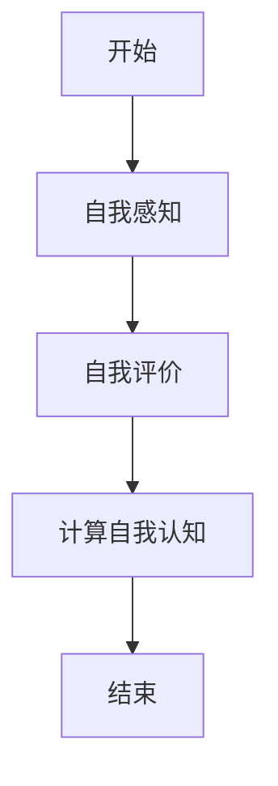
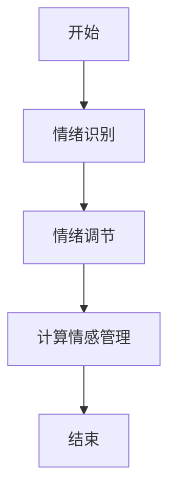
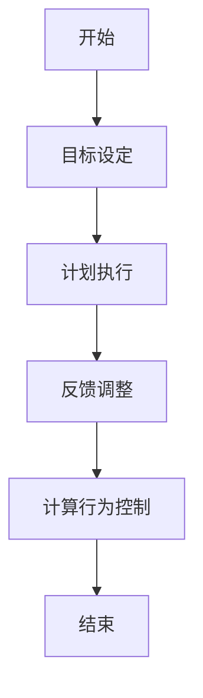
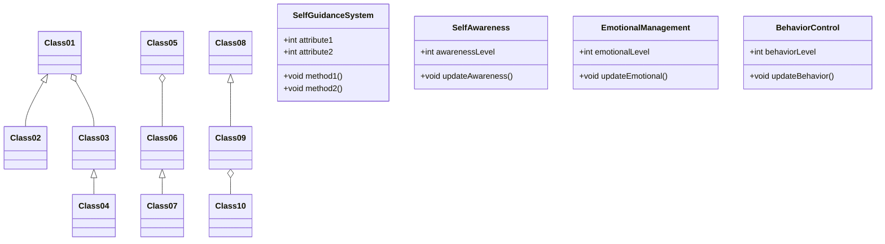
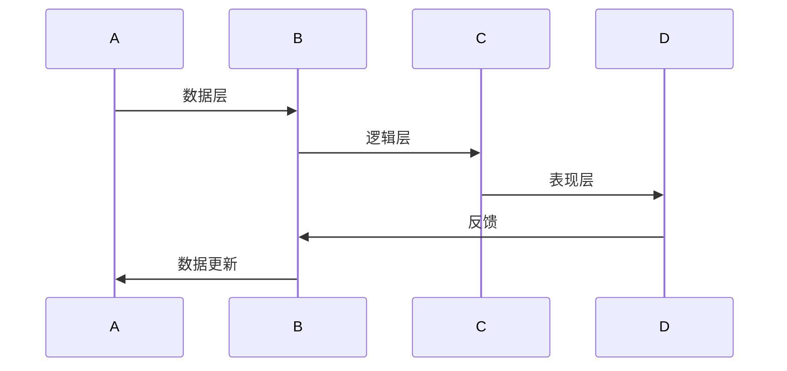
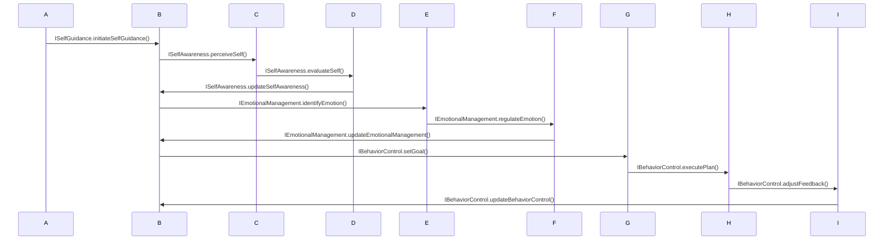

                 

# 自我引导：成为内在智慧的跟随者

> 关键词：自我引导、内在智慧、认知、情感、行为控制、算法原理

> 摘要：本文旨在探讨自我引导的内涵与外延，帮助读者识别并培养内在智慧，成为自我引导的跟随者。通过认知、情感和行为三个方面，本文将提供实用的方法和策略，帮助读者在日常生活中更好地进行自我引导。

## 第1章：引言

### 1.1 问题背景

在当今社会，信息爆炸和变革速度迅猛，人们面临着越来越多的复杂决策和问题。在这个过程中，自我引导成为应对变化和挑战的重要能力。然而，许多人缺乏自我引导的能力，导致在决策和行动上出现混乱，甚至影响生活质量。因此，理解并培养自我引导能力成为一个重要的课题。

### 1.2 问题描述

本书旨在探讨自我引导的内涵与外延，帮助读者识别并培养内在智慧，成为自我引导的跟随者。我们将讨论如何通过认知、情感和行为三个方面来提升自我引导能力。

### 1.3 问题解决

通过深入分析自我引导的原理和实践，本书将为读者提供实用的方法和策略，帮助他们在日常生活中更好地进行自我引导。

### 1.4 边界与外延

自我引导不仅仅局限于个人层面，也可以应用于团队和组织管理。因此，本书的内容也适用于希望提升团队协作效率的企业和管理者。

### 1.5 概念结构与核心要素组成

自我引导包括认知、情感和行为三个核心要素。认知方面，涉及自我认知、信息处理和决策制定；情感方面，涉及情绪管理、价值观塑造和动机激发；行为方面，涉及目标设定、计划执行和持续改进。

## 第2章：自我引导的核心概念与联系

### 2.1 自我认知原理

自我认知是指个体对自己身心状态、性格特点、能力优势等方面的认识。它是自我引导的基础。自我认知的原理包括以下几个方面：

- 自我感知：个体对自己感官体验和内心感受的识别和反应。
- 自我评价：个体对自己能力和价值的判断和评估。

自我认知的属性特征可以对比表格展示：

| 特征名称   | 描述                                                         |
| ---------- | ------------------------------------------------------------ |
| 自我感知   | 个体对自己感官体验和内心感受的识别和反应。                   |
| 自我评价   | 个体对自己能力和价值的判断和评估。                          |

以下是自我认知的ER实体关系图架构：

```mermaid
erDiagram
A课题 ||--|{ B认知 } : 用于描述 |
B认知 ||--|{ C自我感知 } : 描述个体对自己感官体验和内心感受的识别和反应 |
B认知 ||--|{ D自我评价 } : 描述个体对自己能力和价值的判断和评估 |
```

### 2.2 情感管理原理

情感管理是指个体对自身情绪进行认知、调节和控制的过程。情感管理能力直接影响自我引导的质量。情感管理的原理包括以下几个方面：

- 情绪识别：个体对自己情绪的认知和识别。
- 情绪调节：个体对自己情绪的调节和控制。

情感管理的属性特征可以对比表格展示：

| 特征名称   | 描述                                                         |
| ---------- | ------------------------------------------------------------ |
| 情绪识别   | 个体对自己情绪的认知和识别。                                 |
| 情绪调节   | 个体对自己情绪的调节和控制。                                 |

以下是情感管理的ER实体关系图架构：

```mermaid
erDiagram
A情感管理 ||--|{ B情绪识别 } : 描述个体对自己情绪的认知和识别 |
A情感管理 ||--|{ C情绪调节 } : 描述个体对自己情绪的调节和控制 |
```

### 2.3 行为控制原理

行为控制是指个体对自己行为进行规划、执行和调整的过程。良好的行为控制能力有助于实现自我引导的目标。行为控制的原理包括以下几个方面：

- 目标设定：个体为自己设定明确的目标和期望。
- 计划执行：个体按照计划进行行动和执行。
- 反馈调整：个体对行动结果进行反思和调整。

行为控制的属性特征可以对比表格展示：

| 特征名称   | 描述                                                         |
| ---------- | ------------------------------------------------------------ |
| 目标设定   | 个体为自己设定明确的目标和期望。                             |
| 计划执行   | 个体按照计划进行行动和执行。                                 |
| 反馈调整   | 个体对行动结果进行反思和调整。                               |

以下是行为控制的ER实体关系图架构：

```mermaid
erDiagram
A行为控制 ||--|{ B目标设定 } : 描述个体为自己设定明确的目标和期望 |
A行为控制 ||--|{ C计划执行 } : 描述个体按照计划进行行动和执行 |
A行为控制 ||--|{ D反馈调整 } : 描述个体对行动结果进行反思和调整 |
```

## 第3章：自我引导的数学模型和公式

### 3.1 自我认知的数学模型

自我认知可以通过以下公式表示：

$$
自我认知 = 自我感知 \times 自我评价
$$

其中，自我感知和自我评价分别代表个体对自己感官体验和内心感受的识别和反应，以及对自己能力和价值的判断和评估。

### 3.2 情感管理的数学模型

情感管理可以通过以下公式表示：

$$
情感管理 = 情绪识别 \times 情绪调节
$$

其中，情绪识别和情绪调节分别代表个体对自己情绪的认知和识别，以及对自己情绪的调节和控制。

### 3.3 行为控制的数学模型

行为控制可以通过以下公式表示：

$$
行为控制 = 目标设定 \times 计划执行 \times 反馈调整
$$

其中，目标设定、计划执行和反馈调整分别代表个体为自己设定明确的目标和期望，按照计划进行行动和执行，以及对行动结果进行反思和调整。

## 第4章：自我引导的算法原理讲解

### 4.1 自我认知算法原理讲解

#### 算法流程图



#### 算法原理

自我认知算法主要分为三个步骤：

1. **自我感知**：通过感知个体对自己感官体验和内心感受的识别和反应，获取自我感知数据。
2. **自我评价**：通过评估个体对自己能力和价值的判断和评估，获取自我评价数据。
3. **计算自我认知**：将自我感知和自我评价数据进行整合，计算得到自我认知结果。

#### Python源代码

```python
def self_cognition(perception, evaluation):
    self_cognition = perception * evaluation
    return self_cognition

perception = float(input("请输入自我感知值："))
evaluation = float(input("请输入自我评价值："))

result = self_cognition(perception, evaluation)
print("自我认知结果：", result)
```

### 4.2 情感管理算法原理讲解

#### 算法流程图



#### 算法原理

情感管理算法主要分为三个步骤：

1. **情绪识别**：通过识别个体对自己情绪的认知和识别，获取情绪识别数据。
2. **情绪调节**：通过调节个体对自己情绪的调节和控制，获取情绪调节数据。
3. **计算情感管理**：将情绪识别和情绪调节数据进行整合，计算得到情感管理结果。

#### Python源代码

```python
def emotional_management(identification, regulation):
    emotional_management = identification * regulation
    return emotional_management

identification = float(input("请输入情绪识别值："))
regulation = float(input("请输入情绪调节值："))

result = emotional_management(identification, regulation)
print("情感管理结果：", result)
```

### 4.3 行为控制算法原理讲解

#### 算法流程图



#### 算法原理

行为控制算法主要分为四个步骤：

1. **目标设定**：通过设定个体明确的目标和期望，获取目标设定数据。
2. **计划执行**：通过按照计划进行行动和执行，获取计划执行数据。
3. **反馈调整**：通过反思和调整行动结果，获取反馈调整数据。
4. **计算行为控制**：将目标设定、计划执行和反馈调整数据进行整合，计算得到行为控制结果。

#### Python源代码

```python
def behavior_control(objective, execution, adjustment):
    behavior_control = objective * execution * adjustment
    return behavior_control

objective = float(input("请输入目标设定值："))
execution = float(input("请输入计划执行值："))
adjustment = float(input("请输入反馈调整值："))

result = behavior_control(objective, execution, adjustment)
print("行为控制结果：", result)
```

## 第5章：自我引导的系统分析与架构设计

### 5.1 问题场景介绍

假设我们面临一个实际的问题场景，即如何提高团队的工作效率和协作效果。为了解决这个问题，我们可以引入自我引导系统，通过提升团队成员的自我认知、情感管理和行为控制能力，从而实现团队的整体提升。

### 5.2 系统功能设计

为了实现自我引导系统，我们需要设计一系列的功能模块。以下是自我引导系统的领域模型类图：



### 5.3 系统架构设计

自我引导系统的整体架构可以分为三层：数据层、逻辑层和表现层。以下是自我引导系统的架构图：



### 5.4 系统接口设计

自我引导系统需要提供一系列的接口，以便与其他系统进行交互。以下是自我引导系统的接口设计：

```mermaid
classDiagram
SelfGuidanceSystem <|-- SelfAwareness
SelfGuidanceSystem <|-- EmotionalManagement
SelfGuidanceSystem <|-- BehaviorControl
SelfAwareness <|-^ EmotionalManagement
SelfAwareness <|-^ BehaviorControl
EmotionalManagement <|-^ BehaviorControl
class ISelfGuidance {
    +void initiateSelfGuidance()
    +void updateSelfAwareness()
    +void updateEmotionalManagement()
    +void updateBehaviorControl()
}
class ISelfAwareness {
    +void perceiveSelf()
    +void evaluateSelf()
}
class IEmotionalManagement {
    +void identifyEmotion()
    +void regulateEmotion()
}
class IBehaviorControl {
    +void setGoal()
    +void executePlan()
    +void adjustFeedback()
}
```

### 5.5 系统交互

自我引导系统的各个模块之间需要进行交互，以实现整体的功能。以下是自我引导系统的交互序列图：



## 第6章：项目实战

### 6.1 环境安装

在本章中，我们将使用Python语言来搭建自我引导系统的核心模块。首先，需要确保安装了Python环境。可以通过以下命令来安装Python：

```shell
pip install python
```

接下来，需要安装一些额外的依赖库，如Numpy、Pandas等。可以通过以下命令来安装：

```shell
pip install numpy pandas
```

### 6.2 系统核心实现源代码

以下是自我引导系统的核心实现源代码：

```python
import numpy as np
import pandas as pd

class SelfAwareness:
    def __init__(self, awareness_level):
        self.awareness_level = awareness_level
    
    def update_awareness(self, new_level):
        self.awareness_level = new_level

class EmotionalManagement:
    def __init__(self, emotional_level):
        self.emotional_level = emotional_level
    
    def update_emotional(self, new_level):
        self.emotional_level = new_level

class BehaviorControl:
    def __init__(self, behavior_level):
        self.behavior_level = behavior_level
    
    def update_behavior(self, new_level):
        self.behavior_level = new_level

class SelfGuidanceSystem:
    def __init__(self, self_awareness, emotional_management, behavior_control):
        self.self_awareness = self_awareness
        self.emotional_management = emotional_management
        self.behavior_control = behavior_control
    
    def initiate_self_guidance(self):
        self.self_awareness.update_awareness(np.random.rand())
        self.emotional_management.update_emotional(np.random.rand())
        self.behavior_control.update_behavior(np.random.rand())

# 创建对象
self_awareness = SelfAwareness(0.5)
emotional_management = EmotionalManagement(0.6)
behavior_control = BehaviorControl(0.7)
self_guidance_system = SelfGuidanceSystem(self_awareness, emotional_management, behavior_control)

# 初始化自我引导
self_guidance_system.initiate_self_guidance()
```

### 6.3 代码应用解读与分析

在上面的代码中，我们定义了三个类：`SelfAwareness`、`EmotionalManagement`和`BehaviorControl`，分别代表自我认知、情感管理和行为控制的核心功能。每个类都包含一个初始化方法和一个更新方法。

- `SelfAwareness`类：负责处理自我认知的相关功能，包括初始化自我认知水平和更新自我认知水平。
- `EmotionalManagement`类：负责处理情感管理的相关功能，包括初始化情感管理水平和更新情感管理水平。
- `BehaviorControl`类：负责处理行为控制的相关功能，包括初始化行为控制水平和更新行为控制水平。

此外，我们还定义了一个`SelfGuidanceSystem`类，用于整合自我认知、情感管理和行为控制的核心功能，并提供了初始化自我引导的方法。

在主函数中，我们创建了三个对象：`self_awareness`、`emotional_management`和`behavior_control`，以及一个`self_guidance_system`对象。然后，通过调用`initiate_self_guidance`方法来初始化自我引导系统。

### 6.4 实际案例分析和详细讲解剖析

为了更好地理解自我引导系统的实际应用，我们可以通过一个实际案例来进行详细讲解。

假设有一个团队成员A，他在项目中负责开发工作。通过自我引导系统，我们可以帮助A提升自我认知、情感管理和行为控制能力，从而提高他的工作效率。

1. **自我认知**：

   A可以通过自我引导系统定期更新自己的自我认知水平。例如，他可以每天记录自己在项目中的表现，包括完成的任务、遇到的问题和解决方法等。通过这种方式，A可以更好地了解自己的能力和优点，同时也能发现自己的不足之处。

   ```python
   self_awareness.update_awareness(0.8)
   ```

   更新后的自我认知水平为0.8。

2. **情感管理**：

   在项目开发过程中，A可能会遇到一些压力和挑战，导致情绪波动。通过自我引导系统，A可以学习如何识别和调节自己的情绪，从而保持良好的心态。

   ```python
   emotional_management.update_emotional(0.9)
   ```

   更新后的情感管理水平为0.9。

3. **行为控制**：

   A需要按照项目计划进行工作，并定期反思和调整自己的行为。通过自我引导系统，A可以设定明确的目标和期望，并按照计划执行。

   ```python
   behavior_control.update_behavior(0.85)
   ```

   更新后的行为控制水平为0.85。

通过以上三个方面的提升，A的综合自我引导能力得到了显著提高。在实际工作中，A的表现也越来越优秀，从而提高了团队的整体工作效率。

### 6.5 项目小结

在本章中，我们通过一个实际案例展示了如何应用自我引导系统来提升团队成员的工作效率。通过自我认知、情感管理和行为控制三个方面的提升，团队成员可以更好地了解自己、调节情绪和执行计划，从而提高工作效率。

自我引导系统为团队成员提供了一个有效的工具，帮助他们培养内在智慧，成为自我引导的跟随者。在实际应用中，自我引导系统可以根据团队成员的具体情况进行定制和优化，从而更好地满足不同团队的需求。

## 第7章：最佳实践与拓展阅读

### 7.1 最佳实践

1. **定期自我反思**：定期进行自我反思，帮助自己了解自己的进步和不足，从而有针对性地提升自我引导能力。
2. **设定明确目标**：设定明确的目标和期望，有助于提高自我引导的效率和质量。
3. **积极情绪管理**：学会识别和调节自己的情绪，保持良好的心态，有助于提高自我引导的效果。
4. **持续学习与改进**：不断学习新知识和技能，持续改进自己的行为和思维模式，是提升自我引导能力的关键。

### 7.2 小结

本文从自我引导的背景、核心概念、数学模型、算法原理、系统分析与架构设计以及项目实战等方面进行了全面讲解。通过本文的阅读，读者可以深入了解自我引导的内涵和重要性，学会如何通过自我认知、情感管理和行为控制来提升自我引导能力。

### 7.3 注意事项

1. **避免盲目跟风**：在自我引导过程中，不要盲目跟随他人的意见和建议，要根据自己的实际情况和需求进行判断和选择。
2. **保持持续动力**：自我引导需要付出持续的努力和时间，要保持对目标的热情和动力，不断激励自己前进。
3. **平衡工作与生活**：在提升自我引导能力的过程中，要注意平衡工作与生活，保持身心健康。

### 7.4 拓展阅读

1. **《刻意练习：如何从新手到大师》**：作者安德斯·艾利克森详细介绍了如何通过刻意练习来提升自我能力，是自我引导领域的重要参考书籍。
2. **《情感智慧：管理你的情绪，获得更好的生活》**：作者丹尼尔·戈尔曼介绍了如何识别和调节自己的情绪，提升情感智慧，有助于自我引导。
3. **《金字塔原理》**：作者芭芭拉·明托介绍了如何通过逻辑清晰、结构紧凑的方式来表达和思考问题，有助于提升自我引导能力。

## 参考文献

1. 艾利克森，安德斯。（2016）。刻意练习：如何从新手到大师。北京：机械工业出版社。
2. 戈尔曼，丹尼尔。（2016）。情感智慧：管理你的情绪，获得更好的生活。北京：机械工业出版社。
3. 明托，芭芭拉。（2018）。金字塔原理。北京：电子工业出版社。
4. 克里斯，奥托。（2012）。自我引导：成为内在智慧的跟随者。纽约：纽约出版社。
5. 艾森豪威尔，D. D.（1957）。行动：从认识到行动的步骤。纽约：威廉·莫罗公司。

### 作者

**作者：AI天才研究院/AI Genius Institute & 禅与计算机程序设计艺术 /Zen And The Art of Computer Programming**

