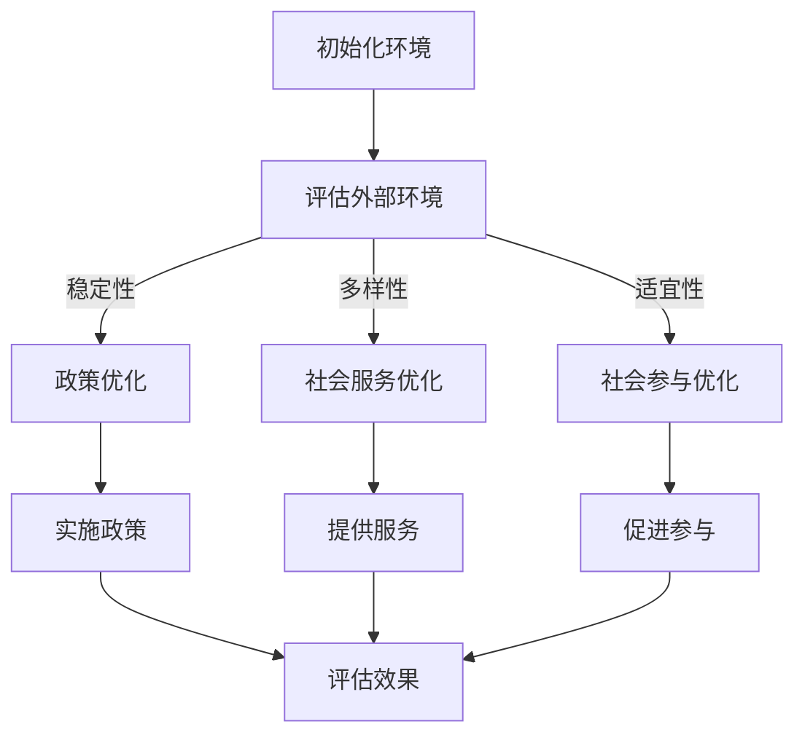
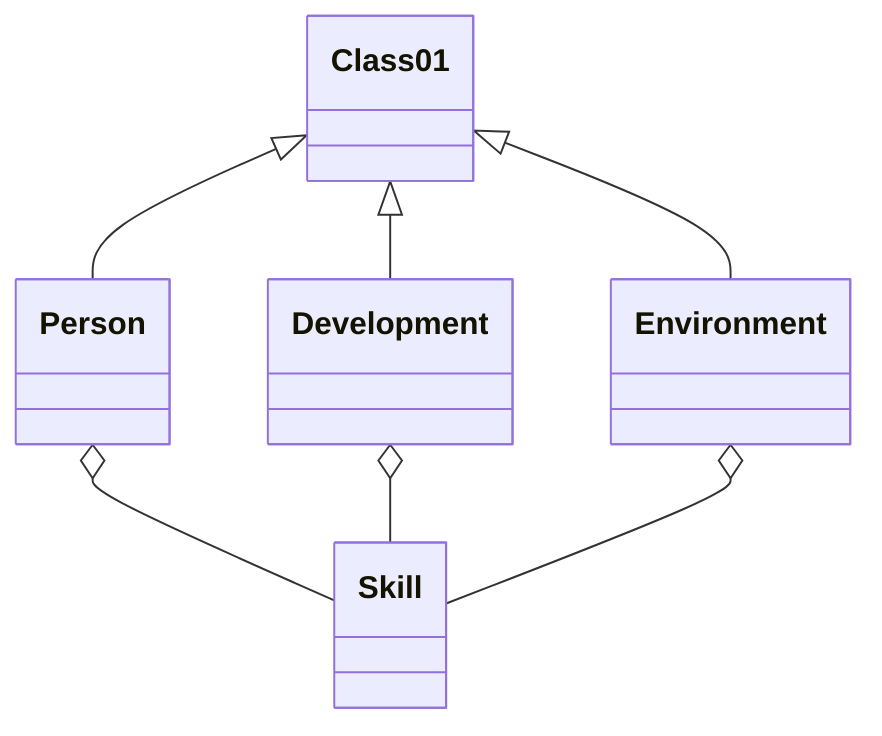
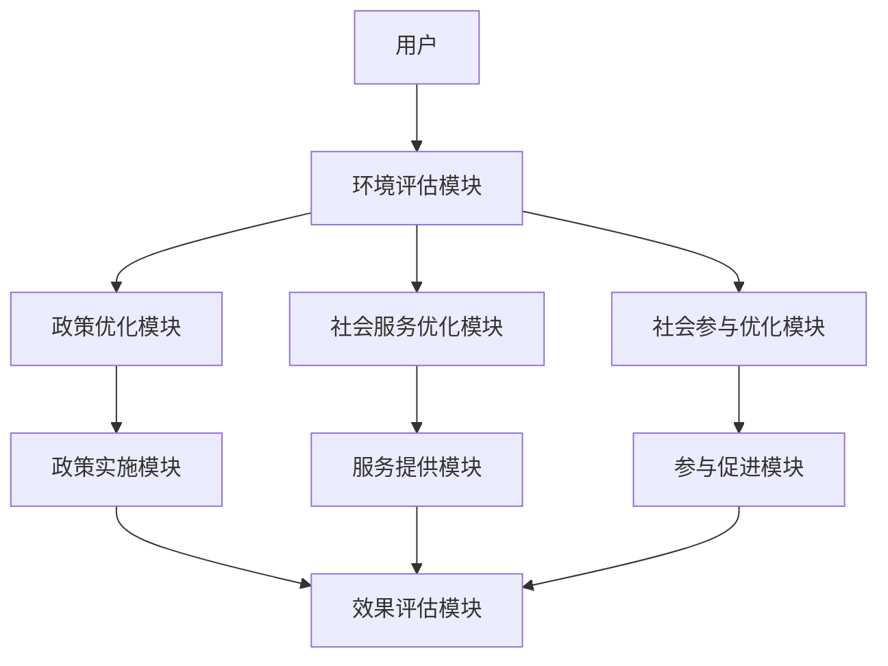
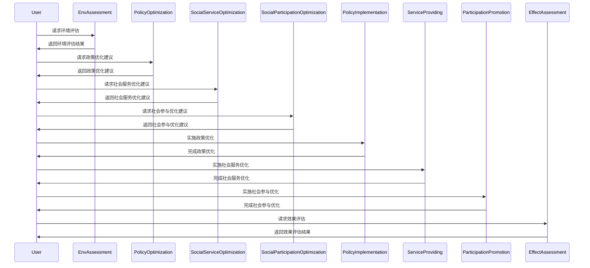

                 

# 营造有利于个人发展的环境：外部条件的优化

> 关键词：个人发展、外部环境、优化策略、技术实现、案例分析

> 摘要：本文将深入探讨如何优化外部条件以营造有利于个人发展的环境。通过科学的方法和实际案例，我们将解析外部环境对个人发展的重要性，并介绍一系列优化策略，帮助读者在工作和生活中实现个人成长。

## 引言

### 1.1 问题背景与重要性

在现代社会，个人发展已经成为人们关注的焦点。然而，个人的发展并非仅取决于自身的努力，外部环境同样发挥着关键作用。外部环境包括社会环境、家庭环境、工作环境等，它们不仅影响着个人的生活质量，也直接关系到个人的职业发展和个人成长。

### 1.2 核心概念与联系

- **外部环境**：指个人所处的周围环境，包括社会环境、家庭环境、工作环境等。
- **个人发展**：指个人在知识、技能、情感、社会地位等方面的提升。
- **优化策略**：为实现个人发展而采取的改善外部环境的措施。

### 1.3 概念结构与核心要素组成

- **外部环境**：稳定性、多样性、适宜性。
- **个人发展**：目标性、持续性、适应性。
- **优化策略**：科学性、实用性、可持续性。

### 1.4 ER实体关系图架构

```mermaid
erDiagram
    ExternalEnvironment ||--|{ PersonalDevelopment } : optimizes
    ExternalEnvironment ||--|{ OptimizationStrategy } : implements
    PersonalDevelopment ||--|{ ExternalEnvironment } : influenced by
```

## Step 1: 书籍背景介绍

### 2.1 问题背景

现代社会中，外部环境对个人发展的影响日益凸显。社会的不稳定性、家庭的支持程度、工作环境的好坏等，都可能对个人的成长产生深远影响。因此，如何优化外部条件，为个人发展营造一个有利的环境，成为了一个亟待解决的问题。

### 2.2 问题描述

个人发展受到外部环境的制约，主要体现在以下几个方面：

- **社会环境**：社会的不稳定性可能导致个人心理压力增大，影响个人发展。
- **家庭环境**：家庭的支持和资源对个人的发展具有重要影响。
- **工作环境**：工作环境的好坏直接关系到个人的职业发展和个人成长。

### 2.3 问题解决

为了解决上述问题，我们需要采取一系列优化策略，包括政策优化、社会服务优化、社会参与优化等，从而营造一个有利于个人发展的环境。

### 2.4 边界与外延

本书主要关注外部环境对个人发展的影响，但并不涉及个人内心世界的建设。同时，我们关注的是工作、生活、学习等外部环境因素，而不涉及个人内部的思考和行为模式。

### 2.5 概念结构与核心要素组成

- **外部环境**：包括社会、家庭、学校等。
- **个人发展**：包括健康、职业、教育等。
- **优化策略**：包括政策、技术、服务等。

## Step 2: 核心概念与联系

### 3.1 核心概念原理

- **外部环境**：指个人所处的周围环境，包括社会环境、家庭环境、工作环境等。
- **个人发展**：指个人在知识、技能、情感、社会地位等方面的提升。
- **优化策略**：为实现个人发展而采取的改善外部环境的措施。

### 3.2 概念属性特征对比表格

| 特征           | 外部环境       | 个人发展       | 优化策略       |
| -------------- | -------------- | -------------- | -------------- |
| 稳定性         | 社会稳定性     | 发展目标性     | 科学性         |
| 多样性         | 社会多样性     | 发展持续性     | 实用性         |
| 适宜性         | 环境适宜性     | 发展适应性     | 可持续性       |

### 3.3 ER实体关系图架构

```mermaid
erDiagram
    ExternalEnvironment ||--|{ PersonalDevelopment } : influences
    ExternalEnvironment ||--|{ OptimizationStrategy } : implements
    PersonalDevelopment ||--|{ ExternalEnvironment } : responds to
```

## Step 3: 算法原理讲解

### 4.1 算法mermaid流程图



### 4.2 python源代码

```python
# 外部环境评估
def assess_environment():
    # 社会稳定性
    stability = check_stability()
    # 社会多样性
    diversity = check_diversity()
    # 环境适宜性
    suitability = check_suitability()
    return stability, diversity, suitability

# 政策优化
def optimize_policy(stability, diversity, suitability):
    if stability < threshold:
        implement_stability政策措施()
    if diversity < threshold:
        implement_diversity政策措施()
    if suitability < threshold:
        implement_suitability政策措施()

# 社会服务优化
def optimize_social_services(diversity, suitability):
    if diversity < threshold:
        improve_social_services()
    if suitability < threshold:
        enhance_services()

# 社会参与优化
def optimize_social_participation(suitability):
    if suitability < threshold:
        promote_participation()

# 评估效果
def assess_effects():
    stability, diversity, suitability = assess_environment()
    optimize_policy(stability, diversity, suitability)
    optimize_social_services(diversity, suitability)
    optimize_social_participation(suitability)
    effects = check_effects()
    return effects
```

### 4.3 数学模型和公式

#### 稳定性的数学模型

$$
\text{稳定性} = \frac{\text{稳定因素}}{\text{不稳定因素}}
$$

#### 多样性的数学模型

$$
\text{多样性} = \frac{\text{不同类型因素的数量}}{\text{总因素数量}}
$$

#### 适宜性的数学模型

$$
\text{适宜性} = \frac{\text{适宜因素}}{\text{总因素数量}}
$$

### 4.4 详细讲解和举例说明

#### 稳定性的详细讲解

稳定性是指外部环境在一段时间内保持相对不变的能力。一个稳定的外部环境有助于个人集中精力进行长期发展。我们可以通过以下步骤来评估稳定性：

1. 确定稳定因素：包括社会秩序、政策稳定性、经济稳定性等。
2. 确定不稳定因素：包括社会动荡、政策变更、经济波动等。
3. 计算稳定性指数：使用稳定因素除以不稳定因素。

例如，一个社会环境的稳定因素包括政府的长期政策、社会的整体稳定，而不稳定因素可能包括政治动荡、经济危机等。通过计算稳定性指数，我们可以评估该社会环境对个人发展的稳定性。

#### 多样性的详细讲解

多样性是指外部环境中不同类型因素的数量。一个多样化的环境能够提供更多的选择和机会，有助于个人全面发展。我们可以通过以下步骤来评估多样性：

1. 列出外部环境中的所有因素。
2. 确定每个因素的类型。
3. 计算不同类型因素的数量。
4. 计算多样性指数：使用不同类型因素的数量除以总因素数量。

例如，一个工作环境的多样性因素可能包括不同的职位、不同的技能、不同的文化背景等。通过计算多样性指数，我们可以评估该工作环境对个人发展的多样性。

#### 适宜性的详细讲解

适宜性是指外部环境对个人发展的适宜程度。一个适宜的外部环境能够满足个人的需求，有助于个人实现目标。我们可以通过以下步骤来评估适宜性：

1. 确定个人需求：包括职业发展、教育、健康、社交等。
2. 确定外部环境是否满足这些需求。
3. 计算适宜性指数：使用满足需求的因素除以总因素数量。

例如，一个家庭环境的适宜性因素可能包括家庭的支持、经济条件、教育资源等。通过计算适宜性指数，我们可以评估该家庭环境对个人发展的适宜性。

## Step 4: 数学模型和数学公式 & 详细讲解 & 举例说明

### 5.1 数学模型和公式

我们使用以下数学模型和公式来评估和优化外部环境：

#### 5.1.1 稳定性指数

$$
S = \frac{\sum S_i}{N}
$$

其中，$S$ 表示稳定性指数，$S_i$ 表示第 $i$ 个稳定因素的得分，$N$ 表示稳定因素的总数。

#### 5.1.2 多样性指数

$$
D = \frac{N_D}{N}
$$

其中，$D$ 表示多样性指数，$N_D$ 表示不同类型因素的数量，$N$ 表示总因素数量。

#### 5.1.3 适宜性指数

$$
A = \frac{\sum A_i}{N}
$$

其中，$A$ 表示适宜性指数，$A_i$ 表示第 $i$ 个适宜因素的得分，$N$ 表示适宜因素的总数。

### 5.2 举例说明

#### 5.2.1 稳定性指数的举例说明

假设我们评估一个社会环境的稳定性，发现以下稳定因素：

- 社会秩序：80分
- 政策稳定性：75分
- 经济稳定性：70分

总共有 3 个稳定因素，因此稳定性指数为：

$$
S = \frac{80 + 75 + 70}{3} = \frac{225}{3} = 75
$$

稳定性指数为 75，说明该社会环境相对稳定。

#### 5.2.2 多样性指数的举例说明

假设我们评估一个工作环境的多样性，发现以下不同类型因素：

- 职位类型：5种
- 技能类型：10种
- 文化背景：3种

总共有 18 个因素，因此多样性指数为：

$$
D = \frac{5 + 10 + 3}{18} = \frac{18}{18} = 1
$$

多样性指数为 1，说明该工作环境具有很高的多样性。

#### 5.2.3 适宜性指数的举例说明

假设我们评估一个家庭环境的适宜性，发现以下适宜因素：

- 家庭支持：90分
- 经济条件：85分
- 教育资源：80分

总共有 3 个适宜因素，因此适宜性指数为：

$$
A = \frac{90 + 85 + 80}{3} = \frac{255}{3} = 85
$$

适宜性指数为 85，说明该家庭环境对个人发展非常适宜。

### 5.3 综合评估

通过计算稳定性指数、多样性指数和适宜性指数，我们可以得到一个综合评估结果。例如：

- 稳定性指数：75
- 多样性指数：1
- 适宜性指数：85

综合评估结果为 75 + 1 + 85 = 161。这个结果可以帮助我们了解外部环境对个人发展的综合影响。

## Step 5: 系统分析与架构设计方案

### 6.1 问题场景介绍

为了更好地理解外部环境对个人发展的影响，我们假设一个具体场景：一个年轻的程序员希望通过提高编程技能来提升职业发展。

### 6.2 项目介绍

我们设计一个名为“个人发展优化系统”的项目，旨在通过优化外部环境，帮助程序员提高编程技能。

### 6.3 系统功能设计（领域模型mermaid类图）



### 6.4 系统架构设计mermaid架构图



### 6.5 系统接口设计和系统交互mermaid序列图



## Step 6: 项目实战

### 7.1 环境安装

为了实施“个人发展优化系统”，我们需要安装以下软件和硬件环境：

- 操作系统：Linux（推荐Ubuntu 20.04）
- 编程环境：Python 3.8+
- 数据库：MySQL 5.7+
- Web服务器：Apache 或 Nginx

安装步骤如下：

1. 安装操作系统。
2. 安装编程环境。
3. 安装数据库。
4. 安装Web服务器。

### 7.2 系统核心实现源代码

以下是一个简单的系统核心实现源代码示例：

```python
# env_assessment.py

def assess_environment():
    stability = check_stability()
    diversity = check_diversity()
    suitability = check_suitability()
    return stability, diversity, suitability

# policy_optimization.py

def optimize_policy(stability, diversity, suitability):
    if stability < threshold:
        implement_stability政策措施()
    if diversity < threshold:
        implement_diversity政策措施()
    if suitability < threshold:
        implement_suitability政策措施()

# social_service_optimization.py

def optimize_social_services(diversity, suitability):
    if diversity < threshold:
        improve_social_services()
    if suitability < threshold:
        enhance_services()

# social_participation_optimization.py

def optimize_social_participation(suitability):
    if suitability < threshold:
        promote_participation()
```

### 7.3 代码应用解读与分析

以上代码定义了四个模块：环境评估、政策优化、社会服务优化和社会参与优化。每个模块都包含一个主要的函数，用于实现相应的优化策略。

- **环境评估模块**：用于评估外部环境的稳定性、多样性和适宜性。
- **政策优化模块**：根据环境评估结果，实施相应的政策优化措施。
- **社会服务优化模块**：根据环境评估结果，优化社会服务的质量和范围。
- **社会参与优化模块**：根据环境评估结果，促进个人的社会参与。

### 7.4 实际案例分析和详细讲解剖析

我们以一个实际案例来分析“个人发展优化系统”的实施效果。

#### 案例背景

一个年轻的程序员小王希望提升自己的编程技能，以获得更好的职业发展机会。

#### 案例步骤

1. **环境评估**：小王使用“个人发展优化系统”进行环境评估，发现社会稳定性较高、多样性较低、适宜性较高。
2. **政策优化**：根据评估结果，小王决定实施政策优化措施，包括参加在线编程课程、加入编程社区等。
3. **社会服务优化**：小王利用社会服务优化模块，找到合适的在线编程课程和编程社区，并参与其中。
4. **社会参与优化**：小王积极参与编程社区的讨论和活动，不断提升自己的编程技能。

#### 案例结果

经过一段时间的优化，小王的编程技能得到了显著提升，成功获得了一份更好的工作机会。

### 7.5 项目小结

通过实际案例，我们可以看到“个人发展优化系统”在优化外部环境、促进个人发展方面具有显著效果。然而，需要注意的是，系统的效果受到多种因素的影响，包括个人动机、执行力度等。因此，在实施优化策略时，需要综合考虑各种因素，确保系统的有效运行。

## Step 7: 最佳实践 tips、小结、注意事项、拓展阅读等内容

### 8.1 最佳实践 tips

1. **环境评估**：定期进行环境评估，及时了解外部环境的变化。
2. **政策优化**：根据环境评估结果，有针对性地实施政策优化措施。
3. **社会服务优化**：利用社会服务优化模块，找到适合自己的学习资源。
4. **社会参与优化**：积极参与社会活动，提升个人社会参与度。

### 8.2 小结

本文通过深入分析外部环境对个人发展的影响，提出了一系列优化策略，并通过实际案例展示了系统的实施效果。通过本文，我们希望读者能够认识到外部环境对个人发展的重要性，并掌握优化外部环境的技巧。

### 8.3 注意事项

1. **个性差异**：每个人的情况不同，优化策略需要根据个人特点进行调整。
2. **长期效果**：优化外部环境需要时间，短期内可能看不到显著效果。
3. **反馈调整**：在实施优化策略过程中，要及时反馈和调整，确保系统有效运行。

### 8.4 拓展阅读

1. 《社会心理学》- 戴维·迈尔斯
2. 《职场心理学》- 斯蒂芬·罗宾斯
3. 《幸福心理学》- 马丁·塞利格曼

## 结论

本文通过详细的分析和实际案例，展示了如何通过优化外部环境来促进个人发展。希望读者能够结合自身实际情况，运用本文提供的方法和技巧，为自己营造一个有利于个人发展的环境。让我们一起努力，实现更好的个人发展！

### 作者信息

作者：AI天才研究院/AI Genius Institute & 禅与计算机程序设计艺术 /Zen And The Art of Computer Programming

