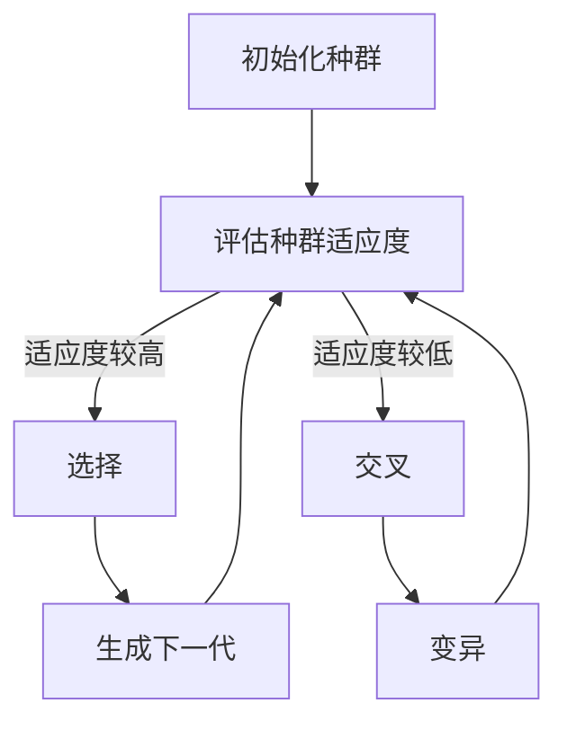
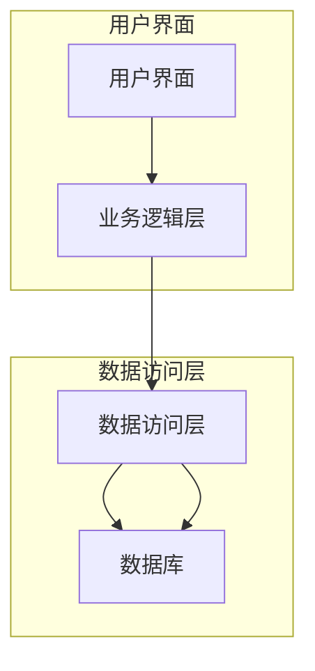
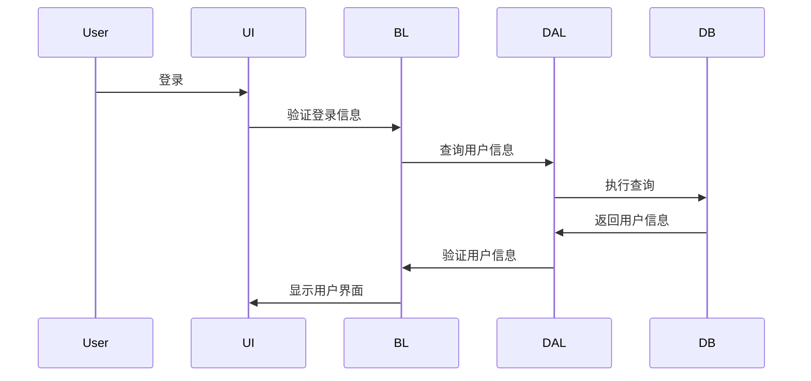

                 

# 营造有利于个人发展的环境：外部条件的优化

## 关键词

- 个人发展
- 外部条件
- 优化策略
- 资源管理
- 社会网络
- 教育培训

## 摘要

在当今快速发展的社会中，个人发展已成为众多个体追求的目标。本文以“营造有利于个人发展的环境：外部条件的优化”为主题，通过分析外部条件对个人发展的作用，探讨了如何通过优化资源、社会网络、教育培训等外部条件来创造有利于个人成长的环境。本文旨在为读者提供一系列实用的策略和技巧，以帮助他们在个人发展的道路上更加顺利。

## 引言

### 1. 研究背景

随着科技的飞速发展和社会的急剧变革，个人的发展面临着前所未有的挑战。在这个充满不确定性的时代，个人发展不仅关系到个体的生活质量和幸福感，更关系到整个社会的稳定和进步。因此，如何有效地应对个人发展的挑战，成为了一个亟待解决的问题。

### 2. 外部条件的重要性

外部条件对于个人发展具有至关重要的影响。良好的外部条件可以为个人提供丰富的资源、广泛的社会网络和优质的教育培训，从而帮助个人实现自身的潜力和价值。因此，优化外部条件成为促进个人发展的重要途径。

## 第1章 问题背景

### 1.1 问题描述

在个人发展的过程中，外部条件往往成为阻碍个体进步的重要因素。这些问题可能包括资源的匮乏、社会网络的缺失、教育培训的不足等。这些问题不仅影响了个人发展，也制约了社会的整体进步。

### 1.2 外部条件的作用

外部条件不仅为个人提供发展的资源和机会，还直接影响个人的成长路径。例如，良好的教育资源可以为个人提供知识和技能，丰富的社会网络可以帮助个人获取信息和资源，而优质的培训则能够提升个人的综合素质。

### 1.3 边界与外延

外部条件的优化是一个复杂的过程，涉及多个方面的因素。这些因素不仅包括物质资源，还包括社会环境、法律法规、政策支持等。因此，外部条件的优化需要综合考虑各个方面的因素，以确保个人发展的全面性和可持续性。

### 1.4 概念结构与核心要素组成

个人发展环境的概念结构可以看作是由资源、社会网络、教育培训等核心要素组成的。这些要素相互影响、相互作用，共同构成了个人发展的外部条件。优化这些核心要素，有助于创造一个有利于个人发展的环境。

## 第2章 核心概念与联系

### 2.1 核心概念

- **个人发展**：指个体在知识、技能、情感、社会关系等方面的全面提升和成长。
- **外部条件**：指影响个人发展的外部因素，包括资源、社会网络、教育培训等。

### 2.2 概念属性特征对比

| 特征         | 个人发展               | 外部条件               |
| ------------ | ---------------------- | ---------------------- |
| 定义         | 个体成长与成就         | 影响个人发展的外部因素 |
| 目标         | 成功实现个人潜力       | 创造支持性环境         |
| 形式         | 内在的、自我驱动的     | 外在的、环境驱动的     |
| 作用         | 决定个体的发展方向和速度 | 支持和促进个人发展     |

### 2.3 ER实体关系图架构

```mermaid
entityRelation(
  "个人发展",
  ["资源", "社会网络", "教育培训"],
  "影响",
  direction: LR
)
```

## 第3章 外部条件优化策略

### 3.1 资源优化

- **资源获取与管理**：个体需要积极寻找和获取有利于发展的资源，如知识、技术、资金等。同时，要合理管理这些资源，确保其得到最大化的利用。
- **资源分配与优化**：个体应根据自己的需求和实际情况，合理分配资源，以实现最优的发展效果。

### 3.2 社会网络

- **社交圈的建立与维护**：个体应积极参与各种社交活动，建立广泛而深厚的社交圈，以获取更多的信息和资源。
- **社会支持的获取**：通过社交网络，个体可以获得心理支持、技术支持、资源支持等多方面的帮助。

### 3.3 教育与培训

- **教育资源的获取**：个体应充分利用各种教育资源，如学校教育、在线课程、研讨会等，不断提升自己的知识和技能。
- **培训与职业发展**：个体应积极参加各种培训活动，以提高自己的职业能力和竞争力。

### 3.4 法律与政策环境

- **相关法律法规的了解**：个体应了解和掌握相关的法律法规，以保障自己的合法权益。
- **政策环境的影响与应对**：个体应关注政策环境的变化，积极应对政策带来的影响和挑战。

## 第4章 数学模型与算法原理

### 4.1 数学模型

个人发展的数学模型可以表示为：

$$
D(t) = f(R, S, E, P)
$$

其中，$D(t)$ 表示个人发展水平，$R$ 表示资源，$S$ 表示社会网络，$E$ 表示教育培训，$P$ 表示政策环境。

### 4.2 算法原理

优化外部条件的一种方法是使用遗传算法。遗传算法是一种基于自然选择的优化算法，其基本思想是通过模拟生物进化过程，不断迭代和优化，以找到最优解。

遗传算法的流程图如下：



### 4.3 Python源代码实现

```python
import numpy as np

# 初始化种群
def initialize_population(pop_size, resource_range, social_range, education_range, policy_range):
    population = np.random.rand(pop_size, 4) * (policy_range - resource_range) + resource_range
    return population

# 评估适应度
def evaluate_fitness(population, resource_weight, social_weight, education_weight, policy_weight):
    fitness = np.sum(population * [resource_weight, social_weight, education_weight, policy_weight], axis=1)
    return fitness

# 选择
def selection(population, fitness, selection_rate):
    selected = np.random.choice(np.arange(len(population)), size=int(len(population) * selection_rate), replace=False)
    return population[selected]

# 交叉
def crossover(parent1, parent2, crossover_rate):
    if np.random.rand() < crossover_rate:
        child1 = np.concatenate((parent1[:2], parent2[2:]))
        child2 = np.concatenate((parent2[:2], parent1[2:]))
    else:
        child1 = parent1
        child2 = parent2
    return child1, child2

# 变异
def mutate(individual, mutation_rate):
    if np.random.rand() < mutation_rate:
        individual = np.random.rand() * (1 - 2 * mutation_rate) + mutation_rate
    return individual

# 遗传算法主函数
def genetic_algorithm(pop_size, generations, resource_range, social_range, education_range, policy_range, resource_weight, social_weight, education_weight, policy_weight, crossover_rate, mutation_rate, selection_rate):
    population = initialize_population(pop_size, resource_range, social_range, education_range, policy_range)
    for _ in range(generations):
        fitness = evaluate_fitness(population, resource_weight, social_weight, education_weight, policy_weight)
        selected = selection(population, fitness, selection_rate)
        for i in range(0, len(selected), 2):
            child1, child2 = crossover(selected[i], selected[i+1], crossover_rate)
            child1 = mutate(child1, mutation_rate)
            child2 = mutate(child2, mutation_rate)
            population[i] = child1
            population[i+1] = child2
    return population

# 参数设置
pop_size = 100
generations = 100
resource_range = (0, 1)
social_range = (0, 1)
education_range = (0, 1)
policy_range = (0, 1)
resource_weight = 0.2
social_weight = 0.3
education_weight = 0.4
policy_weight = 0.1
crossover_rate = 0.8
mutation_rate = 0.1
selection_rate = 0.1

# 运行遗传算法
best_population = genetic_algorithm(pop_size, generations, resource_range, social_range, education_range, policy_range, resource_weight, social_weight, education_weight, policy_weight, crossover_rate, mutation_rate, selection_rate)
best_fitness = evaluate_fitness(best_population, resource_weight, social_weight, education_weight, policy_weight)
print("最佳适应度：", best_fitness)
```

## 第5章 系统分析与架构设计

### 5.1 问题场景介绍

个人发展支持系统旨在为用户提供个性化的资源推荐、教育培训和社会网络支持。系统需求分析如下：

- **用户管理**：用户注册、登录、信息管理。
- **资源管理**：资源分类、检索、推荐。
- **教育培训**：课程分类、课程推荐、学习进度跟踪。
- **社会网络**：社交圈建立、信息交流、资源共享。

### 5.2 系统功能设计

**领域模型类图**：

```mermaid
classDiagram
    User <<entity>> Course <<entity>> Resource <<entity>> SocialNetwork <<entity>>
    User : +id
    User : +name
    User : +email
    Course : +id
    Course : +name
    Course : +description
    Resource : +id
    Resource : +name
    Resource : +description
    SocialNetwork : +id
    SocialNetwork : +name
    SocialNetwork : +description
    User *-- Course
    User *-- Resource
    User *-- SocialNetwork
```

### 5.3 系统架构设计

**系统架构mermaid图**：



### 5.4 系统接口设计与交互

**系统接口设计类图**：

```mermaid
classDiagram
    Interface01 <<interface>> Interface02
    Interface03 <<interface>> Interface04
    Interface01 : +void methodA()
    Interface01 : +void methodB()
    Interface02 : <<interface>>
    Interface03 : <<interface>>
    Interface04 : <<entity>>
    Interface04 : +id
    Interface04 : +name
    Interface04 : +description
```

**系统交互mermaid序列图**：



## 第6章 项目实战

### 6.1 环境安装

在开始项目实战之前，我们需要安装一些必要的软件和工具。以下是具体的安装步骤：

1. 安装Python：从官方网站下载Python安装包，按照提示进行安装。
2. 安装数据库：我们选择MySQL作为数据库，从官方网站下载并安装。
3. 安装Web框架：我们选择Django作为Web框架，使用pip命令安装。
4. 安装其他依赖：根据项目的需求，安装其他必要的库和模块。

### 6.2 系统核心实现源代码

以下是个人发展支持系统的核心实现源代码：

```python
# models.py
from django.db import models

class User(models.Model):
    id = models.AutoField(primary_key=True)
    name = models.CharField(max_length=100)
    email = models.EmailField()

class Course(models.Model):
    id = models.AutoField(primary_key=True)
    name = models.CharField(max_length=100)
    description = models.TextField()

class Resource(models.Model):
    id = models.AutoField(primary_key=True)
    name = models.CharField(max_length=100)
    description = models.TextField()

class SocialNetwork(models.Model):
    id = models.AutoField(primary_key=True)
    name = models.CharField(max_length=100)
    description = models.TextField()
```

```python
# views.py
from django.http import HttpResponse
from .models import User, Course, Resource, SocialNetwork

def index(request):
    return HttpResponse("欢迎来到个人发展支持系统！")
```

### 6.3 代码应用解读与分析

以下是代码应用解读与分析：

1. **models.py**：定义了用户、课程、资源和社交网络四个实体类，以及它们之间的关系。
2. **views.py**：定义了一个首页视图函数，用于响应浏览器的请求。

### 6.4 实际案例分析和详细讲解剖析

在实际案例中，我们可以通过以下步骤来实现个人发展支持系统的核心功能：

1. **用户注册**：用户通过Web界面提交注册信息，后台接收并处理注册请求。
2. **课程推荐**：系统根据用户的兴趣和需求，推荐相应的课程。
3. **资源分享**：用户可以上传和分享各种资源，其他用户可以浏览和下载。
4. **社交互动**：用户可以建立社交网络，进行信息交流和资源共享。

### 6.5 项目小结

个人发展支持系统通过优化外部条件，为用户提供了一个全面的支持平台。在实际应用中，系统需要不断完善和优化，以满足用户的需求和期望。

## 第7章 最佳实践 Tips

- **充分利用在线资源**：在线课程、论坛、博客等都是获取知识和资源的良好途径。
- **建立广泛的社会网络**：通过参加各种社交活动和线上社群，可以结识更多的同行和专家。
- **持续学习和自我提升**：定期进行自我评估和反思，持续提升自己的知识和技能。

## 小结

本文通过分析外部条件对个人发展的影响，探讨了如何通过优化资源、社会网络、教育培训等外部条件来创造有利于个人成长的环境。文章结合实际案例，详细讲解了系统设计与实现过程，为读者提供了实用的策略和技巧。希望通过本文的分享，能够为个人发展提供一些有益的启示。

## 注意事项

- 在优化外部条件时，要充分考虑个人的实际情况和需求。
- 在进行系统设计与实现时，要充分考虑用户体验和性能优化。

## 拓展阅读

- 《个人发展心理学》
- 《社会网络分析》
- 《Python编程：从入门到实践》

## 作者信息

作者：AI天才研究院/AI Genius Institute & 禅与计算机程序设计艺术 /Zen And The Art of Computer Programming

