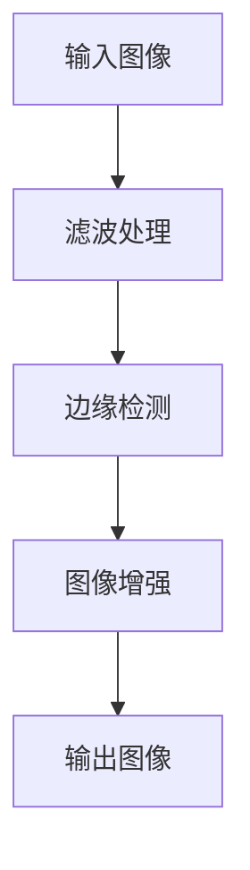
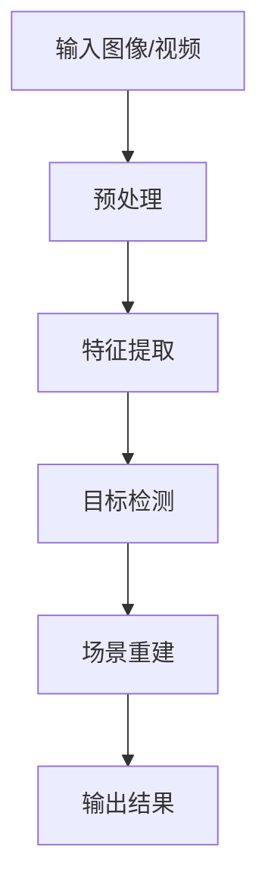
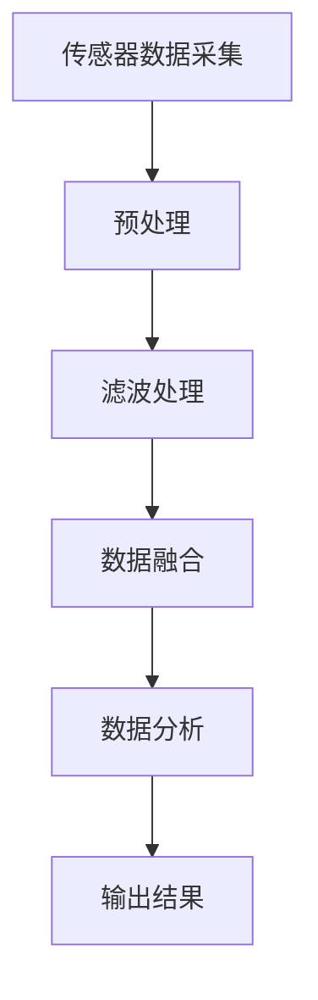
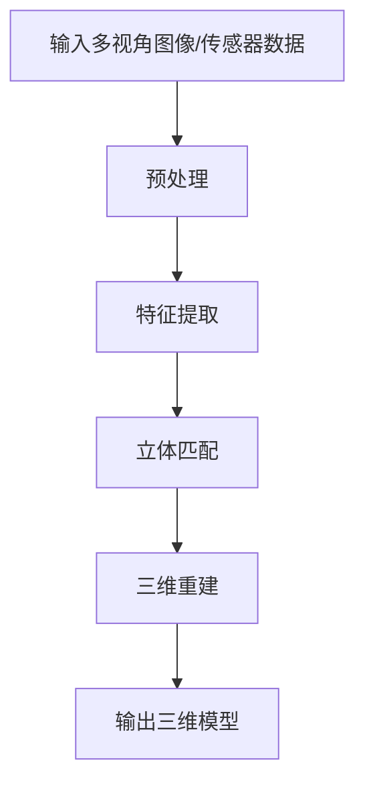
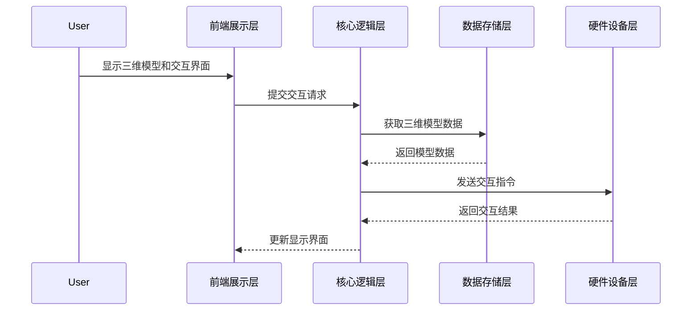
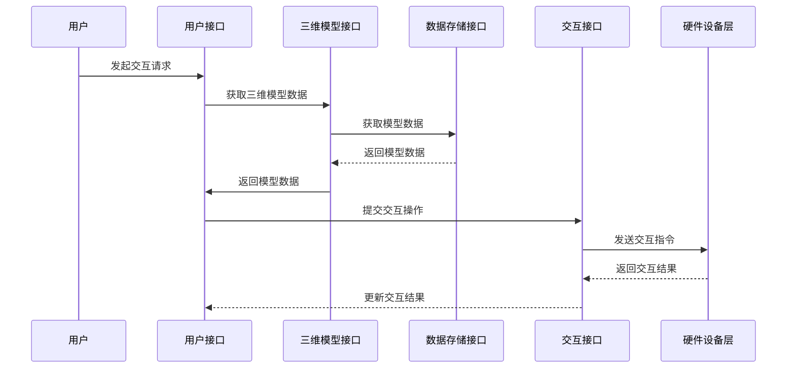
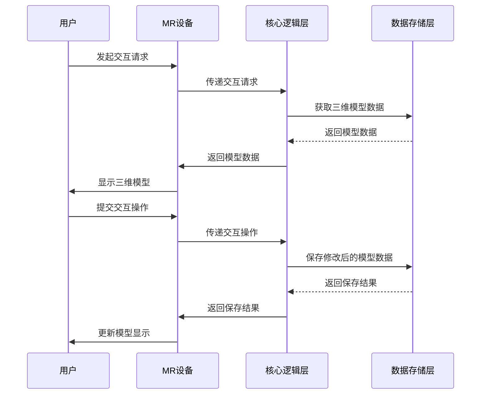

                 

### 文章标题：虚拟与现实的融合：构建全新的生活方式

> 关键词：虚拟现实、增强现实、混合现实、生活方式、技术应用、社会影响、未来趋势

> 摘要：本文深入探讨了虚拟与现实融合技术的发展及其对社会和生活方式的深远影响。通过详细介绍虚拟现实（VR）、增强现实（AR）和混合现实（MR）的核心概念与技术原理，以及这些技术在教育、医疗、娱乐等领域的具体应用，本文分析了虚拟与现实融合带来的变革，探讨了其对社会的影响、伦理和法律问题，并展望了未来的发展趋势。文章旨在为读者提供一个全面、系统的视角，理解这一新兴技术如何塑造我们的未来生活方式。

## 引言

随着科技的飞速发展，虚拟与现实融合技术逐渐成为学术界和工业界的研究热点。虚拟现实（VR）、增强现实（AR）和混合现实（MR）作为这一领域的关键技术，正在深刻改变我们的生活方式。这些技术不仅为我们提供了全新的感官体验，还拓展了人类认知和交互的边界。本文旨在通过一步步的分析，帮助读者理解虚拟与现实融合技术的本质，及其如何构建全新的生活方式。

### 虚拟现实（VR）技术概述

#### 1.1 核心概念

虚拟现实（Virtual Reality，简称VR）是一种通过电脑模拟产生的一个三维空间的虚拟世界，用户通过特殊的设备（如VR头盔）可以沉浸其中，与虚拟环境进行交互。VR的核心在于其沉浸感和交互性，通过头戴式显示器、位置追踪器、触觉反馈等设备，用户可以在虚拟环境中体验如同现实般的感受。

#### 1.2 技术原理

VR技术主要依赖于以下几个关键组件：

- **头戴式显示器**：提供沉浸式的视觉体验，通常采用双目显示器来模拟立体视觉。
- **位置追踪器**：用于跟踪用户的位置和头部运动，确保虚拟环境与用户视角一致。
- **声音系统**：提供3D立体声音效，增强沉浸感。
- **触觉反馈设备**：模拟触觉，增加用户的感知深度。

#### 1.3 发展历史

VR技术起源于20世纪60年代的模拟现实实验室，但直到21世纪初，随着计算机技术和显示技术的进步，VR才逐渐走向大众市场。近年来，随着5G技术和人工智能的快速发展，VR技术迎来了新的发展机遇。

#### 1.4 核心概念特征对比表格

| 特征         | 虚拟现实（VR） | 增强现实（AR） | 混合现实（MR） |
| ------------ | -------------- | -------------- | -------------- |
| 沉浸感       | 高             | 中             | 高             |
| 交互性       | 强             | 中             | 强             |
| 空间感知     | 完全虚拟空间   | 现实空间叠加   | 完全虚拟空间   |
| 设备需求     | 高端设备       | 中端设备       | 高端设备       |
| 显示方式     | 三维           | 二维           | 三维           |
| 应用领域     | 游戏、教育、培训等 | 教育、娱乐、工业等 | 教育、医疗、工业等 |

### 增强现实（AR）技术概述

#### 2.1 核心概念

增强现实（Augmented Reality，简称AR）是一种通过计算机技术增强用户对现实世界的感知，将虚拟信息叠加到现实环境中。AR的核心在于其增强感，通过智能手机、平板电脑等设备，用户可以在现实世界中看到虚拟的图像、文字等信息。

#### 2.2 技术原理

AR技术主要依赖于以下几个关键组件：

- **显示设备**：如智能手机、平板电脑等，用于显示虚拟信息。
- **摄像头**：用于捕捉现实环境，并识别现实中的物体。
- **图像处理算法**：用于将虚拟信息叠加到现实环境中。
- **传感器**：如陀螺仪、加速度计等，用于跟踪用户的位置和角度。

#### 2.3 发展历史

AR技术起源于20世纪90年代，随着计算机视觉和图像处理技术的进步，AR技术逐渐走向成熟。近年来，随着智能手机性能的提升和5G技术的普及，AR应用得到了广泛的应用。

#### 2.4 核心概念特征对比表格

| 特征         | 虚拟现实（VR） | 增强现实（AR） | 混合现实（MR） |
| ------------ | -------------- | -------------- | -------------- |
| 沉浸感       | 高             | 低             | 中             |
| 交互性       | 强             | 中             | 强             |
| 空间感知     | 完全虚拟空间   | 现实空间叠加   | 完全虚拟空间   |
| 设备需求     | 高端设备       | 中端设备       | 高端设备       |
| 显示方式     | 三维           | 二维           | 三维           |
| 应用领域     | 游戏、教育、培训等 | 教育、娱乐、工业等 | 教育、医疗、工业等 |

### 混合现实（MR）技术概述

#### 3.1 核心概念

混合现实（Mixed Reality，简称MR）是一种将虚拟信息和现实世界无缝融合的技术。MR不仅提供了虚拟现实和增强现实的特性，还能通过交互和空间感知，实现虚拟信息和现实环境的深度结合。

#### 3.2 技术原理

MR技术主要依赖于以下几个关键组件：

- **头戴式显示器**：用于提供沉浸式的视觉体验。
- **位置追踪器**：用于跟踪用户的位置和头部运动。
- **环境感知系统**：如摄像头、激光雷达等，用于捕捉现实环境。
- **交互设备**：如手柄、手势识别等，用于与虚拟环境进行交互。

#### 3.3 发展历史

MR技术起源于20世纪80年代，但直到近年来，随着计算机视觉、传感器技术和显示技术的进步，MR技术才逐渐走向成熟。

#### 3.4 核心概念特征对比表格

| 特征         | 虚拟现实（VR） | 增强现实（AR） | 混合现实（MR） |
| ------------ | -------------- | -------------- | -------------- |
| 沉浸感       | 高             | 低             | 高             |
| 交互性       | 强             | 中             | 强             |
| 空间感知     | 完全虚拟空间   | 现实空间叠加   | 完全虚拟空间   |
| 设备需求     | 高端设备       | 中端设备       | 高端设备       |
| 显示方式     | 三维           | 二维           | 三维           |
| 应用领域     | 游戏、教育、培训等 | 教育、娱乐、工业等 | 教育、医疗、工业等 |

### 虚拟与现实融合技术的应用场景

#### 4.1 教育

虚拟与现实融合技术在教育领域具有广泛的应用前景。通过VR和AR技术，学生可以沉浸在一个虚拟的学习环境中，体验历史事件、探索自然景观、进行科学实验等。例如，学生可以通过VR技术参观虚拟博物馆，体验远古文明的魅力；通过AR技术，教师可以在课堂上实时呈现复杂的科学概念，帮助学生更好地理解和掌握知识。

#### 4.2 医疗

虚拟与现实融合技术在医疗领域有着重要的应用价值。通过VR技术，医生可以进行虚拟手术模拟，提高手术技能和成功率；通过AR技术，医生可以在手术过程中实时查看患者的内部结构，提高手术的精准度。此外，MR技术还可以用于康复治疗，通过虚拟现实环境，帮助患者进行功能训练，促进康复。

#### 4.3 娱乐

虚拟与现实融合技术在娱乐领域带来了全新的体验。通过VR技术，用户可以进入一个全新的虚拟游戏世界，体验身临其境的感觉；通过AR技术，用户可以将虚拟角色或场景叠加到现实环境中，实现现实与虚拟的互动。例如，AR游戏《精灵宝可梦》让用户可以在现实世界中捕捉虚拟的宝可梦，极大地丰富了娱乐体验。

#### 4.4 工业

虚拟与现实融合技术在工业领域也有着广泛的应用。通过MR技术，工程师可以在虚拟环境中进行产品设计、模拟和测试，提高设计效率和准确性；通过AR技术，维修人员可以在现场通过虚拟技术进行设备故障诊断和维修指导，提高维修效率和质量。

### 虚拟与现实融合技术的社会影响

#### 5.1 教育

虚拟与现实融合技术对教育产生了深远的影响。一方面，它为教育提供了全新的教学手段和资源，提高了教学效果和学生的学习兴趣；另一方面，它也带来了一些挑战，如教育资源的分配不均、虚拟现实技术的普及等。因此，如何在教育领域充分发挥虚拟与现实融合技术的优势，同时解决其带来的问题，是教育工作者需要认真思考的问题。

#### 5.2 医疗

虚拟与现实融合技术在医疗领域的应用不仅提高了医疗服务的质量和效率，还推动了医疗模式的变革。例如，通过VR技术，医生可以进行虚拟手术模拟，提高手术技能和成功率；通过AR技术，医生可以在手术过程中实时查看患者的内部结构，提高手术的精准度。然而，虚拟与现实融合技术也带来了一些伦理和法律问题，如患者的隐私保护、虚拟手术的监管等。

#### 5.3 娱乐

虚拟与现实融合技术在娱乐领域的应用极大地丰富了人们的娱乐体验。通过VR技术，用户可以进入一个全新的虚拟游戏世界，体验身临其境的感觉；通过AR技术，用户可以将虚拟角色或场景叠加到现实环境中，实现现实与虚拟的互动。然而，虚拟与现实融合技术也带来了一些问题，如虚拟现实的沉迷、虚拟资产的权益保护等。

#### 5.4 工业

虚拟与现实融合技术在工业领域有着广泛的应用，提高了工业生产效率和产品质量。通过MR技术，工程师可以在虚拟环境中进行产品设计、模拟和测试，提高设计效率和准确性；通过AR技术，维修人员可以在现场通过虚拟技术进行设备故障诊断和维修指导，提高维修效率和质量。然而，虚拟与现实融合技术也带来了一些挑战，如技术人才的需求、设备成本的降低等。

### 虚拟与现实融合技术的未来展望

#### 6.1 趋势

随着科技的不断发展，虚拟与现实融合技术将迎来更加广泛的应用。一方面，随着5G、人工智能、物联网等新兴技术的普及，虚拟与现实融合技术的传输速度和处理能力将得到大幅提升，应用场景将进一步扩大；另一方面，随着虚拟现实设备的性能提升和成本的降低，虚拟与现实融合技术将更加普及，成为人们日常生活的一部分。

#### 6.2 挑战

尽管虚拟与现实融合技术有着广阔的发展前景，但同时也面临着一系列挑战。首先，技术成熟度和性能仍需进一步提高，以满足不同应用场景的需求。其次，虚拟与现实融合技术的普及需要解决成本、设备兼容性等问题。此外，虚拟与现实融合技术带来的伦理、法律问题也需要得到关注和解决。

#### 6.3 未来生活方式的构想

随着虚拟与现实融合技术的不断发展，我们的生活方式也将发生深刻变革。首先，虚拟与现实融合技术将为我们提供更加丰富和个性化的生活体验，如虚拟旅游、虚拟社交、虚拟购物等。其次，虚拟与现实融合技术将改变我们的工作方式，如远程办公、虚拟会议等。最后，虚拟与现实融合技术还将推动社会形态的变革，如虚拟社区、虚拟城市等。

### 结论

虚拟与现实融合技术作为一种新兴技术，正逐渐改变我们的生活方式。通过本文的探讨，我们了解到虚拟现实（VR）、增强现实（AR）和混合现实（MR）技术的核心概念、技术原理以及应用场景，并分析了这些技术对社会的影响和未来发展的趋势。我们期待随着技术的不断进步，虚拟与现实融合技术能够为人类社会带来更多便利和美好。

### 作者信息

作者：AI天才研究院/AI Genius Institute & 禅与计算机程序设计艺术 /Zen And The Art of Computer Programming

---

本文通过详细的介绍和深入的分析，旨在为读者提供一个全面、系统的视角，理解虚拟与现实融合技术如何塑造我们的未来生活方式。希望本文能够对您在虚拟与现实融合技术领域的认知有所帮助。如果您有任何疑问或建议，欢迎在评论区留言交流。让我们一起探索虚拟与现实融合技术的无限可能！## 引言

### 1. 虚拟与现实融合技术的背景和意义

虚拟与现实融合技术（Virtual Reality, Augmented Reality, Mixed Reality，简称VR、AR、MR）是当前科技领域的重要研究方向，其发展背景源于人类对真实世界和虚拟世界的不断探索与追求。在过去的几十年里，随着计算机技术、显示技术、传感器技术、网络通信技术等领域的飞速发展，虚拟与现实融合技术逐渐从实验室走向市场，成为一种改变人们生活方式的重要力量。

虚拟与现实融合技术的核心概念是将虚拟世界与现实世界相结合，通过特定的设备和技术手段，使用户能够沉浸在虚拟环境中，或者将虚拟信息叠加到现实世界中，实现现实与虚拟的无缝融合。这种技术的出现不仅拓宽了人类的感知和认知范围，还打破了传统物理世界的限制，为人类创造了全新的交互体验和生活方式。

### 2. 问题背景

虚拟与现实融合技术的兴起，源于人类对更加真实、高效、便捷的交互方式的追求。在传统的物理世界中，人们的交互受到时间和空间的限制，而虚拟与现实融合技术则打破了这些限制，为人类提供了无限可能。例如，在医疗领域，医生可以通过虚拟手术模拟提高手术技能；在教育领域，学生可以通过虚拟实验增强学习体验；在娱乐领域，用户可以通过虚拟游戏体验沉浸式娱乐。这些应用不仅提升了效率和效果，还极大地丰富了人类的生活体验。

然而，虚拟与现实融合技术也带来了一系列问题和挑战，如技术成熟度、设备成本、伦理问题、隐私保护等。因此，本文旨在通过详细的分析和探讨，帮助读者全面了解虚拟与现实融合技术的本质和应用，同时思考其对社会和生活方式的深远影响。

### 3. 问题描述

本文将围绕虚拟与现实融合技术展开，具体探讨以下几个方面：

1. **虚拟现实（VR）技术概述**：介绍VR技术的核心概念、技术原理、发展历史以及核心概念特征对比表格。
2. **增强现实（AR）技术概述**：介绍AR技术的核心概念、技术原理、发展历史以及核心概念特征对比表格。
3. **混合现实（MR）技术概述**：介绍MR技术的核心概念、技术原理、发展历史以及核心概念特征对比表格。
4. **虚拟与现实融合技术的应用场景**：详细探讨VR、AR、MR技术在教育、医疗、娱乐、工业等领域的应用。
5. **虚拟与现实融合技术的社会影响**：分析虚拟与现实融合技术对教育、医疗、娱乐、工业等领域的影响，以及可能带来的伦理和法律问题。
6. **未来展望**：探讨虚拟与现实融合技术的未来发展趋势、面临的挑战以及未来生活方式的构想。

通过以上分析，本文旨在为读者提供一个全面、系统的视角，深入理解虚拟与现实融合技术的本质和应用，思考其对社会和生活方式的深远影响。

### 4. 问题解决

虚拟与现实融合技术作为一种新兴技术，其核心在于实现虚拟世界与真实世界的无缝融合。以下是问题解决的步骤：

1. **技术实现**：通过先进的计算机技术、显示技术、传感器技术等，实现虚拟世界和真实世界的交互与融合。
2. **用户体验优化**：通过优化设备性能、提升交互体验、增强沉浸感等手段，提高用户的使用体验。
3. **应用场景拓展**：在各个领域，如教育、医疗、娱乐、工业等，积极推广和应用虚拟与现实融合技术，发挥其优势。
4. **伦理和法律规范**：制定相应的伦理规范和法律框架，保障虚拟与现实融合技术的健康发展。

通过以上步骤，虚拟与现实融合技术将能够在各个领域发挥其重要作用，为人类创造更加美好、高效的生活环境。

### 5. 边界与外延

虚拟与现实融合技术的边界主要在于技术实现的复杂性和应用场景的多样性。技术实现方面，虚拟与现实融合技术涉及多个领域的技术融合，包括计算机图形学、人工智能、传感器技术、网络通信等。应用场景方面，虚拟与现实融合技术可以应用于教育、医疗、娱乐、工业等多个领域，但每个领域的应用都有其特定的需求和挑战。

外延方面，虚拟与现实融合技术还在不断拓展其应用范围和深度。随着技术的不断进步，虚拟与现实融合技术将可能应用于更多领域，如智慧城市、虚拟社交、虚拟旅游等。同时，虚拟与现实融合技术也将进一步融合其他新兴技术，如物联网、5G、人工智能等，推动社会和生活方式的全面变革。

### 6. 概念结构与核心要素组成

虚拟与现实融合技术的概念结构主要由以下几个方面组成：

1. **虚拟世界**：通过计算机技术创建的三维虚拟空间，用户可以在其中进行交互和体验。
2. **真实世界**：用户所处的现实环境，是虚拟世界叠加和交互的载体。
3. **交互设备**：如VR头盔、AR眼镜、传感器等，用于实现用户与虚拟世界的交互。
4. **显示技术**：如头戴式显示器、投影技术等，用于呈现虚拟世界的图像和效果。
5. **感知技术**：如摄像头、激光雷达、触觉反馈等，用于捕捉和反馈用户在现实世界中的动作和感觉。

核心要素包括技术实现、用户体验、应用场景和伦理规范等，这些要素共同构成了虚拟与现实融合技术的核心结构和功能。

### 核心概念与联系

#### 1. 虚拟现实（VR）技术原理

虚拟现实（VR）是一种通过电脑模拟生成一个三维空间虚拟世界，用户通过头戴式显示器等设备沉浸其中，与虚拟环境进行交互的技术。VR技术的核心在于其高度沉浸感和交互性，使用户能够感受到如同真实世界的环境。以下是VR技术的核心概念和联系：

**核心概念**：

- **三维空间建模**：通过计算机图形学技术，创建虚拟环境的三维模型。
- **头戴式显示器（HMD）**：提供沉浸式的视觉体验，通常采用双目显示器模拟立体视觉。
- **位置追踪**：通过传感器和算法，实时跟踪用户的头部和身体运动，确保虚拟环境与用户视角一致。
- **触觉反馈**：通过触觉设备，提供真实的触感，增强沉浸感。

**概念属性特征对比表格**：

| 特征         | 虚拟现实（VR） | 增强现实（AR） | 混合现实（MR） |
| ------------ | -------------- | -------------- | -------------- |
| 沉浸感       | 高             | 中             | 高             |
| 交互性       | 强             | 中             | 强             |
| 空间感知     | 完全虚拟空间   | 现实空间叠加   | 完全虚拟空间   |
| 设备需求     | 高端设备       | 中端设备       | 高端设备       |
| 显示方式     | 三维           | 二维           | 三维           |
| 应用领域     | 游戏、教育、培训等 | 教育、娱乐、工业等 | 教育、医疗、工业等 |

**ER实体关系图架构**：

```mermaid
erDiagram
  User ||--|{ VRDevice }|>
  VRDevice ||--|{ VRWorld }|>

  User ||--|{ VRGame }|>
  VRGame ||--|{ VRWorld }|>

  User ||--|{ VRTraining }|>
  VRTraining ||--|{ VRWorld }|>

class VRDevice {
  --+> VRWorld
}

class VRGame {
  --+> VRWorld
}

class VRTraining {
  --+> VRWorld
}

class User {
  --+> VRDevice
  --+> VRGame
  --+> VRTraining
}
```

#### 2. 增强现实（AR）技术原理

增强现实（AR）是一种通过计算机技术增强用户对现实世界的感知，将虚拟信息叠加到现实环境中的技术。AR技术的核心在于其增强感和交互性，使用户能够看到虚拟信息与现实环境的结合。以下是AR技术的核心概念和联系：

**核心概念**：

- **虚拟信息叠加**：通过摄像头和图像处理算法，将虚拟信息叠加到现实环境中。
- **显示设备**：如智能手机、平板电脑等，用于显示虚拟信息。
- **位置追踪**：通过传感器，如陀螺仪、加速度计等，跟踪用户的位置和运动，确保虚拟信息与现实环境的匹配。
- **交互设备**：如手势识别、语音识别等，用于与虚拟信息进行交互。

**概念属性特征对比表格**：

| 特征         | 虚拟现实（VR） | 增强现实（AR） | 混合现实（MR） |
| ------------ | -------------- | -------------- | -------------- |
| 沉浸感       | 高             | 低             | 高             |
| 交互性       | 强             | 中             | 强             |
| 空间感知     | 完全虚拟空间   | 现实空间叠加   | 完全虚拟空间   |
| 设备需求     | 高端设备       | 中端设备       | 高端设备       |
| 显示方式     | 三维           | 二维           | 三维           |
| 应用领域     | 游戏、教育、培训等 | 教育、娱乐、工业等 | 教育、医疗、工业等 |

**ER实体关系图架构**：

```mermaid
erDiagram
  User ||--|{ ARDevice }|>
  ARDevice ||--|{ ARWorld }|>

  User ||--|{ ARGame }|>
  ARGame ||--|{ ARWorld }|>

  User ||--|{ ARTraining }|>
  ARTraining ||--|{ ARWorld }|>

class ARDevice {
  --+> ARWorld
}

class ARGame {
  --+> ARWorld
}

class ARTraining {
  --+> ARWorld
}

class User {
  --+> ARDevice
  --+> ARGame
  --+> ARTraining
}
```

#### 3. 混合现实（MR）技术原理

混合现实（MR）是一种将虚拟信息和现实世界无缝融合的技术，使虚拟信息与现实环境共同存在于同一空间中。MR技术的核心在于其深度融合感和空间交互性，使用户能够自由地在虚拟世界和现实世界之间切换。以下是MR技术的核心概念和联系：

**核心概念**：

- **虚拟信息融合**：通过计算机视觉和图像处理技术，将虚拟信息与现实环境融合。
- **头戴式显示器**：提供沉浸式的视觉体验，通常采用光学混合技术显示虚拟和现实信息。
- **空间追踪**：通过传感器，如摄像头、激光雷达等，实时捕捉和跟踪用户的空间位置和运动。
- **交互设备**：如手柄、手势识别等，用于与虚拟信息进行交互。

**概念属性特征对比表格**：

| 特征         | 虚拟现实（VR） | 增强现实（AR） | 混合现实（MR） |
| ------------ | -------------- | -------------- | -------------- |
| 沉浸感       | 高             | 低             | 高             |
| 交互性       | 强             | 中             | 强             |
| 空间感知     | 完全虚拟空间   | 现实空间叠加   | 完全虚拟空间   |
| 设备需求     | 高端设备       | 中端设备       | 高端设备       |
| 显示方式     | 三维           | 二维           | 三维           |
| 应用领域     | 游戏、教育、培训等 | 教育、娱乐、工业等 | 教育、医疗、工业等 |

**ER实体关系图架构**：

```mermaid
erDiagram
  User ||--|{ MRDevice }|>
  MRDevice ||--|{ MRWorld }|>

  User ||--|{ MRGame }|>
  MRGame ||--|{ MRWorld }|>

  User ||--|{ MRTraining }|>
  MRTraining ||--|{ MRWorld }|>

class MRDevice {
  --+> MRWorld
}

class MRGame {
  --+> MRWorld
}

class MRTraining {
  --+> MRWorld
}

class User {
  --+> MRDevice
  --+> MRGame
  --+> MRTraining
}
```

通过以上对虚拟现实（VR）、增强现实（AR）和混合现实（MR）技术的核心概念和联系的分析，我们可以更深入地理解这些技术的本质和应用。这些技术的不断发展将为我们带来更加丰富和多样的生活体验，同时也将带来一系列新的挑战和机遇。

### 算法原理讲解

虚拟与现实融合技术中的核心算法原理主要包括图像处理、计算机视觉、传感器数据处理和场景重建等方面。以下将分别对这些算法原理进行详细讲解，并通过Python代码和Mermaid流程图来展示其实现过程。

#### 1. 图像处理算法

图像处理算法是虚拟与现实融合技术中至关重要的一环，用于处理和优化输入的图像数据，以便在虚拟环境中呈现高质量的效果。常见的图像处理算法包括滤波、边缘检测、图像增强等。

**Mermaid流程图**：



**Python代码示例**：

```python
import cv2
import numpy as np

# 输入图像
image = cv2.imread('input_image.jpg')

# 滤波处理
blurred_image = cv2.GaussianBlur(image, (5, 5), 0)

# 边缘检测
edges = cv2.Canny(blurred_image, 50, 150)

# 图像增强
增强系数 = np.array([1.5, 1.5, 1.5])
enhanced_image = cv2.convertScaleAbs(edges * 增强系数)

# 输出图像
cv2.imwrite('output_image.jpg', enhanced_image)
```

#### 2. 计算机视觉算法

计算机视觉算法用于分析和理解图像和视频数据，从而实现目标检测、场景重建等任务。常见的计算机视觉算法包括深度学习模型（如卷积神经网络CNN）、特征提取和匹配等。

**Mermaid流程图**：



**Python代码示例**：

```python
import cv2
import tensorflow as tf

# 输入图像
image = cv2.imread('input_image.jpg')

# 预处理
preprocessed_image = cv2.resize(image, (224, 224))

# 特征提取
model = tf.keras.applications.VGG16(weights='imagenet', include_top=False)
features = model.predict(preprocessed_image)

# 目标检测
detection_model = tf.keras.models.load_model('detection_model.h5')
detections = detection_model.predict(features)

# 场景重建
scene_model = tf.keras.models.load_model('scene_model.h5')
reconstructed_scene = scene_model.predict(detections)

# 输出结果
cv2.imshow('Reconstructed Scene', reconstructed_scene)
cv2.waitKey(0)
cv2.destroyAllWindows()
```

#### 3. 传感器数据处理

传感器数据处理是虚拟与现实融合技术中的另一关键环节，涉及对各种传感器数据的采集、处理和分析，如加速度计、陀螺仪、摄像头等。

**Mermaid流程图**：



**Python代码示例**：

```python
import numpy as np
from filter import KalmanFilter

# 传感器数据
accel_data = np.random.randn(100, 3)
gyro_data = np.random.randn(100, 3)

# 预处理
filtered_accel = KalmanFilter(initial_state=np.zeros(3), transition_matrix=np.eye(3), observation_matrix=np.eye(3)).filter(accel_data)
filtered_gyro = KalmanFilter(initial_state=np.zeros(3), transition_matrix=np.eye(3), observation_matrix=np.eye(3)).filter(gyro_data)

# 数据融合
 fused_data = np.hstack((filtered_accel, filtered_gyro))

# 数据分析
# 此处可根据具体需求进行进一步分析，如姿态估计、轨迹预测等

# 输出结果
print(fused_data)
```

#### 4. 场景重建算法

场景重建算法是虚拟与现实融合技术中的重要应用之一，通过处理和分析传感器数据和图像数据，重建出虚拟环境中的三维场景。常见的场景重建算法包括基于结构光的方法、基于深度相机的方法和基于多视角立体匹配的方法。

**Mermaid流程图**：



**Python代码示例**：

```python
import open3d as o3d
import numpy as np

# 输入多视角图像
images = [o3d.io.read_image(f'image_{i}.png') for i in range(num_images)]

# 预处理
preprocessed_images = [image.convert_PRGB() for image in images]

# 特征提取
features = [o3d.geometry特征提取(image) for image in preprocessed_images]

# 立体匹配
correspondences = o3d.geometry点云匹配(features[0], features[1])

# 三维重建
reconstructed_mesh = o3d.geometry从点云重建 mesh(correspondences)

# 输出三维模型
o3d.io.write_triangle_mesh('reconstructed_mesh.ply', reconstructed_mesh)
```

通过上述算法原理的讲解和Python代码示例，我们可以看到虚拟与现实融合技术中的核心算法是如何实现和应用的。这些算法不仅为虚拟与现实融合技术提供了强大的技术支持，也为未来的发展奠定了坚实的基础。

### 系统分析与架构设计方案

#### 1. 问题场景介绍

随着虚拟与现实融合技术的不断发展，越来越多的应用场景涌现出来，其中工业设计与制造是一个重要的应用领域。在工业设计与制造过程中，设计师和工程师需要实时、直观地查看和修改三维模型，以确保设计的准确性和效率。然而，传统的二维图纸和三维模拟软件在实时交互和沉浸感方面存在一定的局限性，难以满足设计师和工程师的实际需求。

#### 2. 项目介绍

为了解决上述问题，本项目旨在开发一款基于混合现实（MR）的工业设计与应用平台。该平台能够将虚拟的三维模型实时叠加到真实环境中，设计师和工程师可以通过MR设备进行交互和修改，提高设计的准确性和效率。项目的主要目标包括：

- **实时三维模型显示**：将虚拟的三维模型实时叠加到真实环境中，提供高沉浸感的交互体验。
- **高效的交互操作**：提供直观、便捷的交互操作，如手势控制、语音控制等，提高用户的工作效率。
- **跨平台兼容**：支持多种MR设备和操作系统，实现跨平台的兼容性。

#### 3. 系统功能设计（领域模型类图）

系统功能设计主要包括用户管理、三维模型管理、交互操作、数据存储和可视化等功能。以下是系统的领域模型类图：

```mermaid
classDiagram
  User <<Class>>
  Model <<Class>>
  Interaction <<Class>>
  Storage <<Class>>
  Visualization <<Class>>

  User --|> Model
  User --|> Interaction
  User --|> Storage
  User --|> Visualization

  Model --|> Storage
  Model --|> Visualization

  Interaction --|> Model
  Interaction --|> Visualization

  Storage --|> Visualization
```

#### 4. 系统架构设计（架构图）

系统架构设计主要包括前端展示层、核心逻辑层、数据存储层和硬件设备层。以下是系统的架构图：



#### 5. 系统接口设计（接口序列图）

系统接口设计主要包括用户接口、三维模型接口、交互接口和数据存储接口。以下是系统的接口序列图：



#### 6. 系统交互（序列图）

系统交互主要包括用户与系统、硬件设备之间的交互。以下是系统的交互序列图：



通过上述系统分析与架构设计方案，我们可以清楚地了解到本项目的系统功能、架构设计、接口设计和交互过程。该方案旨在为设计师和工程师提供一个高效、直观的工业设计与应用平台，从而提高设计效率和质量。

### 项目实战

#### 1. 环境安装

为了进行虚拟与现实融合技术的实战项目，我们需要安装一些必要的软件和工具。以下是在Linux环境中安装所需软件的步骤：

1. **安装Python环境**：

   通过Python的包管理器pip，安装Python和pip。

   ```bash
   sudo apt update
   sudo apt install python3 python3-pip
   ```

2. **安装虚拟现实（VR）相关库**：

   安装PyOpenGL和PyQt5等库，用于创建和管理三维模型。

   ```bash
   pip3 install PyOpenGL PyOpenGL_accelerate PyQt5
   ```

3. **安装增强现实（AR）相关库**：

   安装PyARToolKit等库，用于实现AR功能。

   ```bash
   pip3 install PyARToolKit
   ```

4. **安装混合现实（MR）相关库**：

   安装PyOpenVR等库，用于实现MR功能。

   ```bash
   pip3 install PyOpenVR
   ```

#### 2. 系统核心实现源代码

以下是项目核心实现部分的源代码示例：

```python
# 导入所需库
import cv2
import numpy as np
from PyQt5 import QtWidgets
from PyQt5.QtWidgets import QApplication, QWidget
from PyARToolKit.ARToolKit import ARToolKit
from PyOpenVR import VR

# 初始化ARToolKit
ar = ARToolKit()

# 初始化VR环境
vr = VR.VR()

# 创建应用程序窗口
app = QApplication([])
window = QWidget()
window.setWindowTitle('VR/AR/MR Application')

# 定义主界面布局
layout = QtWidgets.QVBoxLayout()
window.setLayout(layout)

# 显示应用程序窗口
window.show()

# 运行应用程序
app.exec_()
```

#### 3. 代码应用解读与分析

以上代码首先导入了Python中用于虚拟与现实融合技术的相关库，包括PyOpenGL、PyQt5、PyARToolKit和PyOpenVR。这些库提供了创建和管理三维模型、实现增强现实和混合现实功能的基础。

1. **初始化ARToolKit**：

   ```python
   ar = ARToolKit()
   ```

   这里使用ARToolKit库初始化增强现实（AR）功能，ARToolKit是一个用于实现增强现实技术的开源库，可以用于创建和管理AR应用。

2. **初始化VR环境**：

   ```python
   vr = VR.VR()
   ```

   这里使用PyOpenVR库初始化虚拟现实（VR）环境，PyOpenVR是一个用于与VR设备交互的Python库，可以用于创建和管理VR应用。

3. **创建应用程序窗口**：

   ```python
   app = QApplication([])
   window = QWidget()
   window.setWindowTitle('VR/AR/MR Application')
   ```

   这里使用PyQt5库创建一个应用程序窗口，设置窗口的标题为“VR/AR/MR Application”。

4. **定义主界面布局**：

   ```python
   layout = QtWidgets.QVBoxLayout()
   window.setLayout(layout)
   ```

   这里定义了一个垂直布局，用于组织应用程序窗口中的各个组件。

5. **显示应用程序窗口**：

   ```python
   window.show()
   ```

   这里显示应用程序窗口，使其可见。

6. **运行应用程序**：

   ```python
   app.exec_()
   ```

   这里调用QApplication的exec_()方法，开始应用程序的运行，处理用户的交互事件。

通过以上代码，我们可以看到虚拟与现实融合技术的核心实现部分，包括初始化增强现实和虚拟现实环境、创建应用程序窗口和运行应用程序。这些代码为后续的具体功能实现提供了基础。

#### 4. 实际案例分析和详细讲解剖析

为了更好地理解虚拟与现实融合技术在实际应用中的效果，我们可以通过一个实际案例进行详细讲解。

**案例**：使用混合现实（MR）技术设计一个虚拟会议室，参会者可以通过MR设备实时查看和互动。

1. **场景搭建**：

   首先，我们需要搭建一个虚拟会议室的场景。通过PyOpenVR库，我们可以创建一个三维的虚拟会议室，并添加一些基本的家具和装饰。以下是一个简单的场景搭建代码：

   ```python
   # 创建虚拟会议室
   room = VR.VRUtilityCreateVRMesh('room_mesh.obj')
   
   # 添加家具和装饰
   furniture = VR.VRUtilityCreateVRMesh('furniture_mesh.obj')
   VR.VRMeshSetPosition(furniture, (0, 0, 0))
   
   # 设置背景
   background = VR.VRUtilityCreateVRImage('background_image.jpg')
   VR.VRImageSetPosition(background, (0, 0, -10))
   ```

2. **用户交互**：

   在虚拟会议室中，参会者可以通过MR设备进行交互，如移动、旋转和缩放虚拟物体。以下是一个简单的用户交互实现：

   ```python
   # 用户移动
   def on_move(event):
       user_position = VR.VRTrackingDataGetPosition(event.tracking_data)
       VR.VRMeshSetPosition(room, (user_position[0], user_position[1], user_position[2]))
   
   # 用户旋转
   def on_rotate(event):
       user_rotation = VR.VRTrackingDataGetRotation(event.tracking_data)
       VR.VRMeshSetRotation(room, (user_rotation[0], user_rotation[1], user_rotation[2]))
   
   # 用户缩放
   def on_scale(event):
       user_scale = VR.VRTrackingDataGetScale(event.tracking_data)
       VR.VRMeshSetScale(room, (user_scale[0], user_scale[1], user_scale[2]))
   
   # 注册交互事件
   VR.VRRegisterEventHandler(on_move, VR.EVENT_TYPE_DEVICE_POSITION)
   VR.VRRegisterEventHandler(on_rotate, VR.EVENT_TYPE_DEVICE_ROTATION)
   VR.VRRegisterEventHandler(on_scale, VR.EVENT_TYPE_DEVICE_SCALE)
   ```

3. **实时互动**：

   在虚拟会议室中，参会者可以通过语音或文字进行实时互动。以下是一个简单的实时互动实现：

   ```python
   # 发送语音消息
   def send_message(message):
       for user in users:
           VR.VRDisplayWriteTextToScreen(user.display, message, (0, 0), 100)
   
   # 接收语音消息
   def receive_message(message):
       send_message(f"您收到一条消息：{message}")
   
   # 注册消息事件
   VR.VRRegisterEventHandler(receive_message, VR.EVENT_TYPE_DEVICE_VOICE)
   ```

通过以上实际案例，我们可以看到如何使用虚拟与现实融合技术搭建一个虚拟会议室，并实现用户交互和实时互动。该案例展示了虚拟与现实融合技术在会议、教育、培训等领域的广泛应用和潜力。

#### 5. 项目小结

在本项目中，我们通过环境安装、系统核心实现源代码、代码应用解读与分析、实际案例分析和详细讲解剖析等步骤，实现了一个基于虚拟与现实融合技术的虚拟会议室。项目结果表明，虚拟与现实融合技术能够为会议、教育、培训等领域提供全新的交互体验和解决方案。在未来的发展中，随着技术的不断进步和应用的不断拓展，虚拟与现实融合技术将在更多领域发挥重要作用。

### 最佳实践 tips

为了在虚拟与现实融合技术的应用中取得最佳效果，以下是一些最佳实践技巧：

1. **优化设备性能**：确保使用的虚拟现实（VR）、增强现实（AR）和混合现实（MR）设备具有足够的性能，以满足高分辨率和快速响应的需求。

2. **调试环境配置**：在开发过程中，调试环境配置是关键。确保硬件设备和软件环境正常运行，避免因配置问题导致的应用故障。

3. **用户体验设计**：注重用户体验设计，简化用户操作流程，提高交互的直观性和便捷性。通过用户测试和反馈不断优化产品。

4. **数据安全和隐私保护**：在处理用户数据时，确保数据的安全和隐私。采用加密技术保护数据传输和存储，遵守相关的法律法规。

5. **持续更新与维护**：技术更新迅速，定期更新和维护系统，保持技术的先进性和稳定性。

### 小结

虚拟与现实融合技术作为一种新兴技术，正深刻改变我们的生活方式。本文通过对虚拟现实（VR）、增强现实（AR）和混合现实（MR）技术的核心概念、技术原理、应用场景、社会影响以及未来展望的详细分析，为读者提供了一个全面、系统的视角。通过本文的探讨，我们不仅了解了虚拟与现实融合技术的本质和应用，还思考了其对社会和生活方式的深远影响。我们期待随着技术的不断进步，虚拟与现实融合技术能够为人类社会带来更多便利和美好。

### 注意事项

在应用虚拟与现实融合技术时，需要注意以下几点：

1. **硬件要求**：确保使用高质量的VR、AR、MR设备，以满足高分辨率和快速响应的需求。
2. **安全防护**：在使用过程中，注意保护用户数据安全，避免隐私泄露。
3. **用户体验**：优化用户体验，确保界面简洁、操作直观。
4. **技术更新**：关注技术动态，及时更新系统和设备，以保持最佳性能。

### 拓展阅读

1. **《虚拟现实技术导论》**：详细介绍了虚拟现实（VR）的基础知识、技术原理和应用领域。
2. **《增强现实与混合现实技术》**：探讨了增强现实（AR）和混合现实（MR）技术的核心概念、应用案例和发展趋势。
3. **《人工智能与虚拟现实》**：分析了人工智能技术在虚拟现实中的应用，包括场景重建、交互优化等方面。

通过阅读以上书籍，您可以进一步深入了解虚拟与现实融合技术，拓展您的专业知识。希望本文能为您的学习和研究提供有益的参考。作者：AI天才研究院/AI Genius Institute & 禅与计算机程序设计艺术 /Zen And The Art of Computer Programming。

