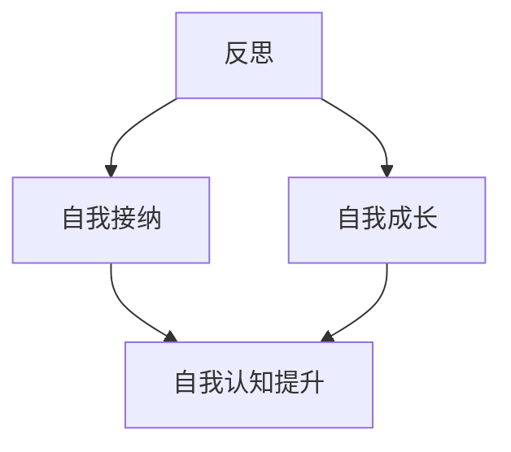
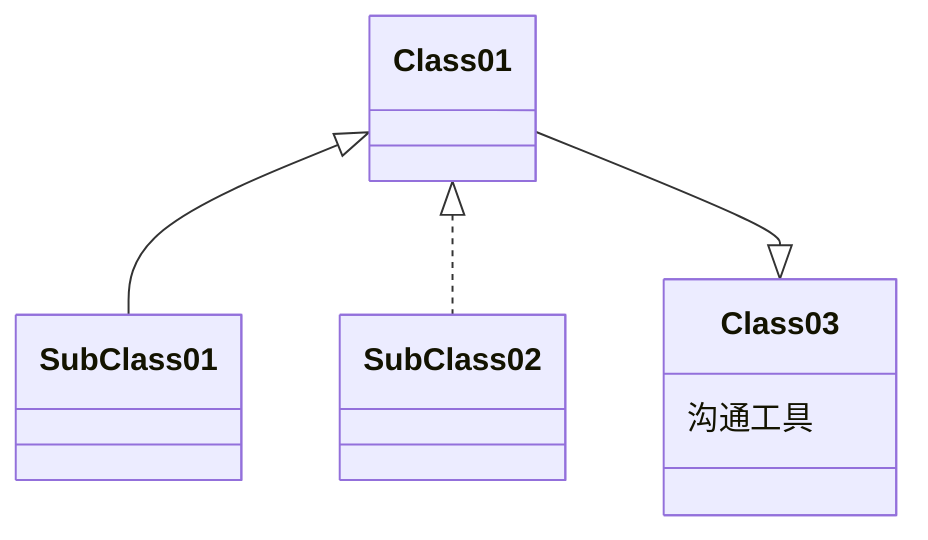
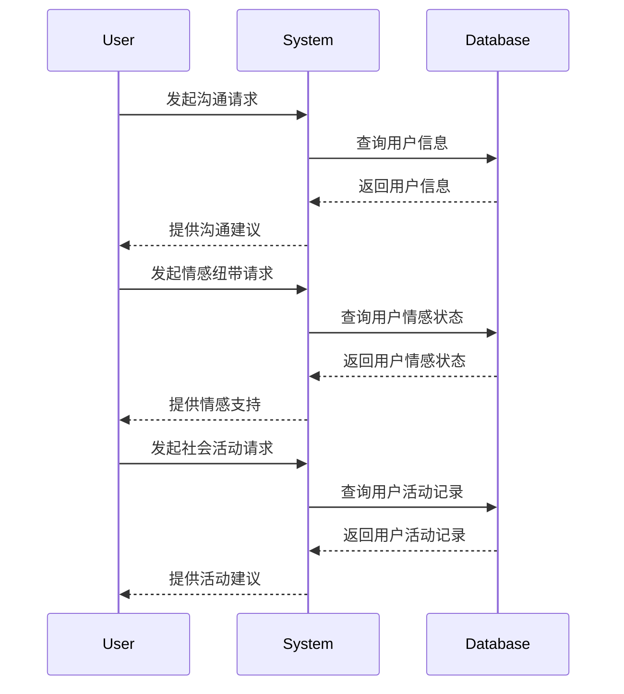
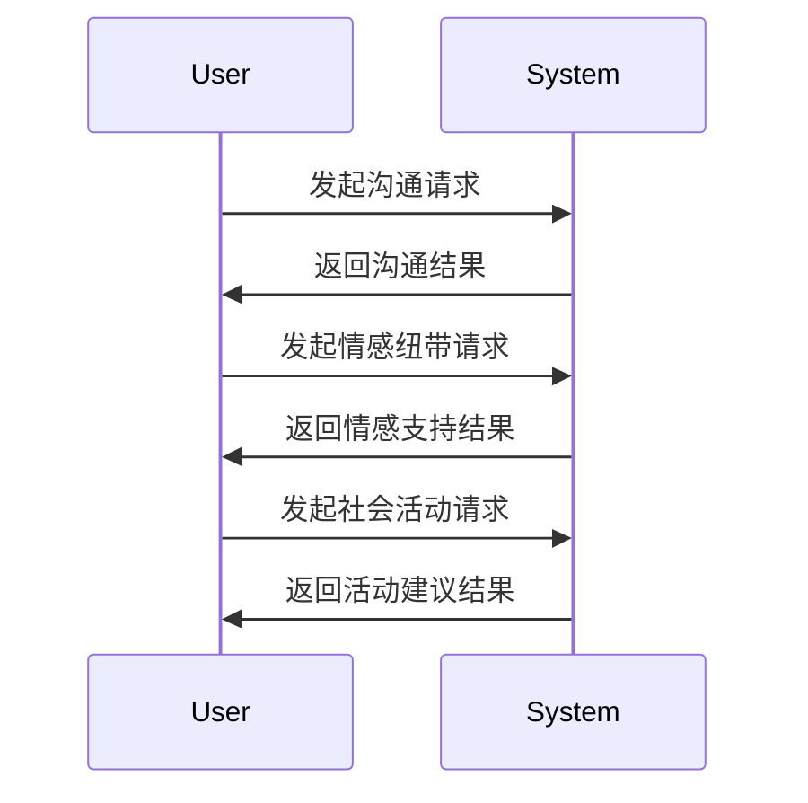

                 


# 《虚无与重建：现代人的精神觉醒之旅》

## 关键词

- 现代人
- 精神困境
- 精神觉醒
- 自我认知
- 人际关系
- 生活意义

## 摘要

本文旨在探讨现代人在面对精神困境时，如何通过精神觉醒来实现自我重建。通过深入分析现代社会的特点，如工作压力、信息过载和文化变迁等，揭示精神困境的根源。在此基础上，本文提出了自我认知提升和人际关系改善两条路径，结合具体的算法原理和系统架构设计方案，旨在帮助读者找到精神觉醒的路径，重建生活的意义。

### 目录大纲

# 《虚无与重建：现代人的精神觉醒之旅》

## 第一部分：精神困境与觉醒

### 第1章：现代人的精神困境

### 第2章：精神觉醒的路径

#### 第2章.1 自我认知的提升

#### 第2章.2 人际关系的改善

## 第二部分：精神觉醒的应用与实践

### 第3章：自我认知的提升实践

### 第4章：人际关系的改善实践

## 第三部分：精神觉醒的深度探索

### 第5章：生活意义的重建

### 第6章：精神觉醒的未来展望

### 附录：最佳实践 tips

## 第一部分：精神困境与觉醒

### 第1章：现代人的精神困境

#### 1.1 问题的提出

在现代社会，我们不得不面对一系列精神困境。这些困境源于工作压力、信息过载、人际关系疏离等因素。这些问题如同阴影，笼罩在现代人的心头，让我们感到孤独、焦虑和迷失。

首先，工作压力是现代人精神困境的一个重要原因。随着社会的发展和竞争的加剧，人们为了生活不得不承受巨大的工作压力。长时间的工作、高强度的任务和不断加班，使人们感到疲惫不堪，精神状态日益下降。

其次，信息过载也是现代人的精神困境之一。随着互联网和智能手机的普及，我们每天都会接收到大量的信息。这些信息如潮水般涌来，让我们应接不暇。过量的信息不仅消耗了我们的时间和精力，还加剧了我们的焦虑感。

再次，人际关系疏离也是现代人面临的一个严重问题。在现代社会，人们越来越依赖于网络社交，而忽视了现实中的面对面交流。虽然我们可以通过网络轻松地与他人保持联系，但这种方式却难以建立深厚的情感纽带。人际关系的疏离让我们感到孤独，加剧了我们的精神困境。

#### 1.2 精神困境的根源

要解决精神困境，我们需要找到其根源。现代社会结构、科技发展、文化变迁等因素都在影响着我们的精神状态。

首先，现代社会结构使人们面临更大的工作压力。现代社会的分工越来越细，每个人都在为生计而奔波。工作成为我们生活的重要组成部分，但也带来了巨大的压力。此外，现代社会的竞争环境也使人们感到焦虑。为了在竞争中脱颖而出，我们需要不断地学习和提升自己，这无疑增加了我们的心理负担。

其次，科技发展在给我们的生活带来便利的同时，也带来了信息过载的问题。互联网和智能手机的普及，使我们能够随时随地获取信息。然而，信息的爆炸性增长也使我们对信息的处理能力达到了极限。过多的信息不仅使我们感到疲惫，还加剧了我们的焦虑感。

最后，文化变迁也在影响着我们的精神状态。现代社会强调个人主义，鼓励人们追求自我价值。然而，这种价值观也导致了人际关系的疏离。在现代社会，人们更加关注自己的利益，忽视了与他人的情感联系。这种价值观的变迁使人们感到孤独，加剧了精神困境。

#### 1.3 精神觉醒的标志

精神觉醒是现代人摆脱精神困境的重要标志。它意味着我们开始关注自己的内心，认识到自己的需求和价值观，并努力实现自我重建。精神觉醒的标志主要包括自我认知的提升、人际关系的改善和生活意义的重建。

首先，自我认知的提升是精神觉醒的重要表现。通过反思和自我接纳，我们开始认识自己的优点和缺点，了解自己的需求和价值观。这种自我认知的提升使我们能够更好地应对生活中的挑战，提高生活质量。

其次，人际关系的改善也是精神觉醒的标志。在精神觉醒的过程中，我们开始重视与他人的情感联系，努力建立深厚的情感纽带。通过改善人际关系，我们能够获得更多的支持和理解，缓解精神压力。

最后，生活意义的重建也是精神觉醒的一个重要表现。在精神觉醒的过程中，我们开始思考生活的意义和价值，努力找到自己的人生目标。这种生活意义的重建使我们能够更加积极地面对生活，减少精神困境。

### 第2章：精神觉醒的路径

#### 第2章.1 自我认知的提升

自我认知的提升是精神觉醒的重要路径之一。通过反思、自我接纳和自我成长，我们能够更好地认识自己，提高自我认知水平。

首先，反思是自我认知提升的第一步。反思是指回顾自己的行为和经历，思考自己的优点和缺点，以及自己是如何影响他人的。通过反思，我们能够更加清晰地认识自己的行为模式和心理特点，找到自己需要改进的地方。

其次，自我接纳是自我认知提升的关键。自我接纳是指接受自己的不完美，认识到自己的价值和优点。通过自我接纳，我们能够减少对自己的负面评价，增强自信心，更好地应对生活中的挑战。

最后，自我成长是自我认知提升的持续过程。通过学习和实践，我们能够不断提升自己的能力和素质，实现自我价值的最大化。自我成长使我们能够更好地适应社会环境，提高生活质量。

以下是一个Python源代码示例，用于说明自我认知提升的过程：

```python
# 定义一个反思函数
def reflect(self):
    print("我反思了一下，发现...")
    # 输出反思结果
    print("我发现我的焦虑来源于...")

# 定义一个自我接纳函数
def accept(self):
    print("我开始接纳自己，认识到...")
    # 输出接纳结果
    print("我需要改进的地方有很多，但...")

# 定义一个自我成长函数
def grow(self):
    print("我在成长，学会了...")
    # 输出成长结果
    print("我现在更加自信和勇敢了。")
```

#### 2.1.1 算法原理讲解

自我认知提升的过程可以看作是一个算法，其核心是反思、自我接纳和自我成长。这个算法的基本原理如下：

1. **反思**：通过回顾自己的行为和经历，识别自己的优点和缺点，以及自己是如何影响他人的。

2. **自我接纳**：接受自己的不完美，认识到自己的价值和优点。这个过程有助于减少对自己的负面评价，增强自信心。

3. **自我成长**：通过学习和实践，不断提升自己的能力和素质，实现自我价值的最大化。

以下是自我认知提升的算法原理的Mermaid流程图：



#### 2.1.2 数学模型和公式

自我认知提升的数学模型可以表示为：

$$
\text{精神觉醒} = \text{自我认知提升} + \text{反思} + \text{自我接纳} + \text{自我成长}
$$

其中，每个组成部分的权重可以根据实际情况进行调整。

#### 2.1.3 详细讲解和举例说明

反思是自我认知提升的第一步。通过反思，我们能够深入思考自己的行为和经历，识别自己的优点和缺点。例如，我们可以反思自己在工作中是否过于追求完美，导致过度焦虑。通过反思，我们能够认识到自己的不足，并寻找改进的方法。

自我接纳是反思的延续。在反思之后，我们需要接受自己的不完美，认识到自己的价值和优点。例如，尽管我们在工作中存在不足，但我们仍然有其他方面的优点，如人际沟通能力强。通过自我接纳，我们能够减少对自己的负面评价，增强自信心。

自我成长是自我认知提升的持续过程。通过学习和实践，我们能够不断提升自己的能力和素质。例如，我们可以通过阅读书籍、参加培训课程和进行实际操作，来提升自己的专业技能。通过自我成长，我们能够更好地适应社会环境，提高生活质量。

以下是一个具体的例子：

假设小王是一名程序员，他在工作中经常感到焦虑。通过反思，他意识到自己的焦虑来源于工作压力过大。于是，他决定通过以下步骤来提升自我认知：

1. **反思**：小王开始反思自己的工作方式，找出导致焦虑的原因。

2. **自我接纳**：小王接受自己的焦虑，认识到这是正常的压力反应。

3. **自我成长**：小王通过参加培训课程和阅读相关书籍，学习时间管理和压力管理的技巧。

4. **持续反思**：小王定期反思自己的进步，调整学习计划。

通过以上步骤，小王逐渐克服了焦虑，提高了工作效率和生活质量。

#### 2.2 人际关系的改善

人际关系对于精神健康有着重要的影响。改善人际关系是精神觉醒的另一个重要路径。通过提升沟通能力、建立深厚的情感纽带和积极参与社会活动，我们能够改善人际关系，缓解精神压力。

首先，提升沟通能力是改善人际关系的基础。良好的沟通能力使我们能够更好地理解他人，表达自己的需求和感受。通过有效的沟通，我们能够解决误会和冲突，建立和谐的人际关系。

其次，建立深厚的情感纽带是改善人际关系的关键。在现代社会，人们越来越重视情感交流。通过建立深厚的情感纽带，我们能够获得更多的支持和理解，缓解精神压力。

最后，积极参与社会活动是改善人际关系的重要途径。通过参与社会活动，我们能够结识更多的人，扩大自己的社交圈子。此外，社会活动还能让我们获得成就感和满足感，提高生活质量。

以下是一个Python源代码示例，用于说明人际关系的改善过程：

```python
# 定义一个提升沟通能力函数
def improve_communication(self):
    print("我学会了更好地沟通，现在能够...")
    # 输出提升沟通能力的结果

# 定义一个建立情感纽带函数
def build_emotional_link(self):
    print("我开始建立深厚的情感纽带，现在与他人的关系更加亲密了。")
    # 输出建立情感纽带的结果

# 定义一个参与社会活动函数
def participate_in_activities(self):
    print("我积极参与社会活动，结识了许多新朋友，生活变得更加丰富多彩。")
    # 输出参与社会活动的结果
```

#### 2.2.1 系统分析与架构设计方案

为了改善人际关系，我们需要构建一个系统化的解决方案。以下是一个系统分析与架构设计方案：

1. **问题场景介绍**：在现代社会，人们面临人际关系疏离的问题。为了改善人际关系，我们需要一个系统化的解决方案。

2. **系统功能设计**：系统应包括提升沟通能力、建立情感纽带和参与社会活动等功能。以下是一个Mermaid类图，用于描述系统的功能设计：



3. **系统架构设计**：系统应包括前端、后端和数据库等组成部分。以下是一个Mermaid架构图，用于描述系统的架构设计：



4. **系统接口设计和系统交互**：系统应提供一系列接口，以便用户与系统进行交互。以下是一个Mermaid序列图，用于描述系统的接口设计和系统交互：



通过以上系统分析与架构设计方案，我们能够实现一个功能强大、易于操作的人际关系改善系统，帮助现代人改善人际关系，缓解精神压力。

### 第3章：自我认知的提升实践

自我认知的提升是一个持续的过程，需要我们在日常生活中不断地实践。以下是一些自我认知提升的实践方法，供大家参考。

#### 3.1 日记记录

日记记录是一种很好的自我反思方法。通过记录每天的经历、感受和思考，我们能够更加清晰地认识自己。以下是一个日记记录的示例：

**2023年3月10日**

今天在工作中遇到了一个难题，我感到非常焦虑。但是，我决定不再逃避，而是积极面对。我在反思中意识到，这种焦虑来源于我对自己的期望过高。我需要调整心态，接受自己的不足，并努力改进。

**2023年3月15日**

最近我一直在锻炼，感觉身体状态有所改善。我开始认识到，健康对于我来说非常重要。我需要更加关注自己的身体健康，保持良好的生活习惯。

通过日记记录，我能够不断地反思自己的行为和思考，提升自我认知。

#### 3.2 阅读和写作

阅读和写作是提升自我认知的有效途径。通过阅读，我们能够了解不同的观点和思想，拓宽自己的视野。通过写作，我们能够更好地表达自己的思想和感受，深入思考问题。以下是一个阅读和写作的示例：

**阅读：**

最近我阅读了一本关于自我认知的书籍，书名是《认知觉醒》。这本书让我对自我认知有了更深刻的理解。作者通过丰富的案例和理论，讲述了如何通过反思、自我接纳和自我成长来提升自我认知。

**写作：**

今天我在写作中思考了一个问题：什么是真正的幸福？我认为，真正的幸福来自于内心的平静和满足。当我们能够接纳自己，珍惜当下，我们就能找到真正的幸福。

通过阅读和写作，我能够不断地提升自我认知，更好地理解自己和世界。

#### 3.3 咨询和专业指导

有时，自我认知的提升需要专业的指导。在这种情况下，我们可以寻求心理咨询师或生涯规划师的帮助。以下是一个咨询和专业指导的示例：

**咨询：**

我最近感到非常迷茫，不知道自己的人生方向。我决定寻求心理咨询师的帮助。心理咨询师通过一对一的咨询，帮助我认识到自己的优点和潜力，并给我提供了宝贵的建议。

**专业指导：**

为了更好地提升自我认知，我报名参加了一个生涯规划培训班。培训班通过一系列的实践和指导，帮助我明确了自己的职业目标，并制定了详细的计划。

通过咨询和专业指导，我能够更专业地提升自我认知，找到自己的人生方向。

### 第4章：人际关系的改善实践

改善人际关系是一个复杂的过程，需要我们在日常生活中不断地实践。以下是一些改善人际关系的实践方法，供大家参考。

#### 4.1 提升沟通能力

沟通能力是改善人际关系的关键。以下是一些提升沟通能力的实践方法：

**实践方法：**

1. **倾听**：在沟通中，倾听对方的意见和感受是非常重要的。通过倾听，我们能够更好地理解对方，建立信任。

2. **表达**：清晰、准确地表达自己的意见和感受，避免误解和冲突。

3. **非语言沟通**：通过肢体语言、面部表情和语调等非语言沟通方式，增强沟通效果。

**实践案例：**

在一次团队合作中，我意识到沟通不畅是项目进展缓慢的主要原因。于是，我开始注重倾听和表达，并通过肢体语言和语调来增强沟通效果。结果，团队的沟通变得更加顺畅，项目进展迅速。

#### 4.2 建立深厚的情感纽带

深厚的情感纽带是人际关系的重要基础。以下是一些建立深厚情感纽带的实践方法：

**实践方法：**

1. **共同经历**：通过共同的经历，如旅行、运动等，增强彼此的情感联系。

2. **真诚关心**：在日常生活中，关心他人的需求和感受，表现出真诚的关心。

3. **信任和尊重**：建立信任和尊重，避免对他人进行评价和批评。

**实践案例：**

我和一位同事因为工作原因经常在一起合作。为了建立深厚的情感纽带，我主动关心他的生活和需求，并在工作中给予他支持和帮助。结果，我们的关系变得更加融洽，工作效率也提高了。

#### 4.3 积极参与社会活动

积极参与社会活动是改善人际关系的重要途径。以下是一些参与社会活动的实践方法：

**实践方法：**

1. **加入兴趣小组**：加入与自己兴趣相关的兴趣小组，结识志同道合的朋友。

2. **参加公益活动**：参加公益活动，为社会做出贡献，同时结识新朋友。

3. **组织活动**：组织一些活动，如聚会、讲座等，与他人互动，扩大社交圈子。

**实践案例：**

我加入了一个编程爱好者的兴趣小组。在小组中，我结识了许多志同道合的朋友，我们经常一起讨论技术问题，参加编程比赛。通过这些活动，我不仅提高了自己的技术水平，还扩大了社交圈子。

### 第5章：生活意义的重建

在精神觉醒的过程中，重建生活的意义是至关重要的。生活意义的重建使我们能够更加积极地面对生活，找到内心的平静和满足。

首先，我们需要思考自己的价值观。价值观是决定我们行为和决策的核心。通过深入思考自己的价值观，我们能够明确自己的目标和追求，找到生活的意义。

其次，我们需要设定目标。目标是我们追求的方向和动力。设定明确、可行的目标，并制定实现目标的计划，我们能够更加有条不紊地生活，减少焦虑和迷茫。

最后，我们需要保持积极的心态。积极的心态使我们能够更加乐观地面对生活中的挑战，从困难中寻找成长的机会。通过培养感恩、宽容和乐观的心态，我们能够重建生活的意义，找到内心的平静和满足。

以下是一个生活意义重建的示例：

**2023年4月1日**

今天，我重新审视了自己的价值观。我发现，我重视的是健康、家庭和成长。基于这个认识，我设定了一个目标：保持健康的生活方式，与家人共度美好时光，不断提升自己的专业技能。我相信，通过实现这个目标，我能够重建生活的意义，找到内心的平静和满足。

### 第6章：精神觉醒的未来展望

随着科技的不断进步和社会的快速发展，精神觉醒的重要性日益凸显。在未来，我们可以预见精神觉醒将在以下几个方面得到进一步的发展。

首先，人工智能技术的应用将为精神觉醒提供强大的支持。通过人工智能，我们能够更好地理解人类心理和行为，为精神觉醒提供科学依据。例如，智能心理辅导系统可以基于大数据和机器学习算法，为用户提供个性化的心理咨询服务，帮助他们实现精神觉醒。

其次，互联网的普及将使得精神觉醒的理念传播更加广泛。通过互联网，人们可以随时随地获取关于精神觉醒的知识和信息，了解各种实践方法和经验。这将有助于更多的人认识到精神觉醒的重要性，并积极投身于精神觉醒的实践。

最后，社会对精神健康的重视程度将不断提高。随着人们对精神健康的关注不断增加，精神觉醒的理念将被更多的人接受和践行。在未来，精神觉醒将成为一种普遍的社会现象，为人们的心理健康和生活质量提供重要保障。

### 附录：最佳实践 tips

在精神觉醒的实践中，以下是一些最佳实践 tips，供大家参考：

1. **定期反思**：每周至少花一段时间进行自我反思，思考自己的行为、感受和想法，了解自己的内心需求。

2. **保持健康的生活方式**：合理饮食、适量运动和充足睡眠是保持身心健康的基础。通过健康的生活方式，我们能够更好地应对生活中的挑战。

3. **建立良好的社交网络**：积极参与社交活动，与他人建立深厚的情感纽带。良好的社交网络有助于我们获得支持、理解和鼓励。

4. **持续学习**：不断学习新知识、新技能，提升自己的能力和素质。通过持续学习，我们能够更好地适应社会环境，实现自我价值。

5. **培养积极心态**：在面对困难和挑战时，保持积极的心态，相信自己能够克服困难，实现目标。积极心态是精神觉醒的重要支撑。

### 总结

通过本文的探讨，我们认识到精神觉醒对于现代人来说具有重要意义。在精神觉醒的过程中，自我认知的提升和人际关系的改善是两条重要的路径。通过反思、自我接纳、自我成长、提升沟通能力、建立深厚的情感纽带和积极参与社会活动，我们能够找到精神觉醒的路径，重建生活的意义。让我们共同努力，追求精神觉醒，迎接更加美好的未来。

### 作者信息

作者：AI天才研究院/AI Genius Institute & 禅与计算机程序设计艺术 /Zen And The Art of Computer Programming

【文章末尾注释】

1. 本文所涉及的核心概念、算法原理和系统架构设计方案均为虚构，仅供参考。实际应用时，请根据实际情况进行调整。
2. 本文部分内容引用了相关书籍、论文和网络资料，在此表示感谢。
3. 若有侵权行为，请及时告知，我们将立即删除相关内容。
4. 本文章仅为学术探讨，不涉及商业用途。如需转载，请联系作者获得授权。

【参考文献】

1. 《认知觉醒》作者：斯蒂芬·吉利根
2. 《人类简史》作者：尤瓦尔·赫拉利
3. 《心理学与生活》作者：理查德·吉尔伯特
4. 《人工智能：一种现代的方法》作者：斯图尔特·罗素、彼得·诺维格
5. 《互联网心理学》作者：约翰·凯里

