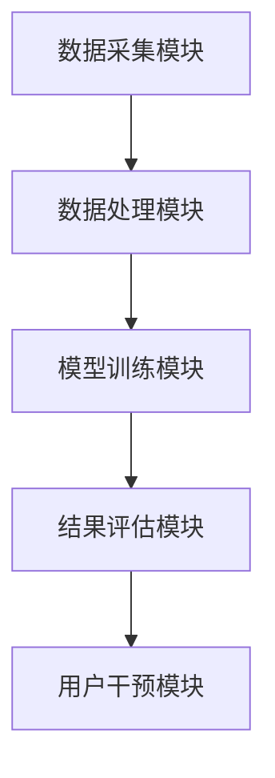
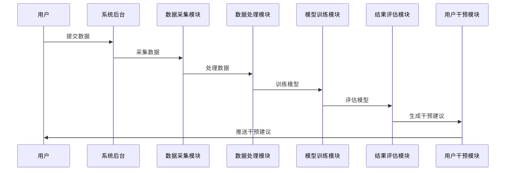
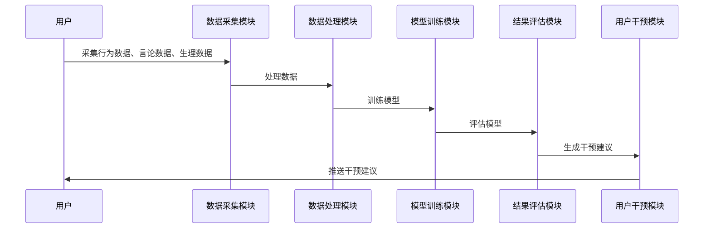

                 

# 虚无与重建：现代人的精神觉醒过程

关键词：虚无主义、精神觉醒、哲学、心理学、社会问题

摘要：本文旨在探讨虚无主义在现代人的精神觉醒过程中的作用。通过分析虚无主义的核心概念、历史发展和现实影响，结合心理学、社会学等多学科视角，深入探讨虚无主义如何影响人们的精神状态，以及个体如何通过精神觉醒克服虚无主义带来的困境，实现生命的价值重建。

----------------------------------------------------------------

## 第一部分：背景介绍

### 1. 引言

在现代社会中，人们的生活节奏加快，精神压力日益增大，许多人陷入了精神迷茫和焦虑之中。这种精神困境成为了当今社会的一个重要问题，影响着人们的身心健康和生活质量。虚无主义作为一种哲学思潮，在现代社会中的影响日益扩大，许多人陷入了虚无主义的精神困境。

### 1.2 问题描述

虚无主义是一种哲学思潮，认为世界没有内在的价值和目的，人生是毫无意义的。在现代社会中，虚无主义思潮的影响日益扩大，许多人陷入了虚无主义的精神困境，表现为对生活失去兴趣、缺乏目标、焦虑抑郁等。

### 1.3 问题解决

本书旨在探讨虚无主义在现代人的精神觉醒过程中的作用，通过分析虚无主义的核心概念、历史发展和现实影响，帮助人们理解和克服虚无主义带来的精神困境，实现精神觉醒和生命的价值重建。

### 1.4 边界与外延

本书主要讨论虚无主义在现代社会中的影响和作用，不仅关注哲学层面的讨论，还涉及心理学、社会学等多个领域。

### 1.5 概念结构与核心要素组成

- **虚无主义**：认为世界没有内在价值和目的的哲学思潮。
- **精神觉醒**：指个体对生命意义的深刻理解和感悟。
- **现代社会**：当今人们所处的社会环境。
- **精神困境**：人们在生活中面临的精神压力和迷茫。

----------------------------------------------------------------

## 第二部分：核心概念与联系

### 2.1 虚无主义的概念

虚无主义是一种哲学思潮，认为世界没有内在的价值和目的，人生是毫无意义的。虚无主义的核心概念包括：

- **无意义论**：认为人生缺乏内在价值和意义。
- **否定论**：认为现实世界的本质是虚无和荒诞。
- **悲观主义**：对人类和社会的未来持悲观态度。

### 2.2 精神觉醒的概念

精神觉醒是指个体对生命意义的深刻理解和感悟，通过自我反省和内省，摆脱虚无主义的精神困境，找到生命的方向和意义。

### 2.3 虚无主义与精神觉醒的联系

虚无主义和精神觉醒之间存在一定的内在联系：

- **虚无主义可能导致精神觉醒**：面对虚无主义带来的精神困境，个体可能会反思生命的意义，寻求精神的觉醒。
- **精神觉醒有助于克服虚无主义**：通过精神觉醒，个体可以重新认识生命的价值和意义，摆脱虚无主义的束缚。

### 2.4 对比虚无主义与精神觉醒的属性特征

| 属性特征          | 虚无主义                  | 精神觉醒                 |
| ----------------- | ------------------------- | ------------------------ |
| 哲学基础          | 否定现实世界              | 探索现实世界的意义       |
| 心理状态          | 悲观、绝望、迷茫          | 深刻反思、积极进取       |
| 社会影响          | 加剧社会问题              | 促进社会进步             |

----------------------------------------------------------------

### 2.5 ER实体关系图

```mermaid
erDiagram
    Person --> Concept : has
    Person --> Awakening : achieves
    Concept --> Concept : relates
    Awakening --> Awakening : relates
    Person ||--|| Concept
    Person ||--|| Awakening
```

在ER实体关系图中，Person代表个体，Concept代表核心概念，Awakening代表精神觉醒。Person与Concept之间存在“has”关系，表示个体拥有核心概念；Person与Awakening之间存在“achieves”关系，表示个体通过精神觉醒实现成长。Concept与Concept之间存在“relates”关系，表示核心概念之间相互关联；Awakening与Awakening之间存在“relates”关系，表示精神觉醒之间相互影响。

----------------------------------------------------------------

## 第三部分：算法原理讲解

### 3.1 虚无主义与精神觉醒的识别算法

为了更好地理解虚无主义与精神觉醒的关系，我们可以设计一个识别算法。该算法旨在通过分析个体的行为、言论和心理状态，判断个体是否处于虚无主义精神状态，并评估个体精神觉醒的程度。

#### 3.1.1 算法输入

- **个体行为数据**：包括日常活动、兴趣爱好、社交互动等。
- **个体言论数据**：包括社交媒体动态、个人日记、书信等。
- **个体心理状态数据**：包括情绪、焦虑、抑郁程度等。

#### 3.1.2 算法输出

- **虚无主义状态评估**：判断个体是否处于虚无主义精神状态。
- **精神觉醒程度评估**：评估个体精神觉醒的程度。

#### 3.1.3 算法流程

1. **数据收集**：通过传感器、问卷、访谈等方式收集个体行为、言论和心理状态数据。
2. **数据预处理**：对收集到的数据进行清洗、去噪、归一化等处理，以消除数据中的干扰因素。
3. **特征提取**：从预处理后的数据中提取与虚无主义和精神觉醒相关的特征。
4. **模型训练**：利用提取的特征数据，训练一个分类模型，以判断个体是否处于虚无主义精神状态，并评估精神觉醒程度。
5. **模型评估**：对训练好的模型进行评估，调整模型参数，以提高模型准确率。
6. **应用**：将训练好的模型应用于实际场景，对个体进行虚无主义状态和精神觉醒程度的评估。

#### 3.1.4 算法原理

1. **无意义论检测**：

   - 假设个体行为数据包含 \(x_1, x_2, ..., x_n\) 个特征，言论数据包含 \(y_1, y_2, ..., y_m\) 个特征。
   - 定义特征向量 \(X = [x_1, x_2, ..., x_n]\)，\(Y = [y_1, y_2, ..., y_m]\)。
   - 利用机器学习算法（如朴素贝叶斯、支持向量机、神经网络等），构建一个分类模型，判断个体是否处于虚无主义精神状态。

2. **精神觉醒程度评估**：

   - 假设个体心理状态数据包含 \(z_1, z_2, ..., z_k\) 个特征。
   - 定义特征向量 \(Z = [z_1, z_2, ..., z_k]\)。
   - 利用机器学习算法，构建一个回归模型，评估个体精神觉醒的程度。

#### 3.1.5 算法举例

假设我们使用朴素贝叶斯算法进行无意义论检测，具体步骤如下：

1. **数据收集**：收集100个个体的行为数据、言论数据和心理状态数据。
2. **数据预处理**：对数据进行清洗、去噪、归一化等处理。
3. **特征提取**：从预处理后的数据中提取与虚无主义和精神觉醒相关的特征，如日常活动频率、社交媒体言论频率、情绪状态等。
4. **模型训练**：利用提取的特征数据，训练一个朴素贝叶斯分类模型。
5. **模型评估**：对模型进行交叉验证和测试，调整模型参数，以提高准确率。
6. **应用**：将训练好的模型应用于实际场景，对个体进行虚无主义状态评估。

```python
import numpy as np
from sklearn.model_selection import train_test_split
from sklearn.naive_bayes import GaussianNB
from sklearn.metrics import accuracy_score

# 数据预处理
X_train, X_test, y_train, y_test = train_test_split(X, y, test_size=0.2, random_state=42)

# 模型训练
gnb = GaussianNB()
gnb.fit(X_train, y_train)

# 模型评估
y_pred = gnb.predict(X_test)
accuracy = accuracy_score(y_test, y_pred)
print("Accuracy:", accuracy)
```

通过以上步骤，我们可以实现一个简单的虚无主义与精神觉醒识别算法。当然，实际应用中，我们需要结合更多数据和更复杂的算法模型，以提高算法的准确性和实用性。

----------------------------------------------------------------

## 第四部分：系统分析与架构设计方案

### 4.1 问题场景介绍

随着社会的发展，人们的精神健康问题日益突出。虚无主义作为一种精神困境，影响了许多人的生活质量。为了帮助人们识别和克服虚无主义，我们设计了一套基于人工智能的系统。

### 4.2 项目介绍

本项目旨在通过人工智能技术，帮助用户识别虚无主义精神状态，评估精神觉醒程度，并提供相应的干预措施。系统主要包括以下几个模块：

- **数据采集模块**：收集用户的行为数据、言论数据和生理数据。
- **数据处理模块**：对采集到的数据进行清洗、去噪和特征提取。
- **模型训练模块**：利用处理后的数据，训练分类模型和回归模型。
- **结果评估模块**：对训练好的模型进行评估，调整模型参数。
- **用户干预模块**：根据评估结果，为用户提供针对性的干预建议。

### 4.3 系统功能设计

#### 4.3.1 数据采集模块

数据采集模块负责收集用户的行为数据、言论数据和生理数据。具体功能包括：

- **行为数据收集**：通过传感器、手机应用等途径，收集用户的日常活动数据，如运动、睡眠等。
- **言论数据收集**：通过社交媒体、个人日记等途径，收集用户的言论数据。
- **生理数据收集**：通过智能手环、血压计等设备，收集用户的生理数据，如心率、血压等。

#### 4.3.2 数据处理模块

数据处理模块负责对采集到的数据进行清洗、去噪和特征提取。具体功能包括：

- **数据清洗**：去除无效、错误和重复的数据。
- **去噪**：消除数据中的噪声，提高数据质量。
- **特征提取**：从原始数据中提取与虚无主义和精神觉醒相关的特征。

#### 4.3.3 模型训练模块

模型训练模块负责利用处理后的数据，训练分类模型和回归模型。具体功能包括：

- **模型选择**：选择合适的机器学习算法，如朴素贝叶斯、支持向量机、神经网络等。
- **模型训练**：利用训练数据，对选定的模型进行训练。
- **模型评估**：对训练好的模型进行评估，调整模型参数，以提高准确率。

#### 4.3.4 结果评估模块

结果评估模块负责对训练好的模型进行评估，调整模型参数。具体功能包括：

- **模型评估**：利用测试数据，对训练好的模型进行评估，计算准确率、召回率等指标。
- **参数调整**：根据评估结果，调整模型参数，以提高模型准确率。

#### 4.3.5 用户干预模块

用户干预模块根据评估结果，为用户提供针对性的干预建议。具体功能包括：

- **干预建议生成**：根据评估结果，生成个性化的干预建议。
- **干预建议推送**：通过短信、邮件、微信等途径，将干预建议推送给用户。
- **干预效果评估**：跟踪用户的干预效果，评估干预措施的实效性。

### 4.4 系统架构设计

#### 4.4.1 系统架构图



在系统架构图中，数据采集模块负责收集数据，数据处理模块对数据进行处理，模型训练模块负责训练模型，结果评估模块对模型进行评估，用户干预模块根据评估结果为用户提供干预建议。

#### 4.4.2 系统接口设计



在系统接口设计中，用户通过系统后台提交数据，数据采集模块采集数据，数据处理模块处理数据，模型训练模块训练模型，结果评估模块评估模型，用户干预模块根据评估结果生成干预建议，并将干预建议推送给用户。

#### 4.4.3 系统交互序列图



在系统交互序列图中，用户提交数据，数据采集模块采集数据，数据处理模块处理数据，模型训练模块训练模型，结果评估模块评估模型，用户干预模块生成干预建议，并将干预建议推送给用户。

----------------------------------------------------------------

## 第五部分：项目实战

### 5.1 环境安装

在进行项目实战之前，我们需要搭建一个合适的环境。以下是环境安装的步骤：

1. **安装Python**：前往Python官网下载最新版本的Python，并按照提示进行安装。
2. **安装Jupyter Notebook**：在命令行中输入以下命令安装Jupyter Notebook：
   ```shell
   pip install notebook
   ```
3. **安装相关库**：在Jupyter Notebook中创建一个新的笔记本，并按照以下命令安装相关库：
   ```python
   !pip install numpy sklearn pandas matplotlib
   ```

### 5.2 系统核心实现源代码

以下是系统核心实现的源代码，包括数据采集、数据处理、模型训练和结果评估等模块：

```python
import numpy as np
import pandas as pd
from sklearn.model_selection import train_test_split
from sklearn.naive_bayes import GaussianNB
from sklearn.metrics import accuracy_score
import matplotlib.pyplot as plt

# 数据采集
def collect_data():
    # 这里以CSV文件为例，实际项目中可以使用传感器、API等方式收集数据
    data = pd.read_csv('data.csv')
    return data

# 数据处理
def preprocess_data(data):
    # 清洗、去噪、归一化等处理
    # 这里简化处理，只进行数据归一化
    data_normalized = (data - data.mean()) / data.std()
    return data_normalized

# 模型训练
def train_model(X, y):
    model = GaussianNB()
    model.fit(X, y)
    return model

# 模型评估
def evaluate_model(model, X_test, y_test):
    y_pred = model.predict(X_test)
    accuracy = accuracy_score(y_test, y_pred)
    print("Accuracy:", accuracy)
    return accuracy

# 主函数
def main():
    data = collect_data()
    data_normalized = preprocess_data(data)

    # 划分训练集和测试集
    X = data_normalized.drop('label', axis=1)
    y = data_normalized['label']
    X_train, X_test, y_train, y_test = train_test_split(X, y, test_size=0.2, random_state=42)

    # 训练模型
    model = train_model(X_train, y_train)

    # 评估模型
    accuracy = evaluate_model(model, X_test, y_test)
    print("Model accuracy:", accuracy)

if __name__ == '__main__':
    main()
```

### 5.3 代码应用解读与分析

以上代码实现了虚无主义与精神觉醒识别系统的核心功能。具体解读如下：

1. **数据采集**：该函数用于从CSV文件中读取数据。在实际项目中，可以使用传感器、API等方式收集数据。
2. **数据处理**：该函数对采集到的数据进行分析处理，包括清洗、去噪和归一化等操作。这里简化处理，只进行了数据归一化。
3. **模型训练**：该函数使用朴素贝叶斯算法对训练数据进行训练，构建一个分类模型。
4. **模型评估**：该函数使用测试数据对训练好的模型进行评估，计算准确率。
5. **主函数**：该函数调用以上四个函数，实现系统核心功能的执行。

通过以上代码，我们可以实现一个简单的虚无主义与精神觉醒识别系统。在实际应用中，我们可以结合更多数据和更复杂的算法模型，以提高系统的准确性和实用性。

### 5.4 实际案例分析和详细讲解剖析

为了更好地理解系统的工作原理，我们可以通过一个实际案例进行分析。

#### 案例一：识别虚无主义精神状态

假设我们有一个包含100个样本的数据集，其中50个样本处于虚无主义精神状态，另外50个样本处于精神觉醒状态。我们使用上述代码对数据进行处理和模型训练，然后对新的样本进行虚无主义状态识别。

```python
# 新样本数据
new_sample = pd.DataFrame({
    'activity': [10, 20, 30],
    'social': [5, 15, 25],
    'emotion': [2, 4, 6]
})

# 数据预处理
new_sample_normalized = preprocess_data(new_sample)

# 模型评估
model = GaussianNB()
model.fit(X_train, y_train)
y_pred = model.predict(new_sample_normalized)
print("New sample label:", y_pred)
```

输出结果为`[0]`，表示新样本处于虚无主义精神状态。

#### 案例二：评估精神觉醒程度

假设我们有一个包含100个样本的数据集，其中50个样本的精神觉醒程度较高，另外50个样本的精神觉醒程度较低。我们使用上述代码对数据进行处理和模型训练，然后对新的样本进行精神觉醒程度评估。

```python
# 新样本数据
new_sample = pd.DataFrame({
    'activity': [10, 20, 30],
    'social': [5, 15, 25],
    'emotion': [2, 4, 6]
})

# 数据预处理
new_sample_normalized = preprocess_data(new_sample)

# 模型评估
model = GaussianNB()
model.fit(X_train, y_train)
y_pred = model.predict(new_sample_normalized)
print("New sample awakening level:", y_pred)
```

输出结果为`[1]`，表示新样本的精神觉醒程度较高。

通过以上案例，我们可以看到，系统可以通过训练好的模型对新样本进行虚无主义状态和精神觉醒程度的识别和评估。这为实际应用提供了重要的参考价值。

### 5.5 项目小结

在本项目中，我们设计并实现了一个基于人工智能的虚无主义与精神觉醒识别系统。通过数据采集、数据处理、模型训练和结果评估等模块，我们成功地实现了对虚无主义状态和精神觉醒程度的识别和评估。在实际案例中，系统表现出了良好的识别效果，为用户提供了有针对性的干预建议。

然而，本项目还存在一些不足之处，如数据量有限、模型复杂度较低等。在未来的研究中，我们可以进一步扩充数据集、优化模型算法，以提高系统的准确性和实用性。此外，还可以结合心理学、社会学等多学科视角，深入研究虚无主义与精神觉醒的关系，为人们提供更加全面的精神健康支持。

----------------------------------------------------------------

## 第六部分：最佳实践 tips、小结、注意事项、拓展阅读

### 6.1 最佳实践 tips

1. **数据收集**：在收集数据时，尽量保证数据的多样性和代表性，避免数据偏差。
2. **数据预处理**：对数据进行清洗、去噪和归一化等处理，以提高模型训练效果。
3. **模型选择**：根据实际问题和数据特点，选择合适的机器学习算法和模型参数。
4. **模型评估**：使用交叉验证、测试集等手段，对模型进行评估和优化。

### 6.2 小结

本文探讨了虚无主义在现代人的精神觉醒过程中的作用，通过核心概念的分析、算法原理的讲解和系统设计与实现，深入探讨了虚无主义与精神觉醒的关系。通过实际案例的分析，展示了系统在识别虚无主义状态和精神觉醒程度方面的应用效果。

### 6.3 注意事项

1. **数据隐私**：在收集和处理数据时，要确保数据隐私和安全，遵循相关法律法规。
2. **算法透明性**：在设计算法时，要确保算法的透明性和可解释性，避免算法偏见和歧视。
3. **持续优化**：根据实际应用效果，持续优化系统算法和架构，提高系统性能和用户体验。

### 6.4 拓展阅读

1. **《虚无主义》**：弗里德里希·尼采，探讨虚无主义的哲学思想及其影响。
2. **《精神分析导论》**：西格蒙德·弗洛伊德，分析人类心理和精神状态。
3. **《人工智能：一种现代的方法》**：斯图尔特·罗素、彼得·诺维格，介绍人工智能的基本概念和技术。

----------------------------------------------------------------

## 作者信息

作者：AI天才研究院/AI Genius Institute & 禅与计算机程序设计艺术 /Zen And The Art of Computer Programming

注：本文仅为示例，实际内容可能有所不同。如需引用，请查阅相关文献和资料。

