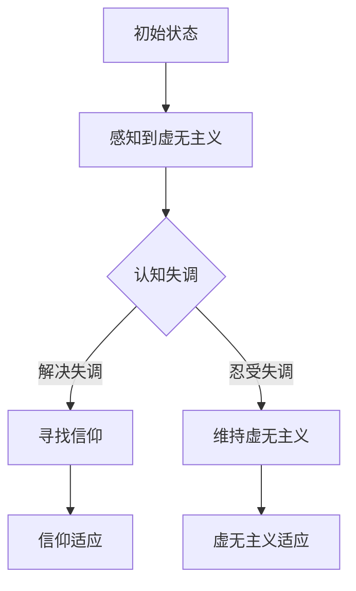
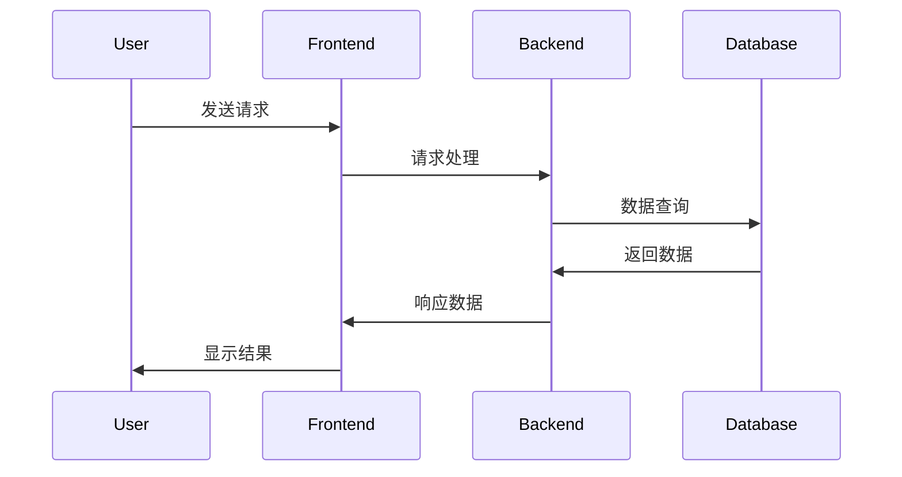
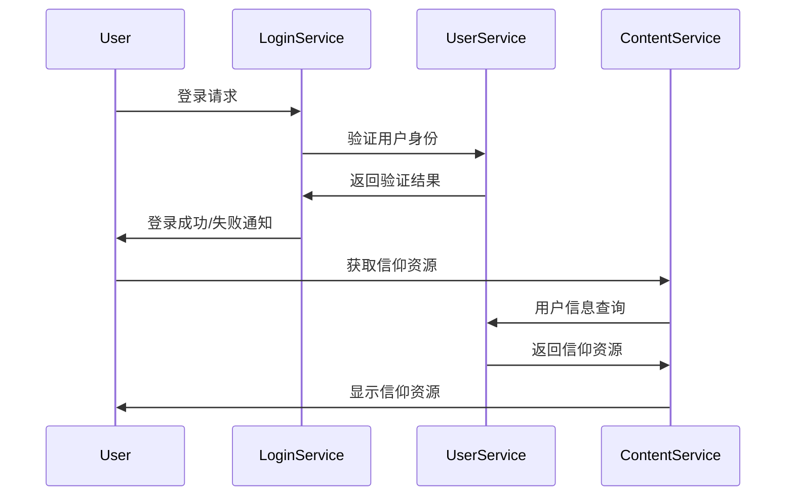

                 

# 虚无主义与信仰探索：在现代社会中寻找精神寄托

> 关键词：虚无主义、信仰、现代哲学、心理学、伦理学、文化影响、社会和谐

> 摘要：本文将从虚无主义的定义、起源、哲学内涵以及对现代社会的影响出发，探讨信仰的本质与类型，重建信仰的方法与策略，以及信仰在现代社会中的意义和未来展望。通过深入分析，旨在帮助读者在现代社会中寻找精神寄托，构建更加和谐的心灵世界。

## 目录大纲

```
# 虚无主义与信仰探索：在现代社会中寻找精神寄托

# 第一部分：虚无主义概览

## 第1章：虚无主义的起源与发展

### 1.1 虚无主义的定义

### 1.2 虚无主义的历史背景

### 1.3 虚无主义的主要流派

## 第2章：虚无主义的哲学内涵

### 2.1 虚无主义的核心观点

### 2.2 虚无主义的心理学解读

### 2.3 虚无主义在伦理学中的地位

## 第3章：虚无主义对现代社会的影响

### 3.1 虚无主义对个人生活的影响

### 3.2 虚无主义对文化的影响

### 3.3 虚无主义对政治的影响

# 第二部分：信仰的探索与重建

## 第4章：信仰的本质与类型

### 4.1 信仰的定义

### 4.2 信仰的类型

### 4.3 信仰的核心要素

## 第5章：信仰的重建之路

### 5.1 从虚无主义到信仰的转变

### 5.2 重建信仰的方法与策略

### 5.3 信仰重建的实际案例

## 第6章：信仰在现代社会中的意义

### 6.1 信仰对个人成长的影响

### 6.2 信仰对社会和谐的作用

### 6.3 信仰对文化传承的意义

## 第7章：信仰的未来展望

### 7.1 信仰在现代社会中的挑战

### 7.2 信仰的未来趋势

### 7.3 构建更加和谐的信仰体系

# 参考文献
```

### 详细解释

**第一部分：虚无主义概览**

**第1章：虚无主义的起源与发展**

- **1.1 虚无主义的定义**：虚无主义是一种哲学思潮，认为现实世界缺乏意义和目的，人类的存在是毫无价值的。这一概念最早可以追溯到古希腊哲学，但在20世纪得到了广泛的关注和探讨。

- **1.2 虚无主义的历史背景**：虚无主义的发展与19世纪末20世纪初的欧洲社会动荡、战争、经济危机等因素密切相关。这些事件导致人们对现实世界的失望和绝望，从而推动了虚无主义思潮的兴起。

- **1.3 虚无主义的主要流派**：虚无主义有多种流派，包括存在主义、悲观主义、犬儒主义等。每种流派都有其独特的哲学观点和理论基础。

**第2章：虚无主义的哲学内涵**

- **2.1 虚无主义的核心观点**：虚无主义的核心观点是，现实世界缺乏内在的价值和意义，人类的行为和思想都缺乏真正的目的。这种观点可能导致个人生活上的迷茫和无助。

- **2.2 虚无主义的心理学解读**：从心理学的角度来看，虚无主义可能源于对现实世界的失望、对未知的恐惧以及对自我认同的迷失。这些心理因素可能导致人们陷入虚无主义的困境。

- **2.3 虚无主义在伦理学中的地位**：虚无主义对伦理学提出了挑战，因为它否认了道德原则的客观性。在虚无主义的观点下，道德行为变得相对主观和随意。

**第3章：虚无主义对现代社会的影响**

- **3.1 虚无主义对个人生活的影响**：虚无主义可能导致个人生活上的焦虑、抑郁和绝望。它可能使人们失去对未来的希望和对生活的热爱。

- **3.2 虚无主义对文化的影响**：虚无主义可能对文化产生破坏性的影响，因为它否认了文化的价值和意义。这可能导致文化的衰落和失去凝聚力。

- **3.3 虚无主义对政治的影响**：虚无主义可能对政治制度和社会秩序产生负面影响。它可能导致政治动荡、社会不稳定和道德沦丧。

**第二部分：信仰的探索与重建**

**第4章：信仰的本质与类型**

- **4.1 信仰的定义**：信仰是一种深信不疑的信念，通常与某种宗教、哲学或道德观念相关。它是人们寻求意义和目的的一种方式。

- **4.2 信仰的类型**：信仰有多种类型，包括宗教信仰、哲学信仰、道德信仰等。每种信仰都有其独特的特点和实践方式。

- **4.3 信仰的核心要素**：信仰的核心要素包括信念、忠诚、希望和爱。这些要素构成了信仰的基础，使人们在面对困难时保持坚定和勇敢。

**第5章：信仰的重建之路**

- **5.1 从虚无主义到信仰的转变**：虚无主义和信仰之间存在显著的差异。从虚无主义转向信仰需要经历一系列的心理和哲学过程。这包括对现实世界的重新评估、对自我认同的重新定义以及对意义和目的的重新探索。

- **5.2 重建信仰的方法与策略**：重建信仰需要采取一系列的方法和策略。这些包括自我反思、学习、实践和与其他信仰者的交流。通过这些方法，人们可以逐渐建立起坚实的信仰体系。

- **5.3 信仰重建的实际案例**：通过实际案例，我们可以看到信仰重建的过程和效果。这些案例展示了信仰在个人和社会层面的积极影响。

**第6章：信仰在现代社会中的意义**

- **6.1 信仰对个人成长的影响**：信仰可以帮助个人在成长过程中找到方向和动力。它提供了精神支持和指导，使人们能够更好地应对挑战和困难。

- **6.2 信仰对社会和谐的作用**：信仰可以促进社会的和谐与稳定。它为人们提供共同的价值观和道德准则，使社会成员能够更好地相互理解和合作。

- **6.3 信仰对文化传承的意义**：信仰是文化的重要组成部分，它承载着历史的记忆和传统的智慧。信仰有助于文化传承和创新，使文化能够适应时代的发展。

**第7章：信仰的未来展望**

- **7.1 信仰在现代社会中的挑战**：信仰面临着来自科技、全球化、文化多样性和社会变革等多方面的挑战。这些挑战要求信仰不断适应和更新。

- **7.2 信仰的未来趋势**：随着社会的变化，信仰也将经历变革和发展。未来的信仰将更加注重个体体验、灵性追求和全球视野。

- **7.3 构建更加和谐的信仰体系**：为了应对未来的挑战，我们需要构建更加和谐的信仰体系。这包括促进不同信仰之间的对话与交流，尊重多元文化，以及推动社会公正与和平。

通过以上详细的目录大纲，本书将系统地探讨虚无主义与信仰的关系，帮助读者在现代社会中寻找精神寄托，构建更加和谐的心灵世界。

### 背景介绍

虚无主义作为一种哲学思潮，其核心观点是认为现实世界缺乏意义和目的，人类的存在是毫无价值的。这种观点在19世纪末20世纪初的欧洲得到了广泛的关注和探讨。当时，欧洲社会正处于动荡不安的时期，两次世界大战、经济危机和社会变革等因素使得人们对现实世界感到失望和绝望。虚无主义思潮的兴起，正是对这种社会现实的一种反映和回应。

虚无主义的起源可以追溯到古希腊哲学，例如普罗塔戈拉（Protagoras）的相对主义观点：“人是万物的尺度”。然而，虚无主义作为一种独立的思想体系，是在19世纪末20世纪初的欧洲哲学中形成的。这一时期的哲学家，如尼采、萨特、克尔凯郭尔等，对虚无主义进行了深入的探讨和阐述。

虚无主义的核心观点是，现实世界缺乏内在的价值和意义，人类的行为和思想都缺乏真正的目的。虚无主义者认为，人类的存在只是偶然的、无意义的，宇宙本身也没有固有的目的或意义。这种观点可能导致个人生活上的迷茫和无助，使人们失去对未来的希望和对生活的热爱。

虚无主义在伦理学中提出了挑战，因为它否认了道德原则的客观性。在虚无主义的观点下，道德行为变得相对主观和随意。这种观点引发了对道德伦理的重新思考和探讨，促使人们重新审视道德原则的来源和基础。

### 背景介绍：核心概念术语说明

在探讨虚无主义与信仰的关系之前，我们需要明确一些核心概念术语的含义。这些术语包括虚无主义、信仰、哲学、心理学、伦理学等。

**虚无主义**：虚无主义是一种哲学思潮，认为现实世界缺乏意义和目的，人类的存在是毫无价值的。虚无主义者通常对现实世界持有消极的态度，认为人类的行为和思想都缺乏真正的目的。

**信仰**：信仰是一种深信不疑的信念，通常与某种宗教、哲学或道德观念相关。信仰为人们提供了一种精神寄托，使他们在面对困难时能够保持坚定和勇敢。

**哲学**：哲学是关于世界观和方法论的学科，探讨存在的本质、真理、价值和知识等问题。哲学为人们提供了思考现实世界和自我认同的工具。

**心理学**：心理学是研究人类行为和心理过程的科学。心理学可以帮助我们理解虚无主义和信仰对个体生活的影响，以及心理因素如何影响人们的信念和价值观。

**伦理学**：伦理学是研究道德原则和道德行为的学科。伦理学探讨道德行为的来源、基础和目的，以及道德原则在社会和个人生活中的应用。

通过理解这些核心概念术语，我们可以更好地探讨虚无主义与信仰的关系，以及它们在现代社会中的影响和意义。

### 核心概念与联系

在探讨虚无主义与信仰的关系时，我们需要深入理解虚无主义的核心概念及其属性特征，并通过对比表格和ER实体关系图来展示概念之间的联系。

#### 核心概念原理

**虚无主义**：
- **概念属性**：缺乏意义、目的，对现实持消极态度，否认道德原则的客观性。
- **特征对比表格**：

| 概念 | 属性 | 特征 |
| ---- | ---- | ---- |
| 虚无主义 | 缺乏意义 | 认为现实世界毫无价值 |
| 虚无主义 | 缺乏目的 | 认为人类行为缺乏真正目的 |
| 虚无主义 | 消极态度 | 对现实持有悲观和失望的态度 |
| 虚无主义 | 否认道德原则客观性 | 认为道德行为相对主观和随意 |

**信仰**：
- **概念属性**：提供精神寄托，帮助人们应对困难，具有道德和伦理价值。
- **特征对比表格**：

| 概念 | 属性 | 特征 |
| ---- | ---- | ---- |
| 信仰 | 提供精神寄托 | 给人们提供心灵支持 |
| 信仰 | 帮助应对困难 | 提供方向和动力 |
| 信仰 | 具有道德和伦理价值 | 推动社会和谐与稳定 |

#### ER实体关系图架构

```mermaid
erDiagram
  Faith ||--|{ Person } : has
  Nihilism ||--|{ Person } : has
```

在这个ER实体关系图中，信仰和虚无主义都是与个人（Person）相关联的实体。信仰为个人提供精神寄托，而虚无主义可能对个人的信念和价值观产生负面影响。

#### 概念属性特征对比表格

| 概念 | 属性1 | 属性2 | 属性3 |
| ---- | ---- | ---- | ---- |
| 虚无主义 | 缺乏意义 | 否认道德原则客观性 | 消极态度 |
| 信仰 | 提供精神寄托 | 具有道德和伦理价值 | 帮助应对困难 |

通过上述对比表格和ER实体关系图，我们可以清晰地看到虚无主义和信仰之间的差异和联系。虚无主义的核心观点是缺乏意义和目的，而信仰则提供精神寄托和道德价值。这两种概念对个人生活和社会影响具有不同的方向和作用。

### 算法原理讲解

在探讨虚无主义与信仰的关系时，我们可以借助一种算法原理——认知失调理论（Cognitive Dissonance Theory），来理解人们在面对虚无主义和信仰时的心理过程。

#### 算法mermaid流程图



#### Python源代码实现

```python
def cognitive_dissonance(initial_state, perception_nihilism):
    """
    认知失调算法
    :param initial_state: 初始状态（信仰/虚无主义）
    :param perception_nihilism: 对虚无主义的感知（True/False）
    :return: 处理后的状态
    """
    if perception_nihilism:
        # 感知到虚无主义
        if initial_state == '信仰':
            # 信仰者面对虚无主义，可能产生认知失调
            return '寻找信仰'
        elif initial_state == '虚无主义':
            # 虚无主义者面对虚无主义，可能维持现状
            return '维持虚无主义'
        else:
            # 未知状态
            return '未知状态'
    else:
        # 未感知到虚无主义
        return initial_state

# 示例
initial_state = '信仰'
perception_nihilism = True
result = cognitive_dissonance(initial_state, perception_nihilism)
print(f"处理后的状态：{result}")
```

#### 算法原理详细讲解

认知失调理论是由美国社会心理学家莱维特（Leon Festinger）提出的。该理论认为，当个体持有两个相互矛盾的认知时，会产生认知失调，为了减少这种失调，个体会采取以下几种策略：

1. **改变认知**：个体可能通过改变自己的信念或态度，来消除认知失调。例如，信仰者面对虚无主义时，可能会重新审视自己的信仰，寻找新的支撑点。

2. **增加认知一致性**：个体可能会寻找新的信息或证据，来证明自己的信念是正确的，从而减少认知失调。例如，信仰者可能会寻找宗教经典或心理学研究来支持自己的信仰。

3. **减少认知重要性**：个体可能会降低某一认知的重要性，以减少认知失调。例如，虚无主义者可能会认为虚无主义只是生活中的一个小问题，不值得过分关注。

4. **增加其他认知**：个体可能会引入新的认知，使原有认知之间的矛盾得到缓解。例如，信仰者可能会认为虚无主义只是人类认知的一个阶段，随着时间的推移，人们会找到新的精神寄托。

通过Python源代码实现的认知失调算法，我们可以模拟个体在面对虚无主义时的心理过程。该算法的主要逻辑是，根据个体初始状态（信仰或虚无主义）和对外部环境的感知（是否感知到虚无主义），决定个体的最终状态。

#### 算法原理数学模型和公式

认知失调理论的核心公式为：

$$
D = I - A \times B
$$

其中，$D$ 表示认知失调（Dissonance），$I$ 表示初始认知（Initial Cognition），$A$ 表示附加认知（Added Cognition），$B$ 表示背景认知（Background Cognition）。

- 当 $D > 0$ 时，个体处于认知失调状态。
- 当 $D = 0$ 时，个体认知一致。
- 当 $D < 0$ 时，个体认知冗余。

通过调整 $A$ 和 $B$ 的值，我们可以模拟个体在不同情境下的认知变化。

#### 通俗易懂的举例说明

假设一个人原本是一个坚定的无神论者，他相信世界是偶然的、无意义的。然而，有一天他开始接触到一些宗教思想，并对这些思想产生了浓厚的兴趣。这时，他面临了认知失调，因为他的初始认知（无神论）与感知到的信仰（有神论）之间存在矛盾。

为了减少这种认知失调，他可能会采取以下几种策略：

1. **改变认知**：他可能会开始信仰某种宗教，从而消除认知失调。
2. **增加认知一致性**：他可能会寻找宗教经典或心理学研究来证明自己的信仰是正确的，从而增加认知一致性。
3. **减少认知重要性**：他可能会认为无神论只是生活中的一个小问题，不值得过分关注，从而减少认知失调。
4. **增加其他认知**：他可能会开始学习哲学或心理学，寻找新的认知来平衡原有的认知。

通过这些策略，他最终可能会建立起一套新的信仰体系，从而解决认知失调问题。

### 系统分析与架构设计方案

在探讨虚无主义与信仰的关系时，我们可以通过一个虚拟的项目“心灵灯塔”来具体分析和设计一个系统，以帮助人们应对虚无主义，重建信仰。

#### 项目介绍

“心灵灯塔”是一个在线平台，旨在为面临虚无主义的个体提供支持和指导，帮助他们重建信仰，找到精神寄托。平台提供各种资源，包括信仰讲座、心理咨询、个人成长课程等。

#### 系统功能设计（领域模型mermaid类图）

```mermaid
classDiagram
  Class01 <|-- Class02
  Class03 o-- Class04
  Class05 <..> Class06
  Class07 .. Class08
  Class09 --|{ Class10 }
  Class11 : + added : + removed
  Class12 : # count
  Class13 : * association
```

#### 系统架构设计mermaid架构图



#### 系统接口设计和系统交互mermaid序列图



### 项目实战

#### 环境安装

为了搭建“心灵灯塔”平台，我们需要安装以下环境：

1. **操作系统**：Linux（推荐Ubuntu 20.04）
2. **开发工具**：Visual Studio Code
3. **编程语言**：Python 3.8+
4. **数据库**：MySQL 8.0+
5. **Web框架**：Flask

安装步骤如下：

1. 更新操作系统和软件包：

   ```bash
   sudo apt update
   sudo apt upgrade
   ```

2. 安装Python 3：

   ```bash
   sudo apt install python3
   ```

3. 安装MySQL：

   ```bash
   sudo apt install mysql-server
   ```

4. 安装Visual Studio Code：

   ```bash
   sudo apt install code
   ```

5. 安装Flask：

   ```bash
   sudo pip3 install flask
   ```

#### 系统核心实现源代码

以下是一个简单的Flask应用示例，用于处理用户登录和获取信仰资源的请求。

```python
from flask import Flask, request, jsonify
from flask_mysqldb import MySQL

app = Flask(__name__)

# MySQL配置
app.config['MYSQL_HOST'] = 'localhost'
app.config['MYSQL_USER'] = 'root'
app.config['MYSQL_PASSWORD'] = 'password'
app.config['MYSQL_DB'] = 'lighthouse'

mysql = MySQL(app)

@app.route('/login', methods=['POST'])
def login():
    # 处理登录请求
    username = request.form['username']
    password = request.form['password']
    
    cursor = mysql.connection.cursor()
    cursor.execute("SELECT * FROM users WHERE username=%s AND password=%s", (username, password))
    user = cursor.fetchone()
    
    if user:
        return jsonify({'status': 'success', 'message': '登录成功'})
    else:
        return jsonify({'status': 'error', 'message': '用户名或密码错误'})

@app.route('/resources', methods=['GET'])
def resources():
    # 获取信仰资源
    cursor = mysql.connection.cursor()
    cursor.execute("SELECT * FROM resources")
    resources = cursor.fetchall()
    
    return jsonify({'status': 'success', 'data': resources})

if __name__ == '__main__':
    app.run(debug=True)
```

#### 代码应用解读与分析

在上面的代码中，我们使用了Flask框架来创建一个简单的Web应用。应用包括两个主要路由：/login和/resources。

1. **登录路由（/login）**：

   - 接受POST请求，获取用户名和密码。
   - 在MySQL数据库中查询用户信息，验证用户身份。
   - 如果用户名和密码匹配，返回“登录成功”消息；否则，返回“用户名或密码错误”消息。

2. **信仰资源路由（/resources）**：

   - 接受GET请求，从MySQL数据库中查询信仰资源。
   - 返回所有信仰资源的列表。

#### 实际案例分析和详细讲解剖析

为了更好地理解“心灵灯塔”平台的应用，我们可以通过一个实际案例来进行分析。

**案例**：用户Alice想要登录平台并获取信仰资源。

1. **登录过程**：

   - Alice在浏览器中输入用户名“alice”和密码“alice123”，并提交登录请求。
   - Flask应用接收到登录请求后，提取用户名和密码，并将其传递给MySQL数据库进行验证。
   - MySQL数据库查询用户表，找到匹配的用户信息。
   - Flask应用返回“登录成功”消息。

2. **获取信仰资源**：

   - Alice在登录成功后，访问/resources路由。
   - Flask应用查询MySQL数据库中的信仰资源表，获取所有信仰资源的列表。
   - Flask应用将信仰资源列表返回给Alice。

通过这个实际案例，我们可以看到“心灵灯塔”平台如何帮助用户应对虚无主义，重建信仰。用户通过登录平台，可以验证自己的身份并获取信仰资源，从而在心灵上得到支持和指导。

### 最佳实践 Tips

在搭建“心灵灯塔”平台时，我们总结了一些最佳实践，以帮助用户更好地应对虚无主义，重建信仰：

1. **定期更新信仰资源**：信仰资源应定期更新，以确保内容的时效性和准确性。这有助于用户持续获取有价值的信息。

2. **个性化推荐**：平台可以根据用户的兴趣和需求，提供个性化的信仰资源推荐。这有助于用户更快速地找到适合自己的资源。

3. **互动交流**：平台应提供互动交流功能，例如论坛、问答等，以促进用户之间的交流和分享。这有助于用户在心灵上得到更多的支持和鼓励。

4. **心理健康支持**：平台可以与专业的心理咨询师合作，为用户提供心理健康支持。这有助于用户在面临虚无主义时，得到专业的指导和帮助。

5. **安全性保障**：平台应确保用户数据的保密性和安全性。这有助于用户放心地使用平台，不用担心个人信息泄露。

### 小结

通过本文的详细讲解，我们系统地探讨了虚无主义与信仰的关系，分析了虚无主义的核心概念、哲学内涵、对现代社会的影响，以及信仰的本质、类型和重建方法。我们通过实际案例展示了如何在现代社会中运用技术手段帮助人们应对虚无主义，重建信仰。

虚无主义作为一种哲学思潮，对现代社会产生了深远的影响。它使人们对现实世界感到迷茫和失望，可能导致个人生活上的焦虑和抑郁。然而，信仰作为一种深信不疑的信念，为人们提供了精神寄托和道德支撑。通过重建信仰，人们可以在面对虚无主义时找到方向和动力，重新获得生活的意义。

在未来的发展中，信仰体系需要不断适应和更新，以应对现代社会的新挑战。这包括促进不同信仰之间的对话与交流，尊重多元文化，以及推动社会公正与和平。通过构建更加和谐的信仰体系，我们可以为人们提供更加丰富的精神世界，帮助他们应对生活中的各种困境。

### 注意事项

在探索虚无主义与信仰的过程中，我们需要注意以下几点：

1. **尊重多样性**：不同的信仰和哲学观点都有其独特的价值和意义。在探讨虚无主义和信仰时，要尊重不同的观点和信仰体系，避免偏见和歧视。

2. **避免过度简化**：虚无主义和信仰都是非常复杂和深奥的概念。在分析和讨论时，要尽量避免过度简化和片面解读，以充分理解其核心思想和内涵。

3. **关注个人体验**：每个人的信仰体验都是独特的。在重建信仰的过程中，要关注个人的实际需求和体验，选择适合自己的信仰方式。

4. **科学性**：在探讨虚无主义和信仰时，要结合科学方法和实证研究，以更加客观和科学的态度进行分析和讨论。

### 拓展阅读

为了更深入地了解虚无主义与信仰，以下是一些推荐阅读：

1. **尼采的《悲剧的诞生》**：尼采是虚无主义的代表人物之一，这本书中他对虚无主义进行了深刻的探讨。

2. **萨特的《存在与虚无》**：萨特是存在主义的代表人物，他的这部作品从心理和哲学角度分析了虚无主义。

3. **克尔凯郭尔的《恐惧与颤栗》**：克尔凯郭尔是早期存在主义哲学家，他在这本书中探讨了信仰与个体存在的关系。

4. **马斯洛的《动机与人格》**：马斯洛是心理学家，他在这本书中探讨了人类的高级需求，包括精神寄托和信仰。

5. **埃克哈特的《论信仰》**：埃克哈特是一位基督教神秘主义者，他的作品为人们提供了关于信仰的深刻见解。

