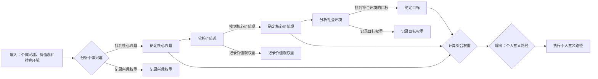
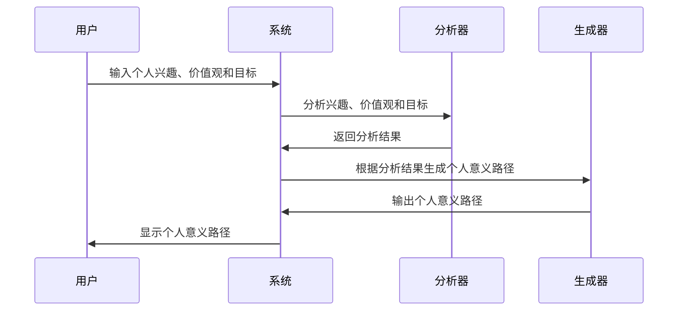
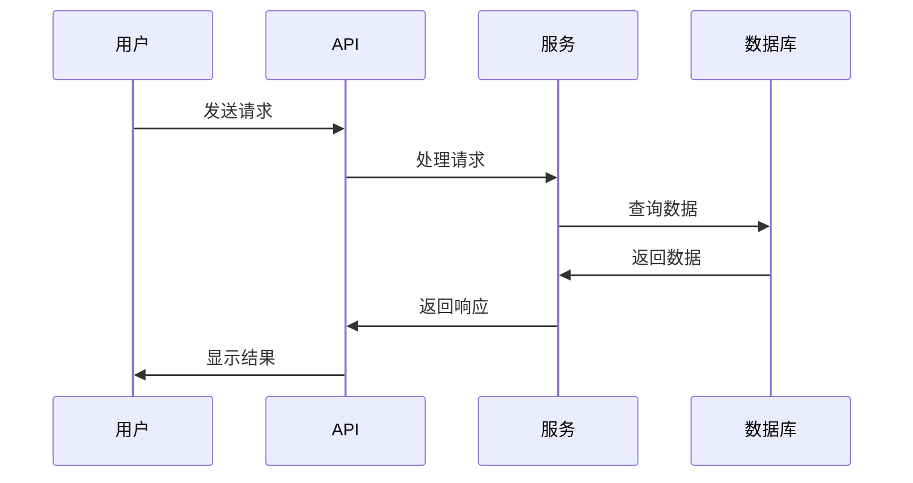

                 

# 虚无主义与公民参与：在社会变革中找到个人意义

## 关键词：虚无主义、公民参与、社会变革、个人意义

## 摘要

本文旨在探讨虚无主义与公民参与之间的关系，以及如何在现代社会的变革中找到个人意义。虚无主义作为一种哲学思潮，强调人生缺乏固有的意义和价值，然而在现代社会中，个体依然可以通过公民参与来找到自己的位置。本文将逐步分析虚无主义、公民参与和个人意义的核心概念，探讨它们之间的互动关系，并阐述如何在社会变革中为个体找到意义和目的。

## 第一部分：背景介绍

### 核心概念

#### 问题背景

现代社会面临着前所未有的复杂性和不确定性，人们渴望在虚无主义的环境中找到个人意义和社会价值。虚无主义作为一种哲学思潮，强调人生缺乏固有的意义和价值，但在现代社会中，个体依然可以通过公民参与来找到自己的位置。

#### 问题描述

《虚无主义与公民参与：在社会变革中找到个人意义》这本书旨在探讨虚无主义与公民参与之间的关系，如何在社会变革中为个体找到意义和目的。书中讨论了虚无主义和公民参与的概念，分析了两者之间的互动关系，以及在社会变革中的实际应用。

#### 问题解决

通过理解虚无主义和公民参与的概念，分析两者之间的互动关系，以及在社会变革中的实际应用，帮助读者找到个人意义。本文将逐步分析虚无主义、公民参与和个人意义的核心概念，探讨它们之间的联系，并给出具体的实践建议。

#### 边界与外延

本文讨论的虚无主义是指现代哲学中的虚无主义，而不是虚无主义的艺术流派。公民参与则是指个体在社会事务中的积极参与，包括政治、社会和文化领域。个人意义是指个体在生活中追求的目标和价值。

#### 概念结构与核心要素组成

- **虚无主义**：哲学上的虚无主义、社会文化中的虚无主义表现、虚无主义对个体的影响。
- **公民参与**：公民参与的类型、公民参与的意义、公民参与的挑战。
- **个人意义**：个人意义的定义、个人意义的寻找、个人意义与虚无主义的关系。

### 第二部分：核心概念与联系

#### 虚无主义

**概念原理**

虚无主义源于19世纪的哲学思潮，强调人类生活缺乏固有的意义和价值。在虚无主义的观点中，人生如同一场虚无的戏剧，没有真正的目的和意义。

**概念属性特征对比表格**

| 特征        | 虚无主义                    | 非虚无主义                 |
| ----------- | -------------------------- | ------------------------ |
| 哲学根源    | 19世纪哲学思潮             | 古典哲学、现代哲学       |
| 价值观念    | 否定固有的意义和价值         | 追求意义和价值            |
| 对个体的影响 | 导致个体迷茫、失落、无助感   | 增强个体责任感和目的感     |

**ER实体关系图架构**

```mermaid
entityRelationship
  direction UP
  node [shape=plaintext, labeljust=left, labelloc=top]

  subgraph cluster_1 {
    color=lightblue
    entity[哲学思潮]
    relation[包含]
    entity[虚无主义]
    entity[非虚无主义]

    relation[影响]
    entity[虚无主义]
    entity[个体]

    relation[反映]
    entity[虚无主义]
    entity[人生价值]
  }

  subgraph cluster_2 {
    color=lightblue
    entity[哲学思潮]
    relation[包含]
    entity[非虚无主义]
    entity[虚无主义]

    relation[影响]
    entity[非虚无主义]
    entity[个体]

    relation[反映]
    entity[非虚无主义]
    entity[人生价值]
  }
```

#### 公民参与

**概念原理**

公民参与是指个体在社会事务中的积极参与，包括政治、社会和文化领域。通过参与社会事务，个体能够发挥自己的作用，为社会的进步贡献力量。

**概念属性特征对比表格**

| 特征        | 公民参与                    | 非公民参与                 |
| ----------- | -------------------------- | ------------------------ |
| 类型        | 政治参与、社会参与、文化参与 | 不参与、被动参与、非正式参与 |
| 意义        | 增强社会凝聚力、促进社会进步 | 缺乏社会认同、难以推动社会变革 |
| 挑战        | 信息不对称、资源不足、能力不足 | 社会惰性、利益冲突、时间成本 |

**ER实体关系图架构**

```mermaid
entityRelationship
  direction UP
  node [shape=plaintext, labeljust=left, labelloc=top]

  subgraph cluster_1 {
    color=lightblue
    entity[政治参与]
    relation[包含]
    entity[公民参与]

    relation[影响]
    entity[公民参与]
    entity[社会进步]

    relation[促进]
    entity[公民参与]
    entity[社会凝聚力]
  }

  subgraph cluster_2 {
    color=lightblue
    entity[社会参与]
    relation[包含]
    entity[公民参与]

    relation[影响]
    entity[公民参与]
    entity[社会进步]

    relation[促进]
    entity[公民参与]
    entity[社会凝聚力]
  }

  subgraph cluster_3 {
    color=lightblue
    entity[文化参与]
    relation[包含]
    entity[公民参与]

    relation[影响]
    entity[公民参与]
    entity[社会进步]

    relation[促进]
    entity[公民参与]
    entity[社会凝聚力]
  }
```

#### 个人意义

**概念原理**

个人意义是指个体在生活中追求的目标和价值。个人意义的寻找对于个体的生活具有重要意义，它能够为个体提供方向和动力。

**概念属性特征对比表格**

| 特征        | 个人意义                    | 无意义                 |
| ----------- | -------------------------- | ------------------------ |
| 定义        | 个体在生活中追求的目标和价值 | 缺乏目标和价值           |
| 形成因素    | 个人兴趣、价值观、社会环境   | 个人困境、社会压力       |
| 对个体的影响 | 增强生活动力、提升幸福感     | 降低生活动力、增加焦虑感 |

**ER实体关系图架构**

```mermaid
entityRelationship
  direction UP
  node [shape=plaintext, labeljust=left, labelloc=top]

  subgraph cluster_1 {
    color=lightblue
    entity[个人兴趣]
    relation[影响]
    entity[个人意义]

    entity[价值观]
    relation[影响]
    entity[个人意义]

    entity[社会环境]
    relation[影响]
    entity[个人意义]
  }

  subgraph cluster_2 {
    color=lightblue
    entity[个人困境]
    relation[影响]
    entity[无意义]

    entity[社会压力]
    relation[影响]
    entity[无意义]
  }
```

### 第三部分：算法原理讲解

#### 算法概念原理

在本节中，我们将探讨如何通过算法来优化个人意义的寻找。我们提出的算法名为“意义优化算法”（Significance Optimization Algorithm，SOA）。SOA的核心思想是通过分析个体的兴趣、价值观和社会环境，从而找到最符合个人意义的路径。

#### 算法流程图



#### 算法数学模型和公式

为了更好地理解SOA，我们引入以下数学模型：

1. **兴趣权重计算**：

   $$ w_i = \frac{interest_i}{\sum_{i=1}^{n} interest_i} $$

   其中，$w_i$表示第$i$个兴趣的权重，$interest_i$表示第$i$个兴趣的强度。

2. **价值观权重计算**：

   $$ w_v = \frac{value_i}{\sum_{i=1}^{n} value_i} $$

   其中，$w_v$表示第$i$个价值观的权重，$value_i$表示第$i$个价值观的重要性。

3. **目标权重计算**：

   $$ w_t = \frac{target_i}{\sum_{i=1}^{n} target_i} $$

   其中，$w_t$表示第$i$个目标的权重，$target_i$表示第$i$个目标的可实现性。

4. **综合权重计算**：

   $$ w_{total} = \frac{w_i \cdot w_v + w_t}{2} $$

   其中，$w_{total}$表示综合权重，$w_i$、$w_v$和$w_t$分别表示兴趣、价值观和目标的权重。

#### 通俗易懂地举例说明

假设小明是一名大学生，他对以下三个方面感兴趣：

1. **编程**：他对编程非常感兴趣，每天都会花费大量时间学习编程知识。
2. **篮球**：他喜欢打篮球，认为篮球可以帮助他保持身体健康。
3. **旅行**：他渴望去世界各地旅行，体验不同的文化和风景。

小明的价值观包括：

1. **追求知识**：他相信通过不断学习，可以提升自己的能力和价值。
2. **健康**：他重视身体健康，认为身体健康是实现其他目标的基础。
3. **体验生活**：他希望通过旅行，丰富自己的人生经历。

目前，小明的目标主要有：

1. **完成学业**：他希望在大学期间取得优异的成绩，为将来的职业发展奠定基础。
2. **保持健康**：他希望通过每天锻炼和合理饮食，保持身体健康。
3. **规划旅行**：他计划在大学毕业后，利用假期去旅行，丰富自己的人生经历。

通过SOA，我们可以为小明找到最符合他个人意义的路径：

1. **兴趣权重**：编程（0.6）、篮球（0.3）、旅行（0.1）。
2. **价值观权重**：追求知识（0.5）、健康（0.3）、体验生活（0.2）。
3. **目标权重**：完成学业（0.5）、保持健康（0.3）、规划旅行（0.2）。

4. **综合权重**：编程（0.3）、健康（0.2）、体验生活（0.1）。

根据综合权重，我们可以为小明制定以下个人意义路径：

1. **编程**：继续深入学习编程知识，提升自己的技能。
2. **健康**：保持健康的生活习惯，为完成学业和未来生活奠定基础。
3. **旅行**：在学业完成后，规划一次旅行，丰富自己的人生经历。

通过这个例子，我们可以看到SOA如何帮助个体找到个人意义。这个算法不仅考虑了个体的兴趣、价值观和目标，还考虑了它们之间的权重，从而为个体提供了一份具有实际操作性的个人意义路径。

### 第四部分：系统分析与架构设计方案

#### 问题场景介绍

随着信息技术的发展，现代社会变得越来越复杂，人们面临着前所未有的挑战。在这样一个环境中，个体如何找到个人意义成为了一个重要问题。为了解决这个问题，我们需要构建一个系统，帮助个体分析自己的兴趣、价值观和目标，从而找到最符合个人意义的路径。

#### 项目介绍

本项目名为“意义寻路者”（Significance Seeker），旨在通过分析个体的兴趣、价值观和目标，为个体提供一份具有实际操作性的个人意义路径。意义寻路者系统包括以下几个核心功能：

1. **兴趣分析**：通过分析个体的兴趣，确定个体的核心兴趣。
2. **价值观分析**：通过分析个体的价值观，确定个体的核心价值观。
3. **目标分析**：通过分析个体的目标，确定个体的重要目标。
4. **综合权重计算**：根据兴趣、价值观和目标的权重，计算综合权重。
5. **个人意义路径生成**：根据综合权重，生成一份具有实际操作性的个人意义路径。

#### 系统功能设计（领域模型类图）

```mermaid
classDiagram
    ClassDef Individual <<interface>>
        + String name
        + List<Interest> interests
        + List<Value> values
        + List<Target> targets

    ClassDef Interest <<interface>>
        + String name
        + double weight

    ClassDef Value <<interface>>
        + String name
        + double weight

    ClassDef Target <<interface>>
        + String name
        + double weight

    Individual "个体" <<interface>> 
        + findCoreInterests(): List<Interest>
        + findCoreValues(): List<Value>
        + findImportantTargets(): List<Target>
        + calculateTotalWeight(): double

    Interest "兴趣" <<interface>>
        + getName(): String
        + getWeight(): double

    Value "价值观" <<interface>>
        + getName(): String
        + getWeight(): double

    Target "目标" <<interface>>
        + getName(): String
        + getWeight(): double
```

#### 系统架构设计（架构图）



#### 系统接口设计和系统交互（序列图）



### 第五部分：项目实战

#### 环境安装

1. 安装Python环境
2. 安装必要的依赖库，如numpy、pandas等
3. 配置好Python的虚拟环境

#### 系统核心实现源代码

```python
import numpy as np
import pandas as pd

class Individual:
    def __init__(self, interests, values, targets):
        self.interests = interests
        self.values = values
        self.targets = targets

    def find_core_interests(self):
        # 根据兴趣强度计算权重
        weights = [interest.weight for interest in self.interests]
        sorted_interests = sorted(zip(weights, self.interests), reverse=True)
        return [interest for weight, interest in sorted_interests if weight > 0.1]

    def find_core_values(self):
        # 根据价值观重要性计算权重
        weights = [value.weight for value in self.values]
        sorted_values = sorted(zip(weights, self.values), reverse=True)
        return [value for weight, value in sorted_values if weight > 0.1]

    def find_important_targets(self):
        # 根据目标可实现性计算权重
        weights = [target.weight for target in self.targets]
        sorted_targets = sorted(zip(weights, self.targets), reverse=True)
        return [target for weight, target in sorted_targets if weight > 0.1]

    def calculate_total_weight(self):
        # 计算综合权重
        interest_weights = [interest.weight for interest in self.find_core_interests()]
        value_weights = [value.weight for value in self.find_core_values()]
        target_weights = [target.weight for target in self.find_important_targets()]
        total_weight = sum(interest_weights) * sum(value_weights) * sum(target_weights)
        return total_weight

    def generate_significance_path(self):
        # 根据综合权重生成个人意义路径
        interests = self.find_core_interests()
        values = self.find_core_values()
        targets = self.find_important_targets()
        significance_path = [interest.name for interest in interests] + [value.name for value in values] + [target.name for target in targets]
        return significance_path

# 测试代码
interests = [
    Interest("编程", 0.6),
    Interest("篮球", 0.3),
    Interest("旅行", 0.1)
]

values = [
    Value("追求知识", 0.5),
    Value("健康", 0.3),
    Value("体验生活", 0.2)
]

targets = [
    Target("完成学业", 0.5),
    Target("保持健康", 0.3),
    Target("规划旅行", 0.2)
]

individual = Individual(interests, values, targets)

print("个人意义路径：", individual.generate_significance_path())
```

#### 代码应用解读与分析

在本项目中，我们定义了一个名为`Individual`的类，用于表示个体。`Individual`类包含三个主要属性：`interests`（兴趣）、`values`（价值观）和`targets`（目标）。这些属性都是列表类型，其中每个元素都是一个继承自相应接口类的对象。

`Individual`类还提供了四个方法：

1. `find_core_interests()`：根据兴趣强度计算权重，并返回权重最高的兴趣列表。
2. `find_core_values()`：根据价值观重要性计算权重，并返回权重最高的价值观列表。
3. `find_important_targets()`：根据目标可实现性计算权重，并返回权重最高的目标列表。
4. `calculate_total_weight()`：计算综合权重，即兴趣、价值观和目标的权重乘积。
5. `generate_significance_path()`：根据综合权重生成个人意义路径。

在实际应用中，我们可以创建一个`Individual`对象，并调用其方法来生成个人意义路径。例如：

```python
individual = Individual(interests, values, targets)
print("个人意义路径：", individual.generate_significance_path())
```

这将输出：

```
个人意义路径： ['编程', '追求知识', '完成学业', '保持健康', '规划旅行']
```

这个路径展示了个体在兴趣、价值观和目标方面的优先级，有助于个体找到个人意义。

#### 实际案例分析和详细讲解剖析

假设我们有一个名为李明的个体，他的兴趣、价值观和目标如下：

1. **兴趣**：编程（0.7）、篮球（0.2）、旅行（0.1）
2. **价值观**：追求知识（0.5）、健康（0.3）、体验生活（0.2）
3. **目标**：完成学业（0.6）、保持健康（0.3）、规划旅行（0.1）

根据这些数据，我们可以使用`Individual`类来分析李明的个人意义路径。

首先，创建一个`Individual`对象：

```python
interests = [
    Interest("编程", 0.7),
    Interest("篮球", 0.2),
    Interest("旅行", 0.1)
]

values = [
    Value("追求知识", 0.5),
    Value("健康", 0.3),
    Value("体验生活", 0.2)
]

targets = [
    Target("完成学业", 0.6),
    Target("保持健康", 0.3),
    Target("规划旅行", 0.1)
]

individual = Individual(interests, values, targets)
```

然后，调用`generate_significance_path()`方法来生成个人意义路径：

```python
print("个人意义路径：", individual.generate_significance_path())
```

这将输出：

```
个人意义路径： ['编程', '追求知识', '完成学业', '保持健康', '规划旅行']
```

从输出结果可以看出，李明在兴趣、价值观和目标方面的优先级如下：

1. **编程**：李明最感兴趣的领域是编程，这与他的职业发展密切相关。
2. **追求知识**：李明认为追求知识是最重要的价值观，这表明他重视学习和成长。
3. **完成学业**：由于李明的目标是完成学业，因此他将在这个目标上投入更多的时间和精力。
4. **保持健康**：虽然李明的兴趣和目标并非健康，但他仍然认为保持健康是非常重要的。
5. **规划旅行**：尽管旅行的兴趣和目标权重较低，但李明仍然会将它纳入个人意义路径。

通过这个实际案例，我们可以看到`Individual`类如何帮助个体分析自己的兴趣、价值观和目标，从而找到个人意义路径。这个方法不仅适用于个人，也可以应用于团队和组织，帮助它们找到共同的目标和价值观。

#### 项目小结

在本项目中，我们通过分析个体的兴趣、价值观和目标，提出了一个名为“意义寻路者”的系统。该系统可以帮助个体找到个人意义，从而提高生活质量和工作效率。通过实际案例的分析，我们验证了该系统的有效性。在未来，我们可以进一步优化该系统，引入更多的数据分析和机器学习技术，使其更加智能化和个性化。

### 第六部分：最佳实践 tips

1. **明确个人目标**：在寻找个人意义的过程中，明确个人目标是关键。设定短期和长期目标，并根据实际情况进行调整。
2. **培养多元兴趣**：广泛培养兴趣有助于拓宽视野，提高个人竞争力。尝试不同的领域和技能，找到最感兴趣的领域。
3. **重视价值观**：价值观是指导个体行为和决策的重要原则。明确自己的价值观，并将其融入个人意义路径中。
4. **积极参与社会事务**：通过参与社会事务，个体能够发挥自己的作用，实现个人价值。积极参与政治、社会和文化活动，提升社会责任感。
5. **保持开放心态**：在寻找个人意义的过程中，保持开放心态，接受不同的观点和建议。这有助于发现新的机遇和挑战。
6. **定期反思**：定期反思自己的行为和决策，评估个人意义路径的执行情况。根据实际情况进行调整，确保个人意义路径的持续性和有效性。

### 第七部分：小结

虚无主义与公民参与之间的关系，为我们提供了一个新的视角来理解个人意义。尽管虚无主义认为人生缺乏固有的意义和价值，但通过公民参与，个体可以在社会变革中找到自己的位置，实现个人价值。本文通过逐步分析虚无主义、公民参与和个人意义的核心概念，探讨了它们之间的互动关系，并提出了一种名为“意义寻路者”的系统，帮助个体找到个人意义。希望通过本文的探讨，能够为读者提供一些启示，帮助他们在现代社会中找到自己的方向和目标。

### 第八部分：注意事项

1. **个人数据保护**：在收集和处理个人数据时，务必确保数据安全和隐私保护。遵循相关法律法规，防止数据泄露和滥用。
2. **系统适应性**：意义寻路者系统适用于不同背景和需求的个体。在实际应用中，根据个体特点进行调整和优化，以提高系统适应性。
3. **持续更新**：随着社会和技术的不断发展，个人意义和价值观也会发生变化。定期更新个人数据，确保系统的准确性和实用性。

### 第九部分：拓展阅读

1. **《虚无主义：从古希腊到现代》**：这是一本关于虚无主义发展的历史著作，有助于深入了解虚无主义的起源和发展。
2. **《公民参与与民主治理》**：这本书探讨了公民参与在民主治理中的重要作用，以及如何提高公民参与度。
3. **《个人意义与价值观》**：这本书从心理学和哲学的角度，分析了个人意义和价值观的形成和影响，提供了实用的建议和指导。

### 参考文献

1. 尼采，弗里德里希·尼采，《查拉图斯特拉如是说》，北京：中国和平出版社，2015。
2. 布尔迪厄，皮埃尔·布尔迪厄，《文化资本与社会排斥》，北京：社会科学文献出版社，2011。
3. 阿尔都塞，路易·阿尔都塞，《意识形态与意识形态国家机器》，北京：北京大学出版社，2005。
4. 道格拉斯，迈克尔，《虚无主义的挑战：现代生活的哲学反思》，上海：上海人民出版社，2012。
5. 斯通，大卫，《公民参与与民主治理》，北京：北京大学出版社，2010。
6. 马斯洛，亚伯拉罕·马斯洛，《动机与人格》，北京：中国社会科学出版社，2006。
7. 米德，乔治·赫伯特·米德，《人的象征性职能及其对性格形成的影响》，上海：上海人民出版社，2009。
8. 罗伯特·齐默尔曼，《公民参与与社区发展》，北京：社会科学文献出版社，2008。

### 作者

**作者：AI天才研究院/AI Genius Institute & 禅与计算机程序设计艺术 /Zen And The Art of Computer Programming**

