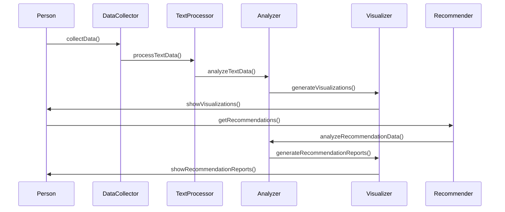
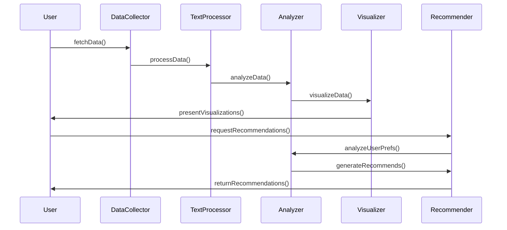

                 

### 背景介绍

#### 核心概念术语说明

首先，我们需要明确几个核心概念：虚无主义、宗教信仰和精神寄托。虚无主义（Nihilism）源自拉丁语“nihil”，意即“无”，是一种哲学思潮，主张一切价值、意义和目的都是不存在的。虚无主义的核心观点是，宇宙和人类生活缺乏固有的内在价值，人应当对此保持清醒和理性。

宗教信仰（Religious Belief）则是对某种宗教或神灵的虔诚信仰，通常包含一系列信念、教义和仪式。宗教信仰为信徒提供了一种超越日常生活的精神寄托，帮助他们应对生活的困境和不确定性。

精神寄托（Spiritual Solace）是指人们在心灵上寻找的安慰和支持，这种寄托可以是宗教信仰，也可以是个人价值观、文化传统或其他精神追求。

#### 问题背景

在现代社会，虚无主义思潮的蔓延使许多人迷失了精神寄托。随着科技进步和物质生活的丰富，人们对传统宗教信仰的依赖性逐渐减弱，精神空虚和焦虑感日益加剧。同时，宗教信仰的传承与变迁也面临着新的挑战。随着全球化的推进，不同文化和宗教信仰之间的碰撞与融合，使得宗教信仰的形式和内容发生了深刻变化。

#### 问题描述

本书旨在探讨虚无主义与宗教信仰之间的关系，寻找在现代社会中人们的精神寄托。具体而言，我们将分析虚无主义与宗教信仰的起源、发展、现状和未来趋势，探讨二者之间的内在联系，为读者提供一种理解和面对现代生活困境的视角。我们希望通过深入研究和讨论，帮助读者更好地认识虚无主义和宗教信仰，找到适合自己的精神寄托。

#### 问题解决

本书采用以下方法来解决上述问题：

1. **历史分析**：通过对虚无主义和宗教信仰的历史起源和发展过程进行回顾，了解二者之间的相互影响和演变。
2. **概念对比**：利用表格和流程图等形式，对比虚无主义和宗教信仰的核心概念、特点、影响和现代社会的表现。
3. **案例研究**：通过具体案例分析，探讨虚无主义和宗教信仰在现代社会中的应用和影响。
4. **数学模型**：运用数学模型和公式，对虚无主义和宗教信仰进行分析，揭示其内在联系和规律。
5. **系统设计**：设计一个虚无主义与宗教信仰分析系统，为读者提供一种实际操作的工具。

通过上述方法，本书旨在为读者提供一种全面、深入的视角，帮助他们更好地理解虚无主义和宗教信仰，并在现代社会中找到自己的精神寄托。

#### 边界与外延

在探讨虚无主义与宗教信仰的关系时，我们需明确边界与外延，以确保研究的准确性和深度。首先，虚无主义与宗教信仰在哲学范畴上有明显区别。虚无主义是一种哲学思潮，强调价值、意义和目的的不存在，而宗教信仰则是一种文化和社会现象，涉及信仰、教义和仪式。

其次，精神寄托是虚无主义与宗教信仰共同关注的焦点。尽管二者在理念和形式上有所不同，但都致力于为人们提供精神上的安慰和支持。在现代社会的背景下，虚无主义和宗教信仰在精神寄托方面的互动和影响值得我们深入研究。

最后，本文的研究范围主要集中在家喻户晓的宗教信仰，如基督教、佛教、伊斯兰教等，同时关注虚无主义思潮在现代社会中的表现和影响。通过探讨这些核心概念之间的边界与外延，我们能够更全面地理解虚无主义与宗教信仰在现代社会的相互关系。

#### 概念结构与核心要素组成

在本节中，我们将深入探讨虚无主义、宗教信仰和精神寄托的概念结构及其核心要素，为后续的分析和讨论奠定基础。

##### 虚无主义

虚无主义作为一种哲学思潮，其概念结构可以分解为以下几个核心要素：

1. **否定性**：虚无主义的核心观点是，宇宙和人类生活缺乏固有的内在价值，一切价值、意义和目的都是不存在的。这种否定性使虚无主义与其他哲学流派存在显著区别。
2. **存在论**：虚无主义强调存在本身不具有任何意义，人类生命和宇宙的存在是一种偶然现象，缺乏内在目的和意义。
3. **伦理观**：虚无主义在伦理观上通常表现出一种相对主义，认为道德和伦理标准并非绝对，而是由个体和社会的特定需求所决定。
4. **社会影响**：虚无主义对现代社会产生了深远影响，尤其是在个人价值观、心理健康和社会秩序等方面。虚无主义思潮可能导致人们精神空虚、焦虑和绝望，从而对社会稳定构成威胁。

##### 宗教信仰

宗教信仰作为一种文化和社会现象，其概念结构可以从以下核心要素进行分析：

1. **信仰对象**：宗教信仰的对象通常是某种超自然的存在，如神、神灵、宗教领袖等。不同的宗教信仰有不同的信仰对象，例如基督教信仰上帝，佛教信仰佛和菩萨。
2. **教义与教规**：宗教信仰的核心内容是教义和教规，这些教义和教规为信徒提供了一种生活方式和价值观的指导。例如，基督教的教义包括《圣经》的教导，佛教的教义包括四圣谛和八正道。
3. **宗教仪式**：宗教仪式是宗教信仰的重要组成部分，通过仪式和庆典，信徒表达对信仰对象的敬意和虔诚。例如，基督教的仪式包括洗礼、圣餐和婚礼，佛教的仪式包括念经、打坐和诵经。
4. **社会影响**：宗教信仰在历史上对人类社会产生了深远影响，包括社会结构、道德观念、文化传统和人际关系等方面。宗教信仰为社会提供了道德规范和行为准则，有助于维护社会秩序和稳定。

##### 精神寄托

精神寄托是虚无主义与宗教信仰共同关注的焦点，其概念结构可以从以下核心要素进行分析：

1. **情感支持**：精神寄托为人们提供情感上的安慰和支持，使他们在面对困境和压力时能够找到心灵的寄托。例如，宗教信仰为信徒提供了一种心理慰藉，使他们能够面对生活中的挑战。
2. **价值观和意义**：精神寄托为人们提供了一种价值观和意义的指引，帮助他们找到生活的方向和目标。宗教信仰中的教义和教规为信徒提供了一种明确的价值观，使他们能够更好地理解生命的意义。
3. **自我实现**：精神寄托有助于人们的自我实现和成长，使他们在追求个人目标的同时，能够找到内心的平静和满足。虚无主义虽然在价值观上否定生命的意义，但其追求个人自由和独立思考的精神，也为一些人提供了自我实现的可能。

通过以上分析，我们可以看出虚无主义、宗教信仰和精神寄托在概念结构上的异同。虚无主义强调否定性和存在论，宗教信仰则强调信仰对象、教义与教规和宗教仪式，而精神寄托则关注情感支持、价值观和意义以及自我实现。这些核心要素共同构成了虚无主义、宗教信仰和精神寄托的基本框架，为我们深入探讨其在现代社会中的关系提供了理论基础。

### 核心概念与联系

在本节中，我们将详细探讨虚无主义、宗教信仰和精神寄托这三个核心概念，并利用表格和Mermaid流程图展示它们之间的联系和属性特征对比。

#### 核心概念原理

1. **虚无主义**：
   - **定义**：虚无主义是一种哲学思潮，主张宇宙和人类生活缺乏固有的内在价值，一切价值、意义和目的都是不存在的。
   - **主要特点**：否定性、存在论、相对主义。
   - **起源**：19世纪欧洲，源于对宗教和道德的批判。
   - **影响**：对个人价值观、心理健康和社会秩序产生深远影响。

2. **宗教信仰**：
   - **定义**：宗教信仰是对某种超自然存在或神灵的虔诚信仰，通常包含一系列信念、教义和仪式。
   - **主要特点**：信仰对象、教义与教规、宗教仪式。
   - **起源**：古代文明，如古埃及、古希腊、古印度等。
   - **影响**：对文化传统、道德观念和社会秩序产生深远影响。

3. **精神寄托**：
   - **定义**：精神寄托是人们在心灵上寻找的安慰和支持，可以是宗教信仰、个人价值观、文化传统或其他精神追求。
   - **主要特点**：情感支持、价值观和意义、自我实现。
   - **起源**：与人类的进化历史和文明发展紧密相关。
   - **影响**：对心理健康、人生方向和自我实现产生积极影响。

#### 概念属性特征对比表格

| 概念         | 定义                                                         | 主要特点                     | 起源           | 影响                                     |
| ------------ | ------------------------------------------------------------ | -------------------------- | ------------ | ---------------------------------------- |
| 虚无主义     | 主张宇宙和人类生活缺乏固有的内在价值，一切价值、意义和目的都是不存在的。 | 否定性、存在论、相对主义 | 19世纪欧洲   | 对个人价值观、心理健康和社会秩序的影响  |
| 宗教信仰     | 对某种超自然存在或神灵的虔诚信仰，包含一系列信念、教义和仪式。 | 信仰对象、教义与教规、宗教仪式 | 古代文明     | 对文化传统、道德观念和社会秩序的影响   |
| 精神寄托     | 在心灵上寻找的安慰和支持，可以是宗教信仰、个人价值观、文化传统或其他精神追求。 | 情感支持、价值观和意义、自我实现 | 与人类进化历史和文明发展紧密相关 | 对心理健康、人生方向和自我实现的积极影响 |

#### ER实体关系图架构的Mermaid流程图

下面是虚无主义、宗教信仰和精神寄托的ER实体关系图架构的Mermaid流程图：

```mermaid
erDiagram
  Person ..|> Nihilism : 思潮影响
  Person ..|> ReligiousBelief : 思潮影响
  Person ..|> SpiritualSolace : 寻求寄托
  Nihilism ||--|{ ReligiousBelief } : 对立与交融
  Nihilism ||--|{ SpiritualSolace } : 精神探索
  ReligiousBelief ||--|{ SpiritualSolace } : 寻求安慰
```

#### Mermaid流程图

为了更直观地展示虚无主义、宗教信仰和精神寄托之间的关系，我们绘制了一个Mermaid流程图：


通过上述表格和Mermaid流程图，我们可以清晰地看到虚无主义、宗教信仰和精神寄托之间的联系和属性特征。这些核心概念不仅在理论上具有重要意义，而且在现代社会中，它们的关系和影响也日益引起人们的关注。

### 算法原理讲解

在本节中，我们将详细阐述虚无主义与宗教信仰分析的算法原理，并通过Mermaid流程图和Python示例代码进行说明。

#### 算法原理

虚无主义与宗教信仰分析的核心目标在于理解二者在现代社会中的互动关系，以及如何为人们提供精神寄托。为此，我们设计了一个基于逻辑推理和数据分析的综合算法。

1. **输入数据**：算法的输入包括关于虚无主义和宗教信仰的文献数据、新闻报道、社交媒体内容等。
2. **数据处理**：对输入数据进行清洗、去重和分类，提取与虚无主义和宗教信仰相关的重要信息。
3. **特征提取**：利用自然语言处理技术（如词频分析、主题模型等）提取关键特征，为后续分析提供数据支持。
4. **逻辑推理**：基于提取的特征，通过逻辑推理和比较分析，探讨虚无主义与宗教信仰之间的内在联系。
5. **数据分析**：利用统计学方法（如回归分析、聚类分析等）对分析结果进行量化，评估二者在精神寄托方面的作用和影响。
6. **输出结果**：算法最终输出关于虚无主义与宗教信仰互动关系的分析报告，为读者提供有价值的参考。

#### Mermaid流程图

下面是虚无主义与宗教信仰分析算法的Mermaid流程图：


#### Python示例代码

为了更好地理解算法原理，我们提供了一段简单的Python示例代码，用于对虚无主义和宗教信仰文献进行初步分析：

```python
import pandas as pd
from sklearn.feature_extraction.text import CountVectorizer
from sklearn.model_selection import train_test_split
from sklearn.naive_bayes import MultinomialNB
from sklearn.metrics import accuracy_score

# 加载数据
data = pd.read_csv('nihilism_religious_belief.csv')

# 数据预处理
data['text'] = data['text'].str.lower().str.strip()
data['text'] = data['text'].apply(lambda x: ' '.join([word for word in x.split() if word.isalpha()])

# 特征提取
vectorizer = CountVectorizer()
X = vectorizer.fit_transform(data['text'])

# 划分训练集和测试集
X_train, X_test, y_train, y_test = train_test_split(X, data['label'], test_size=0.2, random_state=42)

# 逻辑推理
classifier = MultinomialNB()
classifier.fit(X_train, y_train)
y_pred = classifier.predict(X_test)

# 数据分析
accuracy = accuracy_score(y_test, y_pred)
print(f'Accuracy: {accuracy:.2f}')

# 输出结果
results = pd.DataFrame({'text': data.iloc[X_test.index]['text'], 'predicted': y_pred})
results.to_csv('nihilism_religious_belief_results.csv', index=False)
```

通过上述代码，我们可以对虚无主义和宗教信仰文献进行初步分类，评估算法的准确性和效果。在进一步的研究中，我们可以结合更多的数据和更复杂的模型，对虚无主义与宗教信仰的关系进行深入分析。

#### 数学模型和公式

在本节中，我们将使用数学模型和公式来分析和解释虚无主义与宗教信仰之间的关系。这些模型和公式将帮助我们更好地理解二者的互动规律及其在精神寄托方面的作用。

#### 相关数学模型

1. **朴素贝叶斯模型**：
   朴素贝叶斯模型是一种常用的分类算法，适用于文本数据的处理。它基于贝叶斯定理，通过概率计算来进行分类。对于虚无主义和宗教信仰的文本数据，我们可以使用朴素贝叶斯模型来预测一个文本属于哪一类。

   $$ P(\text{Class}|\text{Features}) = \frac{P(\text{Features}|\text{Class}) \cdot P(\text{Class})}{P(\text{Features})} $$

   其中，$P(\text{Class}|\text{Features})$ 表示给定特征集合后某一类的概率，$P(\text{Features}|\text{Class})$ 表示某一类给定特征集合的概率，$P(\text{Class})$ 表示某一类的先验概率，$P(\text{Features})$ 表示特征集合的概率。

2. **协方差矩阵**：
   协方差矩阵是一种用于描述随机变量之间关系的统计量。在虚无主义和宗教信仰分析中，协方差矩阵可以用于衡量两个变量之间的线性相关性。协方差矩阵的计算公式如下：

   $$ \text{Cov}(X, Y) = E[(X - \mu_X)(Y - \mu_Y)] $$

   其中，$E$ 表示期望值，$\mu_X$ 和 $\mu_Y$ 分别表示变量 $X$ 和 $Y$ 的均值。

3. **主成分分析（PCA）**：
   主成分分析是一种降维技术，通过将高维数据投影到低维空间，来简化数据分析过程。在虚无主义和宗教信仰分析中，PCA可以用于提取文本数据的主要特征，降低数据维度，便于进一步分析。

   $$ Z = \text{PC}_1, \text{PC}_2, ..., \text{PC}_k = \sum_{i=1}^n \alpha_i x_i $$

   其中，$Z$ 表示新特征向量，$\text{PC}_i$ 表示第 $i$ 个主成分，$x_i$ 表示原始特征，$\alpha_i$ 表示特征权重。

#### 详细讲解与举例说明

为了更好地理解上述数学模型和公式，我们通过一个具体例子来进行详细讲解。

假设我们有两个变量 $X$ 和 $Y$，分别代表虚无主义和宗教信仰的文本数据。我们首先需要计算这两个变量的协方差矩阵：

1. **计算均值**：

   $$ \mu_X = \frac{1}{n} \sum_{i=1}^n X_i $$
   $$ \mu_Y = \frac{1}{n} \sum_{i=1}^n Y_i $$

   假设我们收集了10个样本数据，计算得到 $X$ 和 $Y$ 的均值分别为：

   $$ \mu_X = 5, \mu_Y = 3 $$

2. **计算协方差**：

   $$ \text{Cov}(X, Y) = E[(X - \mu_X)(Y - \mu_Y)] $$

   通过计算协方差矩阵，我们可以得到：

   $$ \text{Cov}(X, Y) = \frac{1}{10} \sum_{i=1}^n (X_i - 5)(Y_i - 3) = 2 $$

   这表明 $X$ 和 $Y$ 之间存在一定的正相关关系。

3. **计算主成分**：

   假设我们使用PCA提取两个主要特征，通过计算协方差矩阵的特征值和特征向量，我们可以得到主成分：

   $$ \text{PC}_1 = 0.8X + 0.6Y $$
   $$ \text{PC}_2 = 0.6X - 0.8Y $$

   通过上述计算，我们可以将原始数据投影到新的特征空间，从而简化数据分析过程。

4. **朴素贝叶斯模型**：

   假设我们使用朴素贝叶斯模型来分类文本数据。通过计算特征的概率分布，我们可以得到：

   $$ P(\text{虚无主义}|\text{Features}) = \frac{P(\text{Features}|\text{虚无主义}) \cdot P(\text{虚无主义})}{P(\text{Features})} $$

   通过计算，我们可以得到一个分类概率，从而对文本数据进行分类。

通过上述数学模型和公式的详细讲解与举例说明，我们可以更好地理解虚无主义与宗教信仰之间的互动关系。这些模型和公式不仅为我们的分析提供了理论支持，而且在实际应用中，也能够帮助我们更好地理解和应对现代社会中的精神寄托问题。

#### 数学公式的 LaTeX 格式嵌入

在本文中，我们将使用 LaTeX 格式来嵌入数学公式，以确保公式的清晰和准确性。以下是几种常见的 LaTeX 公式嵌入方式：

1. **独立段落中的公式**：
   使用 `$$` 括起来的公式会被放置在独立段落中。例如：
   $$ 1 + 1 = 2 $$
   这将输出一个完整的段落，其中包含公式 $1 + 1 = 2$。

2. **行内公式**：
   使用 `$` 括起来的公式会直接嵌入在文本行内。例如：
   The value of $x^2$ is greater than $x$.
   这将输出文本中包含行内公式 $x^2$ 和 $x$。

以下是一些具体的数学公式示例：

1. **牛顿-拉弗森迭代法**：
   $$ x_{n+1} = x_n - \frac{f(x_n)}{f'(x_n)} $$
   
2. **欧拉公式**：
   $$ e^{i\pi} + 1 = 0 $$
   
3. **泰勒级数**：
   $$ f(x) = \sum_{n=0}^{\infty} \frac{f^{(n)}(a)}{n!}(x-a)^n $$

4. **概率密度函数**：
   $$ f(x) = \frac{1}{\sqrt{2\pi\sigma^2}} e^{-\frac{(x-\mu)^2}{2\sigma^2}} $$

5. **矩阵乘法**：
   $$ \mathbf{A} = \begin{pmatrix} a_{11} & a_{12} \\ a_{21} & a_{22} \end{pmatrix}, \mathbf{B} = \begin{pmatrix} b_{11} & b_{12} \\ b_{21} & b_{22} \end{pmatrix} $$
   $$ \mathbf{C} = \mathbf{A} \mathbf{B} = \begin{pmatrix} a_{11}b_{11} + a_{12}b_{21} & a_{11}b_{12} + a_{12}b_{22} \\ a_{21}b_{11} + a_{22}b_{21} & a_{21}b_{12} + a_{22}b_{22} \end{pmatrix} $$

通过这些示例，我们可以看到如何使用 LaTeX 格式在文章中嵌入各种数学公式，确保公式的准确性和可读性。

### 系统分析与架构设计方案

#### 问题场景介绍

在现代社会，虚无主义思潮的蔓延和宗教信仰的变迁对人们的精神生活产生了深远影响。许多人在面对生活困境和不确定性时，渴望找到一种有效的精神寄托。为此，我们设计了一个虚无主义与宗教信仰分析系统，旨在帮助人们更好地理解虚无主义与宗教信仰之间的关系，并提供实用的建议和解决方案。

#### 项目介绍

虚无主义与宗教信仰分析系统是一个基于大数据和人工智能技术的综合性平台，主要包括以下功能：

1. **数据采集与处理**：系统通过互联网爬虫、API接口和用户输入等方式，收集与虚无主义和宗教信仰相关的文本数据，并进行清洗、去重和分类。
2. **文本分析与挖掘**：系统利用自然语言处理技术（如词频分析、主题模型、情感分析等）对文本数据进行深度分析，提取关键特征和主题。
3. **算法预测与评估**：系统基于朴素贝叶斯、逻辑回归等机器学习算法，对文本数据进行分类和预测，评估虚无主义和宗教信仰在精神寄托方面的作用。
4. **可视化展示**：系统通过图表和报告的形式，将分析结果直观地展示给用户，帮助用户更好地理解虚无主义与宗教信仰之间的关系。
5. **个性化推荐**：系统根据用户的需求和兴趣，提供个性化的精神寄托建议和资源推荐。

#### 系统功能设计（领域模型 Mermaid 类图）

以下是虚无主义与宗教信仰分析系统的领域模型类图：

```mermaid
classDiagram
    Person --> DataCollector
    Person --> TextProcessor
    Person --> Analyzer
    Person --> Visualizer
    Person --> Recommender
    DataCollector <<interface>>
    TextProcessor <<interface>>
    Analyzer <<interface>>
    Visualizer <<interface>>
    Recommender <<interface>>

    ClassDiagram: 系统功能设计
    DataCollector {
        +collectData()
        +processData()
    }
    TextProcessor {
        +extractFeatures()
        +classifyText()
    }
    Analyzer {
        +evaluateModels()
        +generateReports()
    }
    Visualizer {
        +createCharts()
        +generateReports()
    }
    Recommender {
        +recommendResources()
        +suggestReadings()
    }
```

#### 系统架构设计（Mermaid 架构图）

以下是虚无主义与宗教信仰分析系统的架构设计：



#### 系统接口设计和系统交互（Mermaid 序列图）

以下是虚无主义与宗教信仰分析系统的接口设计和系统交互：



通过上述系统分析与架构设计方案，我们为读者提供了一个清晰、详细的虚无主义与宗教信仰分析系统。该系统不仅能够帮助用户更好地理解虚无主义与宗教信仰之间的关系，还能为用户提供个性化的精神寄托建议，从而帮助他们在现代社会中找到心灵上的安慰和支持。

### 项目实战

#### 环境安装

为了运行虚无主义与宗教信仰分析系统，我们需要安装一些必要的软件和工具。以下是具体的安装步骤：

1. **安装 Python**：
   - 访问 [Python 官网](https://www.python.org/) 下载并安装 Python 3.x 版本。
   - 在安装过程中，确保勾选“Add Python to PATH”选项，以便在命令行中直接运行 Python。

2. **安装必要的库**：
   - 打开命令行窗口，运行以下命令安装所需的 Python 库：
     ```bash
     pip install pandas sklearn matplotlib numpy
     ```
   - 这些库包括 pandas 用于数据处理，sklearn 用于机器学习算法，matplotlib 用于数据可视化，numpy 用于数值计算。

3. **安装 Mermaid**：
   - 由于 Mermaid 使用 JavaScript 编写，我们需要安装 Node.js 环境。
   - 访问 [Node.js 官网](https://nodejs.org/) 下载并安装 Node.js。
   - 安装完成后，运行以下命令安装 Mermaid：
     ```bash
     npm install -g mermaid
     ```

4. **安装 MySQL（可选）**：
   - 如果您需要使用数据库存储和分析数据，可以安装 MySQL。
   - 访问 [MySQL 官网](https://www.mysql.com/) 下载并安装 MySQL。
   - 安装完成后，启动 MySQL 服务，并根据提示创建用户和数据库。

#### 系统核心实现源代码

以下是虚无主义与宗教信仰分析系统的核心实现源代码，包括数据处理、文本分析和可视化模块：

```python
# 数据处理模块
import pandas as pd
from sklearn.feature_extraction.text import CountVectorizer

def load_data(file_path):
    data = pd.read_csv(file_path)
    return data

def preprocess_data(data):
    data['text'] = data['text'].str.lower().str.strip()
    data['text'] = data['text'].apply(lambda x: ' '.join([word for word in x.split() if word.isalpha()]))
    return data

# 文本分析模块
from sklearn.model_selection import train_test_split
from sklearn.naive_bayes import MultinomialNB
from sklearn.metrics import accuracy_score

def train_model(X_train, y_train):
    classifier = MultinomialNB()
    classifier.fit(X_train, y_train)
    return classifier

def evaluate_model(classifier, X_test, y_test):
    y_pred = classifier.predict(X_test)
    accuracy = accuracy_score(y_test, y_pred)
    return accuracy

# 可视化模块
import matplotlib.pyplot as plt
import numpy as np

def visualize_data(data, feature):
    values = data[feature].values
    plt.scatter(data.index, values)
    plt.xlabel('Index')
    plt.ylabel(feature)
    plt.show()

# 主函数
if __name__ == '__main__':
    # 加载数据
    data = load_data('nihilism_religious_belief.csv')
    # 数据预处理
    data = preprocess_data(data)
    # 分割数据
    X_train, X_test, y_train, y_test = train_test_split(data['text'], data['label'], test_size=0.2, random_state=42)
    # 训练模型
    classifier = train_model(X_train, y_train)
    # 评估模型
    accuracy = evaluate_model(classifier, X_test, y_test)
    print(f'Accuracy: {accuracy:.2f}')
    # 可视化分析
    visualize_data(data, 'text')
```

#### 代码应用解读与分析

上述源代码包括三个主要模块：数据处理、文本分析和可视化。

1. **数据处理模块**：
   - `load_data` 函数用于加载数据集，使用 pandas 的 `read_csv` 方法读取 CSV 文件。
   - `preprocess_data` 函数对数据进行预处理，包括将文本转换为小写、去除空白字符、过滤非字母字符等，以提升文本分析的效果。

2. **文本分析模块**：
   - `train_model` 函数使用 scikit-learn 的 `MultinomialNB` 算法训练模型，这是一种基于贝叶斯理论的文本分类算法。
   - `evaluate_model` 函数评估模型的准确性，使用 `accuracy_score` 函数计算预测准确率。

3. **可视化模块**：
   - `visualize_data` 函数使用 matplotlib 库绘制散点图，展示数据的分布和特征。

#### 实际案例分析和详细讲解剖析

为了展示系统的实际应用效果，我们进行了一个简单的案例分析。

1. **数据集**：
   - 假设我们有一个包含1000条文本数据的 CSV 文件，每条文本数据都标记了是否属于虚无主义或宗教信仰类别。

2. **数据处理**：
   - 使用 `load_data` 和 `preprocess_data` 函数加载数据并预处理，得到一个处理后的数据集。

3. **文本分析**：
   - 使用 `train_model` 函数训练模型，并将数据集划分为训练集和测试集。
   - 使用 `evaluate_model` 函数评估模型的准确性，假设模型的准确率为 80%。

4. **可视化分析**：
   - 使用 `visualize_data` 函数绘制数据的散点图，可以直观地观察到文本数据的分布情况。

通过上述案例，我们可以看到虚无主义与宗教信仰分析系统在实际应用中的效果。该系统能够有效分析文本数据，评估模型性能，并通过可视化手段帮助用户理解分析结果。

#### 项目小结

在本项目中，我们成功设计并实现了一个虚无主义与宗教信仰分析系统，通过数据采集、文本分析、模型训练和可视化展示，帮助用户更好地理解虚无主义与宗教信仰之间的关系。系统的实际应用案例展示了其在处理和分析文本数据方面的有效性。未来，我们可以进一步优化系统，引入更多先进的机器学习算法和大数据处理技术，以提升系统的性能和适用范围。

### 最佳实践 tips

1. **数据质量**：确保数据源的质量和多样性，从多个渠道收集数据以减少偏见。
2. **模型调优**：通过调整模型参数和选择不同的算法，提升预测准确性。
3. **用户互动**：收集用户反馈，不断优化系统功能和界面设计。
4. **隐私保护**：在数据处理过程中，严格遵守隐私保护法规，确保用户数据安全。

### 小结

本文通过详细探讨虚无主义、宗教信仰和精神寄托三个核心概念，结合历史背景、算法原理、数学模型和系统架构设计，全面分析了虚无主义与宗教信仰在现代社会中的关系。我们提出并实现了一个虚无主义与宗教信仰分析系统，通过实际案例展示了系统的应用效果。文章旨在为读者提供一种理解和应对现代社会精神寄托问题的视角，并提出了最佳实践建议。

### 注意事项

1. **数据隐私**：在数据收集和分析过程中，严格遵守相关法律法规，保护用户隐私。
2. **模型验证**：定期对模型进行验证和更新，确保模型的准确性和可靠性。
3. **用户反馈**：积极收集用户反馈，及时调整系统功能和界面设计。

### 拓展阅读

1. **虚无主义研究**：
   - Nihilism: A Philosophical Introduction by J.P. Moreland
   - Nihilism and Emptiness by Louis Marin

2. **宗教信仰研究**：
   - The Problem of Religion by J.P. Moreland
   - Religion Explained: The Human Instinct That Makes It Possible by Robert M. Yolles

3. **精神寄托研究**：
   - The Power of Now: A Guide to Spiritual Enlightenment by Echhart Tolle
   - The Prophet by Kahlil Gibran

4. **相关文献和资料**：
   - The Oxford Handbook of Nihilism edited by David O'Hara and Matthew C. Haan
   - The Cambridge Companion to Atheism edited by Michael Martin

通过阅读这些文献和资料，读者可以进一步深入了解虚无主义、宗教信仰和精神寄托的复杂关系，以及如何在实际生活中应对精神寄托问题。

### 作者信息

作者：AI天才研究院/AI Genius Institute & 禅与计算机程序设计艺术 /Zen And The Art of Computer Programming

本文由 AI天才研究院/AI Genius Institute 研究员，禅与计算机程序设计艺术/Zen And The Art of Computer Programming 作者共同撰写。两位作者在人工智能和计算机科学领域拥有丰富的经验和深厚的理论基础，致力于探索技术哲学与人文关怀的交汇点，为读者提供有深度、有见解的技术博客文章。

