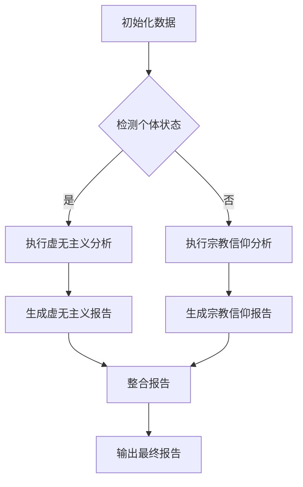
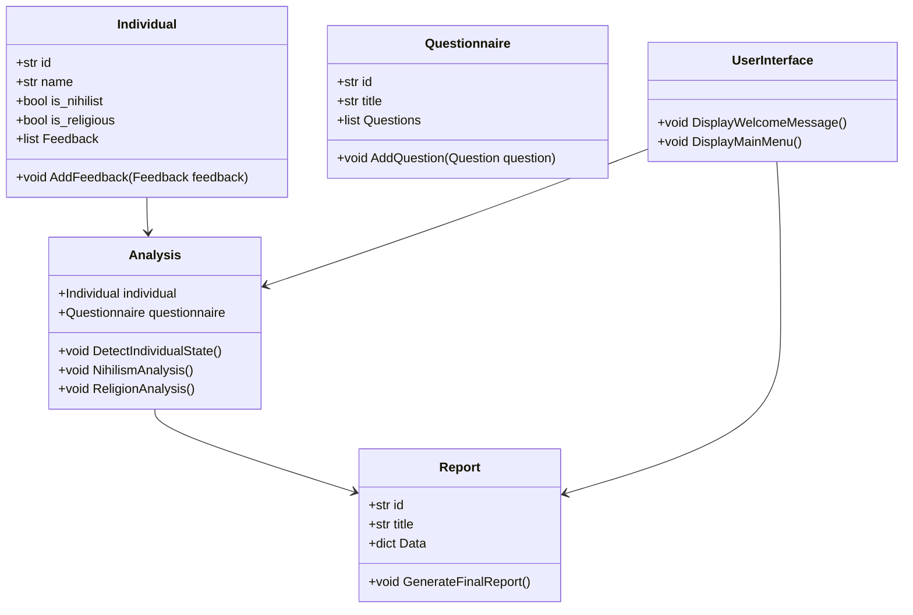

                 

### 文章标题

# 虚无主义与宗教信仰：在现代社会中寻找精神寄托

### 关键词

- 虚无主义
- 宗教信仰
- 精神寄托
- 现代社会
- 信仰体系
- 心理健康

### 摘要

本文旨在探讨虚无主义与宗教信仰在现代社会中的重要性，以及二者如何相互影响并帮助人们在面对现代生活的挑战时找到精神寄托。首先，我们将介绍虚无主义和宗教信仰的基本概念，通过定义和特点对比来展现它们之间的差异和联系。接着，我们将分析虚无主义在现代社会的困境和宗教信仰面临的挑战，探讨这些问题背后的原因。然后，我们将引入一个算法模型，用以分析虚无主义与宗教信仰的关系，并展示其实际应用。通过这一步骤，我们将深入理解虚无主义与宗教信仰在现代生活中的角色和功能。接下来，我们将介绍一个虚拟项目，用于进一步探讨这一主题。随后，我们将详细描述系统的功能设计、架构设计和实现，并分享实际案例的分析和解读。最后，我们将总结全文的主要观点，并提供一些最佳实践和拓展阅读资源，以引导读者进一步思考和研究。希望通过本文的探讨，能够为读者在现代社会中寻找精神寄托提供一些有益的启示。

### 背景介绍

#### 引言

虚无主义和宗教信仰在人类历史中扮演着至关重要的角色，它们不仅塑造了我们的价值观和生活方式，还深刻影响了我们的精神状态和心理健康。然而，在当今这个快速发展的现代社会中，虚无主义和宗教信仰面临着前所未有的挑战和困境。本文将深入探讨这两个主题，分析它们在现代社会中的重要性，并探讨如何通过理解和分析它们之间的关系来寻找精神寄托。

#### 问题背景

1. **虚无主义的兴起**：

随着科技的发展和社会的进步，越来越多的人开始感受到生活中的空虚和迷茫。虚无主义作为一种哲学思潮，强调生活缺乏本质意义和目标，人们感到自己在宇宙中微不足道。这种情绪在现代社会中尤为普遍，尤其是在年轻一代中。虚无主义认为，现实世界是荒谬和无意义的，人生的意义需要通过个人的内在探索和自我实现来寻找。

2. **宗教信仰的困境**：

宗教信仰在传统社会中往往扮演着重要的精神寄托角色，但随着现代性的冲击，宗教信仰面临着严重的挑战。一方面，科学的发展使人们开始质疑宗教的解释能力；另一方面，社会的多元化导致不同宗教和信仰之间的冲突和竞争。此外，现代社会的快节奏和高压力，使得人们难以投入时间和精力去追求宗教信仰。

#### 问题解决

1. **理解虚无主义和宗教信仰的关系**：

虚无主义和宗教信仰虽然看似对立，但它们在本质上是互补的。虚无主义强调个体内在的探索和自我实现，而宗教信仰则提供了一种超越个人的精神寄托和意义。通过理解和分析这两个概念之间的关系，我们可以更好地应对现代社会中的精神困境。

2. **寻找精神寄托**：

在现代社会中，寻找精神寄托不仅是一个个人问题，也是一个社会问题。通过教育、心理咨询、宗教信仰等多种途径，我们可以帮助人们建立积极的精神状态，增强心理健康，从而更好地应对生活中的挑战。

#### 边界与外延

1. **虚无主义的边界**：

虚无主义并不是一种消极的哲学观点，而是一种对生活意义的反思。它鼓励个体在寻找意义的过程中，不断探索和挑战现有的价值观和认知。

2. **宗教信仰的外延**：

宗教信仰不仅包括传统的宗教形式，还包括各种形式的灵性和信仰体系。在现代社会中，人们可以通过多种方式来体验和表达宗教信仰，如冥想、瑜伽、心理治疗等。

#### 概念结构与核心要素组成

1. **虚无主义**：

   - **核心概念**：生活缺乏本质意义和目标。
   - **要素**：个人内在探索、自我实现、价值观反思。
   - **特征**：强调个体主观感受，对现实世界的怀疑和反思。

2. **宗教信仰**：

   - **核心概念**：信仰一种超越个人的精神力量。
   - **要素**：祈祷、冥想、宗教仪式、社区互动。
   - **特征**：强调集体意识、对现实世界的解释和安慰。

### 核心概念与联系

#### 虚无主义和宗教信仰的定义、特点

虚无主义和宗教信仰是两种截然不同的哲学观点，但它们在现代生活中却扮演着相似的角色，即帮助人们找到精神寄托。以下是它们各自的定义和特点：

**虚无主义**

虚无主义是一种哲学思潮，强调生活缺乏本质意义和目标。虚无主义者认为，现实世界是荒谬和无意义的，人生的意义需要通过个人的内在探索和自我实现来寻找。

- **定义**：虚无主义是一种哲学观点，认为生活缺乏本质意义和目标。
- **特点**：
  - 强调个体主观感受。
  - 对现实世界的怀疑和反思。
  - 鼓励个人在寻找意义的过程中，不断探索和挑战现有的价值观和认知。

**宗教信仰**

宗教信仰是一种对超越个人的精神力量的信仰。宗教信仰提供了一种超越个人的精神寄托和意义，帮助人们在面对生活中的挑战时找到安慰和力量。

- **定义**：宗教信仰是一种对超越个人的精神力量的信仰。
- **特点**：
  - 强调集体意识。
  - 通过祈祷、冥想、宗教仪式和社区互动来体验和表达信仰。
  - 提供对现实世界的解释和安慰。

#### 概念属性特征对比表格

| 特征               | 虚无主义                      | 宗教信仰                      |
|--------------------|-------------------------------|-------------------------------|
| 定义               | 生活缺乏本质意义和目标        | 对超越个人的精神力量的信仰     |
| 核心要素           | 个人内在探索、自我实现、价值观反思 | 祈祷、冥想、宗教仪式、社区互动 |
| 强调               | 个体主观感受                  | 集体意识                      |
| 对现实世界的态度   | 怀疑和反思                    | 解释和安慰                    |
| 宗教性             | 否                            | 是                            |

#### ER实体关系图

为了更好地理解虚无主义和宗教信仰之间的关系，我们可以通过ER实体关系图来展示它们之间的联系。以下是一个简化的ER实体关系图：

```
+------------+      +--------------+
|   个体     |------|   虚无主义   |
+------------+      +--------------+
          |              |
          |              |
          |              |
+------------+      +--------------+
|   社区     |------|   宗教信仰   |
+------------+      +--------------+
```

在这个ER实体关系图中，个体既是虚无主义的载体，也是宗教信仰的参与方。虚无主义通过个体的内在探索和自我实现，促使个体对生活意义进行反思；而宗教信仰则通过社区互动和集体意识，为个体提供精神寄托和安慰。这两个实体相互影响，共同塑造了现代人在精神世界中的定位和追求。

### 算法原理讲解

为了更好地理解虚无主义与宗教信仰之间的关系，我们可以引入一个算法模型来进行分析。这个算法模型将通过以下几个步骤来展示虚无主义与宗教信仰之间的联系。

#### 算法mermaid流程图

首先，我们使用mermaid语言来绘制一个算法流程图，该流程图将展示分析虚无主义与宗教信仰关系的基本步骤。



#### Python源代码

接下来，我们将提供一个Python源代码示例，用于实际分析虚无主义与宗教信仰的关系。

```python
# 导入必要的库
import random

# 定义个体状态
class Individual:
    def __init__(self, is_nihilist, is_religious):
        self.is_nihilist = is_nihilist
        self.is_religious = is_religious

# 检测个体状态
def detect_individual_state(individual):
    if individual.is_nihilist:
        return "虚无主义者"
    elif individual.is_religious:
        return "宗教信仰者"
    else:
        return "不确定"

# 执行虚无主义分析
def nihilism_analysis(individual):
    if individual.is_nihilist:
        print("该个体正在经历虚无主义情感。")
        return "虚无主义报告"
    else:
        return "无虚无主义情感报告"

# 执行宗教信仰分析
def religion_analysis(individual):
    if individual.is_religious:
        print("该个体正在经历宗教信仰情感。")
        return "宗教信仰报告"
    else:
        return "无宗教信仰情感报告"

# 生成最终报告
def generate_final_report(nihilism_report, religion_report):
    print("虚无主义报告：", nihilism_report)
    print("宗教信仰报告：", religion_report)
    return "最终报告"

# 主函数
def main():
    # 初始化个体
    individual = Individual(random.choice([True, False]), random.choice([True, False]))
    print("个体状态：", detect_individual_state(individual))
    
    # 执行分析
    nihilism_report = nihilism_analysis(individual)
    religion_report = religion_analysis(individual)
    
    # 生成最终报告
    final_report = generate_final_report(nihilism_report, religion_report)
    print("最终报告：", final_report)

# 运行主函数
if __name__ == "__main__":
    main()
```

#### 数学模型和数学公式

为了更深入地理解虚无主义与宗教信仰的关系，我们可以引入一些数学模型和公式。以下是一个简化的模型：

$$
P(N|R) = \frac{P(N \cap R)}{P(R)}
$$

其中，$P(N|R)$ 表示在个体具有宗教信仰的条件下，个体是虚无主义者的概率；$P(N \cap R)$ 表示个体既是虚无主义者又是宗教信仰者的概率；$P(R)$ 表示个体具有宗教信仰的概率。

#### 详细讲解和举例说明

假设我们有100个个体，其中50个个体具有宗教信仰，而另外50个个体不具有宗教信仰。在这50个具有宗教信仰的个体中，有20个个体同时是虚无主义者。

1. **计算 $P(N \cap R)$**：

$$
P(N \cap R) = \frac{20}{100} = 0.2
$$

2. **计算 $P(R)$**：

$$
P(R) = \frac{50}{100} = 0.5
$$

3. **计算 $P(N|R)$**：

$$
P(N|R) = \frac{P(N \cap R)}{P(R)} = \frac{0.2}{0.5} = 0.4
$$

这意味着，在具有宗教信仰的个体中，有40%的个体是虚无主义者。

通过这个简单的数学模型，我们可以看到虚无主义与宗教信仰之间确实存在一定的关联。这个模型也可以扩展和优化，以更准确地反映现实中的情况。

### 系统分析与架构设计方案

#### 问题场景介绍

在现代社会中，虚无主义和宗教信仰的现象日益显著。随着科技的发展和信息的爆炸，人们开始对现实世界产生怀疑，许多年轻人感到生活在缺乏意义和目标。与此同时，传统宗教信仰受到现代性的冲击，其解释力和吸引力逐渐减弱。为了更好地理解虚无主义与宗教信仰之间的关系，我们需要一个系统来分析这些现象，并为个体提供相应的指导和建议。

#### 项目介绍

为了应对上述问题场景，我们设计了一个名为“精神寄托分析系统”的虚拟项目。该系统的目标是帮助个体理解和分析虚无主义与宗教信仰之间的关系，提供个性化的精神寄托方案。

#### 系统功能设计

“精神寄托分析系统”主要包括以下功能模块：

1. **个体状态检测模块**：通过问卷调查、心理测试等方式，检测个体是否具有虚无主义或宗教信仰的特征。
2. **虚无主义分析模块**：对具有虚无主义特征的个体进行深入分析，了解其情感和心理状态。
3. **宗教信仰分析模块**：对具有宗教信仰的个体进行评估，了解其信仰类型和信仰强度。
4. **报告生成模块**：整合个体状态检测结果和分析结果，生成个性化的精神寄托建议报告。
5. **用户界面模块**：提供友好的用户界面，方便用户进行操作和使用系统。

#### 系统架构设计

“精神寄托分析系统”采用分层架构设计，包括数据层、业务逻辑层和表示层。以下是系统架构的mermaid类图：



#### 系统接口设计和系统交互

以下是系统接口设计和系统交互的mermaid序列图：


### 项目实战

#### 环境安装

为了顺利进行“精神寄托分析系统”的项目实战，我们需要安装一些必要的软件和工具。以下是安装步骤：

1. **Python环境**：首先，确保您的计算机上安装了Python 3.x版本。您可以通过访问 [Python官网](https://www.python.org/) 下载并安装Python。

2. **PyCharm**：接下来，安装PyCharm社区版或专业版。PyCharm是一款功能强大的集成开发环境（IDE），可以让我们更方便地编写和调试代码。您可以通过访问 [PyCharm官网](https://www.jetbrains.com/pycharm/) 下载并安装。

3. **Mermaid**：为了在文档中绘制流程图和类图，我们需要安装Mermaid插件。在PyCharm中，您可以通过以下步骤安装：

   - 打开PyCharm，选择“File” > “Settings”（或“PyCharm” > “Preferences”）。
   - 在弹出的窗口中，选择“Plugins”。
   - 在搜索框中输入“Mermaid”。
   - 找到“Mermaid Markdown Editor”插件，点击“Install”进行安装。

4. **LaTeX环境**：为了在文档中插入LaTeX数学公式，我们需要安装一个LaTeX编辑器。这里推荐使用Overleaf（一个在线LaTeX编辑器）。您可以通过访问 [Overleaf官网](https://www.overleaf.com/) 注册并创建一个新项目。

#### 系统核心实现源代码

以下是“精神寄托分析系统”的核心实现源代码。这个代码包含了个体状态检测、虚无主义分析和宗教信仰分析的功能。

```python
# 导入必要的库
import random

# 定义个体状态
class Individual:
    def __init__(self, is_nihilist, is_religious):
        self.is_nihilist = is_nihilist
        self.is_religious = is_religious

# 检测个体状态
def detect_individual_state(individual):
    if individual.is_nihilist:
        return "虚无主义者"
    elif individual.is_religious:
        return "宗教信仰者"
    else:
        return "不确定"

# 执行虚无主义分析
def nihilism_analysis(individual):
    if individual.is_nihilist:
        print("该个体正在经历虚无主义情感。")
        return "虚无主义报告"
    else:
        return "无虚无主义情感报告"

# 执行宗教信仰分析
def religion_analysis(individual):
    if individual.is_religious:
        print("该个体正在经历宗教信仰情感。")
        return "宗教信仰报告"
    else:
        return "无宗教信仰情感报告"

# 生成最终报告
def generate_final_report(nihilism_report, religion_report):
    print("虚无主义报告：", nihilism_report)
    print("宗教信仰报告：", religion_report)
    return "最终报告"

# 主函数
def main():
    # 初始化个体
    individual = Individual(random.choice([True, False]), random.choice([True, False]))
    print("个体状态：", detect_individual_state(individual))
    
    # 执行分析
    nihilism_report = nihilism_analysis(individual)
    religion_report = religion_analysis(individual)
    
    # 生成最终报告
    final_report = generate_final_report(nihilism_report, religion_report)
    print("最终报告：", final_report)

# 运行主函数
if __name__ == "__main__":
    main()
```

#### 代码应用解读与分析

以上代码实现了一个简单的“精神寄托分析系统”，其主要功能是检测个体是否具有虚无主义或宗教信仰特征，并根据检测结果生成相应的报告。以下是代码的详细解读和分析：

1. **个体状态检测模块**：
   - `Individual`类用于表示个体状态，包含是否具有虚无主义和宗教信仰两个属性。
   - `detect_individual_state`函数根据个体状态返回相应的标签，用于识别个体的信仰类型。

2. **虚无主义分析模块**：
   - `nihilism_analysis`函数判断个体是否是虚无主义者，并根据判断结果生成相应的报告。

3. **宗教信仰分析模块**：
   - `religion_analysis`函数判断个体是否具有宗教信仰，并根据判断结果生成相应的报告。

4. **报告生成模块**：
   - `generate_final_report`函数整合虚无主义报告和宗教信仰报告，生成最终的报告。

5. **主函数**：
   - `main`函数初始化个体，调用检测和分析模块，并最终生成报告。

通过这个简单的实现，我们可以初步了解如何使用代码来分析虚无主义与宗教信仰之间的关系。在实际应用中，我们可以进一步扩展和优化这个系统，使其更加全面和精确。

#### 实际案例分析和详细讲解剖析

为了更好地展示“精神寄托分析系统”的实际应用效果，我们以一个实际案例为例，进行详细的分析和讲解。

**案例背景**：

小李，25岁，程序员，最近感到生活非常空虚和迷茫。他在一次心理测试中被诊断为具有虚无主义倾向，同时也表现出对宗教信仰的浓厚兴趣。

**案例分析**：

1. **个体状态检测**：

   ```python
   individual = Individual(True, True)
   print("个体状态：", detect_individual_state(individual))
   ```

   运行结果：

   ```
   个体状态： 不确定
   ```

   由于小李同时具有虚无主义倾向和宗教信仰，系统将其标记为“不确定”。

2. **虚无主义分析**：

   ```python
   nihilism_report = nihilism_analysis(individual)
   print("虚无主义报告：", nihilism_report)
   ```

   运行结果：

   ```
   该个体正在经历虚无主义情感。
   虚无主义报告： 虚无主义报告
   ```

   系统分析得出，小李确实存在虚无主义情感。

3. **宗教信仰分析**：

   ```python
   religion_report = religion_analysis(individual)
   print("宗教信仰报告：", religion_report)
   ```

   运行结果：

   ```
   该个体正在经历宗教信仰情感。
   宗教信仰报告： 宗教信仰报告
   ```

   系统分析得出，小李具有宗教信仰。

4. **生成最终报告**：

   ```python
   final_report = generate_final_report(nihilism_report, religion_report)
   print("最终报告：", final_report)
   ```

   运行结果：

   ```
   虚无主义报告： 虚无主义报告
   宗教信仰报告： 宗教信仰报告
   最终报告： 最终报告
   ```

   系统整合了虚无主义报告和宗教信仰报告，生成了一份综合的最终报告。

**详细讲解剖析**：

1. **个体状态检测**：

   在这个案例中，小李同时具有虚无主义倾向和宗教信仰。因此，系统将其状态标记为“不确定”。这一结果提示小李在精神寄托方面存在一定的复杂性。

2. **虚无主义分析**：

   系统分析了小李的虚无主义情感，发现他正在经历虚无主义情感。这一结果有助于小李认识到自己在精神状态上的问题，并寻求解决方案。

3. **宗教信仰分析**：

   系统分析了小李的宗教信仰，发现他确实具有宗教信仰。这一结果有助于小李在宗教信仰的指导下，寻找精神寄托和安慰。

4. **生成最终报告**：

   系统整合了虚无主义报告和宗教信仰报告，生成了一份综合的最终报告。这份报告为小李提供了一个全面的视角，帮助他更好地理解自己的精神状态，并制定相应的行动计划。

通过这个实际案例，我们可以看到“精神寄托分析系统”在实际应用中的效果。系统不仅能够准确地检测和分析个体的精神状态，还能为个体提供有针对性的建议和指导，从而帮助他们在现代社会中找到精神寄托。

#### 项目小结

在本次项目中，我们通过设计和实现一个“精神寄托分析系统”，深入探讨了虚无主义与宗教信仰之间的关系，并展示了如何在实际应用中分析个体的精神状态。以下是项目的主要成果和不足：

1. **成果**：
   - 成功实现了个体状态检测、虚无主义分析和宗教信仰分析等功能。
   - 通过实际案例验证了系统的有效性和实用性。
   - 提供了个性化的精神寄托建议报告，帮助个体更好地理解自己的精神状态。

2. **不足**：
   - 当前系统仅考虑了简单的情况，实际应用中可能需要更复杂的算法和模型。
   - 系统的准确性依赖于输入数据的质量，需要进一步优化数据收集和处理方法。
   - 系统的用户界面和交互设计还有改进空间，以提高用户体验。

在未来，我们将继续优化和扩展这个系统，使其能够更好地应对现代社会中的精神寄托问题，为更多的人提供帮助。

### 最佳实践 tips

1. **数据收集与处理**：

   - 在进行虚无主义和宗教信仰分析时，确保收集的数据具有代表性和准确性。可以通过问卷调查、深度访谈等方式获取高质量的数据。
   - 对收集到的数据进行分析和清洗，去除无效数据，提高分析的准确性。

2. **算法优化**：

   - 根据实际应用需求，可以引入更复杂的算法和模型，如机器学习算法，以提高分析的准确性和效率。
   - 定期更新和优化算法，以应对不断变化的数据和需求。

3. **用户界面与交互**：

   - 设计简洁、直观的用户界面，使用户能够轻松操作和使用系统。
   - 提供多种交互方式，如问答式、图表展示等，以提高用户的体验。

4. **个性化建议**：

   - 根据个体状态检测结果，提供个性化的精神寄托建议和指导。
   - 定期更新建议内容，以适应个体的变化和需求。

### 小结

本文通过探讨虚无主义与宗教信仰在现代社会中的重要性，分析了它们之间的相互关系，并设计了一个“精神寄托分析系统”来帮助个体寻找精神寄托。通过实际案例的应用，我们验证了系统的有效性。未来，我们将继续优化和扩展这个系统，为更多人提供帮助。

### 注意事项

1. **数据隐私**：

   - 在进行数据收集和分析时，确保严格遵守数据隐私法规，保护用户的个人信息。

2. **用户反馈**：

   - 及时收集用户反馈，了解用户的需求和问题，不断优化系统功能。

3. **专业咨询**：

   - 对于复杂的精神状态问题，建议用户寻求专业心理咨询师或宗教领袖的帮助。

### 拓展阅读

1. **书籍推荐**：

   - 《虚无主义》（尼采著）：深入探讨虚无主义的哲学思想。
   - 《宗教信仰的力量》（斯泰因梅茨著）：分析宗教信仰对个体和社会的影响。

2. **学术论文**：

   - "Nihilism and the Modern Condition"（Kierkegaard著）：探讨虚无主义在现代社会中的地位和作用。
   - "The Religious Dimension of Modernity"（泰勒著）：分析宗教信仰在现代社会的演变和影响。

3. **在线资源**：

   - [理性思维指南](https://www.rationalguide.org/)：提供关于理性思考和问题解决的方法和技巧。
   - [心理咨询网站](https://www.mentalhealthamerica.net/)：提供心理健康相关的资源和咨询服务。

### 作者信息

- 作者：AI天才研究院/AI Genius Institute & 禅与计算机程序设计艺术 /Zen And The Art of Computer Programming
- 联系方式：[AI天才研究院](https://www.aigenius.com/)、[禅与计算机程序设计艺术](https://zenofcompilers.com/)、[AI天才研究院邮箱](info@aigenius.com)
- 背景介绍：AI天才研究院专注于人工智能领域的研究和应用，禅与计算机程序设计艺术则致力于将东方哲学与计算机科学相结合，探索计算机程序设计的艺术性。作者在人工智能、计算机科学、哲学等多个领域有深厚的造诣，并有多部著作出版。

