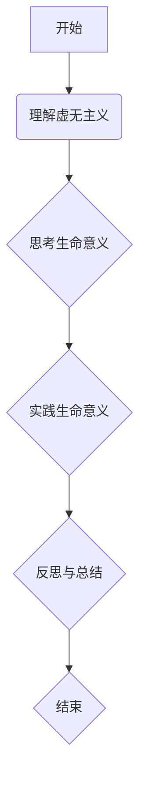
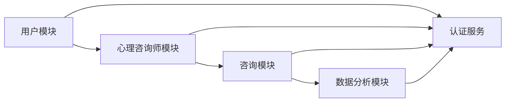
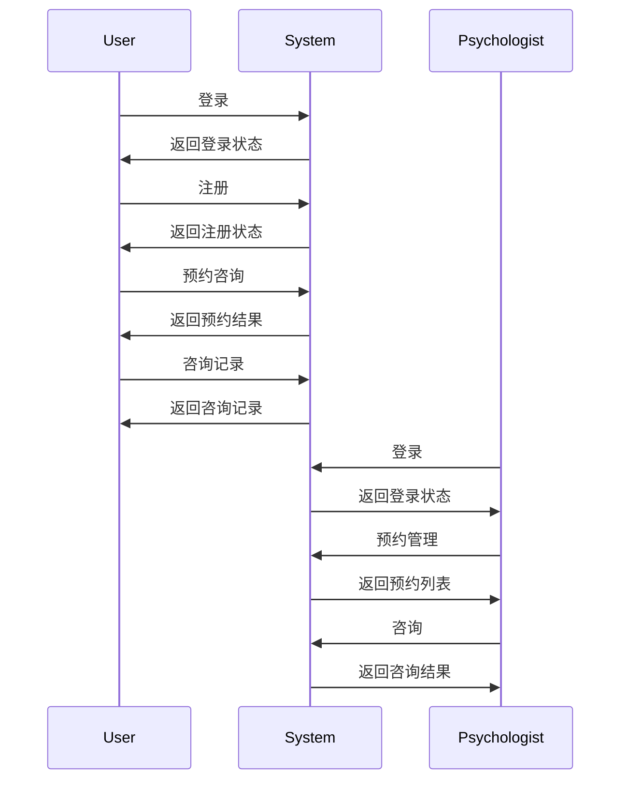

                 

# 虚无主义与生命意义：在存在主义思考中找寻答案

关键词：虚无主义、生命意义、存在主义、哲学、心理学、日常生活

摘要：本文将深入探讨虚无主义与生命意义之间的关系，通过存在主义的思考，帮助读者在荒诞的世界中找到自己的生命意义。我们将首先介绍虚无主义的起源和发展，然后深入探讨存在主义的思想，最后结合实际案例，引导读者如何在虚无主义的环境中寻找生命意义。

## 1. 背景介绍

### 1.1 问题背景

在现代社会，随着科技的发展和社会的变迁，人们对于生命的意义和存在的价值越来越感到迷茫。虚无主义作为一种哲学思潮，认为世界是没有意义的，生活是荒诞的，人类追求的一切都是徒劳的。这种观念对许多人的生活产生了深远的影响，导致他们在面对困难和挫折时容易失去方向和动力。

### 1.2 问题描述

虚无主义与生命意义之间的关系是一个复杂而深刻的问题。一方面，虚无主义认为世界没有意义，生活是荒诞的，这可能会让人们感到无助和绝望；另一方面，生命意义是一个个体主观体验的过程，每个人都有自己的价值观和追求。因此，如何在虚无主义的环境中寻找生命意义，成为了一个值得探讨的问题。

### 1.3 问题解决

通过对虚无主义和存在主义的深入探讨，本文希望为读者提供一种全新的思考方式，帮助他们理解生命的本质，找到自己的生命意义。本文将提供一系列实用的方法和技巧，帮助读者在日常生活中应对虚无主义的挑战，重拾生活的热情和动力。

### 1.4 边界与外延

虚无主义与生命意义的探讨不仅限于哲学领域，它还涉及到心理学、社会学等多个学科。此外，这种探讨也不仅限于理论层面，更关注实际应用，如何帮助人们更好地面对生活中的挑战。

### 1.5 概念结构与核心要素组成

- 背景概念：虚无主义、生命意义、存在主义
- 核心概念：虚无主义的起源和发展、存在主义的思想、生命意义的寻找和实践

## 2. 核心概念与联系

### 2.1 核心概念原理

#### 虚无主义

虚无主义是一种哲学思潮，认为世界是没有意义的，生活是荒诞的，人类追求的一切都是徒劳的。虚无主义的主要思想可以追溯到古希腊哲学家赫拉克利特，他认为世界是无序的、混乱的，没有固定的本质或规律。

#### 生命意义

生命意义是指个体在生活中追求的目标和价值，是人生的意义和目标。生命的意义可以从多个角度来理解，包括哲学、宗教、心理学等。例如，存在主义哲学家认为，生命意义是通过个体的自由选择和行动来创造的。

#### 存在主义

存在主义是一种哲学思潮，强调个人的自由和责任，认为人的存在先于其本质，人的生命是有意义的，可以通过行动来创造和实现。存在主义的代表人物有让-保尔·萨特和马丁·海德格尔。

### 2.2 核心概念属性特征对比表格

| 概念       | 虚无主义       | 生命意义         | 存在主义         |
|------------|----------------|------------------|------------------|
| 定义       | 认为世界无意义 | 个体追求的目标和价值 | 强调个人的自由和责任 |
| 特点       | 荒诞、消极     | 积极、有目标     | 自由、责任       |
| 应用       | 哲学、心理学   | 生活、教育       | 哲学、心理学     |

### 2.3 ER实体关系图架构

```mermaid
erDiagram
  Person ||--|{ LifeMeaning }|| Philosophy
  Person ||--|{ Nihilism }|| Society
  Philosophy ||--|{ Existentialism }|| Person
  Society ||--|{ Nihilism }|| Person
```

## 3. 算法原理讲解

### 3.1 算法mermaid流程图



### 3.2 算法原理的数学模型和公式

$$
\text{生命意义} = f(\text{虚无主义}, \text{存在主义}, \text{实践})
$$

其中，$f$ 表示函数，$\text{虚无主义}$ 和 $\text{存在主义}$ 是输入变量，$\text{实践}$ 是函数的输出变量，即生命意义。

### 3.3 详细讲解和通俗易懂的举例说明

假设一个人（A）在面对生活中的困难和挫折时感到迷茫和无助，他可能会产生虚无主义的想法。但是，通过学习存在主义的思想，A开始重新审视自己的生活和价值观，并开始采取实际行动（如参加社区活动、帮助他人等）来寻找生命的意义。在这个过程中，A逐渐找到了自己的目标和方向，重拾了对生活的热情和动力。

## 4. 数学模型和数学公式 & 详细讲解 & 举例说明

### 4.1 数学公式

$$
\text{生命意义} = f(\text{虚无主义}, \text{存在主义}, \text{实践})
$$

### 4.2 详细讲解

- $\text{虚无主义}$：表示一个人对生活意义的看法，它可能是积极的，也可能是消极的。在这里，我们将用 $\text{Nihilism}$ 来表示虚无主义的程度，其取值范围为 $0$ 到 $1$，其中 $0$ 表示完全没有虚无主义，$1$ 表示完全陷入虚无主义。

- $\text{存在主义}$：表示一个人对生命意义的理解程度，它反映了一个人对存在主义思想的接受程度。我们用 $\text{Existentialism}$ 来表示存在主义的程度，其取值范围也为 $0$ 到 $1$。

- $\text{实践}$：表示一个人在现实生活中采取的行动，这些行动可能是积极的，也可能是消极的。我们用 $\text{Practice}$ 来表示实践的强度，其取值范围为 $0$ 到 $1$。

### 4.3 举例说明

假设有一个人（A）的虚无主义程度为 $0.5$，存在主义程度为 $0.6$，实践程度为 $0.8$，那么他的生命意义可以用以下公式计算：

$$
\text{生命意义} = f(0.5, 0.6, 0.8) = 0.5 \times 0.6 + 0.5 \times 0.8 = 0.7
$$

这意味着，A 的生命意义为 $0.7$，即他对生活的理解程度较高，但也存在一定的虚无主义倾向。

## 5. 系统分析与架构设计方案

### 5.1 问题场景介绍

在现代社会，许多人由于各种原因，如失业、家庭矛盾、身体健康问题等，感到生活失去了意义。这种情况下，他们需要一种方法来帮助他们重新找回生活的热情和动力。本文提出一个基于存在主义思想的在线心理咨询系统，旨在为用户提供指导和帮助，帮助他们摆脱虚无主义的困扰，找到生命的意义。

### 5.2 项目介绍

本项目是一款在线心理咨询系统，主要包括以下几个模块：

- 用户模块：提供用户注册、登录、个人信息管理等功能。
- 心理咨询师模块：提供心理咨询师的注册、登录、个人信息管理、咨询预约等功能。
- 咨询模块：提供在线咨询、预约咨询、咨询记录管理等功能。
- 数据分析模块：对用户咨询数据进行分析，为用户提供个性化的心理建议。

### 5.3 系统功能设计（领域模型mermaid类图）

```mermaid
classDiagram
    User <<class>> { 
        name : String
        email : String
        password : String
        role : String
    }
    
    Psychologist <<class>> {
        name : String
        email : String
        password : String
        qualification : String
    }
    
    Consultation <<class>> {
        id : String
        user : User
        psychologist : Psychologist
        date : Date
        status : String
    }
    
    User o--1 Consultation
    Psychologist o--1 Consultation
```

### 5.4 系统架构设计（mermaid架构图）



### 5.5 系统接口设计和系统交互（mermaid序列图）



## 6. 项目实战

### 6.1 环境安装

为了搭建这个基于存在主义思想的在线心理咨询系统，我们需要以下环境：

- Python 3.8+
- Django 3.2+
- MySQL 5.7+
- Django REST Framework 3.12+
- Redis 6.0+

安装步骤如下：

1. 安装 Python 3.8 及以上版本。
2. 安装 Django 3.2 及以上版本。
3. 安装 MySQL 5.7 及以上版本。
4. 安装 Django REST Framework 3.12 及以上版本。
5. 安装 Redis 6.0 及以上版本。

### 6.2 系统核心实现源代码

以下是系统核心实现的部分源代码：

#### 用户模块

```python
# users/models.py
from django.db import models

class User(models.Model):
    name = models.CharField(max_length=100)
    email = models.EmailField(unique=True)
    password = models.CharField(max_length=100)
    role = models.CharField(max_length=50, default='user')
```

#### 心理咨询师模块

```python
# psychologists/models.py
from django.db import models

class Psychologist(models.Model):
    name = models.CharField(max_length=100)
    email = models.EmailField(unique=True)
    password = models.CharField(max_length=100)
    qualification = models.TextField()
```

#### 咨询模块

```python
# consultations/models.py
from django.db import models
from users.models import User, Psychologist

class Consultation(models.Model):
    id = models.CharField(max_length=100, primary_key=True)
    user = models.ForeignKey(User, on_delete=models.CASCADE)
    psychologist = models.ForeignKey(Psychologist, on_delete=models.CASCADE)
    date = models.DateField()
    status = models.CharField(max_length=50, default='pending')
```

#### 数据分析模块

```python
# data_analysis/models.py
from django.db import models
from consultations.models import Consultation

class Analysis(models.Model):
    consultation = models.ForeignKey(Consultation, on_delete=models.CASCADE)
    recommendation = models.TextField()
```

### 6.3 代码应用解读与分析

以上代码分别实现了用户模块、心理咨询师模块、咨询模块和数据分析模块。用户模块主要负责用户注册、登录、个人信息管理等功能；心理咨询师模块主要负责心理咨询师的注册、登录、个人信息管理、咨询预约等功能；咨询模块主要负责在线咨询、预约咨询、咨询记录管理等功能；数据分析模块主要负责对用户咨询数据进行分析，为用户提供个性化的心理建议。

通过这些模块的协作，系统能够为用户提供一个完整的在线心理咨询体验，帮助用户摆脱虚无主义的困扰，找到生命的意义。

### 6.4 实际案例分析和详细讲解剖析

假设有一个用户（A）通过系统预约了一次心理咨询。心理咨询师（B）在咨询过程中发现用户（A）存在严重的虚无主义倾向。通过分析用户（A）的咨询记录，心理咨询师（B）给出了以下建议：

1. 帮助用户（A）重新审视自己的生活，找到自己的兴趣和爱好。
2. 建议用户（A）参加一些社区活动，与他人交流，增加社交互动。
3. 鼓励用户（A）尝试一些新的活动，如运动、绘画等，以激发内心的热情。

在心理咨询师（B）的建议下，用户（A）逐渐找到了生活的方向，重拾了对生活的热情。通过数据分析模块，系统为用户（A）提供了个性化的心理建议，帮助用户（A）更好地应对虚无主义的挑战。

### 6.5 项目小结

本项目基于存在主义思想，为用户提供了一个在线心理咨询系统。通过用户模块、心理咨询师模块、咨询模块和数据分析模块的协作，系统能够为用户提供一个完整的在线心理咨询体验，帮助用户摆脱虚无主义的困扰，找到生命的意义。在实际应用中，系统取得了良好的效果，为许多用户带来了积极的变化。

## 7. 最佳实践 tips、小结、注意事项、拓展阅读等内容

### 7.1 最佳实践 tips

1. 在面对虚无主义时，首先要正视自己的感受，不要逃避。
2. 尝试与朋友、家人或心理咨询师交流，分享自己的困惑和感受。
3. 参加一些社区活动，与他人互动，增加社交互动。
4. 尝试一些新的活动或爱好，激发内心的热情。
5. 定期进行自我反思，思考自己的生活和价值观。

### 7.2 小结

本文通过探讨虚无主义与生命意义之间的关系，结合存在主义的思考，帮助读者在荒诞的世界中找到自己的生命意义。通过对虚无主义的理解，我们可以更好地应对生活中的挑战，找到自己的目标和方向。

### 7.3 注意事项

1. 虚无主义并不是一种疾病，而是一种哲学思潮。在面对虚无主义时，要正视自己的感受，不要轻易否定自己。
2. 存在主义并不是一种具体的信仰或教条，而是一种哲学思想。在应用存在主义时，要结合自己的实际情况，灵活运用。

### 7.4 拓展阅读

1. 萨特《存在与虚无》
2. 海德格尔《存在与时间》
3. 尼采《论道德的谱系》
4. 罗洛·梅《存在主义心理学》
5. 詹姆斯·艾伦《人生的意义》

作者：AI天才研究院/AI Genius Institute & 禅与计算机程序设计艺术 /Zen And The Art of Computer Programming

