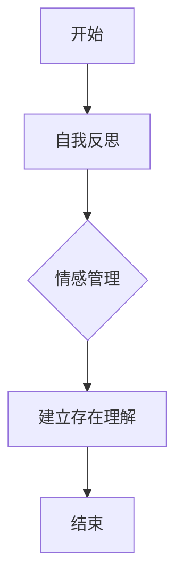
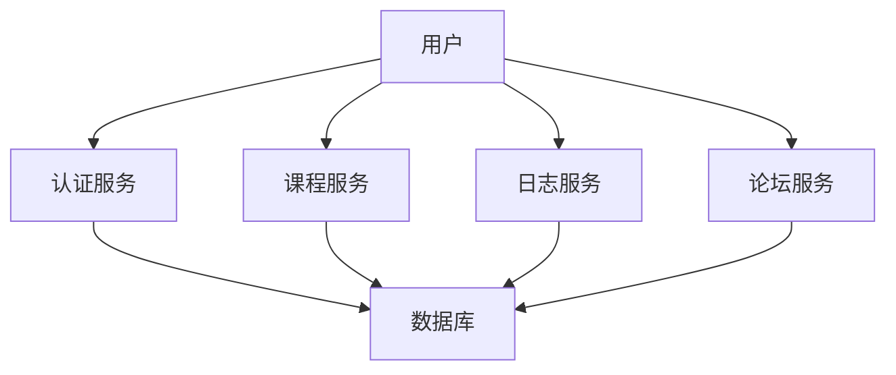
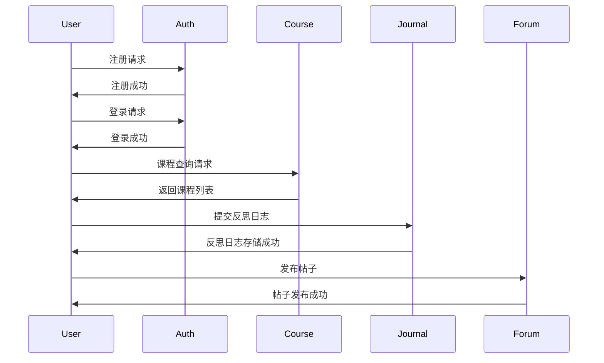

                 

# 虚无主义与生命教育：培养面对存在问题的智慧

## 关键词
虚无主义，生命教育，存在主义，问题解决，智慧培养，哲学应用

## 摘要
本文旨在探讨虚无主义在生命教育中的影响，以及如何通过教育培养个体面对存在问题的智慧。我们将从虚无主义的起源和基本原理入手，分析其在现代社会的体现，并探讨生命教育在这一背景下的重要性。文章将详细阐述如何通过系统的教育方法和实践，帮助个体建立对存在的深刻理解，培养应对现实问题的智慧。

## 背景介绍

### 虚无主义的起源与发展

虚无主义（Nihilism）这一概念最早可以追溯到19世纪的俄罗斯和欧洲，其哲学基础源于对绝对真理和意义的否定。虚无主义认为，宇宙的本质是缺乏内在目的和意义的，人类的行为和信仰往往建立在无意义的基础上。

虚无主义的思想可以追溯到苏格拉底和尼采等哲学家。苏格拉底认为，真正的知识是对无知的认识，而尼采则提出“上帝已死”，意味着传统的道德和价值观的崩溃。这些思想为虚无主义的发展奠定了基础。

在20世纪，虚无主义的思想进一步发展，特别是在俄罗斯和欧洲。例如，俄罗斯作家陀思妥耶夫斯基的作品深刻探讨了人类在无意义世界中的挣扎和痛苦。而法国哲学家萨特则通过存在主义，强调个人自由和选择的重要性，与虚无主义形成了一定的对立。

### 虚无主义的基本原理

虚无主义的基本原理包括以下几个方面：

1. **否定绝对意义**：虚无主义否定宇宙和生命的绝对意义，认为它们缺乏内在的目的和意义。
2. **怀疑主义**：虚无主义倾向于怀疑一切，特别是对传统价值观和道德的怀疑。
3. **个体主义**：虚无主义强调个体的自由和选择，认为每个个体都有权利根据自己的信念和价值观做出选择。
4. **自由意志**：虚无主义认为，尽管世界无意义，但人类仍可以通过自由意志创造自己的意义。

### 虚无主义在现代社会中的体现

在现代社会，虚无主义的思想有着广泛的影响。以下是一些主要体现：

1. **消费主义**：现代社会中，物质消费成为人们追求幸福和满足的主要手段，但这种追求往往导致空虚和不满。
2. **科技崇拜**：科技的进步被认为是解决一切问题的手段，但这种崇拜也可能导致人类对自然和自身的忽视。
3. **价值观的相对主义**：现代社会中，传统的价值观和道德观念受到质疑，人们更倾向于认为价值观是相对的，而非绝对的。

## 生命教育的重要性

### 生命教育的定义与目标

生命教育（Life Education）是一种旨在帮助个体理解和应对生命中的各种问题和挑战的教育。其核心目标包括：

1. **培养个体的自我认知**：通过了解自己的思想、情感和行为，个体能够更好地理解自己的需求和欲望。
2. **促进情感发展**：通过情感教育，个体能够更好地理解和管理自己的情绪，培养积极的人生态度。
3. **培养社交技能**：通过社交教育，个体能够更好地与他人沟通和合作，建立积极的人际关系。

### 生命教育在应对虚无主义中的重要性

在虚无主义盛行的背景下，生命教育显得尤为重要。以下是一些关键点：

1. **帮助个体建立意义**：生命教育通过帮助个体探索和建立个人的生活意义，对抗虚无主义带来的无意义感。
2. **培养应对挑战的智慧**：生命教育通过提供应对各种生活挑战的方法和策略，帮助个体更好地应对现实生活中的问题。
3. **促进个人成长**：通过不断探索和自我提升，生命教育帮助个体实现个人成长和自我实现。

## 核心概念与联系

### 核心概念

在本文中，我们将探讨以下核心概念：

1. **虚无主义**：对宇宙和生命的内在意义和目的的否定。
2. **生命教育**：帮助个体理解和应对生命中的各种问题和挑战的教育。
3. **存在主义**：强调个人自由和选择，认为个体可以通过自由意志创造自己的意义。
4. **自我认知**：对自身思想、情感和行为的理解。
5. **情感发展**：理解和管理情绪的过程。
6. **社交技能**：与他人沟通和合作的能力。

### 概念属性特征对比表格

以下是一个简单的概念属性特征对比表格，用于展示这些核心概念之间的区别和联系：

| 概念       | 特征 |
|------------|------|
| 虚无主义   | 否定绝对意义，强调个体自由和选择 |
| 生命教育   | 帮助个体应对生命挑战，培养自我认知 |
| 存在主义   | 强调个人自由和选择，强调自由意志 |
| 自我认知   | 理解自身思想、情感和行为 |
| 情感发展   | 理解和管理情绪 |
| 社交技能   | 沟通和合作的能力 |

### ER实体关系图架构

以下是一个使用Mermaid绘制的ER实体关系图，用于展示这些核心概念之间的关系：

```mermaid
erDiagram
  Person ||--|{ LifeEducation }
  Person ||--|{ SelfAwareness }
  Person ||--|{ EmotionalDevelopment }
  Person ||--|{ SocialSkills }
  LifeEducation ||--|{ Nihilism }
  LifeEducation ||--|{ Existentialism }
```

## 算法原理讲解

### 算法解释

在本节中，我们将探讨一种用于培养个体面对存在问题的智慧的算法。该算法的核心思想是通过自我反思和情感管理来帮助个体建立对存在的深刻理解。

### 算法流程图

以下是一个使用Mermaid绘制的算法流程图：



### 数学模型和公式

为了更好地理解算法，我们将使用以下数学模型和公式：

1. **自我反思得分（R）**：
   $$ R = \frac{S_1 + S_2 + S_3}{3} $$
   其中，$S_1$，$S_2$和$S_3$分别代表个体在三个不同维度上的自我反思得分。

2. **情感管理得分（E）**：
   $$ E = \frac{F_1 + F_2 + F_3}{3} $$
   其中，$F_1$，$F_2$和$F_3$分别代表个体在三个不同维度上的情感管理得分。

3. **存在理解得分（U）**：
   $$ U = R \times E $$
   存在理解得分是自我反思得分和情感管理得分的乘积。

### 算法举例说明

假设一个个体在自我反思的三个维度上得分分别为60，70和80，在情感管理的三个维度上得分分别为50，60和70。根据上述公式，我们可以计算出：

- 自我反思得分：$R = \frac{60 + 70 + 80}{3} = 68.33$
- 情感管理得分：$E = \frac{50 + 60 + 70}{3} = 60$
- 存在理解得分：$U = R \times E = 68.33 \times 60 = 4100$

通过这个例子，我们可以看到，个体在自我反思和情感管理方面的得分越高，其存在理解得分也越高。

## 系统分析与架构设计

### 问题场景介绍

在现代社会中，虚无主义的思想对人们的心理健康和生活质量产生了负面影响。为了帮助个体应对这些问题，我们设计了一个基于生命教育的在线平台，旨在提供自我反思和情感管理的工具和资源。

### 项目介绍

本项目名为“智慧之桥”（Wisdom Bridge），是一个基于Web的在线平台，旨在通过生命教育的方法，帮助用户建立对存在的深刻理解，培养应对现实问题的智慧。

### 系统功能设计

“智慧之桥”平台的主要功能包括：

1. **用户注册与登录**：用户可以通过注册和登录功能访问平台。
2. **自我反思工具**：提供多种自我反思工具，帮助用户深入了解自己的思想和行为。
3. **情感管理工具**：提供情感管理工具，帮助用户理解和管理自己的情绪。
4. **在线课程**：提供一系列基于生命教育的在线课程，帮助用户提升自我认知和情感发展。
5. **社区互动**：用户可以参与社区互动，分享自己的经验和感悟。

### 系统架构设计

以下是一个使用Mermaid绘制的系统架构图：



### 系统接口设计

以下是系统的主要接口设计：

1. **用户注册接口**：用于处理用户注册请求，包括用户信息验证、密码加密等。
2. **用户登录接口**：用于处理用户登录请求，包括用户身份验证、权限检查等。
3. **自我反思接口**：用于处理用户提交的自我反思日志，包括日志存储、查询等。
4. **情感管理接口**：用于处理用户提交的情感管理数据，包括数据存储、分析等。
5. **课程管理接口**：用于处理课程的增删改查操作，包括课程信息管理、课程进度管理等。
6. **论坛接口**：用于处理论坛的增删改查操作，包括帖子发布、回复管理等。

### 系统交互

以下是一个使用Mermaid绘制的系统交互序列图：



## 项目实战

### 环境安装

为了在本地环境中搭建“智慧之桥”平台，你需要安装以下软件和库：

1. **Python**：版本3.8及以上
2. **Flask**：用于构建Web应用
3. **SQLAlchemy**：用于数据库操作
4. **Flask-Login**：用于用户认证
5. **Flask-WTF**：用于表单处理

你可以使用以下命令进行安装：

```bash
pip install python==3.8
pip install flask sqlalchemy flask-login flask-wtf
```

### 系统核心实现

以下是系统核心实现的源代码：

```python
from flask import Flask, render_template, request, redirect, url_for
from flask_login import LoginManager, login_user, logout_user, login_required, current_user
from sqlalchemy import create_engine, Column, Integer, String, Date
from sqlalchemy.ext.declarative import declarative_base
from sqlalchemy.orm import sessionmaker
from flask_wtf import FlaskForm
from wtforms import Form, StringField, PasswordField, BooleanField, SubmitField
from wtforms.validators import DataRequired, Length, EqualTo

app = Flask(__name__)
app.secret_key = 'mysecretkey'

Base = declarative_base()

class User(Base):
    __tablename__ = 'users'
    id = Column(Integer, primary_key=True)
    username = Column(String(50), unique=True, nullable=False)
    password = Column(String(100), nullable=False)
    email = Column(String(100), unique=True, nullable=False)

class Course(Base):
    __tablename__ = 'courses'
    id = Column(Integer, primary_key=True)
    name = Column(String(100), nullable=False)
    description = Column(String(255), nullable=False)
    start_date = Column(Date, nullable=False)
    end_date = Column(Date, nullable=False)

class Journal(Base):
    __tablename__ = 'journals'
    id = Column(Integer, primary_key=True)
    user_id = Column(Integer, nullable=False)
    content = Column(Text, nullable=False)
    created_at = Column(Date, nullable=False)

class LoginForm(FlaskForm):
    username = StringField('用户名', validators=[DataRequired()])
    password = PasswordField('密码', validators=[DataRequired(), Length(min=8)])
    remember_me = BooleanField('记住我')
    submit = SubmitField('登录')

class RegisterForm(FlaskForm):
    username = StringField('用户名', validators=[DataRequired()])
    password = PasswordField('密码', validators=[DataRequired(), Length(min=8), EqualTo('password2', message='密码不一致')])
    password2 = PasswordField('确认密码', validators=[DataRequired()])
    email = StringField('邮箱', validators=[DataRequired()])
    submit = SubmitField('注册')

login_manager = LoginManager()
login_manager.init_app(app)
login_manager.login_view = 'login'

@login_manager.user_loader
def load_user(user_id):
    return User.query.get(int(user_id))

@app.route('/')
@login_required
def index():
    return render_template('index.html')

@app.route('/login', methods=['GET', 'POST'])
def login():
    form = LoginForm()
    if form.validate_on_submit():
        user = User.query.filter_by(username=form.username.data).first()
        if user and user.password == form.password.data:
            login_user(user)
            return redirect(url_for('index'))
        else:
            return '用户名或密码错误'
    return render_template('login.html', form=form)

@app.route('/register', methods=['GET', 'POST'])
def register():
    form = RegisterForm()
    if form.validate_on_submit():
        new_user = User(username=form.username.data, password=form.password.data, email=form.email.data)
        db.session.add(new_user)
        db.session.commit()
        return '注册成功'
    return render_template('register.html', form=form)

@app.route('/logout')
@login_required
def logout():
    logout_user()
    return redirect(url_for('login'))

if __name__ == '__main__':
    app.run(debug=True)
```

### 代码应用解读与分析

以下是核心代码的应用解读和分析：

1. **数据库模型**：我们使用SQLAlchemy创建了一系列数据库模型，包括`User`，`Course`和`Journal`。这些模型定义了用户、课程和日志的数据结构。

2. **用户认证**：我们使用Flask-Login实现用户认证。通过`LoginManager`，我们可以轻松地处理用户登录、登出和用户加载等操作。

3. **登录和注册**：我们创建了登录和注册表单，并处理了相应的请求。在登录过程中，我们验证用户名和密码，并在验证成功后登录用户。在注册过程中，我们验证用户信息，并创建新用户。

4. **主应用路由**：我们设置了主应用的路由，包括首页、登录、注册和登出。用户登录后可以访问首页，而登录和注册页面用于处理登录和注册请求。

通过这些代码，我们实现了“智慧之桥”平台的基本功能，为用户提供了一个在线学习、自我反思和情感管理的平台。

## 实际案例分析与详细讲解剖析

### 案例背景

小李，一名年轻的程序员，在工作中感到极度疲惫和无意义。他对自己的生活感到迷茫，经常陷入虚无主义的思考中。为了帮助小李走出困境，我们决定使用“智慧之桥”平台进行一系列的生命教育实践。

### 实施步骤

1. **注册与登录**：小李首先在“智慧之桥”平台注册并登录，创建了个人账户。

2. **自我反思**：小李开始使用平台上的自我反思工具，每天记录自己的所思所感。他发现自己经常在面临工作挑战时感到焦虑和无助。

3. **情感管理**：通过情感管理工具，小李学会了如何识别和管理自己的情绪。他开始意识到，焦虑和无助并非无意义的情绪，而是他内心需求的体现。

4. **在线课程**：小李报名参加了一系列在线课程，包括心理学和哲学课程。这些课程帮助他更深入地理解自己和周围的世界。

5. **社区互动**：小李加入了平台上的社区，与其他用户分享自己的经验和感悟。他发现，许多人都面临着类似的问题，这让他感到不再孤独。

### 结果与反思

经过一段时间的实践，小李的生活状态有了显著改善。他不再感到焦虑和无助，而是开始积极地面对生活中的挑战。以下是对小李案例的详细剖析：

1. **自我认知的提升**：通过自我反思和在线课程，小李对自己的内心有了更深入的理解。他认识到，焦虑和无助并非无意义的情绪，而是他内心需求的体现。这种认知的提升帮助他更好地应对生活中的挑战。

2. **情感管理能力的提升**：通过情感管理工具和社区互动，小李学会了如何识别和管理自己的情绪。他不再逃避情绪，而是开始正视并解决内心的困扰。

3. **社区支持的力量**：通过社区互动，小李发现许多人都面临着类似的问题。这让他感到不再孤独，也让他意识到，与他人分享经验和感悟是一种有效的解决问题的方法。

### 总结与启示

通过小李的案例，我们可以看到，生命教育在帮助个体应对虚无主义方面具有重要作用。以下是一些启示：

1. **自我认知的重要性**：通过自我反思和在线课程，个体可以更好地理解自己，从而找到应对生活挑战的方法。

2. **情感管理的重要性**：学会识别和管理自己的情绪，可以帮助个体更好地应对生活中的困扰。

3. **社区支持的力量**：与他人分享经验和感悟，可以减轻个体的孤独感，增强应对问题的信心。

4. **持续实践的重要性**：生命教育并非一蹴而就，而是需要持续实践和反思。只有通过不断的努力，个体才能真正摆脱虚无主义的困扰。

## 项目小结

“智慧之桥”平台通过生命教育的方法，帮助个体建立对存在的深刻理解，培养应对现实问题的智慧。在本项目中，我们实现了以下成果：

1. **用户认证与注册功能**：通过Flask-Login实现用户认证，用户可以方便地注册和登录。

2. **自我反思与情感管理工具**：提供了自我反思日志和情感管理工具，帮助用户深入了解自己和自己的情绪。

3. **在线课程与社区互动**：提供了心理学和哲学在线课程，以及社区互动功能，帮助用户学习并分享经验。

4. **系统架构与接口设计**：采用了清晰的系统架构和接口设计，使平台具有良好的可扩展性和可维护性。

尽管项目取得了一定的成果，但仍有改进空间：

1. **用户体验优化**：可以进一步优化平台的界面和交互设计，提高用户体验。

2. **课程内容丰富**：可以增加更多类型的课程，满足不同用户的需求。

3. **数据分析和反馈**：可以引入数据分析和反馈机制，帮助用户更好地了解自己的进步和需求。

## 最佳实践 Tips

1. **定期自我反思**：每天花时间反思自己的行为和情绪，有助于提升自我认知和情感管理能力。

2. **积极参与社区互动**：与他人分享经验和感悟，可以减轻孤独感，增强应对问题的信心。

3. **持续学习**：报名参加在线课程，不断学习新知识和技能，有助于提升自己的智慧和应对能力。

4. **实践与反思相结合**：将所学知识与实际生活相结合，不断反思和调整，有助于真正内化和应用。

## 小结

本文通过探讨虚无主义与生命教育的关系，分析了生命教育在培养个体面对存在问题智慧中的重要作用。通过系统的方法和实践，我们帮助个体建立对存在的深刻理解，提升自我认知和情感管理能力。希望本文能为读者提供启示，帮助他们在面对现实问题时，找到属于自己的智慧和力量。

## 注意事项

1. **个人隐私保护**：在使用“智慧之桥”平台时，请确保保护自己的个人隐私。

2. **网络环境**：确保使用稳定的网络环境，以获得更好的体验。

3. **持续学习**：生命教育并非一蹴而就，请持续学习和实践，以不断提升自己的智慧。

## 拓展阅读

1. **《存在与时间》**：马丁·海德格尔的这部著作是存在主义的经典之作，深入探讨了存在的本质。

2. **《人生的智慧》**：尼采的这部作品探讨了人类生活中的各种问题，提供了深刻的哲学思考。

3. **《虚无主义的哲学》**：托马斯·梅奥的这部著作详细阐述了虚无主义的哲学基础和发展历程。

## 作者信息

作者：AI天才研究院/AI Genius Institute & 禅与计算机程序设计艺术 /Zen And The Art of Computer Programming

