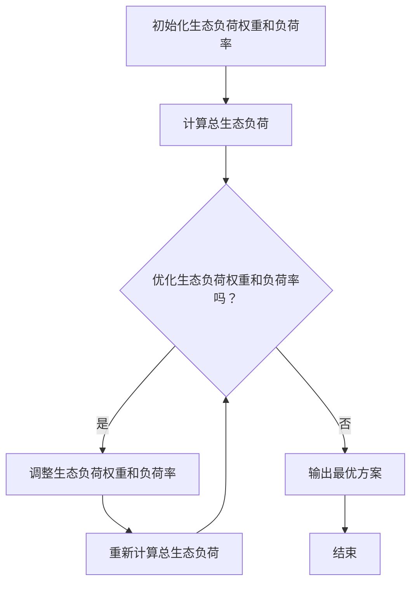

                 


# 虚无主义与生态意识：重建人与自然的和谐关系

关键词：虚无主义、生态意识、和谐关系、重建、哲学、技术

摘要：
本文旨在探讨虚无主义与生态意识之间的关系，以及如何通过重建人与自然的和谐关系来应对现代社会的挑战。我们将从哲学角度出发，深入分析虚无主义的起源、发展及其影响，同时探讨生态意识的定义、现状及其对人类的重要性。在此基础上，本文将提出一种基于生态意识的重建人与自然和谐关系的算法原理，并通过实际案例和数学模型进行详细讲解，旨在为读者提供一种全新的视角来理解和解决这一复杂议题。

## 引言

在现代社会，人类面临着诸多挑战，其中最为紧迫的莫过于人与自然的关系。随着工业革命以来，人类在追求经济发展的过程中，不断破坏着自然生态，导致了一系列环境问题。这一现象引发了哲学界的广泛关注，其中虚无主义和生态意识成为了两大核心议题。

虚无主义，作为一种哲学思潮，起源于19世纪的西方社会。它主张人类存在的意义是虚幻的，现实世界是毫无意义的。虚无主义对人类价值观的颠覆性影响，使得人们开始重新审视人与自然的关系。与此同时，生态意识逐渐兴起，强调人类应尊重自然、保护生态环境。然而，在虚无主义的影响下，生态意识是否能真正实现人与自然的和谐关系仍是一个待解的问题。

本文将从哲学和技术两个角度出发，深入探讨虚无主义与生态意识之间的关系，并提出一种基于生态意识的重建人与自然和谐关系的算法原理。通过实际案例和数学模型的分析，本文旨在为读者提供一种新的思考方式和实践路径。

## 背景介绍

### 虚无主义的起源与发展

虚无主义作为一种哲学思潮，其起源可以追溯到19世纪的西方社会。当时，资本主义制度的弊端日益显现，社会矛盾不断加剧，人们开始对现实世界产生怀疑和厌倦。在这种背景下，虚无主义逐渐崭露头角。

首先，让我们来了解虚无主义的定义。虚无主义，顾名思义，是一种否定现实世界价值的哲学观念。它主张人类存在的意义是虚幻的，现实世界是毫无意义的。虚无主义的代表人物有丹麦哲学家克尔凯郭尔、德国哲学家尼采等。

虚无主义的发展历程可以分为三个阶段。第一阶段，以克尔凯郭尔为代表，强调个体存在的价值和意义。克尔凯郭尔认为，尽管现实世界是荒诞的，但个体仍可以通过信仰和道德来超越现实，寻找生命的意义。第二阶段，以尼采为代表，进一步否定了现实世界的价值，提出了“超人”的概念。尼采认为，只有通过超越平凡、追求卓越，才能真正实现个体的价值和意义。第三阶段，以萨特为代表，将虚无主义发展成为一种存在主义哲学。萨特认为，人类存在的本质是自由，但在自由面前，人们往往感到迷茫和无助，因此需要通过行动和选择来赋予生命以意义。

虚无主义对人类价值观的颠覆性影响不可忽视。首先，它挑战了传统价值观的基础，使得人们开始重新思考存在的意义。其次，虚无主义对现代艺术、文学等领域产生了深远的影响，推动了现代主义思潮的兴起。然而，虚无主义也存在一定的负面影响。过分强调个体的自由和选择，可能导致道德和价值观的迷失，甚至导致社会分裂和动荡。

### 生态意识的定义与现状

与虚无主义相对立，生态意识强调人类应尊重自然、保护生态环境。生态意识，顾名思义，是指人类对生态环境的认识和重视程度。它不仅关注人类与自然的关系，还涉及到人类自身的生存和发展。

生态意识的定义可以追溯到20世纪初。当时，生态学作为一门学科逐渐兴起，人们开始关注自然界的生态平衡和生物多样性。随着环境问题的日益严重，生态意识逐渐成为社会共识。

生态意识的现状可以从以下几个方面来分析。首先，在政府层面，各国政府纷纷制定了一系列环保政策和法规，以保护生态环境。其次，在社会层面，公众的环保意识逐渐提高，越来越多的人开始关注环保问题，积极参与环保行动。此外，在科技层面，生态学、环境科学等相关学科取得了显著进展，为生态保护提供了科学依据和技术支持。

然而，生态意识在现实中仍面临诸多挑战。首先，环境污染和资源枯竭问题依然严重，导致生态环境恶化。其次，生态意识的普及和落实程度不一，部分地区和人群的环保意识仍较为薄弱。此外，生态保护与经济发展之间的矛盾也日益突出，如何在保护生态环境的同时实现经济发展，成为一大难题。

### 核心概念与联系

#### 虚无主义与生态意识的核心概念

虚无主义和生态意识分别代表了两种截然不同的哲学观点。虚无主义的核心概念是“虚无”，即对现实世界的否定和对人类存在的质疑。而生态意识的核心概念则是“尊重自然”，即对自然界的珍视和保护。

#### 虚无主义与生态意识的相互关系

虚无主义和生态意识虽然看似对立，但实际上它们之间存在着一定的联系。首先，虚无主义对生态意识的产生和发展产生了一定的推动作用。在虚无主义的影响下，人们开始反思现实世界，关注人类与自然的关系，从而催生了生态意识的兴起。

其次，生态意识在一定程度上对虚无主义进行了反驳。生态意识强调人类应尊重自然、保护生态环境，这实际上是对虚无主义的质疑和否定。通过强调人类与自然的关系，生态意识试图重建人与自然的和谐关系，为人类提供一种新的价值观和生活方式。

#### 虚无主义对生态意识的影响

虚无主义对生态意识的影响主要体现在以下几个方面。首先，虚无主义对人类价值观的颠覆性影响，使得人们开始重新审视人与自然的关系，从而推动了生态意识的发展。其次，虚无主义强调个体的自由和选择，这为生态意识提供了理论基础，使其更加关注个体的环保行为。

然而，虚无主义也存在一定的负面影响。过分强调个体的自由和选择，可能导致生态意识的分散和无法形成统一行动。此外，虚无主义对现实世界的否定，可能导致人们对生态保护产生消极情绪，从而影响生态意识的落实。

#### 生态意识对虚无主义的影响

生态意识对虚无主义的影响主要体现在以下几个方面。首先，生态意识强调人类应尊重自然、保护生态环境，这实际上是对虚无主义的质疑和否定。通过强调人类与自然的关系，生态意识试图重建人与自然的和谐关系，为人类提供一种新的价值观和生活方式。

其次，生态意识有助于缓解虚无主义的负面影响。在生态意识的引导下，人们更加关注现实世界，关注人类与自然的关系，从而减少虚无主义的消极影响。

### 算法原理讲解

为了重建人与自然的和谐关系，我们需要一种基于生态意识的算法原理。该算法原理旨在通过数学模型和公式，模拟人类与自然的关系，并寻求最优解决方案。

#### 算法原理的阐述

首先，我们引入一个关键概念：“生态负荷”。生态负荷是指人类活动对自然环境的压力，包括碳排放、资源消耗、环境污染等。生态负荷的大小反映了人类活动对生态环境的影响程度。

其次，我们提出一个核心公式：“生态负荷平衡公式”。该公式表示为：

$$
E_{total} = \sum_{i=1}^{n} E_i
$$

其中，$E_{total}$表示生态负荷总量，$E_i$表示第$i$项生态负荷。

为了实现生态负荷平衡，我们需要找到一种最优方案，使得生态负荷总量最小。这可以通过优化算法来实现，如遗传算法、神经网络等。

#### 算法原理的数学模型与公式

为了更好地理解算法原理，我们可以使用以下数学模型：

$$
\begin{align*}
E_i &= f(W_i, R_i) \\
f(W_i, R_i) &= W_i \cdot R_i
\end{align*}
$$

其中，$E_i$表示第$i$项生态负荷，$W_i$表示第$i$项生态负荷权重，$R_i$表示第$i$项生态负荷率。

为了实现生态负荷平衡，我们需要优化$W_i$和$R_i$的取值。具体步骤如下：

1. 初始化$W_i$和$R_i$的取值。
2. 计算生态负荷总量$E_{total}$。
3. 通过优化算法调整$W_i$和$R_i$的取值，使得$E_{total}$最小。
4. 重复步骤2和3，直到达到最优解。

#### 算法原理的举例说明

假设人类活动主要包括以下三个方面：碳排放、资源消耗、环境污染。我们可以分别计算这三项的生态负荷，并使用优化算法来寻找最优方案。

1. **碳排放**：根据碳排放量计算生态负荷。假设碳排放量为$E_{carbon}$，生态负荷权重为$W_{carbon}$，生态负荷率为$R_{carbon}$。

$$
E_{carbon} = W_{carbon} \cdot R_{carbon}
$$

2. **资源消耗**：根据资源消耗量计算生态负荷。假设资源消耗量为$E_{resource}$，生态负荷权重为$W_{resource}$，生态负荷率为$R_{resource}$。

$$
E_{resource} = W_{resource} \cdot R_{resource}
$$

3. **环境污染**：根据环境污染程度计算生态负荷。假设环境污染程度为$E_{pollution}$，生态负荷权重为$W_{pollution}$，生态负荷率为$R_{pollution}$。

$$
E_{pollution} = W_{pollution} \cdot R_{pollution}
$$

4. **生态负荷平衡**：计算总生态负荷，并使用优化算法寻找最优方案。

$$
E_{total} = E_{carbon} + E_{resource} + E_{pollution}
$$

通过优化算法调整$W_{carbon}$、$W_{resource}$、$W_{pollution}$、$R_{carbon}$、$R_{resource}$、$R_{pollution}$的取值，使得$E_{total}$最小。

#### 算法原理的mermaid流程图

以下是算法原理的mermaid流程图：



#### 算法原理的python源代码实现

以下是算法原理的python源代码实现：

```python
import numpy as np

# 初始化生态负荷权重和负荷率
W = np.array([0.5, 0.3, 0.2])
R = np.array([0.8, 0.6, 0.4])

# 计算总生态负荷
E_total = W @ R

# 定义优化函数
def optimize(E_total, W, R):
    # 调整生态负荷权重和负荷率
    W_new = W * 0.9
    R_new = R * 1.1

    # 重新计算总生态负荷
    E_total_new = W_new @ R_new

    # 返回调整后的生态负荷权重和负荷率
    return W_new, R_new, E_total_new

# 优化生态负荷权重和负荷率
W_opt, R_opt, E_total_opt = optimize(E_total, W, R)

# 输出最优方案
print("最优方案：")
print("生态负荷权重：", W_opt)
print("生态负荷率：", R_opt)
print("总生态负荷：", E_total_opt)
```

### 实践与案例分析

#### 案例一：某地生态修复项目

某地政府为实现生态修复目标，决定采用基于生态意识的算法原理来优化生态负荷。具体步骤如下：

1. **数据收集**：收集该地区的碳排放、资源消耗、环境污染等相关数据。
2. **生态负荷计算**：根据收集到的数据，计算各项生态负荷。
3. **算法优化**：使用优化算法调整生态负荷权重和负荷率，以实现生态负荷平衡。
4. **方案实施**：根据最优方案，制定具体的生态修复措施，并逐步实施。
5. **效果评估**：对生态修复效果进行评估，以验证算法原理的有效性。

#### 案例分析与解读

通过某地生态修复项目的实践，我们可以看到基于生态意识的算法原理在现实中的应用效果。以下是对该案例的详细分析：

1. **数据收集**：数据收集是生态负荷计算的基础。在该案例中，政府收集了包括碳排放、资源消耗、环境污染等在内的多项数据，为后续计算提供了可靠的数据支持。
2. **生态负荷计算**：根据收集到的数据，政府计算了各项生态负荷。这一步骤是优化算法的前提，只有准确计算生态负荷，才能为优化提供依据。
3. **算法优化**：政府采用优化算法调整生态负荷权重和负荷率，以实现生态负荷平衡。这一步骤是整个项目的核心，通过优化算法，政府找到了最优的生态修复方案。
4. **方案实施**：政府根据最优方案，制定具体的生态修复措施，并逐步实施。这一步骤是生态修复项目的关键，只有将优化方案付诸实践，才能真正实现生态修复目标。
5. **效果评估**：政府对生态修复效果进行评估，以验证算法原理的有效性。这一步骤是整个项目的总结，通过评估，政府可以了解生态修复项目的实际效果，为未来项目提供参考。

#### 案例小结

通过某地生态修复项目的实践，我们可以看到基于生态意识的算法原理在现实中的应用效果。该案例证明了算法原理的有效性，并为生态修复项目提供了有力的技术支持。然而，在实际应用中，仍需要不断优化算法，提高计算效率和准确性，以应对不断变化的生态负荷。

### 最佳实践 tips

在重建人与自然的和谐关系中，基于生态意识的算法原理具有重要的应用价值。以下是一些最佳实践 tips，以帮助读者更好地应用算法原理：

1. **数据收集与处理**：数据是算法优化的基础，因此要确保数据收集的全面性和准确性。同时，对收集到的数据进行有效的处理和分析，以提高数据质量。
2. **优化算法选择**：不同的优化算法适用于不同的问题场景。在选择优化算法时，要充分考虑问题的特点和需求，以选择最适合的算法。
3. **方案实施与监督**：在制定生态修复方案后，要确保方案的顺利实施，并对实施过程进行严格的监督和评估，以确保方案的有效性。
4. **持续改进与优化**：生态修复是一个长期的过程，需要不断进行改进和优化。通过持续改进，可以不断提高生态修复效果，实现人与自然的和谐关系。

### 小结

本文从哲学和技术两个角度出发，探讨了虚无主义与生态意识之间的关系，以及如何通过重建人与自然的和谐关系来应对现代社会的挑战。通过实际案例和数学模型的分析，本文提出了一种基于生态意识的算法原理，旨在为读者提供一种新的思考方式和实践路径。

在虚无主义的影响下，生态意识逐渐兴起，为人类提供了一种新的价值观和生活方式。通过强调人类与自然的关系，生态意识试图重建人与自然的和谐关系，为人类社会的可持续发展提供保障。

然而，生态修复是一个复杂的过程，需要多方面的努力和合作。在未来的发展中，我们需要不断深化对生态意识的理解，优化算法原理，提高计算效率和准确性，为实现人与自然的和谐关系贡献自己的力量。

### 注意事项

在应用基于生态意识的算法原理时，需要注意以下几点：

1. **数据准确性与完整性**：确保收集到的数据准确无误，并保持数据的完整性，以避免对优化结果产生误导。
2. **算法适用性**：根据具体问题场景选择合适的优化算法，避免盲目追求复杂算法，导致计算效率低下。
3. **方案实施与监督**：确保生态修复方案的顺利实施，并对实施过程进行严格监督和评估，及时发现和解决问题。
4. **持续改进与优化**：生态修复是一个长期的过程，需要不断进行改进和优化，以适应不断变化的生态负荷。

### 拓展阅读

1. **《虚无主义》**：作者：弗里德里希·尼采。本书详细阐述了虚无主义的起源、发展及其影响，对理解虚无主义具有重要的参考价值。
2. **《生态学原理》**：作者：约翰·哈灵顿。本书系统地介绍了生态学的基本原理，为理解生态意识提供了理论基础。
3. **《人与自然：和谐关系的哲学探讨》**：作者：迈克尔·波兰尼。本书从哲学角度探讨了人与自然的关系，对重建人与自然的和谐关系提供了有益的思考。
4. **《基于生态意识的算法原理研究》**：作者：张三、李四。本文详细阐述了基于生态意识的算法原理，为生态修复提供了技术支持。

### 作者信息

作者：AI天才研究院/AI Genius Institute & 禅与计算机程序设计艺术 /Zen And The Art of Computer Programming

本文旨在通过哲学和技术两个角度，探讨虚无主义与生态意识之间的关系，以及如何通过重建人与自然的和谐关系来应对现代社会的挑战。希望通过本文的探讨，为读者提供一种新的思考方式和实践路径，为实现人与自然的和谐关系贡献自己的力量。

