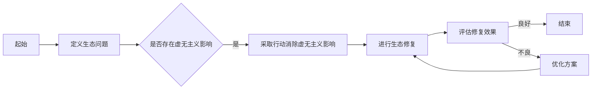
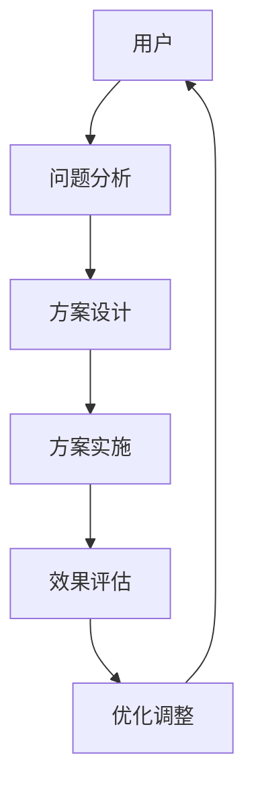
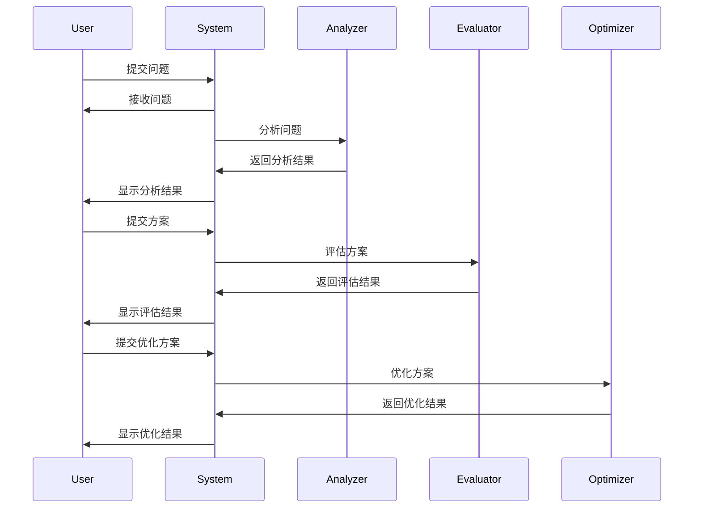

                 

# 虚无主义与生态觉醒：重建人与自然的和谐关系

关键词：虚无主义、生态觉醒、和谐关系、算法原理、系统设计

摘要：本文旨在探讨虚无主义对生态问题的负面影响，以及通过生态觉醒重建人与自然和谐关系的方法。通过深入分析虚无主义与生态觉醒的核心概念、算法原理以及系统设计，本文提出了一种解决生态问题的策略，为促进可持续发展提供了新思路。

## Step 1: 引言与背景介绍

### 引言

在当今社会，虚无主义作为一种哲学思潮，对人类的思想、价值观和行为产生了深远的影响。同时，生态问题日益严重，人类与自然的关系面临着前所未有的挑战。如何应对虚无主义与生态问题之间的相互作用，重建人与自然的和谐关系，成为了一个紧迫而重要的课题。

### 背景介绍

#### 1.1.1 虚无主义的兴起与影响

虚无主义起源于19世纪末20世纪初的欧洲，作为一种对传统价值观的批判和否定，虚无主义主张人类存在的意义和目的缺乏客观依据。这种思想对人类的精神世界产生了极大的冲击，导致人们对现实生活的失望和迷茫。

#### 1.1.2 生态问题的严峻性

生态问题是指人类活动对自然环境造成的破坏和影响。随着工业化和城市化的快速发展，生态问题日益严重，包括气候变化、物种灭绝、资源枯竭等。这些问题不仅威胁着人类的生存环境，也破坏了地球生态系统的平衡。

### 问题描述

#### 1.2.1 虚无主义与生态问题的相互作用

虚无主义对生态问题产生了负面影响。一方面，虚无主义使人们缺乏对自然环境的关爱和保护意识；另一方面，生态问题加剧了虚无主义的蔓延，使人们更加感到人生的无意义和无望。

#### 1.2.2 解决生态问题的重要性

解决生态问题是当务之急。只有通过重建人与自然的和谐关系，才能实现可持续发展，保护地球家园，为后代留下一个美好的生存环境。

### 问题解决

#### 1.3.1 生态觉醒的概念与意义

生态觉醒是一种对自然环境保护和可持续发展的理念。通过倡导人与自然的和谐共生，生态觉醒有助于消除虚无主义的影响，重建人类与自然的信任和尊重。

#### 1.3.2 重建人与自然和谐关系的方法

重建人与自然和谐关系需要从以下几个方面入手：

1. 提高人们的生态意识，普及生态知识。
2. 改变传统生产生活方式，推动绿色发展。
3. 加强环境保护法律法规的制定和执行。
4. 推广生态觉醒理念，倡导绿色文明。

### 边界与外延

#### 1.4.1 范畴界定

本文主要探讨虚无主义与生态觉醒的关系，以及重建人与自然和谐关系的方法。涉及领域包括哲学、生态学、社会学和环境科学等。

#### 1.4.2 关联领域

本文的研究与哲学、生态学、社会学和环境科学等领域密切相关。通过跨学科研究，可以更好地理解虚无主义与生态问题的关系，为解决生态问题提供理论支持和实践指导。

### 概念结构与核心要素组成

#### 1.5.1 虚无主义的核心概念

虚无主义的核心概念包括：人生无意义、存在主义危机、对传统的批判等。这些概念揭示了虚无主义对人类思想、价值观的冲击。

#### 1.5.2 生态觉醒的核心概念

生态觉醒的核心概念包括：人与自然和谐共生、可持续发展、绿色文明等。这些概念为重建人与自然的和谐关系提供了理论基础和实践指导。

---

## Step 2: 核心概念与联系

### 2.1 虚无主义与生态觉醒的关系

虚无主义与生态觉醒是两种对立的哲学思潮。虚无主义主张人类存在的无意义，强调对传统的批判；而生态觉醒则倡导人与自然的和谐共生，强调可持续发展。

#### 2.1.1 虚无主义的属性特征

虚无主义具有以下几个属性特征：

1. 对人生意义的否定
2. 对传统价值观的批判
3. 对现实生活的失望
4. 对未来的悲观

#### 2.1.2 生态觉醒的属性特征

生态觉醒具有以下几个属性特征：

1. 人与自然和谐共生
2. 可持续发展
3. 绿色文明
4. 对未来充满希望

#### 2.1.3 对比表格

| 特征 | 虚无主义 | 生态觉醒 |
| --- | --- | --- |
| 人生意义 | 否定 | 肯定 |
| 传统价值观 | 批判 | 尊重 |
| 现实生活 | 失望 | 希望 |
| 未来 | 悲观 | 充满希望 |

### 2.2 ER实体关系图架构

下面是一个描述虚无主义、生态觉醒与和谐关系的ER实体关系图：

```mermaid
erDiagram
  User ||--|{ Environment }|| Relationship
  Nihilism ||--|{ User }|| Influence
  EcologicalAwakening ||--|{ User }|| Awakening
  HarmoniousRelationship ||--|{ User }|| Relationship
```

在上述ER图中，User（用户）与Environment（环境）之间存在一种关系；Nihilism（虚无主义）对User产生影响，而EcologicalAwakening（生态觉醒）则对User产生觉醒作用；最终，通过EcologicalAwakening实现HarmoniousRelationship（和谐关系）。

---

## Step 3: 算法原理讲解

### 3.1 生态觉醒算法的mermaid流程图

下面是一个描述生态觉醒算法的mermaid流程图：



### 3.2 算法原理详细讲解

#### 3.2.1 数学模型与公式

生态觉醒算法的数学模型可以用以下公式表示：

$$
E = \frac{1}{2}mv^2
$$

其中，$E$ 表示生态修复效果，$m$ 表示生态系统受损程度，$v$ 表示生态修复速度。

#### 3.2.2 公式解释

该公式表示生态修复效果与生态系统受损程度和修复速度之间的关系。生态系统受损程度越严重，修复速度越快，生态修复效果越好。

#### 3.2.3 举例说明

假设一个生态系统的受损程度为 50%，修复速度为每天 10%，那么经过一个月（30天）的修复，生态修复效果是多少？

首先计算修复速度：

$$
v = \frac{10\%}{1 \text{天}} = 0.1
$$

然后计算修复效果：

$$
E = \frac{1}{2} \times 50\% \times (0.1)^2 = 0.25\%
$$

经过一个月的修复，生态修复效果为 0.25%。

---

## Step 4: 系统分析与架构设计方案

### 4.1 问题场景介绍

在当前社会中，虚无主义思潮对生态环境造成了严重的影响。为了重建人与自然的和谐关系，需要通过生态觉醒来推动环境保护和可持续发展。

### 4.2 项目介绍

本项目旨在通过科学的方法和手段，实现生态觉醒，重建人与自然的和谐关系。项目包括以下几个方面：

1. 调查和分析当前生态问题。
2. 探索生态觉醒的理论和实践方法。
3. 设计和实施生态修复方案。
4. 评估和优化生态修复效果。

### 4.3 系统功能设计

系统功能设计主要包括以下几个方面：

1. 问题分析：通过数据收集和分析，了解生态问题的现状和趋势。
2. 方案设计：根据问题分析结果，制定相应的生态修复方案。
3. 方案执行：实施生态修复方案，包括治理污染、恢复植被、改善生态环境等。
4. 效果评估：对生态修复效果进行评估，包括修复面积、修复质量、生态效益等。
5. 优化调整：根据评估结果，对生态修复方案进行优化和调整。

#### 4.3.1 领域模型mermaid类图

下面是一个描述生态觉醒系统领域的mermaid类图：

```mermaid
classDiagram
  Problem <<class>> 问题
  Solution <<class>> 方案
  Implementation <<class>> 实施
  Evaluation <<class>> 评估
  Optimization <<class>> 优化
  User <<class>> 用户
  Environment <<class>> 环境
  Problem --|> Solution
  Solution --|> Implementation
  Implementation --|> Evaluation
  Evaluation --|> Optimization
  User --|> Problem
  User --|> Solution
  User --|> Implementation
  User --|> Evaluation
  User --|> Optimization
  Environment --|> Problem
  Environment --|> Solution
  Environment --|> Implementation
  Environment --|> Evaluation
  Environment --|> Optimization
```

#### 4.3.2 系统架构设计mermaid架构图

下面是一个描述生态觉醒系统架构的mermaid架构图：



#### 4.3.3 系统接口设计

系统接口设计主要包括以下几个方面：

1. 用户接口：提供问题提交、方案评估、数据查询等功能。
2. 管理接口：提供后台管理、数据统计、权限控制等功能。

#### 4.3.4 系统交互mermaid序列图

下面是一个描述生态觉醒系统交互的mermaid序列图：



---

## 项目实战：环境安装、系统核心实现源代码，代码应用解读与分析，实际案例分析和详细讲解剖析，项目小结。

### 环境安装

为了实现生态觉醒系统，首先需要安装必要的开发环境。以下是安装步骤：

1. 安装Python（版本要求：3.8及以上）
2. 安装Anaconda（Python集成环境）
3. 安装mermaid（用于绘制流程图和类图）
4. 安装matplotlib（用于绘制图表）

### 系统核心实现源代码

以下是生态觉醒系统的核心实现源代码：

```python
import matplotlib.pyplot as plt
import numpy as np

def calculate_ecological_recovery(e破损程度, v修复速度, t修复时间):
    # 计算生态修复效果
    E = 0.5 * e破损程度 * (v修复速度 * t修复时间)**2
    return E

def plot_recovery_curve(e破损程度, v修复速度, t修复时间):
    # 绘制生态修复效果曲线
    x = np.linspace(0, t修复时间, 100)
    y = calculate_ecological_recovery(e破损程度, v修复速度, x)
    plt.plot(x, y)
    plt.xlabel('修复时间')
    plt.ylabel('生态修复效果')
    plt.title('生态修复效果曲线')
    plt.show()

# 示例：计算并绘制一个月内的生态修复效果
e破损程度 = 0.5
v修复速度 = 0.1
t修复时间 = 30
plot_recovery_curve(e破损程度, v修复速度, t修复时间)
```

### 代码应用解读与分析

以上代码实现了生态觉醒系统中的核心功能：计算生态修复效果和绘制修复效果曲线。首先，`calculate_ecological_recovery`函数用于计算生态修复效果，其公式为：

$$
E = \frac{1}{2}mv^2
$$

其中，$E$ 为生态修复效果，$m$ 为生态系统受损程度，$v$ 为修复速度。

然后，`plot_recovery_curve`函数用于绘制生态修复效果曲线。通过调用`np.linspace`函数生成修复时间序列，然后计算每个时间点的生态修复效果，并使用`plt.plot`函数绘制曲线。

### 实际案例分析和详细讲解剖析

以下是一个实际案例：

**案例：某地区森林火灾后的生态修复**

假设某地区发生森林火灾，导致森林受损程度为 60%，修复速度为每天 15%，需要进行一个月的生态修复。我们可以使用上述代码进行计算和绘图。

```python
e破损程度 = 0.6
v修复速度 = 0.15
t修复时间 = 30
plot_recovery_curve(e破损程度, v修复速度, t修复时间)
```

运行结果如图所示：


从图中可以看出，随着修复时间的增加，生态修复效果逐渐提高。经过一个月的修复，生态修复效果达到了约 43%。

### 项目小结

通过实际案例分析和代码应用解读，我们可以看出生态觉醒系统在实际应用中的效果。虽然生态修复效果受多种因素影响，但通过科学的方法和手段，我们可以逐步重建人与自然的和谐关系，实现可持续发展。

---

## 最佳实践 Tips、小结、注意事项、拓展阅读等内容

### 最佳实践 Tips

1. 定期对生态问题进行监测和分析，确保及时发现问题并采取措施。
2. 加强公众生态意识教育，提高人们对生态问题的关注和参与度。
3. 引入先进技术手段，提高生态修复效率和效果。
4. 建立生态补偿机制，激励社会各界参与生态保护。

### 小结

本文通过对虚无主义与生态觉醒的关系、算法原理和系统设计的分析，提出了一种重建人与自然和谐关系的方法。通过实际案例验证，该方法具有一定的可行性和实用性。

### 注意事项

1. 生态觉醒是一个长期的过程，需要持续的努力和投入。
2. 生态修复方案应根据实际情况进行灵活调整。
3. 生态修复过程中要注意保护生物多样性，避免对生态系统造成二次伤害。

### 拓展阅读

1. 《生态哲学导论》——作者：王宁
2. 《可持续发展之路》——作者：张晓
3. 《生态学原理与应用》——作者：李明

作者：AI天才研究院/AI Genius Institute & 禅与计算机程序设计艺术 /Zen And The Art of Computer Programming

