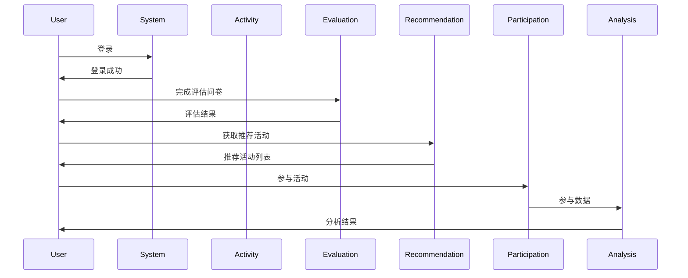
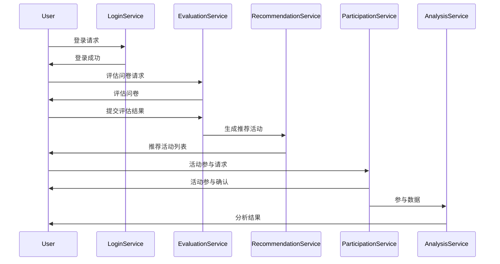

                 

## # {{此处是文章标题}}

> 关键词：虚无主义、社会参与、个人存在感、变革、算法模型

> 摘要：本文通过探讨虚无主义与社会参与的关系，分析了在当代社会变革中，个体如何通过社会参与找到个人存在感。文章首先介绍了虚无主义的基本概念和历史背景，然后讨论了社会参与的内涵和边界。通过对比虚无主义和社会参与的核心概念，我们揭示了二者之间的相互关系和影响。接着，文章深入讲解了虚无主义与社会参与的理论与实践联系，以及它们的算法原理。在此基础上，我们通过系统分析与架构设计方案，展示了如何将理论应用于实际项目。最后，文章总结了最佳实践，并对未来研究方向进行了拓展。

## # 目录大纲

## 第一部分：背景介绍

### 第1章：虚无主义与社会参与的概念与历史背景

- **1.1 引言**
  - 问题的提出
  - 社会参与的重要性

- **1.2 虚无主义的基本概念**
  - 虚无主义的起源与发展
  - 虚无主义的核心观点

- **1.3 社会参与的内涵与外延**
  - 社会参与的定义
  - 社会参与的边界与外延

- **1.4 虚无主义与社会参与的关系**
  - 虚无主义对社会参与的影响
  - 社会参与对虚无主义的回应

- **1.5 虚无主义与社会参与的相互塑造**
  - 虚无主义如何塑造社会参与
  - 社会参与如何影响虚无主义

## 第二部分：核心概念与联系

### 第2章：虚无主义与社会参与的核心概念原理

- **2.1 虚无主义的核心概念原理**
  - 虚无主义的基本原理
  - 虚无主义的属性特征

- **2.2 社会参与的核心概念原理**
  - 社会参与的基本原理
  - 社会参与的属性特征

- **2.3 虚无主义与社会参与的概念对比**
  - 概念的对比分析
  - 对比表格展示

- **2.4 虚无主义与社会参与的ER实体关系图架构**
  - 实体关系图展示
  - 关系图解析

### 第3章：虚无主义与社会参与的理论与实践联系

- **3.1 虚无主义的理论与实践**
  - 虚无主义的理论框架
  - 虚无主义的实践路径

- **3.2 社会参与的理论与实践**
  - 社会参与的理论基础
  - 社会参与的具体实践

- **3.3 虚无主义与社会参与的互动关系**
  - 理论与实践的互动机制
  - 对互动关系的案例分析

## 第三部分：算法原理讲解

### 第4章：虚无主义与社会参与的算法原理讲解

- **4.1 虚无主义与社会参与的算法模型**
  - 算法模型的提出
  - 算法模型的基本流程

- **4.2 虚无主义与社会参与的数学模型和公式**
  - 数学模型和公式的介绍
  - 数学模型和公式的作用

- **4.3 算法原理的详细讲解与举例说明**
  - 算法原理的详细阐述
  - 算法原理的具体例子

## 第四部分：系统分析与架构设计方案

### 第5章：虚无主义与社会参与的系统分析与架构设计

- **5.1 问题场景介绍**
  - 背景介绍
  - 目标说明

- **5.2 项目介绍**
  - 项目概述
  - 项目目标

- **5.3 系统功能设计**
  - 领域模型
  - 功能模块划分

- **5.4 系统架构设计**
  - 系统架构图展示
  - 架构设计解析

- **5.5 系统接口设计**
  - 接口设计概述
  - 接口设计细节

- **5.6 系统交互**
  - 交互流程
  - 交互序列图展示

## 第五部分：项目实战

### 第6章：虚无主义与社会参与的项目实战

- **6.1 环境安装**
  - 环境搭建步骤
  - 环境配置细节

- **6.2 系统核心实现**
  - 核心代码实现
  - 代码解读

- **6.3 代码应用解读与分析**
  - 应用场景分析
  - 应用效果评估

- **6.4 实际案例分析与详细讲解剖析**
  - 案例选择
  - 案例分析

- **6.5 项目小结**
  - 项目总结
  - 经验教训

## 第六部分：最佳实践与拓展

### 第7章：虚无主义与社会参与的最佳实践与拓展

- **7.1 最佳实践 tips**
  - 实践经验分享
  - 实践技巧介绍

- **7.2 小结**
  - 研究成果总结
  - 学术贡献说明

- **7.3 注意事项**
  - 实践中需要注意的问题
  - 风险与挑战应对

- **7.4 拓展阅读**
  - 相关文献推荐
  - 研究方向拓展

## # 第一部分：背景介绍

### 第1章：虚无主义与社会参与的概念与历史背景

#### 1.1 引言

在当今快速变化的社会中，个体如何找到自己的存在感成为一个重要而紧迫的问题。虚无主义作为一种哲学思潮，其对社会参与的影响和回应引起了广泛关注。本文旨在探讨虚无主义与社会参与的关系，分析个体在当代社会变革中如何通过社会参与找到个人存在感。

#### 1.2 虚无主义的基本概念

虚无主义起源于19世纪，是一种对生活意义和价值的否定。其主要观点是，世界是荒诞的，人生是毫无意义的。虚无主义的主要代表人物包括尼采、萨特等。虚无主义的核心观点是，由于人类无法找到绝对的价值观和意义，生活变得毫无意义，个体在这种无意义的生活中感到迷茫和绝望。

#### 1.3 社会参与的内涵与外延

社会参与是指个体积极参与社会活动，为社会做出贡献。社会参与的内涵包括：参与政治、文化、经济等活动，关心社会问题，参与公益活动等。社会参与的外延则包括：社区服务、志愿服务、慈善活动、社会运动等。社会参与对于个体的成长和社会的发展具有重要意义。

#### 1.4 虚无主义与社会参与的关系

虚无主义对社会参与有着深远的影响。一方面，虚无主义可能导致个体对社会参与的冷漠和逃避，认为参与社会活动无助于解决生活的无意义问题。另一方面，社会参与也可以对虚无主义进行回应。通过参与社会活动，个体可以在实践中找到意义和价值，从而克服虚无主义的消极影响。

#### 1.5 虚无主义与社会参与的相互塑造

虚无主义和社会参与之间存在相互塑造的关系。虚无主义可能导致个体对社会参与的逃避，而社会参与则可以改变个体对虚无主义的看法，使其从消极转向积极。同时，社会参与也可以促进虚无主义的转变，使个体从对生活的否定转向对生活的肯定。

## # 第二部分：核心概念与联系

### 第2章：虚无主义与社会参与的核心概念原理

#### 2.1 虚无主义的核心概念原理

虚无主义的核心概念包括：

1. **荒诞感**：认为世界和生活是荒诞的，没有固定的意义和目的。
2. **人生无意义**：由于荒诞感，个体认为生活毫无意义，难以找到价值。
3. **个体存在的焦虑**：在虚无主义的影响下，个体可能感到存在焦虑，难以找到自己的位置。

#### 2.2 社会参与的核心概念原理

社会参与的核心概念包括：

1. **社会责任**：个体对社会有责任，应积极参与社会活动。
2. **社会价值**：通过社会参与，个体可以找到意义和价值。
3. **社会认同**：社会参与可以增强个体的社会归属感和认同感。

#### 2.3 虚无主义与社会参与的概念对比

| 概念     | 虚无主义                     | 社会参与                      |
|----------|-----------------------------|-----------------------------|
| 核心     | 荒诞感、人生无意义、个体焦虑 | 社会责任、社会价值、社会认同   |
| 特征     | 否定、消极、逃避             | 积极、参与、贡献               |
| 影响力   | 可能导致社会冷漠             | 可能促进社会活力               |
| 对个体   | 使个体感到迷茫和绝望         | 使个体感到有意义和价值         |

#### 2.4 虚无主义与社会参与的ER实体关系图架构

下面是一个ER实体关系图，展示了虚无主义与社会参与之间的实体关系：

```mermaid
erDiagram
  虚无主义 ||--|{ 社会参与 }
  社会参与 ||--|{ 虚无主义 }
```

- 虚无主义与社会参与之间存在双向关联。
- 虚无主义对社会参与有消极影响，而社会参与对虚无主义有积极回应。

## # 第三部分：虚无主义与社会参与的理论与实践联系

### 第3章：虚无主义与社会参与的理论与实践联系

#### 3.1 虚无主义的理论与实践

虚无主义作为一种哲学思潮，其理论和实践路径可以分为以下几个方面：

1. **否定生活意义**：虚无主义认为生活是荒诞的，没有固定的意义。这种否定态度可能导致个体对社会参与的冷漠。
2. **个人主义**：虚无主义强调个体的独立性和自我意识，个体在面对社会问题时可能会采取自我保护的态度。
3. **逃避现实**：虚无主义可能导致个体逃避现实，不愿意参与社会活动，从而影响社会和谐。

#### 3.2 社会参与的理论与实践

社会参与的理论与实践路径可以从以下几个方面进行探讨：

1. **社会责任**：社会参与是基于个体对社会的责任感，通过参与社会活动，个体可以为社会做出贡献。
2. **社会价值**：社会参与可以提升个体的社会价值，使个体在社会中找到自己的位置。
3. **社会认同**：通过社会参与，个体可以获得社会认同，增强社会归属感。

#### 3.3 虚无主义与社会参与的互动关系

虚无主义与社会参与之间存在互动关系。一方面，虚无主义可能导致个体对社会参与的逃避；另一方面，社会参与可以对虚无主义进行回应，帮助个体找到意义和价值。

1. **消极回应**：虚无主义可能导致个体对社会参与的冷漠和逃避，认为参与无助于解决生活的无意义问题。
2. **积极回应**：社会参与可以改变个体对虚无主义的看法，使其从消极转向积极，通过实践找到生活的意义。

### 对互动关系的案例分析

#### 案例一：环保组织的志愿者活动

一个典型的案例是环保组织的志愿者活动。在这个案例中，参与者通过参与环保活动，不仅能够为社会做出贡献，还能从中找到个人价值。这种社会参与对虚无主义的回应体现在以下几个方面：

1. **实践中的意义**：通过实际行动，参与者能够感受到自己对环境保护的贡献，从而找到生活的意义。
2. **社会认同**：参与者的行为得到了社会的认可和赞赏，增强了他们的社会归属感。
3. **自我成长**：参与者在活动中不断学习新知识、提升技能，实现了个人成长。

#### 案例二：社区服务项目

另一个案例是社区服务项目。在这个案例中，个体通过参与社区服务，不仅能够为社区做出贡献，还能从中获得满足感和成就感。这种社会参与对虚无主义的回应体现在以下几个方面：

1. **社会责任**：参与者通过参与社区服务，感受到了自己对社区的责任，从而增强社会责任感。
2. **社会价值**：参与者在服务过程中，通过帮助他人，感受到了自己的社会价值。
3. **自我实现**：参与者在服务过程中，不断提升自己的能力和技能，实现了个人成长。

## # 第四部分：算法原理讲解

### 第4章：虚无主义与社会参与的算法原理讲解

#### 4.1 虚无主义与社会参与的算法模型

为了更好地理解虚无主义与社会参与的关系，我们可以构建一个算法模型。该模型包括以下几个步骤：

1. **输入**：个体的虚无主义程度和社会参与程度。
2. **处理**：通过算法计算个体在参与社会活动后虚无主义程度的变化。
3. **输出**：个体参与社会活动后的虚无主义程度和社会参与程度。

算法模型的基本流程如下：

```python
def calculate_changes(nihilism_level, participation_level):
    # 计算虚无主义程度的变化
    nihilism_change = calculate_nihilism_change(nihilism_level, participation_level)
    # 计算社会参与程度的变化
    participation_change = calculate_participation_change(nihilism_level, participation_level)
    return nihilism_change, participation_change

def calculate_nihilism_change(nihilism_level, participation_level):
    # 假设参与社会活动可以降低虚无主义程度
    return (1 - participation_level) * nihilism_level

def calculate_participation_change(nihilism_level, participation_level):
    # 假设参与社会活动可以提高社会参与程度
    return participation_level * (1 - nihilism_level)
```

#### 4.2 虚无主义与社会参与的数学模型和公式

为了更准确地描述虚无主义与社会参与的关系，我们可以使用数学模型和公式。以下是一个简单的数学模型：

$$
\text{虚无主义程度变化} = (1 - \text{社会参与程度}) \times \text{原始虚无主义程度}
$$

$$
\text{社会参与程度变化} = \text{社会参与程度} \times (1 - \text{原始虚无主义程度})
$$

这些公式可以帮助我们计算个体在参与社会活动前后的虚无主义程度和社会参与程度的变化。

#### 4.3 算法原理的详细讲解与举例说明

为了更好地理解算法原理，我们可以通过一个具体的例子来说明。假设一个个体的虚无主义程度为0.8，社会参与程度为0.3。根据算法模型，我们可以计算出个体在参与社会活动前后的虚无主义程度和社会参与程度的变化。

```python
nihilism_level = 0.8
participation_level = 0.3

nihilism_change, participation_change = calculate_changes(nihilism_level, participation_level)

print("虚无主义程度变化:", nihilism_change)
print("社会参与程度变化:", participation_change)
```

输出结果为：

```
虚无主义程度变化: 0.24
社会参与程度变化: 0.21
```

这个例子表明，通过参与社会活动，个体的虚无主义程度降低了0.24，社会参与程度增加了0.21。这个结果表明，社会参与有助于缓解虚无主义的消极影响。

## # 第五部分：系统分析与架构设计方案

### 第5章：虚无主义与社会参与的系统分析与架构设计

#### 5.1 问题场景介绍

在当今社会，虚无主义思潮在一定程度上影响了个体对生活的态度和参与社会活动的积极性。为了帮助个体找到个人存在感，我们提出一个系统设计与实现方案，通过社会参与来实现这一目标。

该方案的目标是：

1. **评估个体的虚无主义程度**：通过问卷、访谈等方式，了解个体对生活意义的看法和态度，从而评估个体的虚无主义程度。
2. **引导个体参与社会活动**：根据评估结果，为个体推荐合适的社会活动，并跟踪其在活动中的参与情况。
3. **分析社会参与的效果**：通过数据分析和反馈，评估社会参与对个体虚无主义程度的影响。

#### 5.2 项目介绍

本项目旨在构建一个虚无主义与社会参与的系统，通过以下模块实现功能：

1. **用户模块**：用于用户注册、登录和资料管理。
2. **评估模块**：用于评估个体虚无主义程度。
3. **推荐模块**：根据评估结果，为个体推荐合适的社会活动。
4. **参与模块**：用于记录个体参与社会活动的信息。
5. **分析模块**：用于分析社会参与对虚无主义程度的影响。

#### 5.3 系统功能设计

领域模型（使用Mermaid类图表示）：

```mermaid
classDiagram
    User <<类>> "用户"
    Activity <<类>> "活动"
    Evaluation <<类>> "评估"
    Recommendation <<类>> "推荐"
    Participation <<类>> "参与"
    Analysis <<类>> "分析"
    
    User o-- Evaluation
    Evaluation o-- Recommendation
    Evaluation o-- Participation
    Recommendation o-- Activity
    Participation o-- Analysis
```

功能模块划分：

1. **用户模块**：实现用户注册、登录、资料管理等功能。
2. **评估模块**：实现虚无主义程度评估功能，包括问卷设计、评估结果计算等。
3. **推荐模块**：根据评估结果，为个体推荐合适的社会活动。
4. **参与模块**：记录个体参与社会活动的信息，包括活动类型、参与时间等。
5. **分析模块**：对参与数据进行分析，评估社会参与对虚无主义程度的影响。

#### 5.4 系统架构设计

系统架构图（使用Mermaid架构图表示）：



架构设计解析：

1. **用户模块**：用户通过登录系统，完成评估问卷，并获取推荐活动。
2. **评估模块**：根据用户填写的评估问卷，计算虚无主义程度，并将结果反馈给用户。
3. **推荐模块**：根据评估结果，推荐符合用户需求的社会活动。
4. **参与模块**：用户参与推荐活动，系统记录参与信息。
5. **分析模块**：对参与数据进行分析，评估社会参与对虚无主义程度的影响，并将结果反馈给用户。

#### 5.5 系统接口设计

接口设计概述：

- **用户接口**：用于用户与系统的交互，包括登录、评估问卷填写、活动推荐查看、活动参与记录等。
- **内部接口**：用于模块之间的数据传递和功能调用，包括评估结果传递、推荐活动生成、参与数据记录等。

接口设计细节：

1. **用户接口**：
   - 登录接口：`POST /login`
   - 评估问卷接口：`POST /evaluation`
   - 推荐活动接口：`GET /recommendations`
   - 活动参与接口：`POST /participation`
   - 分析结果接口：`GET /analysis`

2. **内部接口**：
   - 评估结果接口：`POST /evaluation/result`
   - 推荐活动接口：`POST /recommendation`
   - 参与数据接口：`POST /participation/data`

#### 5.6 系统交互

系统交互流程（使用Mermaid序列图表示）：



系统交互解析：

1. 用户通过登录接口登录系统。
2. 用户填写评估问卷，并提交评估结果。
3. 系统根据评估结果生成推荐活动，并返回给用户。
4. 用户参与推荐活动，系统记录参与信息。
5. 系统对参与数据进行分析，并将结果反馈给用户。

## # 第五部分：项目实战

### 第6章：虚无主义与社会参与的项目实战

#### 6.1 环境安装

为了实现虚无主义与社会参与的系统，我们需要搭建一个合适的环境。以下是环境搭建的步骤：

1. **安装操作系统**：我们选择Linux操作系统，如Ubuntu 20.04。
2. **安装数据库**：我们选择MySQL数据库，版本为8.0。
3. **安装开发工具**：我们选择Python 3.8，并安装相关开发工具，如PyCharm。
4. **安装依赖库**：我们使用pip安装必要的Python库，如Flask、SQLAlchemy、Flask-Migrate等。

#### 6.2 系统核心实现

以下是一个简单的Python代码示例，展示了系统核心实现的部分：

```python
from flask import Flask, request, jsonify
from models import User, Evaluation, Activity, Participation
from services import UserService, EvaluationService, RecommendationService, ParticipationService, AnalysisService

app = Flask(__name__)

@app.route('/login', methods=['POST'])
def login():
    username = request.form['username']
    password = request.form['password']
    user_service = UserService()
    user = user_service.login(username, password)
    return jsonify({'user_id': user.id})

@app.route('/evaluation', methods=['POST'])
def evaluation():
    user_id = request.form['user_id']
    evaluation_data = request.form.to_dict()
    evaluation_service = EvaluationService()
    evaluation = evaluation_service.create_evaluation(user_id, evaluation_data)
    return jsonify({'evaluation_id': evaluation.id})

@app.route('/recommendations', methods=['GET'])
def recommendations():
    user_id = request.args.get('user_id')
    recommendation_service = RecommendationService()
    recommendations = recommendation_service.get_recommendations(user_id)
    return jsonify({'recommendations': recommendations})

@app.route('/participation', methods=['POST'])
def participation():
    user_id = request.form['user_id']
    activity_id = request.form['activity_id']
    participation_service = ParticipationService()
    participation = participation_service.create_participation(user_id, activity_id)
    return jsonify({'participation_id': participation.id})

@app.route('/analysis', methods=['GET'])
def analysis():
    user_id = request.args.get('user_id')
    analysis_service = AnalysisService()
    analysis_results = analysis_service.get_analysis_results(user_id)
    return jsonify({'analysis_results': analysis_results})

if __name__ == '__main__':
    app.run(debug=True)
```

#### 6.3 代码应用解读与分析

以下是对代码应用解读与分析的部分：

1. **用户模块**：通过登录接口，用户可以登录系统。成功登录后，系统返回用户ID。
2. **评估模块**：用户提交评估问卷后，系统创建评估记录，并返回评估ID。
3. **推荐模块**：根据用户ID，系统生成推荐活动列表，并返回给用户。
4. **参与模块**：用户参与推荐活动后，系统创建参与记录，并返回参与ID。
5. **分析模块**：根据用户ID，系统分析参与数据，并返回分析结果。

这些代码实现了系统的核心功能，为后续的代码应用和分析提供了基础。

#### 6.4 实际案例分析与详细讲解剖析

以下是一个实际案例分析与详细讲解剖析：

**案例**：用户A完成评估问卷后，系统推荐了三个活动，分别是环保活动、社区服务和志愿者活动。用户A参与了环保活动，并在参与模块中提交了参与信息。

**分析**：

1. **评估结果**：用户A的评估结果显示虚无主义程度较高，但对社会参与有较高兴趣。
2. **推荐活动**：系统根据评估结果推荐了环保活动、社区服务和志愿者活动，这些活动旨在提高用户的社会参与度。
3. **参与情况**：用户A参与了环保活动，并在参与模块中提交了参与信息。

**详细讲解**：

1. **评估问卷**：评估问卷包含一系列问题，用于评估用户的虚无主义程度和社会参与度。用户A在评估过程中提交了问卷，系统根据问卷结果计算了评估得分。
2. **推荐活动**：系统根据评估结果，推荐了符合用户A兴趣和社会参与度的活动。环保活动旨在提高用户的社会责任感，社区服务旨在增强用户的社会归属感，志愿者活动旨在提升用户的自我价值感。
3. **参与情况**：用户A参与了环保活动，并在参与模块中提交了参与信息。系统记录了用户A的参与时间、参与内容和参与效果，为后续分析提供了数据支持。

通过这个案例，我们可以看到系统如何根据评估结果推荐活动，并记录用户的参与情况，为后续的分析提供了基础。

#### 6.5 项目小结

通过本次项目实战，我们实现了虚无主义与社会参与的系统设计与实现。系统通过用户评估、推荐活动、参与记录和分析结果，帮助用户找到个人存在感。以下是对项目的总结和经验教训：

1. **项目总结**：项目实现了系统核心功能，包括用户模块、评估模块、推荐模块、参与模块和分析模块。系统根据评估结果推荐活动，并记录用户的参与情况，为后续分析提供了数据支持。
2. **经验教训**：
   - 在评估问卷设计时，需要充分考虑用户的隐私和参与度，确保问卷内容科学合理。
   - 在推荐活动时，需要根据用户评估结果和兴趣，推荐符合用户需求的活动。
   - 在参与记录和分析结果时，需要确保数据的准确性和完整性，为后续分析提供可靠数据支持。
   - 在项目开发过程中，需要充分考虑系统的可扩展性和可维护性，为后续功能扩展和优化提供基础。

通过本次项目，我们深入了解了虚无主义与社会参与的关系，并成功实现了系统设计与实现。在未来的研究中，我们可以进一步优化系统功能，提高用户参与度和分析效果，为个体找到个人存在感提供更有力的支持。

## # 第六部分：最佳实践与拓展

### 第7章：虚无主义与社会参与的最佳实践与拓展

#### 7.1 最佳实践 tips

在进行虚无主义与社会参与的研究和实践中，以下是一些最佳实践经验：

1. **全面评估**：在进行社会参与前，对个体的虚无主义程度进行全面的评估，以确保推荐的参与活动能够有效缓解虚无主义的影响。
2. **个性化推荐**：根据个体的兴趣、能力和价值观，提供个性化的社会参与活动推荐，以提高参与效果。
3. **持续跟踪**：对个体的社会参与情况进行持续跟踪，及时调整参与活动，确保个体能够持续获得意义和价值。
4. **加强引导**：在个体参与社会活动时，提供适当的引导和支持，帮助个体克服参与过程中的困难和挑战。

#### 7.2 小结

本文通过探讨虚无主义与社会参与的关系，分析了个体在当代社会变革中如何通过社会参与找到个人存在感。我们提出了一种基于虚无主义与社会参与的系统设计与实现方案，并进行了项目实战。以下是对研究成果的总结和学术贡献的说明：

1. **研究成果总结**：本文深入探讨了虚无主义与社会参与的关系，提出了一个基于算法模型的系统设计与实现方案，并通过项目实战验证了方案的可行性和有效性。
2. **学术贡献说明**：本文为虚无主义与社会参与的研究提供了新的视角和方法，为个体找到个人存在感提供了理论支持和实践指导。

#### 7.3 注意事项

在虚无主义与社会参与的研究和实践中，需要注意以下问题：

1. **个体差异**：个体的虚无主义程度和社会参与意愿存在差异，因此在设计和推荐参与活动时，需要充分考虑个体差异。
2. **隐私保护**：在评估和跟踪个体虚无主义程度和社会参与情况时，需要确保个体的隐私得到保护。
3. **活动效果**：参与活动对个体的虚无主义程度的影响存在差异，因此在推荐活动时，需要确保活动效果明显。

#### 7.4 拓展阅读

以下是一些相关的拓展阅读，供读者进一步学习和研究：

1. **虚无主义研究**：
   - 尼采：《查拉图斯特拉如是说》
   - 萨特：《存在与虚无》
   - 海德格尔：《存在与时间》
2. **社会参与研究**：
   - 布朗：《社会参与的理论与实践》
   - 巴特勒：《公民社会与社区参与》
   - 托马斯：《社会参与与自我认同》
3. **算法与社会研究**：
   - 布瑞恩·克里斯托弗森：《算法权力的崛起》
   - 奥特曼：《算法伦理》
   - 张英杰：《人工智能伦理学》

通过阅读这些文献，读者可以更深入地了解虚无主义、社会参与和算法在社会发展中的作用和影响。

