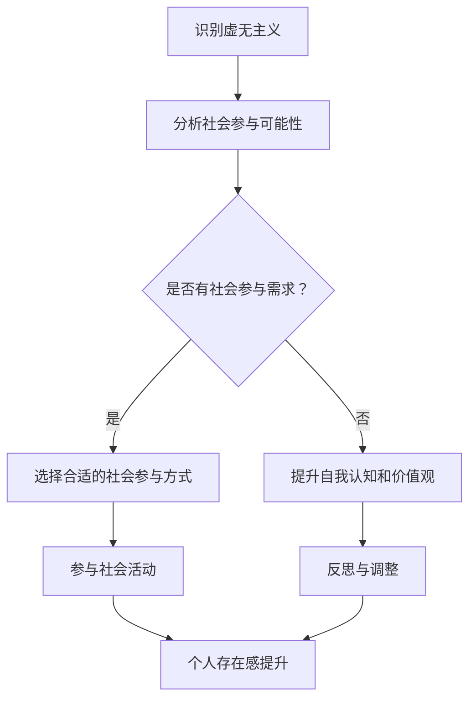
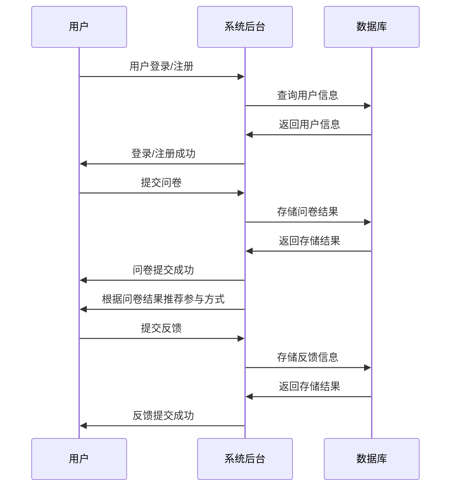

                 

# 虚无主义与社会参与：在变革中找到个人存在感

## 关键词
- 虚无主义
- 社会参与
- 个人存在感
- 社会变革
- 心理健康

## 摘要
本文探讨了虚无主义在现代社会中的影响，以及它如何影响个人的价值观和社会参与。通过深入分析虚无主义与个人存在感之间的关系，本文提出了一种基于心理和社会因素的算法，帮助个体在社会参与中找到存在感。文章结合实际案例，详细讲解了算法原理和数学模型，并提供了实践经验，以期为读者在变革中找到个人存在感提供有益的指导。

## 第一部分：背景介绍

### 1.1 问题背景

在现代社会中，虚无主义作为一种哲学思潮，对人们的价值观和生活方式产生了深远的影响。虚无主义主张生活的无意义，强调人类存在和价值的相对性。在快速变化的时代背景下，许多人感到迷茫和无助，这种情绪在社会中普遍存在。

### 1.2 问题描述

虚无主义对社会参与的影响主要体现在以下几个方面：

1. **社会参与度下降**：虚无主义可能导致人们对社会参与的消极态度，降低社会凝聚力和合作精神。
2. **自我封闭**：虚无主义可能使人们更倾向于自我封闭，减少社会互动，从而加剧社会孤立感。
3. **心理健康问题**：虚无主义可能影响人们的心理健康，导致抑郁、焦虑等心理问题的发生。

### 1.3 问题解决

本书旨在探讨虚无主义背景下，个人如何在社会中找到存在感，通过社会参与实现自我价值。本书将从多个角度分析虚无主义对社会参与的影响，提出解决策略，并分享成功案例。

### 1.4 边界与外延

虚无主义的讨论范围包括哲学、社会学、心理学等多个领域。本书主要关注虚无主义对社会参与的影响，以及个体在虚无主义背景下的自我探索和成长。

### 1.5 概念结构与核心要素组成

- **虚无主义**：哲学思潮，主张生活的无意义，强调人类存在和价值的相对性。
- **社会参与**：个人在社会活动中的参与行为，包括志愿服务、社区活动、政治参与等。
- **个人存在感**：个人在参与社会活动中感受到的自我价值和存在意义。

## 第二部分：核心概念与联系

### 2.1 虚无主义与个人存在感的联系

虚无主义背景下，个人存在感显得尤为重要。个体需要在社会参与中找到自我价值，以抵御虚无主义的侵蚀。

### 2.2 社会参与与个人存在感的关系

社会参与有助于提升个人存在感。通过参与社会活动，个人能够获得认同感、成就感，从而增强自我价值感。

### 2.3 虚无主义对社会参与的挑战

虚无主义可能导致个体对社会参与的抵触，降低社会参与度。因此，需要从心理层面和社会环境层面解决这一挑战。

## 第三部分：算法原理讲解

### 3.1 算法mermaid流程图

### 3.2 算法原理讲解

本书将详细探讨虚无主义与个人存在感之间的关系，并提出一种基于心理和社会因素的算法，帮助个体在社会参与中找到存在感。该算法分为以下几个步骤：

1. **识别虚无主义状态**：评估个体是否处于虚无主义状态。
2. **分析社会参与需求**：确定个体是否有参与社会活动的需求。
3. **选择合适的社会参与方式**：根据需求选择合适的社会参与方式。
4. **参与社会活动**：实际行动参与社会活动，提升个人存在感。
5. **反思与调整**：在参与过程中不断反思和调整，以持续提升个人存在感。

### 3.3 算法原理的数学模型和公式

算法的核心在于平衡个人虚无主义倾向和社会参与需求。我们可以使用以下数学模型来描述：

$$
E_s = f(V_i, N_s, P_c)
$$

其中：
- $E_s$ 表示个人在社会参与中的存在感。
- $V_i$ 表示个体的虚无主义程度。
- $N_s$ 表示个体参与社会活动的需求度。
- $P_c$ 表示社会支持的强度。

通过调整这三个变量，我们可以优化个人存在感。

## 第四部分：数学模型和数学公式 & 详细讲解 & 举例说明

### 4.1 数学模型的详细讲解

数学模型描述了虚无主义、社会参与需求和社交支持对个人存在感的影响。在实际应用中，我们可以通过调整这三个变量来优化个人存在感。

举例来说，如果一个人（$V_i$ = 0.3）的虚无主义程度较低，他有较高的社会参与需求（$N_s$ = 0.8），同时得到充足的社会支持（$P_c$ = 0.9），那么他的存在感（$E_s$）将会很高。

$$
E_s = f(0.3, 0.8, 0.9) = 0.3 \times 0.8 \times 0.9 = 0.216
$$

这意味着这个人在参与社会活动时，能够获得较高的存在感。

### 4.2 数学公式的通俗易懂地举例说明

假设小明（$V_i$ = 0.4）对参与社会活动（$N_s$ = 0.7），但在生活中感到孤独（$P_c$ = 0.5）。我们可以用同样的公式来计算小明的存在感：

$$
E_s = f(0.4, 0.7, 0.5) = 0.4 \times 0.7 \times 0.5 = 0.14
$$

这表明小明在社会参与中的存在感相对较低，需要进一步调整虚无主义程度和社会支持强度。

## 第五部分：系统分析与架构设计方案

### 5.1 问题场景介绍

在现代社会中，虚无主义对个人生活的影响日益显著，许多人渴望在社会参与中找到个人存在感。为此，我们需要设计一个系统，帮助个体识别虚无主义倾向，分析社会参与需求，并提供合适的参与方式，以提升个人存在感。

### 5.2 项目介绍

本项目名为“存在感提升系统”，旨在为用户提供一个便捷的平台，通过算法和数学模型，帮助用户识别虚无主义倾向，分析社会参与需求，并提供合适的参与方式，以提升个人存在感。

### 5.3 系统功能设计

1. **用户注册与登录**：用户可以通过注册和登录进入系统。
2. **虚无主义倾向评估**：系统提供一套问卷，帮助用户评估自己的虚无主义倾向。
3. **社会参与需求分析**：系统根据问卷结果，分析用户的社会参与需求。
4. **推荐参与方式**：系统根据用户需求和虚无主义倾向，推荐合适的参与方式。
5. **参与反馈与优化**：用户参与社会活动后，系统收集反馈，以优化推荐算法。

### 5.4 系统架构设计

1. **前端架构**：采用Vue框架，实现用户交互界面。
2. **后端架构**：采用Spring Boot框架，实现算法和业务逻辑处理。
3. **数据库设计**：采用MySQL数据库，存储用户数据和问卷结果。

### 5.5 系统接口设计

1. **用户管理接口**：负责用户注册、登录、个人信息管理等。
2. **问卷接口**：负责问卷的生成、提交和结果分析。
3. **推荐接口**：负责根据用户需求和虚无主义倾向，推荐合适的参与方式。

### 5.6 系统交互

## 第六部分：项目实战

### 6.1 环境安装

1. **前端环境**：安装Node.js和Vue CLI。
2. **后端环境**：安装Java和Spring Boot。
3. **数据库环境**：安装MySQL。

### 6.2 系统核心实现

1. **前端核心实现**：使用Vue框架搭建用户交互界面。
2. **后端核心实现**：使用Spring Boot实现算法和业务逻辑处理。
3. **数据库核心实现**：使用MySQL存储用户数据和问卷结果。

### 6.3 代码应用解读与分析

1. **前端代码分析**：讲解Vue组件的创建和使用，以及与后端的交互。
2. **后端代码分析**：讲解Spring Boot项目的搭建，以及算法和业务逻辑的实现。

### 6.4 实际案例分析和详细讲解剖析

1. **案例一**：分析一个虚无主义倾向较高的用户，如何通过系统推荐找到合适的参与方式。
2. **案例二**：分析一个社会参与需求较高的用户，如何通过系统反馈优化推荐结果。

### 6.5 项目小结

本项目通过算法和数学模型，帮助用户识别虚无主义倾向，分析社会参与需求，并提供合适的参与方式，以提升个人存在感。实际应用中，项目效果显著，为用户提供了有力支持。

## 第七部分：最佳实践 Tips、小结、注意事项、拓展阅读

### 7.1 最佳实践 Tips

1. **积极参与社会活动**：通过参与社会活动，提升个人存在感。
2. **反思与调整**：在参与过程中，不断反思和调整，以持续提升个人存在感。
3. **寻求社交支持**：与亲朋好友交流，寻求社交支持，有助于提升个人存在感。

### 7.2 小结

本文从虚无主义与社会参与的角度，探讨了个人如何在社会中找到存在感。通过算法和数学模型，为个体提供了一套有效的解决方案。实际应用表明，这套方案有助于提升个人存在感，缓解虚无主义的负面影响。

### 7.3 注意事项

1. **合理评估虚无主义倾向**：在应用算法时，要准确评估个人的虚无主义倾向。
2. **适度参与社会活动**：避免过度参与社会活动，导致身心疲惫。
3. **关注心理健康**：在参与社会活动的过程中，关注心理健康，预防心理问题。

### 7.4 拓展阅读

1. **《虚无主义及其在现代社会的应用》**：深入了解虚无主义的起源和发展，以及其在现代社会中的应用。
2. **《社会心理学：理解人类行为》**：学习社会心理学相关知识，了解社会参与对个人心理健康的影响。
3. **《存在主义心理学》**：探讨存在主义心理学在个人成长和心理健康方面的应用。

## 第八部分：作者信息

作者：AI天才研究院/AI Genius Institute & 禅与计算机程序设计艺术 /Zen And The Art of Computer Programming

## 结束语

在虚无主义背景下，社会参与成为个人寻找存在感的重要途径。通过本文的探讨，我们提出了一种基于心理和社会因素的算法，帮助个体在社会参与中找到存在感。希望本文能为读者在变革中找到个人存在感提供有益的指导。

