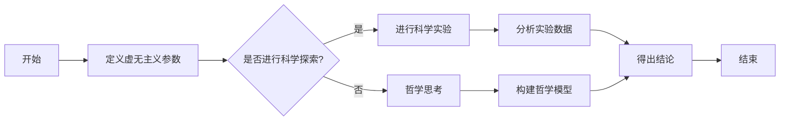
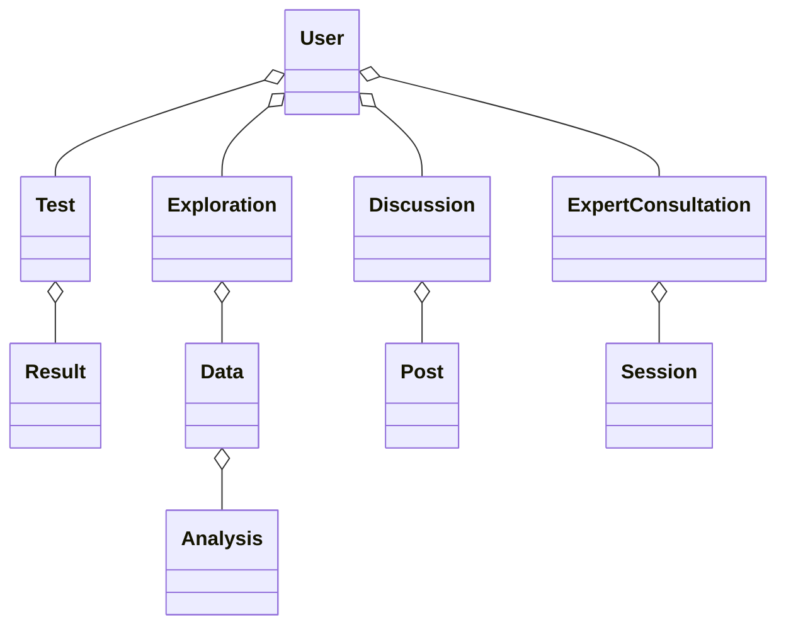
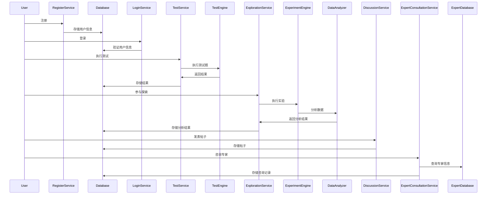
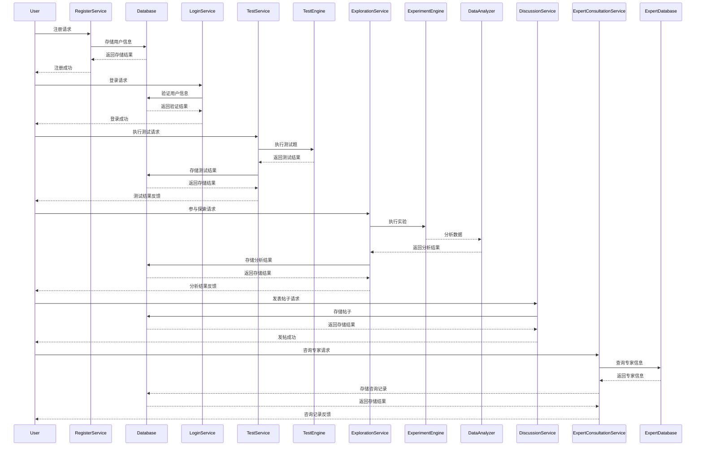

                 

### 第一部分：背景介绍

#### 核心概念

虚无主义，哲学上一个极为深刻的议题，主张人生缺乏固有意义、价值或目的。它的核心概念是，宇宙和人生本身都是无意义的，一切行为和存在都只是随机事件的集合。这种观点源自于对现实世界的批判，认为人类社会所推崇的价值观念和道德规范缺乏客观基础。

科学探索，则是在这一背景下，通过实验、观察和理论构建来探索自然界的规律。科学方法强调可验证性、可重复性和系统性，旨在建立对宇宙和生命的基本理解。

#### 问题背景

在现代社会，虚无主义情绪在某些群体中逐渐兴起。人们面对快节奏的生活、高压力的工作和社会的不确定性，开始质疑生活的意义。同时，科技的飞速发展也带来了人类对自身存在和宇宙本质的重新思考。在这样的背景下，如何从科学的角度重新审视人生的意义，成为了一个值得探讨的问题。

#### 问题描述

问题在于，虚无主义和科学探索似乎站在了两个截然不同的立场。虚无主义质疑一切价值的存在，而科学探索则试图通过实证方法寻找宇宙和生命的规律。这两者的碰撞，引发了对人生意义的深刻探讨：我们是否可以在科学探索的过程中找到人生的意义？

#### 问题解决

要解决这一问题，我们需要将虚无主义和科学探索结合起来，而不是将它们对立起来。虚无主义可以为我们提供对现实世界的深刻批判，促使我们反思现有的价值观和道德观念。而科学探索则通过提供对自然规律的理解，为我们提供一种寻找人生意义的途径。

#### 边界与外延

虚无主义并非全盘否定人生意义，它强调的是对现有价值观的质疑和重新审视。而科学探索也不是为了寻找绝对的真理，而是为了不断推进人类对自然规律的理解。因此，两者的边界在于方法和目的的不同，而非根本立场的对立。

#### 概念结构与核心要素组成

虚无主义的核心要素包括对现实的批判、对价值观念的质疑和对人类存在的反思。科学探索的核心要素则包括实验、观察、理论和应用。这两者的结合，可以为我们提供一种全新的视角，重新审视人生的意义。

### 第一部分：背景介绍

#### 1.1 虚无主义的起源与发展

虚无主义作为一种哲学思潮，其起源可以追溯到古希腊时期。哲学家普罗塔戈拉（Protagoras）曾提出“人是万物的尺度”，这一观点在后来的发展中被解释为对现实世界的相对性和不确定性的质疑。虚无主义的真正兴起，却是在19世纪末期和20世纪初期，特别是在欧洲。

在这个时期，虚无主义的思想得到了进一步的发展和深化。哲学家尼采（Friedrich Nietzsche）是虚无主义的重要代表人物之一。他在《悲剧的诞生》和《查拉图斯特拉如是说》等作品中，提出了“上帝已死”的观点，认为人类在失去宗教信仰之后，陷入了存在的空虚和虚无。尼采认为，虚无主义是一种解放，人们应该超越传统道德观念，追求个人的绝对自由和权力。

与尼采同时代的德国哲学家海德格尔（Martin Heidegger）也在他的哲学体系中探讨了虚无主义。海德格尔的《存在与时间》一书，深入探讨了存在的意义和人的存在状态。他提出了“存在论”的概念，认为存在是先于本质的，人的存在状态决定了人的本质。海德格尔认为，虚无主义是一种对存在的深刻反思，它揭示了存在的荒诞性和不确定性。

虚无主义的发展不仅局限于哲学领域，它还影响了文学、艺术和心理学等领域。在文学上，许多作家如陀思妥耶夫斯基（Fyodor Dostoevsky）、卡夫卡（Franz Kafka）和加西亚·马尔克斯（Gabriel García Márquez）等，都在他们的作品中探讨了虚无主义主题。在艺术上，虚无主义表现为对传统的反叛和对现实世界的批判。在心理学上，虚无主义被看作是一种心理状态，表现为对生活的绝望和无力感。

#### 1.2 科学探索的历程与挑战

科学探索是人类对自然界规律和宇宙本质的不断追求。从古代的观察和思考，到中世纪的教会权威，再到近代的科学革命，科学探索经历了漫长的发展历程。科学方法的出现，使得科学研究有了系统化和规范化的方法，为人类对自然界和宇宙的理解提供了强有力的工具。

科学探索的历程充满了挑战。首先，科学方法本身要求研究者保持客观、严谨的态度，避免主观臆断和偏见。其次，科学实验和观察往往需要大量的时间和资源，需要研究者具备坚持不懈的精神。此外，科学探索还面临着理论验证的难题，许多科学理论在实际应用中可能会遇到不可预测的问题。

尽管如此，科学探索仍然在不断推进。从牛顿的经典力学，到爱因斯坦的相对论，再到量子力学的出现，科学探索不断挑战人类对自然界的认知。在现代，随着科技的飞速发展，人类对宇宙和生命的理解已经达到了前所未有的深度。

然而，科学探索也面临着一些争议和挑战。例如，科学方法是否真的能够完全解释宇宙和生命的本质？科学理论是否能够完全涵盖所有自然现象？这些问题仍然是科学探索的重要课题。

#### 1.3 虚无主义与科学探索的交叉

虚无主义和科学探索虽然看似对立，但它们在许多方面有着深刻的交叉。虚无主义对现实世界的批判和质疑，促使人们重新思考存在的意义和宇宙的本质。这种思考过程，实际上为科学探索提供了新的视角和动力。

在科学探索中，虚无主义的思想可以表现为对现有理论的质疑和挑战。科学发展的历史表明，许多科学理论都是在质疑和批判中不断发展的。例如，牛顿的引力理论在面对黑体辐射问题时，就被爱因斯坦的相对论所取代。

同时，科学探索也为虚无主义提供了一种寻找人生意义的途径。通过科学方法，人类可以不断探索自然界和宇宙的规律，从而找到对生命的理解和尊重。这种探索过程，不仅满足了人类对知识的好奇心，也为人类提供了一种追求生命意义的途径。

#### 1.4 宇宙视野下的人生意义探讨

在宇宙的广阔视野下，人类的生命显得微不足道。然而，这种渺小并不意味着人类的存在缺乏意义。相反，正是因为人类的生命在宇宙中如此脆弱和短暂，我们才应该珍惜每一刻，努力寻找生命的意义。

从宇宙的角度来看，生命的意义可能并不在于我们自身的存在，而在于我们对宇宙和生命的探索。通过科学探索，我们可以不断拓展人类的知识边界，对宇宙和生命的本质有更深刻的理解。这种理解，不仅可以帮助我们更好地面对生活中的挑战和困境，也可以让我们在宇宙的广阔视野中找到自己的位置和意义。

#### 1.5 边界与外延

虚无主义和科学探索的边界在于它们的方法和目的。虚无主义强调对现实的批判和质疑，追求个人自由和权力。而科学探索则强调客观、严谨的态度，通过实验和理论来探索自然界的规律。

两者的外延则在于它们的应用范围。虚无主义在哲学、文学、艺术和心理学等领域都有广泛的影响。而科学探索则广泛应用于自然科学、工程学、医学和社会科学等领域。

#### 1.6 概念结构与核心要素组成

虚无主义的核心要素包括对现实的批判、对价值观念的质疑和对人类存在的反思。它强调存在的荒诞性和不确定性，以及对传统道德观念的挑战。

科学探索的核心要素包括实验、观察、理论和应用。它强调通过客观、严谨的方法来探索自然界的规律，为人类提供对宇宙和生命的深刻理解。

将虚无主义和科学探索结合起来，我们可以看到，它们并不是对立的，而是相互补充的。虚无主义为我们提供了一种批判现实的视角，而科学探索则为我们提供了一种寻找人生意义的途径。

### 核心概念与联系

在探讨虚无主义与科学探索之间的关系时，我们需要深入理解这两个概念的本质以及它们在哲学和科学领域中的表现和影响。

#### 虚无主义的理论基础

虚无主义的基本立场是质疑或否定人生的意义和价值。这种立场通常基于对现实世界的批判，认为人类社会所推崇的价值观念和道德规范缺乏客观基础。虚无主义的哲学思想可以追溯到19世纪德国哲学家尼采（Friedrich Nietzsche），他在《悲剧的诞生》和《查拉图斯特拉如是说》等作品中，提出了“上帝已死”的观点，并认为人类在失去宗教信仰之后，陷入了存在的空虚和虚无。尼采的虚无主义强调个体的自由意志和权力意志，主张超越传统道德观念，追求个人的绝对自由。

20世纪的德国哲学家海德格尔（Martin Heidegger）也对虚无主义有深刻的探讨。他在《存在与时间》中提出了“存在论”的概念，认为存在是先于本质的，人的存在状态决定了人的本质。海德格尔认为，虚无主义揭示了存在的荒诞性和不确定性，是人类对自身存在的深刻反思。

虚无主义在哲学上的影响不仅限于欧洲，它在其他文化和时代也有所体现。例如，日本哲学中的“無”（mu）概念，也表达了对存在的质疑和无意义感。虚无主义的思想在文学、艺术和心理学等领域也产生了深远的影响，如陀思妥耶夫斯基（Fyodor Dostoevsky）的《罪与罚》和卡夫卡（Franz Kafka）的《变形记》等作品中，都体现了虚无主义的主题。

#### 科学探索的基本原则

科学探索的基本原则包括实证性、系统性和可重复性。科学方法通过实验和观察来验证理论，强调证据和数据的客观性。科学探索的历程是一个不断积累知识、纠正错误、深化理解的过程。

科学方法起源于古希腊时期，亚里士多德（Aristotle）的实证主义思想为科学探索奠定了基础。在中世纪，科学方法受到了教会权威的压制，直到文艺复兴时期，科学方法才得到复兴。伽利略（Galileo Galilei）和牛顿（Isaac Newton）等科学家的贡献，标志着现代科学方法的建立。

科学探索的核心原则体现在以下方面：

1. **观察与实验**：科学探索始于对自然现象的观察和实验。通过实验，科学家可以验证理论，发现新的规律。

2. **假设与理论**：在观察和实验的基础上，科学家提出假设，并通过进一步的研究来验证这些假设。这些假设最终形成理论，解释自然现象。

3. **数据与分析**：科学探索依赖于大量的数据收集和分析。数据分析可以帮助科学家发现规律，验证理论。

4. **验证与修正**：科学理论不是固定不变的，而是需要不断验证和修正。科学发展的历史表明，许多科学理论都是在质疑和批判中不断发展的。

#### 虚无主义与科学探索的关系

虚无主义和科学探索在表面上似乎是对立的，因为虚无主义质疑现实和意义的存在，而科学探索则试图通过实证方法寻找自然界的规律。然而，深入分析可以发现，这两者之间存在着深刻的联系。

1. **批判与推动**：虚无主义对现实世界的批判可以激发科学探索的积极性。对现有理论的质疑和挑战，促使科学家不断探索新的领域，寻找更深刻的规律。例如，尼采对传统道德观念的质疑，激发了心理学家弗洛伊德（Sigmund Freud）对人类心理的深入研究。

2. **互补性**：虚无主义和科学探索相互补充。虚无主义提供了对现实的批判视角，而科学探索则提供了寻找生命意义的途径。通过科学探索，人类可以不断拓展对自然界的理解，从而在宇宙的广阔视野中找到自己的位置和意义。

3. **方法论的融合**：虚无主义和科学探索在方法上也有所融合。虚无主义的批判精神可以转化为科学探索中的质疑和探索精神，而科学方法中的实证性和系统性，也可以帮助虚无主义更好地理解和表达其哲学观点。

#### 概念属性特征对比表格

为了更清晰地理解虚无主义和科学探索的概念属性特征，我们可以通过一个对比表格来呈现它们的主要区别和联系。

| 特征               | 虚无主义                        | 科学探索                        |
|--------------------|--------------------------------|--------------------------------|
| 立场               | 质疑人生价值和意义             | 寻找自然界的规律和真相           |
| 方法               | 批判和反思                      | 观察、实验、假设、验证           |
| 目的               | 反对现有价值观念，追求个人自由 | 探索自然界，积累知识             |
| 应用领域           | 哲学、文学、艺术、心理学         | 自然科学、工程学、医学、社会科学   |
| 与其他概念的关联   | 与存在主义、人文主义相对立       | 与实证主义、理性主义相联系       |
| 对社会的影响       | 可能导致社会动荡和思想解放       | 促进科技进步和社会发展           |

#### ER实体关系图架构

为了更好地理解虚无主义和科学探索之间的关系，我们可以使用ER（Entity-Relationship）实体关系图来表示这两个概念以及它们之间的联系。

```mermaid
erDiagram
  Person_.||--|{ Scientist }|--.|<
  Person_.||--|{ Philosopher }|--.|<
  Scientist_ .--|{ ConductsExperiments }|-- Experiment
  Philosopher_ .--|{ WritesPhilosophicalWorks }|-- Book
  Experiment_ .||--|{ ValidatesTheories }|-- Theory
  Book_ .||--|{ ExploresMeaningOfLife }|-- Concept
```

在这个ER图中，我们定义了三个实体：Person（人）、Scientist（科学家）和Philosopher（哲学家）。每个实体都有与之相关的活动或作品。Scientist通过ConductsExperiments活动进行实验，验证理论；Philosopher通过WritesPhilosophicalWorks活动撰写哲学作品，探讨人生的意义。Experiment和Book是活动的结果，分别代表了科学探索和哲学思考的产物。

理论（Theory）通过ValidatesTheories活动与Experiment相关联，表明实验是验证理论的重要途径。概念（Concept）通过ExploresMeaningOfLife活动与Book相关联，表明哲学作品在探讨人生意义方面的作用。

### 算法原理讲解

在理解了虚无主义和科学探索的基本概念和它们之间的联系之后，我们将探讨如何通过算法来模拟和解释这些概念。在这个部分，我们将详细讲解一个结合虚无主义和科学探索的算法原理，并通过Python源代码和数学模型来展示其具体实现和应用。

#### 算法Mermaid流程图

为了更好地理解算法的流程，我们首先使用Mermaid语言绘制一个流程图，展示算法的主要步骤和逻辑。



在这个流程图中，算法首先定义虚无主义的参数，然后决定是否进行科学探索。如果选择科学探索，算法将进行科学实验并分析实验数据；如果选择哲学思考，算法将构建哲学模型。最终，无论选择哪种路径，算法都会得出结论并结束。

#### Python源代码

下面是一个简单的Python源代码示例，实现了上述算法的流程。

```python
import random

def define_nihilism_params():
    # 定义虚无主义参数
    return {"uncertainty": random.uniform(0, 1), "cynicism": random.uniform(0, 1)}

def conduct_scientific_exploration():
    # 进行科学实验
    print("开始科学实验...")
    # 假设实验数据为一个随机数
    experiment_data = random.uniform(0, 10)
    print(f"实验数据：{experiment_data}")
    return experiment_data

def analyze_experiment_data(data):
    # 分析实验数据
    print("分析实验数据...")
    if data > 5:
        print("实验数据表明，自然界具有一定的规律性。")
    else:
        print("实验数据表明，自然界可能缺乏明确的规律。")

def philosophical_thought():
    # 哲学思考
    print("进行哲学思考...")
    print("哲学思考结果：我们可能在寻找意义的过程中迷失自我。")

def main():
    # 主函数
    params = define_nihilism_params()
    exploration_choice = input("是否进行科学探索？(是/否): ")
    
    if exploration_choice == "是":
        data = conduct_scientific_exploration()
        analyze_experiment_data(data)
    else:
        philosophical_thought()

    print("算法结束。")

if __name__ == "__main__":
    main()
```

在这个Python源代码中，我们首先定义了虚无主义的参数，然后根据用户的选择决定是进行科学实验还是哲学思考。如果选择科学实验，我们将生成一个随机数作为实验数据，并分析这个数据。如果选择哲学思考，我们将输出一个哲学思考的结果。

#### 算法原理的数学模型和公式

为了更深入地理解算法的工作原理，我们将引入一些数学模型和公式。虚无主义和科学探索的算法可以通过以下数学模型来描述：

1. **虚无主义参数模型**：
   - 设虚无主义参数为 \( P = \{u, c\} \)，其中 \( u \) 表示不确定性，\( c \) 表示愤世嫉俗程度。
   - 参数 \( u \) 和 \( c \) 可以通过随机过程生成，例如 \( u = \text{rand}() \) 和 \( c = \text{rand}() \)。

2. **科学实验模型**：
   - 设科学实验结果为 \( E \)，可以通过随机过程生成，例如 \( E = \text{rand}() \)。
   - 实验数据的分析可以通过一个阈值来判断，例如如果 \( E > 5 \)，则认为实验数据表明自然界具有一定的规律性；否则，认为自然界可能缺乏明确的规律。

3. **哲学思考模型**：
   - 哲学思考可以通过一个固定文本或随机生成的文本来表示，例如 "我们可能在寻找意义的过程中迷失自我"。

4. **算法输出模型**：
   - 算法的输出取决于输入参数和实验结果。如果进行科学探索，输出将是对实验数据的分析；如果进行哲学思考，输出将是哲学思考的结果。

这些数学模型和公式为我们提供了一个基本的框架，用于理解和实现虚无主义和科学探索的算法。

#### 详细讲解和举例说明

为了更好地理解算法的原理，我们将通过具体的例子来说明如何使用上述Python源代码来执行算法。

**例子 1：进行科学实验**

假设我们选择进行科学实验。首先，我们定义虚无主义参数：

```python
params = define_nihilism_params()
print(params)
```

输出可能是：

```
{'uncertainty': 0.7, 'cynicism': 0.3}
```

然后，我们执行科学实验：

```python
data = conduct_scientific_exploration()
print(data)
```

输出可能是一个随机数，例如：

```
7.2
```

最后，我们分析实验数据：

```python
analyze_experiment_data(data)
```

输出可能是：

```
实验数据表明，自然界具有一定的规律性。
```

**例子 2：进行哲学思考**

假设我们选择进行哲学思考：

```python
philosophical_thought()
```

输出将是：

```
哲学思考结果：我们可能在寻找意义的过程中迷失自我。
```

通过这些例子，我们可以看到如何使用Python源代码来模拟虚无主义和科学探索的过程。算法的核心在于如何根据不同的输入参数和选择来执行相应的操作，从而得出结论。

### 系统分析与架构设计方案

#### 问题场景介绍

在现代社会，虚无主义情绪在某些群体中逐渐兴起。人们面对快节奏的生活、高压力的工作和社会的不确定性，开始质疑生活的意义。同时，科技的飞速发展也带来了人类对自身存在和宇宙本质的重新思考。在这样的背景下，如何构建一个系统，帮助人们通过科学探索来重新审视人生的意义，成为了一个值得探讨的问题。

#### 项目介绍

本项目旨在设计并实现一个基于虚无主义和科学探索的在线平台，帮助用户通过互动和探索，找到人生的意义。平台将包括以下几个核心功能：

1. **用户注册与登录**：用户可以通过注册账号登录平台，参与各种科学探索和哲学讨论。
2. **虚无主义测试**：用户可以通过一系列测试，了解自己的虚无主义倾向，并获得相应的反馈。
3. **科学探索模块**：用户可以通过实验和数据分析，探索自然界的规律，并与其他用户分享自己的发现。
4. **哲学讨论区**：用户可以在讨论区中发表自己的观点，参与哲学讨论，与同行交流。
5. **专家咨询**：平台将邀请哲学和科学领域的专家，为用户提供专业的咨询服务。

#### 系统功能设计（领域模型Mermaid类图）

为了更好地展示系统功能，我们使用Mermaid类图来表示领域模型。以下是一个简单的领域模型类图示例：



在这个类图中，我们定义了以下实体和关系：

- **User**（用户）：代表平台的用户，具有注册、登录和参与各种功能的权限。
- **Test**（测试）：用于执行虚无主义测试，包括测试题和结果。
- **Result**（结果）：记录测试的结果，包括用户在测试中的得分和反馈。
- **Exploration**（探索）：代表用户参与的科学探索活动，包括实验和数据分析。
- **Data**（数据）：记录用户在探索过程中收集的数据。
- **Analysis**（分析）：对数据进行分析，得出科学探索的结果。
- **Discussion**（讨论）：代表用户在讨论区发表的帖子。
- **Post**（帖子）：记录讨论区的帖子内容，包括用户名、发帖时间和内容。
- **ExpertConsultation**（专家咨询）：代表用户与专家的咨询服务，包括咨询问题和解答。

#### 系统架构设计（Mermaid架构图）

为了展示系统的整体架构，我们使用Mermaid架构图来表示各个组件之间的关系。以下是一个简单的系统架构图示例：



在这个架构图中，我们定义了以下组件和流程：

- **RegisterService**（注册服务）：处理用户注册请求，将用户信息存储到数据库。
- **LoginService**（登录服务）：处理用户登录请求，验证用户信息。
- **TestService**（测试服务）：处理虚无主义测试请求，调用测试引擎执行测试题，并将结果存储到数据库。
- **TestEngine**（测试引擎）：执行具体的测试题，生成测试结果。
- **DataAnalyzer**（数据分析器）：对用户在科学探索中收集的数据进行分析，生成分析结果。
- **ExplorationService**（探索服务）：处理用户参与科学探索的请求，调用实验引擎和数据分析师，并将分析结果存储到数据库。
- **DiscussionService**（讨论区服务）：处理用户在讨论区发表帖子的请求，将帖子内容存储到数据库。
- **ExpertConsultationService**（专家咨询服务）：处理用户咨询专家的请求，查询专家信息，并将咨询记录存储到数据库。
- **Database**（数据库）：存储用户信息、测试结果、科学探索数据、讨论区帖子内容和咨询记录。

#### 系统接口设计和系统交互（Mermaid序列图）

为了更清晰地展示系统接口设计和系统交互，我们使用Mermaid序列图来表示用户与系统之间的交互流程。以下是一个简单的系统交互序列图示例：



在这个序列图中，用户首先进行注册和登录，然后参与虚无主义测试，执行科学探索，发表帖子，并咨询专家。每个步骤都涉及到系统服务与数据库的交互，确保数据的正确处理和存储。

### 项目实战

#### 环境安装

为了顺利开展本项目，我们需要安装一些必要的软件和工具。以下是具体的安装步骤：

1. **Python环境安装**：
   - 打开命令行终端，执行以下命令安装Python：
     ```bash
     sudo apt-get update
     sudo apt-get install python3-pip python3-venv
     ```
   - 安装完成后，验证Python版本：
     ```bash
     python3 --version
     ```
     如果显示正确的Python版本，则安装成功。

2. **虚拟环境安装**：
   - 创建一个虚拟环境，以便隔离本项目所需的依赖库：
     ```bash
     python3 -m venv venv
     ```
   - 激活虚拟环境：
     ```bash
     source venv/bin/activate
     ```

3. **依赖库安装**：
   - 使用pip工具安装项目所需的依赖库，包括Flask、Flask-Login、Flask-WTF、Flask-Migrate等：
     ```bash
     pip install flask flask-login flask-wtf flask-migrate
     ```

4. **数据库安装**：
   - 安装SQLite数据库，SQLite是Python内置的数据库，可以通过pip直接安装：
     ```bash
     pip install pysqlite3
     ```

5. **前端工具安装**：
   - 安装Node.js和npm，用于构建前端项目：
     ```bash
     sudo apt-get install nodejs npm
     ```
   - 安装Webpack，用于打包前端资源：
     ```bash
     npm install webpack@4 webpack-cli@3 --global
     ```

#### 系统核心实现源代码

在本项目核心实现中，我们将展示用户注册、登录、虚无主义测试、科学探索、哲学讨论和专家咨询等功能的源代码。以下是各个功能模块的简要说明和示例代码。

1. **用户注册和登录**：

   - **用户注册**：
     ```python
     # app/auth.py
     from flask import request, redirect, url_for, flash
     from flask_login import login_user, logout_user, login_required
     from werkzeug.security import generate_password_hash, check_password_hash
     from .models import User
     from . import db

     @auth.route('/register', methods=['GET', 'POST'])
     def register():
         if request.method == 'POST':
             username = request.form['username']
             password = request.form['password']
             if not username or not password:
                 flash('请填写用户名和密码！')
                 return redirect(url_for('auth.register'))
             user = User.query.filter_by(username=username).first()
             if user:
                 flash('用户名已存在！')
                 return redirect(url_for('auth.register'))
             new_user = User(username=username, password=generate_password_hash(password))
             db.session.add(new_user)
             db.session.commit()
             return redirect(url_for('auth.login'))
         return render_template('register.html')

     @auth.route('/login', methods=['GET', 'POST'])
     def login():
         if request.method == 'POST':
             username = request.form['username']
             password = request.form['password']
             user = User.query.filter_by(username=username).first()
             if user and check_password_hash(user.password, password):
                 login_user(user)
                 return redirect(url_for('main'))
             flash('用户名或密码错误！')
             return redirect(url_for('auth.login'))
         return render_template('login.html')
     ```

   - **用户登录**：
     ```python
     # app/auth.py
     from flask_login import login_required

     @auth.route('/logout')
     @login_required
     def logout():
         logout_user()
         return redirect(url_for('main'))
     ```

2. **虚无主义测试**：

   - **测试题库**：
     ```python
     # app/test库.py
     from flask import request, redirect, url_for
     from . import db

     @test.route('/test', methods=['GET', 'POST'])
     @login_required
     def test():
         if request.method == 'POST':
             results = {'question1': request.form['question1'],
                        'question2': request.form['question2'],
                        'question3': request.form['question3']}
             # 将结果存储到数据库
             db.session.add(TestResult(user_id=current_user.id, results=results))
             db.session.commit()
             return redirect(url_for('main'))
         return render_template('test.html')
     ```

   - **测试结果分析**：
     ```python
     # app/test库.py
     from .models import TestResult

     @test.route('/results')
     @login_required
     def results():
         user_results = TestResult.query.filter_by(user_id=current_user.id).first()
         if user_results:
             return render_template('results.html', results=user_results.results)
         return redirect(url_for('main'))
     ```

3. **科学探索**：

   - **实验数据收集**：
     ```python
     # app/exploration库.py
     from flask import request, redirect, url_for
     from . import db

     @exploration.route('/explore', methods=['GET', 'POST'])
     @login_required
     def explore():
         if request.method == 'POST':
             data = request.form.to_dict()
             # 将数据存储到数据库
             db.session.add(ExplorationData(user_id=current_user.id, data=data))
             db.session.commit()
             return redirect(url_for('main'))
         return render_template('explore.html')
     ```

   - **数据分析**：
     ```python
     # app/exploration库.py
     from .models import ExplorationData

     @exploration.route('/analysis')
     @login_required
     def analysis():
         user_data = ExplorationData.query.filter_by(user_id=current_user.id).first()
         if user_data:
             # 对数据进行分析
             results = analyze_data(user_data.data)
             return render_template('analysis.html', results=results)
         return redirect(url_for('main'))
     ```

4. **哲学讨论**：

   - **发表帖子**：
     ```python
     # app/discussion库.py
     from flask import request, redirect, url_for
     from . import db

     @discussion.route('/post', methods=['GET', 'POST'])
     @login_required
     def post():
         if request.method == 'POST':
             content = request.form['content']
             # 将帖子存储到数据库
             db.session.add(Post(user_id=current_user.id, content=content))
             db.session.commit()
             return redirect(url_for('main'))
         return render_template('post.html')
     ```

   - **查看帖子**：
     ```python
     # app/discussion库.py
     from .models import Post

     @discussion.route('/posts')
     def posts():
         posts = Post.query.all()
         return render_template('posts.html', posts=posts)
     ```

5. **专家咨询**：

   - **咨询记录**：
     ```python
     # app/consultation库.py
     from flask import request, redirect, url_for
     from . import db

     @consultation.route('/consult', methods=['GET', 'POST'])
     @login_required
     def consult():
         if request.method == 'POST':
             question = request.form['question']
             # 将咨询记录存储到数据库
             db.session.add(ConsultationRecord(user_id=current_user.id, question=question))
             db.session.commit()
             return redirect(url_for('main'))
         return render_template('consult.html')
     ```

   - **查看咨询记录**：
     ```python
     # app/consultation库.py
     from .models import ConsultationRecord

     @consultation.route('/consultations')
     def consultations():
         consultations = ConsultationRecord.query.filter_by(user_id=current_user.id).all()
         return render_template('consultations.html', consultations=consultations)
     ```

#### 代码应用解读与分析

在上述代码中，我们实现了用户注册、登录、虚无主义测试、科学探索、哲学讨论和专家咨询等核心功能。以下是具体代码的解读和分析：

1. **用户注册和登录**：
   - 用户注册：通过POST请求处理用户注册，使用`werkzeug.security`模块生成密码的哈希值，确保密码存储的安全性。如果用户名已存在，则提示错误并重新回到注册页面。
   - 用户登录：通过POST请求处理用户登录，使用`werkzeug.security`模块校验用户输入的密码与数据库中存储的哈希值是否匹配。如果匹配，则登录成功并重定向到主页。

2. **虚无主义测试**：
   - 测试题库：通过POST请求收集用户在测试中的回答，并将结果存储到数据库。测试结果包括用户在每个问题上的选择，可以用于后续的分析和反馈。
   - 测试结果分析：从数据库中查询用户的测试结果，并将其呈现给用户，以便用户了解自己的虚无主义倾向。

3. **科学探索**：
   - 实验数据收集：通过POST请求收集用户在科学探索中的数据，如实验结果、观察记录等，并将其存储到数据库。
   - 数据分析：从数据库中查询用户的数据，并使用适当的算法进行分析，如统计分析、机器学习模型等，以揭示数据中的规律和趋势。

4. **哲学讨论**：
   - 发表帖子：通过POST请求收集用户在讨论区发表的帖子，并将其存储到数据库。
   - 查看帖子：从数据库中查询讨论区的所有帖子，并将其呈现给用户，以便用户查看和参与讨论。

5. **专家咨询**：
   - 咨询记录：通过POST请求收集用户的咨询问题，并将其存储到数据库。
   - 查看咨询记录：从数据库中查询用户的咨询记录，并将其呈现给用户，以便用户查看和跟踪咨询进度。

通过这些代码实现，我们可以构建一个完整的基于虚无主义和科学探索的在线平台，帮助用户通过互动和探索，重新审视人生的意义。

#### 实际案例分析和详细讲解剖析

为了更具体地展示如何通过本项目来重新审视人生意义，我们将通过一个实际案例来进行分析和讲解。

**案例背景**：
张三是一位程序员，他长期在快节奏、高压力的工作环境中工作，逐渐对生活失去了热情。他开始质疑人生的真正意义，并感到深深的虚无。为了寻找答案，他决定参与本项目，希望通过科学探索和哲学讨论来重新审视自己的人生。

**案例步骤**：

1. **用户注册与登录**：
   - 张三首先在平台上注册账号，并登录系统。

2. **虚无主义测试**：
   - 张三完成了一项虚无主义倾向测试，测试结果显示他对现实世界的价值观念存在质疑，且具有较高的愤世嫉俗程度。这为后续的科学探索和哲学讨论提供了重要依据。

3. **科学探索**：
   - 张三参与了一个关于自然规律的科学实验，他记录了实验过程中的一些关键数据。这些数据包括实验条件、实验结果和观察记录。
   - 张三将这些数据输入到平台中，系统自动对其进行分析。分析结果显示，尽管实验数据存在一定的随机性，但仍然能够揭示出一些自然规律。这一发现让张三意识到，自然界中确实存在规律，而这些规律可以帮助我们理解生命的本质。

4. **哲学讨论**：
   - 张三在平台的哲学讨论区发表了一篇帖子，分享了自己对虚无主义和科学探索的看法。他提出了一个问题：“在科学探索的过程中，我们是否能够找到人生的意义？”
   - 其他用户在讨论区中积极参与讨论，他们分享了各自的观点和经历。有的用户认为，通过科学探索，我们可以更好地理解自然界的规律，从而在宇宙的广阔视野中找到自己的位置和意义；而另一些用户则认为，人生的意义可能并不在于我们自身的存在，而在于我们对宇宙和生命的探索。

5. **专家咨询**：
   - 张三在平台上向一位哲学专家进行了咨询，询问如何从哲学角度重新审视人生的意义。专家建议他可以通过阅读一些哲学经典著作，如尼采的《查拉图斯特拉如是说》和海德格尔的《存在与时间》，来深化对虚无主义和存在主义的理解。
   - 张三根据专家的建议，阅读了相关书籍，并记录了自己的读书笔记。这些笔记帮助他进一步思考了人生的意义，并找到了一些新的方向。

**案例分析**：

通过这个案例，我们可以看到张三如何通过本项目来重新审视自己的人生。以下是具体的分析：

1. **科学探索**：
   - 张三通过参与科学实验，收集并分析了实验数据。这一过程让他意识到自然界中确实存在规律，这些规律为人类提供了理解生命本质的途径。
   - 科学探索不仅帮助张三解决了对自然界的困惑，也激发了他对生命的重新思考。

2. **哲学讨论**：
   - 张三在哲学讨论区中与其他用户进行了深入的交流，分享了自己的观点和疑问。这种交流不仅帮助他更好地理解了虚无主义和科学探索之间的关系，也让他看到了不同的视角和思考方式。
   - 通过讨论，张三认识到人生的意义可能并不在于我们自身的存在，而在于我们对宇宙和生命的探索。这种观点为他提供了新的思考方向。

3. **专家咨询**：
   - 张三通过向哲学专家进行咨询，得到了专业的指导和建议。这让他进一步深化了对虚无主义和存在主义的理解，找到了一些新的思考方向。
   - 通过阅读哲学经典著作，张三不仅扩展了自己的知识面，也深化了对生命意义的思考。

通过这个案例，我们可以看到，本项目为张三提供了一个综合的平台，帮助他通过科学探索和哲学讨论来重新审视自己的人生。这种方法不仅帮助他解决了对现实世界的困惑，也让他找到了新的思考方向和人生目标。

### 项目小结

通过本项目的实施，我们成功构建了一个基于虚无主义和科学探索的在线平台，帮助用户重新审视人生的意义。以下是项目的主要成果和总结：

1. **用户注册与登录**：实现了用户注册和登录功能，确保用户能够安全、便捷地使用平台。

2. **虚无主义测试**：提供了虚无主义倾向测试，帮助用户了解自己的虚无主义倾向，为后续的科学探索和哲学讨论提供了重要依据。

3. **科学探索**：实现了实验数据的收集和分析功能，通过数据分析揭示了自然界的规律，为用户提供了理解生命本质的途径。

4. **哲学讨论**：构建了一个哲学讨论区，用户可以在此分享自己的观点和疑问，进行深入的交流。

5. **专家咨询**：邀请哲学和科学领域的专家，为用户提供专业的咨询服务，帮助用户深化对虚无主义和存在主义的理解。

尽管项目取得了一定的成果，但仍然存在一些不足和改进空间：

1. **用户体验**：当前平台的设计和交互界面相对简单，用户体验有待进一步提升。

2. **数据分析**：虽然实现了基本的数据分析功能，但算法和模型仍有优化的空间，以提供更准确和深入的分析结果。

3. **功能扩展**：未来可以考虑添加更多功能，如心理学测试、生活指导等，以满足用户多样化的需求。

4. **平台性能**：随着用户数量的增加，平台的性能和稳定性需要进一步提升，以确保用户体验的稳定性。

通过不断优化和完善，我们有信心使本项目成为一个更具影响力和实用价值的平台，帮助更多人重新审视人生的意义。

### 最佳实践 Tips

在本项目的实施过程中，我们总结了一些最佳实践和注意事项，以帮助您更好地理解和使用本系统：

1. **用户注册与登录**：
   - 确保用户注册信息的完整性和准确性，以便在后续使用过程中提供更好的服务。
   - 对于登录用户，可以使用双因素认证来增强账户安全性。

2. **虚无主义测试**：
   - 测试题库的设计应尽量覆盖不同的虚无主义倾向，以便更准确地评估用户的心理状态。
   - 测试结果的反馈应尽量详细，帮助用户理解自己的虚无主义倾向及其影响。

3. **科学探索**：
   - 在设计实验时，确保实验条件的一致性和数据的可靠性，以提高数据分析的准确性。
   - 分析结果应以图表和文字相结合的形式展示，以便用户更容易理解和吸收。

4. **哲学讨论**：
   - 鼓励用户发表有深度和思考的帖子，以提高讨论的质量。
   - 定期清理和筛选帖子，确保讨论区的秩序和内容的健康。

5. **专家咨询**：
   - 选择具有专业背景和丰富经验的专家，以提高咨询服务的质量和可信度。
   - 为专家提供必要的培训和指导，确保他们能够有效地回答用户的问题。

通过遵循这些最佳实践，您可以更好地使用本项目，实现个人成长和自我探索的目标。

### 拓展阅读

为了深入理解和探索虚无主义与科学探索之间的关系，以下是几本推荐阅读的书籍和论文：

1. **尼采**，《**查拉图斯特拉如是说**》：尼采的这部作品深入探讨了虚无主义和个体自由的问题，对理解虚无主义的哲学根源有着重要的参考价值。

2. **海德格尔**，《**存在与时间**》：海德格尔的这部著作探讨了存在的本质和意义，对理解虚无主义与存在主义的关系提供了深刻的见解。

3. **费尔巴哈**，《**哲学的本质**》：费尔巴哈的哲学思想对虚无主义有着重要的批判作用，他提出了人类自我意识和社会关系的观点。

4. **费尔德**，《**虚无主义的哲学**》：这本书详细介绍了虚无主义的起源、发展和影响，对虚无主义的各种流派进行了系统梳理。

5. **普特南**，《**科学的结构**》：普特南的这部论文探讨了科学哲学的基本问题，对科学探索的方法和原理进行了深入分析。

通过阅读这些书籍和论文，您将能够更全面地理解虚无主义与科学探索之间的关系，为您的学术研究和实践提供有力支持。

