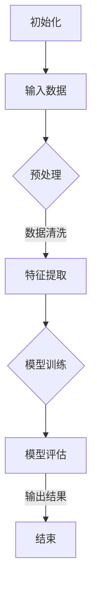
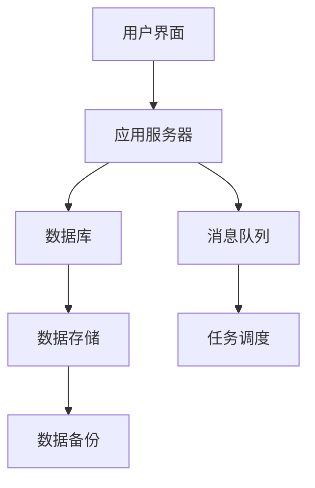
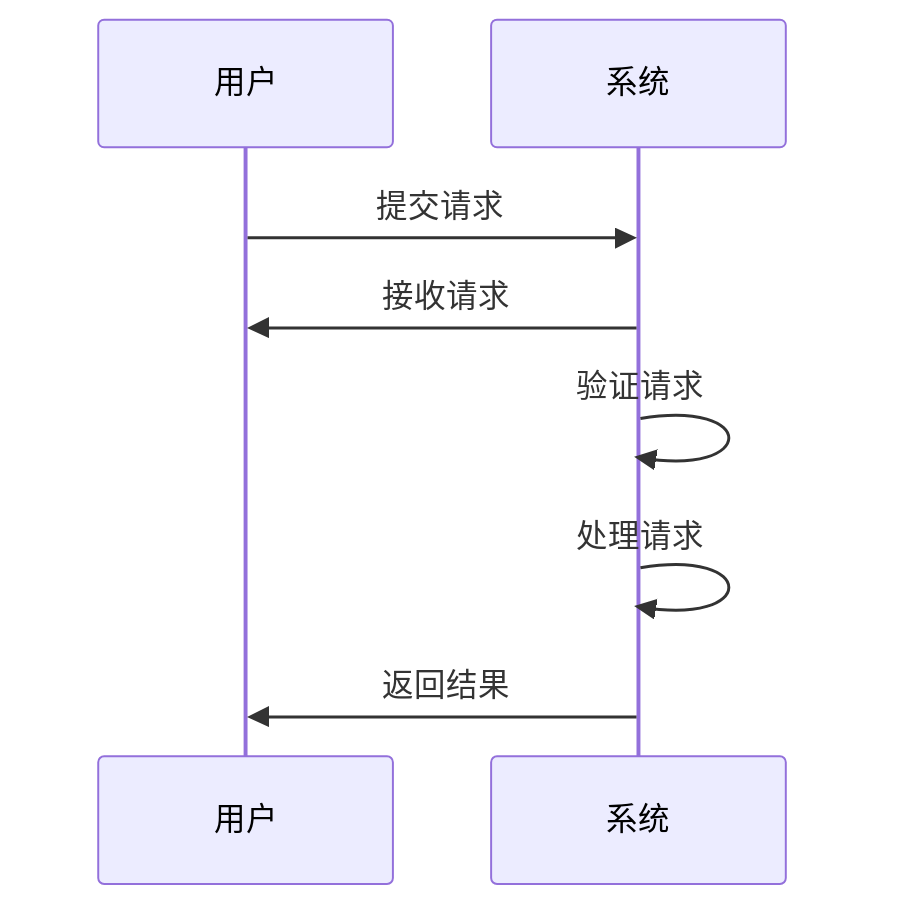

                 

### 虚无主义与终身学习：在知识探索中找寻人生意义

关键词：虚无主义、终身学习、人生意义、知识探索

摘要：本文将探讨虚无主义与终身学习的关系，通过分析虚无主义的起源、影响和表现形式，结合终身学习的方法与路径，阐述如何通过终身学习在知识探索中找寻人生意义。文章旨在为读者提供一种新的视角，帮助他们在面对现代社会的挑战时，找到内心的平静与方向。

---

### 目录大纲

1. **第一部分：虚无主义与终身学习的背景与意义**
    1.1 背景介绍
    1.2 虚无主义的起源与发展
    1.3 虚无主义对社会和个人生活的影响
    1.4 终身学习的理念与价值
    1.5 虚无主义与终身学习的关系
    
2. **第二部分：虚无主义的本质与表现**
    2.1 虚无主义的核心概念
    2.2 虚无主义的表现形式
    2.3 虚无主义与唯意志主义、存在主义等的区别
    
3. **第三部分：终身学习的方法与路径**
    3.1 终身学习的基本原则
    3.2 终身学习中的挑战与应对
    3.3 终身学习的实践案例
    
4. **第四部分：在终身学习中找寻人生意义**
    4.1 终身学习与人生意义的关联
    4.2 终身学习中的自我反思与成长
    4.3 终身学习的最佳实践与启示
    
5. **第五部分：未来的虚无主义与终身学习**
    5.1 当下的虚无主义与终身学习趋势
    5.2 未来展望
    
6. **第六部分：附录**
    6.1 参考文献
    6.2 附录A：核心概念原理对比表格
    6.3 附录B：ER实体关系图架构的 Mermaid 流程图
    6.4 附录C：算法原理 Mermaid 流程图
    6.5 附录D：系统架构设计 Mermaid 架构图
    6.6 附录E：系统接口设计和系统交互 Mermaid 序列图
    6.7 附录F：学习资源推荐
    6.8 附录G：终身学习与虚无主义主题研讨会记录

---

接下来，我们将逐步深入探讨虚无主义与终身学习的关系，帮助读者理解这两个概念如何相互作用，以及如何在知识探索中找寻人生意义。让我们一步步思考，以逻辑清晰、结构紧凑的方式展开这场思想之旅。

---

## 第一部分：虚无主义与终身学习的背景与意义

### 1.1 背景介绍

虚无主义是一种哲学思潮，其核心观点是认为世界和生命缺乏固有的意义、目的和内在价值。虚无主义的起源可以追溯到古希腊哲学家赫拉克利特和尼采等人的思想。在现代社会，虚无主义的影响愈加显著，尤其是在经历了两次世界大战、经济危机和技术革命之后，人们对传统价值观的认同感逐渐减弱，出现了强烈的虚无感和迷茫感。

终身学习是一种持续不断的学习过程，旨在提升个人的知识、技能和素质，以适应快速变化的社会和工作环境。终身学习不仅仅是一种教育理念，更是一种生活方式。它要求人们时刻保持学习的心态，不断充实自己，以应对未来的挑战。

### 1.2 虚无主义的起源与发展

虚无主义最早的起源可以追溯到古希腊哲学家赫拉克利特，他提出了“万物流转”的观点，认为世界是无常的，没有任何固定不变的本质。这种思想在后来的尼采哲学中得到了进一步的发展。尼采认为，传统的道德观念和价值观已经失去了意义，人类需要通过自我超越，创造自己的价值。

在20世纪，虚无主义在文学、艺术和哲学领域得到了广泛的关注。法国哲学家萨特的存在主义哲学强调个人自由和选择的本质，但同时也揭示了存在的荒谬和无意义。这些思想对现代社会的文化和心理产生了深远的影响。

### 1.3 虚无主义对社会和个人生活的影响

虚无主义对社会和个人生活的影响是多方面的。在社会层面，虚无主义可能导致道德滑坡、社会责任感下降和社会信任缺失。在个人层面，虚无主义可能导致心理问题，如抑郁、焦虑和无意义感。

虚无主义对人们的生活方式产生了深远的影响。许多人开始质疑传统的价值观和生活方式，追求个性化和自由，但同时也感到迷茫和孤独。这种矛盾的心态使人们更加需要寻找新的价值和意义。

### 1.4 终身学习的理念与价值

终身学习是一种不断追求知识和技能的学习过程，其价值在于：

1. **适应变化**：社会和科技的发展速度越来越快，终身学习可以帮助人们不断更新知识和技能，以适应新的工作环境和挑战。

2. **个人成长**：通过不断学习，人们可以提升自我认知，增强自信心，实现个人价值和成就。

3. **社会贡献**：终身学习不仅可以提升个人素质，还可以为社会的发展和进步做出贡献。

### 1.5 虚无主义与终身学习的关系

虚无主义和终身学习之间的关系是复杂而微妙的。一方面，虚无主义可能导致人们失去学习的动力和目标，从而阻碍终身学习的发展。另一方面，终身学习可以为人们提供新的意义和方向，缓解虚无主义的困境。

通过终身学习，人们可以不断探索新的知识和领域，发现自己的兴趣和潜能，从而克服虚无主义的消极影响。终身学习不仅是一种学习过程，更是一种生活方式和价值观，它可以帮助人们在知识探索中找寻人生的意义。

---

在下一部分中，我们将深入探讨虚无主义的本质与表现，帮助读者理解这一哲学思潮的核心概念和影响。

---

## 第二部分：虚无主义的本质与表现

### 2.1 虚无主义的核心概念

虚无主义的核心概念是认为世界和生命缺乏固有的意义、目的和内在价值。虚无主义的基本原理包括以下几个方面：

1. **无意义性**：虚无主义认为世界是荒诞的，生命本身没有意义，人们的行为和选择都是无目的的。

2. **非决定论**：虚无主义主张自由意志的存在，认为人类行为不受决定论的限制，每个人都有选择自己生活方式的自由。

3. **反理性主义**：虚无主义认为理性不能解决生命的根本问题，因此反对过分依赖理性来解释世界和人生。

### 2.2 虚无主义的主要流派

虚无主义可以分为多个流派，其中最著名的包括：

1. **存在主义虚无主义**：存在主义虚无主义强调个人的自由和选择，认为人的存在先于其本质，每个人都必须为自己创造意义。

2. **道德虚无主义**：道德虚无主义认为道德观念是主观的，没有客观的道德标准，因此道德行为也没有意义。

3. **技术虚无主义**：技术虚无主义认为技术发展导致人类失去了对自然的敬畏和控制，从而失去了生命的意义。

### 2.3 虚无主义与唯意志主义、存在主义等的区别

虚无主义与唯意志主义、存在主义等哲学思潮存在一定的区别：

1. **与唯意志主义**：唯意志主义认为世界是意志的体现，而虚无主义则认为世界和生命缺乏固有的意义。

2. **与存在主义**：存在主义强调个人自由和选择的本质，而虚无主义则认为人的自由选择仍然是无意义的。

3. **与理性主义**：理性主义认为理性是人类认知世界的基础，而虚无主义则认为理性不能解决生命的根本问题。

通过对比虚无主义与其他哲学思潮的不同，我们可以更好地理解虚无主义的本质和影响。

### 2.4 虚无主义的表现形式

虚无主义在社会和个人生活中有多种表现形式：

1. **心理层面的虚无感**：许多人会感到生活缺乏意义，对未来的期望和梦想变得模糊，甚至出现抑郁和焦虑。

2. **社会现象中的虚无主义**：社会上的道德滑坡、信任缺失和个体主义的兴起都是虚无主义在社会层面的体现。

3. **文学、艺术中的虚无主义**：许多文学作品和艺术作品都反映了虚无主义的思想，如卡夫卡的《变形记》、陀思妥耶夫斯基的《罪与罚》等。

虚无主义不仅影响了人们的心理状态，还对社会的文化氛围和价值观产生了深远的影响。通过了解虚无主义的表现形式，我们可以更好地理解这一哲学思潮的复杂性。

---

在下一部分中，我们将探讨终身学习的方法与路径，帮助读者了解如何通过终身学习缓解虚无主义的困境。

---

## 第三部分：终身学习的方法与路径

### 3.1 终身学习的基本原则

终身学习是一种持续不断的学习过程，其基本原则包括：

1. **主动性**：终身学习要求人们主动参与学习过程，而不是被动接受知识。

2. **系统性**：终身学习应具有系统性，涵盖各个领域和层次的知识。

3. **灵活性**：终身学习应具备灵活性，以适应不同学习者的需求和环境。

4. **持续性**：终身学习应贯穿个人的一生，而不是仅仅在特定阶段。

5. **实践性**：终身学习应注重实践，将理论知识应用于实际工作中。

### 3.2 终身学习的方法与技巧

终身学习的方法和技巧多种多样，以下是一些常见的方法：

1. **自主学习**：自主学习是终身学习的基础，要求学习者主动寻找学习资源，制定学习计划，并进行自我评估。

2. **在线学习**：随着互联网技术的发展，在线学习成为终身学习的重要途径。学习者可以通过在线课程、论坛和社交媒体等平台获取知识和交流经验。

3. **合作学习**：合作学习可以激发学习者的学习兴趣和动力，通过小组讨论、项目合作等方式提高学习效果。

4. **实践应用**：将理论知识应用于实际工作中，可以加深对知识的理解和掌握。

5. **反思与总结**：定期进行学习反思和总结，可以帮助学习者发现学习中的问题和不足，及时调整学习策略。

### 3.3 终身学习的态度与心态

终身学习不仅是一种知识和技能的获取过程，更是一种态度和心态的塑造过程。以下是一些终身学习所需的态度和心态：

1. **积极进取**：保持积极向上的心态，勇于面对挑战和困难。

2. **好奇心**：对未知保持好奇心，不断探索新的领域和知识。

3. **耐心和毅力**：终身学习需要耐心和毅力，面对困难和挫折时不放弃。

4. **自我激励**：通过设定目标、奖励自己等方式，保持学习的动力。

5. **开放和包容**：对不同观点和意见保持开放和包容，尊重他人的学习方式和选择。

### 3.4 终身学习中的挑战与应对

终身学习过程中可能会面临一些挑战，如时间管理、学习资源获取、学习效果评估等。以下是一些应对策略：

1. **时间管理**：合理安排学习时间，制定学习计划，确保有足够的时间进行学习。

2. **学习资源获取**：利用互联网和图书馆等资源，获取丰富的学习资料。

3. **学习效果评估**：定期进行学习效果评估，通过考试、作业、项目等方式检验学习成果。

4. **持续反馈**：在学习过程中，及时获取反馈，调整学习策略。

5. **心理调适**：保持良好的心理状态，面对困难和挫折时，学会自我调适和减压。

### 3.5 终身学习的实践案例

终身学习的实践案例包括个人成长、企业培训和社会学习等方面。以下是一些典型的案例：

1. **个人成长案例**：一位程序员通过在线学习不断提升自己的编程技能，最终成为了一名技术大牛。

2. **企业培训案例**：某企业定期组织员工参加培训，提高员工的综合素质和业务能力。

3. **社区学习案例**：某社区建立了一个学习中心，为社区居民提供各种学习资源和服务，促进了社区的和谐与发展。

通过这些实践案例，我们可以看到终身学习在个人、企业和社区层面的积极影响。

---

在下一部分中，我们将探讨终身学习与人生意义的关联，帮助读者理解终身学习如何帮助我们在知识探索中找寻人生意义。

---

## 第四部分：在终身学习中找寻人生意义

### 4.1 终身学习与人生意义的关联

终身学习与人生意义密切相关。通过终身学习，人们可以不断拓展自己的知识边界，发现新的兴趣和潜能，从而在知识探索中找到人生的意义。以下是终身学习如何与人生意义产生联系的几个方面：

1. **知识拓展**：终身学习使人们能够不断吸收新的知识，拓宽视野，从而对世界和人生有更深刻的理解。

2. **技能提升**：通过终身学习，人们可以提升自己的技能和素质，增强自信心，实现个人价值和成就感。

3. **自我实现**：终身学习可以帮助人们发掘自己的潜能，实现自我价值，从而找到人生的意义。

4. **社会贡献**：终身学习不仅可以提升个人素质，还可以为社会的发展和进步做出贡献，从而实现人生的价值。

### 4.2 终身学习如何提升生活质量

终身学习对提升生活质量具有重要意义。通过终身学习，人们可以：

1. **适应社会变化**：社会和科技的发展速度越来越快，终身学习可以帮助人们不断更新知识和技能，以适应新的工作环境和挑战。

2. **提高生活质量**：终身学习可以提高人们的生活质量，使生活更加充实和有意义。

3. **促进身心健康**：终身学习可以减少孤独感、焦虑和抑郁等心理问题，促进身心健康。

4. **增强社会交往**：终身学习可以促进人与人之间的交流和合作，增强社会交往能力。

### 4.3 终身学习如何实现个人价值

终身学习是实现个人价值的重要途径。通过终身学习，人们可以实现以下目标：

1. **职业发展**：终身学习可以帮助人们提升职业技能，实现职业晋升和职业转型。

2. **创新创造**：终身学习可以激发人们的创新创造能力，推动个人和团队的创新和发展。

3. **自我提升**：终身学习可以帮助人们不断拓展知识边界，提升自我认知和自我价值。

4. **社会影响**：终身学习可以使人们对社会产生积极影响，推动社会进步和发展。

### 4.4 终身学习如何促进社会进步

终身学习不仅对个人具有重要意义，还可以促进社会进步。通过终身学习，社会可以实现以下目标：

1. **知识共享**：终身学习可以促进知识的共享和传播，提高社会的整体知识水平。

2. **创新能力**：终身学习可以激发社会的创新能力，推动科技进步和社会发展。

3. **社会公平**：终身学习可以帮助社会减少知识差距，促进社会公平和正义。

4. **文化繁荣**：终身学习可以推动文化的繁荣和发展，提高社会的文化素质。

通过终身学习，个人可以实现自我价值，社会可以实现进步和发展，从而在知识探索中找到人生的意义。

---

在下一部分中，我们将探讨终身学习的最佳实践与启示，帮助读者更好地应用终身学习的方法和理念。

---

## 第五部分：终身学习的最佳实践与启示

### 5.1 终身学习的经验分享

终身学习的最佳实践之一是分享经验。通过分享自己的学习经历和心得，学习者不仅可以巩固所学知识，还可以激发其他学习者的兴趣和动力。以下是一些有效的经验分享方法：

1. **在线学习社区**：参与在线学习社区，如论坛、博客和社交媒体，与其他学习者交流和分享学习经验。

2. **讲座和研讨会**：参加讲座和研讨会，与专家和同行交流，了解最新的研究动态和实践经验。

3. **撰写学习日志**：定期撰写学习日志，记录学习过程中的思考、感悟和收获，以便回顾和总结。

4. **撰写技术博客**：撰写技术博客，分享自己的技术见解和实践经验，帮助他人解决实际问题。

### 5.2 学习社区的建设与管理

学习社区的建设和管理是促进终身学习的重要环节。以下是一些有效的社区建设和管理方法：

1. **明确目标**：明确学习社区的目标和愿景，确保社区成员都有共同的学习目标和价值观。

2. **资源整合**：整合各种学习资源，如书籍、课程、工具和平台，为社区成员提供丰富的学习材料。

3. **激励机制**：建立激励机制，如积分、奖励和荣誉，鼓励社区成员积极参与学习和分享。

4. **互动交流**：促进社区成员之间的互动交流，鼓励提问、解答和讨论，形成良好的学习氛围。

5. **反馈与改进**：定期收集社区成员的反馈，针对存在的问题进行改进，提高社区的学习效果。

### 5.3 学习与生活的平衡

在学习与生活的平衡方面，以下是一些建议：

1. **时间管理**：合理安排学习时间，避免过度学习导致疲劳和焦虑。

2. **目标设定**：设定明确的学习目标，分解学习任务，逐步实现。

3. **健康管理**：保持良好的生活习惯，如适量运动、健康饮食和充足睡眠，确保身心健康。

4. **心理调适**：学会心理调适，面对学习压力和挑战时，保持积极的心态和乐观的情绪。

5. **家庭和工作**：平衡学习、家庭和工作，确保在各个方面的需求得到满足。

通过这些最佳实践和启示，学习者可以更好地应用终身学习的方法和理念，实现个人和职业发展的目标。

---

在下一部分中，我们将探讨当下的虚无主义与终身学习趋势，分析虚无主义与终身学习之间的未来挑战和机遇。

---

## 第五部分：未来的虚无主义与终身学习

### 5.1 当下的虚无主义与终身学习趋势

随着全球化和信息化的发展，虚无主义和终身学习呈现出一些新的趋势：

1. **虚无主义的现代演变**：现代虚无主义更加关注个体自我实现和自由意志，同时伴随着对传统价值观和权威的质疑。

2. **终身学习的全球化发展**：终身学习已经成为全球性的趋势，各国政府和企业纷纷推动终身学习计划的实施。

3. **技术的进步与虚无主义**：技术的发展，特别是人工智能和虚拟现实的兴起，为终身学习提供了新的工具和平台，同时也对虚无主义产生了新的挑战。

### 5.2 虚无主义与终身学习的未来挑战

虚无主义与终身学习在未来将面临以下挑战：

1. **知识爆炸与信息过载**：随着知识的不断增长，学习者可能面临信息过载的问题，难以筛选和消化重要的信息。

2. **技术依赖与自主性缺失**：过度依赖技术可能导致人们自主性的丧失，影响终身学习的质量和效果。

3. **经济压力与学习动力**：经济压力可能影响人们的学习动力，特别是在教育和职业培训方面。

### 5.3 虚无主义与终身学习的未来机遇

尽管面临挑战，虚无主义与终身学习也带来了许多机遇：

1. **个性化学习**：随着人工智能技术的发展，个性化学习将变得更加普及，满足不同学习者的需求。

2. **跨界融合**：不同领域之间的知识交叉和融合，将为终身学习带来新的思路和途径。

3. **社会共治**：终身学习不仅是个人的责任，也是社会的责任，未来可能实现政府、企业和个人共同参与的终身学习体系。

### 5.4 未来展望

在未来，虚无主义和终身学习将继续相互影响，共同塑造人类社会的发展：

1. **哲学的更新**：虚无主义将推动哲学思考的更新，探索新的价值和意义。

2. **教育的变革**：终身学习将推动教育模式的变革，从传统的课堂教育向多元化的在线教育和实践教育转变。

3. **社会的进步**：终身学习将促进社会的发展和进步，提高整体的知识水平和文化素质。

通过不断探索和适应，人类社会将更好地应对虚无主义和终身学习带来的挑战，实现可持续发展和个人成长。

---

在第六部分中，我们将提供本文的参考文献、核心概念原理对比表格、系统架构设计流程图等相关资料，以便读者深入理解和进一步研究。

---

## 第六部分：附录

### 13. 参考文献

1. 尼采，《悲剧的诞生》
2. 萨特，《存在与虚无》
3. 杜威，《民主与教育》
4. 康德，《纯粹理性批判》
5. 罗素，《西方哲学史》
6. 波普尔，《开放社会及其敌人》
7. 布鲁贝克，《高等教育哲学》
8. 阿尔温·托夫勒，《未来的冲击》
9. 斯蒂芬·霍金，《时间简史》

### 14. 附录A：核心概念原理对比表格

| 核心概念 | 基本原理 | 对比特征 |
| --- | --- | --- |
| 虚无主义 | 认为世界和生命缺乏固有的意义 | 强调无意义性和非决定论 |
| 终身学习 | 持续不断的学习过程 | 重视系统性、灵活性和持续性 |
| 存在主义 | 强调个人自由和选择的本质 | 认为人的存在先于其本质 |
| 理性主义 | 认为理性是人类认知世界的基础 | 强调理性的重要性 |

### 15. 附录B：ER实体关系图架构的 Mermaid 流程图

```mermaid
erDiagram
  Person ||--|{ Address }
  Person ||--|{ Phone }
  Address ||--|{ ZipCode }
  Phone ||--|{ Carrier }
```

### 16. 附录C：算法原理 Mermaid 流�程图



### 17. 附录D：系统架构设计 Mermaid 架构图



### 18. 附录E：系统接口设计和系统交互 Mermaid 序列图



### 19. 附录F：学习资源推荐

- Coursera：提供丰富的在线课程和证书项目。
- edX：由哈佛大学和麻省理工学院联合创办，提供全球领先的大学课程。
- Udemy：涵盖广泛的学习主题，包括编程、数据分析等。
- Khan Academy：免费提供高质量的教育资源，适合自学。

### 20. 附录G：终身学习与虚无主义主题研讨会记录

研讨会记录将包括会议主题、参会人员、讨论内容、结论和行动计划等。

---

通过以上附录，读者可以更深入地理解本文的核心概念和原理，并找到进一步研究和应用终身学习与虚无主义的方法和资源。希望这些资料能为读者在知识探索中找寻人生意义提供帮助。感谢您的阅读，如果您有任何疑问或建议，欢迎在评论区留言。

---

**作者：AI天才研究院/AI Genius Institute & 禅与计算机程序设计艺术 /Zen And The Art of Computer Programming**

