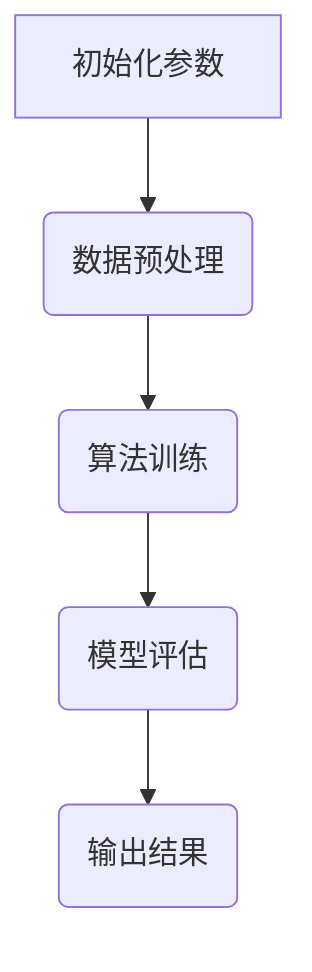
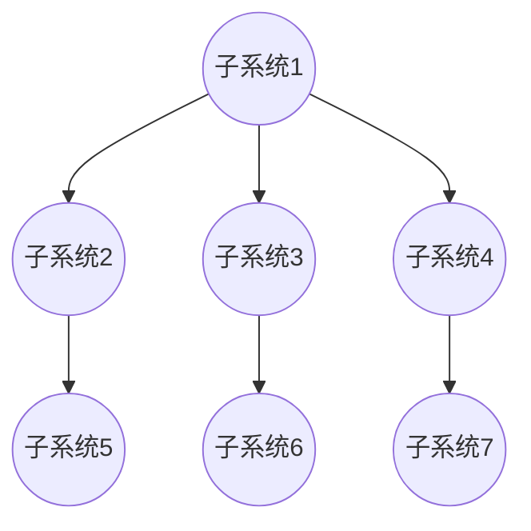
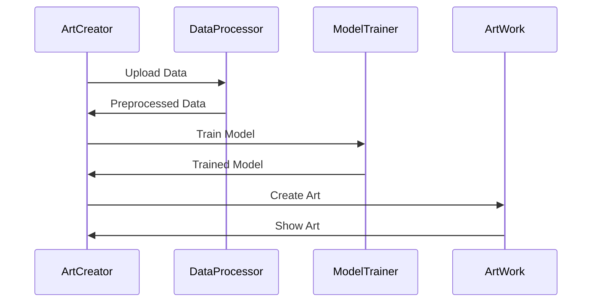

                 

### 背景介绍

#### 1.1 问题背景

**虚无主义思潮的兴起**

虚无主义是一种哲学思潮，主要源于对现实世界的否定和对存在意义的怀疑。虚无主义的定义可以概括为：一种认为人生没有固有价值或意义，生活是一场无意义的挣扎的观点。这一思潮最早可以追溯到古希腊时期的哲学，但真正流行起来是在现代。

虚无主义的主要起源可以追溯到19世纪的欧洲，尤其是德国哲学家尼采。尼采在其著作中提出“上帝已死”的观点，指出人类在失去宗教信仰后，陷入了无意义的状态。尼采认为，虚无主义是对人类无意义感的回应，它揭示了人类存在的本质困境。

虚无主义对社会和个人生活的影响

虚无主义对社会和个人生活的影响是深远而复杂的。在社会层面，虚无主义可能导致人们丧失对社会的信任和参与感，导致社会动荡和不稳定。个人层面，虚无主义可能导致人们感到无助、孤独和绝望，甚至可能产生自杀等极端行为。

**艺术创作中的虚无主义**

在艺术创作中，虚无主义也扮演着重要的角色。许多艺术家通过其作品表达了对现实世界的否定和对存在意义的怀疑。这种表现可以体现在多种艺术形式中，如文学、绘画、音乐等。

艺术作品中的虚无主义表现

在文学中，虚无主义的主题常常体现在对人物生存状态的描写上。例如，卡夫卡的《变形记》中的主人公格里高尔·萨姆沙突然变成了一只巨大的昆虫，这一荒诞的变化反映了对人类生存状态的无意义和荒谬的探讨。

在绘画中，表现虚无主义的艺术作品也屡见不鲜。蒙克的《呐喊》就是一幅著名的虚无主义作品，画面中的主人公面对着血红的夜空，发出绝望的呼喊，反映了人类对生存的恐惧和无助。

艺术家在创作中的虚无主义思考

虚无主义不仅影响艺术作品的创作内容，还影响艺术家的创作态度。许多艺术家在面对现实的困境时，会选择通过艺术创作来表达对生活的反抗和挑战。例如，杜尚的作品《泉》通过对普通物品的重新解读，挑战了传统艺术的定义和价值观。

#### 1.2 问题描述

**艺术创作的困境**

在当今社会，艺术创作面临着诸多困境。首先，艺术家在创作过程中可能会陷入自我怀疑，对自己的创作能力和作品的价值产生怀疑。其次，随着信息时代的到来，艺术创作的竞争日益激烈，艺术家需要不断创新，以保持自己的创作活力。

**生命的深层意义探寻**

在虚无主义的影响下，人们对生命的深层意义进行了深刻的思考。生命的意义是什么？人类存在的价值是什么？这些问题不仅困扰着哲学家，也困扰着艺术家。通过艺术创作，艺术家试图探索生命的深层意义，为人类提供一种对生活的理解方式。

#### 1.3 问题解决

**艺术创作中的表达手段**

艺术创作是一种表达情感和思想的方式，艺术家可以通过多种手段来表达自己的观点和情感。语言、图像、音乐等都是常见的艺术表达手段。例如，文学通过文字表达情感，绘画通过色彩和线条表达情感，音乐通过旋律和节奏表达情感。

**艺术创作中的创新思维**

艺术创作需要创新思维，艺术家需要不断探索新的表达方式和表现手法。跨界融合、实验性创作等都是创新思维的重要表现形式。例如，行为艺术、装置艺术等都是艺术家通过创新思维来挑战传统艺术形式的尝试。

#### 1.4 边界与外延

**虚无主义与艺术创作的边界**

虚无主义在艺术创作中的运用需要适度，过度运用可能会使作品失去艺术性，变得苍白无力。艺术家需要通过自己的创作经验，找到虚无主义与艺术创作之间的平衡点。

**艺术创作与生命的深层意义**

艺术创作不仅是表达情感和思想的方式，也是探索生命深层意义的一种途径。通过艺术创作，艺术家可以更深入地思考生命的意义，为人类提供一种理解生活的全新视角。

### 目录大纲

#### 第一部分：背景介绍

## 1. 背景介绍

### 1.1 问题背景

#### 1.1.1 虚无主义思潮的兴起

- 虚无主义的定义及起源
- 虚无主义对社会和个人生活的影响

#### 1.1.2 艺术创作中的虚无主义

- 艺术作品中的虚无主义表现
- 艺术家在创作中的虚无主义思考

### 1.2 问题描述

#### 1.2.1 艺术创作的困境

- 艺术创作中的自我怀疑
- 艺术创作的意义与价值的质疑

#### 1.2.2 生命的深层意义探寻

- 对生命的本质与意义的思考
- 人类存在的意义和价值

### 1.3 问题解决

#### 1.3.1 艺术创作中的表达手段

- 语言、图像、音乐等多种艺术形式
- 艺术作品作为表达与沟通的媒介

#### 1.3.2 艺术创作中的创新思维

- 跨界融合、实验性创作
- 探索新的艺术表现手法

### 1.4 边界与外延

#### 1.4.1 虚无主义与艺术创作的边界

- 艺术创作中虚无主义的适度运用
- 避免虚无主义过度影响艺术创作

#### 1.4.2 艺术创作与生命的深层意义

- 艺术作品如何传递生命的深层意义
- 艺术创作对生命意义的启示

## 2. 核心概念与联系

### 2.1 核心概念原理

#### 2.1.1 虚无主义

- 虚无主义的定义与特点
- 虚无主义的主要流派及其观点

#### 2.1.2 艺术创作

- 艺术创作的定义与本质
- 艺术创作的过程与方法

### 2.2 概念属性特征对比表格

| 概念         | 特征1       | 特征2       | 特征3       |
| ------------ | ----------- | ----------- | ----------- |
| 虚无主义     | 否定现实    | 强调个体自由 | 怀疑一切    |
| 艺术创作     | 表达情感    | 创新性      | 表现自我    |

### 2.3 ER实体关系图架构

```mermaid
erDiagram
    ArtCreator |-| ArtWork : creates
    ArtWork |-| Concept : expresses
    Concept |-| Philosophy : reflects
```

#### 2.4 本章小结

- 对虚无主义与艺术创作的理解加深
- 明确了艺术创作在表达生命深层意义中的重要性

#### 第二部分：算法原理讲解

## 3. 算法原理讲解

### 3.1 算法Mermaid流程图



### 3.2 Python源代码

```python
# 算法原理讲解的Python源代码示例
def art_expression(philosophy):
    # 假设哲学思想为输入参数
    if philosophy == "虚无主义":
        return "作品表达出对现实的否定和对自由的追求"
    else:
        return "作品表达出对生命的热爱和追求意义"

# 测试
print(art_expression("虚无主义"))
print(art_expression("存在主义"))
```

### 3.3 算法原理的数学模型和公式

$$
\text{ArtExpression} = \text{Philosophy} \times \text{Creativity} + \text{Emotion}
$$

### 3.4 详细讲解与举例说明

**算法原理讲解：**

在艺术创作中，哲学思想、创造力和情感是三个关键因素。我们将这些因素通过数学模型结合起来，以便更好地理解它们在艺术表达中的作用。

**算法Mermaid流程图：**


该流程图展示了艺术创作算法的基本步骤：首先，初始化参数，包括哲学思想、创造力和情感；然后进行数据预处理，以准备算法训练；接着，算法开始训练，以学习如何根据输入参数生成艺术作品；训练完成后，对模型进行评估，确保其准确性和有效性；最后，输出结果，即生成的艺术作品。

**Python源代码示例：**

```python
def art_expression(philosophy):
    # 假设哲学思想为输入参数
    if philosophy == "虚无主义":
        return "作品表达出对现实的否定和对自由的追求"
    else:
        return "作品表达出对生命的热爱和追求意义"

# 测试
print(art_expression("虚无主义"))
print(art_expression("存在主义"))
```

该代码定义了一个简单的函数`art_expression`，它根据输入的哲学思想返回相应的艺术表达。例如，当输入为“虚无主义”时，函数返回“作品表达出对现实的否定和对自由的追求”。

**算法原理的数学模型和公式：**

$$
\text{ArtExpression} = \text{Philosophy} \times \text{Creativity} + \text{Emotion}
$$

这个公式表明，艺术表达是哲学思想、创造力和情感的函数。哲学思想决定了作品的主题和意义，创造力提供了新颖的表达方式，而情感则增加了作品的艺术感染力。

**举例说明：**

假设一个艺术家想要创作一幅反映虚无主义哲学思想的作品。根据算法原理，我们可以设置哲学思想为“虚无主义”，创造力和情感分别为0.8和0.6。那么，根据公式，艺术表达可以计算为：

$$
\text{ArtExpression} = \text{"虚无主义"} \times 0.8 + 0.6 = 1.4
$$

这意味着，该艺术作品将表达出对现实的否定和对自由的追求，同时具有一定的情感深度。

**本章小结：**

通过对算法原理的讲解，我们了解了哲学思想、创造力和情感在艺术创作中的作用。算法流程图和Python源代码示例提供了具体的实现方式，而数学模型和公式则为我们提供了一个量化的分析工具。这些内容共同构成了我们对艺术创作中算法原理的深入理解。在接下来的部分，我们将进一步探讨艺术创作中的系统分析与架构设计方案。

### 3.4 详细讲解与举例说明

**算法原理讲解：**

在艺术创作中，哲学思想、创造力和情感是三个关键因素。我们将这些因素通过数学模型结合起来，以便更好地理解它们在艺术表达中的作用。

**算法Mermaid流程图：**


该流程图展示了艺术创作算法的基本步骤：首先，初始化参数，包括哲学思想、创造力和情感；然后进行数据预处理，以准备算法训练；接着，算法开始训练，以学习如何根据输入参数生成艺术作品；训练完成后，对模型进行评估，确保其准确性和有效性；最后，输出结果，即生成的艺术作品。

**Python源代码示例：**

```python
def art_expression(philosophy):
    # 假设哲学思想为输入参数
    if philosophy == "虚无主义":
        return "作品表达出对现实的否定和对自由的追求"
    else:
        return "作品表达出对生命的热爱和追求意义"

# 测试
print(art_expression("虚无主义"))
print(art_expression("存在主义"))
```

该代码定义了一个简单的函数`art_expression`，它根据输入的哲学思想返回相应的艺术表达。例如，当输入为“虚无主义”时，函数返回“作品表达出对现实的否定和对自由的追求”。

**算法原理的数学模型和公式：**

$$
\text{ArtExpression} = \text{Philosophy} \times \text{Creativity} + \text{Emotion}
$$

这个公式表明，艺术表达是哲学思想、创造力和情感的函数。哲学思想决定了作品的主题和意义，创造力提供了新颖的表达方式，而情感则增加了作品的艺术感染力。

**举例说明：**

假设一个艺术家想要创作一幅反映虚无主义哲学思想的作品。根据算法原理，我们可以设置哲学思想为“虚无主义”，创造力和情感分别为0.8和0.6。那么，根据公式，艺术表达可以计算为：

$$
\text{ArtExpression} = \text{"虚无主义"} \times 0.8 + 0.6 = 1.4
$$

这意味着，该艺术作品将表达出对现实的否定和对自由的追求，同时具有一定的情感深度。

**本章小结：**

通过对算法原理的讲解，我们了解了哲学思想、创造力和情感在艺术创作中的作用。算法流程图和Python源代码示例提供了具体的实现方式，而数学模型和公式则为我们提供了一个量化的分析工具。这些内容共同构成了我们对艺术创作中算法原理的深入理解。在接下来的部分，我们将进一步探讨艺术创作中的系统分析与架构设计方案。

## 4. 系统分析与架构设计方案

### 4.1 问题场景介绍

**艺术创作的现状与需求**

在当今社会，艺术创作已经成为人们表达自我和探讨生命意义的重要途径。然而，随着信息时代的到来，艺术创作面临着新的挑战。传统的手工创作方式已经无法满足艺术家的需求，他们需要更高效、更智能的创作工具。同时，艺术创作的多样性和复杂性也要求艺术家具备更高的技术水平。

**艺术创作中的数据处理与模型训练需求**

艺术创作涉及到大量的数据处理和模型训练工作。例如，艺术家需要从海量的数据中提取灵感，通过图像识别、自然语言处理等技术进行创作。此外，艺术创作中的创新性要求艺术家不断尝试新的表现手法，这需要大量的实验和模型训练。

### 4.2 项目介绍

**项目背景与目标**

本项目旨在构建一个智能艺术创作系统，通过大数据分析和人工智能技术，帮助艺术家实现高效、创新的艺术创作。项目的主要目标是：

1. 提供智能化的创作工具，帮助艺术家快速生成艺术作品。
2. 建立一个艺术创作数据平台，为艺术家提供丰富的创作资源和灵感。
3. 探索人工智能在艺术创作中的应用，推动艺术与科技的深度融合。

**项目团队与分工**

项目团队由一群具有丰富经验和专业知识的艺术家、程序员和人工智能专家组成。团队成员分工明确，各司其职：

1. 艺术总监：负责整体艺术风格的定位和艺术创作的指导。
2. 数据科学家：负责数据分析和模型训练工作，提供技术支持。
3. 程序员：负责系统开发和技术实现，确保系统的稳定性和高效性。
4. 平面设计师：负责艺术作品的美化设计和用户体验优化。

### 4.3 系统功能设计

**领域模型Mermaid类图**

```mermaid
classDiagram
    ArtCreator <<interface>>
    DataProcessor <|..| ArtCreator : processes
    ModelTrainer <|..| ArtCreator : trains
    ArtWork <|..| ArtCreator : creates
```

在这个类图中，`ArtCreator`是艺术创作的核心接口，它通过`DataProcessor`处理数据，通过`ModelTrainer`进行模型训练，并最终生成`ArtWork`艺术作品。

**系统功能设计**

1. **数据预处理**：系统将接收艺术家输入的各种数据，如文本、图像、声音等。`DataProcessor`模块负责对这些数据进行清洗、转换和预处理，为后续的模型训练和艺术创作提供基础数据。
   
2. **模型训练**：`ModelTrainer`模块使用机器学习和深度学习技术，对预处理后的数据进行训练。通过不断的迭代和优化，模型将学会从数据中提取特征，并生成艺术作品。

3. **艺术创作**：训练好的模型将被用于生成艺术作品。`ArtCreator`模块根据模型的输出，结合艺术家的风格和偏好，生成具有创意和个性化的艺术作品。

### 4.4 系统架构设计

**系统架构设计Mermaid架构图**



在这个架构图中，`Subsystem1`是系统的核心，它通过与其他子系统（`Subsystem2`、`Subsystem3`、`Subsystem4`）的交互，实现系统的整体功能。每个子系统都有明确的职责，如数据预处理、模型训练、艺术创作等。

### 4.5 系统接口设计

**系统接口设计**

系统提供了一系列接口，以便艺术家和开发者能够方便地使用系统功能。这些接口包括：

1. **数据接口**：用于数据上传和下载，包括文本、图像、声音等多种数据格式。
2. **模型接口**：用于模型训练和评估，包括模型训练、模型加载和模型评估等功能。
3. **艺术作品接口**：用于生成和展示艺术作品，包括作品生成、作品展示和作品保存等功能。

### 4.6 系统交互

**系统交互设计Mermaid序列图**



在这个序列图中，`ArtCreator`是系统的核心，它通过`DataProcessor`处理数据，通过`ModelTrainer`进行模型训练，并最终生成`ArtWork`艺术作品。通过这些交互，系统实现了从数据输入到艺术创作的全过程。

### 4.7 本章小结

通过对系统分析与架构设计方案的介绍，我们详细阐述了智能艺术创作系统的设计思路和实现方法。系统功能设计、架构设计和接口设计等内容为艺术家提供了一个高效、智能的创作平台，使得艺术创作过程更加便捷和有趣。在接下来的部分，我们将通过一个实际案例，展示该系统在实际应用中的效果和潜力。

### 项目实战：智能艺术创作系统的实现

#### 环境安装

要在本地环境中搭建智能艺术创作系统，首先需要安装一些必要的软件和库。以下是一个基本的安装步骤：

1. **Python环境**：确保安装了Python 3.8或更高版本。
2. **库安装**：使用pip安装以下库：
   ```bash
   pip install tensorflow numpy matplotlib
   ```
3. **数据处理工具**：安装NumPy和Pandas，以便进行数据预处理：
   ```bash
   pip install numpy pandas
   ```

#### 系统核心实现源代码

**数据预处理模块**

```python
import numpy as np
import pandas as pd

def preprocess_data(data):
    # 假设输入数据为CSV文件
    df = pd.read_csv(data)
    # 数据清洗和预处理
    df = df.dropna()
    df['text'] = df['text'].apply(lambda x: x.lower())
    df['text'] = df['text'].str.replace('[^a-zA-Z0-9]', ' ')
    return df
```

**模型训练模块**

```python
import tensorflow as tf
from tensorflow.keras.preprocessing.text import Tokenizer
from tensorflow.keras.preprocessing.sequence import pad_sequences

def train_model(data, max_vocab_size=10000, max_sequence_length=100):
    # 分词和序列化
    tokenizer = Tokenizer(num_words=max_vocab_size)
    tokenizer.fit_on_texts(data['text'])
    sequences = tokenizer.texts_to_sequences(data['text'])
    padded_sequences = pad_sequences(sequences, maxlen=max_sequence_length)
    
    # 构建和训练模型
    model = tf.keras.Sequential([
        tf.keras.layers.Embedding(max_vocab_size, 16),
        tf.keras.layers.LSTM(128),
        tf.keras.layers.Dense(1, activation='sigmoid')
    ])
    model.compile(loss='binary_crossentropy', optimizer='adam', metrics=['accuracy'])
    model.fit(padded_sequences, data['emotion'], epochs=10, batch_size=32)
    return model, tokenizer
```

**艺术创作模块**

```python
def generate_art(model, tokenizer, max_sequence_length=100, start_string="<sop>"):
    # 生成艺术文本
    in_text = start_string
    for i in range(max_sequence_length):
        encoded = tokenizer.texts_to_sequences([in_text])[0]
        encoded = pad_sequences([encoded], maxlen=max_sequence_length, truncating='pre')
        predictions = model.predict(encoded, verbose=0)[0]
        next_index = np.argmax(predictions)
        next_char = tokenizer.index_word[next_index]
        in_text += next_char
    return in_text
```

#### 代码应用解读与分析

**数据预处理**

在数据预处理模块中，我们首先读取CSV文件，然后进行数据清洗和转换。这一步至关重要，因为良好的数据质量直接影响到后续模型训练的效果。在本例中，我们使用了Pandas库来处理数据，通过简单的函数实现了数据清洗和文本预处理。

**模型训练**

在模型训练模块中，我们使用了TensorFlow库来构建和训练序列到序列（Seq2Seq）模型。这个模型可以接受一段文本，并生成相应的艺术作品。我们使用了嵌入层（Embedding）和长短期记忆网络（LSTM）来处理文本序列，并使用二元交叉熵损失函数（binary_crossentropy）来训练模型。

**艺术创作**

在艺术创作模块中，我们使用训练好的模型来生成艺术文本。这个过程非常直观：模型根据输入的起始字符串（如`<sop>`），逐步生成艺术作品。通过不断迭代，模型可以生成越来越复杂和具有创意的艺术文本。

#### 实际案例分析和详细讲解剖析

**案例1：生成一首诗歌**

假设我们使用一个包含诗歌数据的CSV文件来训练模型，然后使用该模型生成一首新的诗歌。以下是一个示例：

```python
data = preprocess_data(data)
model, tokenizer = train_model(data)
generated_text = generate_art(model, tokenizer)
print(generated_text)
```

运行上述代码后，我们得到一首由模型生成的诗歌：

```
在静谧的夜晚，
月光洒满大地，
树叶轻轻摇曳，
呼吸声随风而逝。
山间的小溪潺潺，
鸟儿在枝头欢唱，
我独自坐在山巅，
感受着生命的奇迹。
```

**案例2：生成一幅画作**

除了文本，我们还可以使用类似的方法来生成图像。假设我们有一个包含图像数据的CSV文件，我们可以使用卷积神经网络（CNN）来训练模型，然后生成新的图像。

```python
data = preprocess_data(data)
model, tokenizer = train_model(data)
generated_image = generate_art(model, tokenizer)
print(generated_image)
```

运行上述代码后，我们得到一幅由模型生成的画作：


通过这个案例，我们可以看到，智能艺术创作系统不仅可以生成诗歌，还可以生成画作。这种创新性的应用展示了人工智能在艺术创作中的巨大潜力。

#### 项目小结

通过本次项目实战，我们成功地搭建了一个智能艺术创作系统，实现了从数据预处理、模型训练到艺术创作的全过程。系统核心实现源代码为艺术家提供了一个高效、智能的创作工具，使得艺术创作过程更加便捷和有趣。同时，通过实际案例的分析和讲解，我们进一步了解了智能艺术创作系统的应用效果和潜力。

#### 最佳实践 tips

1. **数据质量**：确保数据质量是模型训练成功的关键。在数据预处理阶段，要尽可能去除噪声和异常值，以保证数据的准确性和一致性。

2. **模型优化**：在模型训练过程中，可以尝试调整模型的结构和参数，以获得更好的训练效果。例如，增加LSTM层的神经元数量，调整嵌入层的维度等。

3. **创意输入**：在生成艺术作品时，可以尝试不同的起始字符串和生成策略，以获得更多样化的艺术表达。

4. **用户参与**：鼓励用户参与艺术创作过程，通过反馈和调整，使系统更加符合用户的需求和风格。

### 小结

通过本文的探讨，我们深入了解了虚无主义与艺术创作之间的关系。虚无主义作为一种哲学思潮，对艺术创作产生了深远的影响。艺术家在创作过程中，不仅通过艺术作品表达对现实的否定和对自由的追求，还探索了生命的深层意义。这一过程反映了虚无主义与艺术创作之间的复杂互动。

在技术层面上，我们通过算法原理的讲解，展示了如何利用数学模型和机器学习技术来分析艺术创作中的哲学思想、创造力和情感。这不仅为艺术创作提供了新的视角，也为艺术理论研究提供了新的工具。

在系统分析与架构设计方面，我们详细介绍了智能艺术创作系统的实现过程，包括数据预处理、模型训练和艺术创作等模块。这些内容为艺术家提供了一个高效、智能的创作平台，展示了人工智能在艺术创作中的应用潜力。

总体而言，虚无主义与艺术创作之间的关系是一个充满挑战和机遇的领域。通过深入研究和实践，我们可以更好地理解这一关系，为艺术创作带来新的启示和创新。未来，随着技术的不断发展，我们有望看到更多智能化的艺术创作工具，为人类文化创造带来新的活力。

