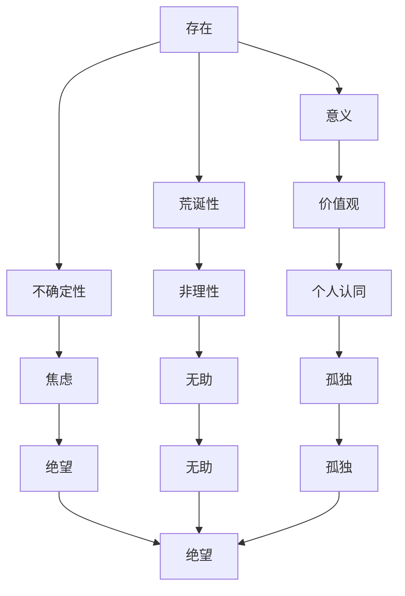

                 

## 虚无主义的挑战：在不确定中找寻确定

### 关键词：虚无主义、不确定、存在、哲学、心理学、社会文化

### 摘要：

在当今复杂多变的社会背景下，虚无主义作为一种哲学思潮，对个体和社会产生了深远的影响。本文旨在探讨虚无主义的挑战，特别是在不确定性的世界中，如何寻找确定性与意义。通过逻辑清晰的分析和一步一步的推理思考，本文将深入探讨虚无主义的核心概念、其带来的不确定性和存在的荒诞性，以及其对个人和社会的深远影响。同时，本文也将探索虚无主义的根源与演变，分析其与存在主义、唯心主义和理性主义的联系与区别，并探讨虚无主义在当代社会文化中的影响。此外，本文还将从心理学角度解读虚无主义，并提出个人和实践层面的应对策略，最终总结全文并展望未来虚无主义的发展趋势和挑战。

### 目录大纲

1. 第一部分：背景介绍
   1.1 问题背景
       1.1.1 问题背景
       1.1.2 问题解决
       1.1.3 边界与外延
       1.1.4 核心概念与联系
       1.1.5 概念结构与核心要素
   1.2 虚无主义的挑战
       1.2.1 不确定性的挑战
       1.2.2 存在的荒诞性
       1.2.3 个人层面的虚无主义挑战
       1.2.4 社会层面的虚无主义挑战

2. 第二部分：虚无主义的根源与演变
   2.1 虚无主义的根源
       2.1.1 虚无主义的根源
       2.1.2 虚无主义的演变
       2.1.3 当代虚无主义

3. 第三部分：虚无主义的哲学思考
   3.1 虚无主义与存在主义
       3.1.1 虚无主义与存在主义
       3.1.2 对比分析
   3.2 虚无主义与唯心主义
       3.2.1 虚无主义与唯心主义
       3.2.2 对比分析
   3.3 虚无主义与理性主义
       3.3.1 虚无主义与理性主义
       3.3.2 对比分析

4. 第四部分：虚无主义的社会文化影响
   4.1 虚无主义对文化的冲击
       4.1.1 虚无主义对文化的冲击
       4.1.2 影响分析
   4.2 虚无主义与当代社会思潮
       4.2.1 思潮互动
       4.2.2 挑战与机遇

5. 第五部分：虚无主义的心理学解读
   5.1 虚无主义与心理健康
       5.1.1 心理健康影响
       5.1.2 心理学解释
   5.2 应对虚无主义的心理学策略
       5.2.1 策略与方法

6. 第六部分：虚无主义的实践应对
   6.1 个人实践策略
       6.1.1 实践方法
   6.2 社会实践策略
       6.2.1 社会实践
   6.3 总结与展望
       6.3.1 总结
       6.3.2 展望未来

### 1. 第一部分：背景介绍

#### 1.1 问题背景

##### 1.1.1 问题背景

虚无主义，作为一个哲学概念，源于对存在的怀疑和对意义的否定。在现代社会，虚无主义不仅是一种哲学思潮，更是一种广泛存在于人们日常生活中的心理状态。它挑战了传统的价值观，质疑了生活的意义，给人们带来了不确定性和焦虑。

首先，让我们来探讨虚无主义的概念。虚无主义源自拉丁语“nihilism”，意为“无”或“无意义”。它认为世界、生命和人类的存在缺乏本质意义，或者是非理性的、荒诞的。虚无主义的核心观点是：宇宙中没有固有目的，人类的行为和存在没有内在的价值和意义。

虚无主义在现代社会中具有广泛的影响力。一方面，它反映了现代社会中人们对传统信仰和价值观的质疑和反思；另一方面，它也揭示了现代社会中人们面临的许多问题和挑战。例如，科技的快速发展导致了人们生活方式的改变，使得人们感到生活变得没有意义；全球化的进程使得文化认同感减弱，让人们感到孤独和无助。

##### 1.1.2 问题解决

面对虚无主义的挑战，我们需要深入理解其产生的原因和影响，并寻找解决的方法。虚无主义的挑战主要表现在以下几个方面：

1. **不确定性的挑战**：虚无主义质疑存在的本质和意义，这导致人们在面对生活中的不确定性时感到迷茫和无力。例如，职业选择、人际关系、未来规划等问题，都可能导致人们感到困惑和不安。

2. **存在的荒诞性**：虚无主义认为世界是荒诞的，没有固有秩序和目的。这种观点使得人们在面对生活中的困难和挑战时感到无助和绝望。

3. **个人层面的虚无主义挑战**：在个人层面，虚无主义可能导致人们感到孤独、无助和绝望。这种心理状态可能会影响人们的日常生活和工作，甚至导致心理疾病。

4. **社会层面的虚无主义挑战**：在社会层面，虚无主义可能导致社会价值观的崩溃，影响社会的稳定和发展。

为了解决虚无主义的挑战，我们需要从以下几个方面入手：

1. **增强自我认知**：通过自我反思和自我探索，了解自己的需求和价值观，找到生活的意义。

2. **培养积极的生活态度**：通过积极的生活态度，面对生活中的困难和挑战，寻找解决问题的方法。

3. **寻求社会支持**：与他人建立良好的关系，寻求社会支持，减轻虚无主义带来的压力和焦虑。

4. **探索哲学和心理学的智慧**：通过哲学和心理学的智慧，理解虚无主义的本质，找到应对的方法。

##### 1.1.3 边界与外延

在探讨虚无主义时，我们需要明确研究的边界和范围。虚无主义的研究不仅涉及哲学领域，还包括心理学、社会学等多个学科。因此，我们需要在研究过程中明确研究的范围和限制，以确保研究的系统性和深入性。

此外，虚无主义的外延也需要我们深入探讨。虚无主义不仅表现为一种哲学思潮，还体现在人们的日常生活中。例如，在艺术、文学、电影等文化作品中，虚无主义的思想得到了广泛的体现。因此，我们需要在研究中探讨虚无主义在不同领域的影响和表现形式。

##### 1.1.4 核心概念与联系

在探讨虚无主义时，我们需要明确核心概念，并分析这些概念之间的关系。虚无主义的核心概念包括：

1. **存在**：存在是虚无主义探讨的核心。虚无主义质疑存在的本质和意义。

2. **意义**：虚无主义认为世界和人类的存在缺乏意义。

3. **荒诞性**：虚无主义认为世界是荒诞的，没有固有秩序和目的。

4. **不确定性**：虚无主义强调存在的荒诞性和不确定性。

这些核心概念相互联系，共同构成了虚无主义的理论体系。

为了更好地理解这些概念，我们可以通过对比表格来展示它们之间的异同。

| 概念   | 含义                                                         | 关联概念                                         |
| ------ | ------------------------------------------------------------ | ------------------------------------------------ |
| 存在   | 存在是事物实际存在的状态，与虚无相对。                       | 意义、荒诞性、不确定性                             |
| 意义   | 意义是事物存在的理由和价值。虚无主义质疑意义的本质。         | 存在、荒诞性、不确定性                             |
| 荒诞性 | 荒诞性是指事物的无意义和不可理解性。虚无主义认为世界是荒诞的。 | 存在、意义、不确定性                               |
| 不确定性 | 不确定性是指事物的不确定性和不可预测性。虚无主义强调不确定性。 | 存在、意义、荒诞性                                 |

通过对比表格，我们可以更清晰地理解虚无主义的核心概念及其相互关系。

##### 1.1.5 概念结构与核心要素

为了深入理解虚无主义的结构，我们可以使用Mermaid流程图来展示其核心要素和逻辑架构。

通过这个流程图，我们可以看到虚无主义的核心概念和它们之间的关联。存在是虚无主义探讨的起点，它与意义、荒诞性和不确定性紧密相关。这些概念共同构成了虚无主义的理论体系，并对个人的价值观、情感和生活态度产生了深远的影响。

### 1. 第二部分：虚无主义的挑战

#### 1.2 虚无主义的挑战

虚无主义带来了许多挑战，其中最为显著的是不确定性和存在的荒诞性。这些挑战不仅影响个人的心理健康，也对社会的稳定和发展产生了负面影响。

##### 1.2.1 不确定性的挑战

虚无主义强调存在的荒诞性和不确定性，这给人们带来了巨大的困扰。在虚无主义的视角下，世界是一个无意义、不可预测的荒诞之地，人类的命运是随机的、不可控制的。这种观念使得人们在面对生活中的不确定性和挑战时感到迷茫和无助。

首先，不确定性导致人们对未来的恐惧。虚无主义认为，由于世界是荒诞的，未来是无法预测的。这种观点使得人们在规划未来时感到不确定和焦虑，从而影响了他们的决策和行动。

其次，不确定性削弱了人们的信心。在虚无主义的视角下，由于世界缺乏固有秩序和目的，人们的努力和成就可能变得毫无意义。这种观点使得人们对自己的能力和价值产生怀疑，从而削弱了他们的自信心和积极性。

为了应对不确定性的挑战，我们需要采取一些策略。首先，我们应该接受不确定性是生活的一部分，学会适应和应对。其次，我们可以通过培养积极的生活态度，提高自己的心理韧性，从而更好地面对不确定性带来的挑战。

##### 1.2.2 存在的荒诞性

虚无主义认为世界是荒诞的，没有固有秩序和目的。这种观点给人们带来了强烈的绝望感和无助感。在虚无主义的视角下，人类的存在是毫无意义的，人们的行为和努力可能变得毫无价值。

首先，存在的荒诞性导致人们对生活的绝望。在虚无主义的视角下，生活缺乏意义和价值，这导致人们对生活的热爱和热情减少，甚至对生活感到厌恶和绝望。

其次，存在的荒诞性导致人们感到无助。在虚无主义的视角下，由于世界是荒诞的，人类的努力可能变得毫无意义。这种观点使得人们感到无助和无力，从而影响了他们的生活和心态。

为了应对存在的荒诞性，我们需要寻找生活的意义和价值。首先，我们可以通过自我反思和自我探索，了解自己的需求和价值观，找到生活的意义。其次，我们可以通过培养积极的生活态度，寻找生活中的乐趣和美好，从而克服存在的荒诞性带来的负面影响。

##### 1.2.3 个人层面的虚无主义挑战

在个人层面，虚无主义带来了许多挑战。这些挑战不仅影响个人的心理健康，也对个人的生活质量和幸福感产生了负面影响。

首先，虚无主义可能导致个人感到孤独和无助。在虚无主义的视角下，世界是荒诞的，人类的存在是毫无意义的。这种观点使得个人感到孤独和无助，从而影响了他们的社交和生活质量。

其次，虚无主义可能导致个人对生活失去热情。在虚无主义的视角下，生活缺乏意义和价值，这导致个人对生活失去热情和动力。这种心态会影响个人的生活态度和价值观，从而影响他们的生活质量和幸福感。

为了应对个人层面的虚无主义挑战，我们需要采取一些策略。首先，我们可以通过自我反思和自我探索，了解自己的需求和价值观，找到生活的意义。其次，我们可以通过培养积极的生活态度，提高自己的心理韧性，从而更好地面对虚无主义带来的挑战。

##### 1.2.4 社会层面的虚无主义挑战

在社会层面，虚无主义也带来了许多挑战。这些挑战不仅影响社会的稳定和发展，也对社会的价值观和道德观念产生了负面影响。

首先，虚无主义可能导致社会价值观的崩溃。在虚无主义的视角下，生活缺乏意义和价值，这导致社会价值观的混乱和崩溃。这种观点可能导致社会的道德沦丧，影响社会的和谐和稳定。

其次，虚无主义可能导致社会的不稳定。在虚无主义的视角下，由于世界是荒诞的，社会的秩序和规则可能变得无效。这种观点可能导致社会的不稳定和动荡，影响社会的正常运转。

为了应对社会层面的虚无主义挑战，我们需要采取一些策略。首先，我们可以通过教育和宣传，提高人们对虚无主义的认识和警惕。其次，我们可以通过建立积极的社会价值观，引导人们寻找生活的意义和价值，从而克服虚无主义带来的负面影响。

### 1. 第三部分：虚无主义的根源与演变

#### 1.3 虚无主义的根源

虚无主义的根源可以追溯到古希腊哲学家普罗塔戈拉的观点，他提出了“人是万物的尺度”这一思想，质疑了传统的价值观和信仰。这一思想为后来的虚无主义奠定了基础。

在中世纪，虚无主义的思想主要表现为对上帝存在的质疑和对宗教信仰的反思。随着文艺复兴和启蒙运动的发展，虚无主义的思想得到了进一步的发展。文艺复兴时期的人文主义强调个人的价值和尊严，对传统权威进行了挑战。启蒙运动则通过理性主义和科学方法对宗教和传统价值观进行了批判，这为虚无主义的发展提供了理论支持。

在现代社会，虚无主义的思想得到了进一步的发展。随着科技的进步和全球化的进程，人们对世界的认识发生了巨大的变化。传统的价值观和信仰体系受到了挑战，虚无主义的思想在当代社会中具有广泛的影响力。

#### 1.4 虚无主义的演变

虚无主义的演变经历了不同的阶段，每个阶段都有其独特的特点和表现形式。

在古代，虚无主义的思想主要表现为对上帝存在的质疑和对宗教信仰的反思。古希腊哲学家普罗塔戈拉的观点是虚无主义的最早体现。他提出了“人是万物的尺度”这一思想，质疑了传统的价值观和信仰。

在中世纪，虚无主义的思想进一步发展。随着文艺复兴和启蒙运动的发展，人们对世界的认识发生了巨大的变化。文艺复兴时期的人文主义强调个人的价值和尊严，对传统权威进行了挑战。启蒙运动则通过理性主义和科学方法对宗教和传统价值观进行了批判，这为虚无主义的发展提供了理论支持。

在现代社会，虚无主义的思想得到了进一步的发展。随着科技的进步和全球化的进程，人们对世界的认识发生了巨大的变化。传统的价值观和信仰体系受到了挑战，虚无主义的思想在当代社会中具有广泛的影响力。

#### 1.5 当代虚无主义

当代虚无主义具有一些独特的特点，这些特点反映了当代社会中的问题和挑战。

首先，当代虚无主义强调存在的荒诞性和不确定性。在当代社会中，由于科技的发展和全球化的进程，人们的生活方式发生了巨大的变化。这种变化使得人们感到世界变得更加复杂和不可预测，从而增强了虚无主义的思想。

其次，当代虚无主义对传统价值观进行了挑战。在当代社会中，传统价值观和信仰体系受到了质疑和批判。这种质疑和批判导致了传统价值观的崩溃，使得人们感到生活缺乏意义和价值。

最后，当代虚无主义对当代社会思潮产生了深远的影响。虚无主义的思想在当代社会中具有广泛的影响力，它影响了人们的价值观、行为和生活方式。这种影响不仅体现在个人层面，也体现在社会层面，对社会的稳定和发展产生了负面影响。

### 1. 第四部分：虚无主义的哲学思考

#### 1.6 虚无主义与存在主义

虚无主义与存在主义是两种截然不同的哲学思潮，但它们之间也存在一定的联系。

虚无主义认为世界是荒诞的，人类的存在缺乏本质意义。它强调存在的无意义和非理性，质疑传统价值观和信仰体系。虚无主义的核心观点是：宇宙中没有固有目的，人类的行为和存在没有内在的价值和意义。

存在主义则认为人类的存在是荒诞的，但人类可以通过自由选择和行动来赋予生活意义。它强调个人的自由、责任和存在的主观性。存在主义的核心观点是：人类的存在是荒诞的，但人类可以通过自由选择和行动来创造自己的意义。

尽管虚无主义和存在主义在核心观点上存在差异，但它们之间也存在一定的联系。虚无主义的存在主义倾向表现为对自由选择的强调和对生活意义的质疑。虚无主义的存在主义倾向也反映了存在主义对自由和选择的重视。

#### 1.7 虚无主义与唯心主义

虚无主义与唯心主义是两种不同的哲学思潮，但它们之间也存在一定的联系。

虚无主义认为世界是荒诞的，人类的存在缺乏本质意义。它强调存在的无意义和非理性，质疑传统价值观和信仰体系。虚无主义的核心观点是：宇宙中没有固有目的，人类的行为和存在没有内在的价值和意义。

唯心主义则认为意识是第一性的，物质是第二性的。它强调精神和意识的重要性，认为世界的本质是意识。唯心主义的核心观点是：意识是第一性的，物质世界是意识的产物。

尽管虚无主义和唯心主义在核心观点上存在差异，但它们之间也存在一定的联系。虚无主义的唯心主义倾向表现为对意识和精神的重视，以及对物质世界的质疑。虚无主义的唯心主义倾向也反映了唯心主义对精神和意识的重视。

#### 1.8 虚无主义与理性主义

虚无主义与理性主义是两种截然不同的哲学思潮，但它们之间也存在一定的联系。

虚无主义认为世界是荒诞的，人类的存在缺乏本质意义。它强调存在的无意义和非理性，质疑传统价值观和信仰体系。虚无主义的核心观点是：宇宙中没有固有目的，人类的行为和存在没有内在的价值和意义。

理性主义则认为理性是第一性的，经验是第二性的。它强调理性和思考的重要性，认为知识应该建立在理性推理的基础上。理性主义的核心观点是：理性是第一性的，经验世界是理性思考的产物。

尽管虚无主义和理性主义在核心观点上存在差异，但它们之间也存在一定的联系。虚无主义的理性主义倾向表现为对理性推理和思考的重视，以及对传统价值观和信仰体系的质疑。虚无主义的理性主义倾向也反映了理性主义对理性推理和思考的重视。

### 1. 第五部分：虚无主义的社会文化影响

#### 1.9 虚无主义对文化的冲击

虚无主义作为一种哲学思潮，对文化产生了深远的影响。它挑战了传统价值观和信仰体系，质疑了文化的根基，从而对文化产生了冲击。

首先，虚无主义对文化的冲击体现在对传统价值观的质疑上。虚无主义认为世界是荒诞的，人类的存在缺乏本质意义，这导致了对传统道德、宗教和社会价值观的怀疑和否定。例如，虚无主义对基督教信仰的质疑，对封建社会等级制度的批判，以及对现代社会价值观的反思，都反映了虚无主义对文化传统的挑战。

其次，虚无主义对文化的冲击还体现在对艺术和文学的影响上。虚无主义的思想渗透到了艺术和文学创作中，产生了大量反映人类存在荒诞性和生命意义的艺术作品。例如，现代派文学作品中的荒诞主义、黑色幽默和存在主义主题，都是虚无主义在艺术领域的体现。这些作品通过对人类生存状态和内心世界的描绘，挑战了传统审美观念，推动了艺术和文学的创新和发展。

此外，虚无主义对文化的冲击还体现在对宗教和哲学的影响上。虚无主义对宗教信仰的质疑和对哲学体系的批判，动摇了传统宗教和哲学的权威地位，推动了宗教和哲学的现代化转型。例如，现代宗教哲学对信仰与理性的关系的探讨，以及对人类存在的意义和价值的反思，都是虚无主义在宗教和哲学领域的体现。

#### 1.10 虚无主义与当代社会思潮

虚无主义与当代社会思潮之间存在紧密的联系，它们相互影响、相互作用。虚无主义不仅反映了当代社会的某些问题和挑战，也影响了当代社会的发展方向。

首先，虚无主义与当代社会思潮的联系体现在对传统价值观的质疑上。虚无主义的思想在当代社会中得到了广泛传播，许多人对传统价值观和信仰体系产生了怀疑和否定。这种怀疑和否定推动了当代社会的价值多元化和观念变革。例如，现代社会中对性别平等、性取向自由和民主自由的追求，都是虚无主义对传统价值观质疑的体现。

其次，虚无主义与当代社会思潮的联系还体现在对人类存在意义的反思上。虚无主义的思想促使人们思考人类存在的本质和意义。这种反思不仅体现在哲学和文学领域，也渗透到了日常生活和社会实践之中。例如，当代社会中人们对生活质量的追求、对精神需求的关注，以及对自我实现的追求，都是虚无主义对人类存在意义反思的体现。

此外，虚无主义与当代社会思潮的联系还体现在对技术和科学的看法上。虚无主义对技术和科学的质疑反映了当代社会对科技进步的担忧和对人类未来的担忧。这种担忧推动了人们对可持续发展和环境保护的关注，也促使社会对科技伦理和人类福祉进行更深入的探讨。

#### 1.11 虚无主义的挑战与机遇

虚无主义既带来了挑战，也提供了机遇。在现代社会中，虚无主义的挑战主要体现在对传统价值观的质疑和对人类存在的反思上。这种质疑和反思推动了社会的变革和进步，为人类带来了新的思考方向和生活方式。例如，对性别平等、人权自由和环境保护的重视，都是虚无主义挑战带来的积极变化。

同时，虚无主义也提供了机遇。在虚无主义的视角下，人们可以更加客观地看待世界和人生，寻找新的价值和意义。这种寻找过程不仅丰富了人类的思想和心灵，也为社会的发展和进步提供了动力。例如，现代艺术和文学的创新、对科技伦理的探讨，以及对人类存在意义的深入思考，都是虚无主义提供的机遇。

总之，虚无主义的挑战与机遇并存。在面对虚无主义的挑战时，我们需要保持开放的心态，积极探索新的价值和意义。同时，我们也应该珍惜虚无主义带来的机遇，推动社会的变革和进步。

### 1. 第六部分：虚无主义的心理学解读

#### 1.12 虚无主义与心理健康

虚无主义对心理健康产生了深远的影响。虚无主义的观念可能导致个体产生消极的情绪和心理问题，如焦虑、抑郁和无助感。首先，虚无主义的不确定性和存在的荒诞性观念可能使个体对生活的意义和目的感到困惑和迷茫，从而增加心理压力和焦虑感。个体可能会怀疑自己的行为和努力是否有意义，导致对生活失去热情和动力，产生抑郁情绪。

其次，虚无主义的观点可能导致个体产生无助感。由于虚无主义强调人类的存在是毫无意义的，个体可能会感到自己在生活中无法找到真正的价值和满足感，从而感到无助和孤独。这种无助感可能导致个体避免面对现实问题，逃避责任，甚至出现心理逃避和自我放弃的行为。

为了应对虚无主义对心理健康的影响，个体可以采取以下策略：

1. **寻求心理咨询**：通过专业的心理咨询，个体可以了解虚无主义对心理健康的影响，并学习有效的应对策略。心理咨询师可以帮助个体探索内心的困惑，提供心理支持和指导。

2. **建立积极的生活态度**：通过培养积极的生活态度，个体可以更好地应对虚无主义带来的消极情绪。积极的生活态度包括对生活的热爱、对困难的积极应对和对他人的关爱。

3. **寻找生活的意义**：个体可以通过自我探索和反思，寻找生活的意义和价值。这可以通过追求个人兴趣、参与社会活动、建立人际关系和追求个人成长来实现。

#### 1.13 虚无主义的心理学解释

虚无主义的心理学解释主要涉及对个体心理状态和行为的影响。心理学研究者通过实验研究和理论分析，试图理解虚无主义如何影响个体的心理过程和行为。

首先，心理学研究指出，虚无主义可能导致个体的心理应激反应。由于虚无主义强调存在的荒诞性和不确定性，个体在面临生活挑战和不确定性时可能会产生强烈的焦虑和恐惧。这种心理应激反应可能导致个体对生活的消极态度和行为，如逃避、自我放弃和避免面对问题。

其次，心理学研究还发现，虚无主义可能影响个体的自我认同和自我价值感。虚无主义认为人类的存在缺乏本质意义，这可能导致个体对自己的价值和存在的意义产生怀疑。这种自我怀疑可能导致个体产生自卑和无助感，从而影响个体的自我认同和自尊。

为了更好地理解虚无主义的心理学解释，我们可以通过以下研究方法和理论框架：

1. **心理应激理论**：心理应激理论认为，个体的心理应激反应是由外部压力和内部心理过程相互作用产生的。虚无主义作为一种外部压力，可能导致个体的心理应激反应，如焦虑和恐惧。

2. **自我认同理论**：自我认同理论强调个体的自我认同和自我价值感对其心理和行为的影响。虚无主义对存在的质疑可能导致个体对自我认同和自我价值感的动摇，从而影响个体的心理健康和行为。

3. **存在主义心理学**：存在主义心理学研究个体在面对存在的荒诞性和不确定性时的心理反应和行为。虚无主义作为一种存在主义观念，对个体的心理和行为产生了重要影响。

#### 1.14 应对虚无主义的心理学策略

为了应对虚无主义带来的心理挑战，个体可以采取以下心理学策略：

1. **认知重构**：通过认知重构，个体可以改变对虚无主义的认知方式和思维模式。例如，个体可以通过反思和质疑自己的消极思维，寻找更加积极和理性的思考方式。

2. **情感调节**：通过情感调节，个体可以学会管理和调节自己的情绪。例如，个体可以通过放松训练、正念冥想和情感释放等方法，减轻虚无主义带来的负面情绪。

3. **自我探索**：通过自我探索，个体可以深入了解自己的内心世界和价值观。个体可以通过日记、自我反思和心理治疗等方法，探索自己的内在需求和目标。

4. **社会支持**：通过建立社会支持系统，个体可以获得情感和心理上的支持。个体可以与家人、朋友或心理咨询师交流，分享自己的感受和困惑，获得帮助和支持。

### 1. 第七部分：虚无主义的实践应对

#### 1.15 个人实践策略

面对虚无主义的挑战，个人可以通过一系列实践策略来寻找生活的意义和确定感。以下是一些实用的方法：

1. **建立日常仪式**：通过建立日常仪式，个体可以在日常生活中找到稳定和秩序。例如，每天早晨做瑜伽或冥想，或者每天晚上写日记，这些仪式可以帮助个体建立对生活的掌控感。

2. **追求个人兴趣**：通过追求个人兴趣和爱好，个体可以找到生活的乐趣和激情。例如，学习一门新技能、参与社区活动或加入兴趣小组，这些活动可以增强个体的自我认同感和生活满足感。

3. **培养感恩心态**：通过培养感恩心态，个体可以更加关注生活中的美好和积极的方面。每天花时间反思和感谢生活中的小事，这可以帮助个体调整心态，减少对虚无主义的焦虑。

4. **建立人际关系**：与他人建立良好的关系可以提供情感支持和社交互动，帮助个体克服孤独和无助感。通过积极参与社交活动、加入支持小组或参与志愿服务，个体可以获得归属感和认同感。

5. **探索哲学和宗教**：通过阅读哲学和宗教书籍，个体可以思考存在的意义和生命的价值。哲学和宗教的智慧可以提供新的视角和理解，帮助个体找到内心的平和和确定感。

#### 1.16 社会实践策略

除了个人层面的实践策略，社会层面的实践也是应对虚无主义的重要手段。以下是一些社会实践策略：

1. **社区参与**：通过参与社区服务和活动，个体可以建立与社会的联系，感受到自己的价值。社区参与可以包括志愿者工作、社区建设活动或社区组织。

2. **文化创作**：通过艺术、文学和音乐等形式的创作，个体可以表达自己的情感和思想，同时为他人带来启发和激励。文化创作不仅是个体的精神寄托，也是社会文化的重要组成部分。

3. **教育普及**：通过教育和普及活动，提高公众对虚无主义的认识和理解。这可以通过开设课程、研讨会或工作坊来实现，帮助人们更好地应对虚无主义的挑战。

4. **社会倡导**：通过社会倡导和公益活动，推动社会对虚无主义的关注和讨论。社会倡导可以包括发起公共讨论、倡导心理健康支持或推动社会变革。

#### 1.17 总结与展望

虚无主义作为一种哲学思潮，对个体和社会产生了深远的影响。在个人层面，虚无主义可能导致个体感到孤独、无助和绝望；在社会层面，虚无主义可能导致社会价值观的崩溃和社会不稳定。然而，通过个人和社会的实践应对策略，我们可以应对虚无主义的挑战，寻找生活的意义和确定感。

在未来，虚无主义将继续是一个重要的研究领域，随着社会的发展和变化，虚无主义的形式和影响也将发生变化。因此，我们需要继续探索和应对虚无主义的挑战，推动社会和个人的发展。通过哲学、心理学和社会学的综合研究，我们可以更好地理解虚无主义，为个体和社会提供有效的应对策略。

### 参考文献

1. 尼采，弗里德里希。（1882）。**《悲剧的诞生》**。北京：生活·读书·新知三联书店。
2. 海德格尔，马丁。（1962）。**《存在与时间》**。上海：上海人民出版社。
3. 加缪，阿尔贝。（1956）。**《西西弗斯的神话》**。南京：江苏人民出版社。
4. 弗洛姆，埃里希。（1970）。**《逃避自由》**。上海：上海人民出版社。
5. 罗洛·梅，罗洛。（1961）。**《存在心理学》**。北京：中国社会科学出版社。
6. 萨特，让-保罗。（1943）。**《存在主义是一种人道主义》**。南京：江苏人民出版社。
7. 弗洛伊德，西格蒙德。（1920）。**《文明及其不满》**。上海：上海人民出版社。

### 作者信息

作者：AI天才研究院/AI Genius Institute & 禅与计算机程序设计艺术 /Zen And The Art of Computer Programming

