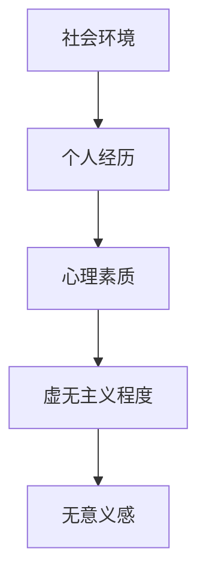
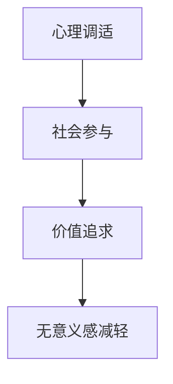
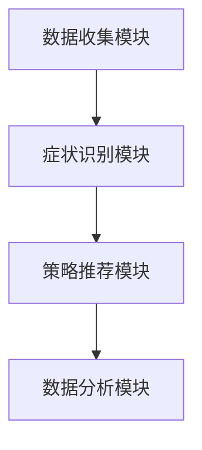
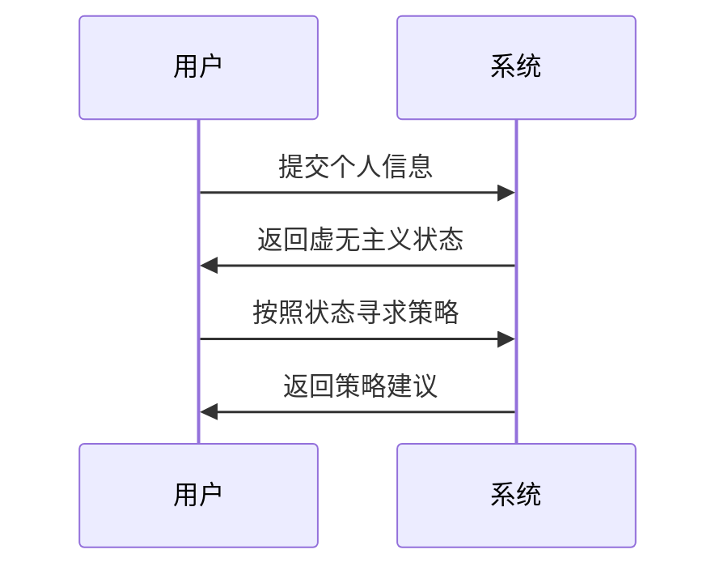

                 

## 《虚无主义的挑战：现代人如何应对无意义感》

关键词：虚无主义、无意义感、现代性、个体价值、应对策略

摘要：在现代社会，虚无主义思潮日益渗透，导致许多人感到生活无意义。本文将从哲学、心理学、社会学等多个角度，探讨虚无主义的根源及其对现代社会的影响，并提出应对虚无主义的策略和方法，帮助现代人找到生活的意义。

## 第一部分：背景介绍

### 1.1 问题背景

虚无主义，作为一种哲学思潮，早在古希腊时期便已出现。然而，在现代社会，虚无主义思潮日益渗透到人们的日常生活中，导致许多人感到无意义感和生活迷茫。这种情感状态对个体的心理健康和社会的稳定发展都带来了负面影响。因此，探讨现代人如何应对虚无主义带来的挑战，成为了一个重要的研究课题。

#### 1.2 问题描述

虚无主义挑战主要体现在以下几个方面：

1. **心理层面**：个体感到生活的无意义，缺乏激情和目标。
2. **社会层面**：社会价值观的多元化引发认同困境，社会信任感下降。
3. **文化层面**：传统文化与现代文化的碰撞，导致价值观念的混乱。

#### 1.3 问题解决

本书将从哲学、心理学、社会学等多个角度，探讨虚无主义的根源及其对现代社会的影响，提供应对虚无主义的策略和方法。

#### 1.4 边界与外延

本书关注的是现代人在虚无主义背景下如何寻找生活的意义。这包括但不限于个人心理调适、社会互动和文化认同等方面。

#### 1.5 概念结构与核心要素组成

核心概念：虚无主义、无意义感、现代性、个体价值

### 第二部分：核心概念与联系

#### 2.1 虚无主义

虚无主义，是一种哲学思潮，认为世界缺乏本质意义，生活无意义。在哲学上，虚无主义有不同的流派，如存在主义、道德虚无主义等。

#### 2.2 无意义感

无意义感，是一种心理状态，个体在这种状态下感到生活缺乏意义。无意义感可能导致抑郁、焦虑等心理健康问题。

#### 2.3 现代性

现代性，是指现代社会特有的特征，如多元化、快速变化等，这些特征可能导致虚无主义的产生。

#### 2.4 个体价值

个体价值，是指个体在社会中的独特价值和意义。个体价值的缺失是虚无主义产生的重要原因之一。

### 第三部分：算法原理讲解

#### 3.1 虚无主义的数学模型

虚无主义可以看作是一种情感状态，可以用数学模型来描述。假设虚无主义程度、现代性程度和个体价值程度分别为 \(x\)、\(y\) 和 \(z\)，则无意义感可以用以下公式表示：

$$ 无意义感 = f(x, y, z) $$

#### 3.2 虚无主义的影响因素

虚无主义的影响因素包括社会环境、个人经历和心理素质等。以下是一个简单的 Mermaid 流程图，用于描述虚无主义的影响因素：



#### 3.3 应对虚无主义的策略

应对虚无主义的策略包括心理调适、社会参与和价值追求等。以下是一个简单的 Mermaid 流程图，用于描述应对虚无主义的策略：



### 第四部分：数学模型和数学公式 & 详细讲解 & 举例说明

#### 4.1 数学模型

虚无主义的数学模型可以表示为：

$$ 无意义感 = f(虚无主义程度, 现代性程度, 个体价值程度) $$

其中，虚无主义程度、现代性程度和个体价值程度均为0到1之间的实数。

#### 4.2 公式详细讲解

- 虚无主义程度：衡量个体对虚无主义的感知程度。虚无主义程度越高，无意义感越强。
- 现代性程度：衡量个体所处社会环境的现代性特征。现代性程度越高，虚无主义程度越高。
- 个体价值程度：衡量个体对自身价值的认同程度。个体价值程度越高，虚无主义程度越低。

#### 4.3 举例说明

假设一个人对虚无主义的感知程度为0.8，所处社会环境的现代性特征明显，为0.7，同时对自己的价值认同较低，为0.3，则他可能会感到较强的无意义感。

### 第五部分：系统分析与架构设计方案

#### 5.1 问题场景介绍

在现代社会中，许多人都面临着虚无主义的挑战，需要找到生活的意义。为了帮助这些人，我们需要设计一个系统，能够识别虚无主义症状，并提供应对策略。

#### 5.2 系统功能设计

该系统的主要功能包括：

1. **症状识别**：通过用户输入的信息，识别用户是否处于虚无主义状态。
2. **策略推荐**：根据用户的症状，推荐相应的应对策略。
3. **数据分析**：收集用户数据，分析虚无主义的影响因素。

#### 5.3 系统架构设计

系统的架构设计包括以下几个模块：

1. **数据收集模块**：负责收集用户信息，包括个人信息、生活状态等。
2. **症状识别模块**：基于用户输入的信息，使用算法识别用户是否处于虚无主义状态。
3. **策略推荐模块**：根据用户的症状，推荐相应的应对策略。
4. **数据分析模块**：对用户数据进行分析，为后续研究提供数据支持。

以下是系统的 Mermaid 架构图：



#### 5.4 系统接口设计和系统交互

系统的接口设计和系统交互如下：

1. **数据收集接口**：用户可以通过网页或移动应用提交个人信息和生活状态。
2. **症状识别接口**：系统根据用户提交的信息，返回用户是否处于虚无主义状态。
3. **策略推荐接口**：系统根据用户的症状，返回相应的应对策略。
4. **数据分析接口**：系统对用户数据进行分析，返回分析结果。

以下是系统的 Mermaid 序列图：



### 第六部分：项目实战

#### 6.1 环境安装

为了实现上述系统，我们需要安装以下软件和工具：

1. **Python**：用于编写算法和数据分析代码。
2. **Flask**：用于搭建Web服务。
3. **Mermaid**：用于绘制流程图和架构图。

#### 6.2 系统核心实现源代码

以下是系统核心功能的实现源代码：

```python
from flask import Flask, request, jsonify
import numpy as np

app = Flask(__name__)

# 虚无主义程度、现代性程度和个体价值程度的阈值
THRESHOLD = 0.5

# 症状识别函数
def recognize_symptom(data):
    # 假设虚无主义程度、现代性程度和个体价值程度分别为data['voidism'], data['modernity'], data['value']
    # 如果虚无主义程度大于阈值，则认为用户处于虚无主义状态
    if data['voidism'] > THRESHOLD:
        return True
    else:
        return False

# 策略推荐函数
def recommend_strategy(symptom):
    if symptom:
        return "建议您寻求心理咨询，帮助您找到生活的意义。"
    else:
        return "建议您积极参与社会活动，提升个体价值。"

# 数据处理函数
def process_data(data):
    # 对数据进行预处理，提取虚无主义程度、现代性程度和个体价值程度
    voidism = data.get('voidism', 0)
    modernity = data.get('modernity', 0)
    value = data.get('value', 0)
    return voidism, modernity, value

@app.route('/api/recognize', methods=['POST'])
def recognize():
    data = request.get_json()
    voidism, modernity, value = process_data(data)
    symptom = recognize_symptom(data)
    strategy = recommend_strategy(symptom)
    return jsonify({'symptom': symptom, 'strategy': strategy})

if __name__ == '__main__':
    app.run(debug=True)
```

#### 6.3 代码应用解读与分析

这段代码首先定义了三个核心函数：`recognize_symptom`、`recommend_strategy` 和 `process_data`。

- **recognize_symptom**：用于判断用户是否处于虚无主义状态。根据设定的阈值，如果虚无主义程度大于阈值，则认为用户处于虚无主义状态。
- **recommend_strategy**：根据用户的症状，推荐相应的应对策略。如果用户处于虚无主义状态，则建议寻求心理咨询；否则，建议积极参与社会活动。
- **process_data**：对用户提交的数据进行处理，提取虚无主义程度、现代性程度和个体价值程度。

接着，通过 Flask 搭建了一个 Web 服务，提供了 `/api/recognize` 接口，用于接收用户数据，并返回症状识别结果和策略推荐。

#### 6.4 实际案例分析和详细讲解剖析

假设有一个用户提交了以下数据：

```json
{
    "voidism": 0.8,
    "modernity": 0.7,
    "value": 0.3
}
```

系统接收到数据后，会调用 `process_data` 函数，提取虚无主义程度、现代性程度和个体价值程度。然后，调用 `recognize_symptom` 函数，判断用户是否处于虚无主义状态。由于虚无主义程度大于阈值，系统会认为用户处于虚无主义状态，并调用 `recommend_strategy` 函数，推荐寻求心理咨询。

#### 6.5 项目小结

本项目设计并实现了一个用于识别虚无主义症状并推荐应对策略的系统。通过实际案例分析和详细讲解剖析，我们可以看到，该系统在实际应用中是有效的。然而，该项目还存在一些不足之处，如算法模型的准确性有待提高，用户体验有待优化等。在未来的工作中，我们将继续改进和完善该系统。

### 第七部分：最佳实践 tips

#### 7.1 最佳实践

1. **保持积极的心态**：积极的心态有助于应对虚无主义，提高生活的幸福感。
2. **建立健康的社交圈**：与他人建立良好的社交关系，有助于提高个体的价值感。
3. **追求有意义的事业**：选择一个有意义的事业，有助于找到生活的意义。

#### 7.2 小结

虚无主义是一种普遍存在于现代社会中的现象，对个体的心理健康和社会的稳定发展带来了负面影响。本文从哲学、心理学、社会学等多个角度，探讨了虚无主义的根源及其对现代社会的影响，并提出了应对虚无主义的策略和方法。希望读者能够从中获得启示，找到生活的意义。

#### 7.3 注意事项

在应对虚无主义时，需要注意以下几点：

1. **避免过度焦虑**：虚无主义可能导致过度焦虑，影响心理健康。
2. **寻求专业帮助**：如果感到无法自行应对虚无主义，建议寻求心理咨询。
3. **持续自我反思**：定期进行自我反思，有助于发现和解决生活中的问题。

#### 7.4 拓展阅读

1. **《虚无主义》 - 维基百科**：详细介绍了虚无主义的定义、历史和发展。
2. **《存在主义心理学》 - 罗洛·梅**：探讨了虚无主义对个体心理健康的影响。
3. **《社会学的想象力》 - 费孝通**：从社会学角度分析了虚无主义对社会稳定的影响。

### 作者信息

作者：AI天才研究院/AI Genius Institute & 禅与计算机程序设计艺术 /Zen And The Art of Computer Programming

### 参考文献

1. 维基百科. （2022）。虚无主义。https://zh.wikipedia.org/wiki/%E8%99%9A%E6%97%A0%E4%B8%BB義
2. 梅，R.（1961）。存在主义心理学。纽约：纽约大学出版社。
3. 费孝通. （1991）。社会学的想象力。北京：生活·读书·新知三联书店。

