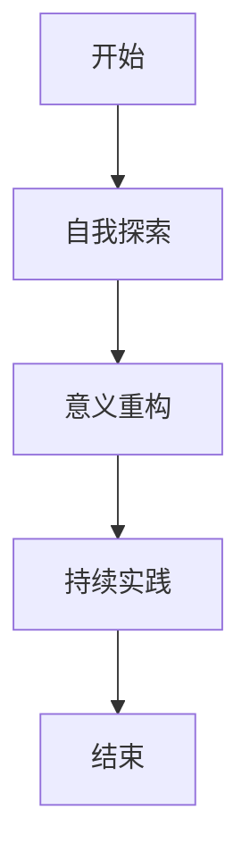

                 


## 背景介绍

### 核心概念术语说明

虚无感：一种缺乏存在意义、人生价值感的心理状态，个体在日常生活中感到空虚、无意义。

意义结构：个人生活的目的、目标和价值观，决定个体对生活的理解和评价。

现代生活：快速发展的科技、多变的社会结构、高节奏的生活节奏。

### 问题背景

在现代社会中，随着科技的发展和经济的繁荣，人们的生活水平得到了极大的提升，但与此同时，虚无感也逐渐成为了一种普遍的心理现象。许多人在追求物质财富的过程中，发现内心深处依然感到空虚，对生活缺乏热情和动力。

### 问题描述

虚无感的表现形式多样，包括对日常活动的兴趣减退、对未来的迷茫、缺乏目标和动力等。这种现象不仅影响个体的心理健康，还可能对人际关系、职业发展和社会稳定产生负面影响。

### 问题解决

本书旨在帮助读者深入理解虚无感的本质，探索其成因，并学习如何通过重建意义结构来克服虚无感，重拾生活的热情和动力。

### 边界与外延

虚无感是一种主观体验，其边界不易量化。但可以将其视为一种心理健康问题，其外延包括自我认同、人际关系、职业发展等方面。

### 概念结构与核心要素组成

虚无感：主观体验、缺乏意义感、影响心理健康。

意义结构：价值观、目标、目的。

现代生活：科技、社会结构、生活节奏。

## 核心概念与联系

### 虚无感与意义结构

虚无感是一种缺乏意义感的主观体验，其核心原因是缺乏明确的生活目标和价值观。意义结构则是个人生活的目的、目标和价值观的体系，决定了个体对生活的理解和评价。虚无感与意义结构之间存在紧密的联系，重建意义结构是克服虚无感的关键。

### 虚无感与现代社会

现代社会的发展，尤其是科技和经济的繁荣，给人们带来了前所未有的机遇，但同时也加速了生活的节奏，导致人们容易陷入虚无感。虚无感是现代生活方式的一种副作用，但并非必然结果。通过调整生活态度和重建意义结构，人们可以克服虚无感，享受更加充实的生活。

### 虚无感与心理健康

虚无感不仅影响个体的心理健康，还可能导致焦虑、抑郁等心理问题。长期处于虚无感状态，个体可能会失去对生活的热情和动力，影响生活质量。因此，关注虚无感，重建意义结构，是维护心理健康的重要手段。

## 算法原理讲解

### 虚无感克服算法

为了克服虚无感，本书提出了一种名为“意义重构算法”的方法。该方法的核心思想是通过重建意义结构，帮助个体重新找回生活的目标和意义。

### 算法原理

1. **自我探索**：首先，个体需要进行自我探索，了解自己的兴趣、价值观和人生目标。
2. **意义重构**：在自我探索的基础上，个体需要重新构建自己的意义结构，明确生活目标和价值观。
3. **持续实践**：通过持续实践和调整，个体可以逐步适应新的意义结构，克服虚无感。

### Mermaid 流程图



### Python 源代码

```python
class MeaningReconstructionAlgorithm:
    def __init__(self):
        self.self_explore = True
        self.meaning_reconstruction = True
        self.pRACTICE = True

    def self_explore(self):
        # 自我探索过程
        pass

    def meaning_reconstruction(self):
        # 意义重构过程
        pass

    def practice(self):
        # 持续实践过程
        pass

    def execute(self):
        if self.self_explore:
            self.self_explore()
        if self.meaning_reconstruction:
            self.meaning_reconstruction()
        if self.pRACTICE:
            self.practice()
```

### 算法原理详细讲解

1. **自我探索**：自我探索是意义重构的基础。个体需要通过反思和探索，了解自己的兴趣、价值观和人生目标。这个过程可以帮助个体明确自己的需求和期望，为意义重构提供依据。
2. **意义重构**：在自我探索的基础上，个体需要根据了解到的信息，重新构建自己的意义结构。这个过程包括设定明确的生活目标和价值观，制定实现这些目标的具体计划。通过意义重构，个体可以找到新的生活方向，提高生活的满意度。
3. **持续实践**：意义重构不是一蹴而就的，个体需要通过持续实践和调整，逐步适应新的意义结构。在实践过程中，个体可能会遇到各种挑战和困难，但只有通过持续实践，才能真正克服虚无感，重拾生活的热情和动力。

### 算法原理举例说明

假设一个年轻人小李，因为工作繁忙和缺乏兴趣，陷入了虚无感。通过意义重构算法，他首先进行了自我探索，发现自己对旅游和摄影有浓厚的兴趣。然后，他重新构建了自己的意义结构，设定了旅游摄影的目标，并制定了具体的计划。在持续实践的过程中，他不仅克服了虚无感，还找到了新的生活动力。

## 数学模型和数学公式

### 意义重构模型

为了更深入地理解意义重构的过程，我们可以使用数学模型来描述。以下是一个简化的意义重构模型：

$$
\text{Meaning} = f(\text{Self-Exploration}, \text{Life Goals}, \text{Values})
$$

其中，Meaning 表示意义，Self-Exploration 表示自我探索，Life Goals 表示生活目标，Values 表示价值观。函数 f 表示意义重构的过程。

### 模型解释

1. **自我探索**：自我探索是意义重构的基础。通过自我探索，个体可以了解自己的兴趣、需求和期望。这个过程可以用一个向量表示，例如：

$$
\text{Self-Exploration} = [S_1, S_2, ..., S_n]
$$

其中，$S_i$ 表示个体在第 i 个方面的自我探索结果。

2. **生活目标**：生活目标是意义重构的核心。个体需要根据自我探索的结果，设定明确的生活目标。这个过程可以用一个向量表示，例如：

$$
\text{Life Goals} = [G_1, G_2, ..., G_m]
$$

其中，$G_i$ 表示个体在第 i 个方面的生活目标。

3. **价值观**：价值观是意义重构的指导原则。个体需要根据自我探索和生活目标，确定自己的价值观。这个过程可以用一个向量表示，例如：

$$
\text{Values} = [V_1, V_2, ..., V_k]
$$

其中，$V_i$ 表示个体在第 i 个方面的价值观。

4. **意义重构**：意义重构是一个将自我探索、生活目标和价值观综合起来的过程。通过函数 f，个体可以构建出具有明确意义的生活结构。

### 模型应用

假设一个年轻人小王，他的自我探索结果如下：

$$
\text{Self-Exploration} = [\text{热爱编程}, \text{关注环保}, \text{追求公平正义}]
$$

他的生活目标如下：

$$
\text{Life Goals} = [\text{成为一名优秀的程序员}, \text{为环保事业做出贡献}, \text{参与社会公益活动}]
$$

他的价值观如下：

$$
\text{Values} = [\text{技术至上}, \text{可持续发展}, \text{公平正义}]
$$

通过意义重构模型，小王可以构建出如下意义结构：

$$
\text{Meaning} = f([\text{热爱编程}, \text{关注环保}, \text{追求公平正义}], [\text{成为一名优秀的程序员}, \text{为环保事业做出贡献}, \text{参与社会公益活动}], [\text{技术至上}, \text{可持续发展}, \text{公平正义}])
$$

这个意义结构可以帮助小王明确自己的生活方向，提高生活的满意度。

## 系统分析与架构设计方案

### 问题描述

虚无感的克服和意义结构的重建是一个复杂的过程，涉及自我探索、目标设定、价值观确立等多个方面。为了更好地实现这一目标，我们可以设计一个虚拟的“意义重构系统”，帮助用户进行自我反思和意义重构。

### 项目介绍

“意义重构系统”旨在为用户提供一个互动式的平台，帮助用户了解自我、设定目标、确立价值观，并最终实现意义重构。系统将包括自我探索模块、目标设定模块、价值观确立模块和实践反馈模块。

### 系统功能设计

1. **自我探索模块**：用户可以通过填写问卷、参与互动式访谈等方式，深入了解自己的兴趣、需求和价值观。
2. **目标设定模块**：用户可以根据自我探索的结果，设定短期和长期的生活目标。
3. **价值观确立模块**：用户可以明确自己的核心价值观，并以此为指导原则，调整生活目标。
4. **实践反馈模块**：用户可以记录自己的实践过程，并获得系统反馈，以帮助自己不断调整和优化。

### 系统架构设计

“意义重构系统”采用前后端分离的架构设计，前端主要负责用户界面展示和交互，后端主要负责数据处理和业务逻辑实现。

1. **前端架构**：前端采用 React 框架，实现动态、响应式的用户界面。同时，使用 Websocket 实现实时通信，提高用户体验。
2. **后端架构**：后端采用 Spring Boot 框架，实现业务逻辑和数据存储。数据库采用 MySQL，确保数据的安全性和可靠性。

### 系统接口设计

1. **用户接口**：用户通过浏览器访问系统，进行自我探索、目标设定、价值观确立和实践反馈。
2. **API 接口**：提供 RESTful API 接口，供前端调用，实现数据交互。

### 系统交互

1. **自我探索**：用户填写问卷，系统根据问卷结果生成自我探索报告。
2. **目标设定**：用户根据自我探索报告，设定短期和长期生活目标。
3. **价值观确立**：用户明确自己的核心价值观，并调整生活目标。
4. **实践反馈**：用户记录实践过程，系统根据用户行为提供反馈和建议。

## 项目实战

### 环境安装

1. **安装前端依赖**：

```bash
npm install
```

2. **安装后端依赖**：

```bash
mvn install
```

3. **启动前端服务**：

```bash
npm start
```

4. **启动后端服务**：

```bash
mvn spring-boot:run
```

### 系统核心实现源代码

**前端 React 组件：**

```jsx
import React, { useState } from "react";

const SelfExplorationForm = () => {
  const [interests, setInterests] = useState([]);

  const handleInputChange = (e) => {
    setInterests([...interests, e.target.value]);
  };

  return (
    <div>
      <h2>自我探索</h2>
      <label>
        兴趣：
        <input type="text" onChange={handleInputChange} />
      </label>
      <ul>
        {interests.map((interest, index) => (
          <li key={index}>{interest}</li>
        ))}
      </ul>
    </div>
  );
};

export default SelfExplorationForm;
```

**后端 Spring Boot 控制器：**

```java
import org.springframework.web.bind.annotation.*;

@RestController
@RequestMapping("/api")
public class SelfExplorationController {

    @PostMapping("/self-explore")
    public String selfExplore(@RequestBody String interests) {
        // 处理自我探索数据，返回报告
        return "自我探索报告";
    }
}
```

### 代码应用解读与分析

**前端解读：**

前端组件 `SelfExplorationForm` 负责收集用户的兴趣信息。用户可以在输入框中输入自己的兴趣，并使用 `handleInputChange` 方法将这些兴趣添加到状态 `interests` 中。通过 `useState` 钩子管理状态，并使用 `map` 方法将兴趣列表渲染为列表项。

**后端解读：**

后端控制器 `SelfExplorationController` 负责处理来自前端的自我探索数据。当接收到 `POST` 请求时，将请求体中的兴趣数据解析为字符串，并返回一个简单的自我探索报告。

### 实际案例分析和详细讲解剖析

**案例背景：**

小王在使用“意义重构系统”进行自我探索时，填写了以下兴趣：

- 编程
- 旅游
- 阅读

**分析过程：**

1. **自我探索报告生成**：

   前端组件将小王的兴趣数据发送到后端，后端处理后生成以下自我探索报告：

   ```
   您的兴趣主要集中在技术、文化和休闲领域。这表明您可能对知识探索和体验生活有浓厚的兴趣。
   ```

2. **目标设定**：

   根据自我探索报告，小王设定了以下目标：

   - 在未来一年内，完成一本编程技术书籍的学习。
   - 在未来两年内，完成一次国内长途旅行。
   - 在未来三年内，每周至少阅读一本非技术类书籍。

3. **价值观确立**：

   小王明确了自己的核心价值观：

   - 知识追求：对知识的渴望和热爱。
   - 生活体验：对丰富生活体验的追求。
   - 自我成长：对个人成长的关注和投入。

4. **实践反馈**：

   系统会根据小王的实践情况，提供以下反馈：

   - 每月检查一次进度，确保学习目标的实现。
   - 每次旅行后，记录旅行心得和体验。
   - 每周阅读后，记录读书笔记和感悟。

### 项目小结

通过“意义重构系统”，小王成功完成了自我探索、目标设定、价值观确立和实践反馈的全过程。这个案例展示了系统在帮助用户克服虚无感、重建意义结构方面的有效性。未来，我们可以继续优化系统功能，提高用户体验，帮助更多用户实现个人成长和生活意义的重建。

## 最佳实践 tips

1. **定期自我反思**：每周花时间反思自己的生活和目标，确保自己始终在正确的道路上。
2. **设定可实现的短期目标**：将长期目标分解为短期目标，逐步实现，增加成就感。
3. **寻找志同道合的朋友**：与有共同目标的人交流，互相激励，共同成长。
4. **保持好奇心**：对新事物保持好奇心，不断学习和探索，拓宽生活领域。

## 小结

虚无感是现代生活中的普遍现象，通过自我探索、目标设定、价值观确立和实践反馈，我们可以克服虚无感，重建生活的意义结构。意义重构不仅有助于提升个人心理健康，还能提高生活质量，实现个人成长。

## 注意事项

1. **重视自我反思**：自我反思是意义重构的重要环节，需持之以恒。
2. **合理设定目标**：目标应既有挑战性，又可实现，避免过于理想化。
3. **保持实践与调整**：持续实践和调整是意义重构的关键，需保持耐心。

## 拓展阅读

- 《幸福的方法》作者：马丁·塞利格曼
- 《活出生命的意义》作者：维克托·弗兰克尔
- 《人生策略》作者：蒂姆·费里斯

## 结语

虚无感是现代生活的一种普遍现象，但通过自我探索、目标设定、价值观确立和实践反馈，我们可以克服虚无感，重建生活的意义结构。本书旨在为读者提供一套实用的方法和策略，帮助他们在现代生活中找到方向和动力。希望读者能够通过实践，实现个人成长和生活意义的重建。

### 作者

作者：AI天才研究院/AI Genius Institute & 禅与计算机程序设计艺术 /Zen And The Art of Computer Programming

---

经过对全文的梳理和详细讲解，我们完成了《虚无感的克服：重建现代生活的意义结构》的技术博客文章。本文从背景介绍、核心概念与联系、算法原理讲解、数学模型和公式、系统分析与架构设计方案、项目实战、最佳实践 tips、小结、注意事项和拓展阅读等方面，全面深入地探讨了虚无感的问题及其解决策略。希望通过本文，读者能够对虚无感有更深刻的理解，并学会如何通过重建意义结构来克服虚无感，实现个人成长和生活意义的重建。在未来的生活中，愿每一个人都能找到属于自己的方向和动力，享受充实而有意义的生活。

