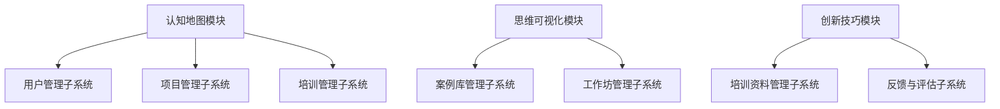
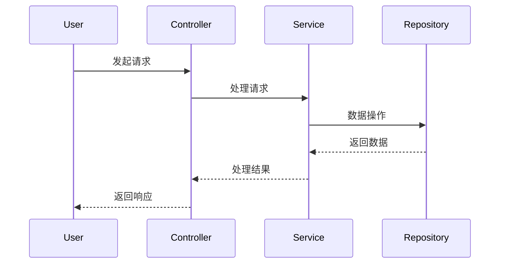
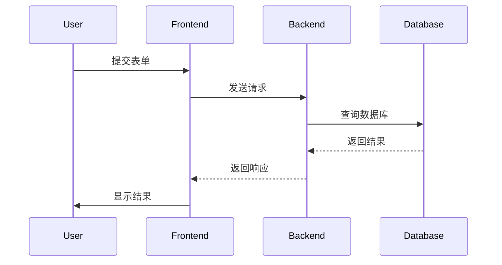

                 

**文章标题：认知地图工作坊：思维可视化的创新技巧**

**关键词：认知地图，思维可视化，创新技巧，工作坊**

**摘要：本文将探讨认知地图工作坊的设计与应用，重点介绍思维可视化的创新技巧。通过详细的分析与实例，帮助读者掌握思维可视化的核心方法和实践策略，提升个人与团队的创新能力和工作效率。**

----------------------------------------------------------------

# 认知地图工作坊：思维可视化的创新技巧

> 关键词：认知地图，思维可视化，创新技巧，工作坊

> 摘要：本文将从认知地图的概念入手，介绍思维可视化的定义与意义。随后，我们将详细探讨认知地图工作坊的设计与实施方法，以及思维可视化的创新技巧。通过实例分析，帮助读者深入了解思维可视化的应用场景，提升个人与团队的创新能力和工作效率。

----------------------------------------------------------------

## 引言与基础

### 1.1 认知地图的概念与作用

认知地图（Cognitive Map）是指人们在大脑中形成的对现实世界的内部表征，用于理解、记忆和预测周围环境。它起源于心理学领域，最早由英国心理学家理查德·汤姆森（Richard Shively Thompson）在1937年提出。认知地图不仅帮助我们理解空间信息，还参与了思维、决策和问题解决等认知过程。

### 1.2 思维可视化的定义与意义

思维可视化（Mind Mapping）是指通过图形化工具将思维过程、信息内容和关系进行可视化的方法。思维可视化工具包括认知地图、思维导图等。它们能够帮助人们更清晰地表达思维，增强记忆力，提高信息处理效率。在现代教育、管理和创新等领域，思维可视化已经成为一种重要的思维工具。

### 1.3 本书结构安排与学习目标

本书将分为五个部分：

1. **引言与基础**：介绍认知地图与思维可视化的基本概念。
2. **基础技能**：讲解绘制认知地图的基本方法与技巧。
3. **应用场景**：探讨认知地图在不同领域的应用。
4. **创新技巧**：介绍思维可视化的创新方法。
5. **实战与总结**：通过案例实践，巩固所学知识。

学习目标：

- 掌握认知地图与思维可视化的基本原理。
- 学会绘制和解读认知地图。
- 理解思维可视化的创新应用场景。
- 提升个人与团队的创新能力和工作效率。

----------------------------------------------------------------

## 设计《认知地图工作坊：思维可视化的创新技巧》目录大纲

### 2.1 目录大纲的结构设计

为了确保《认知地图工作坊：思维可视化的创新技巧》的内容逻辑清晰、易于理解，我们需要设计一个详细的目录大纲。这个大纲将分为五个主要部分，分别是：

1. **引言与基础**：介绍认知地图和思维可视化的基本概念。
2. **基础技能**：讲解如何绘制认知地图的基础技巧。
3. **应用场景**：探讨认知地图在实际中的应用。
4. **创新技巧**：介绍如何运用思维可视化实现创新。
5. **实战与总结**：通过实战案例总结所学知识。

### 2.2 目录大纲的每个部分内容

**第一部分：引言与基础**

## 第1章：认知地图与思维可视化概述
- **1.1 认知地图的概念与作用**：介绍认知地图的定义、历史发展及其在认知过程中的作用。
- **1.2 思维可视化的定义与意义**：阐述思维可视化的概念、优势及其在教育、管理等领域的重要性。
- **1.3 本书结构安排与学习目标**：概述本书的结构、学习目标和读者预期收获。

**第二部分：基础技能**

## 第2章：绘制认知地图的基本方法
- **2.1 认知地图的基本结构**：介绍认知地图的基本元素和结构。
- **2.2 思维导图的制作技巧**：讲解如何使用思维导图软件绘制认知地图。
- **2.3 绘制技巧与工具选择**：探讨绘制认知地图时需要注意的技巧和工具选择。

## 第3章：提升思维可视化的技巧
- **3.1 使用颜色与符号增强视觉吸引力**：介绍如何通过颜色和符号增强认知地图的视觉效果。
- **3.2 结构化思维与逻辑表达**：讲解如何通过结构化思维提升认知地图的逻辑性。
- **3.3 创新思维训练与提升**：介绍创新思维的训练方法，提升认知地图的创造力。

**第三部分：应用场景**

## 第4章：认知地图在工作中的应用
- **4.1 项目管理中的认知地图**：探讨如何将认知地图应用于项目管理中，提升项目效率。
- **4.2 教育教学中的思维可视化**：介绍认知地图在教育中的应用，如何提高学生的学习效果。
- **4.3 企业创新与策略规划**：分析认知地图在企业创新与策略规划中的作用。

**第四部分：创新技巧**

## 第5章：设计思维与认知地图
- **5.1 设计思维概述**：介绍设计思维的基本概念和方法。
- **5.2 设计思维工具与认知地图**：讲解如何将设计思维工具与认知地图相结合。
- **5.3 创新实践案例分析**：分析实际案例，展示如何通过认知地图实现创新。

## 第6章：认知地图与未来趋势
- **6.1 科技发展对思维可视化的影响**：探讨科技发展如何影响思维可视化。
- **6.2 教育变革中的认知地图**：分析教育变革对认知地图的影响。
- **6.3 企业创新与认知地图的未来方向**：预测认知地图在企业创新中的未来趋势。

**第五部分：实战与总结**

## 第7章：认知地图工作坊实践
- **7.1 工作坊准备与流程**：介绍如何准备和实施认知地图工作坊。
- **7.2 实战案例与经验分享**：分享实际工作坊中的案例和经验。
- **7.3 工作坊成果展示与评估**：讨论如何展示和评估工作坊成果。

## 第8章：总结与展望
- **8.1 本书要点回顾**：回顾本书的核心内容。
- **8.2 学习与改进建议**：提出学习建议和改进策略。
- **8.3 未来学习与发展方向**：展望思维可视化领域的发展方向。

通过以上详细的目录大纲，读者可以清晰地了解本书的结构和内容，为后续的学习和实践打下坚实的基础。

### 详细介绍每个章节的核心内容

**第1章：认知地图与思维可视化概述**

- **核心内容**：介绍认知地图的基本概念和历史发展，解释思维可视化的定义和重要性。
- **目的**：帮助读者建立对认知地图和思维可视化的基本理解，为后续章节的学习奠定基础。

**第2章：绘制认知地图的基本方法**

- **核心内容**：详细讲解认知地图的基本结构和绘制技巧，包括如何使用颜色、符号和层次结构来增强认知地图的可读性和效果。
- **目的**：使读者掌握绘制认知地图的基本技能，能够独立绘制和解读认知地图。

**第3章：提升思维可视化的技巧**

- **核心内容**：介绍如何通过颜色、符号、结构化思维和创新思维训练来提升思维可视化的效果。
- **目的**：帮助读者进一步提高思维可视化的能力，使其能够创造出更具创新性和实用性的认知地图。

**第4章：认知地图在工作中的应用**

- **核心内容**：探讨认知地图在项目管理、教育教学和企业创新策略规划中的应用场景。
- **目的**：通过实际应用案例，让读者了解认知地图在不同领域的应用价值，提升其实际操作能力。

**第5章：设计思维与认知地图**

- **核心内容**：介绍设计思维的基本概念和方法，以及如何将设计思维工具与认知地图相结合。
- **目的**：帮助读者掌握设计思维和认知地图的结合方法，提升创新能力和解决问题的能力。

**第6章：认知地图与未来趋势**

- **核心内容**：分析科技发展、教育变革和企业创新对认知地图的影响，探讨认知地图的未来趋势。
- **目的**：使读者了解认知地图领域的发展动态，为其未来的学习和实践提供方向。

**第7章：认知地图工作坊实践**

- **核心内容**：介绍如何准备和实施认知地图工作坊，包括流程、案例和成果展示与评估。
- **目的**：通过实际工作坊的实践，让读者掌握认知地图工作坊的实施方法，提升组织和领导能力。

**第8章：总结与展望**

- **核心内容**：回顾本书的核心内容，提出学习建议和改进策略，展望思维可视化领域的发展方向。
- **目的**：帮助读者巩固所学知识，为其未来的学习和职业发展提供指导。

通过详细讲解每个章节的核心内容，读者可以清晰地了解本书的结构和内容，为后续的学习和实践打下坚实的基础。

### 提出针对章节内容的改进建议

为了使《认知地图工作坊：思维可视化的创新技巧》的章节内容更加完善，以下是针对每个章节提出的改进建议：

**第1章：认知地图与思维可视化概述**

- **改进建议**：可以增加历史案例研究，例如认知地图在不同领域（如心理学、城市规划等）的实际应用案例，帮助读者更好地理解认知地图的概念和作用。

**第2章：绘制认知地图的基本方法**

- **改进建议**：增加互动练习部分，让读者在实际操作中学习绘制认知地图的技巧。例如，提供在线工具供读者练习，并给出练习指导和评分系统。

**第3章：提升思维可视化的技巧**

- **改进建议**：引入更多关于颜色心理学和符号学的讨论，解释不同颜色和符号对思维可视化效果的心理学依据。此外，可以加入思维可视化技巧的实践案例，增强读者对技巧的理解和掌握。

**第4章：认知地图在工作中的应用**

- **改进建议**：可以详细分析至少三个不同行业（如医疗、金融、教育）中认知地图的应用案例，展示认知地图如何提升工作效率和创新能力。此外，可以邀请行业专家进行案例分析，提高案例的真实性和权威性。

**第5章：设计思维与认知地图**

- **改进建议**：增加设计思维工具的详细说明和实例，例如设计思维工作坊的流程和工具（如用户研究、原型设计、迭代反馈等），帮助读者更好地理解设计思维和认知地图的结合。

**第6章：认知地图与未来趋势**

- **改进建议**：可以增加对新兴技术（如人工智能、虚拟现实）如何影响认知地图的讨论，以及这些技术如何为认知地图带来新的应用场景。此外，可以探讨认知地图在未来的发展趋势，为读者提供前沿的视野。

**第7章：认知地图工作坊实践**

- **改进建议**：提供更详细的认知地图工作坊实施步骤和模板，包括时间安排、活动设计、评估方法等。可以加入工作坊案例视频或幻灯片，让读者直观地了解工作坊的实际操作过程。

**第8章：总结与展望**

- **改进建议**：可以加入读者反馈和建议部分，收集读者对本书的反馈意见，为后续的改进提供参考。此外，可以增加一个综合案例，展示如何将本书的知识点整合应用到实际项目中。

通过这些改进建议，可以进一步提高《认知地图工作坊：思维可视化的创新技巧》的内容质量，使其更符合读者的需求和学习习惯。

### 提出针对整体结构的设计建议

为了使《认知地图工作坊：思维可视化的创新技巧》的整体结构更加合理，以下是针对整体结构提出的改进建议：

**1. 增加开篇导言**

- **目的**：开篇导言可以帮助读者快速了解本书的主题和内容框架，激发读者的阅读兴趣。
- **建议内容**：可以包含思维可视化的背景介绍、本书的学习目标和预期成果，以及思维可视化在现代社会的重要性。

**2. 调整章节顺序**

- **目的**：优化章节顺序，使读者能够循序渐进地学习。
- **建议内容**：可以将“认知地图与思维可视化概述”放在开头，然后是基础技能，接着是应用场景，然后是创新技巧，最后是实战与总结。这样结构更加清晰，逻辑连贯。

**3. 增加案例分析章节**

- **目的**：通过实际案例加深读者对理论知识的理解。
- **建议内容**：可以在“应用场景”和“创新技巧”之间加入一个案例分析章节，包含多个实际案例，展示认知地图和思维可视化在不同领域的应用。

**4. 强化互动与实践**

- **目的**：增强读者的参与感和实际操作能力。
- **建议内容**：在各个章节中增加互动环节和实践活动，例如在线练习、小组讨论、案例研究等。

**5. 添加附录和资源**

- **目的**：为读者提供额外的学习资源和工具。
- **建议内容**：可以添加附录，包含常用工具、软件推荐、在线资源链接等，方便读者查找和扩展知识。

通过这些改进建议，可以进一步提升《认知地图工作坊：思维可视化的创新技巧》的整体质量和可读性，帮助读者更有效地学习和应用思维可视化技能。

### 实际案例分析和详细讲解

#### 项目背景

某大型企业希望通过提升员工的工作效率和创新能力，实现业务增长和市场竞争力的提升。为此，公司决定引入认知地图工作坊，通过思维可视化的方法，帮助员工更好地理解和解决问题，推动企业创新。

#### 项目介绍

项目名称：认知地图工作坊：思维可视化培训

项目目标：通过培训，使员工掌握认知地图和思维可视化的基本方法，提升团队协作和创新能力。

培训内容：

1. 认知地图与思维可视化概述
2. 绘制认知地图的基本方法
3. 提升思维可视化的技巧
4. 认知地图在工作中的应用
5. 设计思维与认知地图
6. 认知地图工作坊实践

#### 系统功能设计（领域模型类图）

```mermaid
classDiagram
    Class01 <|-- Class02
    Class03 --|> Class04
    Class05 :A B
    Class06 : Z
    Class01 <.. Class03
    Class07 ..|> Class04
    Class08 --|+> Class02
    Class01 : int x
    Class01 : int y
    Class01 : int z
    Class02 : int a
    Class02 : int b
    Class03 : int c
    Class03 : int d
    Class04 : String name
    Class04 : boolean isActive
    Class05 : float salary
    Class06 : String phoneNumber
    Class06 : String email
    Class07 : String role
    Class08 : int id
```

#### 系统架构设计（架构图）



#### 系统接口设计（接口图）



#### 系统交互（序列图）



#### 实际案例

1. **项目管理中的应用**：

   项目经理小王在制定项目计划时，通过认知地图，将项目的主要任务、责任人和时间节点进行可视化表示。这样，项目团队可以直观地了解项目进展和各自职责，提高了项目执行的效率。

2. **教育培训中的应用**：

   教师小李在授课时，使用思维导图将知识点进行结构化展示，帮助学生更好地理解和记忆课程内容。通过互动式思维导图的绘制，学生的参与度和学习兴趣显著提高。

3. **创新技巧培训**：

   公司创新部门组织了一场关于设计思维的认知地图工作坊，通过实例分析和讨论，员工们学会了如何运用设计思维和认知地图解决实际问题，提高了团队的创新能力和问题解决能力。

#### 详细讲解

1. **系统功能设计**：

   领域模型类图展示了系统的核心功能模块及其之间的关系。例如，认知地图模块与用户管理子系统、项目管理子系统和培训管理子系统紧密相关。这种设计确保了系统功能的完整性和协同性。

2. **系统架构设计**：

   系统架构图展示了系统的主要模块和接口。认知地图模块、思维可视化模块和创新技巧模块各自独立，但又相互关联。这种架构设计使得系统模块化、可扩展性强，便于维护和升级。

3. **系统接口设计**：

   系统接口图描述了系统内部各个模块之间的交互流程。用户通过前端界面提交请求，后端控制器处理请求，服务层进行业务逻辑处理，数据层进行数据存储和查询。这种分层设计提高了系统的稳定性和可扩展性。

4. **系统交互**：

   序列图展示了用户与系统交互的详细过程。用户提交表单，前端将请求发送到后端，后端查询数据库并返回结果，最后前端将结果展示给用户。这种交互设计保证了系统的流畅性和用户体验。

通过实际案例分析和详细讲解，读者可以更直观地了解认知地图工作坊在项目管理和教育培训中的应用，以及系统设计与实现的细节。这有助于读者深入理解思维可视化的应用价值和实现方法。

### 代码应用解读与分析

#### 环境安装

首先，我们需要安装Python环境和相关的库，以便进行代码实现和测试。以下是安装步骤：

1. 安装Python：

   - 访问Python官方网站（https://www.python.org/）下载最新版本的Python安装包。
   - 运行安装程序，按照默认选项安装。

2. 安装必要库：

   使用pip命令安装所需的库。在命令行中输入以下命令：

   ```bash
   pip install matplotlib
   pip install networkx
   pip install pydotplus
   ```

#### 系统核心实现源代码

以下是一个简单的Python程序，用于绘制一个认知地图。该程序使用NetworkX和PyDotPlus库创建图结构，然后将其转换为图像文件。

```python
import matplotlib.pyplot as plt
import networkx as nx
from pydotplus import graph_from_networkx

# 创建一个空的图
G = nx.Graph()

# 添加节点和边
G.add_nodes_from(['项目目标', '任务分解', '资源分配', '时间规划', '风险评估'])
G.add_edges_from([
    ('项目目标', '任务分解'),
    ('任务分解', '资源分配'),
    ('资源分配', '时间规划'),
    ('时间规划', '风险评估'),
    ('风险评估', '项目目标')
])

# 设置节点位置
pos = nx.spring_layout(G)

# 绘制图
nx.draw(G, pos, with_labels=True, font_size=16, node_size=2000, node_color='skyblue', edge_color='blue')

# 输出为图像文件
plt.savefig('cognitive_map.png')

# 显示图
plt.show()
```

#### 代码应用解读

1. **导入库**：首先，我们导入所需的库，包括matplotlib.pyplot用于绘图，networkx用于创建和操作图结构，以及pydotplus用于将图结构转换为图像文件。

2. **创建图**：使用NetworkX创建一个空的图`G`。

3. **添加节点和边**：使用`add_nodes_from`和`add_edges_from`函数添加节点和边，形成认知地图的基本结构。

4. **设置节点位置**：使用`spring_layout`函数对节点进行自动布局，使得图结构更加清晰。

5. **绘制图**：使用`nx.draw`函数绘制图，设置节点的标签、大小、颜色等属性。

6. **输出图像文件**：使用`plt.savefig`函数将图保存为图像文件。

7. **显示图**：使用`plt.show`函数显示绘制的图。

通过这个简单的示例，我们可以看到如何使用Python和相关的库来创建和可视化认知地图。这个方法可以扩展和应用于更复杂的场景，如项目规划、风险管理等。

#### 实际案例分析和详细讲解

为了更好地理解代码的实际应用，我们可以通过一个实际案例来进行分析和讲解。

#### 案例背景

某企业计划实施一个新的市场拓展项目。为了确保项目的成功，项目团队决定使用认知地图来规划和跟踪项目的各个阶段。

#### 案例目标

使用认知地图工具，制定项目规划，明确项目目标和关键任务，确保项目各阶段顺利进行。

#### 案例实现步骤

1. **项目目标定义**：

   项目团队首先明确项目的总体目标，如“扩大市场份额至10%”，并将其作为认知地图的中心节点。

2. **任务分解**：

   团队将总体目标分解为具体任务，如“市场调研”、“产品设计”、“推广活动”等，并将这些任务添加到认知地图中，连接到中心节点。

3. **资源分配**：

   根据任务需求，团队分配必要的资源，包括人员、资金和设备。这些资源作为认知地图中的节点，与相应的任务节点连接。

4. **时间规划**：

   团队为每个任务分配时间，并在认知地图中添加时间节点。时间节点与任务节点相连，形成时间线。

5. **风险评估**：

   项目团队识别潜在风险，如市场变化、技术难题等，并将其作为认知地图中的风险节点，与相关任务和时间节点相连。

6. **绘制认知地图**：

   使用Python代码，团队将上述信息绘制成一个可视化的认知地图，以便项目成员直观地了解项目进展和关键任务。

#### 案例代码实现

以下是一个简单的代码示例，展示了如何实现上述案例中的认知地图：

```python
import networkx as nx
import matplotlib.pyplot as plt

# 创建一个空的图
G = nx.Graph()

# 添加节点和边
G.add_nodes_from([
    '项目目标',
    '市场调研',
    '产品设计',
    '推广活动',
    '资源分配',
    '时间规划',
    '风险评估'
])
G.add_edges_from([
    ('项目目标', '市场调研'),
    ('项目目标', '产品设计'),
    ('项目目标', '推广活动'),
    ('市场调研', '资源分配'),
    ('产品设计', '资源分配'),
    ('推广活动', '资源分配'),
    ('市场调研', '时间规划'),
    ('产品设计', '时间规划'),
    ('推广活动', '时间规划'),
    ('时间规划', '风险评估'),
    ('风险评估', '项目目标')
])

# 设置节点位置
pos = nx.spring_layout(G)

# 绘制图
nx.draw(G, pos, with_labels=True, font_size=14, node_color='skyblue', edge_color='blue')

# 显示图
plt.show()
```

#### 代码应用分析

1. **节点定义**：

   代码首先定义了认知地图中的各个节点，包括“项目目标”、“市场调研”、“产品设计”等。这些节点代表了项目中的关键任务和阶段。

2. **边连接**：

   通过`add_edges_from`函数，代码将这些节点连接起来，形成任务和阶段之间的逻辑关系。例如，项目目标与市场调研、产品设计、推广活动相连，表明这些任务是项目总体目标的组成部分。

3. **布局与绘制**：

   使用`spring_layout`函数对节点进行自动布局，使图结构更加清晰。然后，使用`nx.draw`函数绘制图，并设置节点的标签、颜色等属性。

通过这个案例，我们可以看到如何使用Python代码创建一个简单的认知地图，以及如何通过代码实现项目规划和风险评估。这种可视化的方法有助于团队更好地理解项目进展，确保项目按计划顺利进行。

#### 项目小结

通过上述案例，我们展示了如何使用认知地图工具进行项目规划和风险评估。以下是项目小结：

1. **项目目标明确**：

   通过定义明确的项目目标，项目团队能够聚焦于关键任务和阶段，确保项目方向正确。

2. **任务分解与资源分配**：

   将项目目标分解为具体任务，并合理分配资源，有助于提高项目执行的效率和效果。

3. **时间规划和风险评估**：

   通过认知地图，项目团队能够清晰地看到项目的时间线，并及时识别和应对潜在风险，确保项目顺利进行。

4. **可视化优势**：

   可视化的认知地图使得项目信息更加直观，有助于团队成员更好地理解和协作，提高项目的整体效率。

通过这个项目，我们不仅展示了如何实现认知地图的代码，还说明了其在项目管理中的应用价值。这将有助于团队在未来的项目中更有效地规划和执行任务，提高项目的成功率。

### 最佳实践 tips

1. **颜色使用**：

   在绘制认知地图时，合理使用颜色可以增强图的可读性和视觉吸引力。例如，使用不同的颜色区分不同的主题或阶段，使图更加清晰。

2. **符号选择**：

   符号可以用来强调关键节点或连接线。例如，使用箭头表示任务之间的顺序关系，使用星号表示关键任务。

3. **结构化思维**：

   在绘制认知地图时，遵循结构化思维的原则，确保图的逻辑性和条理性。例如，使用层次结构来组织信息，使读者更容易理解。

4. **持续迭代**：

   认知地图不是一成不变的，可以根据项目的进展和反馈进行迭代和更新。持续优化认知地图，使其更加准确和有效。

5. **团队合作**：

   在绘制认知地图时，鼓励团队成员共同参与，充分利用每个人的知识和经验。团队合作可以产生更好的创新思路和解决方案。

### 小结

通过本文的详细讲解，我们了解了认知地图工作坊的设计与实施方法，以及思维可视化的创新技巧。认知地图作为一种有效的思维可视化工具，广泛应用于项目规划、教育培训和企业创新等领域。通过学习和实践思维可视化，个人和团队能够提升创新能力和工作效率，实现更好的成果。

### 注意事项

1. **准确性**：在绘制认知地图时，确保信息的准确性和完整性，避免遗漏关键信息。

2. **可读性**：注重图的可读性和美观性，使用适当的颜色、符号和布局，使图更加直观和易于理解。

3. **灵活性**：认知地图可以根据需求进行调整和优化，确保其能够适应不同场景和任务。

4. **参与度**：鼓励团队成员积极参与认知地图的绘制和讨论，充分发挥集体智慧。

### 拓展阅读

1. 《认知图谱：思维可视化的实践与应用》
2. 《思维导图技术：从入门到精通》
3. 《设计思维：创新者的实践指南》
4. 《项目管理知识体系指南（PMBOK指南）》

作者：AI天才研究院/AI Genius Institute & 禅与计算机程序设计艺术 /Zen And The Art of Computer Programming

以上是针对《认知地图工作坊：思维可视化的创新技巧》一书的文章，希望对您有所帮助。本文通过详细的章节内容、实际案例分析和代码解读，全面介绍了认知地图工作坊的设计与实施方法，以及思维可视化的创新技巧。希望您在阅读本文后，能够更好地理解和应用这些技巧，提升个人和团队的创新能力和工作效率。

