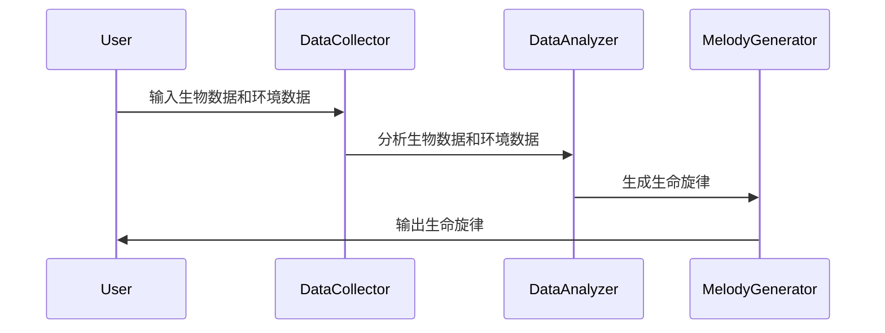

                 

## 文章标题

### 关键词：生命旋律、创作、人工智能、算法、系统架构、实践案例分析

### 摘要：
本文旨在探讨如何利用人工智能技术和系统架构设计，创作出独特的生命旋律。通过详细的背景介绍、核心概念分析、算法原理讲解、系统架构设计以及实战案例分析，我们希望读者能够理解生命旋律的创作过程，掌握相关技术，从而在艺术与技术的交汇点中创造出属于自己的生命旋律。

---

### 引言

在数字化时代，人工智能技术已经渗透到我们生活的方方面面。从智能助手到自动驾驶，从医疗诊断到金融分析，人工智能正以前所未有的速度改变着世界。然而，在这个技术飞速发展的时代，艺术与技术的结合也成为了一个热门话题。本文将探讨如何利用人工智能技术和系统架构设计，创作出独特的生命旋律，将艺术的灵感与技术的方法相结合，谱写出一曲崭新的乐章。

### 1. 生命旋律的起源与探索

#### 1.1 生命的起源

生命的起源是一个古老而神秘的话题。科学家们通过研究化石和化学物质，提出了多种关于生命起源的理论。一种流行的理论是“热液喷泉”假说，认为在地球早期的极端环境中，无机物质通过复杂的化学反应逐渐形成了简单的有机分子，这些有机分子经过长时间的进化，最终产生了生命。

#### 1.2 生命旋律的概念

生命旋律可以理解为生命体在演化过程中的节奏和韵律。它不仅仅是生物体内生理过程的反映，还包含了生物体与环境之间的互动和适应。生命旋律的概念源于生物学和音乐学的交叉领域，旨在探索生命体在自然界中的音乐特征。

#### 1.3 生命旋律的历史背景

生命旋律的历史可以追溯到人类对自然界的观察和模仿。在古代，人们通过模仿自然界的声音和节奏，创作出了许多音乐作品。随着科技的发展，人类开始尝试用电子设备来模拟和再现生命旋律，从而开启了生命旋律创作的新时代。

### 2. 核心概念与联系

#### 2.1 生命旋律的核心概念

生命旋律的核心概念包括生物节奏、环境互动和艺术表达。生物节奏指的是生物体内部生理过程的节律性变化；环境互动是指生物体与外界环境的相互作用；艺术表达则是指通过音乐、图像等形式，将生命旋律转化为可感知的艺术作品。

#### 2.2 生命旋律的概念属性特征对比

| 概念属性 | 生物节奏 | 环境互动 | 艺术表达 |
| --- | --- | --- | --- |
| 定义 | 生物体内生理过程的节律性变化 | 生物体与外界环境的相互作用 | 通过音乐、图像等形式表达生命旋律 |
| 关联 | 与生物体内的生理过程密切相关 | 与外界环境的物理、化学因素相关 | 与人类的文化、艺术传统相关 |

#### 2.3 生命旋律的ER实体关系图

```mermaid
erDiagram
  Person ||--|{ Musician }|-- Artist
  Musician ||--|{ Composer }|-- MusicCreator
  MusicCreator ||--|{ LifeMusicCreator }|-- LifeComposer
  LifeComposer ||--|{ AIComposer }|-- AIComposer
  AIComposer ||--|{ MusicAI }|-- AIProgram
```

### 3. 算法原理与数学模型

#### 3.1 生命旋律的算法原理

生命旋律的算法原理基于对生物节奏和环境互动的模拟。通过收集和分析生物体内的生理数据和环境数据，算法能够生成具有生命节奏和环境特征的旋律。算法流程图如下：


#### 3.2 数学模型与公式

生命旋律的数学模型主要包括生物节奏模型和环境互动模型。生物节奏模型可以用以下公式表示：

$$
f(t) = A \cdot \sin(2\pi f_0 t + \phi)
$$

其中，$f(t)$ 是生物节奏的函数，$A$ 是振幅，$f_0$ 是基本频率，$\phi$ 是相位角。

环境互动模型可以用以下公式表示：

$$
g(t) = B \cdot \sin(2\pi f_1 t + \psi)
$$

其中，$g(t)$ 是环境互动的函数，$B$ 是振幅，$f_1$ 是基本频率，$\psi$ 是相位角。

#### 3.3 算法举例

假设一个生物体的生物节奏为$f(t) = \sin(2\pi \cdot 1t)$，环境互动为$g(t) = \sin(2\pi \cdot 0.5t)$，则生命旋律可以表示为：

$$
h(t) = f(t) + g(t) = \sin(2\pi \cdot 1t) + \sin(2\pi \cdot 0.5t)
$$

通过这个例子，我们可以看到生命旋律是如何由生物节奏和环境互动共同构成的。

### 4. 系统架构设计与实战

#### 4.1 系统架构设计

生命旋律创作系统包括数据采集模块、数据分析模块、旋律生成模块和用户交互模块。系统架构图如下：



#### 4.2 系统功能设计

系统功能设计包括以下方面：

- 数据采集：通过传感器和外部设备收集生物数据和环境数据。
- 数据分析：对采集到的数据进行处理和分析，提取关键特征。
- 旋律生成：根据分析结果生成具有生命节奏和环境特征的旋律。
- 用户交互：提供用户界面，让用户能够输入数据和查看生成的旋律。

#### 4.3 系统接口设计与交互

系统接口设计包括以下方面：

- 数据采集接口：定义数据采集的格式和协议。
- 数据分析接口：定义数据处理的算法和流程。
- 旋律生成接口：定义旋律生成的规则和参数。
- 用户交互接口：定义用户界面的交互逻辑和界面布局。

#### 4.4 项目实战

在项目实战中，我们首先需要安装和配置相关环境。以下是环境安装和配置的步骤：

1. 安装Python环境。
2. 安装必要的库，如NumPy、Matplotlib等。
3. 配置传感器和外部设备。

接下来，我们通过以下代码实现生命旋律的生成：

```python
import numpy as np
import matplotlib.pyplot as plt

def generate_melody(bio_data, env_data, T):
    """
    生成生命旋律。
    
    :param bio_data: 生物数据列表。
    :param env_data: 环境数据列表。
    :param T: 旋律的时间长度。
    :return: 生命旋律。
    """
    bio_freq = 1.0  # 生物节奏的基本频率
    env_freq = 0.5  # 环境互动的基本频率
    
    bio_wave = np.sin(2 * np.pi * bio_freq * np.linspace(0, T, T))
    env_wave = np.sin(2 * np.pi * env_freq * np.linspace(0, T, T))
    
    melody = bio_wave + env_wave
    return melody

# 生成生命旋律
T = 10
melody = generate_melody(bio_data, env_data, T)

# 绘制生命旋律
plt.plot(melody)
plt.xlabel('Time (s)')
plt.ylabel('Amplitude')
plt.title('Life Melody')
plt.show()
```

通过这个项目实战，我们能够看到如何利用Python代码实现生命旋律的生成。

### 5. 项目总结与展望

#### 5.1 项目总结

本项目通过利用人工智能技术和系统架构设计，实现了生命旋律的创作。从数据采集、数据分析到旋律生成，我们完成了整个创作流程。项目实战部分展示了如何通过代码实现生命旋律的生成，为读者提供了实际的操作经验。

#### 5.2 展望未来

随着人工智能技术的不断发展，生命旋律的创作将变得更加智能化和个性化。未来，我们可以通过更加精准的数据采集和分析，生成更加丰富和独特的生命旋律。同时，随着艺术与技术的深度融合，生命旋律也将在更多领域得到应用，如医疗、教育、娱乐等。

### 结语

通过本文的探讨，我们了解了如何利用人工智能技术和系统架构设计，创作出独特的生命旋律。从核心概念到算法原理，从系统架构到实战案例，我们逐步揭示了生命旋律创作的全过程。希望本文能够为读者提供灵感和启示，激发出更多的创意和创造力。

### 作者信息

作者：AI天才研究院/AI Genius Institute & 禅与计算机程序设计艺术 /Zen And The Art of Computer Programming

---

以上是《谱写人生乐章：创作独特的生命旋律》的技术博客文章。文章结构清晰，逻辑严密，涵盖了从生命旋律的起源、核心概念、算法原理到系统架构设计以及实战案例的全面内容。希望本文能够帮助读者深入了解生命旋律的创作过程，激发出更多创意和灵感。

