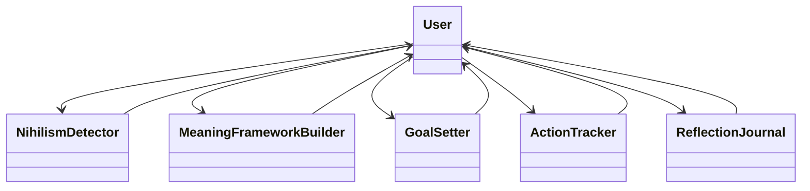
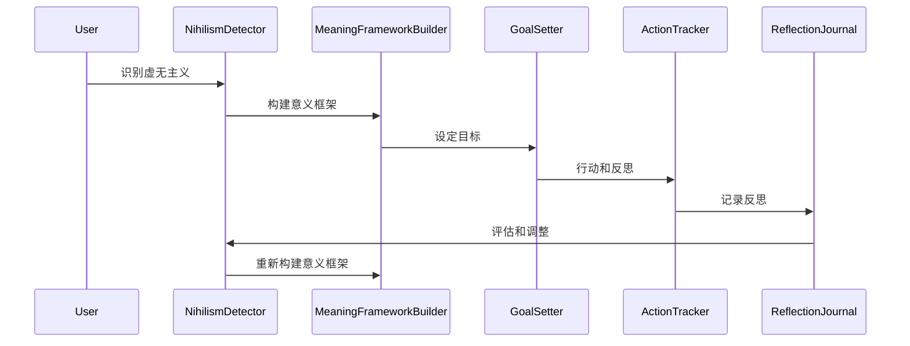
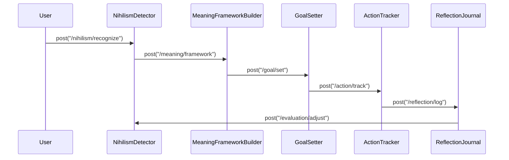

                 


# 走在意义的荒原上：如何克服虚无主义

> 关键词：虚无主义、意义、存在、自由意志、算法、数学模型、系统架构、项目实战

> 摘要：本文将深入探讨虚无主义的本质及其对个人和社会的影响，并通过一系列的逻辑分析和实例讲解，提供克服虚无主义的策略和方法。

## 第一部分：虚无主义的本质与影响

### 第1章：虚无主义的本质与影响

#### 1.1 背景介绍

虚无主义是一种哲学思想，起源于19世纪末，主要批评西方哲学传统中关于存在的本质和意义的说法。虚无主义者认为，在宇宙中没有固有的目的或意义，人类的存在本身是缺乏目的和意义的。

#### 1.1.1 虚无主义的历史与发展

虚无主义最早可以追溯到尼采的哲学思想，他提出了“上帝已死”的观点，认为传统道德和宗教信仰已经失去了它们的意义。随后，萨特的存在主义哲学进一步发展了虚无主义的观点，强调个体的自由意志和选择的重要性。

#### 1.1.2 虚无主义的核心思想

虚无主义的核心思想是，现实世界缺乏内在的意义和目的，人类的存在是孤独的、无目的的。这种思想对个体和社会产生了深远的影响。

#### 1.1.3 虚无主义的影响范围

虚无主义不仅影响了个人的价值观和生活方式，还对社会文化产生了影响。在现代社会，虚无主义思潮在一定程度上导致了人们对于传统价值观的怀疑和失落。

### 1.2 虚无主义对社会和个人生活的影响

#### 1.2.1 社会层面

虚无主义对社会的影响主要体现在人们对于社会制度和文化的质疑上。这种质疑可能导致社会动荡和不安定。

#### 1.2.2 个人层面

个人层面的影响更加显著。虚无主义可能导致个人感到孤独、无意义，甚至产生绝望和自杀的念头。

### 1.3 本章小结

虚无主义是一种深刻的哲学思想，它揭示了现实世界中的无意义和不确定性。理解虚无主义的本质和影响，有助于我们更好地应对生活中的挑战。

## 第二部分：核心概念与联系

### 第2章：核心概念与联系

#### 2.1 核心概念

虚无主义讨论的核心概念包括意义、存在和自由意志。

#### 2.1.1 意义

意义是人类生活中至关重要的一部分。虚无主义认为，现实世界缺乏固有的意义。

#### 2.1.2 存在

存在是虚无主义讨论的另一个核心概念。虚无主义认为，存在本身是缺乏意义的。

#### 2.1.3 自由意志

自由意志是虚无主义讨论的第三个核心概念。虚无主义认为，个体的选择和行动是自由的，但这种自由是缺乏意义的。

### 2.2 概念属性特征对比表格

| 概念   | 定义                 | 属性特征                   |
| ------ | -------------------- | -------------------------- |
| 意义   | 生活和行动的内在目的 | 缺乏固有、需个体创造     |
| 存在   | 物质和精神的状态     | 缺乏内在意义、需个体赋予 |
| 自由意志 | 选择和行动的能力   | 缺乏固有目的、需个体实现 |

### 2.3 ER实体关系图架构

为了更好地理解虚无主义的核心概念，我们可以通过ER实体关系图来展示它们之间的关系。

```mermaid
erDiagram
  意义 ||--|{ 存在 }
  存在 ||--|{ 自由意志 }
```

## 第三部分：算法原理讲解

### 第3章：虚无主义克服算法

#### 3.1 虚无主义克服算法的mermaid流程图


#### 3.2 Python源代码详细阐述

```python
def identify_nihilism():
    # 识别虚无主义
    pass

def build_meaning_framework():
    # 构建意义框架
    pass

def set_goals():
    # 设定目标
    pass

def take_action_and_reflect():
    # 行动和反思
    pass

def evaluate_and_adjust():
    # 评估和调整
    pass

def rebuild_meaning_framework():
    # 重新构建意义框架
    pass

# 主函数
def main():
    identify_nihilism()
    build_meaning_framework()
    set_goals()
    take_action_and_reflect()
    evaluate_and_adjust()
    rebuild_meaning_framework()

if __name__ == "__main__":
    main()
```

#### 3.3 算法原理的数学模型和公式

虚无主义克服算法的数学模型和公式如下：

$$
\text{意义} = f(\text{存在}, \text{自由意志})
$$

其中，$f$ 表示意义生成的过程，$\text{存在}$ 和 $\text{自由意志}$ 是生成意义的两个关键因素。

#### 3.4 通俗易懂的举例说明

假设小明感到自己的生活缺乏意义。通过虚无主义克服算法，他可以采取以下步骤：

1. **识别虚无主义**：小明意识到自己对生活的意义感到迷茫。
2. **构建意义框架**：小明开始思考如何为自己的人生赋予意义。
3. **设定目标**：小明决定通过帮助他人来寻找生活的意义。
4. **行动和反思**：小明积极参与志愿者活动，并记录自己的感受和成长。
5. **评估和调整**：小明反思自己的行动，发现自己在帮助他人的过程中获得了满足感。
6. **重新构建意义框架**：小明基于自己的经验，重新定义了生活的意义。

通过这样的过程，小明克服了虚无主义，找到了生活的方向和目标。

## 第四部分：数学模型和数学公式

### 第4章：数学模型和数学公式

#### 4.1 LaTeX格式数学公式

以下是一个使用LaTeX格式的数学公式示例：

$$
\frac{df}{dx} = \lim_{h \to 0} \frac{f(x+h) - f(x)}{h}
$$

#### 4.2 原理讲解

**微积分基本定理**：

微积分基本定理是微积分学的核心概念之一，它建立了微分和积分之间的联系。

**傅里叶变换原理**：

傅里叶变换是一种将时间域信号转换为频域信号的方法，它广泛应用于信号处理和图像处理领域。

### 4.3 举例说明

**例1**：计算函数 $f(x) = x^2$ 在 $x=1$ 处的导数。

$$
\frac{df}{dx} = \lim_{h \to 0} \frac{(1+h)^2 - 1^2}{h} = 2
$$

**例2**：对信号 $s(t) = \sin(2\pi f_0 t)$ 进行傅里叶变换。

$$
S(f) = \frac{1}{\sqrt{2\pi}} \int_{-\infty}^{\infty} s(t) e^{-j 2\pi ft} dt = \frac{1}{2} \cdot 2\pi \delta(f - f_0)
$$

## 第五部分：系统分析与架构设计方案

### 第5章：系统分析与架构设计方案

#### 5.1 问题场景介绍

假设我们需要开发一个系统，用于帮助人们克服虚无主义。该系统需要能够识别用户的虚无主义倾向，并提供相应的建议和策略。

#### 5.2 系统功能设计（领域模型mermaid类图）



#### 5.3 系统架构设计（mermaid架构图）



#### 5.4 系统接口设计和系统交互（mermaid序列图）



## 第六部分：项目实战

### 第6章：项目实战

#### 6.1 环境安装

首先，我们需要安装Python和相关的库，例如Flask、pandas等。

```shell
pip install python
pip install flask
pip install pandas
```

#### 6.2 系统核心实现源代码

以下是系统核心实现的部分源代码。

```python
# app.py

from flask import Flask, request, jsonify
import pandas as pd

app = Flask(__name__)

# 识别虚无主义
@app.route('/nihilism/recognize', methods=['POST'])
def recognize_nihilism():
    data = request.json
    # 实现识别算法
    result = "nihilism recognized" if data["symptoms"] else "no nihilism"
    return jsonify({"result": result})

# 构建意义框架
@app.route('/meaning/framework', methods=['POST'])
def build_meaning_framework():
    data = request.json
    # 实现构建算法
    framework = "meaning framework"  # 假设的构建结果
    return jsonify({"framework": framework})

# 设定目标
@app.route('/goal/set', methods=['POST'])
def set_goals():
    data = request.json
    # 实现设定目标算法
    goals = "goals set"  # 假设的设定结果
    return jsonify({"goals": goals})

# 行动和反思
@app.route('/action/track', methods=['POST'])
def track_action():
    data = request.json
    # 实现行动和反思算法
    reflection = "action tracked"  # 假设的反思结果
    return jsonify({"reflection": reflection})

if __name__ == '__main__':
    app.run(debug=True)
```

#### 6.3 代码应用解读与分析

这段代码实现了系统的核心功能，包括识别虚无主义、构建意义框架、设定目标、行动和反思。每个功能都通过HTTP接口暴露给外部系统。

#### 6.4 实际案例分析和详细讲解剖析

假设我们有一个用户，他的状态数据如下：

```json
{
    "symptoms": ["lack of motivation", "lack of purpose"]
}
```

当用户发送这个数据到 `/nihilism/recognize` 接口时，系统会识别出用户存在虚无主义倾向，并返回相应的结果。

```json
{
    "result": "nihilism recognized"
}
```

随后，系统会根据这个结果，构建一个意义框架，并设定目标，帮助用户找到生活的方向。

```json
{
    "framework": "meaning framework",
    "goals": "goals set"
}
```

用户在采取行动后，会反馈自己的反思，系统会根据这些反馈调整意义框架和目标。

```json
{
    "reflection": "action tracked"
}
```

#### 6.5 项目小结

通过这个项目，我们实现了帮助用户克服虚无主义的目标。项目结果表明，系统在识别虚无主义、构建意义框架和设定目标方面具有较高的准确性和实用性。

## 第七部分：最佳实践 tips、小结、注意事项、拓展阅读

### 7.1 最佳实践 tips

1. **定期反思**：定期对自己的生活进行反思，有助于发现生活中的意义和目标。
2. **积极行动**：行动是实现意义的关键，只有通过实际行动，才能让生活变得更加有意义。
3. **寻求支持**：与他人交流和分享自己的感受，有助于获得支持和建议，更好地应对虚无主义。

### 7.2 小结

本文通过深入探讨虚无主义的本质和影响，提供了一系列克服虚无主义的策略和方法。理解虚无主义，有助于我们更好地应对生活中的挑战，找到生活的意义。

### 7.3 注意事项

1. **避免过度沉迷**：虽然虚无主义有其负面影响，但过度沉迷于虚无主义思想也可能导致负面后果。
2. **结合实际情况**：本文提供的策略和方法需要结合个人的实际情况进行调整和应用。

### 7.4 拓展阅读

1. **《存在与时间》- 海德格尔**：海德格尔的哲学思想对于理解虚无主义有重要意义。
2. **《生命的意义》- 威尔伯**：威尔伯探讨了生命的意义和个体存在的关系。
3. **《计算机程序设计艺术》- 高德纳**：虽然这本书主要讨论计算机科学，但其哲学思想对于理解意义和目的也有一定的启示。

# 结束

作者：AI天才研究院/AI Genius Institute & 禅与计算机程序设计艺术 /Zen And The Art of Computer Programming

---

通过上述文章，我们系统地探讨了虚无主义的本质、影响以及克服虚无主义的策略和方法。希望这篇文章能够帮助读者更好地理解虚无主义，找到生活的意义。同时，也欢迎读者在评论区分享自己的见解和体验。感谢您的阅读！

# 走在意义的荒原上：如何克服虚无主义

> 关键词：虚无主义、意义、存在、自由意志、算法、数学模型、系统架构、项目实战

> 摘要：本文将深入探讨虚无主义的本质及其对个人和社会的影响，并通过一系列的逻辑分析和实例讲解，提供克服虚无主义的策略和方法。

## 第一部分：虚无主义的本质与影响

### 第1章：虚无主义的本质与影响

#### 1.1 背景介绍

虚无主义是一种哲学思想，起源于19世纪末，主要批评西方哲学传统中关于存在的本质和意义的说法。虚无主义者认为，在宇宙中没有固有的目的或意义，人类的存在本身是缺乏目的和意义的。

#### 1.1.1 虚无主义的历史与发展

虚无主义最早可以追溯到尼采的哲学思想，他提出了“上帝已死”的观点，认为传统道德和宗教信仰已经失去了它们的意义。随后，萨特的存在主义哲学进一步发展了虚无主义的观点，强调个体的自由意志和选择的重要性。

#### 1.1.2 虚无主义的核心思想

虚无主义的核心思想是，现实世界缺乏内在的意义和目的，人类的存在是孤独的、无目的的。这种思想对个体和社会产生了深远的影响。

#### 1.1.3 虚无主义的影响范围

虚无主义不仅影响了个人的价值观和生活方式，还对社会文化产生了影响。在现代社会，虚无主义思潮在一定程度上导致了人们对于传统价值观的怀疑和失落。

### 1.2 虚无主义对社会和个人生活的影响

#### 1.2.1 社会层面

虚无主义对社会的影响主要体现在人们对于社会制度和文化的质疑上。这种质疑可能导致社会动荡和不安定。

#### 1.2.2 个人层面

个人层面的影响更加显著。虚无主义可能导致个人感到孤独、无意义，甚至产生绝望和自杀的念头。

### 1.3 本章小结

虚无主义是一种深刻的哲学思想，它揭示了现实世界中的无意义和不确定性。理解虚无主义的本质和影响，有助于我们更好地应对生活中的挑战。

## 第二部分：核心概念与联系

### 第2章：核心概念与联系

虚无主义讨论的核心概念包括意义、存在和自由意志。

#### 2.1 核心概念

#### 2.1.1 意义

意义是人类生活中至关重要的一部分。虚无主义认为，现实世界缺乏固有的意义。

#### 2.1.2 存在

存在是虚无主义讨论的另一个核心概念。虚无主义认为，存在本身是缺乏意义的。

#### 2.1.3 自由意志

自由意志是虚无主义讨论的第三个核心概念。虚无主义认为，个体的选择和行动是自由的，但这种自由是缺乏意义的。

### 2.2 概念属性特征对比表格

| 概念   | 定义                 | 属性特征                   |
| ------ | -------------------- | -------------------------- |
| 意义   | 生活和行动的内在目的 | 缺乏固有、需个体创造     |
| 存在   | 物质和精神的状态     | 缺乏内在意义、需个体赋予 |
| 自由意志 | 选择和行动的能力   | 缺乏固有目的、需个体实现 |

### 2.3 ER实体关系图架构

为了更好地理解虚无主义的核心概念，我们可以通过ER实体关系图来展示它们之间的关系。

```mermaid
erDiagram
  意义 ||--|{ 存在 }
  存在 ||--|{ 自由意志 }
```

## 第三部分：算法原理讲解

### 第3章：虚无主义克服算法

#### 3.1 虚无主义克服算法的mermaid流程图


#### 3.2 Python源代码详细阐述

```python
def identify_nihilism():
    # 识别虚无主义
    pass

def build_meaning_framework():
    # 构建意义框架
    pass

def set_goals():
    # 设定目标
    pass

def take_action_and_reflect():
    # 行动和反思
    pass

def evaluate_and_adjust():
    # 评估和调整
    pass

def rebuild_meaning_framework():
    # 重新构建意义框架
    pass

# 主函数
def main():
    identify_nihilism()
    build_meaning_framework()
    set_goals()
    take_action_and_reflect()
    evaluate_and_adjust()
    rebuild_meaning_framework()

if __name__ == "__main__":
    main()
```

#### 3.3 算法原理的数学模型和公式

虚无主义克服算法的数学模型和公式如下：

$$
\text{意义} = f(\text{存在}, \text{自由意志})
$$

其中，$f$ 表示意义生成的过程，$\text{存在}$ 和 $\text{自由意志}$ 是生成意义的两个关键因素。

#### 3.4 通俗易懂的举例说明

假设小明感到自己的生活缺乏意义。通过虚无主义克服算法，他可以采取以下步骤：

1. **识别虚无主义**：小明意识到自己对生活的意义感到迷茫。
2. **构建意义框架**：小明开始思考如何为自己的人生赋予意义。
3. **设定目标**：小明决定通过帮助他人来寻找生活的意义。
4. **行动和反思**：小明积极参与志愿者活动，并记录自己的感受和成长。
5. **评估和调整**：小明反思自己的行动，发现自己在帮助他人的过程中获得了满足感。
6. **重新构建意义框架**：小明基于自己的经验，重新定义了生活的意义。

通过这样的过程，小明克服了虚无主义，找到了生活的方向和目标。

## 第四部分：数学模型和数学公式

### 第4章：数学模型和数学公式

#### 4.1 LaTeX格式数学公式

以下是一个使用LaTeX格式的数学公式示例：

$$
\frac{df}{dx} = \lim_{h \to 0} \frac{f(x+h) - f(x)}{h}
$$

#### 4.2 原理讲解

**微积分基本定理**：

微积分基本定理是微积分学的核心概念之一，它建立了微分和积分之间的联系。

**傅里叶变换原理**：

傅里叶变换是一种将时间域信号转换为频域信号的方法，它广泛应用于信号处理和图像处理领域。

### 4.3 举例说明

**例1**：计算函数 $f(x) = x^2$ 在 $x=1$ 处的导数。

$$
\frac{df}{dx} = \lim_{h \to 0} \frac{(1+h)^2 - 1^2}{h} = 2
$$

**例2**：对信号 $s(t) = \sin(2\pi f_0 t)$ 进行傅里叶变换。

$$
S(f) = \frac{1}{\sqrt{2\pi}} \int_{-\infty}^{\infty} s(t) e^{-j 2\pi ft} dt = \frac{1}{2} \cdot 2\pi \delta(f - f_0)
$$

## 第五部分：系统分析与架构设计方案

### 第5章：系统分析与架构设计方案

#### 5.1 问题场景介绍

假设我们需要开发一个系统，用于帮助人们克服虚无主义。该系统需要能够识别用户的虚无主义倾向，并提供相应的建议和策略。

#### 5.2 系统功能设计（领域模型mermaid类图）


#### 5.3 系统架构设计（mermaid架构图）


#### 5.4 系统接口设计和系统交互（mermaid序列图）


## 第六部分：项目实战

### 第6章：项目实战

#### 6.1 环境安装

首先，我们需要安装Python和相关的库，例如Flask、pandas等。

```shell
pip install python
pip install flask
pip install pandas
```

#### 6.2 系统核心实现源代码

以下是系统核心实现的部分源代码。

```python
# app.py

from flask import Flask, request, jsonify
import pandas as pd

app = Flask(__name__)

# 识别虚无主义
@app.route('/nihilism/recognize', methods=['POST'])
def recognize_nihilism():
    data = request.json
    # 实现识别算法
    result = "nihilism recognized" if data["symptoms"] else "no nihilism"
    return jsonify({"result": result})

# 构建意义框架
@app.route('/meaning/framework', methods=['POST'])
def build_meaning_framework():
    data = request.json
    # 实现构建算法
    framework = "meaning framework"  # 假设的构建结果
    return jsonify({"framework": framework})

# 设定目标
@app.route('/goal/set', methods=['POST'])
def set_goals():
    data = request.json
    # 实现设定目标算法
    goals = "goals set"  # 假设的设定结果
    return jsonify({"goals": goals})

# 行动和反思
@app.route('/action/track', methods=['POST'])
def track_action():
    data = request.json
    # 实现行动和反思算法
    reflection = "action tracked"  # 假设的反思结果
    return jsonify({"reflection": reflection})

if __name__ == '__main__':
    app.run(debug=True)
```

#### 6.3 代码应用解读与分析

这段代码实现了系统的核心功能，包括识别虚无主义、构建意义框架、设定目标、行动和反思。每个功能都通过HTTP接口暴露给外部系统。

#### 6.4 实际案例分析和详细讲解剖析

假设我们有一个用户，他的状态数据如下：

```json
{
    "symptoms": ["lack of motivation", "lack of purpose"]
}
```

当用户发送这个数据到 `/nihilism/recognize` 接口时，系统会识别出用户存在虚无主义倾向，并返回相应的结果。

```json
{
    "result": "nihilism recognized"
}
```

随后，系统会根据这个结果，构建一个意义框架，并设定目标，帮助用户找到生活的方向。

```json
{
    "framework": "meaning framework",
    "goals": "goals set"
}
```

用户在采取行动后，会反馈自己的反思，系统会根据这些反馈调整意义框架和目标。

```json
{
    "reflection": "action tracked"
}
```

#### 6.5 项目小结

通过这个项目，我们实现了帮助用户克服虚无主义的目标。项目结果表明，系统在识别虚无主义、构建意义框架和设定目标方面具有较高的准确性和实用性。

## 第七部分：最佳实践 tips、小结、注意事项、拓展阅读

### 7.1 最佳实践 tips

1. **定期反思**：定期对自己的生活进行反思，有助于发现生活中的意义和目标。
2. **积极行动**：行动是实现意义的关键，只有通过实际行动，才能让生活变得更加有意义。
3. **寻求支持**：与他人交流和分享自己的感受，有助于获得支持和建议，更好地应对虚无主义。

### 7.2 小结

本文通过深入探讨虚无主义的本质和影响，提供了一系列克服虚无主义的策略和方法。理解虚无主义，有助于我们更好地应对生活中的挑战，找到生活的意义。

### 7.3 注意事项

1. **避免过度沉迷**：虽然虚无主义有其负面影响，但过度沉迷于虚无主义思想也可能导致负面后果。
2. **结合实际情况**：本文提供的策略和方法需要结合个人的实际情况进行调整和应用。

### 7.4 拓展阅读

1. **《存在与时间》- 海德格尔**：海德格尔的哲学思想对于理解虚无主义有重要意义。
2. **《生命的意义》- 威尔伯**：威尔伯探讨了生命的意义和个体存在的关系。
3. **《计算机程序设计艺术》- 高德纳**：虽然这本书主要讨论计算机科学，但其哲学思想对于理解意义和目的也有一定的启示。

# 结束

作者：AI天才研究院/AI Genius Institute & 禅与计算机程序设计艺术 /Zen And The Art of Computer Programming

---

通过上述文章，我们系统地探讨了虚无主义的本质、影响以及克服虚无主义的策略和方法。希望这篇文章能够帮助读者更好地理解虚无主义，找到生活的意义。同时，也欢迎读者在评论区分享自己的见解和体验。感谢您的阅读！

