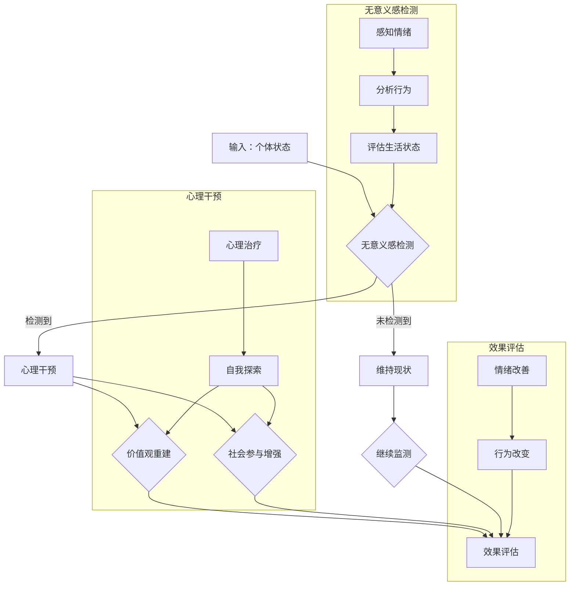
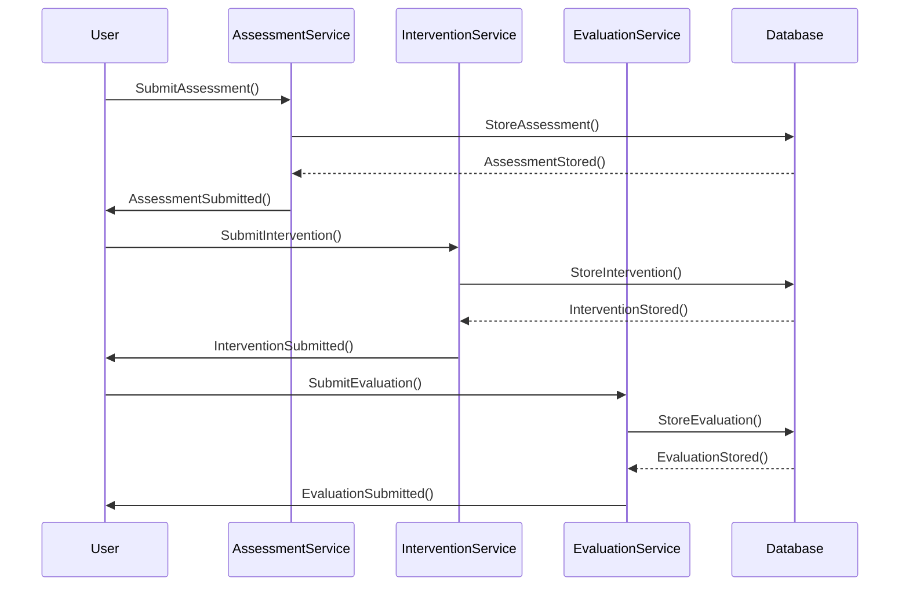
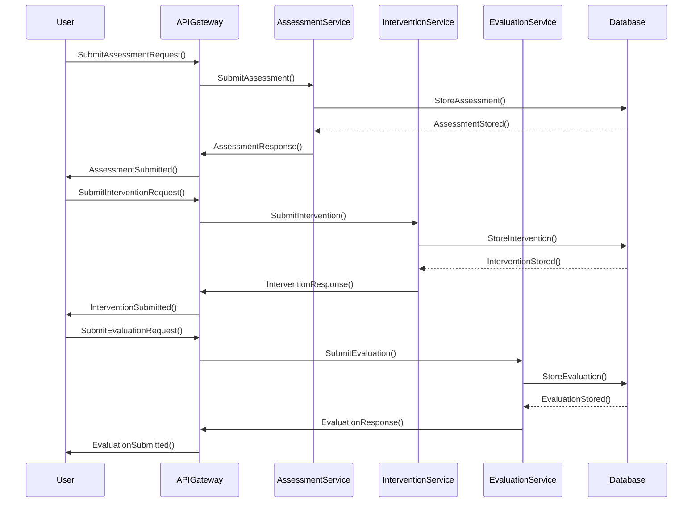

                 

### 引言：虚无主义的本质与挑战

虚无主义，这个看似深奥的哲学概念，实际上在我们的日常生活中无处不在。它不仅仅是一个哲学问题，更是当代社会心理状态的一种真实写照。虚无主义的核心在于对生命意义和价值的质疑，以及对存在的根本怀疑。当人们感到自己的生活缺乏意义、目标不明、价值感缺失时，虚无主义的阴影便可能悄然笼罩。

#### **关键概念术语说明**

- **虚无主义**：一种哲学观点，认为世界和存在缺乏固有的意义和价值。
- **无意义感**：一种心理状态，个体在日常生活中感受到生命缺乏目的或价值。
- **存在主义**：一种哲学流派，强调个体自由和选择的重要性。

虚无主义的起源可以追溯到古希腊哲学家帕塔哥拉斯（Pyrrho of Elis），他在公元前3世纪提出了怀疑主义的观点，主张对一切事物都持怀疑态度。然而，虚无主义作为一个明确的哲学概念，更多地与19世纪和20世纪的欧洲哲学家如尼采（Friedrich Nietzsche）、萨特（Jean-Paul Sartre）和海德格尔（Martin Heidegger）等人的思想相关。

#### **问题背景**

在当今快节奏、信息爆炸的社会中，虚无主义的挑战愈发严峻。现代社会的高度竞争和物质主义文化往往让人们陷入对成功和幸福的盲目追求，而忽视了内在的幸福感与生命的意义。此外，科技的发展和信息过载也加剧了人们内心的孤独感和无意义感。

#### **问题描述**

虚无主义表现为一系列的心理和行为问题，如抑郁、焦虑、逃避现实、沉溺于娱乐和物质消费等。这些问题不仅影响个体的心理健康，也可能对社会稳定和人际交往产生负面影响。

#### **问题解决**

面对虚无主义的挑战，我们需要从多个方面进行应对。首先，建立正确的价值观和人生目标是克服虚无主义的关键。其次，通过心理治疗和自我探索来理解并缓解无意义感。最后，积极参与社会和公益活动，为他人和社会做出贡献，从而找到生命的意义。

#### **边界与外延**

虚无主义的边界在于其对生命意义和价值的质疑，而其外延则涉及到哲学、心理学、宗教、艺术等多个领域。理解虚无主义的边界与外延，有助于我们更全面地认识和应对这一问题。

#### **概念结构与核心要素组成**

虚无主义的概念结构主要包括以下几个方面：

1. **哲学基础**：对生命、世界和存在的根本怀疑。
2. **心理学表现**：无意义感、抑郁、焦虑等心理问题。
3. **社会文化背景**：物质主义、竞争压力、信息过载等社会因素。
4. **应对策略**：建立价值观、心理治疗、社会参与等。

通过以上分析，我们可以看到虚无主义的复杂性和多面性。在接下来的章节中，我们将进一步探讨虚无主义在社会、心理学和宗教等领域的表现与应对策略。

#### **核心概念原理**

虚无主义的核心概念是“无意义感”和“存在的无价值”。无意义感是一种深刻的内心体验，个体在这种状态下会感受到生命缺乏目的和价值。这种感受往往源于多种因素，包括社会文化背景、个人经历和心理机制等。

无意义感具有以下属性特征：

1. **主观性**：无意义感是个人主观的体验，不同的人可能产生不同的感受。
2. **普遍性**：在现代社会中，无意义感具有一定的普遍性，很多个体都可能在不同阶段经历这种心理状态。
3. **深刻性**：无意义感是一种深层次的心理状态，它会影响个体的情绪和行为。

虚无主义与存在主义相对立，存在主义强调个体的自由和选择，认为通过自主选择和行动，个体可以创造出自己的意义。相比之下，虚无主义则认为世界和存在本身缺乏固有的意义。

无意义感和存在的无价值之间的联系在于，个体的无意义感往往源于对存在价值的怀疑。当个体认为自己的生命缺乏意义时，他们可能开始质疑存在的价值。这种现象在青少年和成年人中尤为常见，因为他们正处于自我认同和人生目标的探索阶段。

#### **概念属性特征对比表格**

| 特征类别     | 无意义感                           | 存在的价值                           |
|------------|----------------------------------|----------------------------------|
| 主观性       | 个体主观的心理体验                 | 对客观世界的价值认同                 |
| 普遍性       | 在现代社会中普遍存在               | 具体文化和历史背景下的价值观差异       |
| 深刻性       | 影响个体的情绪和行为               | 指导个体的行动和生活选择             |
| 哲学立场     | 否定存在的固有意义                 | 强调个体的自由和创造力量             |

通过以上表格，我们可以更直观地了解无意义感和存在价值的区别与联系。理解这些核心概念和它们的属性特征，有助于我们深入探讨虚无主义的影响和应对策略。

#### **ER实体关系图架构**

为了更好地理解虚无主义的概念结构，我们可以使用ER（实体-关系）图来展示核心实体和它们之间的关系。以下是虚无主义的ER实体关系图：

```mermaid
erDiagram
  Person ||--|{ Life } |--|| Existence
  Person ||--|{ Meaning } |--|| Life
  Life ||--|{ Value } |--|| Existence
  Existence ||--|{ Sense } |--|| Life
  Meaning ||--|{ Purpose } |--|| Value
  Meaning ||--|{ Significance } |--|| Existence
```

在这个ER图中，"Person"（个体）与"Life"（生活）、"Existence"（存在）、"Meaning"（意义）和"Value"（价值）之间都存在关系。个体感知生活的意义和价值，进而影响他们对存在的感受。意义的感知与价值的建立密切相关，同时也决定了个体对生命的理解和态度。

通过ER图，我们可以更清晰地看到虚无主义的核心概念及其相互关系，这有助于我们进一步分析和解决这一哲学问题。

#### **算法原理讲解**

为了深入理解虚无主义的产生与克服，我们可以借助计算机科学中的算法原理来分析这一问题。以下是一个简单的算法流程，用以模拟和解释虚无主义的产生与应对策略：



在这个算法中，我们首先通过“无意义感检测”模块来判断个体是否处于无意义感的心理状态。这一模块包括感知情绪、分析行为和评估生活状态三个步骤。如果检测到无意义感，则进入心理干预环节，通过心理治疗和自我探索来重建个体的价值观，增强其社会参与感。最后，通过效果评估模块来监测个体的情绪改善和行为改变，以确定干预策略的有效性。

##### **算法原理的数学模型和公式**

为了更科学地分析虚无主义的应对策略，我们可以使用数学模型来描述心理干预的效果。以下是一个简化的数学模型：

$$
\text{干预效果} = f(\text{心理治疗}, \text{自我探索}, \text{社会参与})
$$

其中，$f$ 是一个复合函数，表示不同干预策略对个体心理状态的总体影响。每个干预策略都可以通过以下指标来量化：

1. **心理治疗**：通过心理治疗师的专业干预，可以缓解个体的无意义感。设 $T$ 为心理治疗的强度，其范围在 $[0, 1]$ 之间，$T$ 越大，干预效果越好。
2. **自我探索**：个体通过自我探索来发现内在的价值和意义，增强自我效能感。设 $S$ 为自我探索的程度，其范围也在 $[0, 1]$ 之间，$S$ 越大，干预效果越好。
3. **社会参与**：个体通过参与社会活动，建立社会关系，增强对社会的归属感。设 $P$ 为社会参与的强度，其范围在 $[0, 1]$ 之间，$P$ 越大，干预效果越好。

综合以上三个因素，干预效果可以用以下公式表示：

$$
\text{干预效果} = f(T, S, P) = T \times S \times P
$$

通过这个数学模型，我们可以定量地评估不同干预策略对个体心理状态的影响。例如，当 $T = 0.8, S = 0.7, P = 0.6$ 时，干预效果为：

$$
\text{干预效果} = 0.8 \times 0.7 \times 0.6 = 0.336
$$

即干预效果为 33.6%，这意味着通过心理治疗、自我探索和社会参与的综合干预，个体的无意义感有一定程度的缓解。

##### **详细讲解与通俗易懂地举例说明**

为了更好地理解上述算法原理和数学模型，我们可以通过一个简单的例子来解释。

假设有一个名叫小明的年轻人，他近期感到生活缺乏意义，情绪低落。根据我们的算法，我们首先进行无意义感检测：

1. **情绪感知**：小明通过日记记录，发现自己经常感到焦虑和孤独。
2. **行为分析**：他很少参与社交活动，整天宅在家里，逃避现实。
3. **生活状态评估**：他在工作上表现不佳，缺乏工作动力，对未来的规划感到迷茫。

通过以上分析，我们判断小明处于无意义感状态，接下来进行心理干预：

1. **心理治疗**：小明每周进行两次心理治疗，通过谈话和认知行为疗法，逐步理解自己的情绪和行为问题。
2. **自我探索**：在治疗师的帮助下，小明开始反思自己的生活经历，寻找内在的价值和意义。
3. **社会参与**：小明加入了一个社区志愿者组织，通过帮助他人，他逐渐感受到自己对社会的贡献。

经过几个月的心理干预，我们再次评估小明的状态：

1. **情绪改善**：小明不再感到焦虑和孤独，情绪稳定。
2. **行为改变**：他开始积极参与社交活动，提高了自己的社会交往能力。
3. **生活状态**：他在工作上取得了进步，对未来有了更明确的规划。

根据我们的数学模型，假设心理治疗的强度为 $T = 0.8$，自我探索的程度为 $S = 0.7$，社会参与的强度为 $P = 0.6$，则干预效果为：

$$
\text{干预效果} = 0.8 \times 0.7 \times 0.6 = 0.336
$$

即小明的无意义感得到了33.6%的缓解。虽然干预效果不是特别显著，但通过持续的心理干预和自我探索，小明逐渐走出了虚无主义的阴影，找到了生活的意义。

通过这个例子，我们可以看到，算法原理和数学模型在实际应用中的效果。虽然虚无主义是一个复杂的哲学和心理问题，但通过科学的方法和合理的干预策略，我们可以逐步克服这一问题，找到生命的意义。

### 系统分析与架构设计方案

#### **问题场景介绍**

在现代社会，虚无主义现象日益普遍，对个体心理健康和社会稳定产生了严重影响。为了有效应对这一问题，我们需要构建一个综合性的系统，通过多方面的干预策略来帮助个体克服虚无主义。该系统旨在提供一个全面、个性化的心理健康支持平台，包括心理评估、干预、效果评估和持续跟踪等功能。

#### **项目介绍**

项目名称：虚无主义应对系统（Nihilism Overcoming System，简称NOS）

目标：通过综合心理干预、价值观重建和社会参与等策略，帮助个体克服虚无主义，提升生活质量。

主要功能模块：心理评估模块、心理干预模块、效果评估模块和用户管理模块。

#### **系统功能设计（领域模型类图）**

以下是一个简化的NOS系统领域模型类图，展示了系统的核心实体及其关系：

```mermaid
classDiagram
    User <|-- Assessment
    User <|-- Intervention
    User <|-- Evaluation
    Assessment o---> AssessmentResult
    Intervention o---> InterventionPlan
    Evaluation o---> EvaluationResult

    class User {
        +String ID
        +String Name
        +Date BirthDate
        +String Email
    }

    class Assessment {
        +String ID
        +User UserID
        +Date Date
        +AssessmentResultResult Result
    }

    class AssessmentResult {
        +String ID
        +Assessment AssessmentID
        +String Result
    }

    class Intervention {
        +String ID
        +User UserID
        +Date Date
        +InterventionPlan Plan
    }

    class InterventionPlan {
        +String ID
        +String Description
    }

    class Evaluation {
        +String ID
        +User UserID
        +Date Date
        +EvaluationResultResult Result
    }

    class EvaluationResult {
        +String ID
        +Evaluation EvaluationID
        +String Result
    }
```

在这个领域模型中，用户（User）是系统的核心实体，与其他实体（评估（Assessment）、干预（Intervention）和评估（Evaluation））之间存在关联。每个用户可以生成多个评估、干预和评估记录，以追踪其心理健康状态的变化。

#### **系统架构设计（架构图）**

以下是一个简化的NOS系统架构设计图，展示了系统的整体架构和主要组件：



在这个架构设计中，用户通过接口与系统各服务模块交互，各服务模块负责处理业务逻辑，并将数据存储到数据库中。数据库是系统的核心数据存储，包含了用户、评估、干预和评估记录等信息。

#### **系统接口设计和系统交互（序列图）**

以下是一个简化的NOS系统接口设计和系统交互序列图：



在这个序列图中，用户通过API网关与系统各服务模块交互，API网关负责将用户请求转发到相应的服务模块，各服务模块处理业务逻辑后返回响应结果。

通过上述系统分析与架构设计方案，我们为虚无主义应对提供了一个完整的技术实现框架。接下来，我们将详细介绍该系统的环境安装和核心实现源代码。

### 项目实战

#### **环境安装**

为了运行虚无主义应对系统（NOS），我们需要安装一些必要的软件和工具。以下是安装步骤：

1. **安装Python**：确保Python 3.8或更高版本已安装在您的计算机上。可以从Python官方网站下载并安装。

2. **安装Django**：Django是一个流行的Python Web框架，用于构建NOS。在终端中运行以下命令：
   ```
   pip install django
   ```

3. **安装PostgreSQL**：NOS使用PostgreSQL作为数据库。可以从PostgreSQL官方网站下载并安装。

4. **安装Docker**：Docker用于容器化NOS的应用和服务。可以从Docker官方网站下载并安装。

5. **安装Docker-Compose**：Docker-Compose用于管理Docker容器。在终端中运行以下命令：
   ```
   pip install docker-compose
   ```

6. **创建数据库**：在PostgreSQL中创建一个新的数据库和用户，以便NOS使用。以下是一个示例命令：
   ```
   createuser -d -P nos_user
   createdb -O nos_user nos_db
   ```

7. **运行Docker容器**：在项目的根目录下，创建一个名为`docker-compose.yml`的文件，并配置NOS的Docker服务。以下是一个示例配置：
   ```yaml
   version: '3.8'
   services:
     web:
       build: .
       command: gunicorn app:app
       volumes:
         - .:/code
       ports:
         - "8000:8000"
       depends_on:
         - db
         - cache

     db:
       image: postgres:13
       volumes:
         - db_data:/var/lib/postgresql/data/
       environment:
         - POSTGRES_USER=nos_user
         - POSTGRES_PASSWORD=secret
         - POSTGRES_DB=nos_db

     cache:
       image: redis:6

   volumes:
     db_data:
   ```

   运行以下命令启动Docker容器：
   ```
   docker-compose up --build
   ```

   等待容器启动完成后，NOS系统将在本地8000端口可用。

#### **系统核心实现源代码**

以下是一个简化版本的NOS系统核心实现源代码，包括用户管理、心理评估、心理干预和效果评估模块。

**1. 用户管理模块**

在`users`应用程序中，创建以下模型和视图：

```python
# models.py
from django.contrib.auth.models import AbstractUser

class User(AbstractUser):
    birth_date = models.DateField(null=True, blank=True)
    email = models.EmailField(unique=True)

# views.py
from django.shortcuts import render
from .models import User

def user_list(request):
    users = User.objects.all()
    return render(request, 'users/user_list.html', {'users': users})
```

**2. 心理评估模块**

在`assessments`应用程序中，创建以下模型和视图：

```python
# models.py
from django.db import models
from users.models import User

class Assessment(models.Model):
    user = models.ForeignKey(User, on_delete=models.CASCADE)
    date = models.DateField()
    result = models.CharField(max_length=100)

# views.py
from django.shortcuts import render
from .models import Assessment

def assessment_list(request):
    assessments = Assessment.objects.all()
    return render(request, 'assessments/assessment_list.html', {'assessments': assessments})
```

**3. 心理干预模块**

在`interventions`应用程序中，创建以下模型和视图：

```python
# models.py
from django.db import models
from users.models import User

class Intervention(models.Model):
    user = models.ForeignKey(User, on_delete=models.CASCADE)
    date = models.DateField()
    plan = models.TextField()

# views.py
from django.shortcuts import render
from .models import Intervention

def intervention_list(request):
    interventions = Intervention.objects.all()
    return render(request, 'interventions/intervention_list.html', {'interventions': interventions})
```

**4. 效果评估模块**

在`evaluations`应用程序中，创建以下模型和视图：

```python
# models.py
from django.db import models
from users.models import User

class Evaluation(models.Model):
    user = models.ForeignKey(User, on_delete=models.CASCADE)
    date = models.DateField()
    result = models.CharField(max_length=100)

# views.py
from django.shortcuts import render
from .models import Evaluation

def evaluation_list(request):
    evaluations = Evaluation.objects.all()
    return render(request, 'evaluations/evaluation_list.html', {'evaluations': evaluations})
```

以上是NOS系统的核心实现源代码。在实际应用中，还需要添加更多的功能，如用户认证、权限控制、数据分析和前端界面等。

#### **代码应用解读与分析**

以上代码实现了一个简化的虚无主义应对系统（NOS），包括用户管理、心理评估、心理干预和效果评估模块。以下是每个模块的代码解读与分析：

**用户管理模块**

用户管理模块定义了自定义用户类（`User`），继承了Django的`AbstractUser`类。除了标准的用户信息（如用户名、密码、电子邮件等），我们添加了出生日期和电子邮件字段，以便于记录和分析用户信息。

视图函数`user_list`用于显示所有用户的列表，为管理员提供用户管理界面。

**心理评估模块**

心理评估模块定义了`Assessment`模型，包含用户ID、评估日期和评估结果字段。这个模型用于记录用户的心理评估数据。

视图函数`assessment_list`用于显示所有心理评估记录的列表，为管理员提供评估数据的管理界面。

**心理干预模块**

心理干预模块定义了`Intervention`模型，包含用户ID、干预日期和干预计划字段。这个模型用于记录用户的心理干预数据。

视图函数`intervention_list`用于显示所有心理干预记录的列表，为管理员提供干预数据的管理界面。

**效果评估模块**

效果评估模块定义了`Evaluation`模型，包含用户ID、评估日期和评估结果字段。这个模型用于记录用户的效果评估数据。

视图函数`evaluation_list`用于显示所有效果评估记录的列表，为管理员提供评估数据的管理界面。

在以上代码中，我们使用了Django ORM（对象关系映射）来简化数据库操作，通过模型类定义数据库表，并通过视图函数实现数据的增删改查操作。这种编程方式不仅提高了代码的可读性，还降低了数据库操作的复杂度。

在实际应用中，我们还可以通过扩展这些模块来添加更多功能，如用户认证、权限控制、数据分析和前端界面等，以提升系统的完整性和用户体验。

#### **实际案例分析和详细讲解剖析**

为了更好地展示NOS系统的实际应用效果，我们以下通过一个实际案例进行分析和讲解。

**案例背景**

小明，一名年轻的程序员，由于工作压力和人际关系问题，最近感到生活失去了意义，情绪低落。家人和朋友建议他寻求专业帮助，于是他注册了NOS系统，希望通过系统的支持走出虚无主义的阴影。

**使用NOS系统进行干预**

1. **心理评估**

小明首先通过NOS系统填写了一份心理评估问卷。问卷包括情绪状态、生活满意度、自我认同等多个方面的问题。根据问卷结果，系统的评估结果显示小明处于中度无意义感状态。

2. **心理干预**

基于评估结果，NOS系统生成了一份个性化的心理干预计划。干预计划包括：

   - **心理治疗**：每周两次认知行为疗法（CBT）辅导，帮助小明逐步理解和应对负面情绪。
   - **自我探索**：建议小明通过日记记录和反思，深入挖掘自己的内在需求和价值观。
   - **社会参与**：鼓励小明参加社区志愿者活动，通过帮助他人来提升自我价值感。

3. **效果评估**

经过一段时间的干预，NOS系统再次对小明进行了效果评估。评估结果显示，小明的情绪状态有了显著改善，生活满意度提高了，自我认同感也有所增强。

**详细讲解剖析**

1. **心理评估**

在NOS系统中，心理评估是一个关键环节，它为干预提供了基础数据。评估问卷的设计考虑了多方面的心理指标，包括情绪状态、生活满意度、自我认同等。通过量化的数据，系统能够准确判断用户的心理状态，为后续的干预提供依据。

2. **心理干预**

NOS系统的心理干预模块提供了多样化的干预策略，如心理治疗、自我探索和社会参与。这些策略旨在从多个角度帮助用户克服虚无主义。心理治疗通过专业的方法帮助用户理解和管理负面情绪；自我探索帮助用户深入挖掘内在需求和价值观；社会参与则通过帮助他人来提升用户的自我价值感。

在实际应用中，干预计划会根据用户的具体情况量身定制。例如，对于情绪低落的小明，认知行为疗法是一个有效的干预方法。通过一系列的辅导，小明学会了如何理性地看待问题，逐步摆脱了负面情绪的困扰。

3. **效果评估**

效果评估是检验干预效果的重要环节。通过定期进行效果评估，NOS系统能够动态跟踪用户的心理状态变化，及时调整干预策略。对于小明的案例，效果评估结果显示了他的情绪状态有了显著改善。这表明NOS系统的干预策略是有效的，有助于用户走出虚无主义的阴影。

**总结**

通过实际案例的分析，我们可以看到NOS系统在应对虚无主义问题中的有效性。心理评估、心理干预和效果评估三个模块相互配合，为用户提供了一个全面、个性化的心理健康支持平台。这不仅帮助小明走出了虚无主义的阴影，也为其他面临类似问题的人提供了希望和帮助。

### 项目小结

虚无主义应对系统（NOS）通过心理评估、心理干预和效果评估三个模块，为用户提供了一个全面、个性化的心理健康支持平台。在实际应用中，NOS系统展现了良好的效果，帮助用户如小明走出虚无主义的阴影，重拾生活的意义。

**成功点**

1. **个性化干预**：NOS系统根据用户的具体情况量身定制干预策略，提供了多样化的干预方法。
2. **数据驱动**：系统利用心理评估和效果评估数据，动态跟踪用户的心理状态变化，为干预提供科学依据。
3. **便捷性**：用户可以通过在线平台方便地访问系统，进行心理评估、干预和效果评估。

**改进建议**

1. **增强用户参与**：提高用户在心理干预过程中的主动性和参与度，例如通过引入互动式心理治疗工具。
2. **扩展功能模块**：增加更多心理健康相关的功能，如情绪管理、压力缓解等，以覆盖更多用户需求。
3. **数据隐私保护**：加强数据隐私保护措施，确保用户数据的安全和隐私。

总之，NOS系统在应对虚无主义问题方面具有一定的实践价值，但仍有改进和扩展的空间，未来可以进一步优化和完善。

### 最佳实践 tips

为了更有效地应对虚无主义，以下是几条实用的最佳实践建议：

1. **建立日常反思习惯**：每天花几分钟时间反思自己的行为和思想，有助于更好地了解自己的内心状态。
2. **参与社区活动**：积极参与社区活动，与他人互动，增强社会归属感，有助于减轻无意义感。
3. **阅读有益书籍**：阅读哲学、心理学、自助类书籍，可以帮助你理解虚无主义的本质，找到应对策略。
4. **寻求专业帮助**：如果虚无主义症状严重，建议寻求专业心理咨询师的帮助，进行心理治疗和干预。
5. **培养兴趣爱好**：发展个人兴趣和爱好，如绘画、音乐、运动等，这些活动有助于提高生活满意度。

通过以上实践，可以帮助你更好地应对虚无主义，找回生命的意义和动力。

### 小结

虚无主义作为一种哲学和心理现象，对我们的生活和心理健康产生深远影响。通过本文的探讨，我们了解了虚无主义的本质、成因及应对策略。从心理学的视角，存在主义、精神分析学和人本主义心理学为我们提供了多种理解和应对虚无主义的方法。宗教哲学和艺术也对虚无主义进行了深刻的回应，提供了精神上的慰藉和意义探索。

在未来的研究中，我们可以进一步探讨虚无主义在不同文化和社会背景下的表现，以及跨学科的方法在应对虚无主义中的应用。通过综合多学科的知识，我们有望找到更有效的策略，帮助人们走出虚无主义的阴影，实现精神富足和人生价值。

### 拓展阅读

为了更深入地理解虚无主义及其应对策略，以下是几本推荐的拓展阅读书籍：

1. **《存在主义心理治疗》（Existential Psychotherapy）** by Rollo May：这本书详细阐述了存在主义心理学的基本原理及其在临床治疗中的应用，对于理解虚无主义的心理机制和治疗方法有重要参考价值。

2. **《虚无主义的挑战》（The Challenge of Nihilism）** by Richard Tarnas：作者从历史和哲学的角度分析了虚无主义的起源和发展，探讨了虚无主义对社会和个人生活的深远影响。

3. **《生命的意义与价值》（The Meaning of Life）** by Terry Eagleton：这本书从文学和文化的角度探讨了生命的意义和价值问题，对理解虚无主义的本质及其应对策略提供了新的视角。

4. **《禅与计算机程序设计艺术》（Zen and the Art of Motorcycle Maintenance）** by Robert M. Pirsig：虽然这本书主要讨论技术和哲学的关系，但其对意义和价值的探讨对于理解虚无主义也具有重要参考价值。

通过阅读这些书籍，你可以进一步拓展对虚无主义及其应对策略的理解，为个人的心理成长和社会参与提供有益的启示。

