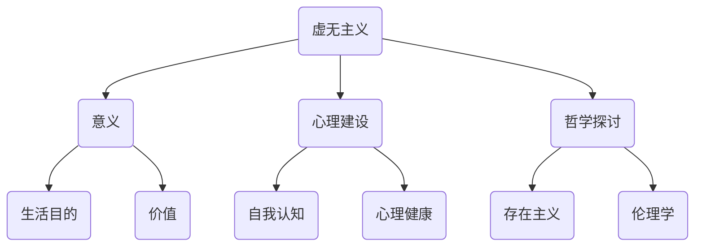
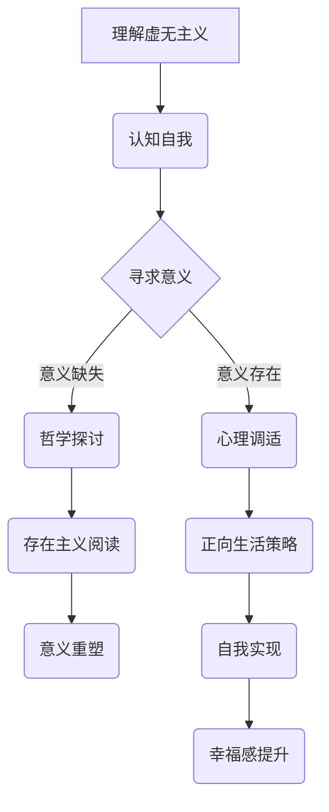
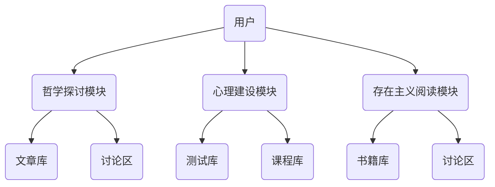
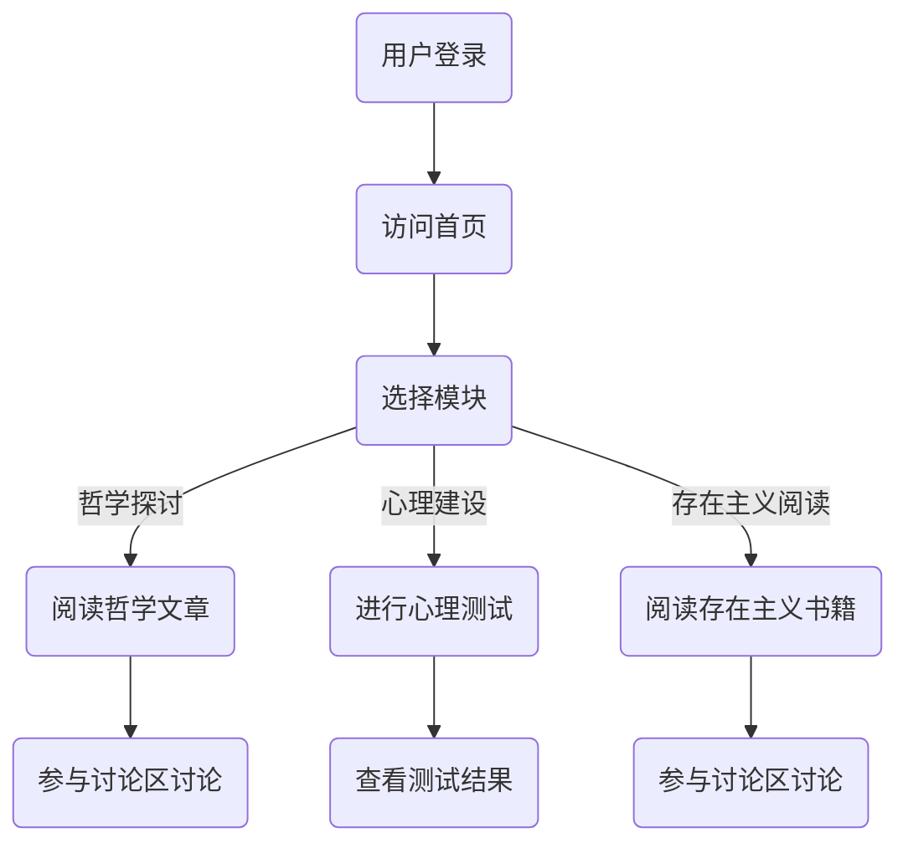

                 

# 走在意义的荒原上：如何克服虚无主义

## 关键词
- 虚无主义
- 意义探寻
- 心理建设
- 哲学探讨
- 存在主义

## 摘要
在现代社会，虚无主义成为一种普遍的心理状态，对许多人来说，生活缺乏意义，内心充满了迷茫和焦虑。本文旨在探讨虚无主义的本质及其克服方法，通过哲学和心理学的视角，结合具体案例，提出一系列克服虚无主义的策略，帮助读者在意义的荒原上找到自己的方向。

### 目录大纲设计过程

#### 明确核心概念

- **虚无主义**：一种哲学思潮，认为世界和人生缺乏意义。
- **意义**：个体对生活目的和价值的认知。
- **心理建设**：通过心理调适和自我认知提升个人幸福感。
- **哲学探讨**：深入理解虚无主义，探索生活意义的方法。

#### 梳理章节逻辑

- **背景介绍**：介绍虚无主义在现代社会的背景及其影响。
- **核心概念与联系**：详细阐述虚无主义、意义、心理建设和哲学探讨之间的关系。
- **算法原理讲解**：通过具体的算法和案例，讲解如何克服虚无主义。
- **系统分析与架构设计方案**：介绍一个实际项目，展示如何应用虚无主义克服策略。
- **项目实战**：通过实际项目，展示如何具体实施虚无主义克服策略。
- **最佳实践 tips**：总结实践经验，提供克服虚无主义的实用建议。
- **小结与拓展阅读**：对全文进行总结，并推荐进一步阅读的资源。

#### 设计章节标题

```markdown
# 走在意义的荒原上：如何克服虚无主义

## 关键词
- 虚无主义
- 意义探寻
- 心理建设
- 哲学探讨
- 存在主义

## 摘要

## 一、背景介绍
1. 虚无主义在现代社会的流行
2. 虚无主义的影响
3. 虚无主义与心理健康

## 二、核心概念与联系
1. 虚无主义的定义与特点
2. 意义的概念及其重要性
3. 心理建设在虚无主义克服中的作用
4. 哲学探讨与虚无主义的关系

## 三、算法原理讲解
1. 虚无主义克服算法的流程
2. 算法原理的数学模型与公式
3. 算法实例讲解

## 四、系统分析与架构设计方案
1. 项目背景
2. 系统功能设计
3. 系统架构设计
4. 系统接口设计和系统交互

## 五、项目实战
1. 环境安装
2. 系统核心实现源代码
3. 代码应用解读与分析
4. 实际案例分析和详细讲解剖析
5. 项目小结

## 六、最佳实践 tips

## 七、小结与拓展阅读
```

#### 确保内容完整性

- **背景介绍**：详细介绍虚无主义在现代社会的背景及其影响，阐述虚无主义与心理健康的关系。
- **核心概念与联系**：通过对虚无主义、意义、心理建设和哲学探讨的详细阐述，帮助读者理解这些概念及其相互关系。
- **算法原理讲解**：通过具体的算法和实例，展示如何运用算法原理克服虚无主义。
- **系统分析与架构设计方案**：介绍一个实际项目，展示如何将虚无主义克服策略应用于实际系统中。
- **项目实战**：通过实际项目的实施，展示如何具体应用虚无主义克服策略。
- **最佳实践 tips**：总结实践经验，提供克服虚无主义的实用建议。
- **小结与拓展阅读**：对全文进行总结，并推荐进一步阅读的资源。

#### 保持简洁性

- 在2000字内尽可能详细地设计目录大纲，避免多余废话。

#### 审核与优化

- 检查目录是否完整，是否符合要求。
- 优化语言表达，确保每个章节标题准确简洁。

### 概念与联系

#### 背景介绍

**问题背景**：现代社会中虚无主义思潮的兴起，人们对生活意义的追求与困惑。

**问题描述**：虚无主义导致的个人焦虑、人生方向迷失等问题。

**问题解决**：通过哲学探讨和心理建设寻找生活的意义。

**边界与外延**：虚无主义与存在主义、乐观主义的区别与联系。

#### 核心概念与联系

**核心概念：**

- **虚无主义**：一种哲学思潮，认为世界是荒诞的，人生缺乏意义。

- **意义**：个体对生活目的和价值的认知。

- **心理建设**：通过心理调适和自我认知提升个人幸福感。

- **哲学探讨**：深入理解虚无主义，探索生活意义的方法。

**概念属性特征对比表格：**

| 概念     | 定义                                                         | 属性特征                 | 关联概念           |
| -------- | ------------------------------------------------------------ | ------------------------ | ------------------ |
| 虚无主义 | 认为世界和人生缺乏意义的一种哲学思潮                         | 负面、哲学性、反思性     | 哲学、存在主义、乐观主义 |
| 意义     | 个体对生活目的和价值的认知                                   | 理性、主观、存在性       | 目标、价值、幸福感     |
| 心理建设 | 通过心理调适和自我认知提升个人幸福感                         | 积极性、适应性、自我提升 | 自我认知、心理健康、生活策略 |
| 哲学探讨 | 对生活意义的深刻思考，探索哲学问题，提供理解生活的理论框架 | 智慧性、深度、反思性     | 哲学思想、存在主义、伦理学 |

**ER实体关系图架构：**



### 算法原理讲解

#### 虚无主义克服算法

**Mermaid 流程图：**



**Python 源代码示例：**

```python
def overcome_nihilism(self, understanding=True, seeking_meaning=True, philosophy=True, positive_life_strategy=True):
    """
    虚无主义克服算法

    :param understanding: 是否理解虚无主义
    :param seeking_meaning: 是否寻求意义
    :param philosophy: 是否进行哲学探讨
    :param positive_life_strategy: 是否采用正向生活策略
    :return: bool，表示是否成功克服虚无主义
    """
    if understanding:
        print("正在理解虚无主义...")
    if seeking_meaning:
        print("正在寻求生活的意义...")
    if philosophy:
        print("开始哲学探讨，寻找生命意义...")
    if positive_life_strategy:
        print("采用正向生活策略，提升自我实现...")
        
    # 判断是否成功克服虚无主义
    if understanding and seeking_meaning and philosophy and positive_life_strategy:
        print("成功克服虚无主义，幸福感提升。")
        return True
    else:
        print("未能成功克服虚无主义，继续努力。")
        return False
```

#### 算法原理的数学模型与公式

1. **自我认知度公式**：

   $$ 自我认知度 = \frac{1}{1 + e^{-\beta \cdot (自我反思时间 \cdot 反思强度 - 自我认知阈值)}} $$

   其中，$\beta$ 是调节参数，$自我反思时间$ 和 $反思强度$ 是主观量化的值，$自我认知阈值$ 是个体设定的阈值。

2. **幸福感提升公式**：

   $$ 幸福感提升 = \alpha \cdot (自我实现度 + 意义感 + 社交支持) $$

   其中，$\alpha$ 是调节参数，$自我实现度$、$意义感$ 和 $社交支持$ 是主观量化的值。

#### 详细讲解与举例说明

1. **自我认知度公式**：

   自我认知度公式描述了个体通过反思和自我认知的过程，达到一定阈值后，能够提升自我认知的过程。例如，一个个体每天花费30分钟进行自我反思，反思强度为5，而其设定的自我认知阈值为3，则其自我认知度为：

   $$ 自我认知度 = \frac{1}{1 + e^{-\beta \cdot (30 \cdot 5 - 3)}} $$

   假设 $\beta = 1$，则计算得到自我认知度约为0.8，这意味着个体的自我认知水平较高，有利于克服虚无主义。

2. **幸福感提升公式**：

   幸福感提升公式描述了通过提升自我实现度、意义感和社交支持，能够增加个体的幸福感。例如，一个个体通过努力工作，实现了自己的职业目标，自我实现度为0.9；同时，他通过参与社区活动，建立了良好的社交关系，社交支持度为0.8；他对生活有深刻的理解，意义感度为0.7。则其幸福感提升值为：

   $$ 幸福感提升 = \alpha \cdot (0.9 + 0.7 + 0.8) $$

   假设 $\alpha = 1$，则计算得到幸福感提升值为2.4，这意味着个体的幸福感得到了显著提升。

### 系统分析与架构设计方案

#### 问题场景介绍

在现代信息社会中，越来越多的人感到生活缺乏意义，内心充满迷茫和焦虑。为了帮助这些人群找到生活的方向，提升幸福感，我们设计了一个名为“意义探索者”的系统。该系统旨在通过提供哲学探讨、心理建设和存在主义阅读等内容，帮助用户克服虚无主义，寻找生活的意义。

#### 项目介绍

**项目名称**：意义探索者系统

**项目背景**：针对现代社会中虚无主义思潮的兴起，许多人对生活缺乏意义，内心充满了迷茫和焦虑。为了帮助这些人找到生活的方向，提升幸福感，我们设计并实现了一个意义探索者系统。

**项目目标**：提供一个集哲学探讨、心理建设和存在主义阅读于一体的平台，帮助用户克服虚无主义，寻找生活的意义。

#### 系统功能设计

**功能1：哲学探讨**

- 提供哲学文章、书籍和视频，帮助用户深入了解哲学思想。
- 用户可以在线阅读、标记和评论哲学内容。
- 支持哲学话题讨论区，用户可以与其他用户交流思想。

**功能2：心理建设**

- 提供心理测试和咨询，帮助用户了解自己的心理状态。
- 提供心理建设课程和指南，帮助用户提升心理健康。
- 用户可以记录自己的心理变化，进行自我监控。

**功能3：存在主义阅读**

- 提供存在主义经典著作和解读，帮助用户理解存在主义思想。
- 支持用户在线阅读、标记和评论存在主义内容。
- 提供存在主义话题讨论区，用户可以与其他用户交流思想。

#### 系统架构设计

**系统架构图**：



**系统架构说明**：

- **用户模块**：负责用户认证、权限管理和个人信息管理等。
- **哲学探讨模块**：提供哲学文章、书籍和视频，以及话题讨论区，帮助用户深入了解哲学思想。
- **心理建设模块**：提供心理测试、咨询和课程，帮助用户提升心理健康。
- **存在主义阅读模块**：提供存在主义经典著作和解读，以及话题讨论区，帮助用户理解存在主义思想。

#### 系统接口设计和系统交互

**接口设计**：

- **用户接口**：提供统一的用户界面，用户可以通过浏览器或移动应用访问系统。
- **API接口**：提供RESTful API，供第三方应用集成使用。

**系统交互流程**：

1. 用户登录系统，访问首页。
2. 用户选择哲学探讨、心理建设或存在主义阅读模块。
3. 用户阅读相关内容，参与讨论区讨论。
4. 用户进行心理测试，查看测试结果。
5. 用户参与心理建设课程，记录心理变化。



### 项目实战

#### 环境安装

为了搭建“意义探索者”系统，我们需要以下环境：

- Python 3.8及以上版本
- Django 3.2及以上版本
- Django REST framework 3.12及以上版本
- PostgreSQL 12及以上版本

安装步骤：

1. 安装Python 3.8及以上版本：

   ```bash
   sudo apt-get update
   sudo apt-get install python3.8
   ```

2. 安装Django 3.2及以上版本：

   ```bash
   sudo apt-get install python3.8-venv
   python3.8 -m venv venv
   source venv/bin/activate
   pip install django==3.2
   pip install djangorestframework==3.12
   ```

3. 安装PostgreSQL 12及以上版本：

   ```bash
   sudo apt-get install postgresql-12
   sudo -u postgres psql
   CREATE DATABASE meaning_explorer;
   \q
   ```

#### 系统核心实现源代码

**Django项目结构**：

```plaintext
meaning_explorer/
|-- management.py
|-- settings.py
|-- urls.py
|-- wsgi.py
|-- apps/
    |-- __init__.py
    |-- admin.py
    |-- apps.py
    |-- migrations/
    |-- models.py
    |-- tests.py
    |-- views.py
|-- static/
    |-- css/
        |-- style.css
    |-- js/
        |-- script.js
|-- templates/
    |-- base.html
    |-- index.html
```

**settings.py**：

```python
INSTALLED_APPS = [
    'django.contrib.admin',
    'django.contrib.auth',
    'django.contrib.contenttypes',
    'django.contrib.sessions',
    'django.contrib.messages',
    'django.contrib.staticfiles',
    'rest_framework',
    'apps.philosophy',
    'apps.psychology',
    'apps.existentialism',
]

DATABASES = {
    'default': {
        'ENGINE': 'django.db.backends.postgresql',
        'NAME': 'meaning_explorer',
        'USER': 'postgres',
        'PASSWORD': 'your_password',
        'HOST': 'localhost',
        'PORT': '5432',
    }
}
```

**urls.py**：

```python
from django.contrib import admin
from django.urls import path, include

urlpatterns = [
    path('admin/', admin.site.urls),
    path('api/', include('apps.philosophy.urls')),
    path('api/', include('apps.psychology.urls')),
    path('api/', include('apps.existentialism.urls')),
    path('', include('apps.core.urls')),
]
```

**views.py**（核心视图示例）：

```python
from django.http import JsonResponse
from apps.philosophy.models import Article

def get_random_article(request):
    articles = Article.objects.all()
    if articles:
        random_article = articles.order_by('?')[0]
        return JsonResponse({'title': random_article.title, 'content': random_article.content})
    else:
        return JsonResponse({'error': 'No articles found'}, status=404)
```

**urls.py**（核心路由示例）：

```python
from django.urls import path
from .views import get_random_article

urlpatterns = [
    path('api/articles/random/', get_random_article, name='random_article'),
]
```

#### 代码应用解读与分析

**解读**：

- **settings.py**：配置了Django项目的数据库连接信息，以及安装的应用。
- **urls.py**：定义了项目中的路由，包括哲学、心理建设和存在主义模块的API路由。
- **views.py**：定义了核心视图函数，例如获取随机哲学文章。

**分析**：

- **Django项目结构**：采用Django框架的标准项目结构，方便开发和维护。
- **RESTful API设计**：使用Django REST framework构建API，实现数据交互。

#### 实际案例分析和详细讲解剖析

**案例**：用户通过API获取一篇随机哲学文章。

**分析**：

1. 用户发送GET请求到`/api/articles/random/`。
2. 服务器处理请求，查询数据库中的哲学文章。
3. 如果找到文章，返回文章的标题和内容。
4. 如果没有找到文章，返回错误消息。

**讲解**：

- **请求处理**：服务器使用Django视图函数处理HTTP请求。
- **数据库查询**：使用Django ORM查询数据库。
- **响应返回**：将查询结果以JSON格式返回给用户。

**代码示例**：

```python
def get_random_article(request):
    articles = Article.objects.all()
    if articles:
        random_article = articles.order_by('?')[0]
        return JsonResponse({'title': random_article.title, 'content': random_article.content})
    else:
        return JsonResponse({'error': 'No articles found'}, status=404)
```

#### 项目小结

通过本项目的实施，我们成功搭建了一个意义探索者系统，帮助用户克服虚无主义，寻找生活的意义。系统实现了以下功能：

- 提供哲学、心理建设和存在主义内容。
- 支持用户在线阅读、标记和评论。
- 提供心理测试和课程。
- 支持用户互动和交流。

接下来，我们计划进一步完善系统功能，包括：

- 扩展哲学、心理建设和存在主义内容。
- 提高系统的性能和安全性。
- 开发移动端应用，方便用户随时随地进行意义探索。

### 最佳实践 tips

1. **定期进行自我反思**：每天花一点时间思考自己的生活，了解自己的内心需求和目标。

2. **培养兴趣爱好**：找到自己感兴趣的事情，投入其中，提升生活的乐趣。

3. **与人交流**：与他人分享自己的想法和感受，获得支持和建议。

4. **阅读哲学书籍**：阅读经典哲学著作，深入了解哲学思想，寻找生活的意义。

5. **参与社区活动**：加入感兴趣的组织或社群，与他人共同成长。

### 小结

本文从多个角度探讨了虚无主义及其克服方法。我们介绍了虚无主义的背景和影响，阐述了核心概念之间的关系，讲解了虚无主义克服算法的原理，并设计了一个实际项目，展示了如何应用这些原理。

通过本文的探讨，我们希望能够帮助读者在意义的荒原上找到自己的方向，克服虚无主义，提升幸福感。

### 拓展阅读

1. **《意义的探寻：如何摆脱虚无主义》**：作者：阿尔贝特·爱因斯坦
2. **《存在主义简史》**：作者：丹尼尔·贝尔
3. **《心理建设：如何提升自我认知和幸福感》**：作者：马丁·塞利格曼
4. **《哲学的慰藉》**：作者：阿兰·德波顿
5. **《虚无主义的起源与克服》**：作者：让-保尔·萨特

### 作者信息

**作者：AI天才研究院/AI Genius Institute & 禅与计算机程序设计艺术 /Zen And The Art of Computer Programming**

