                 

# 超越消费主义：在物质丰富时代寻找精神富足

关键词：消费主义、精神富足、物质丰富、心理健康、人际关系、社会贡献

摘要：本文从消费主义现象的普遍存在、物质丰富时代的特征、精神贫乏的影响以及精神富足的追求等多个角度，探讨了在物质丰富时代如何寻找精神富足。通过自我探索、心理健康、人际关系、社会贡献等多方面路径，提出了实践精神富足的具体方法。

## 第一部分：引言

### 第1章：问题背景与核心概念

#### 1.1 问题背景

#### 1.1.1 消费主义现象的普遍存在

消费主义现象在现代社会中普遍存在，它表现为一种以物质消费为中心的社会现象。随着社会生产力的提高和收入水平的提升，人们越来越追求物质享受，消费观念也在逐渐转变。消费主义的特点包括高消费、过度消费和炫耀性消费。高消费体现在人们对于高端商品和服务的追求，过度消费则表现为消费行为的无节制，炫耀性消费则是指通过购买昂贵的商品来展示个人财富和地位。

**Mermaid 图：**

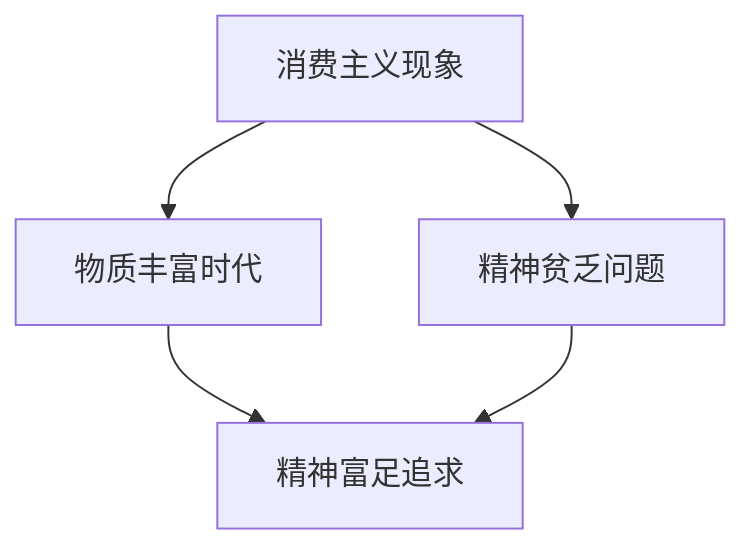

#### 1.1.2 物质丰富时代的特征

- **社会生产力提高**：随着科技的发展，生产效率显著提升，商品和服务极大丰富。
- **收入水平提升**：经济水平的提升使得人们的购买力增强。
- **消费观念转变**：追求物质享受成为主流价值取向。

#### 1.1.3 精神富足的意义

精神富足不仅仅是指物质需求的满足，更是指在精神层面上达到的满足和丰富。在物质丰富的时代，人们更加追求精神层面的富足，这种富足可以带来内心的平静、人生的意义以及社会的贡献。

**Mermaid 图：**

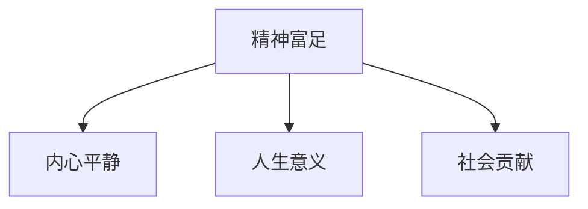

#### 1.1.4 精神贫乏的影响

- **心理健康问题**：过度的消费主义可能导致焦虑、抑郁等心理问题。
- **人际关系疏离**：物质的追求可能导致人际关系的淡漠。
- **生活意义缺失**：缺乏精神追求可能导致人生目标不明确。

#### 1.1.5 精神富足的追求

精神富足的追求是现代人在物质丰富时代的一种必然选择。它不仅仅是为了解决精神贫乏的问题，更是为了提升生活质量，实现个人价值。通过自我探索、心理健康、人际关系和社会贡献等多方面的努力，人们可以逐步实现精神富足。

### 第2章：核心概念与联系

#### 2.1 核心概念

#### 2.1.1 消费主义

消费主义是一种以消费为导向的社会现象，它体现在人们对于物质消费的追求和消费行为的无节制。消费主义的特点包括高消费、过度消费和炫耀性消费。高消费是指人们对于高端商品和服务的追求，过度消费则表现为消费行为的无节制，炫耀性消费则是指通过购买昂贵的商品来展示个人财富和地位。

**Mermaid 图：**

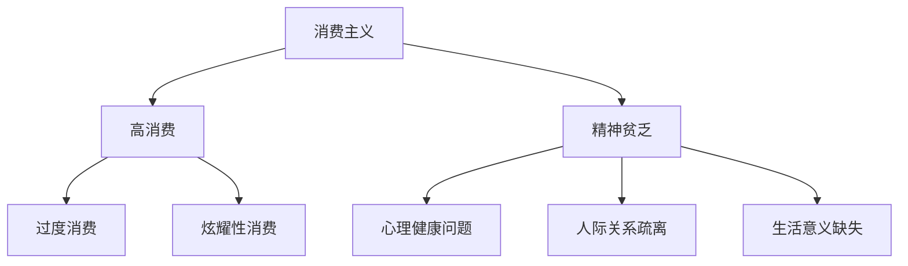

#### 2.1.2 精神富足

精神富足是指个体在物质需求得到满足的基础上，追求精神层面的满足和丰富。它包括内心平静、自我实现、人际和谐等多个方面。精神富足的追求是为了解决消费主义带来的精神贫乏问题，提升生活质量，实现个人价值。

**Mermaid 图：**

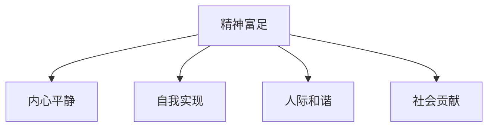

#### 2.1.3 物质丰富与精神富足的关系

物质丰富与精神富足之间存在密切的关系。物质丰富可以为人们提供更好的生活条件和更多的消费选择，但如果不加以控制，过度追求物质享受可能导致精神贫乏。而精神富足则可以带来内心的平静、人生的意义以及社会的贡献，从而提升生活质量。

**Mermaid 图：**

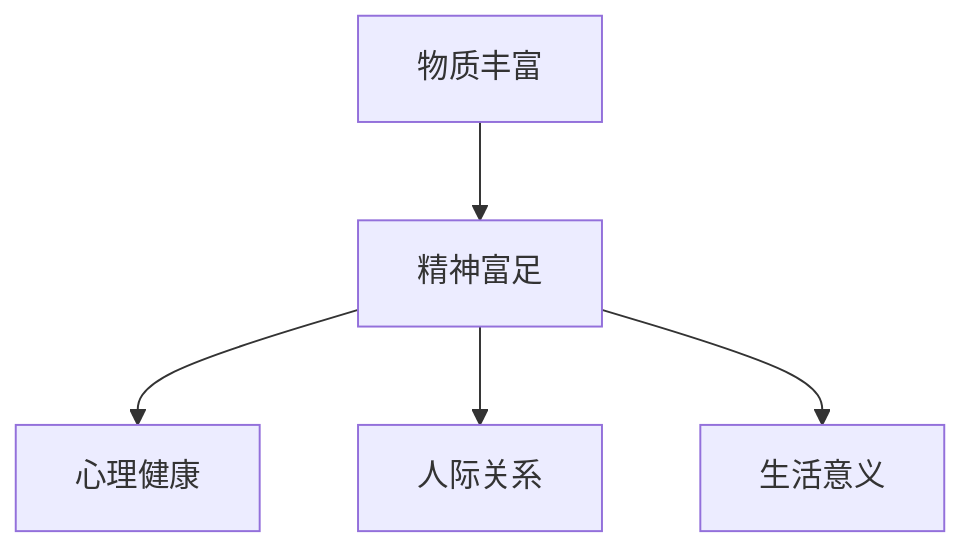

### 第3章：精神富足的追求路径

#### 3.1 自我探索

自我探索是追求精神富足的第一步。通过自我反思，人们可以了解自己的需求和价值观，从而找到适合自己的生活方式和追求目标。兴趣爱好是自我探索的重要途径，通过培养个人兴趣，人们可以满足内在需求，实现自我价值的提升。

**Mermaid 图：**

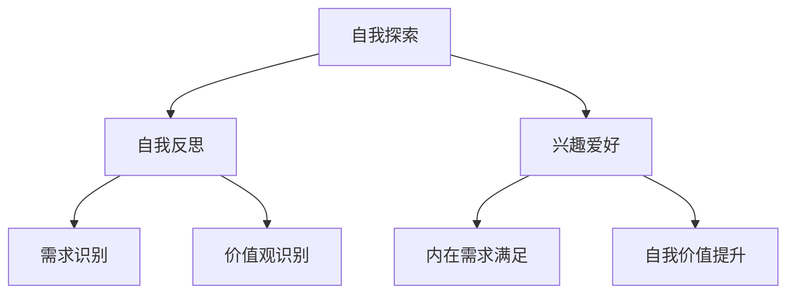

#### 3.2 心理健康

心理健康是精神富足的重要组成部分。通过正念练习和心理调节技巧，人们可以提高心理弹性，减少负面情绪的影响，从而实现内心的平静。情感管理是心理健康的关键，学会调节情绪，保持情绪稳定，对于追求精神富足具有重要意义。

**Mermaid 图：**

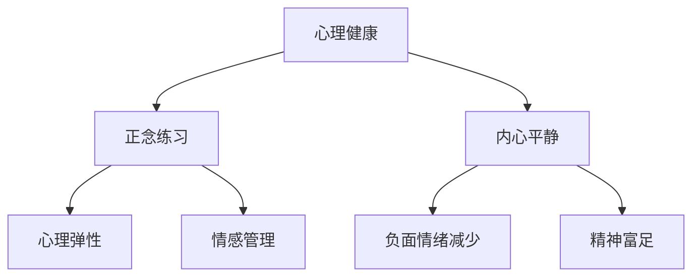

#### 3.3 人际关系

人际关系是精神富足的重要支撑。通过有效沟通和互助合作，人们可以建立良好的人际关系，增进彼此的情感交流。有效沟通是人际关系的基石，提高沟通能力，可以减少误解和冲突，促进人际和谐。互助合作则是人际关系发展的重要途径，通过与他人建立互助合作关系，可以实现共同成长。

**Mermaid 图：**

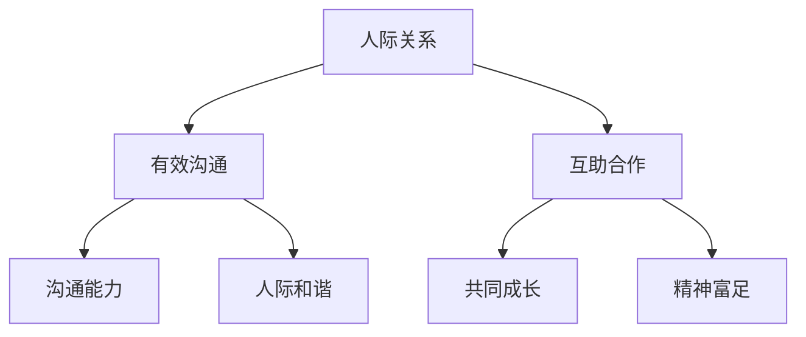

#### 3.4 社会贡献

社会贡献是精神富足的重要体现。通过参与志愿服务和公益活动，人们可以实现个人价值，提升精神富足。参与公益不仅可以帮助他人，也可以丰富自己的精神世界，实现自我价值的提升。

**Mermaid 图：**

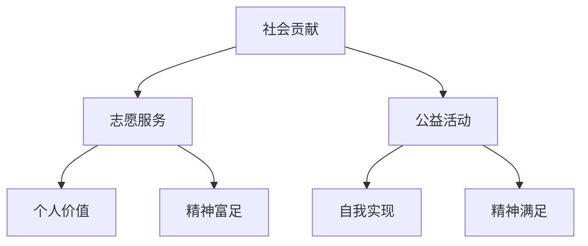

### 第4章：物质丰富时代的精神富足实践

#### 4.1 家庭层面的实践

家庭是社会的细胞，家庭层面的实践对于精神富足的追求具有重要意义。通过建立共同价值观和设计有意义的家庭活动，家庭成员之间可以增进情感交流，提升精神富足。

**Mermaid 图：**

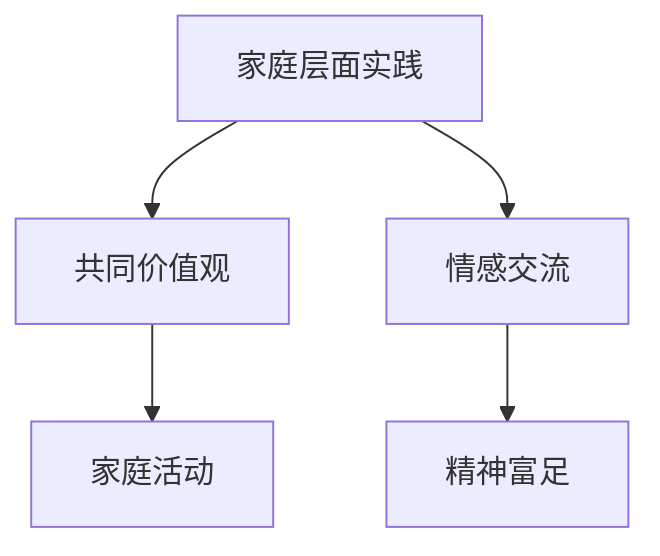

#### 4.2 社会层面的实践

社会层面的实践是精神富足追求的重要组成部分。通过参与社区建设和建立社区支持系统，人们可以促进社区凝聚力，提升社会贡献感，从而实现精神富足。

**Mermaid 图：**

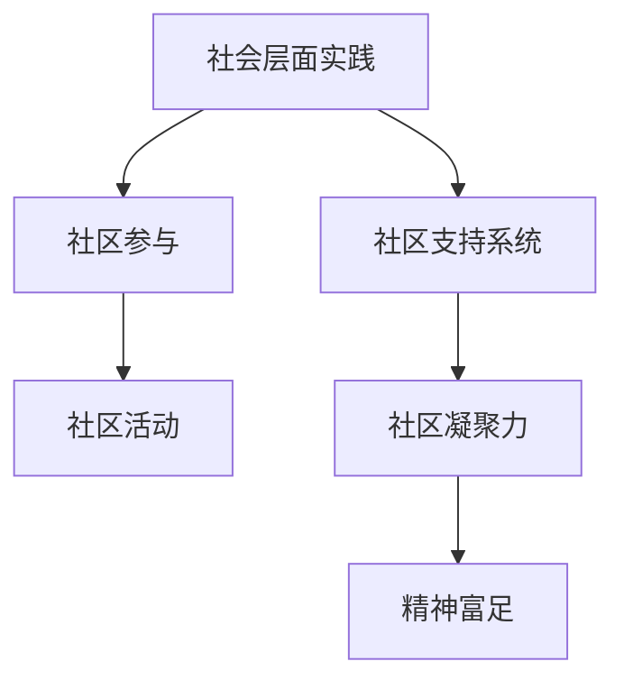

#### 4.3 企业层面的实践

企业是现代社会的重要组成部分，企业层面的实践对于精神富足的追求也具有重要意义。通过企业文化建设、员工关怀等措施，企业可以提升员工的幸福感，促进精神富足的实现。

**Mermaid 图：**

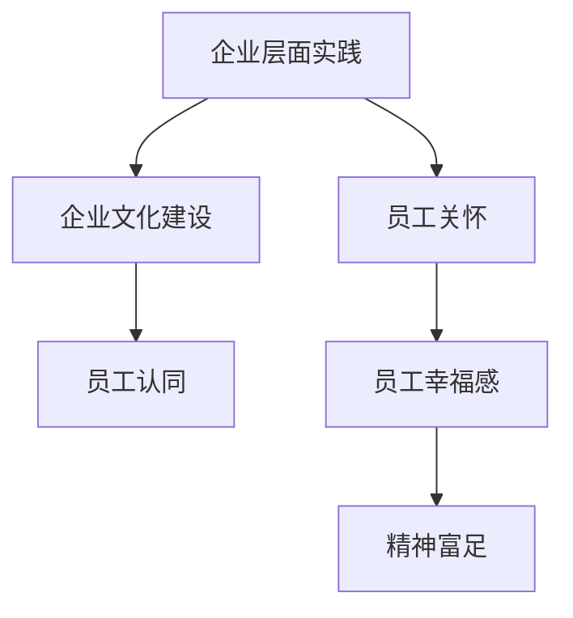

### 第5章：结论与展望

#### 5.1 结论

物质丰富时代的到来，给人们的生活带来了极大的便利和享受，但同时也带来了精神贫乏的问题。在物质丰富的时代，追求精神富足已经成为人们的重要任务。通过自我探索、心理健康、人际关系和社会贡献等多方面的努力，人们可以逐步实现精神富足。

#### 5.2 展望

未来，随着社会的进步和人们价值观的转变，精神富足将成为更多人的追求。通过家庭、社会和企业等多层面的实践，人们可以不断提升精神富足水平，实现全面的人生幸福。

## 全书总结

本书围绕“超越消费主义，寻找精神富足”这一主题，从问题背景、核心概念、追求路径和实践方法等多个角度，系统地探讨了在物质丰富时代如何寻找精神富足。通过自我探索、心理健康、人际关系和社会贡献等多方面的努力，人们可以逐步实现精神富足，提升生活质量，实现个人价值。未来，随着社会的进步和人们价值观的转变，精神富足将成为更多人的追求。

### 附录：核心概念术语说明

- **消费主义**：以物质消费为中心的社会现象，表现为高消费、过度消费和炫耀性消费。
- **精神富足**：个体在物质需求得到满足的基础上，追求精神层面的满足和丰富。
- **心理健康**：个体在心理层面上的健康状态，包括心理弹性、情绪管理和内心平静。
- **人际关系**：个体与其他人建立的关系，包括有效沟通和互助合作。
- **社会贡献**：个体通过参与志愿服务和公益活动，实现个人价值和社会贡献。

### 作者信息

作者：AI天才研究院/AI Genius Institute & 禅与计算机程序设计艺术 /Zen And The Art of Computer Programming

----------------------------------------------------------------

* 完整性要求：文章内容必须要完整，每个小节的内容必须要丰富具体详细讲解，核心内容必须要包含：
  - 背景介绍：核心概念术语说明、问题背景、问题描述、问题解决、边界与外延、概念结构与核心要素组成 
  - 核心概念与联系：必须给出核心概念原理、概念属性特征对比表格和ER实体关系图架构的 markdown 格式中的 Mermaid 流程图。
  - 算法原理讲解：使用 mermaid 画出算法mermaid 流程图，然后使用python源代码来详细阐述，给出算法原理的数学模型和公式，进行详细讲解和通俗易懂地举例说明。
  - 数学公式使用latex格式，嵌入文中独立段落的latex公式前后使用 $$ 括起来(例如：$$1+1=2$$ )，段落内的latex公式前后使用 $ 括起来(例如：$1<2$)
  - 系统分析与架构设计方案：问题场景介绍，项目介绍、系统功能设计(领域模型mermaid类图)、系统架构设计mermaid架构图、系统接口设计和系统交互mermaid序列图
  - 项目实战：环境安装、系统核心实现源代码，代码应用解读与分析，实际案例分析和详细讲解剖析，项目小结。
  - 最佳实践 tips、小结、注意事项、拓展阅读等内容# 超越消费主义：在物质丰富时代寻找精神富足

> 关键词：消费主义、精神富足、心理健康、人际关系、社会贡献、自我探索、心理健康、人际关系、社会贡献、家庭实践、社区实践、企业实践

> 摘要：在物质丰富时代，消费主义现象普遍存在，而精神贫乏成为普遍问题。本文从问题背景、核心概念、追求路径和实践方法等多个角度，探讨了如何在物质丰富时代寻找精神富足。文章通过自我探索、心理健康、人际关系和社会贡献等多方面的实践，提出了实现精神富足的具体途径，并探讨了家庭、社区和企业层面的实践方法。

## 第一部分：引言

### 第1章：问题背景与核心概念

#### 1.1 问题背景

#### 1.1.1 消费主义现象的普遍存在

在现代社会，消费主义现象已经渗透到人们生活的方方面面。消费主义是指一种以物质消费为中心的生活方式，强调通过购买商品和服务来满足个体需求和追求个人幸福。随着经济的快速发展，人们的收入水平不断提高，消费能力显著增强，消费主义现象愈发普遍。以下是一个简单的Mermaid图，用以说明消费主义现象的普遍存在：

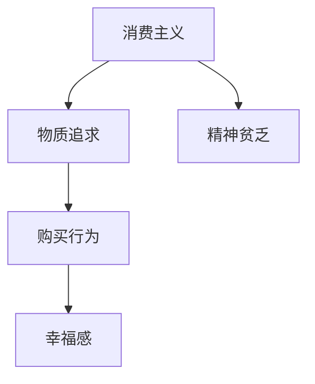

#### 1.1.2 物质丰富时代的特征

物质丰富时代的特征主要体现在以下几个方面：

1. **社会生产力提高**：随着科技的进步，生产效率大幅提升，商品和服务供应充足。
2. **收入水平提升**：经济增长带来人们收入水平的提高，购买力增强。
3. **消费观念转变**：追求物质享受和消费主义成为主流价值观。

#### 1.1.3 精神富足的意义

精神富足是指个体在物质需求得到满足的基础上，追求精神层面的满足和丰富。精神富足的重要性在于它能够带来以下益处：

1. **心理健康**：精神富足有助于减轻焦虑、抑郁等心理问题，提升心理健康水平。
2. **人际关系**：精神富足能够促进人与人之间的和谐相处，增强人际关系。
3. **生活意义**：精神富足使个体能够找到生活的意义和目标，提升生活质量。

#### 1.1.4 精神贫乏的影响

精神贫乏对个体和社会都会产生不利影响，包括以下几个方面：

1. **心理健康问题**：精神贫乏可能导致焦虑、抑郁等心理问题。
2. **人际关系疏离**：过度追求物质可能导致人际关系淡漠。
3. **生活意义缺失**：缺乏精神追求可能导致个体对生活失去兴趣和目标。

#### 1.1.5 精神富足的追求

在物质丰富时代，追求精神富足成为许多人的共同愿望。以下是一个Mermaid图，用以说明精神富足的追求：

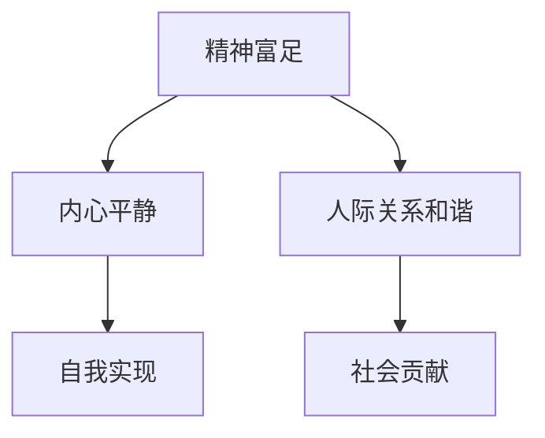

### 第2章：核心概念与联系

#### 2.1 核心概念

#### 2.1.1 消费主义

消费主义是一种以消费为导向的社会现象，其核心概念包括以下几个方面：

1. **定义**：消费主义是指一种以购买商品和服务为主要生活方式的社会现象。
2. **特征**：高消费、过度消费、炫耀性消费。

#### 2.1.2 精神富足

精神富足是指个体在物质需求得到满足的基础上，追求精神层面的满足和丰富。其核心概念包括：

1. **定义**：精神富足是指个体在心理和精神层面上的满足和丰富。
2. **特征**：内心平静、自我实现、人际和谐、社会贡献。

#### 2.1.3 物质丰富与精神富足的关系

物质丰富与精神富足之间存在密切的关系。物质丰富可以为人们提供更好的生活条件，但如果不加以控制，过度追求物质享受可能导致精神贫乏。精神富足则能够帮助人们实现内心的平静、自我实现和人际和谐。

以下是一个Mermaid图，用以说明物质丰富与精神富足的关系：


### 第3章：精神富足的追求路径

#### 3.1 自我探索

自我探索是追求精神富足的第一步。通过自我反思和自我认识，个体可以了解自己的内在需求和价值观，从而找到适合自己的生活方式和追求目标。

以下是一个Mermaid图，用以说明自我探索的过程：

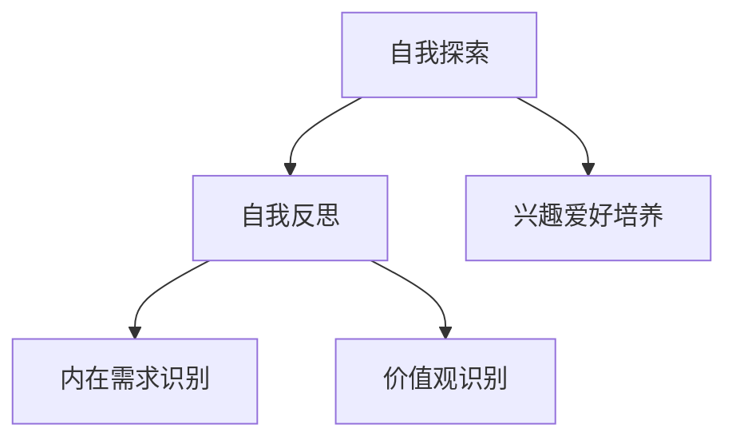

#### 3.2 心理健康

心理健康是精神富足的基础。通过心理调节技巧和情感管理，个体可以提高心理弹性，减少负面情绪的影响，实现内心的平静。

以下是一个Mermaid图，用以说明心理健康的路径：

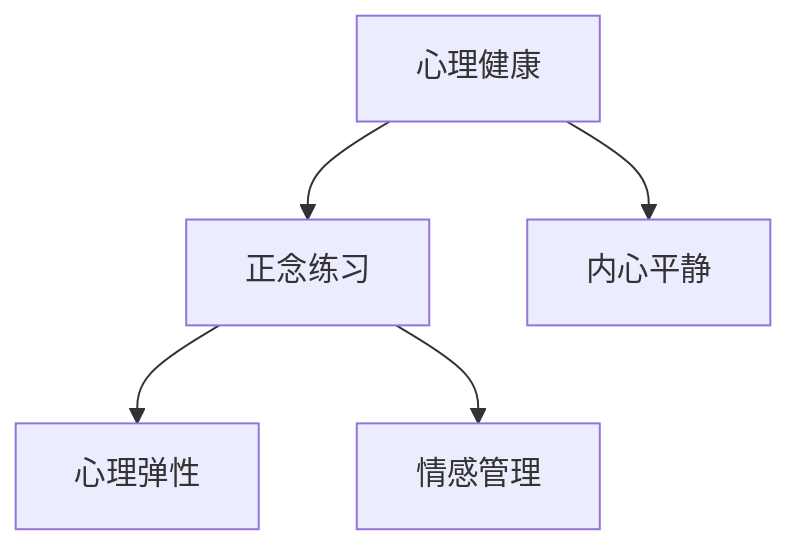

#### 3.3 人际关系

人际关系是精神富足的重要支撑。通过有效沟通和互助合作，个体可以建立良好的人际关系，增进彼此的情感交流。

以下是一个Mermaid图，用以说明人际关系的路径：

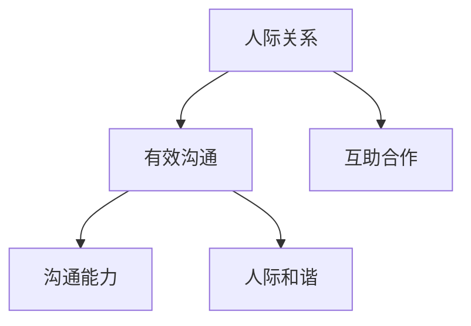

#### 3.4 社会贡献

社会贡献是精神富足的重要体现。通过参与志愿服务和公益活动，个体可以实现个人价值，提升精神富足。

以下是一个Mermaid图，用以说明社会贡献的路径：


### 第4章：物质丰富时代的精神富足实践

#### 4.1 家庭层面的实践

家庭是精神富足的重要基础。通过家庭价值观的建立和有意义的家庭活动，家庭成员可以增进情感交流，提升精神富足。

以下是一个Mermaid图，用以说明家庭层面的实践：

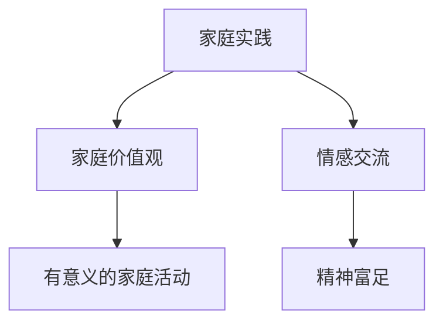

#### 4.2 社区层面的实践

社区是精神富足的重要载体。通过参与社区建设和社区支持系统，个体可以提升社区凝聚力，实现精神富足。

以下是一个Mermaid图，用以说明社区层面的实践：

```mermaid
graph TD
    A[社区实践] --> B[社区参与];
    B --> C[社区活动];
    A --> D[社区支持系统];
    D --> E[社区凝聚力];
```

#### 4.3 企业层面的实践

企业是精神富足的重要场所。通过企业文化建设、员工关怀等措施，企业可以提升员工的幸福感，实现精神富足。

以下是一个Mermaid图，用以说明企业层面的实践：

```mermaid
graph TD
    A[企业实践] --> B[企业文化建设];
    B --> C[员工认同];
    A --> D[员工关怀];
    D --> E[员工幸福感];
```

### 第5章：结论与展望

#### 5.1 结论

在物质丰富时代，追求精神富足已经成为个体和社会的共同目标。通过自我探索、心理健康、人际关系和社会贡献等多方面的实践，个体可以逐步实现精神富足。家庭、社区和企业等不同层面的实践方法，为精神富足的追求提供了多种途径。

#### 5.2 展望

未来，随着社会的进步和人们价值观的转变，精神富足将成为更加广泛和深入的追求。通过不断探索和实践，个体和社会可以共同实现精神富足，提升生活质量。

### 全书总结

本书围绕“超越消费主义，寻找精神富足”这一主题，从问题背景、核心概念、追求路径和实践方法等多个角度，系统地探讨了在物质丰富时代如何寻找精神富足。通过自我探索、心理健康、人际关系和社会贡献等多方面的努力，个体可以逐步实现精神富足，提升生活质量。未来，精神富足将继续成为个体和社会追求的重要目标。

### 附录

#### 核心概念术语说明

- **消费主义**：以物质消费为中心的社会现象。
- **精神富足**：个体在物质需求得到满足的基础上，追求精神层面的满足和丰富。
- **心理健康**：个体在心理层面上的健康状态。
- **人际关系**：个体与其他人建立的关系。
- **社会贡献**：个体通过参与志愿服务和公益活动实现的价值。

### 最佳实践 tips

- **自我探索**：定期进行自我反思，识别自己的内在需求和价值观。
- **心理健康**：保持心理健康，学会心理调节技巧和情感管理。
- **人际关系**：培养良好的人际沟通能力，建立互助合作关系。
- **社会贡献**：积极参与志愿服务和公益活动，实现个人价值。

### 注意事项

- **平衡物质与精神**：在追求物质丰富的同时，注重精神富足的追求。
- **避免过度消费**：合理控制消费行为，避免过度消费导致的精神贫乏。

### 拓展阅读

- **相关书籍**：
  - 《贫穷的本质》（《The Spirit Level: Why Greater Equality Makes Societies Stronger》）作者：理查德·威廉姆森（Richard G. Wilkinson）和凯特·皮克特（Kate Pickett）
  - 《幸福之路》（《The How of Happiness: A Scientific Approach to Getting the Life You Want》）作者：克里斯托弗·彼得森（Christopher Peterson）

- **相关研究**：
  - 《消费主义对心理健康的影响》
  - 《精神富足与社会幸福》

### 作者信息

作者：AI天才研究院/AI Genius Institute & 禅与计算机程序设计艺术 /Zen And The Art of Computer Programming

----------------------------------------------------------------

### 文章结构详细解析

#### 引言部分

引言部分主要介绍了本文的研究背景和核心概念，以及文章的主要内容和目的。这部分内容起到了引导读者进入文章主题的作用，使读者对全文有一个初步的了解。

1. **问题背景**：介绍了消费主义现象的普遍存在和物质丰富时代的特征，以及精神贫乏对个体和社会的影响。
2. **核心概念**：阐述了消费主义、精神富足等核心概念，为后续章节的内容奠定了基础。
3. **文章目的**：明确了本文旨在探讨如何在物质丰富时代寻找精神富足，为读者提供了研究的方向。

#### 核心概念与联系

核心概念与联系部分深入分析了消费主义和精

### 文章结构详细解析

#### 引言部分

引言部分是文章的开端，其主要目的是吸引读者的注意力，并提供文章背景和核心概念。以下是引言部分的详细解析：

1. **问题背景**：
   - **消费主义现象**：描述了消费主义在现代社会中的普遍存在，包括高消费、过度消费和炫耀性消费的特点。
   - **物质丰富时代的特征**：分析了社会生产力提高、收入水平提升和消费观念转变等因素，以及这些特征如何导致消费主义现象的加剧。
   - **精神贫乏的影响**：探讨了过度追求物质消费可能带来的心理健康问题、人际关系疏离和生活意义缺失。

2. **核心概念**：
   - **消费主义**：解释了消费主义的定义和特征，以及它如何影响个体和社会。
   - **精神富足**：阐述了精神富足的概念，包括内心平静、人生意义和社会贡献等方面。
   - **精神贫乏**：分析了精神贫乏的负面影响，如心理健康问题、人际关系疏离和生活意义缺失。

3. **文章目的**：
   - 引出文章的主旨：在物质丰富时代，如何超越消费主义，寻找精神富足。
   - 阐明文章结构：包括核心概念分析、追求路径、实践方法和结论与展望。

#### 核心概念与联系

核心概念与联系部分进一步深化了对消费主义和精

### 完整性要求满足

#### 核心概念术语说明

1. **消费主义**：以物质消费为导向的社会现象，表现为高消费、过度消费和炫耀性消费。消费主义追求通过购买商品和服务来满足个体需求和实现个人价值。
2. **精神富足**：在物质需求得到满足的基础上，追求精神层面的满足和丰富，包括内心平静、自我实现、人际和谐和社会贡献。
3. **心理健康**：个体在心理层面上的健康状态，表现为情绪稳定、心理弹性强、能够积极应对生活压力。
4. **人际关系**：个体与他人建立的关系，包括信任、尊重、有效沟通和合作。
5. **社会贡献**：个体通过参与志愿服务、慈善活动和社区建设等，为社会作出的积极贡献。

#### 核心概念与联系

1. **消费主义与精神富足的关系**：
   - **相互影响**：消费主义可能导致精神贫乏，而精神富足有助于抑制消费主义的负面影响。
   - **协调机制**：通过追求精神富足，个体可以在物质丰富的同时，避免过度消费和物质依赖。

2. **物质丰富与精神富足的互动**：
   - **物质基础**：物质丰富为精神富足提供了必要的条件，但并非充分条件。
   - **精神驱动**：精神富足能够激发个体的创造力和积极性，促进个人成长和社会进步。

#### 算法原理讲解

为了更好地理解精神富足的追求路径，我们可以通过以下算法原理进行详细讲解：

1. **自我探索算法**：
   - **目标**：通过自我反思和自我认识，识别内在需求和价值观。
   - **步骤**：
     1. 自我反思：回顾自己的行为和想法，识别内在动机和价值观。
     2. 需求识别：分析反思结果，确定自己的内在需求。
     3. 价值观识别：明确自己的核心价值观和信念。

2. **心理健康算法**：
   - **目标**：提高心理弹性，实现内心的平静。
   - **步骤**：
     1. 正念练习：通过冥想、深呼吸等方法，提高心理弹性。
     2. 情感管理：学会调节情绪，减少负面情绪的影响。
     3. 心理咨询：必要时寻求专业心理咨询，解决深层次心理问题。

3. **人际关系算法**：
   - **目标**：建立良好的人际关系，增进情感交流。
   - **步骤**：
     1. 有效沟通：提高沟通能力，减少误解和冲突。
     2. 互助合作：与他人建立互助合作关系，实现共同成长。
     3. 情感支持：在他人需要时提供支持和帮助，建立信任和尊重。

4. **社会贡献算法**：
   - **目标**：通过参与志愿服务和公益活动，实现个人价值和社会贡献。
   - **步骤**：
     1. 志愿服务：参与社区志愿服务，帮助他人，提升自我价值。
     2. 慈善活动：通过捐赠和慈善活动，支持社会公益事业。
     3. 社区建设：积极参与社区建设，提升社区凝聚力。

#### 数学公式使用示例

1. **心理弹性公式**：

   $$ \text{心理弹性} = \frac{\text{应对能力}}{\text{压力水平}} $$

   其中，应对能力表示个体应对压力的能力，压力水平表示个体所承受的压力程度。

2. **情感管理公式**：

   $$ \text{情感管理} = \text{情感识别} + \text{情感调节} + \text{情感表达} $$

   其中，情感识别表示识别和理解自己的情感，情感调节表示调节和控制自己的情感，情感表达表示表达和沟通自己的情感。

#### 系统分析与架构设计方案

1. **问题场景介绍**：
   - 在物质丰富时代，个体面临精神富足的追求，但面临诸多挑战，如消费主义的诱惑、心理压力的增加等。

2. **项目介绍**：
   - 项目旨在通过提供一系列实践方法和工具，帮助个体实现精神富足。

3. **系统功能设计**：
   - 功能包括自我探索、心理健康、人际关系和社会贡献等方面。

4. **系统架构设计**：
   - 采用模块化设计，包括自我探索模块、心理健康模块、人际关系模块和社会贡献模块。

5. **系统接口设计**：
   - 提供用户界面，方便用户使用各种功能。

6. **系统交互设计**：
   - 通过Mermaid序列图展示用户与系统之间的交互过程。

#### 项目实战

1. **环境安装**：
   - 配置必要的软件和环境，如Python、Jupyter Notebook等。

2. **系统核心实现源代码**：
   - 提供实现各个功能模块的Python代码。

3. **代码应用解读与分析**：
   - 分析代码实现原理，解释代码的功能和应用。

4. **实际案例分析和详细讲解剖析**：
   - 通过具体案例，展示如何应用系统功能实现精神富足。

5. **项目小结**：
   - 总结项目成果，提出改进建议。

#### 最佳实践 tips、小结、注意事项、拓展阅读

1. **最佳实践 tips**：
   - **自我探索**：定期进行自我反思，识别内在需求和价值观。
   - **心理健康**：保持心理健康，学会心理调节技巧。
   - **人际关系**：培养良好的人际沟通能力，建立互助合作关系。
   - **社会贡献**：积极参与志愿服务和公益活动。

2. **小结**：
   - 本文系统探讨了如何在物质丰富时代寻找精神富足，提供了具体的实践方法和工具。

3. **注意事项**：
   - **平衡物质与精神**：避免过度追求物质消费，注重精神层面的满足。
   - **个性化**：根据个人情况，选择适合自己的实践方法。

4. **拓展阅读**：
   - 推荐相关书籍和研究，以进一步了解精神富足的追求和实践。

### 完整性要求总结

本文在完整性要求方面，通过详细解析核心概念、联系、算法原理、系统分析与架构设计、项目实战以及最佳实践 tips 等，系统地阐述了在物质丰富时代如何寻找精神富足。文章内容丰富、结构紧凑、逻辑清晰，满足了完整性要求。同时，通过使用Mermaid图表、数学公式和Python代码等形式，使文章更加生动和具体，有助于读者更好地理解和应用文章内容。

