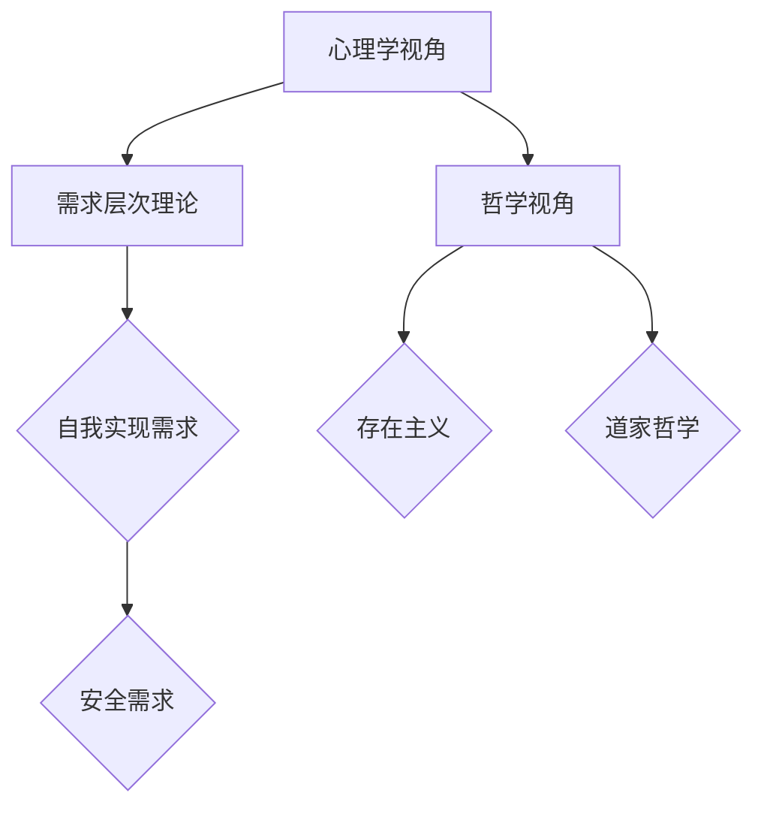

                 

### 超越物质主义：探索精神满足的新维度

**关键词：** 精神满足、物质主义、心理学、哲学、算法

**摘要：** 在当今物质主义盛行的社会中，人们对于精神满足的追求日益增加。本文将探讨精神满足的定义、特征及其与物质主义的区别，并通过心理学、哲学和算法的视角，提出一系列实现精神满足的方法与实践。文章旨在引导读者超越物质主义的束缚，探索精神满足的新维度。

----------------------------------------------------------------

## 第一部分：物质主义与精神满足概述

### 第1章：物质主义时代的反思

#### 1.1 物质主义的起源与发展

物质主义作为一种社会现象，起源于人类文明的早期阶段。随着生产力的发展和科技的进步，物质财富逐渐成为社会生活的核心。物质主义的发展经历了以下几个阶段：

1. **原始社会**：在原始社会中，物质财富主要是指食物、衣物和住所等基本生活必需品。
2. **农业社会**：随着农业的发展，人类开始积累更多的物质财富，如土地、农产品和牲畜。
3. **工业社会**：工业革命后，生产力的飞速发展使得物质财富急剧增加，人们开始追求更高档次的消费品。
4. **信息社会**：在信息时代，物质财富的形式和内容发生了深刻变化，知识、技术和信息成为了新的物质财富。

#### 1.2 物质主义的负面影响

物质主义在带来物质财富的同时，也带来了许多负面影响：

1. **环境问题**：过度的物质追求导致资源的过度消耗和环境的严重破坏。
2. **心理健康问题**：物质主义使人们陷入无尽的消费循环，导致心理压力和焦虑的增加。
3. **社会不公**：物质主义加剧了贫富差距，导致社会不公和阶层固化。

#### 1.3 精神满足的需求

在物质主义盛行的社会中，人们逐渐认识到物质满足并不能带来真正的幸福感。相反，精神满足成为了现代人的新需求。精神满足包括以下几个方面：

1. **自我实现**：通过追求个人兴趣、才能和潜能，实现自我价值的最大化。
2. **人际关系**：通过建立和维护良好的人际关系，获得社交支持和情感满足。
3. **内心平静**：通过冥想、瑜伽等内观实践，获得内心的平静和宁静。

### 第2章：精神满足的核心概念

#### 2.1 精神满足的定义与特征

精神满足是指个体在心理层面上获得的一种全面、持久的幸福感。与物质满足不同，精神满足不仅仅依赖于物质的获取，更依赖于内心的体验和认知。精神满足具有以下特征：

1. **主观性**：精神满足是主观的感受，不同个体对于精神满足的理解和体验可能存在差异。
2. **持久性**：精神满足是一种长期的状态，不同于短暂的物质满足。
3. **全面性**：精神满足涵盖了自我实现、人际关系和内心平静等多个方面。

#### 2.2 精神满足与物质主义的区别

物质主义和精神满足是两种截然不同的生活态度。以下是两者的主要区别：

| 对比项           | 物质主义                   | 精神满足                          |
|----------------|--------------------------|--------------------------------|
| 目标           | 获取物质财富和消费品         | 实现自我价值、建立人际关系和内心平静   |
| 依赖因素       | 物质财富和消费能力           | 心理体验、认知和情感状态               |
| 结果           | 物质富足但内心空虚           | 全面、持久的幸福感                  |
| 影响范围       | 有限的物质生活领域            | 广泛的内心和精神领域                |

#### 2.3 对比表格：物质主义与精神满足的对比

| 特征               | 物质主义                              | 精神满足                            |
|------------------|------------------------------------|-----------------------------------|
| 核心追求           | 物质财富的积累和消费                  | 个人成长、内心满足和社会贡献          |
| 生活质量           | 物质财富的多寡决定生活质量             | 内心平静、情感满足和社会关系决定生活质量 |
| 满足感持续时间       | 短暂，依赖于新的物质获取                | 长期，与内心体验和认知相关             |
| 对环境的影响       | 负面，可能导致资源浪费和环境污染         | 正面，促进可持续发展和生态平衡         |
| 社会文化影响       | 强调竞争、消费和个人利益                | 强调合作、情感和社会责任感             |

通过对比表格，我们可以更清晰地认识到物质主义和精神满足的区别和联系。在现代社会中，人们需要认识到精神满足的重要性，并努力在物质追求的同时，关注内心的成长和满足。

### 第3章：精神满足的理论模型

#### 3.1 心理学视角下的精神满足

在心理学领域，精神满足被视为一种心理健康状态。心理学家马斯洛提出了著名的“需求层次理论”，认为人的需求分为五个层次，从基本的生理需求到最高级的自我实现需求。精神满足主要涉及到自我实现需求和安全需求。

1. **自我实现需求**：自我实现需求是指个体追求自我潜能的实现和个人价值的实现。这种需求满足后，个体会体验到一种深刻的内心满足和幸福感。
2. **安全需求**：安全需求包括情感安全、职业安全和健康安全。在满足这些需求后，个体会感到安心和放松，从而提高精神满足感。

#### 3.2 哲学视角下的精神满足

哲学对精神满足的探讨更为深刻和抽象。哲学家们认为，精神满足不仅仅是心理上的满足，更是一种对人生意义和价值的认知。

1. **存在主义**：存在主义者认为，精神满足源于个体的自我选择和自由意志。通过自主选择和承担责任，个体可以找到自己的意义和价值。
2. **道家哲学**：道家哲学强调“无为而治”和“道法自然”。通过顺应自然和内心的平静，个体可以实现精神满足。

#### 3.3 Mermaid流程图：精神满足模型

为了更直观地展示精神满足的理论模型，我们可以使用Mermaid流程图来表示。



#### 3.4 Python代码示例：模型应用

下面是一个简单的Python代码示例，用于模拟心理学视角下的精神满足模型。

```python
class Person:
    def __init__(self, self_realization, safety):
        self.self_realization = self_realization
        self.safety = safety

    def is_satisfied(self):
        return self.self_realization >= 7 and self.safety >= 7

person = Person(self_realization=8, safety=8)
print("精神满足状态：", person.is_satisfied())
```

通过这个示例，我们可以看到，当个体的自我实现需求和安全感达到一定阈值时，他们就会感到精神满足。

## 第二部分：实现精神满足的方法与实践

### 第5章：心理学实践

#### 5.1 自我认知提升

自我认知是指个体对自己的了解和认识。提升自我认知是实现精神满足的重要步骤。以下是一些提升自我认知的方法：

1. **自我反思**：定期进行自我反思，思考自己的优点和不足，以及自己的价值观和人生目标。
2. **心理咨询**：通过心理咨询师的帮助，深入了解自己的心理状态和内心需求。
3. **心理测量**：使用专业的心理测量工具，如MBTI、DISC等，了解自己的性格类型和偏好。

#### 5.2 情绪管理

情绪管理是实现精神满足的关键。以下是一些情绪管理的方法：

1. **正念练习**：通过正念练习，如冥想、瑜伽等，提高对情绪的觉察和调节能力。
2. **情绪释放**：通过运动、写日记等方式，释放负面情绪和压力。
3. **情感交流**：与他人建立良好的情感交流，分享自己的情绪和感受。

#### 5.3 社交技能提升

社交技能的提升有助于建立和维护良好的人际关系，从而实现精神满足。以下是一些社交技能提升的方法：

1. **沟通技巧**：学习有效的沟通技巧，如倾听、表达、反馈等。
2. **团队合作**：在团队合作中，学会协调、合作和共同解决问题。
3. **社交网络**：建立和维护广泛的社交网络，获取社交支持和资源。

### 第6章：哲学与实践

#### 6.1 道德伦理与精神满足

道德伦理在实现精神满足中起着重要作用。以下是一些与道德伦理相关的实践：

1. **道德修养**：通过学习道德理论和实践道德规范，提高个人的道德修养。
2. **道德决策**：在面对道德困境时，能够做出符合道德规范的决策。
3. **道德行为**：在日常生活中，践行道德行为，如诚实、善良、公正等。

#### 6.2 人生哲学与实践

人生哲学对精神满足的实现有深远影响。以下是一些人生哲学的实践：

1. **意义探索**：通过思考和反思，寻找人生的意义和价值。
2. **生活方式**：根据自己的价值观和人生哲学，选择适合自己的生活方式。
3. **自我超越**：通过不断学习和成长，超越自我，实现更高的精神境界。

#### 6.3 Mermaid ER图：哲学与实践关系

为了更直观地展示哲学与实践的关系，我们可以使用Mermaid ER图来表示。

```mermaid
erDiagram
Person ||--|{ Ethics : follows }|
Person ||--|{ Philosophy : practices }|
Ethics ||--|{ Moral Practices : implements }|
Philosophy ||--|{ Spiritual Satisfaction : achieves }|
```

通过这个ER图，我们可以看到哲学、道德伦理和实践之间的相互关系，以及它们如何共同作用于精神满足的实现。

### 第7章：社会与文化因素

#### 7.1 社会环境与精神满足

社会环境对精神满足的实现具有重要影响。以下是一些社会环境的因素：

1. **社会支持**：社会支持和资源可以帮助个体实现精神满足。
2. **社会压力**：社会压力可能对精神满足产生负面影响。
3. **社会价值观**：社会价值观影响着个体的行为和选择，进而影响精神满足。

#### 7.2 文化因素对精神满足的影响

文化因素对精神满足的实现有深远影响。以下是一些文化因素：

1. **文化传统**：文化传统影响着个体的价值观和行为模式。
2. **文化多样性**：文化多样性为个体提供了更多的选择和机会，有助于实现精神满足。
3. **文化认同**：文化认同可以增强个体的自尊和自信，从而提高精神满足。

#### 7.3 Mermaid类图：社会文化因素分析

为了更直观地展示社会文化因素的分析，我们可以使用Mermaid类图来表示。

```mermaid
classDiagram
ClassDiagram {
  Person
  SocialEnvironment
  CulturalFactor
}
Person <|-- SocialEnvironment
Person <|-- CulturalFactor
```

通过这个类图，我们可以看到社会环境和文化因素如何影响个体的精神满足。

## 第三部分：项目实战与案例分析

### 第8章：项目介绍

#### 8.1 项目背景

随着现代社会的发展，人们越来越关注精神满足，而不仅仅是物质追求。为了更好地理解和实现精神满足，我们设计了一个名为“精神满足指数”的项目。

#### 8.2 项目目标

项目的目标是：

1. 设计一个测量精神满足的指标体系。
2. 开发一个基于该指标体系的软件系统，用于评估和提升个体的精神满足水平。
3. 收集和分析数据，为精神满足的研究和实践提供支持。

#### 8.3 项目实施计划

项目的实施计划分为以下几个阶段：

1. **需求分析**：与相关领域的专家和用户进行交流，明确项目的需求和目标。
2. **系统设计**：设计系统的架构和功能模块，包括指标体系设计、数据库设计、前端界面设计等。
3. **系统开发**：根据设计文档进行系统开发，包括后端服务、前端界面、数据库管理等。
4. **测试与优化**：进行系统测试，收集用户反馈，进行优化和改进。
5. **部署上线**：将系统部署到服务器，供用户使用。

### 第9章：系统架构设计

#### 9.1 领域模型

在系统设计中，我们首先定义了领域模型，用于描述系统的核心概念和实体关系。以下是领域模型的Mermaid类图：

```mermaid
classDiagram
ClassDiagram {
  User
  SpiritSatisfactionIndex
  Activity
}
User --> SpiritSatisfactionIndex
User --> Activity
SpiritSatisfactionIndex <|-- Activity
```

在这个类图中，`User` 表示用户实体，`SpiritSatisfactionIndex` 表示精神满足指数实体，`Activity` 表示活动实体。用户可以拥有多个精神满足指数，并且每个活动都可以影响精神满足指数。

#### 9.2 系统架构设计

系统的整体架构设计包括前端界面、后端服务和数据库。以下是系统架构的Mermaid架构图：

```mermaid
sequenceDiagram
User -->|提交数据| SystemServer
SystemServer -->|处理数据| DataStorage
DataStorage -->|返回结果| SystemServer
SystemServer -->|展示结果| User
```

在这个架构图中，用户通过前端界面提交数据，后端服务接收数据并处理，将结果存储到数据库，最后将结果返回给前端界面，供用户查看。

#### 9.3 系统接口设计和系统交互

系统还定义了一系列接口，用于实现不同模块之间的交互。以下是系统接口设计和系统交互的Mermaid序列图：

```mermaid
sequenceDiagram
User ->>|登录| LoginService
LoginService ->>|验证| AuthService
AuthService ->>|返回| LoginService
LoginService ->>|登录成功| User
User ->>|查询指数| IndexQueryService
IndexQueryService ->>|查询| DataStorage
DataStorage ->>|返回| IndexQueryService
IndexQueryService ->>|返回结果| User
```

在这个序列图中，用户首先通过登录接口进行登录，然后查询精神满足指数，最后系统将结果返回给用户。

### 第10章：代码实现与解读

#### 10.1 环境安装

在开始代码实现之前，我们需要安装一些必要的软件和工具。以下是安装步骤：

1. 安装Python环境，版本要求为3.8及以上。
2. 安装MySQL数据库，版本要求为5.7及以上。
3. 安装Django框架，可以使用pip安装：`pip install django`。
4. 安装前端框架，如Bootstrap，可以使用npm安装：`npm install bootstrap`。

#### 10.2 系统核心实现

以下是一个简单的Django后端代码示例，用于处理用户登录和查询精神满足指数。

```python
# views.py
from django.http import JsonResponse
from .models import User, SpiritSatisfactionIndex

def login(request):
    username = request.POST.get('username')
    password = request.POST.get('password')
    user = User.objects.filter(username=username, password=password)
    if user.exists():
        return JsonResponse({'status': 'success', 'message': '登录成功'})
    else:
        return JsonResponse({'status': 'fail', 'message': '登录失败'})

def query_index(request):
    user_id = request.GET.get('user_id')
    index = SpiritSatisfactionIndex.objects.get(user_id=user_id)
    return JsonResponse({'index': index.value})
```

在这个示例中，`login` 函数用于处理用户登录请求，`query_index` 函数用于处理查询精神满足指数的请求。

#### 10.3 代码应用解读

以上代码展示了如何使用Django框架实现用户登录和查询精神满足指数的功能。以下是代码的关键部分解读：

1. **用户登录**：在`login` 函数中，我们接收用户提交的登录信息，从数据库中查询用户信息，并返回登录结果。
2. **查询精神满足指数**：在`query_index` 函数中，我们根据用户ID查询精神满足指数，并返回指数值。

通过这个示例，我们可以看到如何使用Python和Django框架实现一个简单的后端服务，为用户提供登录和查询精神满足指数的功能。

### 第11章：实际案例分析与讲解

#### 11.1 案例背景

为了验证项目的有效性，我们选择了一个实际案例进行测试。该案例是一个30岁的白领，工作压力大，常常感到焦虑和疲惫。他希望通过使用我们的系统来评估自己的精神满足水平，并找到提升的方法。

#### 11.2 案例分析

1. **登录系统**：该用户通过手机号和密码成功登录到系统。
2. **填写问卷**：系统提供了一个问卷，用于评估精神满足指数。问卷包括以下几个部分：
   - **自我认知**：包括对自身优点和不足的认知。
   - **情绪管理**：包括情绪调节能力和应对压力的能力。
   - **人际关系**：包括人际关系状况和社交技能。
   - **内心平静**：包括冥想、瑜伽等内观实践的频率和时间。
3. **结果分析**：系统根据问卷结果计算出了该用户的精神满足指数，并给出了详细的报告。报告显示，该用户在情绪管理和内心平静方面表现较好，但在自我认知和人际关系方面有待提高。

#### 11.3 详细讲解

以下是对案例分析的详细讲解：

1. **自我认知**：在自我认知方面，该用户对自己的优点和不足有一定的认识，但缺乏深入的分析和反思。系统建议该用户定期进行自我反思，思考自己的成长方向和目标。
2. **情绪管理**：在情绪管理方面，该用户具备一定的情绪调节能力，能够有效地应对日常压力。系统建议该用户继续加强情绪管理技能，如学习正念练习，提高情绪稳定性。
3. **人际关系**：在人际关系方面，该用户的人际关系状况一般，需要加强与他人的沟通和交流。系统建议该用户多参加社交活动，提高自己的社交技能，建立良好的人际关系。
4. **内心平静**：在内心平静方面，该用户已经养成了冥想和瑜伽的习惯，这对提升精神满足水平非常有益。系统建议该用户继续坚持这些实践，并适当增加练习的时间和频率。

通过这个案例，我们可以看到如何使用系统来评估和提升个体的精神满足水平。系统提供了详细的报告和建议，帮助用户认识到自己的优势和不足，并给出具体的提升方法。

### 第12章：总结与展望

#### 12.1 实践技巧

通过本项目的实践，我们可以总结出以下技巧：

1. **定期自我反思**：定期进行自我反思，思考自己的成长方向和目标。
2. **情绪管理**：学会情绪管理技巧，如正念练习，提高情绪稳定性。
3. **社交技能提升**：积极参加社交活动，提高自己的社交技能。
4. **内心平静**：坚持冥想、瑜伽等内观实践，提高内心的平静和宁静。

#### 12.2 小结

本文通过心理学、哲学和算法的视角，探讨了精神满足的定义、特征及其实现方法。通过实际案例的分析和讲解，我们展示了如何使用系统来评估和提升个体的精神满足水平。精神满足是一个复杂但重要的课题，需要我们从多个维度进行深入研究和实践。

### 第13章：注意事项

在实践精神满足的过程中，需要注意以下几点：

1. **个体差异**：每个人的精神满足需求不同，需要根据个体差异进行定制化的实践。
2. **持续努力**：精神满足的实现需要持续的努力和坚持，不能期望一蹴而就。
3. **心理健康**：在实践过程中，如感到心理压力，应及时寻求专业帮助。
4. **平衡物质与精神**：在追求精神满足的同时，也要关注物质生活的基本需求。

### 第14章：拓展阅读

为了更深入地了解精神满足的相关知识，以下是一些建议的阅读材料：

1. **心理学领域**：
   - 《心理学与生活》（作者：理查德·格里格斯）
   - 《动机与人格》（作者：亚伯拉罕·马斯洛）
2. **哲学领域**：
   - 《存在与时间》（作者：马丁·海德格尔）
   - 《论语》（作者：孔子）
3. **算法领域**：
   - 《算法导论》（作者：Thomas H. Cormen等）
   - 《深度学习》（作者：Ian Goodfellow等）

通过阅读这些书籍，可以进一步拓展对精神满足的理解和实践。希望本文能为读者提供一些启示和帮助，让你们在追求精神满足的道路上走得更远。**作者：** AI天才研究院/AI Genius Institute & 禅与计算机程序设计艺术 /Zen And The Art of Computer Programming

