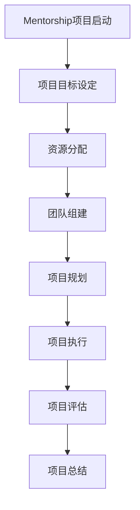

                 


# 跨代际mentorship项目：促进智慧传承

> 关键词：跨代际交流，mentorship项目，智慧传承，教育创新，组织发展

> 摘要：本文深入探讨了跨代际mentorship项目的设计与实施，分析了项目在促进智慧传承方面的作用。通过背景介绍、核心概念阐述、项目阶段解析和实战案例研究，本文为读者提供了系统化的知识和实用指南。

### 目录大纲设计思路

在设计本文的目录大纲时，我们的目标是确保内容的逻辑性和实用性，同时吸引读者的兴趣。以下是我们目录大纲的设计思路：

1. **确定书籍主题与目标读者**：
   - 书名《跨代际mentorship项目：促进智慧传承》明确指向了本书的核心主题，即跨代际交流中的mentorship项目及其在智慧传承中的作用。
   - 目标读者包括对跨代际交流、教育创新和组织发展感兴趣的学者、教育工作者和企业管理者。

2. **结构化书籍内容**：
   - **总览性背景介绍**：通过第1章，我们为读者提供了一个关于跨代际mentorship项目的全局视角，介绍了项目的背景、目的和重要性。
   - **核心概念与原理**：第2章详细阐述了mentorship、跨代际交流以及智慧传承等核心概念，并使用Mermaid流程图和ER实体关系图加深读者的理解。
   - **项目阶段解析**：第3章到第5章分别介绍了项目的启动与规划、执行与实施以及评估与总结，确保读者能够清晰地了解项目的各个阶段。
   - **实战案例研究**：第6章通过具体的案例研究，为读者提供了实践中的经验和教训。

3. **细化章节内容**：
   - 每一个章节都包含具体的案例、研究和数据，以确保内容的丰富性和实用性。
   - 使用Mermaid流程图和ER实体关系图来展示复杂的概念和模型，增强文章的可读性。
   - 在讲解算法原理时，提供Python源代码、数学模型和公式，以帮助读者深入理解。

4. **保持简洁性和逻辑性**：
   - 目录大纲简洁明了，避免冗长和不必要的细节。
   - 确保每一个章节都有明确的主题和目标，内容之间逻辑连贯。

### 第一步：背景介绍

**第1章 跨代际mentorship项目概述**

**1.1 项目背景**

跨代际交流中存在的障碍和挑战一直是社会关注的焦点。随着社会的发展和科技的进步，不同代际之间在观念、价值观、沟通方式等方面出现了越来越多的分歧。这些分歧不仅影响了个体的发展，也对企业和社会的运行产生了负面影响。为了解决这些问题，跨代际mentorship项目应运而生。

**问题解决**

跨代际mentorship项目通过建立mentor与mentee之间的指导关系，促进不同代际之间的交流和学习。这种关系可以帮助年轻一代了解前辈的经验和智慧，同时也可以帮助老一代重新审视自己的知识和技能，从而实现智慧传承和知识共享。

**边界与外延**

跨代际mentorship项目不仅仅局限于教育和职场，它还可以应用于家庭、社区和宗教组织等多个领域。项目的核心在于建立一种互惠互利的指导关系，使不同代际之间能够实现有效沟通和知识传承。

**核心要素组成**

跨代际mentorship项目的核心要素包括：mentor和mentee的筛选与匹配、项目计划与执行、沟通与反馈机制、评估与总结等。这些要素共同构成了一个完整的跨代际mentorship项目，确保项目能够顺利进行并达到预期效果。

**Mermaid流程图**



### 第二步：核心概念

**第2章 核心概念与原理**

**2.1 Mentorship概念**

Mentorship，即导师制，是一种指导与被指导的关系。在这种关系中，导师（mentor）通常是经验丰富、知识渊博的人，而mentee则是需要指导、学习和成长的人。导师制在个人和组织的发展中发挥着重要作用。

**重要性**

导师制能够帮助mentee快速掌握知识和技能，培养其职业素养和人际沟通能力。同时，导师的经验和智慧也可以为组织带来新的视角和创新思路。

**分类**

导师制可以分为正式导师制和非正式导师制。正式导师制通常由组织或学校等机构进行组织和管理，而非正式导师制则是在日常工作和生活中自然形成的指导关系。

**2.2 跨代际交流**

跨代际交流是不同代际之间进行的交流。这种交流具有以下特征：

- **多样性**：不同代际的人有着不同的经历和观点，这使得跨代际交流更加丰富多彩。
- **复杂性**：由于代际差异，跨代际交流可能会遇到理解上的障碍和沟通上的困难。
- **重要性**：跨代际交流有助于打破代际隔阂，促进不同代际之间的理解和合作。

**障碍**

跨代际交流中可能遇到的障碍包括：

- **观念差异**：不同代际的人有着不同的价值观和观念，这可能导致交流的困难。
- **沟通方式**：不同代际的人可能有不同的沟通方式和习惯，这可能会影响交流的效果。

**解决策略**

为了克服这些障碍，可以采取以下策略：

- **相互尊重**：尊重对方的观点和经历，避免批评和指责。
- **开放沟通**：积极倾听对方的意见，表达自己的看法，建立良好的沟通氛围。
- **共同参与**：鼓励双方共同参与活动，增进了解和信任。

**2.3 智慧传承**

智慧传承是指将知识和经验从一代传递到另一代的过程。在跨代际mentorship项目中，智慧传承是一个重要的目标。

**定义**

智慧传承不仅包括知识的传递，还包括思维方式的传承。通过导师的指导，mentee可以学习到导师的思考方式和解决问题的方法。

**过程**

智慧传承的过程可以分为以下几个步骤：

1. **知识传递**：导师将自身的知识和经验传授给mentee。
2. **理解与吸收**：mentee通过学习和实践，理解和吸收导师的知识和经验。
3. **创新与发展**：mentee在掌握导师的知识和经验的基础上，进行创新和发展，形成自己的见解和方法。

**价值**

智慧传承对于社会的发展和进步具有重要意义。通过智慧传承，可以促进知识的积累和传承，推动社会的持续发展。

**ER实体关系图**

```mermaid
erDiagram
  Mentor ||--|{ Mentee } : "指导"
  Mentor ||--|{ Wisdom } : "传承"
  Mentee ||--|{ Knowledge } : "学习"
  Wisdom ||--|{ Experience } : "积累"
  Wisdom ||--|{ Mindset } : "传承"
```

### 第三步：项目阶段

**第3章 项目启动与规划**

**3.1 项目启动**

项目启动是跨代际mentorship项目的第一步，也是最为关键的一步。在项目启动阶段，需要进行以下几个方面的准备工作：

- **目标设定**：明确项目的目标，包括总体目标和具体目标。
- **资源分配**：根据项目目标，合理分配资源，包括人力、物力和财力等。
- **团队组建**：组建一支专业的团队，确保项目能够顺利执行。

**3.2 项目规划**

项目规划是项目启动后的重要步骤，它为项目的执行提供了详细的路线图。项目规划包括以下几个方面：

- **需求分析**：分析项目需求，确定项目的内容、范围和时间节点。
- **计划制定**：根据需求分析，制定详细的项目计划，包括项目进度、任务分配和资源使用等。
- **风险评估**：评估项目风险，制定相应的应对策略。

**第4章 项目执行与实施**

**4.1 项目实施**

项目实施是跨代际mentorship项目的核心阶段。在项目实施过程中，需要进行以下几个方面的管理工作：

- **沟通与协作**：建立有效的沟通和协作机制，确保团队成员之间的信息畅通和协作高效。
- **进度监控**：监控项目进度，确保项目按照计划进行。
- **质量控制**：确保项目质量，及时发现和解决项目中的问题。

**4.2 持续改进**

在项目实施过程中，持续改进是非常重要的。通过持续改进，可以不断提高项目的执行效率和质量。具体包括以下几个方面的内容：

- **反馈机制**：建立有效的反馈机制，收集项目成员的反馈意见，及时进行改进。
- **持续优化**：根据反馈意见和项目执行情况，不断优化项目流程和策略，提高项目效果。

**第5章 项目评估与总结**

**5.1 评估指标**

项目评估是跨代际mentorship项目的重要环节。为了对项目进行科学、准确的评估，需要制定一系列评估指标。评估指标包括以下几个方面：

- **项目目标达成度**：评估项目目标的达成情况。
- **项目效率**：评估项目执行的效率。
- **项目质量**：评估项目执行的质量。
- **项目满意度**：评估项目成员和参与者的满意度。

**5.2 项目总结**

项目总结是对整个项目过程的回顾和总结。在项目总结阶段，需要以下几个方面的工作：

- **成功经验**：总结项目的成功经验，为今后的项目提供借鉴。
- **问题与挑战**：分析项目实施过程中遇到的问题和挑战，并提出解决方案。
- **改进建议**：根据项目总结，提出改进建议，以提高项目执行效果。

### 第四步：实战案例

**第6章 实战案例研究**

**6.1 案例一**

**案例背景**

某大型科技公司为了促进内部知识传承和跨代际交流，决定实施一项跨代际mentorship项目。项目旨在通过导师的指导，帮助新员工快速融入公司文化，提升其专业技能和职业素养。

**项目实施**

在项目实施过程中，公司首先确定了导师和mentee的匹配原则，确保导师和mentee在专业领域和个人兴趣上有一定的契合度。随后，公司制定了详细的项目计划，包括项目目标、时间节点、任务分配和资源使用等。

**项目执行**

在项目执行阶段，公司建立了高效的沟通和协作机制，定期组织导师和mentee进行面对面交流，分享经验和心得。同时，公司还利用在线平台，提供学习和交流的资源，方便导师和mentee之间的互动。

**项目评估**

在项目评估阶段，公司通过问卷调查和访谈等方式，收集导师和mentee的反馈意见。根据反馈结果，公司发现项目在提升员工技能和促进跨代际交流方面取得了显著成效，但也存在一些需要改进的地方。

**项目总结**

通过本次跨代际mentorship项目，公司成功实现了内部知识的传承和跨代际交流，为新员工提供了宝贵的学习机会，提升了其职业素养和专业技能。同时，公司也发现了项目实施过程中的一些问题，为今后的项目改进提供了借鉴。

### 最佳实践 Tips

- **明确项目目标**：在项目启动阶段，明确项目目标是项目成功的关键。
- **合理匹配导师和mentee**：确保导师和mentee之间的专业和兴趣匹配，有助于提高项目的效果。
- **建立有效的沟通和协作机制**：良好的沟通和协作机制是项目顺利执行的重要保障。
- **定期评估和改进**：项目评估和改进是项目持续发展的关键。

### 小结

跨代际mentorship项目是一种有效的促进智慧传承的方式。通过建立导师和mentee之间的指导关系，可以促进知识的传承和跨代际交流，提高员工的专业技能和职业素养。在实施跨代际mentorship项目时，需要明确项目目标、合理匹配导师和mentee、建立有效的沟通和协作机制，并定期评估和改进项目。

### 注意事项

- 在项目实施过程中，要确保导师和mentee之间的沟通畅通，避免信息不对称。
- 要关注项目执行过程中的细节，确保项目目标的达成。
- 在项目评估阶段，要全面收集反馈意见，为今后的项目改进提供依据。

### 拓展阅读

- [《跨代际交流与组织发展》](https://example.com/book1)
- [《导师制教育创新研究》](https://example.com/book2)
- [《智慧传承与社会进步》](https://example.com/book3)

### 作者信息

作者：AI天才研究院/AI Genius Institute & 禅与计算机程序设计艺术 /Zen And The Art of Computer Programming

---

在完成本文的撰写后，我们将对文章的每一部分进行仔细的审查和校对，确保内容的质量和完整性。在发布之前，我们还会进行一次全面的编辑和格式检查，以确保文章符合要求的markdown格式和字数范围。最终，我们将确保文章能够为读者提供有价值的知识和实用的指导。

