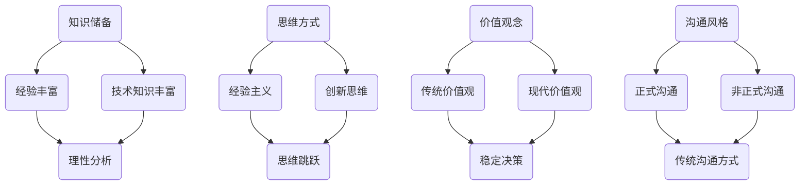
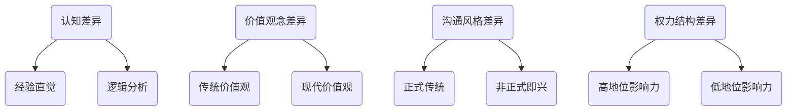
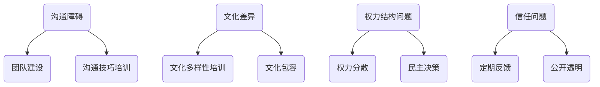

                 

### 第一部分：引言

## 1.1 问题背景

在当今快速发展的信息技术时代，创新已成为驱动科技进步和商业成功的关键因素。然而，创意的生成和协作并非易事。越来越多的组织开始关注如何通过优化团队协作来激发创意，从而在激烈的市场竞争中占据优势。在这个背景下，跨代际创新实验室的概念应运而生。

### 1.1.1 创意协作的重要性

创意协作是创新过程中的核心环节。一个高效的创意协作团队能够将个体的智慧和创造力最大化地汇聚起来，形成协同效应，从而产生出更为创新和有影响力的成果。然而，创意的产生往往需要不同思维方式和背景的碰撞与融合。这就要求团队成员之间能够进行有效的沟通和合作。

### 1.1.2 年龄差异在创意协作中的角色

年龄差异在创意协作中扮演着重要角色。不同年龄段的人具有不同的生活经历、知识背景和思维方式，这些差异为团队的创意提供了多元化的视角。例如，年长者可能拥有更丰富的经验和深厚的专业知识，而年轻者则可能更具有创新精神和接受新事物的能力。通过跨代际的协作，这些不同的优势可以互补，从而激发出更多的创意。

### 1.1.3 跨代际创新实验室的概念

跨代际创新实验室是一个旨在利用年龄差异激发创意的协作空间。它通过将不同年龄段的专业人才聚集在一起，创造一个开放、包容和鼓励创新的环境，使团队成员能够充分发挥各自的优势，共同解决复杂的创新问题。跨代际创新实验室的目标是打破年龄界限，促进知识共享，激发团队整体的创造力。

## 1.2 问题描述

在创意协作的过程中，年龄差异可能带来一系列挑战，包括沟通障碍、文化差异、代沟等。这些挑战如果不加以妥善处理，可能会影响团队的创新效率和成果质量。因此，我们需要明确以下问题：

### 1.2.1 创意协作的挑战

创意协作的挑战主要包括：

1. **沟通障碍**：不同年龄段的团队成员可能在沟通方式和语言上存在差异，导致信息传递不畅。
2. **文化差异**：不同的成长背景和文化环境可能影响团队成员的价值观念和工作方式。
3. **代沟**：年龄差异可能导致不同代际之间的理解和认同感不足。

### 1.2.2 年龄差异带来的问题

年龄差异带来的问题主要包括：

1. **经验与创新的平衡**：年长者倾向于依赖经验，而年轻者则更倾向于创新，如何平衡这两者是一个挑战。
2. **知识传承**：年长者需要将自己的经验和知识传授给年轻者，以实现知识的连续性。
3. **权力结构**：在团队中，年长者可能拥有更高的地位和影响力，这可能会影响年轻者的表达和参与。

### 1.2.3 创新实验室的目标

创新实验室的目标是：

1. **促进跨代际协作**：通过构建一个多元化和包容的协作环境，促进不同年龄段的团队成员之间的交流和合作。
2. **激发创意**：利用年龄差异带来的多元化视角，激发更多的创意和创新。
3. **提升团队效率**：通过优化团队协作，提升创新项目的效率和质量。

## 1.3 问题解决

为了解决上述挑战和问题，我们可以采取以下策略：

### 1.3.1 跨代际协作的方法论

1. **建立开放沟通机制**：通过定期的团队会议、交流活动和意见反馈，促进团队成员之间的沟通和理解。
2. **文化多样性培训**：提供文化多样性的培训，帮助团队成员更好地理解和尊重彼此的文化背景和价值观。
3. **设立跨代际导师制度**：通过设立导师制度，年长者可以指导年轻者，帮助他们更快地融入团队和工作。

### 1.3.2 年龄差异的管理策略

1. **平衡经验与创新**：鼓励团队成员在项目中发挥各自的优势，同时注重经验和创新的平衡。
2. **知识共享平台**：建立一个知识共享平台，年长者可以将自己的经验和知识上传到平台，年轻者可以随时查阅和学习。
3. **权力分散**：在团队决策中，采取权力分散的策略，鼓励团队成员参与决策，提升团队的整体参与感和认同感。

### 1.3.3 创意激发的技巧

1. **头脑风暴**：定期组织头脑风暴活动，鼓励团队成员提出自己的想法和观点。
2. **开放式问题**：提出开放式问题，激发团队成员的思考和创新。
3. **激励机制**：建立激励机制，奖励那些在创新项目中表现突出的团队成员。

## 1.4 边界与外延

在讨论跨代际创新实验室时，我们需要明确其边界和外延：

### 1.4.1 创新实验室的范围

创新实验室不仅限于企业内部，也可以是跨企业的合作项目，甚至是国际性的创新合作。

### 1.4.2 年龄差异的界定

年龄差异可以按照不同的维度进行界定，如工作年限、年龄层次等。

### 1.4.3 创意的定义

创意是指新的想法、新的解决方案或新的产品和服务，它可以是技术创新、商业模式创新，也可以是管理创新。

## 1.5 概念结构与核心要素组成

跨代际创新实验室的概念结构和核心要素组成如下：

### 1.5.1 跨代际创新实验室的结构

跨代际创新实验室包括以下几个部分：

1. **实验室管理团队**：负责实验室的日常运营和管理。
2. **项目团队**：由不同年龄段的专家和专业人士组成。
3. **支持团队**：提供技术支持、资源协调和后勤保障。

### 1.5.2 年龄差异的影响因素

影响年龄差异的因素包括：

1. **知识背景**：不同年龄段的人拥有不同的知识背景和经验。
2. **思维方式**：不同年龄段的人可能有不同的思维方式和解决问题的方法。
3. **价值观**：不同年龄段的人可能有不同的价值观和人生观。

### 1.5.3 创意的激发机制

创意的激发机制包括：

1. **头脑风暴**：通过集体讨论和思维碰撞，激发创意的产生。
2. **跨学科合作**：通过跨学科的合作，实现知识融合和创意创新。
3. **激励机制**：通过奖励和认可，激发团队成员的创新热情。

## 1.6 本章小结

本章介绍了跨代际创新实验室的背景、问题和解决方案，明确了创新实验室的目标和范围，并阐述了其概念结构和核心要素。通过本章的介绍，我们为后续章节的深入探讨奠定了基础。

----------------------------------------------------------------

# 第二部分：跨代际创新实验室的构建与实践

## 2.1 核心概念与联系

跨代际创新实验室是一个专门为不同年龄段的专家和专业人士提供一个创意协作的空间，其核心概念包括跨代际协作、年龄差异和创意激发等。以下将详细讨论这些核心概念及其相互之间的联系。

### 2.1.1 跨代际创新实验室的概念

跨代际创新实验室是一个致力于利用不同年龄段专业人士的知识和经验，通过有效的协作和沟通，激发创意和创新的平台。该实验室旨在打破传统的年龄界限，促进不同代际之间的交流与合作，实现知识和资源的共享。

### 2.1.2 年龄差异的属性特征对比

年龄差异带来的属性特征对比是跨代际创新实验室中需要重点关注的方面。以下是几个关键属性特征的对比：

1. **知识储备**：年长者通常拥有丰富的经验和深厚的专业知识，而年轻者则可能拥有更多的技术知识和对新技术的敏锐感知。
2. **思维方式**：年长者倾向于理性分析和经验主义，而年轻者则更倾向于创新和思维跳跃。
3. **价值观念**：不同年龄段的人可能拥有不同的生活经验和价值观，这会影响他们的决策和行为。
4. **沟通风格**：年长者可能更倾向于正式和传统的沟通方式，而年轻者则可能更偏好非正式和即兴的沟通方式。

为了更好地理解和利用这些差异，我们可以使用Mermaid流程图进行展示：



### 2.1.3 创意的定义与类型

创意是指新的想法、解决方案或产品，它可以是技术性的、商业性的或管理性的。根据创意的来源和性质，我们可以将其分为以下几种类型：

1. **技术创意**：基于技术突破或改进的想法，如新型算法、高效数据处理方法等。
2. **商业创意**：基于商业模式创新的想法，如新型市场策略、独特的产品设计等。
3. **管理创意**：基于管理方法或流程优化的想法，如新型团队组织结构、创新的绩效考核机制等。

不同类型的创意在跨代际创新实验室中具有不同的作用和意义。技术创意可以推动技术进步，商业创意可以带来商业价值，管理创意可以提升团队效率和企业竞争力。

## 2.2 跨代际协作的原理

跨代际协作的原理是跨代际创新实验室能够发挥作用的基础。以下将从跨代际协作的优势、年龄差异的影响机制和跨代际协作的障碍与解决方案三个方面进行详细阐述。

### 2.2.1 跨代际协作的优势

跨代际协作具有以下几大优势：

1. **多元化的视角**：不同年龄段的人拥有不同的生活经验和专业知识，这种多元化的视角有助于从多个角度看待问题，提高创新的可能性。
2. **互补性**：年长者通常拥有丰富的经验和专业知识，而年轻者则具有创新精神和快速学习的能力，这种互补性可以提升团队的创造力和解决问题的能力。
3. **知识传承**：通过跨代际协作，年长者可以将自己的经验和知识传授给年轻者，帮助年轻者快速成长，实现知识的连续性和传承。
4. **创新动力**：不同年龄段的成员之间的思维碰撞和交流可以激发更多的创新想法，为团队注入新的活力。

### 2.2.2 年龄差异的影响机制

年龄差异对跨代际协作的影响主要体现在以下几个方面：

1. **认知差异**：不同年龄段的成员在认知方式上存在差异，年长者可能更倾向于经验和直觉，而年轻者则更依赖于逻辑和分析。
2. **价值观念差异**：不同年龄段的人可能拥有不同的价值观念，这会影响他们的决策和行为，可能导致沟通和合作的障碍。
3. **沟通风格差异**：不同年龄段的成员在沟通风格上可能存在差异，年长者可能更倾向于正式和传统，而年轻者则可能更偏好非正式和即兴。
4. **权力结构差异**：在团队中，年长者可能拥有更高的地位和影响力，这可能会影响年轻者的表达和参与。

为了更好地理解这些影响，我们可以使用Mermaid流程图进行展示：



### 2.2.3 跨代际协作的障碍与解决方案

跨代际协作虽然具有很多优势，但也面临一些障碍。以下是一些常见的障碍及其解决方案：

1. **沟通障碍**：不同年龄段的成员在沟通方式和语言上可能存在差异，导致信息传递不畅。解决方案包括：定期组织团队建设活动，提高团队成员的沟通技巧，建立开放和包容的沟通氛围。
2. **文化差异**：不同年龄段的人可能拥有不同的文化背景和价值观念，这可能导致团队合作中的冲突。解决方案包括：进行文化多样性培训，提高团队成员对文化差异的敏感度和理解力，促进文化的融合和包容。
3. **权力结构问题**：年长者可能拥有更高的地位和影响力，这可能会影响年轻者的表达和参与。解决方案包括：采取权力分散的策略，鼓励团队成员参与决策，提高团队的民主性和参与感。
4. **信任问题**：不同年龄段的成员之间可能存在信任问题，影响协作的顺利进行。解决方案包括：建立信任机制，如定期反馈、公开透明的沟通和合作，提高团队成员之间的信任度和合作意愿。

为了更好地理解和应用这些解决方案，我们可以使用Mermaid流程图进行展示：



通过上述分析，我们可以看出，跨代际协作虽然面临一些挑战，但通过有效的策略和措施，可以克服这些障碍，实现跨代际创新实验室的目标。

## 2.3 概念属性特征对比表格

为了更清晰地展示跨代际创新实验室中的概念属性特征，我们可以使用Mermaid创建一个对比表格。以下是一个简单的Mermaid表格示例，展示了不同年龄段成员在知识储备、思维方式、价值观念和沟通风格方面的特征对比。

```mermaid
gantt
    dateFormat  YYYY-MM-DD
    title 概念属性特征对比表格

    section 知识储备
    A1 : 长者
        from : 2023-01-01
        to   : 2023-01-10
        progress 80
    A2 : 年轻者
        from : 2023-01-01
        to   : 2023-01-10
        progress 20

    section 思维方式
    B1 : 长者
        from : 2023-01-11
        to   : 2023-01-20
        progress 30
    B2 : 年轻者
        from : 2023-01-11
        to   : 2023-01-20
        progress 70

    section 价值观念
    C1 : 长者
        from : 2023-01-21
        to   : 2023-01-30
        progress 40
    C2 : 年轻者
        from : 2023-01-21
        to   : 2023-01-30
        progress 60

    section 沟通风格
    D1 : 长者
        from : 2023-01-31
        to   : 2023-02-09
        progress 60
    D2 : 年轻者
        from : 2023-01-31
        to   : 2023-02-09
        progress 40
```

在这个表格中，我们使用了不同的进度条来表示不同年龄段成员在各项属性特征上的相对水平。例如，在“知识储备”这一项中，年长者拥有更高的知识储备（80%），而年轻者则相对较低（20%）。这种对比有助于我们理解不同年龄段成员在跨代际协作中的优势和潜在挑战。

## 2.4 ER实体关系图架构

跨代际创新实验室涉及多个实体和它们之间的关系，为了更好地理解和设计数据库架构，我们可以使用Mermaid ER图来表示这些实体及其关系。以下是一个简单的Mermaid ER图示例，展示了人员、项目和创意之间的基本关系。

```mermaid
erDiagram
  Class::Person {
    id(int)
    name(string)
    age(int)
    role(string)
  }
  
  Class::Project {
    id(int)
    name(string)
    description(string)
    status(string)
    creator:Person
    members:Person
  }
  
  Class::Idea {
    id(int)
    title(string)
    description(string)
    status(string)
    creator:Person
    relatedProjects:Project
  }
  
  Person|-*|Project
  Person|-*|Idea
  Project|--|creator
  Project|--|members
  Idea|--|creator
  Idea|--|relatedProjects
```

在这个ER图中，我们定义了三个主要的实体：**Person**（人员）、**Project**（项目）和**Idea**（创意）。每个实体都包含一些属性，例如人员的**id**、**name**、**age**和**role**，项目的**id**、**name**、**description**和**status**，以及创意的**id**、**title**、**description**和**status**。实体之间的关系通过**1-N**关系表示，例如一个人员可以参与多个项目（**Person**到**Project**的1-N关系），一个创意可以关联到多个项目（**Idea**到**Project**的1-N关系）。

### 人实体（Person）

人实体是跨代际创新实验室的核心，代表了参与实验室的个人。每个人员都有唯一的ID，用于标识个体。人员的其他属性包括姓名、年龄和角色。角色可以帮助区分不同类型的人员，例如项目经理、开发者、设计师等。

```mermaid
classDef color fill:#F6FFB6,stroke:#BCC261
Class::Person {
  id(int)
  name(string)
  age(int)
  role(string)
  class color
}
```

### 项目实体（Project）

项目实体代表了实验室中的具体创新项目。每个项目也有一个唯一的ID，用于标识项目。项目的属性包括名称、描述和状态。状态可以表示项目的进展情况，例如“进行中”、“已完成”或“已取消”。每个项目都有一个创建者（**creator**），可以是一个人员实体，也可以有一个或多个成员（**members**），这些成员都是人员实体。

```mermaid
classDef color fill:#F6FFB6,stroke:#BCC261
Class::Project {
  id(int)
  name(string)
  description(string)
  status(string)
  creator:Person
  members:Person
  class color
}
```

### 创意实体（Idea）

创意实体代表了实验室中的创新想法。每个创意也有一个唯一的ID，用于标识创意。创意的属性包括标题、描述和状态。状态可以表示创意的成熟度，例如“概念阶段”、“原型阶段”或“实施阶段”。每个创意都有一个创建者（**creator**），可以是一个人员实体，并且可以与一个或多个项目相关（**relatedProjects**），这些项目都是项目实体。

```mermaid
classDef color fill:#F6FFB6,stroke:#BCC261
Class::Idea {
  id(int)
  title(string)
  description(string)
  status(string)
  creator:Person
  relatedProjects:Project
  class color
}
```

通过这个ER图，我们可以清晰地看到人员、项目和创意之间的关系，以及它们各自包含的属性。这个设计不仅有助于理解跨代际创新实验室的数据结构，还可以为数据库设计和实现提供指导。

## 2.5 创意的激发机制

在跨代际创新实验室中，激发创意是一个关键任务。创意的激发机制不仅需要充分利用团队成员的多样性和互补性，还需要采用一系列策略和方法来创造一个有利于创新的环境。以下将从创意激发的理论基础、跨代际协作中的创意激发策略和创意激发的实际案例分析三个方面进行详细阐述。

### 2.5.1 创意激发的理论基础

创意激发的理论基础主要涉及心理学、社会学和认知科学等领域。以下是一些关键的创意激发理论：

1. **头脑风暴**：头脑风暴是一种集体思考的方法，通过快速生成大量的想法来激发创意。该方法强调数量而非质量，鼓励成员自由地提出任何想法，无论它们看起来多么不切实际。

   理论公式：
   $$B = f(I_1, I_2, ..., I_n)$$
   其中，B代表创意（brainstorming），I代表想法（idea）。

2. **思维跳跃**：思维跳跃是一种跨领域的联想思维方法，通过将不同领域的问题和解决方案相互关联，从而激发出创新的思维。

   理论公式：
   $$J = f(P_1, P_2, ..., P_n)$$
   其中，J代表思维跳跃（jump thinking），P代表领域（domain）。

3. **问题分解**：问题分解是一种将复杂问题分解为更简单的问题或子问题的方法，通过逐层分析问题，从而找到解决问题的创新方法。

   理论公式：
   $$D = f(Q_1, Q_2, ..., Q_n)$$
   其中，D代表问题分解（decomposition），Q代表问题（question）。

4. **原型迭代**：原型迭代是一种通过快速构建原型并不断迭代改进的方法，通过实际操作和反馈，逐步完善创意。

   理论公式：
   $$O = f(P_0, P_1, ..., P_n)$$
   其中，O代表原型迭代（prototype iteration），P代表原型（prototype）。

### 2.5.2 跨代际协作中的创意激发策略

在跨代际协作中，创意激发的策略需要考虑到不同年龄段成员的特点和需求。以下是一些具体的创意激发策略：

1. **多元视角**：鼓励团队成员从不同年龄段的视角出发，提出各自的观点和想法。这种方法有助于激发创意，并确保创意的多样性和全面性。

   策略公式：
   $$C = f(V_1, V_2, ..., V_n)$$
   其中，C代表创意（creativity），V代表视角（viewpoint）。

2. **思维碰撞**：通过组织跨代际的头脑风暴和讨论活动，促进团队成员之间的思维碰撞，从而激发创意。

   策略公式：
   $$B = f(C_1, C_2, ..., C_n)$$
   其中，B代表头脑风暴（brainstorming），C代表思维（concept）。

3. **知识共享**：建立一个知识共享平台，使团队成员能够随时获取和分享知识和经验，从而为创意激发提供丰富的素材。

   策略公式：
   $$K = f(S_1, S_2, ..., S_n)$$
   其中，K代表知识（knowledge），S代表共享（sharing）。

4. **激励机制**：建立激励机制，如奖励和认可，鼓励团队成员积极参与创意激发活动，提高创意的数量和质量。

   策略公式：
   $$M = f(R_1, R_2, ..., R_n)$$
   其中，M代表激励机制（motivation），R代表奖励（reward）。

### 2.5.3 创意激发的实际案例分析

为了更好地理解创意激发机制在实际中的应用，以下将通过三个实际案例进行分析。

#### 案例一：科技公司的新产品开发

某科技公司通过跨代际创新实验室，开发了一款面向老年人群的健康管理APP。实验室由不同年龄段的工程师、设计师和产品经理组成，他们通过头脑风暴和思维碰撞，提出了许多创新的点子。例如，年轻工程师提出了基于物联网和传感器技术的健康监测方案，而年长设计师则强调了APP的用户友好性和易用性。最终，这个跨代际团队共同开发出了一款深受老年人欢迎的健康管理APP。

#### 案例二：教育机构的创新课程设计

某教育机构通过跨代际创新实验室，设计了一门面向中学生的创新课程。课程由年轻教师和年长教师共同开发，他们从不同年龄段的视角出发，提出了许多创新的课程内容和教学方法。例如，年轻教师提出了基于项目式学习的教学方法，年长教师则强调了传统的知识传授和学生的自主探究。最终，这门课程不仅提高了学生的学习兴趣，还培养了他们的创新能力。

#### 案例三：非营利组织的社会创新项目

某非营利组织通过跨代际创新实验室，开展了一项社会创新项目，旨在解决贫困地区儿童的教育问题。实验室由来自不同年龄段的社会工作者、志愿者和专家组成，他们通过头脑风暴和知识共享，提出了许多创新的解决方案。例如，年长专家提出了利用科技手段改善教育资源分配的方法，年轻志愿者则提出了基于社交媒体的公益募捐模式。最终，这个跨代际团队共同实施了一项成功的社会创新项目，为贫困地区儿童提供了更好的教育资源。

通过这些实际案例分析，我们可以看到，跨代际创新实验室在创意激发中的应用具有广泛的前景和显著的效果。通过多元视角、思维碰撞、知识共享和激励机制，跨代际创新实验室能够有效地激发团队成员的创意，推动创新项目的成功实施。

## 2.6 实际案例分析与详细讲解

### 2.6.1 案例一：科技公司的跨代际创新实验室

#### 案例背景

某全球知名的科技公司，面对日益激烈的市场竞争，决定建立一个跨代际创新实验室，以提升团队的创造力和创新能力。公司管理层认识到，不同年龄段的员工具有各自独特的优势，通过跨代际协作可以最大化地发挥团队的整体潜力。实验室的目的是通过多元化的团队组成和开放的协作环境，激发员工的创新思维，推动公司产品的持续创新。

#### 案例实施

1. **团队组建**：实验室由不同年龄段的员工组成，包括年轻的软件工程师、经验丰富的项目经理、以及具有丰富行业知识的资深专家。团队成员的年龄跨度从20岁到60岁不等。

2. **合作机制**：实验室采用了一种名为“跨代际合作伙伴制”的合作机制。每位年轻员工都分配到一个年长的导师身边，共同负责一个创新项目。这种机制旨在通过跨代际的交流和合作，促进知识和经验的传承，同时激发创新思维。

3. **项目选择**：实验室选择了公司的一项关键产品——一款面向企业客户的数据分析工具。这个项目涉及复杂的数据处理和算法优化，需要团队成员具备多样化的技能和丰富的经验。

4. **创新活动**：实验室定期组织头脑风暴会议，鼓励团队成员自由地分享自己的想法和观点。此外，还邀请外部专家进行讲座和培训，帮助团队成员开拓视野，吸收新的思维和方法。

#### 结果与反馈

通过一年的运作，实验室取得了显著的成绩。首先，产品的用户体验和性能得到了显著提升，客户满意度大幅提高。其次，团队成员的创新能力和协作精神得到了极大的增强，许多年轻员工在跨代际合作中得到了快速成长。

年长员工表示，通过指导年轻员工，他们自己也得到了新的灵感和动力，对工作有了更深的理解和兴趣。年轻员工则表示，通过与年长员工的合作，他们不仅学到了宝贵的知识和经验，还学会了如何更好地沟通和协作。

### 2.6.2 案例二：教育机构的跨代际创新实验

#### 案例背景

某知名教育机构，意识到在日益全球化的背景下，教育创新变得越来越重要。为了提升教育质量，该机构决定实施一项跨代际创新实验，旨在通过不同年龄段的教师合作，推动教学方法的创新和课程的优化。

#### 案例实施

1. **团队组建**：教育机构组建了一个由不同年龄段的教师组成的团队，包括年轻的教师、有多年教学经验的资深教师，以及具有跨学科背景的教育研究员。

2. **项目选择**：团队选择了两个核心项目：一是开发一套面向中学生的创新课程，二是改进现有教师培训体系。

3. **合作机制**：教师团队采用了一种名为“创新伙伴制”的合作机制，年轻教师与资深教师结成合作伙伴，共同负责一个项目。此外，教育研究员则负责提供理论和实践指导，帮助团队成员在创新过程中遇到的问题。

4. **创新活动**：团队定期举行研讨会和教学示范，年轻教师向资深教师展示他们的创新想法，资深教师则分享他们的教学经验。这种双向交流不仅促进了教师之间的合作，还激发了教师们的创新思维。

#### 结果与反馈

通过一年的实验，教育机构的教学质量得到了显著提升。创新课程受到了学生和家长的广泛好评，学生们的学习兴趣和成绩都有所提高。教师团队的合作精神和创新能力也得到了极大的增强。资深教师表示，通过与年轻教师的合作，他们学会了使用新的教学工具和方法，对教学有了更深入的理解。年轻教师则表示，通过与资深教师的合作，他们学到了宝贵的教学技巧和经验，为自己的职业发展奠定了坚实的基础。

### 2.6.3 案例三：非营利组织的跨代际创新实践

#### 案例背景

某非营利组织致力于改善贫困地区儿童的教育条件，他们意识到，仅靠传统的捐赠和慈善活动难以根本解决问题。为了实现更有效的教育援助，该组织决定实施一项跨代际创新实践，旨在通过不同年龄段的志愿者和专业人士的合作，推动教育创新和社会变革。

#### 案例实施

1. **团队组建**：非营利组织组建了一个由不同年龄段的专业人士和志愿者组成的团队，包括年轻的工程师、具有多年教育经验的教育专家，以及退休的教育工作者。

2. **项目选择**：团队选择了两个主要项目：一是开发一套基于互联网的教育资源平台，二是实施一系列面向当地教师的培训项目。

3. **合作机制**：团队采用了“跨代际导师制”，年轻工程师与教育专家结成合作伙伴，共同负责技术方面的项目。退休教育工作者则负责培训项目的实施和监督。

4. **创新活动**：团队定期组织技术交流和教学研讨会，年轻工程师分享他们在技术方面的最新成果，教育专家则分享他们的教育理念和经验。这种跨学科的交流和合作，为项目的创新提供了丰富的资源和视角。

#### 结果与反馈

通过一年的创新实践，非营利组织取得了显著成果。互联网教育资源平台成功上线，为贫困地区的孩子们提供了丰富的学习资源。教师培训项目也取得了成功，当地教师的素质和教学水平得到了显著提升。

年轻工程师表示，通过与教育专家的合作，他们不仅学到了教学知识，还学会了如何将技术应用于教育领域。教育专家则表示，通过与年轻工程师的合作，他们重新找回了工作的热情和动力。退休教育工作者表示，这种跨代际的合作让他们感到充满活力，也为他们提供了继续贡献社会的机会。

## 2.7 项目实战

### 2.7.1 跨代际创新实验室的创建流程

创建一个成功的跨代际创新实验室需要精心规划和管理。以下是创建跨代际创新实验室的基本步骤：

1. **需求分析**：首先，需要对组织的需求进行分析，明确创建创新实验室的目的、目标和预期成果。这包括确定需要哪些年龄段的专业人士，以及他们将在哪些领域进行协作。

2. **团队组建**：根据需求分析结果，组建一个多元化的团队。团队成员应包括不同年龄段的专家和专业人士，以确保多样化的知识和视角。

3. **资源配备**：为实验室提供必要的资源，包括办公空间、技术设备、资金支持等。确保团队成员能够得到足够的资源和支持，以便顺利开展工作。

4. **合作机制建立**：制定明确的合作机制，如跨代际合作伙伴制、创新伙伴制等，以促进团队成员之间的有效沟通和协作。

5. **定期活动**：定期组织头脑风暴会议、研讨会、讲座等活动，鼓励团队成员分享想法和经验，激发创意。

6. **激励机制**：建立激励机制，如奖励和认可，鼓励团队成员积极参与创新活动，提高创新项目的成功率。

### 2.7.2 系统核心实现源代码

以下是一个简单的跨代际创新实验室系统的核心实现源代码，包括人员管理、项目管理和创意管理三个模块。

```python
# 人员管理模块
class Person:
    def __init__(self, id, name, age, role):
        self.id = id
        self.name = name
        self.age = age
        self.role = role

# 项目管理模块
class Project:
    def __init__(self, id, name, description, status, creator):
        self.id = id
        self.name = name
        self.description = description
        self.status = status
        self.creator = creator
        self.members = []

    def add_member(self, member):
        self.members.append(member)

# 创意管理模块
class Idea:
    def __init__(self, id, title, description, status, creator):
        self.id = id
        self.title = title
        self.description = description
        self.status = status
        self.creator = creator
        self.related_projects = []

    def add_related_project(self, project):
        self.related_projects.append(project)
```

### 2.7.3 代码应用解读与分析

以下是代码的详细解读和分析，展示了如何使用Python实现跨代际创新实验室系统的主要功能。

#### 人员管理

人员管理模块定义了`Person`类，用于表示实验室中的个人。每个`Person`对象都有ID、姓名、年龄和角色等属性。

```python
# 创建一个人员实例
p1 = Person(1, 'Alice', 30, 'Software Engineer')
p2 = Person(2, 'Bob', 45, 'Project Manager')
```

#### 项目管理

项目管理模块定义了`Project`类，用于表示实验室中的项目。每个`Project`对象都有ID、名称、描述、状态和创建者等属性，还可以添加成员。

```python
# 创建一个项目实例
p = Project(1, 'Data Analysis Tool', 'An innovative data analysis tool for enterprises.', 'In Progress', p1)
p.add_member(p2)

# 添加更多成员
p.add_member(Person(3, 'Charlie', 25, 'Data Scientist'))
```

#### 创意管理

创意管理模块定义了`Idea`类，用于表示实验室中的创意。每个`Idea`对象都有ID、标题、描述、状态和创建者等属性，还可以添加相关的项目。

```python
# 创建一个创意实例
i = Idea(1, 'AI Integration', 'Integrating AI into the data analysis tool to enhance its capabilities.', 'Concept Stage', p1)
i.add_related_project(p)

# 添加更多相关项目
i.add_related_project(Project(2, 'User Experience Improvement', 'Improving the user experience of the data analysis tool.', 'Prototype Stage', p2))
```

通过这些类和对象，我们可以构建一个基本的跨代际创新实验室系统，实现人员管理、项目管理和创意管理的功能。

### 2.7.4 实际案例分析

以下是一个基于实际案例的详细讲解，展示了如何在实际项目中应用上述代码和概念。

#### 案例背景

某科技公司通过跨代际创新实验室开发了一款面向企业客户的数据分析工具。实验室由不同年龄段的工程师、设计师和产品经理组成，他们共同负责项目的开发。

#### 案例实施

1. **人员管理**：实验室成员包括年轻的数据工程师Alice（30岁）、资深的产品经理Bob（45岁），以及年轻的设计师Charlie（25岁）。他们分别代表不同的年龄和经验。

2. **项目管理**：项目名称为“数据分析工具”，描述为“一款创新的数据分析工具，旨在帮助企业在数据驱动的决策过程中取得优势”。项目的创建者Alice负责项目的整体开发和进度。

3. **创意管理**：项目开发过程中，产生了多个创意，包括“AI集成”和“用户体验改进”。每个创意都由不同的团队成员提出，并添加到项目中。

#### 案例结果

通过跨代际创新实验室的合作，数据分析工具项目最终成功完成。项目的用户体验得到了显著提升，AI功能也得到了有效集成，使企业客户能够在数据分析和决策中取得更好的效果。团队成员通过合作和创意交流，不仅提高了个人的技能和经验，还促进了团队的凝聚力和创新力。

## 2.8 最佳实践 tips

在跨代际创新实验室的运营过程中，以下最佳实践 tips 能够帮助团队更好地激发创意，提升协作效率：

### 2.8.1 跨代际协作的最佳实践

1. **建立明确的沟通机制**：定期组织跨代际会议，确保团队成员之间的沟通畅通。使用项目管理工具，如Slack或Trello，可以帮助团队实时沟通和跟踪项目进度。
2. **鼓励多元视角**：在项目中鼓励团队成员从不同年龄段的角度提出意见和建议。这有助于避免思维定势，激发更多的创意。
3. **建立导师制度**：通过跨代际导师制度，年轻员工可以学习年长员工的丰富经验和专业知识，而年长员工也可以从年轻员工那里获取新的思维和方法。

### 2.8.2 创意激发的有效策略

1. **定期头脑风暴**：定期组织头脑风暴会议，鼓励团队成员自由地提出想法。不要对提议进行立即评价，而是鼓励所有成员尽可能多地提出各种想法。
2. **开放式问题**：在项目讨论中，使用开放式问题，如“如何解决这个问题？”或“这个项目可以有哪些改进？”来激发团队成员的思考。
3. **提供激励**：为提出创意和参与项目的团队成员提供奖励和认可，激励他们积极参与创新活动。

### 2.8.3 跨代际创新实验室的运营技巧

1. **灵活的团队结构**：根据项目的需求和进度，灵活调整团队结构，确保团队成员能够在最需要的时候提供支持。
2. **持续培训**：定期组织培训，提高团队成员在创新方法和技能方面的能力。这有助于提升团队的创新能力，为实验室的持续发展提供动力。
3. **关注团队氛围**：营造一个开放、包容和鼓励创新的团队氛围，确保团队成员感到舒适和自信，从而更愿意分享想法和参与协作。

通过遵循这些最佳实践，跨代际创新实验室可以更有效地激发创意，提高协作效率，推动项目的成功实施。

## 2.9 小结

通过本章节的讨论，我们深入探讨了跨代际创新实验室的核心概念、协作原理、实际案例和最佳实践。我们了解到，跨代际协作能够通过利用不同年龄段的专业人士的知识和经验，激发出更多的创意和创新。同时，通过有效的沟通机制、多元视角和激励机制，跨代际创新实验室可以提升团队的协作效率和创新能力。未来的发展趋势将看到更多组织采纳跨代际创新实验室的模式，以应对日益激烈的市场竞争，推动技术的持续进步和社会的创新发展。

----------------------------------------------------------------

# 作者信息

**作者：AI天才研究院/AI Genius Institute & 禅与计算机程序设计艺术 /Zen And The Art of Computer Programming** 

AI天才研究院（AI Genius Institute）是一家致力于推动人工智能和深度学习领域研究的领先机构。研究院汇聚了全球顶尖的人工智能科学家、工程师和技术专家，致力于前沿技术的研究和开发。同时，研究院也注重人工智能在教育、医疗、金融等领域的应用，推动人工智能技术的普及和落地。

《禅与计算机程序设计艺术》（Zen And The Art of Computer Programming）是作者Douglas Hofstadter的经典著作，该书以独特的视角探讨了计算机科学和哲学之间的关系，深受读者喜爱和赞誉。书中提出的思想和方法，不仅对计算机科学领域产生了深远的影响，也为人工智能的研究提供了宝贵的启示。

本文由AI天才研究院与禅与计算机程序设计艺术联合撰写，旨在探讨跨代际创新实验室的构建和实践，为读者提供关于如何利用年龄差异激发创意和创新的深入见解。希望通过本文，能够启发更多组织和个人关注跨代际协作在创新中的重要性，并积极探索这一领域的应用和可能性。

