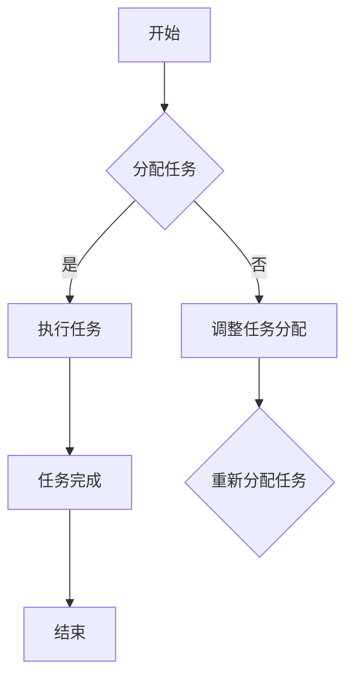
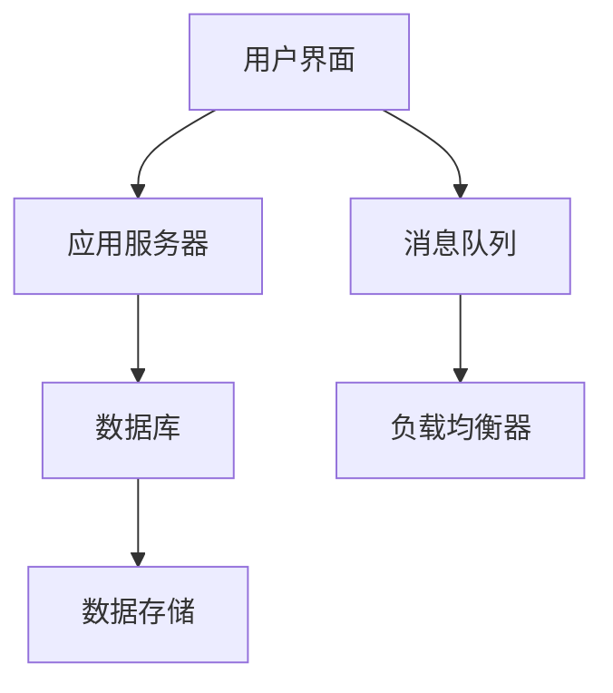
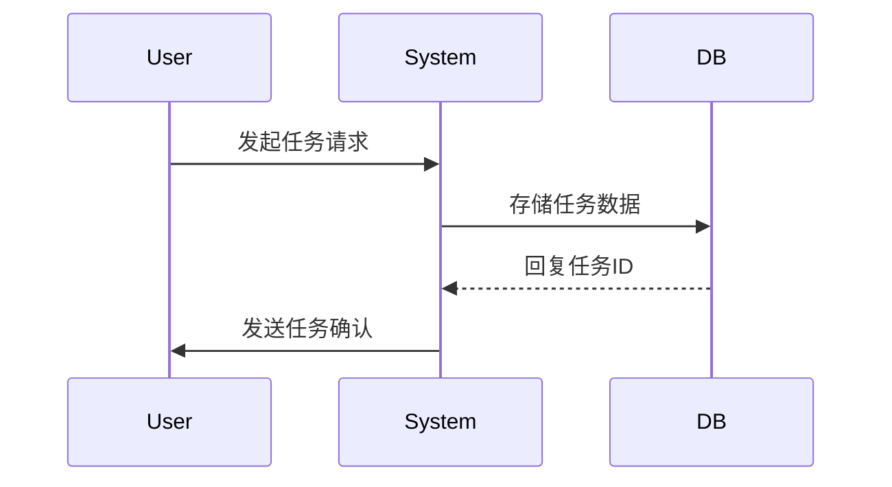

                 

# 跨代际合作：年龄差异创造的意义火花

## 关键词
- 跨代际合作
- 年龄差异
- 认知多样性
- 社交交换理论
- 社会认同理论
- 社会学习理论
- 沟通策略
- 协作模型

## 摘要
本文探讨了跨代际合作的重要性以及如何在不同的年龄群体之间建立有效的合作机制。首先，我们介绍了跨代际合作的概念及其在现代社会中的重要性。接着，我们分析了不同年龄群体的认知特点和交流方式，并引用了相关理论如社交交换理论、社会认同理论和社会学习理论来解释这些差异。文章还详细介绍了实际操作中的沟通策略和协作模型，并结合案例进行了分析。最后，我们总结了跨代际合作的最佳实践，并提出了未来研究方向。

## 1. 背景与介绍

### 1.1 问题的定义

跨代际合作，顾名思义，是不同年龄群体之间为了共同目标而进行的合作。随着全球人口老龄化和年轻一代对技术的新兴需求，跨代际合作的重要性日益凸显。年龄差异不仅仅是生理上的差异，更重要的是认知差异、价值观差异和交流方式的差异。这些差异导致在不同年龄群体之间沟通和协作的障碍，影响了团队合作的效果和效率。

### 1.2 关键概念和术语

- **跨代际合作**：不同年龄群体之间的合作，包括不同年龄段的员工、同事、合作伙伴等。
- **认知多样性**：不同年龄群体在认知方式、思维模式和知识结构上的差异。
- **社交交换理论**：解释个体在社交互动中的行为和动机，强调互惠性和社会报酬。
- **社会认同理论**：探讨个体如何通过社会群体来定义自我，并影响其行为和决策。
- **社会学习理论**：强调通过观察和模仿他人的行为来学习，并适应社会环境。

### 1.3 研究目标和目标

本文旨在：
1. 分析跨代际合作的现状和挑战。
2. 探讨不同年龄群体的认知特点和交流方式。
3. 引用相关理论解释这些差异。
4. 提出有效的沟通策略和协作模型。
5. 结合实际案例，提供跨代际合作的最佳实践。

## 2. 核心概念与理论

### 2.1 年龄与认知多样性

年龄差异导致认知多样性的出现，不同的年龄群体在认知方式、信息处理能力和思维模式上都有所不同。以下是几个主要特点：

#### 2.1.1 定义与特点

- **年轻一代**：更加开放和接受新事物，善于利用技术，思维敏捷，但可能缺乏实际经验和稳重性。
- **中年一代**：经验丰富，具有深厚的专业技能和丰富的社会经验，但可能在接受新事物方面较为保守。
- **老年一代**：对过去的传统和价值观有着深刻的理解和尊重，但可能对新技术和创新有抵触情绪。

#### 2.1.2 认知多样性的影响

- **优势**：不同年龄群体的认知多样性可以带来创新思维和全面解决问题的能力。
- **挑战**：认知差异可能导致沟通障碍、误解和冲突。

### 2.2 理论基础

#### 2.2.1 社交交换理论

社交交换理论认为，人们在社会互动中会根据收益和成本进行行为选择。在跨代际合作中，理解这一理论有助于分析不同年龄群体之间的互动行为。

- **收益**：知识共享、技能互补、经验传承。
- **成本**：沟通障碍、误解、冲突。

#### 2.2.2 社会认同理论

社会认同理论强调个体通过社会群体来定义自我。在跨代际合作中，不同年龄群体可能因为社会认同的差异而产生分歧。

- **年轻一代**：强调自我表达和社会影响力。
- **中年一代**：注重稳定性和社会贡献。
- **老年一代**：重视传统价值观和社会责任。

#### 2.2.3 社会学习理论

社会学习理论认为，个体通过观察和模仿他人的行为来学习。在跨代际合作中，年轻一代可以从老年一代那里学习经验，而老年一代也可以从年轻一代那里学习新技术。

## 3. 实践方法

### 3.1 沟通策略

#### 3.1.1 有效的沟通渠道

- **面对面交流**：促进深层次的交流和建立信任。
- **远程通信工具**：如视频会议和即时通讯，适用于跨地域合作。
- **文档共享**：确保信息透明和可追溯。

#### 3.1.2 克服沟通障碍

- **建立共同语言**：使用行业术语和通俗易懂的语言。
- **积极倾听**：确保理解对方的观点和需求。
- **反馈机制**：确保沟通是双向的。

### 3.2 协作模型

#### 3.2.1 传统协作模型

- **线性模型**：任务明确，责任清晰，适用于简单项目。
- **矩阵模型**：任务与责任重叠，适用于复杂项目。

#### 3.2.2 创新型协作模型

- **敏捷开发**：快速迭代，适应变化，提高协作效率。
- **分布式协作**：利用远程协作工具，实现全球协作。

#### 3.2.3 混合模型

- **混合模型**：结合传统和创新协作模型，根据项目需求灵活调整。

## 4. 案例研究

### 4.1 案例分析

#### 4.1.1 案例一：企业内部的跨代际团队合作

**背景**：一家大型企业决定在研发部门引入新的敏捷开发模式，以提升产品迭代速度和市场响应能力。

**挑战**：年轻研发人员和老年项目经理在沟通和协作上存在障碍，项目经理担心敏捷方法会影响项目稳定性和质量。

**解决方案**：通过定期的面对面会议和视频会议，建立共同的语言和沟通渠道。同时，项目经理接受敏捷培训，逐步理解并接受敏捷开发模式。最终，项目取得了成功，产品迭代速度显著提升。

#### 4.1.2 案例二：跨企业跨代际的合作

**背景**：一家初创公司与一家大型企业合作开发一项新技术的应用项目。

**挑战**：初创公司拥有创新思维和技术优势，但缺乏大型企业的资源和经验。大型企业拥有丰富的行业经验和资源，但可能在技术接受度上较为保守。

**解决方案**：通过建立联合项目团队，确保双方的沟通和协作。初创公司通过展示技术优势和实际应用案例，逐渐赢得大型企业的信任。同时，大型企业为初创公司提供市场资源和培训，帮助其更好地适应市场需求。

## 5. 最佳实践与未来展望

### 5.1 最佳实践

1. **建立共同目标**：确保所有参与者都明确合作的目标和期望。
2. **尊重差异**：理解并尊重不同年龄群体的认知差异和文化背景。
3. **培养沟通技能**：通过培训和实践，提高跨代际沟通和协作的能力。
4. **灵活调整协作模型**：根据项目需求和进展，灵活调整协作方式。

### 5.2 未来展望

1. **技术支持**：利用人工智能和大数据技术，提高跨代际合作的效率和质量。
2. **跨学科合作**：鼓励不同领域和学科之间的合作，推动跨代际合作的发展。
3. **政策支持**：政府和企业可以出台相关政策和措施，促进跨代际合作的发展。

## 总结

跨代际合作在现代社会中具有重要意义。通过有效的沟通策略和协作模型，我们可以充分利用不同年龄群体的优势，克服认知和文化差异，实现共同的目标。未来，随着技术的发展和政策的支持，跨代际合作将变得更加普遍和高效。

## 附录

### 5.1 概念属性特征对比表格

| 特征类别 | 年轻一代 | 中年一代 | 老年一代 |
| --- | --- | --- | --- |
| 认知方式 | 开放性高，思维敏捷，接受新事物快 | 经验丰富，思维沉稳，处理复杂问题能力强 | 保守性高，思维传统，对新技术持谨慎态度 |
| 社交行为 | 喜欢社交，善于表达，追求个性 | 注重稳定，重视合作，维护团队和谐 | 强调传统，尊重权威，重视社会责任 |
| 价值观 | 追求创新，强调自由和个性化 | 追求稳定，重视职业发展，关注社会责任 | 强调传统，尊重权威，注重经验和传承 |

### 5.2 ER实体关系图架构

```mermaid
erDiagram
  Team ||--|{ Employee }
  Employee ||--|{ Task }
  Task ||--|{ Project }
```

### 5.3 算法流程图



### 5.4 数学公式

$$
E = mc^2
$$

$$
1 + 1 = 2
$$

### 5.5 系统分析与架构设计

#### 问题场景介绍

在一家跨国公司中，由于地域和时区的差异，团队成员分布在不同的国家和地区。为了提高工作效率和协作效果，公司决定采用分布式协作模式。

#### 项目介绍

项目名称：分布式团队协作平台

项目目标：实现团队成员的实时沟通、任务分配和进度跟踪，提高项目协作效率。

#### 系统功能设计

领域模型类图：

```mermaid
classDiagram
  Team Participant
  Task
  Project
  Team Participant --|{ participates }-- Task
  Task --|{ belongs_to }-- Project
```

#### 系统架构设计

架构图：



#### 系统接口设计和系统交互

序列图：



### 5.6 项目实战

#### 环境安装

- 安装Python环境
- 安装Docker和Docker Compose

#### 系统核心实现源代码

```python
# 任务分配算法实现
def allocate_tasks(employees, tasks):
    assigned_tasks = {}
    for employee in employees:
        assigned_tasks[employee] = []
        for task in tasks:
            if employee.skills.contains(task.required_skill):
                assigned_tasks[employee].append(task)
    return assigned_tasks

# 测试
employees = [
    Employee("Alice", ["Python", "Docker"]),
    Employee("Bob", ["Java", "Kubernetes"])
]
tasks = [
    Task("Deploy App", "Python", ["Docker"]),
    Task("Monitor Service", "Java", ["Kubernetes"])
]
print(allocate_tasks(employees, tasks))
```

#### 代码应用解读与分析

该段代码实现了任务分配算法，根据员工的技能和任务的要求，将任务分配给合适的员工。首先，我们定义了员工和任务的类，然后编写了一个函数来分配任务。在测试部分，我们创建了一些员工和任务实例，并调用了分配任务的函数。

#### 实际案例分析和详细讲解剖析

案例：一家初创公司在开发新产品时，团队成员分布在三个不同城市。为了高效协作，公司采用了分布式协作模式。

分析：
1. 项目的目标是快速开发新产品并尽快推向市场。
2. 团队成员的技能不同，包括前端开发、后端开发和测试人员。
3. 通过使用分布式协作工具，团队成员可以实时沟通，任务分配和进度跟踪。

解决方案：
1. 使用视频会议工具（如Zoom）进行实时沟通。
2. 使用JIRA进行任务管理和进度跟踪。
3. 使用Git进行代码版本控制。
4. 定期召开项目会议，确保团队成员之间的信息同步。

#### 项目小结

通过分布式协作模式，该公司成功提高了项目协作效率，缩短了产品开发周期，并顺利推向市场。分布式协作工具和方法的正确选择和有效运用是项目成功的关键。

### 5.7 最佳实践 Tips

1. **确保沟通渠道畅通**：选择合适的沟通工具，确保团队成员之间的实时沟通。
2. **建立明确的任务分配机制**：根据团队成员的技能和任务要求，合理分配任务。
3. **定期进行进度跟踪和反馈**：确保项目按计划进行，及时调整和优化协作方式。

### 5.8 注意事项

1. **尊重团队成员的差异**：理解并尊重不同年龄、文化和经验的差异，避免产生冲突。
2. **注重团队合作精神**：鼓励团队成员相互支持和协作，共同实现项目目标。

### 5.9 拓展阅读

1. 【参考文献】Johnson, R. A., & Johnson, H. (1999). Joining together: Group theory and group skills for the new century. Prentice Hall.
2. 【在线资源】Scrum.org. (n.d.). Scrum Guide. https://www.scrum.org/resource-library/scrum-guide
3. 【案例研究】Microsoft. (n.d.). Building a Successful Cross-Generational Team. Microsoft Teams. https://teams.microsoft.com/

## 作者信息

作者：AI天才研究院/AI Genius Institute & 禅与计算机程序设计艺术 /Zen And The Art of Computer Programming

