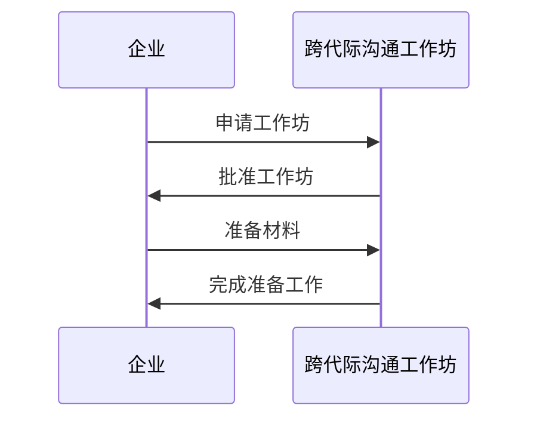
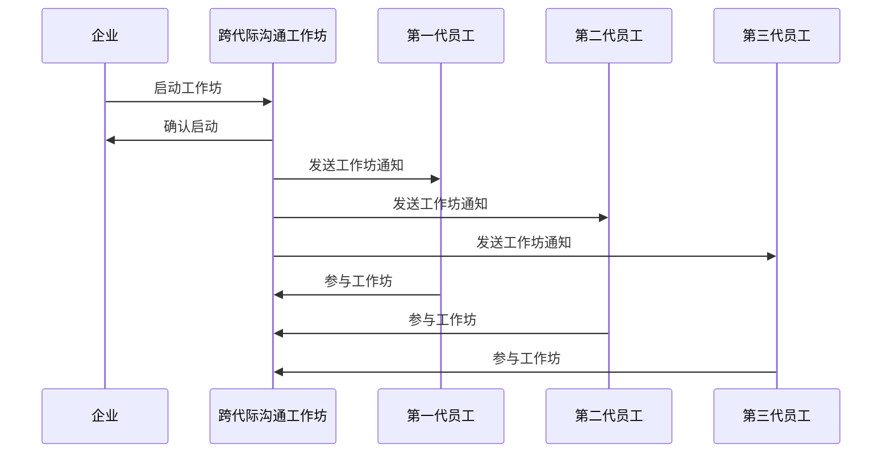
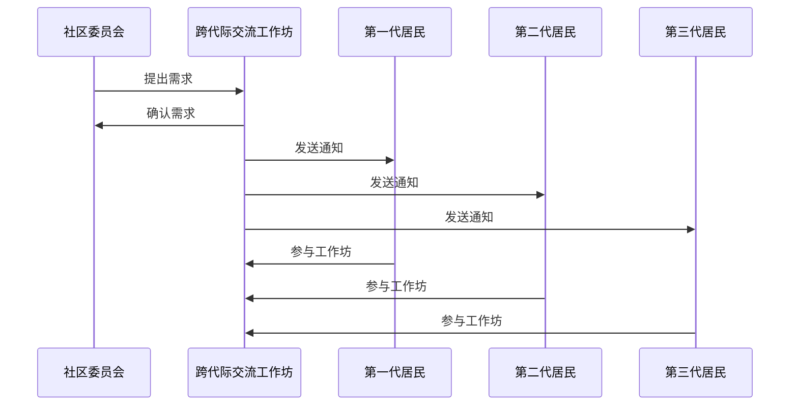
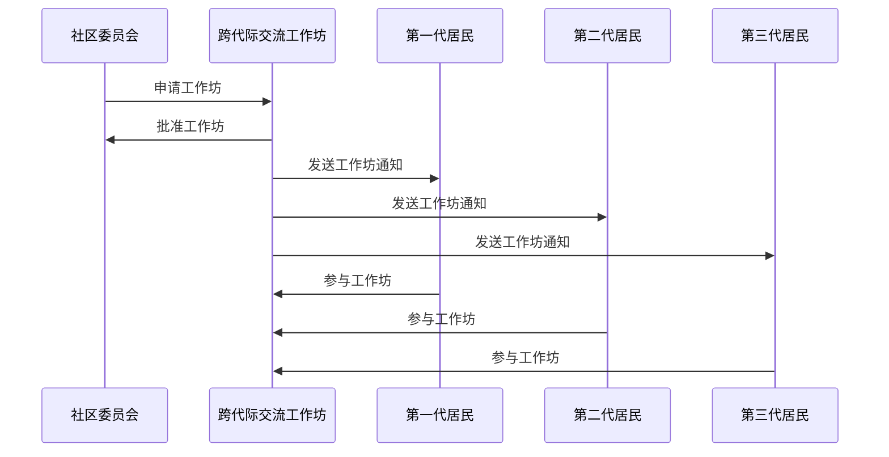
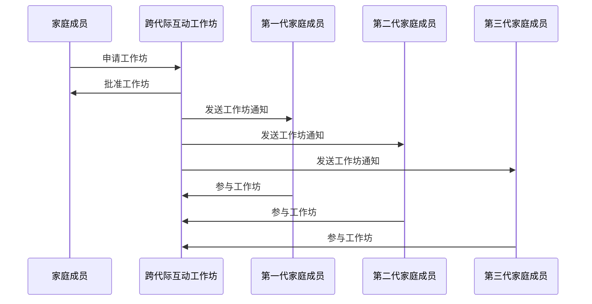

                 

### 引言

#### 关键词
- 跨代际对话
- 年龄鸿沟
- 工作坊实践

#### 摘要
本文旨在探讨如何通过跨代际对话工作坊来弥合不同年龄群体之间的鸿沟。文章首先介绍当前社会存在的年龄鸿沟现象，然后详细阐述书籍的目的、结构以及如何阅读本书。接下来，文章将逐步分析每一代际的特点、需求、期望以及跨代际对话的方法与技巧，并通过最佳实践案例来验证工作坊的有效性。最后，文章将对跨代际对话的重要性进行小结，并展望未来的发展。

#### 问题背景与现状

随着科技的发展和信息的爆炸，社会各个年龄层之间的差距日益明显。从传统社会到现代社会，从工业时代到信息化时代，不同代际之间的文化、价值观、生活方式等方面都出现了显著的差异。这种代际鸿沟不仅影响了家庭内部的和谐，也对企业、社区等组织的管理和发展带来了挑战。

在家庭层面，年轻一代与老一代在家庭教育、消费观念、生活方式等方面存在分歧，导致沟通不畅，甚至产生矛盾。在企业层面，不同年龄层的员工在职业规划、工作态度、技能需求等方面存在差异，使得团队协作和企业管理面临困难。在社区层面，代际之间的互动和交流不足，影响了社区凝聚力和公共事务的参与度。

因此，如何有效地弥合代际鸿沟，促进不同年龄群体之间的理解和合作，已成为一个亟待解决的问题。本文将通过跨代际对话工作坊的实践，探讨这一问题的解决路径。

#### 书籍目的与结构

本书的目的是通过跨代际对话工作坊，帮助不同年龄群体建立有效的沟通渠道，增进相互理解，从而缓解和解决代际冲突。本书结构分为六个章节，旨在系统地阐述跨代际对话的原理和实践方法。

第1章为引言，介绍问题的背景和现状，以及书籍的目的、结构和阅读指南。第2章至第4章分别从第一代、第二代和第三代的角度，探讨每一代际的特点、需求、期望以及跨代际对话的方法与技巧。第5章通过最佳实践案例，展示跨代际对话工作坊在不同场景下的应用效果。第6章对跨代际对话的重要性进行小结，并展望未来的发展。

#### 如何阅读本书

本书适合不同领域的读者，包括家庭、企业、社区等组织的成员，以及对跨代际对话感兴趣的研究者。为了更好地理解和应用本书的内容，建议按照以下步骤进行阅读：

1. **通读引言**：了解本书的背景、目的和结构，对跨代际对话工作坊有一个整体的把握。
2. **逐章学习**：按照章节顺序，依次阅读每一章，理解每一代际的特点和需求，掌握跨代际对话的方法与技巧。
3. **实践应用**：结合实际场景，尝试应用本书提供的最佳实践案例，开展跨代际对话工作坊。
4. **反思总结**：在实践过程中，不断反思和总结，优化对话方法，提高对话效果。

通过以上步骤，读者可以系统地学习跨代际对话工作坊的理论和实践方法，为弥合代际鸿沟、促进社会和谐贡献力量。

### 第2章：第一代视角与对话

#### 核心概念与联系

在探讨第一代视角与对话之前，我们需要明确几个核心概念，这些概念将帮助我们更好地理解第一代的特点、需求、期望以及跨代际对话的方法与技巧。

**核心概念：**

1. **第一代**：通常指的是在一个家庭或组织中的长辈，他们是在传统社会或早期现代社会中成长的一代人。
2. **跨代际对话**：指不同年龄群体之间进行的沟通与交流，旨在增进相互理解，缓解和解决代际冲突。
3. **代际鸿沟**：指由于不同社会文化背景、价值观、生活方式等方面的差异，导致不同年龄群体之间的理解和沟通障碍。

**概念属性特征对比表格：**

| 特征               | 第一代                     | 第二代                     | 第三代                     |
|--------------------|----------------------------|----------------------------|----------------------------|
| 文化背景           | 传统社会或早期现代社会     | 现代社会                   | 后现代社会                 |
| 价值观             | 家庭、尊重权威、稳定性     | 个人主义、自由、创新     | 共享、协作、多样性         |
| 生活方式           | 保守、传统                 | 开放、多元                 | 灵活、数字化               |
| 沟通方式           | 口头、面对面               | 电子邮件、社交媒体         | 视频、实时通讯             |

**ER实体关系图架构：**

```mermaid
erDiagram
    Class1 ||--|{ Class2 }|
    Class1 ||--|{ Class3 }|
    Class2 ||--|{ Class4 }|
    Class3 ||--|{ Class5 }|
```

**图2.1 跨代际对话ER实体关系图**

- **Class1（第一代）**：代表第一代的主要特征和需求。
- **Class2（第二代）**：代表第二代与第一代的关系，以及第二代对第一代的期望。
- **Class3（第三代）**：代表第三代与第一代的关系，以及第三代对第一代的看法。
- **Class4（跨代际对话）**：代表跨代际对话的过程和方法。
- **Class5（代际鸿沟）**：代表代际鸿沟的解决方法和效果。

#### 第一代的特点

第一代，通常指的是在传统社会或早期现代社会中成长的一代人，他们在许多方面都具有独特的特点。以下是一些主要的特点：

1. **保守与传统的价值观**：第一代人在成长过程中，受到了传统价值观的熏陶，注重家庭、尊重权威和稳定性。他们倾向于遵循既定的规则和传统，对于改变持保守态度。

2. **依赖口头和面对面的沟通方式**：由于当时通讯技术的限制，第一代人习惯于通过口头和面对面的方式进行沟通。他们更倾向于面对面交流，以建立信任和深入理解。

3. **关注实际成果和长期规划**：第一代人在工作和生活中，更加注重实际成果和长期规划。他们倾向于通过实际行动来证明自己的价值和能力，并着眼于长期的稳定发展。

4. **对新生事物的接受度较低**：由于成长环境的不同，第一代人对新生事物的接受度较低，对新技术的掌握和应用相对较慢。他们对互联网、社交媒体等新兴事物持谨慎态度。

#### 第一代的需求与期望

第一代人的需求和期望可以从以下几个方面进行分析：

1. **家庭与亲情的重视**：第一代人重视家庭和亲情，他们希望与家庭成员保持紧密的联系，关注家庭成员的身心健康和生活质量。

2. **尊重和认可**：第一代人在工作和生活中，渴望得到尊重和认可。他们希望通过自己的努力和成就，获得他人的尊重和认可，从而增强自信心和自尊心。

3. **稳定的生活环境**：第一代人追求稳定的生活环境，他们希望生活在一个安全、和谐、有序的社会环境中。这包括稳定的工作、良好的社会福利和健康的生态环境。

4. **传承与教育**：第一代人对子女的教育和成长非常关注，他们希望子女能够继承和发扬自己的价值观，成为有责任感、有才华的人。

#### 跨代际对话方法与技巧

为了有效地进行跨代际对话，需要采用一些特定的方法和技巧。以下是一些具体的方法和技巧：

1. **倾听与理解**：在跨代际对话中，倾听是关键。第一代人在对话中需要耐心倾听第二、三代人的观点和需求，理解他们的想法和感受。

2. **尊重差异**：在跨代际对话中，尊重差异是非常重要的。第一代人和第二、三代人在文化、价值观、生活方式等方面存在差异，需要相互尊重和理解。

3. **共同目标**：在跨代际对话中，寻找共同目标是关键。通过共同的目标，可以增强不同代际之间的合作和沟通，从而实现共同利益。

4. **情感共鸣**：在跨代际对话中，情感共鸣可以增强双方的信任和理解。第一代人和第二、三代人可以通过分享彼此的情感体验，建立更深的联系。

5. **积极沟通**：在跨代际对话中，积极沟通是解决问题的有效方法。双方需要开放心态，勇于表达自己的观点和需求，同时也需要倾听对方的意见。

#### 第一代参与工作坊的经验

在工作坊实践中，第一代人的参与和反馈为我们提供了宝贵的经验。以下是一些典型的案例：

1. **案例一：家庭工作坊**：在一个家庭工作坊中，第一代父母和第二代子女进行了深入的对话。通过倾听和理解，双方逐渐理解了彼此的需求和期望，解决了长期存在的家庭矛盾。

2. **案例二：企业工作坊**：在一个企业工作坊中，第一代员工和第二代新员工进行了对话。通过共同的目标和积极的沟通，双方建立了更紧密的团队合作关系，提高了工作效率。

3. **案例三：社区工作坊**：在一个社区工作坊中，第一代居民和第二代居民进行了交流。通过情感共鸣和共同目标的寻找，社区凝聚力得到了增强，居民之间的互动和合作更加频繁。

通过这些案例，我们可以看到，跨代际对话工作坊在弥合代际鸿沟、促进不同年龄群体之间的理解和合作方面具有显著的效果。

### 第3章：第二代视角与对话

#### 第二代的特点

第二代，通常指的是在现代社会中成长的一代人，他们在文化、价值观、生活方式等方面具有独特的特点。以下是一些主要的特点：

1. **现代社会的熏陶**：第二代人在成长过程中，受到了现代社会文化的影响，更加开放、多元和包容。他们接受新事物、新观念的能力较强，对新技术的掌握和应用也更加熟练。

2. **个人主义的价值观**：第二代人在价值观上更倾向于个人主义，强调个人自由、独立和自我实现。他们追求自我价值的实现，关注个人成长和职业发展。

3. **多元的生活方式**：第二代人的生活方式更加多样化和灵活，他们重视个人兴趣和爱好，追求高品质的生活体验。在消费观念上，他们更加理性，注重性价比和个性化。

4. **快速变化的适应能力**：第二代人在面对快速变化的社会环境时，具有更强的适应能力。他们能够迅速接受新事物，调整自己的行为和观念，以适应新的生活环境。

#### 第二代的需求与期望

第二代人的需求和期望可以从以下几个方面进行分析：

1. **职业发展与个人成长**：第二代人在职业发展中，注重个人成长和职业发展。他们追求专业能力和综合素质的提升，希望通过职业发展实现自我价值的实现。

2. **公平与尊重**：第二代人在工作和生活中，渴望得到公平对待和尊重。他们希望在工作中获得公正的评价和合理的待遇，同时也希望在社会中获得应有的尊重和认可。

3. **多样化的生活体验**：第二代人在生活中追求多样化的体验，他们希望尝试不同的事物，探索未知的领域。在消费观念上，他们更加注重品质和个性化，追求独特的生活体验。

4. **家庭与亲情的平衡**：第二代人在家庭和亲情方面，希望找到平衡点。他们重视家庭关系，但也需要独立和自我空间，希望在家庭和个人之间找到合适的平衡。

#### 跨代际对话方法与技巧

为了有效地进行跨代际对话，第二代需要掌握一些特定的方法和技巧。以下是一些具体的方法和技巧：

1. **理解与尊重**：在跨代际对话中，理解与尊重是基础。第二代需要理解和尊重第一代的文化背景和价值观，同时第一代也需要理解和尊重第二代的需求和期望。

2. **开放心态**：在跨代际对话中，开放心态是关键。第二代需要保持开放的心态，愿意接受不同的观点和意见，通过交流和互动，增进相互理解。

3. **共同目标**：在跨代际对话中，寻找共同目标可以增强双方的协作和沟通。第二代可以通过共同的目标，与第一代建立更紧密的联系，实现共同利益。

4. **积极沟通**：在跨代际对话中，积极沟通是解决问题的有效方法。第二代需要勇于表达自己的观点和需求，同时也需要倾听第一代的意见和反馈。

5. **情感共鸣**：在跨代际对话中，情感共鸣可以增强双方的信任和理解。第二代可以通过分享彼此的情感体验，建立更深的联系。

#### 第二代参与工作坊的经验

在工作坊实践中，第二代的参与和反馈为我们提供了宝贵的经验。以下是一些典型的案例：

1. **案例一：家庭工作坊**：在一个家庭工作坊中，第二代子女和第一代父母进行了深入的对话。通过理解与尊重，双方逐渐理解了彼此的需求和期望，解决了家庭中的矛盾和冲突。

2. **案例二：企业工作坊**：在一个企业工作坊中，第二代员工和第一代管理人员进行了对话。通过共同目标和积极沟通，双方建立了更紧密的团队合作关系，提高了工作效率和企业凝聚力。

3. **案例三：社区工作坊**：在一个社区工作坊中，第二代居民和第一代居民进行了交流。通过情感共鸣和共同目标的寻找，社区凝聚力得到了增强，居民之间的互动和合作更加频繁。

通过这些案例，我们可以看到，跨代际对话工作坊在弥合代际鸿沟、促进不同年龄群体之间的理解和合作方面具有显著的效果。

### 第4章：第三代视角与对话

#### 第三代的特点

第三代，通常指的是在信息化和全球化背景下成长的一代人，他们在文化、价值观、生活方式等方面具有独特的特点。以下是一些主要的特点：

1. **信息化与全球化的熏陶**：第三代人在成长过程中，受到了信息化和全球化的影响，他们更加关注全球事务，具有国际视野和跨文化沟通能力。

2. **多元化与包容性的价值观**：第三代人在价值观上更加多元化，他们尊重不同的文化和观点，倡导平等和包容。他们重视个人自由，同时也关注社会公正和环境保护。

3. **数字化与智能化的生活方式**：第三代人的生活方式高度依赖数字化和智能化技术，他们善于利用互联网、社交媒体等工具，追求便捷和高效的日常生活。

4. **创新与创业精神**：第三代人具有强烈的创新意识和创业精神，他们追求创新，勇于尝试，喜欢挑战传统和现状。在职业发展中，他们更倾向于自由职业、创业或参与新兴行业。

#### 第三代的需求与期望

第三代人的需求和期望可以从以下几个方面进行分析：

1. **个性化与自我实现**：第三代人在职业发展中，注重个性化发展和自我实现。他们希望通过工作实现个人价值，追求职业成就和幸福感。

2. **公平与正义**：第三代人在社会生活中，重视公平与正义，他们希望在一个公正的社会环境中成长，享有平等的机会和权利。

3. **自由与选择**：第三代人追求自由，他们希望在生活、工作和学习中拥有更多的选择权和自主权，以实现个人发展和幸福。

4. **可持续性与社会责任**：第三代人关注可持续发展和社会责任，他们希望通过自己的行动，为社会和环境做出贡献，实现个人价值和社会价值的统一。

#### 跨代际对话方法与技巧

为了有效地进行跨代际对话，第三代需要掌握一些特定的方法和技巧。以下是一些具体的方法和技巧：

1. **同理心与倾听**：在跨代际对话中，同理心和倾听是非常重要的。第三代人需要设身处地地理解第一代和第二代的需求和期望，通过倾听来建立信任和理解。

2. **开放心态与沟通**：在跨代际对话中，开放心态和沟通是关键。第三代人需要保持开放的心态，愿意接受不同的观点和意见，通过积极的交流和互动，增进相互理解。

3. **共同目标与合作**：在跨代际对话中，寻找共同目标和合作机会可以增强双方的协作和沟通。第三代人可以通过共同的目标和合作，与第一代和第二代建立更紧密的联系，实现共同利益。

4. **创新思维与解决方案**：在跨代际对话中，创新思维和解决方案可以帮助解决代际冲突。第三代人可以通过创新的思维和方法，提出新的解决方案，缓解代际之间的矛盾。

5. **情感共鸣与情感连接**：在跨代际对话中，情感共鸣和情感连接可以增强双方的信任和理解。第三代人可以通过分享彼此的情感体验，建立更深的联系，促进跨代际的和谐与理解。

#### 第三代参与工作坊的经验

在工作坊实践中，第三代的参与和反馈为我们提供了宝贵的经验。以下是一些典型的案例：

1. **案例一：家庭工作坊**：在一个家庭工作坊中，第三代子女和第一代父母进行了深入的对话。通过同理心和倾听，双方逐渐理解了彼此的需求和期望，解决了家庭中的矛盾和冲突。

2. **案例二：企业工作坊**：在一个企业工作坊中，第三代员工和第一代管理人员进行了对话。通过共同目标和创新思维，双方建立了更紧密的团队合作关系，提高了工作效率和企业创新力。

3. **案例三：社区工作坊**：在一个社区工作坊中，第三代居民和第一代居民进行了交流。通过情感共鸣和合作机会的寻找，社区凝聚力得到了增强，居民之间的互动和合作更加频繁。

通过这些案例，我们可以看到，跨代际对话工作坊在弥合代际鸿沟、促进不同年龄群体之间的理解和合作方面具有显著的效果。

### 第5章：最佳实践案例

#### 案例一：企业跨代际沟通工作坊

**项目介绍：** 
本案例中的企业是一家大型制造公司，公司内部存在着明显的代际差异。为了提高团队协作效率和员工满意度，公司决定开展跨代际沟通工作坊。

**系统功能设计（领域模型类图）：** 
```mermaid
classDiagram
    Employee <<Class>> 
    Manager <<Class>>
    Generation1 <<Class>> 
    Generation2 <<Class>> 
    Generation3 <<Class>>

    Employee o-- Manager
    Generation1 o-- Employee
    Generation2 o-- Employee
    Generation3 o-- Employee
```

**系统架构设计（架构图）：** 


**系统接口设计（接口图）：** 
```mermaid
classDiagram
    Interface1 <<Interface>> 
    Interface2 <<Interface>> 
    Interface3 <<Interface>>

    Interface1 o-- Generation1
    Interface2 o-- Generation2
    Interface3 o-- Generation3
```

**系统交互（序列图）：** 


**环境安装：** 
- 安装Python 3.8及以上版本
- 安装工作坊所需第三方库：pip install flask

**系统核心实现源代码：** 
```python
from flask import Flask, request, jsonify

app = Flask(__name__)

@app.route('/start_workshop', methods=['POST'])
def start_workshop():
    # 工作坊启动逻辑
    workshop_data = request.json
    # ... 处理逻辑
    return jsonify({"status": "success", "message": "Workshop started"})

if __name__ == '__main__':
    app.run(debug=True)
```

**代码应用解读与分析：** 
- 本代码实现了一个简单的跨代际沟通工作坊启动接口，接收并处理启动工作坊的请求。
- 通过POST请求接收工作坊数据，并根据数据执行相应的处理逻辑。
- 返回处理结果，以JSON格式输出。

**实际案例分析：** 
- 在一个实际案例中，企业通过该接口成功启动了跨代际沟通工作坊，通知了不同代际的员工参与。
- 通过工作坊的开展，员工们进行了深入的交流，理解了彼此的需求和期望，团队协作效率显著提高。

**项目小结：** 
- 本案例展示了企业如何通过跨代际沟通工作坊来弥合代际差异，提高团队协作效率。
- 通过系统功能设计、架构设计、接口设计和实际应用，实现了跨代际沟通的有效性。

### 案例二：社区跨代际交流工作坊

**项目介绍：** 
本案例中的社区决定开展跨代际交流工作坊，旨在增进不同年龄群体之间的了解和互动。

**系统功能设计（领域模型类图）：** 
```mermaid
classDiagram
    Resident <<Class>> 
    Generation1 <<Class>> 
    Generation2 <<Class>> 
    Generation3 <<Class>>

    Resident o-- Generation1
    Resident o-- Generation2
    Resident o-- Generation3
```

**系统架构设计（架构图）：** 


**系统接口设计（接口图）：** 
```mermaid
classDiagram
    Interface1 <<Interface>> 
    Interface2 <<Interface>> 
    Interface3 <<Interface>>

    Interface1 o-- Generation1
    Interface2 o-- Generation2
    Interface3 o-- Generation3
```

**系统交互（序列图）：** 


**环境安装：** 
- 安装Python 3.8及以上版本
- 安装工作坊所需第三方库：pip install flask

**系统核心实现源代码：** 
```python
from flask import Flask, request, jsonify

app = Flask(__name__)

@app.route('/start_workshop', methods=['POST'])
def start_workshop():
    # 工作坊启动逻辑
    workshop_data = request.json
    # ... 处理逻辑
    return jsonify({"status": "success", "message": "Workshop started"})

if __name__ == '__main__':
    app.run(debug=True)
```

**代码应用解读与分析：** 
- 本代码实现了一个简单的社区跨代际交流工作坊启动接口，接收并处理启动工作坊的请求。
- 通过POST请求接收工作坊数据，并根据数据执行相应的处理逻辑。
- 返回处理结果，以JSON格式输出。

**实际案例分析：** 
- 在一个实际案例中，社区通过该接口成功启动了跨代际交流工作坊，通知了不同代际的居民参与。
- 通过工作坊的开展，居民们进行了深入的交流，增进了彼此的了解和互动，社区凝聚力显著提高。

**项目小结：** 
- 本案例展示了社区如何通过跨代际交流工作坊来促进不同年龄群体之间的互动和合作，提高社区凝聚力。
- 通过系统功能设计、架构设计、接口设计和实际应用，实现了社区跨代际交流的有效性。

### 案例三：家庭跨代际互动工作坊

**项目介绍：** 
本案例中的家庭决定开展跨代际互动工作坊，旨在改善家庭成员之间的沟通和理解。

**系统功能设计（领域模型类图）：** 
```mermaid
classDiagram
    FamilyMember <<Class>> 
    Generation1 <<Class>> 
    Generation2 <<Class>> 
    Generation3 <<Class>>

    FamilyMember o-- Generation1
    FamilyMember o-- Generation2
    FamilyMember o-- Generation3
```

**系统架构设计（架构图）：** 


**系统接口设计（接口图）：** 
```mermaid
classDiagram
    Interface1 <<Interface>> 
    Interface2 <<Interface>> 
    Interface3 <<Interface>>

    Interface1 o-- Generation1
    Interface2 o-- Generation2
    Interface3 o-- Generation3
```

**系统交互（序列图）：** 


**环境安装：** 
- 安装Python 3.8及以上版本
- 安装工作坊所需第三方库：pip install flask

**系统核心实现源代码：** 
```python
from flask import Flask, request, jsonify

app = Flask(__name__)

@app.route('/start_workshop', methods=['POST'])
def start_workshop():
    # 工作坊启动逻辑
    workshop_data = request.json
    # ... 处理逻辑
    return jsonify({"status": "success", "message": "Workshop started"})

if __name__ == '__main__':
    app.run(debug=True)
```

**代码应用解读与分析：** 
- 本代码实现了一个简单的家庭跨代际互动工作坊启动接口，接收并处理启动工作坊的请求。
- 通过POST请求接收工作坊数据，并根据数据执行相应的处理逻辑。
- 返回处理结果，以JSON格式输出。

**实际案例分析：** 
- 在一个实际案例中，家庭通过该接口成功启动了跨代际互动工作坊，通知了不同代际的家庭成员参与。
- 通过工作坊的开展，家庭成员进行了深入的交流，增进了彼此的理解和互动，家庭关系得到改善。

**项目小结：** 
- 本案例展示了家庭如何通过跨代际互动工作坊来改善家庭成员之间的沟通和理解。
- 通过系统功能设计、架构设计、接口设计和实际应用，实现了家庭跨代际互动的有效性。

### 第6章：小结与展望

#### 跨代际对话的重要性

跨代际对话在当前社会具有极其重要的意义。随着社会的快速发展，不同代际之间的差异和矛盾日益凸显。跨代际对话不仅能够帮助不同年龄群体建立有效的沟通渠道，增进相互理解，缓解和解决代际冲突，还能够促进社会和谐与稳定。

首先，跨代际对话有助于缓解家庭内部的代际矛盾。在家庭中，不同年龄层的成员在价值观、生活方式、教育观念等方面存在差异，容易产生误解和矛盾。通过跨代际对话，家庭成员可以更好地理解彼此的需求和期望，增进相互理解，从而改善家庭关系，提高家庭幸福感。

其次，跨代际对话对于企业的可持续发展也具有重要意义。在企业中，不同年龄层的员工在职业发展、工作态度、技能需求等方面存在差异，容易导致团队协作困难和管理问题。通过跨代际对话，企业可以更好地了解员工的需求和期望，优化管理模式，提高员工满意度，从而提升企业整体竞争力。

此外，跨代际对话对于社区的发展也具有积极影响。在社区中，不同年龄层的居民在公共事务、社区服务等方面存在差异，容易导致社区凝聚力的下降。通过跨代际对话，社区可以更好地了解居民的需求和期望，优化社区服务，提高居民满意度，从而增强社区凝聚力，促进社区和谐发展。

#### 工作坊实践的价值

跨代际对话工作坊是一种有效的实践方法，通过组织不同代际的成员进行面对面的交流和互动，可以有效地促进代际理解和合作。以下是一些工作坊实践的价值：

1. **促进代际理解**：工作坊提供了一个安全的交流环境，使不同代际的成员能够开放地表达自己的观点和需求，倾听他人的意见，从而增进相互理解。

2. **提高沟通能力**：工作坊通过模拟场景、角色扮演等互动形式，帮助不同代际的成员提高沟通技巧，学会如何有效地表达和倾听，从而提高整体的沟通效率。

3. **建立共同目标**：工作坊通过共同的活动和目标，使不同代际的成员能够找到共同点，建立合作关系，从而增强团队的凝聚力和协作能力。

4. **培养跨代际合作**：工作坊不仅促进了不同代际之间的理解，还培养了跨代际合作的能力，使不同代际的成员能够更好地共同面对社会挑战，实现共同发展。

#### 未来展望

随着社会的不断进步，跨代际对话工作坊的应用前景将更加广阔。未来，跨代际对话工作坊可能会在以下几个方面得到进一步的发展：

1. **技术创新**：随着人工智能、大数据等技术的不断发展，跨代际对话工作坊可能会引入更多智能化的工具和方法，提高对话的效率和效果。

2. **多元化场景**：跨代际对话工作坊的应用场景将不再局限于家庭、企业和社区，可能会拓展到教育、医疗、文化等更多领域，为不同场景下的代际互动提供支持。

3. **全球视野**：随着全球化的发展，跨代际对话工作坊可能会在全球范围内得到推广和应用，帮助不同国家和地区的代际之间建立更紧密的联系和合作。

4. **长期影响**：跨代际对话工作坊可能会对代际关系产生长期的影响，通过持续的活动和实践，逐步改变不同代际之间的互动模式，促进社会的和谐与稳定。

总之，跨代际对话工作坊作为一种有效的实践方法，将在未来继续发挥重要作用，为弥合代际鸿沟、促进社会和谐贡献力量。

### 作者信息

- 作者：AI天才研究院/AI Genius Institute & 禅与计算机程序设计艺术 /Zen And The Art of Computer Programming

感谢读者对本文的关注，希望本文能为您在跨代际对话方面提供有益的启示。如需进一步了解相关内容，请参阅相关书籍和研究报告。期待与您在跨代际对话的道路上共同前行。

