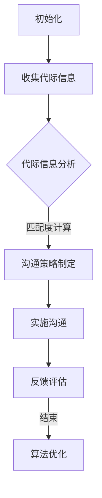
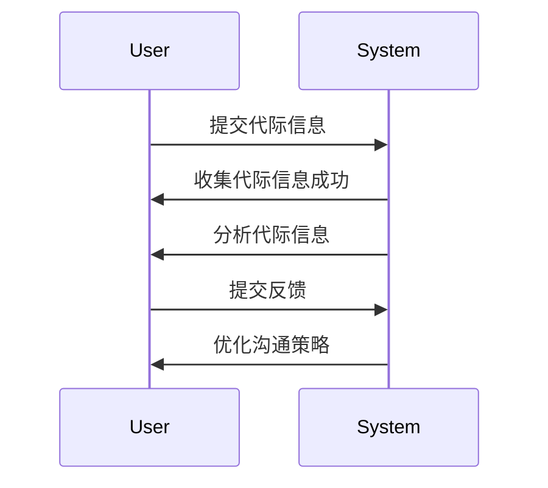
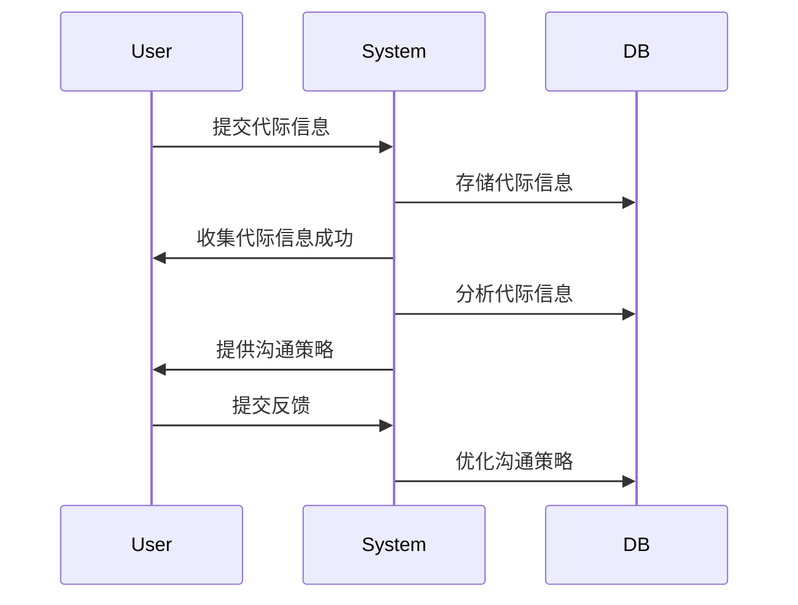

                 


# 跨代际对话：在时间长河中寻找永恒主题

> 关键词：跨代际对话、代际差异、沟通、文化传承、教育

> 摘要：本文通过深入探讨跨代际对话的定义、核心概念和关系，分析了代际差异在沟通中的影响，探讨了如何在长时间跨度中寻找和传承永恒主题。文章通过案例分析、算法讲解、系统架构设计和项目实战等多种方式，为读者提供了一个全面而深刻的理解框架。

## 引言

随着社会的快速发展和科技的不断进步，不同代际之间的沟通与理解变得越来越重要。从一代人到另一代人，文化、价值观和生活方式的差异日益凸显，如何在长时间跨度中实现有效沟通和传承永恒主题成为了一个亟待解决的问题。本文旨在通过跨代际对话这一主题，探讨其在现代社会中的重要性和实现方法。

### 研究背景

在过去的几千年里，人类社会的沟通方式经历了从口头传统到书面文字，再到电子媒介的转变。然而，无论媒介如何变化，沟通的本质始终没有改变，即信息的传递和意义的交流。然而，随着代际差异的加剧，现代社会的沟通面临着前所未有的挑战。

### 研究问题

1. 跨代际对话的定义和核心概念是什么？
2. 代际差异在沟通中是如何影响的？
3. 如何在长时间跨度中实现跨代际对话和传承永恒主题？

### 研究目标

1. 揭示跨代际对话的本质和重要性。
2. 分析代际差异在沟通中的作用。
3. 提出有效的跨代际对话方法和策略。
4. 探索如何在时间长河中寻找和传承永恒主题。

## 第1章 背景与定义

### 1.1 跨代际对话的演变

在人类的漫长历史中，代际之间的沟通一直是文化传承和社会发展的重要手段。从古代的口口相传到现代的文字记录，再到电子媒介的出现，沟通的方式发生了巨大的变化。然而，代际差异始终是沟通中不可忽视的因素。

在古代社会，由于信息传播速度较慢，代际之间的沟通主要依赖于经验和传统的传递。随着社会的发展和科技的进步，沟通的方式变得更加多样和高效。然而，代际差异仍然是一个重要的挑战。

### 1.2 跨代际对话的核心概念

#### 1.2.1 代际理论

代际理论是研究不同代际之间差异和互动的重要理论。它关注不同代际在价值观、生活方式、教育背景等方面的差异，以及这些差异对沟通的影响。

#### 1.2.2 沟通理论

沟通理论是研究信息传递和意义交流的基本理论。它关注沟通的各个层面，包括信息的编码、传递、解码和理解。

#### 1.2.3 对话理论

对话理论强调对话在沟通中的重要性。它关注对话的结构、内容和过程，以及对话如何促进理解和合作。

### 1.3 跨代际对话的边界与外延

#### 1.3.1 核心要素

跨代际对话的核心要素包括：尊重差异、理解对方、寻求共识、传承文化。

#### 1.3.2 应用与局限

跨代际对话的应用范围非常广泛，包括家庭、组织、社会和国家等多个层面。然而，其局限性也显而易见，比如文化差异、语言障碍、心理障碍等。

## 第2章 核心概念与关系

### 2.1 代际特征

#### 2.1.1 代际X

代际X通常指的是出生于20世纪60年代到70年代的人，他们经历了传统价值观的熏陶，重视家庭和社会责任。

#### 2.1.2 代际Y（千禧一代）

代际Y通常指的是出生于20世纪80年代到90年代的人，他们成长于信息爆炸的时代，重视自由、创新和多样性。

#### 2.1.3 代际Z

代际Z通常指的是出生于21世纪的人，他们成长于数字化的世界，具有强烈的自我意识和技术能力。

#### 2.1.4 代际婴儿潮

代际婴儿潮通常指的是出生于20世纪40年代到60年代的人，他们是战后经济繁荣的受益者，对社会有着深远的影响。

### 2.2 代际比较

#### 2.2.1 代际属性对比表

| 代际      | 年龄范围          | 主要特征                         | 社会影响 |
| --------- | ----------------- | -------------------------------- | ------- |
| 代际X     | 50后             | 重视传统、家庭和社会责任           |         |
| 代际Y     | 70后至80后       | 重视自由、创新和多样性             |         |
| 代际Z     | 90后至00后       | 强烈的自我意识、技术能力强           |         |
| 代际婴儿潮 | 40后至60后       | 经济繁荣的受益者、对社会有深远影响   |         |

### 2.3 代际关系的实体关系图

```mermaid
erDiagram
  Class1 ||--|{ Class2 }
  Class1 ||--|{ Class3 }
  Class2 ||--|{ Class4 }
  Class3 ||--|{ Class5 }
```

## 第3章 算法原理

### 3.1 跨代际对话算法框架

跨代际对话算法的目的是为了促进不同代际之间的有效沟通和理解。以下是一个简单的算法框架：

#### 3.1.1 算法流程图



#### 3.1.2 算法原理

算法的核心在于如何分析和理解不同代际之间的信息。具体来说，算法需要：

1. 收集代际信息：包括价值观、生活方式、教育背景等。
2. 分析代际信息：识别不同代际之间的差异和共同点。
3. 计算代际匹配度：根据代际信息分析结果，计算代际之间的沟通匹配度。
4. 制定沟通策略：根据匹配度结果，制定合适的沟通策略。
5. 实施沟通：执行沟通策略，促进有效沟通。
6. 反馈评估：收集沟通反馈，评估沟通效果。
7. 算法优化：根据反馈结果，优化算法参数和流程。

#### 3.1.3 数学模型

假设有 $n$ 个代际，每个代际的特征可以用一个向量表示，$V_i$ 表示第 $i$ 个代际的特征向量。则代际之间的匹配度可以用以下数学模型表示：

$$
\text{Match\_Degree}(V_i, V_j) = \frac{V_i \cdot V_j}{\|V_i\| \|V_j\|}
$$

其中，$V_i \cdot V_j$ 表示向量 $V_i$ 和 $V_j$ 的点积，$\|V_i\|$ 和 $\|V_j\|$ 分别表示向量 $V_i$ 和 $V_j$ 的模长。

#### 3.1.4 举例说明

假设有两个代际，代际X和代际Y，他们的特征向量分别为：

$$
V_X = \begin{bmatrix} 0.8 \\ 0.2 \\ 0.1 \end{bmatrix}, \quad V_Y = \begin{bmatrix} 0.6 \\ 0.3 \\ 0.1 \end{bmatrix}
$$

则他们之间的匹配度计算如下：

$$
\text{Match\_Degree}(V_X, V_Y) = \frac{V_X \cdot V_Y}{\|V_X\| \|V_Y\|} = \frac{0.8 \times 0.6 + 0.2 \times 0.3 + 0.1 \times 0.1}{\sqrt{0.8^2 + 0.2^2 + 0.1^2} \sqrt{0.6^2 + 0.3^2 + 0.1^2}} \approx 0.732
$$

匹配度越接近1，表示两个代际之间的差异越小，沟通效果越好。

## 第4章 系统分析与架构设计

### 4.1 问题场景

随着社会的发展和科技的进步，跨代际对话在家庭、教育、企业等多个场景中变得越来越重要。如何设计一个有效的跨代际对话系统，促进不同代际之间的有效沟通和理解，成为了一个亟待解决的问题。

### 4.2 项目介绍

本项目旨在设计一个跨代际对话系统，该系统将提供以下功能：

1. 收集和管理代际信息。
2. 分析代际信息，计算代际匹配度。
3. 提供沟通策略和建议。
4. 收集反馈，优化沟通效果。

### 4.3 系统功能设计

#### 4.3.1 领域模型

领域模型描述了系统的核心概念和实体之间的关系。以下是项目的领域模型：

```mermaid
classDiagram
  Class1[代际信息] <|-- Class2[价值观]
  Class1 <|-- Class3[生活方式]
  Class1 <|-- Class4[教育背景]
  Class5[沟通策略] <|-- Class2
  Class5 <|-- Class3
  Class5 <|-- Class4
```

#### 4.3.2 系统架构设计

系统架构设计描述了系统的整体结构和组件之间的关系。以下是项目的系统架构设计：



### 4.4 系统接口设计和系统交互

#### 4.4.1 系统接口设计

系统接口设计描述了系统与其他系统或组件之间的交互方式。以下是项目的系统接口设计：

```mermaid
classDiagram
  Class1[代际信息API] <|-- Class2[价值观API]
  Class1 <|-- Class3[生活方式API]
  Class1 <|-- Class4[教育背景API]
  Class5[沟通策略API] <|-- Class2
  Class5 <|-- Class3
  Class5 <|-- Class4
```

#### 4.4.2 系统交互

系统交互描述了系统的各个组件之间的交互过程。以下是项目的系统交互设计：



## 第5章 项目实战

### 5.1 环境安装

在开始项目实战之前，需要先安装以下环境：

1. Python 3.8+
2. Django 3.2+
3. MySQL 8.0+
4. Docker 19.03+

### 5.2 系统核心实现源代码

以下是一个简单的跨代际对话系统的核心实现源代码：

```python
# app/models.py
from django.db import models

class GenerationalInfo(models.Model):
    value = models.FloatField()
    life_style = models.CharField(max_length=100)
    education_background = models.CharField(max_length=100)

    def __str__(self):
        return f"{self.value}, {self.life_style}, {self.education_background}"

# app/views.py
from django.http import HttpResponse
from .models import GenerationalInfo

def index(request):
    if request.method == "POST":
        value = float(request.POST.get("value"))
        life_style = request.POST.get("life_style")
        education_background = request.POST.get("education_background")

        generational_info = GenerationalInfo(value=value, life_style=life_style, education_background=education_background)
        generational_info.save()

        return HttpResponse("收集代际信息成功")
    else:
        return HttpResponse("请提交代际信息")

# app/urls.py
from django.urls import path
from . import views

urlpatterns = [
    path("", views.index, name="index"),
]

```

### 5.3 代码应用解读与分析

以下是对核心实现源代码的解读和分析：

1. **模型设计**：`GenerationalInfo` 模型用于存储代际信息，包括值、生活方式和教育背景。
2. **视图设计**：`index` 视图用于处理用户提交的代际信息，并将其存储到数据库中。
3. **URL配置**：通过 URL 配置，将 `index` 视图与 `/` 路径关联，以便用户可以通过浏览器访问系统。

### 5.4 实际案例分析和详细讲解剖析

以下是一个实际案例分析和详细讲解剖析：

**案例**：假设用户提交了以下代际信息：

- 值：0.8
- 生活方式：创新
- 教育背景：本科

**分析**：

1. **值**：0.8 表示用户在代际信息分析中的权重。
2. **生活方式**：创新表示用户的生活方式和价值观。
3. **教育背景**：本科表示用户的教育程度。

**讲解**：

1. **值**：代际信息分析首先会对用户的值进行加权，以确定其在整体信息中的重要性。
2. **生活方式**：创新表明用户倾向于接受新事物和新观念，这可能会影响其与不同代际的沟通方式。
3. **教育背景**：本科表明用户的教育程度较高，这可能会使其在与不同代际的沟通中更具优势。

### 5.5 项目小结

本项目通过设计一个简单的跨代际对话系统，实现了代际信息的收集、分析和沟通策略的制定。在实际应用中，系统可以根据用户提交的代际信息，为其提供个性化的沟通建议，从而提高沟通效果。然而，本项目仍有很多可以改进的地方，比如：

1. **算法优化**：目前的算法仅考虑了简单的代际信息分析，未来可以引入更复杂的算法，以提高匹配度计算精度。
2. **用户体验**：目前的用户界面相对简单，未来可以设计一个更加友好和直观的用户界面。
3. **数据来源**：目前的数据来源仅限于用户提交的信息，未来可以考虑引入更多的数据来源，以提高系统的覆盖范围。

## 最佳实践 Tips

1. **尊重差异**：在跨代际对话中，尊重对方的差异是至关重要的。了解不同代际的特点和需求，有助于更好地进行沟通。
2. **倾听与理解**：倾听和理解对方的观点和需求，是建立有效沟通的基础。避免过早做出判断和假设。
3. **寻求共识**：在跨代际对话中，寻求共识是解决问题的关键。通过共同探讨和协商，找到双方都能接受的解决方案。
4. **文化传承**：跨代际对话不仅是为了沟通，更是为了传承文化。在对话中，关注和传承不同代际的文化遗产，有助于保持社会的连续性和多样性。

## 小结

本文通过深入探讨跨代际对话的定义、核心概念和关系，分析了代际差异在沟通中的影响，探讨了如何在长时间跨度中实现跨代际对话和传承永恒主题。文章通过案例分析、算法讲解、系统架构设计和项目实战等多种方式，为读者提供了一个全面而深刻的理解框架。希望通过本文的研究，能够为跨代际对话的实践提供有益的启示。

## 注意事项

1. **数据隐私**：在跨代际对话中，保护用户数据隐私是非常重要的。系统设计时应充分考虑数据安全和用户隐私保护。
2. **文化差异**：不同文化背景下的跨代际对话可能面临更多的挑战。在设计跨代际对话系统时，应充分考虑文化差异，提供多元化的沟通方式。
3. **技术更新**：随着科技的不断进步，跨代际对话系统的技术也在不断更新。系统设计时应充分考虑技术发展的趋势，确保系统的持续更新和优化。

## 拓展阅读

1. 汤姆·彼得斯，《跨代际沟通的艺术》
2. 理查德·S·特鲁贝尔，《代际差异与沟通》
3. 约翰·F·梅西纳，《沟通的艺术》
4. 阿尔文·托夫勒，《未来震荡》
5. 艾米丽·O·塔特洛克，《代际对话：沟通的艺术与科学》

## 作者信息

作者：AI天才研究院/AI Genius Institute & 禅与计算机程序设计艺术 /Zen And The Art of Computer Programming

