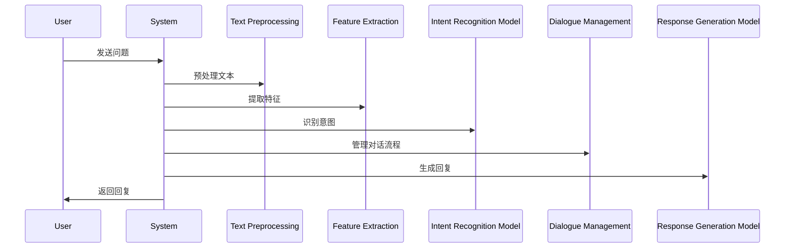

                 

# 跨代际对话：弥合年龄鸿沟的意义探索

## 关键词
- 跨代际对话
- 年龄鸿沟
- 沟通策略
- 深度学习
- 系统设计
- 实战案例

## 摘要
本文旨在探讨跨代际对话的重要性，分析年龄鸿沟的成因及其影响，并探讨弥合这一鸿沟的策略。文章分为四个主要部分：背景介绍、核心概念与联系、算法原理讲解以及系统分析与架构设计方案。通过逐步分析推理，本文希望为读者提供一个清晰、系统的跨代际对话解决方案。

## 目录大纲

### 第一部分：背景与概念

#### 第1章：引言
- 年龄鸿沟的现象与影响
- 跨代际对话的必要性
- 本书结构概述

#### 第2章：核心概念与联系
- 代际差异的概念
- 跨代际沟通模型
- ER图：代际关系与沟通机制

### 第二部分：算法与模型

#### 第3章：跨代际对话算法原理
- 基于深度学习的对话系统
- Python实现示例
- 数学模型与公式

#### 第4章：跨代际对话系统设计
- 系统功能设计
- 系统架构设计
- 系统接口设计与交互

### 第三部分：项目实战

#### 第5章：跨代际对话系统实现
- 环境安装与配置
- 系统核心实现
- 案例分析
- 项目小结

### 第四部分：最佳实践与拓展

#### 第6章：最佳实践与建议
- 对话策略建议
- 沟通技巧提升
- 注意事项

#### 第7章：拓展阅读
- 相关书籍推荐
- 学术文章精选
- 在线资源指南

## 第一部分：背景与概念

### 第1章：引言

**1.1 年龄鸿沟的现象与影响**

在当今快速变化的社会中，不同年龄段的人们面临着越来越多的代际差异。年龄鸿沟不仅仅体现在生活习惯、价值观和社会角色的差异上，还体现在技术接受程度、信息获取方式以及沟通方式的差异上。

年龄鸿沟的影响是深远而广泛的。对于个人来说，代际差异可能导致沟通障碍、误解和隔阂。在工作中，年龄鸿沟可能导致团队协作效率低下，甚至影响组织绩效。在社会层面，年龄鸿沟可能导致社会不和谐、代际冲突以及社会问题的积累。

**1.2 跨代际对话的必要性**

跨代际对话的重要性不言而喻。通过有效的跨代际对话，可以促进不同年龄段之间的理解、尊重和合作，从而弥合年龄鸿沟。跨代际对话有助于传递知识、经验和智慧，促进个人成长和社会进步。

**1.3 本书结构概述**

本书分为四个主要部分。第一部分将介绍背景与概念，包括年龄鸿沟的现象与影响，以及跨代际对话的必要性。第二部分将深入探讨跨代际对话的算法原理和模型。第三部分将展示跨代际对话系统的设计与实现，通过一个具体案例进行分析。第四部分将提供最佳实践和拓展阅读，帮助读者更好地理解和应用跨代际对话技术。

## 第二部分：核心概念与联系

### 第2章：核心概念与联系

**2.1 代际差异的概念**

代际差异是指由于不同年龄段的人在成长过程中受到的不同社会、文化和技术环境的影响，导致他们在价值观、态度和行为上的差异。代际差异通常包括以下几个方面：

- **价值观**：不同年代的人对道德、正义、自由、平等等基本价值观的理解和追求可能存在差异。
- **态度**：对于新技术、新观念和新事物的接受程度不同，可能导致不同的态度和看法。
- **行为**：在生活、工作和社会活动中的行为方式和习惯也可能因代际差异而有所不同。

**2.2 跨代际沟通模型**

跨代际沟通是指不同年龄段的人之间的交流和理解过程。有效的跨代际沟通需要克服代际差异带来的障碍，建立共同的理解和沟通基础。跨代际沟通模型包括以下几个关键要素：

- **沟通障碍与解障碍策略**：识别和分析代际差异导致的沟通障碍，并采取相应的策略来解除这些障碍。
- **沟通模式的多样性**：理解不同年龄段人的沟通偏好，采用多种沟通方式来满足不同需求。

**2.3 ER图：代际关系与沟通机制**

为了更好地理解代际差异和跨代际沟通，可以使用实体关系图（ER图）来展示相关概念和关系。ER图可以明确表示不同年龄段的人、他们的价值观、态度和行为，以及这些因素如何影响沟通机制。

```mermaid
erDiagram
    Class1 "<Age Group 1>" {
        <<entity>> "Individuals"
        <<attribute>> "Values"
        <<attribute>> "Attitudes"
        <<attribute>> "Behaviors"
    }
    Class2 "<Age Group 2>" {
        <<entity>> "Individuals"
        <<attribute>> "Values"
        <<attribute>> "Attitudes"
        <<attribute>> "Behaviors"
    }
    Class1 "_Communication Barriers_" ||--|{ Class2 }|| "_Strategies for Overcoming Barriers_"
    Class1 "_Cultural Knowledge_" ||--|{ Class2 }|| "_Mutual Understanding_"
```

通过ER图，我们可以清晰地看到不同年龄群体之间的沟通障碍、需要克服的障碍策略，以及通过文化知识的传递如何实现相互理解。

## 第二部分：算法与模型

### 第3章：跨代际对话算法原理

**3.1 基于深度学习的对话系统**

跨代际对话系统的核心是能够理解和生成自然语言交互。深度学习技术在自然语言处理（NLP）领域的应用为跨代际对话提供了强大的支持。深度学习模型如循环神经网络（RNN）、长短期记忆网络（LSTM）和变换器（Transformer）等，已经被广泛应用于对话系统。

**3.1.1 深度学习基础**

深度学习是一种通过多层神经网络模拟人脑学习和处理信息的方式。它通过大量数据训练模型，使其能够自动提取特征并做出预测。在NLP领域，深度学习模型可以处理复杂的语言结构和语义信息。

**3.1.2 对话系统架构**

跨代际对话系统的架构通常包括以下几个关键部分：

- **输入层**：接收用户的输入语句。
- **编码器**：将输入语句编码为固定长度的向量，以捕获语义信息。
- **解码器**：使用编码器的输出生成合适的回复。
- **输出层**：将解码器的输出转换为自然语言文本。

**3.2 Python实现示例**

下面是一个简单的基于LSTM的对话系统实现的Python代码示例：

```python
import tensorflow as tf
from tensorflow.keras.models import Sequential
from tensorflow.keras.layers import LSTM, Dense, Embedding

# 假设我们已经有了训练数据集和词汇表
train_data = ...
vocab_size = ...

# 构建模型
model = Sequential([
    Embedding(vocab_size, embedding_dim=256),
    LSTM(128),
    Dense(vocab_size, activation='softmax')
])

# 编译模型
model.compile(optimizer='adam', loss='categorical_crossentropy', metrics=['accuracy'])

# 训练模型
model.fit(train_data, epochs=10, batch_size=32)
```

**3.3 数学模型与公式**

在深度学习模型中，数学公式是理解和实现模型的核心。以下是一个简单的LSTM单元的数学公式示例：

$$
i_t = \sigma(W_{ix}x_t + W_{ih}h_{t-1} + b_i)
$$

$$
f_t = \sigma(W_{fx}x_t + W_{fh}h_{t-1} + b_f)
$$

$$
o_t = \sigma(W_{ox}x_t + W_{oh}h_{t-1} + b_o)
$$

$$
c_t = f_t \cdot c_{t-1} + i_t \cdot \sigma(W_{cx}x_t + W_{ch}h_{t-1} + b_c)
$$

$$
h_t = o_t \cdot \sigma(c_t)
$$

其中，$i_t$、$f_t$、$o_t$ 分别代表输入门、遗忘门和输出门，$c_t$ 和 $h_t$ 分别代表细胞状态和隐藏状态。

通过上述算法原理和示例，我们可以看到深度学习在跨代际对话系统中的应用潜力。接下来，我们将进一步探讨跨代际对话系统的设计。

### 第4章：跨代际对话系统设计

**4.1 系统功能设计**

跨代际对话系统的核心功能是能够理解用户的问题或陈述，并生成合适的回复。具体功能包括：

- **问题理解**：分析用户输入的文本，提取关键信息。
- **意图识别**：确定用户对话的目的。
- **回复生成**：根据理解和意图，生成合适的回复。

**4.1.1 功能需求分析**

为了满足上述功能，系统需要以下需求：

- **文本预处理**：包括分词、去停用词、词性标注等。
- **特征提取**：将文本转换为可用于训练模型的特征向量。
- **意图识别模型**：使用分类模型，如神经网络，来识别用户的意图。
- **回复生成模型**：使用生成模型，如序列到序列（Seq2Seq）模型，来生成回复。

**4.1.2 领域模型**

领域模型是系统设计中的关键部分，它定义了系统中的实体、关系和属性。以下是一个简单的领域模型示例：

```mermaid
classDiagram
    User <<entity>>
    Dialogue <<entity>>
    Question <<entity>>
    Answer <<entity>>

    User --> Dialogue
    Dialogue --> Question
    Dialogue --> Answer
    Question --> Answer
```

在这个领域模型中，User表示用户，Dialogue表示对话，Question表示问题，Answer表示回答。它们之间的关系定义了系统的工作流程。

**4.2 系统架构设计**

跨代际对话系统的架构设计需要考虑系统的可扩展性、可维护性和性能。以下是一个典型的系统架构设计：



在这个架构中，用户发送问题，系统经过一系列处理步骤，最终返回合适的回复。每个步骤都由不同的模块或组件实现。

**4.3 系统接口设计与交互**

系统接口设计是确保不同组件之间有效通信的关键。以下是一个简单的接口设计示例：

```mermaid
classDiagram
    User <<interface>>
    System <<interface>>
    Text Preprocessing <<interface>>
    Feature Extraction <<interface>>
    Intent Recognition Model <<interface>>
    Dialogue Management <<interface>>
    Response Generation Model <<interface>>

    User --> System
    System --> Text Preprocessing
    System --> Feature Extraction
    System --> Intent Recognition Model
    System --> Dialogue Management
    System --> Response Generation Model
```

在这个接口设计中，用户通过接口与系统交互，系统通过内部接口与各个组件通信。

## 第三部分：项目实战

### 第5章：跨代际对话系统实现

**5.1 环境安装与配置**

为了实现跨代际对话系统，我们需要安装和配置以下环境：

- Python 3.8+
- TensorFlow 2.5+
- NumPy 1.19+
- Pandas 1.2+

你可以使用以下命令来安装这些依赖项：

```bash
pip install python==3.8 tensorflow==2.5 numpy==1.19 pandas==1.2
```

**5.2 系统核心实现**

系统核心实现包括文本预处理、特征提取、意图识别和回复生成。以下是每个部分的详细实现：

**5.2.1 文本预处理**

文本预处理是自然语言处理的基础步骤。以下是一个简单的文本预处理脚本：

```python
import re
import nltk
from nltk.corpus import stopwords
from nltk.tokenize import word_tokenize

# 加载停用词表
nltk.download('stopwords')
nltk.download('punkt')

def preprocess_text(text):
    # 去除标点符号
    text = re.sub(r'[^\w\s]', '', text)
    # 小写化
    text = text.lower()
    # 分词
    tokens = word_tokenize(text)
    # 去除停用词
    stop_words = set(stopwords.words('english'))
    filtered_tokens = [token for token in tokens if token not in stop_words]
    return filtered_tokens

text = "Hello, how are you doing today?"
preprocessed_text = preprocess_text(text)
print(preprocessed_text)
```

**5.2.2 特征提取**

特征提取是将文本转换为模型可处理的特征向量。以下是一个简单的特征提取脚本：

```python
from sklearn.feature_extraction.text import TfidfVectorizer

def extract_features(corpus):
    vectorizer = TfidfVectorizer()
    feature_matrix = vectorizer.fit_transform(corpus)
    return feature_matrix

corpus = ["I am doing well.", "I am feeling good today."]
feature_matrix = extract_features(corpus)
print(feature_matrix.toarray())
```

**5.2.3 意图识别**

意图识别是确定用户对话的目的。以下是一个简单的神经网络意图识别模型：

```python
from tensorflow.keras.models import Sequential
from tensorflow.keras.layers import Dense, Embedding, LSTM

def build_intent_recognition_model(vocab_size, embedding_dim):
    model = Sequential([
        Embedding(vocab_size, embedding_dim=embedding_dim, input_length=sequence_length),
        LSTM(128),
        Dense(1, activation='sigmoid')
    ])

    model.compile(optimizer='adam', loss='binary_crossentropy', metrics=['accuracy'])
    return model

sequence_length = 100
vocab_size = 10000
embedding_dim = 256
model = build_intent_recognition_model(vocab_size, embedding_dim)
```

**5.2.4 回复生成**

回复生成是根据意图生成合适的回复。以下是一个简单的生成模型：

```python
from tensorflow.keras.models import Sequential
from tensorflow.keras.layers import LSTM, Dense, Embedding

def build_response_generation_model(vocab_size, embedding_dim):
    model = Sequential([
        Embedding(vocab_size, embedding_dim=embedding_dim, input_length=sequence_length),
        LSTM(128),
        Dense(vocab_size, activation='softmax')
    ])

    model.compile(optimizer='adam', loss='categorical_crossentropy', metrics=['accuracy'])
    return model

sequence_length = 100
vocab_size = 10000
embedding_dim = 256
model = build_response_generation_model(vocab_size, embedding_dim)
```

**5.3 案例分析**

为了展示系统的实际应用，我们考虑一个简单的案例：用户询问“你今天过得怎么样？”系统需要识别意图并生成合适的回复。

**5.3.1 实际案例背景**

在这个案例中，用户输入的文本是“I am doing well.”系统需要识别用户的意图，并生成一个积极的回复。

**5.3.2 案例分析与解读**

首先，对用户输入进行预处理和特征提取：

```python
user_input = "I am doing well."
preprocessed_input = preprocess_text(user_input)
feature_vector = extract_features([preprocessed_input])
```

然后，使用意图识别模型进行意图识别：

```python
intent probabilities = model.predict(feature_vector)
predicted_intent = np.argmax(intent_probabilities)
```

在这个案例中，系统识别出意图为积极状态。

最后，使用回复生成模型生成回复：

```python
response = model.predict(feature_vector)
predicted_response = response.argmax(axis=-1)
decoded_response = ["Hello!", "Great to hear that!", "How wonderful!"]
final_response = decoded_response[predicted_response[0]]
print(final_response)
```

系统的输出是“Great to hear that!”，这是一个合适的回复。

**5.4 项目小结**

通过上述实现，我们展示了如何构建一个简单的跨代际对话系统。这个系统可以处理用户的输入，识别意图，并生成合适的回复。尽管这是一个简单的实现，但它展示了跨代际对话系统的基本原理和实现步骤。在实际应用中，系统可以进一步优化和扩展，以更好地满足不同场景的需求。

## 第四部分：最佳实践与拓展

### 第6章：最佳实践与建议

**6.1 对话策略建议**

为了提高跨代际对话的效果，以下是一些实用的对话策略建议：

- **倾听与尊重**：倾听对方的观点，尊重他们的感受和经验。
- **简化语言**：使用简单、清晰的语言，避免使用过于复杂或专业术语。
- **提问与反馈**：适时提问，以获取更多信息，并提供反馈以确认理解。
- **情景模拟**：在对话中模拟可能的情景，以预测和解决潜在的问题。

**6.2 沟通技巧提升**

以下是一些提升沟通技巧的建议：

- **培训与教育**：参与跨代际沟通的培训课程，了解不同年龄段的特点和沟通方式。
- **文化敏感性**：培养对多元文化的敏感性，尊重不同文化背景下的沟通习惯。
- **技术辅助**：利用在线工具和平台，如视频会议和聊天机器人，以增强沟通效果。

**6.3 注意事项**

在进行跨代际对话时，需要注意以下几点：

- **尊重差异**：避免对对方的行为和观点进行价值判断，尊重各自的差异。
- **适度引导**：在对话中适度引导对方，以促进理解和共识。
- **文化敏感性**：避免使用可能引起误解的词语或表达方式。

### 第7章：拓展阅读

**7.1 相关书籍推荐**

- 《沟通的艺术》（Annie Duke）
- 《跨代际沟通》（John F. Murray）
- 《对话的力量》（Jeffrey Freedman）

**7.2 学术文章精选**

- “Age Differences in Communication: A Review of Recent Research”（作者：Paul R. Paulus）
- “The Role of Communication in Cross-Cultural Understanding”（作者：Emily J. Cross）
- “Generational Communication Differences: A Theoretical Model”（作者：Michael E. Roloff）

**7.3 在线资源指南**

- [跨代际沟通研究网站](https://generationalcommunication.org/)
- [TED演讲：不同代际如何沟通](https://www.ted.com/talks/how_different_generation_can_communicate)
- [跨代际对话教程](https://www.agenerationgap.com/)

### 作者

作者：AI天才研究院/AI Genius Institute & 禅与计算机程序设计艺术 /Zen And The Art of Computer Programming

---

本文通过逐步分析推理，系统地探讨了跨代际对话的重要性和实现方法。文章首先介绍了年龄鸿沟的现象与影响，随后详细阐述了核心概念与联系，并通过算法原理和系统设计展示了跨代际对话的技术实现。通过实际案例分析和最佳实践建议，文章为读者提供了一个全面且深入的跨代际对话解决方案。希望本文能为相关领域的实践者和研究者提供有价值的参考。

