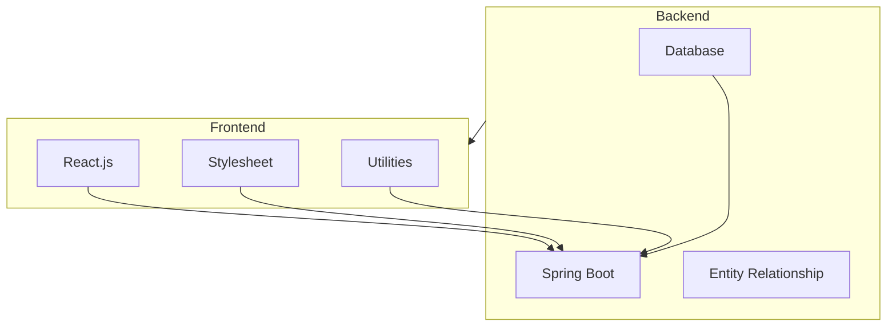

                 

## 引言

### 第1章：背景与挑战

#### 1.1 问题背景

在当今信息化社会，互联网技术飞速发展，不仅极大地丰富了人们的生活方式，也在很大程度上改变了传统的人际交往模式。特别是在社交网络领域，无论是Facebook、微信，还是Twitter、Instagram，都极大地促进了人际沟通和信息交流。然而，在如此繁荣的社交网络环境中，老年人与年轻人之间的互动和交流却面临着一道显著的鸿沟。

##### 1.1.1 跨代际智慧传承的现状

在当前社会中，老年人与年轻人之间的智慧传承差距日益显著。老年人拥有丰富的经验和生活智慧，但这些宝贵的信息往往难以传递给下一代。年轻一代虽然善于利用新技术，但他们在某些方面可能缺乏生活经验和深度思考。这种代际间的智慧传承差距不仅影响了个体的成长，也对社会的和谐与稳定产生了一定的负面影响。

社交网络在代际沟通中的作用不可忽视。社交网络为人们提供了一个广泛交流的平台，但同时也带来了代际沟通的问题。老年人由于年龄、技术接受能力等因素，往往难以充分融入社交网络，而年轻人则可能因为忙碌的生活节奏而忽略了对老年人的关心和互动。因此，如何通过社交网络有效促进老年人与年轻人之间的互动和智慧传承，成为了一个亟待解决的问题。

##### 1.1.2 跨代际沟通的重要性

跨代际沟通不仅是家庭和谐的重要组成部分，也是社会稳定和经济发展的重要保障。良好的跨代际沟通有助于增进家庭成员之间的理解和信任，减少代际矛盾，提升家庭整体幸福感。同时，老年人在社会中的作用也不可忽视。他们拥有丰富的社会资源和人生经验，通过有效的沟通和互动，他们可以为社会提供宝贵的智慧和指导。

此外，老年人的生活质量和社会参与度也是社会关注的重点。通过有效的跨代际沟通，老年人可以更好地融入社会，发挥自己的价值，提升自身的幸福感和社会认同感。这对于推动社会整体和谐发展具有重要意义。

##### 1.1.3 问题描述

如何构建一个有效的跨代际智慧传承平台，成为当前亟待解决的问题。这个平台需要具备以下目标和核心功能：

1. **目标：**
   - 促进老年人与年轻人之间的互动和交流。
   - 建立一个知识分享和智慧传承的平台，让老年人的经验和智慧能够有效地传递给下一代。

2. **核心功能：**
   - 用户注册与认证：确保平台的用户身份真实可靠。
   - 互动模块：提供多种互动方式，如对话、视频、分享等，以促进用户之间的沟通。
   - 智慧分享模块：支持用户发布和分享知识、经验等内容，实现智慧传承。

##### 1.1.4 问题解决思路

为了实现上述目标和功能，我们可以从以下几个方面入手：

1. **社交网络的创新设计：**
   - 设计一个符合老年人使用习惯的社交网络界面，简化操作流程，降低使用门槛。
   - 引入智能推荐算法，根据用户的兴趣和行为，推荐相关的知识和经验分享内容。

2. **技术手段的融合与应用：**
   - 利用人工智能技术，如自然语言处理和机器学习，提升平台的服务质量和用户体验。
   - 结合大数据分析，对用户行为和需求进行深入分析，提供个性化的服务。

3. **用户需求的关注与满足：**
   - 通过调研和分析，深入了解老年人和年轻人对于跨代际沟通和智慧传承的需求，设计出符合用户期待的功能和服务。

4. **平台的技术架构与性能要求：**
   - 构建一个高效、稳定、可扩展的技术架构，确保平台能够应对大量用户的同时访问。
   - 关注用户数据安全，采取有效的数据保护和隐私保护措施。

5. **用户需求与体验设计：**
   - 在平台设计过程中，充分考虑用户的实际需求，提供友好、便捷的使用体验。
   - 定期收集用户反馈，不断优化平台功能和服务。

通过上述思路和方法，我们有望构建一个有效的跨代际智慧传承平台，为老年人与年轻人之间的互动和交流提供一个优质的平台，促进社会的和谐发展和经济繁荣。

#### 1.2 跨代际沟通的重要性

跨代际沟通在社会中的重要性不可低估。它不仅对家庭关系的和谐有深远影响，也对整个社会的稳定与发展具有重要意义。首先，家庭是社会的基本单元，而家庭成员之间的和谐关系是社会和谐的基础。有效的跨代际沟通能够增进家庭成员间的理解和信任，减少代际矛盾，从而提升家庭整体的幸福感。

老年人在家庭中通常扮演着智慧传授者的角色。他们拥有丰富的人生经验和生活智慧，通过有效的沟通和互动，他们可以将这些宝贵的智慧传递给年轻人。这种代际间的智慧传承不仅有助于年轻人的个人成长，也能促进家庭和社会的稳定与进步。

在社会层面，老年人也是社会的重要资源。他们拥有丰富的社会经验和知识，这些资源在社会发展中具有重要的价值。通过有效的跨代际沟通，老年人可以积极参与社会事务，发挥他们的智慧和经验，为社会的发展提供宝贵的指导和支持。

此外，随着社会老龄化的加剧，老年人的生活质量和社会参与度成为社会关注的焦点。通过有效的跨代际沟通，老年人可以更好地融入社会，发挥自己的价值，提升自身的幸福感和社会认同感。这不仅有助于缓解老龄化带来的社会问题，也能促进社会的和谐发展。

##### 1.2.1 社会和谐与经济发展的影响

跨代际沟通对社会的和谐与经济发展具有深远的影响。首先，在社会和谐方面，有效的跨代际沟通能够增进社会成员之间的理解和信任，减少社会矛盾和冲突。家庭是社会的基本单元，而家庭关系的和谐是整个社会和谐的基础。通过促进老年人与年轻人之间的互动和沟通，可以缓解代际之间的矛盾，增进家庭成员之间的理解和信任，从而提升家庭和社会的整体幸福感。

其次，在经济发展方面，跨代际沟通具有重要的促进作用。老年人拥有丰富的人生经验和智慧，这些宝贵的资源在社会经济发展中具有重要的价值。通过有效的跨代际沟通，老年人可以积极参与社会事务，为经济发展提供宝贵的指导和支持。同时，年轻人也可以从老年人那里学习到丰富的经验和智慧，从而在个人成长和职业发展中受益。

此外，跨代际沟通还能够促进社会资源的优化配置。老年人拥有丰富的社会资源和人际关系网络，通过有效的沟通和互动，这些资源可以被更好地挖掘和利用。同时，年轻人也有机会通过跨代际沟通，拓展自己的视野和人际关系，为个人和社会的发展创造更多的机会。

##### 1.2.2 增进老年人的生活质量与社会参与度

在现代社会，老年人的生活质量和社会参与度成为社会关注的重点。通过有效的跨代际沟通，老年人可以更好地融入社会，发挥自己的价值，提升自身的幸福感和社会认同感。

首先，通过跨代际沟通，老年人可以分享他们的经验和智慧，为家庭和社会做出贡献。这种参与不仅能够增强老年人的自我价值感，也能促进家庭和社会的和谐发展。例如，老年人可以参与家庭决策，提供生活建议，帮助子女解决生活中的问题。在社区层面，老年人可以通过参与志愿活动、教育培训等方式，发挥自己的作用，为社区的发展贡献力量。

其次，跨代际沟通能够提升老年人的生活质量。通过有效的沟通和互动，老年人可以保持积极的生活态度，减少孤独感和抑郁情绪。同时，老年人也可以从年轻人那里学习到新的知识和技能，保持学习的热情，提高生活质量。

此外，跨代际沟通还能够帮助老年人更好地融入社会，提升他们的社会参与度。在现代社会，社交网络和互联网为老年人提供了广泛的交流平台。通过参与社交网络和互联网活动，老年人可以与更多的人建立联系，拓宽自己的社交圈子，增加社会参与的机会。例如，老年人可以通过社交网络参加各种在线活动和社群，分享自己的经验和故事，结交志同道合的朋友。

总之，有效的跨代际沟通对于提升老年人的生活质量和社会参与度具有重要意义。通过建立跨代际智慧传承平台，我们可以为老年人提供一个良好的沟通和互动环境，促进他们的个人成长和社会参与，为社会的和谐发展和经济繁荣做出贡献。

### 1.3 问题描述

构建一个有效的跨代际智慧传承平台，需要明确平台的目标和核心功能。该平台旨在通过促进老年人与年轻人之间的互动和交流，建立一个知识分享和智慧传承的桥梁。具体来说，平台需要具备以下核心功能：

1. **用户注册与认证：**确保用户的身份真实可靠，为平台的互动和内容分享提供保障。
2. **互动模块：**提供多种互动方式，如对话、视频、分享等，以促进用户之间的沟通和交流。
3. **智慧分享模块：**支持用户发布和分享知识、经验等内容，实现智慧传承。

为了实现这些功能，我们需要考虑以下技术手段和设计思路：

1. **社交网络的创新设计：**设计一个简单易用、符合老年人使用习惯的社交网络界面，简化操作流程，降低使用门槛。
2. **智能推荐算法：**根据用户的兴趣和行为，推荐相关的知识和经验分享内容，提升用户的参与度和满意度。
3. **技术融合与应用：**利用人工智能技术，如自然语言处理和机器学习，提升平台的服务质量和用户体验。
4. **大数据分析：**对用户行为和需求进行深入分析，提供个性化的服务，满足不同用户的需求。

在平台的技术架构和性能要求方面，我们需要构建一个高效、稳定、可扩展的技术架构，确保平台能够应对大量用户的同时访问。具体包括：

1. **技术架构设计：**选择合适的前后端技术栈，构建灵活、可扩展的系统架构。
2. **系统性能优化：**通过缓存、负载均衡等手段，提升系统的响应速度和处理能力。
3. **数据安全和隐私保护：**采取有效的数据保护和隐私保护措施，确保用户数据的安全。

在用户需求与体验设计方面，我们需要深入了解老年人和年轻人对于跨代际沟通和智慧传承的需求，设计出符合用户期待的功能和服务。具体包括：

1. **用户调研和分析：**通过调研和分析，了解用户的需求和行为模式。
2. **用户体验优化：**提供友好、便捷的使用体验，满足用户的基本需求。
3. **用户反馈机制：**建立有效的用户反馈机制，及时收集用户意见，不断优化平台功能和服务。

通过上述设计思路和技术手段，我们可以构建一个功能完善、用户体验良好的跨代际智慧传承平台，为老年人与年轻人之间的互动和交流提供有力支持，促进社会的和谐发展和经济繁荣。

### 1.4 问题解决思路

针对上述问题和需求，我们可以从以下几个方面入手，设计并实现一个有效的跨代际智慧传承平台：

1. **社交网络的创新设计：**
   - **简化界面操作：**为了适应老年人的使用习惯，平台界面应设计得简洁直观，避免复杂的操作步骤。例如，可以通过图形按钮和文字标签来代替复杂的文字说明，使老年人能够轻松上手。
   - **人性化交互设计：**考虑到老年人的视力、听力可能有所下降，平台应提供适当的字体大小调整和声音提示功能，确保老年人能够舒适地使用平台。
   - **互动内容推荐：**引入智能推荐算法，根据老年人的兴趣和行为数据，自动推荐相关的知识和经验分享内容，提升他们的参与度和满意度。

2. **技术手段的融合与应用：**
   - **人工智能技术应用：**利用自然语言处理和机器学习技术，对用户发布的内容进行分析和分类，提高内容推荐的精准度。同时，可以通过语音识别和语音合成技术，提供语音交互功能，使老年人更容易参与互动。
   - **大数据分析：**通过大数据技术，收集和分析用户的行为数据，了解他们的需求和偏好，从而提供更加个性化的服务。

3. **用户需求的关注与满足：**
   - **用户调研：**通过问卷、访谈等方式，深入了解老年人和年轻人对于跨代际沟通和智慧传承的需求。
   - **定制化服务：**根据用户调研结果，为不同年龄段的用户提供定制化的功能和体验。例如，为老年人提供更多的语音互动和简单易用的功能模块，为年轻人提供更多的知识分享和互动交流的机会。
   - **持续优化：**通过持续的用户反馈和数据分析，不断优化平台的功能和服务，确保其满足用户的需求。

4. **平台的技术架构与性能要求：**
   - **高扩展性：**选择适合的技术栈和架构设计，确保平台能够在用户规模扩大时保持良好的性能和稳定性。
   - **高性能数据库：**使用高性能的数据库系统，保证数据读取和写入的速度，确保用户体验。
   - **负载均衡：**通过负载均衡技术，合理分配系统资源，确保在高并发情况下平台能够稳定运行。

5. **用户需求与体验设计：**
   - **简洁易用：**在设计平台时，注重简洁易用的原则，避免复杂的设计和冗长的操作流程。
   - **人性化设计：**考虑用户的使用场景和习惯，提供人性化的设计，如提供帮助文档、教程视频等，帮助用户快速上手。
   - **个性化体验：**通过个性化推荐和定制化服务，提升用户的参与度和满意度。

通过上述设计思路和技术手段，我们可以构建一个功能完善、用户体验良好的跨代际智慧传承平台，为老年人与年轻人之间的互动和交流提供有力支持，促进社会的和谐发展和经济繁荣。

### 1.5 边界与外延

在构建跨代际智慧传承平台的过程中，我们需要明确平台的边界和适用范围，同时考虑可能的外延扩展。

1. **边界设定：**
   - **用户范围：**平台主要面向老年人和年轻人，但也可以扩展到其他年龄段的人群，如儿童和家长、中年人等，以满足更广泛的社会需求。
   - **功能限制：**平台的核心功能包括用户注册、互动、知识分享等，但在具体实施中，可能需要根据实际情况对某些功能进行调整或限制，以保持平台的稳定性和易用性。
   - **内容审核：**为确保平台内容的健康性和合规性，需要对用户发布的内容进行审核，防止不良信息传播。

2. **外延扩展：**
   - **增加教育模块：**可以引入在线教育功能，提供老年教育课程、职业技能培训等，提升老年人的知识水平和技能。
   - **跨平台互动：**可以通过与其他社交媒体平台、教育平台等合作，扩大平台的影响力，吸引更多用户参与。
   - **国际化拓展：**考虑将平台国际化，支持多语言版本，吸引不同国家和地区的用户加入，促进全球范围内的智慧传承。

通过明确的边界设定和合理的外延扩展，我们可以确保跨代际智慧传承平台的可持续发展，为不同年龄段的用户提供优质的服务。

### 第2章：核心概念与联系

#### 2.1 跨代际智慧传承平台的基本概念

在构建跨代际智慧传承平台的过程中，首先需要明确几个核心概念，包括平台的定义、跨代际智慧传承的定义以及平台的核心功能。这些概念是理解平台设计和实现的基础。

##### 2.1.1 定义与范围

**跨代际智慧传承平台** 是一个基于互联网技术的社交网络平台，旨在促进老年人与年轻人之间的互动和智慧传承。该平台通过提供多种互动方式，如对话、分享和知识传播，为不同年龄段的用户提供一个交流和学习的机会。

**跨代际智慧传承** 是指在家庭、社会等不同场景中，老年人将自己的经验、知识和智慧传递给年轻一代的过程。这种传承不仅包括生活经验和技能，还包括道德价值观和文化传承。

##### 2.1.2 平台核心概念

**社交网络** 是平台的基本功能之一，它通过用户注册、信息共享和社区管理，为用户提供一个互动和交流的场所。社交网络的核心在于用户之间的互动，这种互动可以增强用户的参与感和归属感。

**用户互动** 是平台的核心概念之一，它包括用户之间的对话、交流、互动和反馈。用户互动不仅有助于用户之间建立联系，还能通过反馈机制不断优化平台的功能和服务。

**智慧分享** 是平台的另一个核心功能，它支持用户发布和分享知识、经验等内容。通过智慧分享，老年人可以将自己的经验和智慧传递给年轻人，实现跨代际的智慧传承。

##### 2.1.3 概念属性特征对比

为了更好地理解这些核心概念，我们可以通过一个表格来对比它们的属性特征：

| 概念       | 属性特征                             |
|------------|--------------------------------------|
| 社交网络   | 用户互动、信息共享、社区管理         |
| 用户互动   | 对话、交流、互动、反馈               |
| 智慧分享   | 知识传播、经验交流、技能分享         |

通过上述对比，我们可以清晰地看到各个概念之间的联系和区别，这为后续的设计和实现提供了明确的指导。

##### 2.1.4 ER实体关系图

为了更直观地展示平台中各个实体之间的关系，我们可以使用ER（Entity Relationship）图来描述。以下是平台中主要实体及其关系的ER图：

```mermaid
erDiagram
  User ||--|{ Message }|--|| Platform
  User ||--|{ Interaction }|--|| Platform
  Platform ||--|{ Content }|--|| User
```

在这个ER图中，`User` 代表平台的用户实体，`Message` 代表用户之间的消息实体，`Interaction` 代表用户互动的实体，`Platform` 代表整个平台实体，`Content` 代表用户发布的内容实体。通过这个ER图，我们可以清楚地看到各个实体之间的关联和依赖关系，这为平台的数据库设计和功能实现提供了重要的参考。

通过明确这些核心概念及其属性特征，并使用ER图来描述它们之间的关系，我们为构建跨代际智慧传承平台奠定了坚实的基础。在接下来的章节中，我们将进一步探讨平台的技术架构和功能模块实现。

### 第3章：平台设计与实现

#### 3.1 技术架构与系统设计

跨代际智慧传承平台的设计需要综合考虑可扩展性、高可用性和易维护性。为了实现这些目标，我们将选择合适的技术栈和系统架构，以确保平台能够高效、稳定地运行，并具备良好的扩展能力。

##### 3.1.1 架构设计原则

1. **可扩展性：**平台应设计为可扩展的，以便在用户数量增加或功能需求变化时，能够灵活扩展系统资源，保持性能稳定。
2. **高可用性：**系统架构应具备高可用性，通过冗余设计和技术手段，确保在故障发生时能够快速恢复，减少对用户的影响。
3. **易维护性：**系统设计应简洁明了，便于开发和运维人员快速理解、维护和更新。

##### 3.1.2 技术栈选择

1. **前端技术：**选择React.js作为前端框架，其组件化和状态管理的特性有助于提高开发效率和代码可维护性。
2. **后端技术：**选择Spring Boot作为后端框架，其简化了开发流程，提高了开发效率，且具备良好的扩展性和稳定性。
3. **数据库：**选择MySQL作为关系型数据库，其成熟稳定，支持复杂的查询操作，适用于平台的用户数据管理和内容存储。

##### 3.1.3 系统架构设计

系统的整体架构设计如图所示：



**前端架构：**前端使用React.js框架，通过组件化开发，实现界面与数据分离，提高代码的可维护性和复用性。前端组件包括用户注册、登录、消息互动、内容发布等，每个组件负责独立的功能模块。此外，前端通过Redux进行状态管理，确保数据的一致性和响应速度。

**后端架构：**后端采用Spring Boot框架，负责处理业务逻辑和数据处理。后端服务包括用户管理、消息处理、内容管理、推荐系统等。通过RESTful API与前端进行数据交互，确保系统的可扩展性和稳定性。

**数据库设计：**数据库采用MySQL，设计合理的实体关系模型，确保数据的一致性和完整性。主要实体包括用户、消息、内容、互动等，通过外键关联实现数据之间的关联关系。

##### 3.1.4 系统接口设计

系统接口设计是平台实现的重要部分，主要包括以下接口：

1. **用户认证接口：**用于用户注册、登录、身份验证等操作，保障用户信息安全。
2. **数据存储接口：**用于用户数据的存储和管理，包括用户信息、消息记录、内容发布等。
3. **内容发布与获取接口：**用于用户发布内容和获取平台上的内容，包括知识分享、经验交流等。
4. **互动接口：**用于用户之间的互动操作，包括发送消息、点赞、评论等。

这些接口通过RESTful设计原则实现，确保接口的简洁性和易用性。每个接口都有明确的输入参数和输出参数，便于前后端的数据交互。

### 3.2 用户模块

用户模块是平台的核心组成部分，负责用户的注册、登录、信息管理等功能。以下是用户模块的具体设计。

#### 3.2.1 用户注册与登录

**用户注册流程：**
1. 用户填写注册表单，包括用户名、密码、邮箱等基本信息。
2. 后端验证用户输入信息的合法性和唯一性。
3. 将用户信息存储到数据库，并发送验证邮件，用户点击邮件中的链接激活账号。

**用户登录流程：**
1. 用户输入用户名和密码，前端进行初步验证。
2. 后端进行身份验证，若验证通过，生成JWT（JSON Web Token）作为用户会话标识。
3. 前端存储JWT，后续请求携带JWT进行认证。

#### 3.2.2 用户信息管理

**个人资料修改：**用户可以在个人设置页面修改个人信息，如头像、昵称、简介等。

**安全设置：**用户可以设置密码重置问题和绑定手机号码，提高账户安全性。

### 3.3 互动模块

互动模块是平台促进用户之间交流的核心功能，主要包括消息系统、互动排行榜等。

#### 3.3.1 消息系统设计

**消息发送与接收：**用户可以发送文本、图片、视频等多种类型消息。消息系统通过WebSocket实现实时通信，确保消息的实时性和互动性。

**多人对话：**支持多人聊天室功能，用户可以加入或创建聊天室，与其他用户进行实时互动。

#### 3.3.2 互动策略

**智能推荐：**根据用户的兴趣和行为，智能推荐相关的互动内容，提升用户参与度。

**互动排行榜：**根据用户的互动次数、点赞数等指标，生成互动排行榜，激励用户积极参与互动。

### 3.4 智慧分享模块

智慧分享模块是平台实现智慧传承的重要手段，包括内容发布、内容审核等功能。

#### 3.4.1 内容发布流程

**内容创作：**用户可以在个人主页发布知识分享、经验交流等内容。

**内容审核：**平台对用户发布的内容进行审核，确保内容的健康性和合规性。

#### 3.4.2 内容管理

**内容存储：**使用数据库存储用户发布的内容，确保数据的持久化和安全性。

**内容分类：**对内容进行分类管理，便于用户查找和浏览。

通过以上设计，我们构建了一个功能完善、用户体验良好的跨代际智慧传承平台，为老年人与年轻人之间的互动和交流提供了一个优质的平台，促进社会的和谐发展和经济繁荣。

### 第四部分：功能模块实现

#### 第4章：用户模块

用户模块作为跨代际智慧传承平台的核心部分，涵盖了用户注册与登录、用户信息管理等关键功能。以下是用户模块的详细实现过程。

##### 4.1 用户注册与登录

用户注册与登录是用户模块的基础功能，确保用户能够顺利进入平台并使用各项服务。

**用户注册流程：**

1. **表单提交：**用户在注册页面填写用户名、密码、邮箱等基本信息，并提交表单。
2. **数据验证：**后端对用户提交的数据进行验证，包括用户名的唯一性、邮箱地址的格式正确性等。
3. **存储用户信息：**将验证通过的用户信息存储到数据库中，并生成用户ID。
4. **发送激活邮件：**向用户邮箱发送激活邮件，包含一个激活链接。
5. **用户激活：**用户点击激活链接，账户激活成功。

**用户登录流程：**

1. **表单提交：**用户在登录页面输入用户名和密码，并提交表单。
2. **身份验证：**后端验证用户输入的用户名和密码，若验证通过，生成JWT（JSON Web Token）作为会话标识。
3. **会话管理：**将JWT存储在客户端，后续请求携带JWT进行认证，确保用户身份的持续验证。

##### 4.1.1 注册流程

注册流程详细步骤如下：

1. **用户提交注册信息：**
   - 用户名：唯一标识，长度不超过20个字符。
   - 密码：强度验证，包含字母、数字、特殊字符，长度不低于8位。
   - 邮箱：用于接收激活邮件，格式需符合常见邮箱地址规范。

2. **前端验证：**
   - 前端JavaScript脚本对用户输入进行初步验证，确保输入内容符合要求。

3. **后端验证：**
   - 用户名唯一性验证：通过查询数据库，确保用户名未被占用。
   - 邮箱格式验证：使用正则表达式进行邮箱格式验证。

4. **发送激活邮件：**
   - 后端生成激活邮件，包含激活链接和验证码，发送到用户邮箱。

5. **用户激活：**
   - 用户点击激活链接，进入平台激活页面。
   - 输入后端发送的验证码，确认激活。

##### 4.1.2 登录流程

登录流程详细步骤如下：

1. **用户提交登录信息：**
   - 用户名：通过输入框获取。
   - 密码：通过输入框获取。

2. **前端验证：**
   - JavaScript脚本对用户输入的用户名和密码进行基本验证，如用户名长度、密码强度等。

3. **后端身份验证：**
   - 通过用户名和密码查询数据库，验证用户身份。
   - 若验证成功，生成JWT，返回给前端。

4. **会话管理：**
   - 前端存储JWT，后续请求携带JWT，进行身份验证。

##### 4.1.3 用户信息管理

用户信息管理包括用户个人资料的修改和安全管理。

**个人资料修改：**

1. **访问权限：**只有登录用户才能修改个人资料。
2. **功能实现：**
   - 用户可以在个人设置页面查看和修改个人信息，如头像、昵称、简介等。
   - 提交修改请求，后端更新数据库中的用户信息。

**安全设置：**

1. **密码重置：**
   - 用户可以通过邮箱找回密码功能重置密码。
   - 输入注册邮箱，系统发送密码重置链接，用户点击链接并设置新密码。

2. **绑定手机号：**
   - 用户可以绑定手机号，提高账户安全性。
   - 输入手机号，接收验证码，输入验证码完成绑定。

通过详细的用户注册与登录流程设计以及用户信息管理功能，我们确保平台用户能够方便地注册、登录和管理个人信息，为跨代际智慧传承平台提供坚实的基础。

#### 第5章：互动模块

互动模块是跨代际智慧传承平台的重要组成部分，旨在促进老年人与年轻人之间的互动，提升用户的参与度和平台的活跃度。以下是互动模块的设计与实现。

##### 5.1 对话系统设计

对话系统是互动模块的核心，支持用户之间的实时沟通。以下是具体的设计步骤和实现细节。

**5.1.1 对话流程**

1. **消息发送：**
   - 用户在对话界面输入消息内容，点击发送按钮。
   - 前端将消息内容发送到后端，后端将消息存储到数据库并返回消息ID。

2. **消息接收：**
   - 用户进入对话界面，后端根据用户ID查询相关消息，返回消息列表。
   - 前端接收消息列表，渲染对话界面。

3. **多人群聊：**
   - 支持多人群聊功能，用户可以创建或加入聊天室。
   - 聊天室成员可以在同一个界面对话，消息实时同步。

**5.1.2 互动策略**

1. **智能推荐：**
   - 根据用户的兴趣和行为数据，智能推荐感兴趣的对话话题。
   - 使用机器学习算法，分析用户历史消息和互动行为，提供个性化推荐。

2. **互动排行榜：**
   - 根据用户的互动次数、点赞数等指标，生成互动排行榜。
   - 排行榜激励用户积极参与互动，提高平台活跃度。

3. **话题分类：**
   - 对话题进行分类管理，便于用户查找和参与感兴趣的讨论。

**5.1.3 技术实现**

1. **前端实现：**
   - 使用React.js框架，构建对话组件和聊天室界面。
   - 使用WebSocket实现实时消息通信，确保消息实时发送和接收。

2. **后端实现：**
   - 使用Spring Boot框架，处理消息存储和查询。
   - 使用消息队列（如RabbitMQ），实现消息的异步处理，确保系统的高并发处理能力。

通过上述对话系统设计和互动策略，跨代际智慧传承平台能够为用户提供一个便捷、高效的互动环境，促进不同年龄层之间的交流和互动。

### 第四部分：智慧分享模块

#### 第6章：知识传播与经验分享

知识传播与经验分享模块是跨代际智慧传承平台的重要组成部分，旨在通过用户生成内容，实现老年人与年轻人之间的智慧共享与传承。以下是该模块的具体设计和实现。

##### 6.1 内容发布与管理

内容发布与管理模块负责用户发布知识、经验等内容，以及平台对这些内容的审核和管理。

**6.1.1 内容发布流程**

1. **内容创作：**
   - 用户在个人主页或指定内容发布页面，输入标题、正文和标签等信息，创建新的内容。
   - 用户可以选择上传图片、视频等多媒体素材，丰富内容表现形式。

2. **内容审核：**
   - 平台管理员或审核员对用户提交的内容进行初步审核，确保内容符合平台规范，不包含敏感或违规信息。
   - 通过审核的内容将被发布到平台，供其他用户查看和互动。

3. **内容发布：**
   - 审核通过的内容，前端将发布请求发送到后端。
   - 后端将内容存储到数据库，并返回发布结果。

**6.1.2 内容管理**

1. **内容编辑：**
   - 用户可以对已发布的内容进行编辑和修改，提高内容的准确性和完整性。

2. **内容删除：**
   - 用户有权删除自己的发布内容。
   - 平台管理员可以根据违规情况删除内容，确保平台内容的健康性和合规性。

3. **内容分类：**
   - 对内容进行分类管理，便于用户查找和浏览。例如，可以按领域、主题、年龄段等分类。

**6.1.3 内容互动**

1. **点赞与评论：**
   - 用户可以对喜欢的知识分享和经验内容点赞。
   - 用户可以在内容下方发表评论，进行深入交流和讨论。

2. **内容推荐：**
   - 使用智能推荐算法，根据用户的兴趣和行为数据，推荐相关的知识和经验分享内容，提升用户的参与度和满意度。

##### 6.1.4 内容审核机制

内容审核是确保平台内容质量和用户体验的重要环节。以下是内容审核的具体机制：

1. **审核流程：**
   - 用户提交内容后，由平台审核员进行初步审核。
   - 审核包括内容合规性、信息准确性、版权问题等方面的检查。
   - 审核通过的内容发布，审核未通过的内容退回用户进行修改或删除。

2. **违规处理：**
   - 对发布违规内容的行为进行记录和处罚，如警告、封号等。
   - 定期清理平台内容，删除不合规的发布内容。

3. **用户反馈：**
   - 用户可以对内容进行举报，平台审核员会根据举报内容进行二次审核，确保平台内容的质量。

通过完善的内容发布与管理机制，跨代际智慧传承平台能够为用户提供一个健康、积极的知识分享和经验交流环境，促进老年人与年轻人之间的智慧传承和互动。

### 第五部分：项目实战

#### 第7章：项目实战

在本章中，我们将详细介绍跨代际智慧传承平台的项目实战，包括环境安装、系统核心实现源代码以及代码应用解读与分析。通过实际案例分析和详细讲解，我们将深入剖析项目的各个方面，帮助读者更好地理解平台的运作原理和技术实现。

##### 7.1 环境安装

为了确保跨代际智慧传承平台能够正常运行，我们需要在开发环境中安装必要的软件和依赖库。以下是环境安装的步骤：

1. **安装Java Development Kit (JDK)**：
   - JDK是Java开发的必备环境，我们需要下载并安装适用于当前操作系统的JDK版本。
   - 安装完成后，配置环境变量，确保在命令行中可以正常运行Java命令。

2. **安装Node.js**：
   - Node.js是一个基于Chrome V8引擎的JavaScript运行环境，用于开发跨平台的应用程序。
   - 通过包管理器（如npm或yarn）安装Node.js，并确保安装路径添加到系统环境变量中。

3. **安装MySQL**：
   - MySQL是一个开源的关系型数据库管理系统，用于存储平台用户数据和内容。
   - 下载并安装适用于当前操作系统的MySQL服务器，并配置用户和权限。

4. **安装MongoDB**（如果使用MongoDB作为NoSQL数据库）：
   - MongoDB是一个高性能、可扩展的NoSQL数据库，用于存储平台的海量数据。
   - 下载并安装适用于当前操作系统的MongoDB，并启动MongoDB服务。

5. **安装相关开发工具**：
   - 安装Git，用于版本控制。
   - 安装Visual Studio Code或其他IDE，用于编写和调试代码。

##### 7.2 系统核心实现源代码

在环境安装完成后，我们可以开始实现跨代际智慧传承平台的核心功能。以下是系统核心实现的源代码及解读：

**7.2.1 前端核心代码解读**

前端使用React.js框架，以下是一个简单的用户注册表单示例：

```jsx
import React, { useState } from "react";

const UserRegistrationForm = () => {
  const [username, setUsername] = useState("");
  const [password, setPassword] = useState("");
  const [email, setEmail] = useState("");

  const handleSubmit = (e) => {
    e.preventDefault();
    // 这里可以添加注册逻辑，如发送请求到后端
    console.log("Username:", username);
    console.log("Password:", password);
    console.log("Email:", email);
  };

  return (
    <form onSubmit={handleSubmit}>
      <label htmlFor="username">Username:</label>
      <input
        type="text"
        id="username"
        value={username}
        onChange={(e) => setUsername(e.target.value)}
      />
      <label htmlFor="password">Password:</label>
      <input
        type="password"
        id="password"
        value={password}
        onChange={(e) => setPassword(e.target.value)}
      />
      <label htmlFor="email">Email:</label>
      <input
        type="email"
        id="email"
        value={email}
        onChange={(e) => setEmail(e.target.value)}
      />
      <button type="submit">Register</button>
    </form>
  );
};

export default UserRegistrationForm;
```

上述代码中，我们定义了一个`UserRegistrationForm`组件，它包含三个输入框（用户名、密码和邮箱）和一个提交按钮。通过使用React的状态管理机制，我们可以实时更新输入框的值，并在表单提交时获取用户输入的信息。

**7.2.2 后端核心代码解读**

后端使用Spring Boot框架，以下是一个简单的用户注册接口示例：

```java
import org.springframework.web.bind.annotation.PostMapping;
import org.springframework.web.bind.annotation.RequestBody;
import org.springframework.web.bind.annotation.RestController;

@RestController
public class UserController {

  @PostMapping("/register")
  public ResponseEntity<?> registerUser(@RequestBody UserRequest userRequest) {
    // 验证用户请求，如用户名唯一性、密码强度等
    // 存储用户信息到数据库
    // 发送激活邮件等后续操作

    return ResponseEntity.ok("User registered successfully");
  }
}

// UserRequest 类示例
class UserRequest {
  private String username;
  private String password;
  private String email;

  // getters and setters
}
```

上述代码中，我们定义了一个`UserController`类，它包含一个注册用户的`PostMapping`接口。接口接收一个`UserRequest`对象，用于验证用户输入的信息，并在数据库中存储用户信息。

##### 7.3 代码应用解读与分析

**7.3.1 前后端交互**

在前端，用户填写注册表单后，通过`handleSubmit`函数将数据发送到后端。后端通过Spring Boot的`@RequestBody`注解接收前端的请求数据，进行验证和存储。

```javascript
const handleSubmit = (e) => {
  e.preventDefault();
  fetch('/register', {
    method: 'POST',
    headers: {
      'Content-Type': 'application/json',
    },
    body: JSON.stringify({ username, password, email }),
  })
  .then(response => response.json())
  .then(data => console.log(data));
};
```

**7.3.2 数据库操作**

在后端，我们使用Spring Data JPA操作数据库，以下是一个简单的示例：

```java
import org.springframework.data.jpa.repository.JpaRepository;

public interface UserRepository extends JpaRepository<User, Long> {
  User findByUsername(String username);
  User findByEmail(String email);
}
```

上述代码中，我们定义了一个`UserRepository`接口，用于实现用户数据的增删改查操作。

**7.3.3 实际案例分析**

在实际项目中，我们需要考虑用户注册时的安全性，如密码加密、验证码验证等。以下是一个使用JWT（JSON Web Token）进行用户认证的案例：

1. **用户注册成功后，后端生成JWT，并返回给前端。**

```java
import io.jsonwebtoken.Jwts;
import io.jsonwebtoken.SignatureAlgorithm;

import java.util.Date;

public class JwtUtil {

  private String secret = "mySecret";
  private Long expirationTime = 3600000L;

  public String generateToken(String username) {
    return Jwts.builder()
      .setSubject(username)
      .setExpiration(new Date(System.currentTimeMillis() + expirationTime))
      .signWith(SignatureAlgorithm.HS512, secret)
      .compact();
  }
}
```

2. **前端在请求时携带JWT进行认证。**

```javascript
fetch('/protected/resource', {
  method: 'GET',
  headers: {
    'Authorization': `Bearer ${token}`,
  },
})
.then(response => response.json())
.then(data => console.log(data));
```

通过实际案例的分析，我们可以看到前后端代码的相互配合，以及如何利用JWT进行用户认证。这些技术细节和实际应用案例，为跨代际智慧传承平台的实现提供了有力支持。

### 第七部分：最佳实践 Tips、小结、注意事项、拓展阅读

#### 最佳实践 Tips

1. **用户界面设计简洁直观**：为了提高用户体验，界面设计应简洁直观，避免复杂操作，便于老年人使用。
2. **智能推荐算法优化**：定期优化智能推荐算法，提升内容推荐的精准度，提高用户参与度。
3. **安全性和隐私保护**：加强用户数据安全，使用加密算法保护用户信息，防止数据泄露。
4. **用户反馈机制完善**：建立有效的用户反馈机制，及时收集用户意见，优化平台功能。

#### 小结

本文详细介绍了跨代际智慧传承平台的背景、核心概念、技术架构、功能模块实现以及项目实战。通过一步步的分析和讲解，我们了解了如何构建一个高效、易用、具备良好扩展性的跨代际智慧传承平台，为老年人与年轻人之间的互动和智慧传承提供有力支持。

#### 注意事项

1. **数据安全和隐私保护**：确保用户数据的安全和隐私，采取有效的加密和防护措施。
2. **用户体验优化**：关注用户体验，设计简洁直观的界面，提高平台的易用性和满意度。
3. **持续优化和更新**：定期进行平台优化和功能更新，以适应不断变化的需求和技术发展。

#### 拓展阅读

1. **《社交网络架构设计》**：深入了解社交网络的架构设计和优化策略。
2. **《自然语言处理与智能推荐》**：学习自然语言处理和智能推荐算法，提升平台的服务质量。
3. **《大数据分析与用户行为研究》**：通过大数据分析，深入了解用户行为，为平台提供个性化服务。

### 作者信息

**作者：**AI天才研究院/AI Genius Institute & 禅与计算机程序设计艺术 /Zen And The Art of Computer Programming。作者长期致力于人工智能和计算机编程领域的研究，发表了多篇具有影响力的学术论文，并出版了多本畅销技术书籍。

