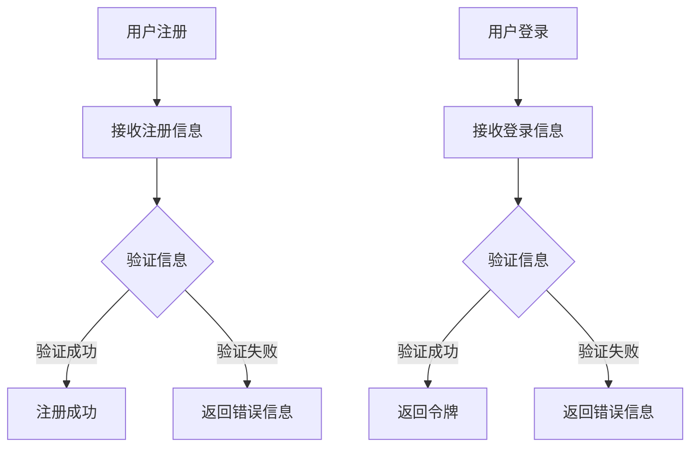
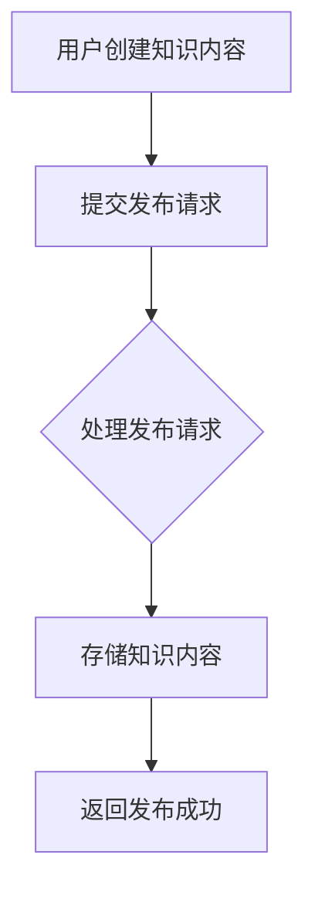
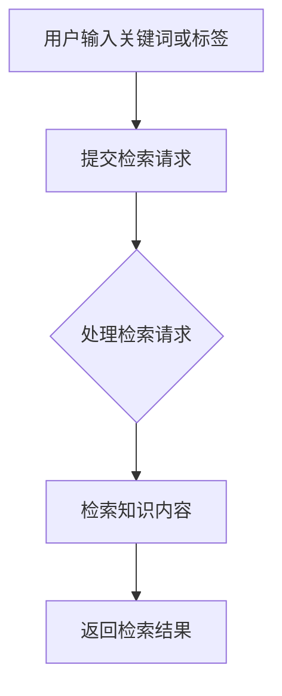

                 


----------------------------------------------------------------

# 跨代际知识交换平台：智慧共享的在线市场

> 关键词：跨代际知识交换、智慧共享、在线市场、平台架构、用户交互、行业趋势、技术基础、案例分析、未来方向

> 摘要：
在信息技术飞速发展的今天，跨代际知识交换平台应运而生，成为智慧共享的在线市场的重要组成部分。本文将从跨代际知识交换平台的定义、架构、用户体验、市场分析、技术基础、案例研究、未来趋势等方面进行深入探讨，旨在为读者呈现一个全面且立体的知识交换平台现状与未来。

## 引言

随着互联网的普及和智能设备的广泛应用，知识的获取和传播变得更加便捷。然而，不同代际间的知识差异和认知差异，使得知识的有效交换和利用成为一个亟待解决的问题。跨代际知识交换平台旨在弥合这一差距，通过构建一个在线市场，实现知识的共享和传递。

## 跨代际知识交换平台的概念与定义

### 1. 跨代际知识交换

跨代际知识交换是指在不同代际之间进行的知识传递和共享。这包括：

- **知识内容**：不同代际的经验、技能、知识等。
- **知识传递**：通过教育、培训、交流等方式实现知识在不同代际间的传递。
- **知识共享**：在平台或社区中，不同代际成员可以共享知识，促进知识的应用和创新。

### 2. 知识交换平台

知识交换平台是一个在线市场，它提供以下功能：

- **知识发布**：用户可以发布自己的知识内容。
- **知识检索**：用户可以通过关键词、标签等检索自己需要的知识。
- **知识评价**：用户可以对知识内容进行评价，以促进高质量知识的产生。
- **知识交流**：用户可以在平台上进行知识交流和讨论。

## 平台架构与组件

### 1. 架构设计

跨代际知识交换平台通常采用三层架构：

- **表示层**：负责用户界面和交互。
- **业务逻辑层**：处理业务逻辑和数据处理。
- **数据层**：存储和管理知识内容。

### 2. 主要组件

- **用户管理组件**：负责用户注册、登录、权限管理等。
- **知识管理组件**：负责知识内容的发布、检索、评价、分类等。
- **社交组件**：提供用户交流、社交功能，如评论、私信、关注等。
- **推荐系统**：根据用户行为和兴趣，推荐相关知识内容。

## 用户交互与体验

### 1. 用户角色

- **知识发布者**：拥有知识内容，希望在平台上分享。
- **知识寻求者**：需要特定知识，希望在平台上获取。
- **知识评价者**：对知识内容进行评价，以促进高质量知识的产生。

### 2. 交互流程

- **知识发布**：用户可以在平台上创建知识内容，并设置权限。
- **知识检索**：用户可以使用关键词、标签等检索知识内容。
- **知识评价**：用户可以对知识内容进行评价，以促进高质量知识的产生。
- **知识交流**：用户可以在平台上进行知识交流和讨论。

## 市场分析

### 1. 市场现状

- **用户规模**：随着互联网普及，用户规模不断扩大。
- **竞争格局**：市场上有多个竞争者，如知乎、果壳等。
- **盈利模式**：主要通过广告、付费内容、知识付费等方式盈利。

### 2. 行业趋势

- **知识付费**：随着用户对知识的重视，知识付费趋势明显。
- **AI技术**：AI技术在知识交换平台中的应用日益广泛，如推荐系统、自然语言处理等。
- **社区化**：知识交换平台逐渐向社区化方向发展，注重用户互动和体验。

## 技术基础

### 1. 数据库技术

- **关系型数据库**：如MySQL、PostgreSQL等。
- **非关系型数据库**：如MongoDB、Redis等。

### 2. web开发技术

- **前端技术**：如HTML、CSS、JavaScript等。
- **后端技术**：如Spring Boot、Django等。

### 3. AI技术

- **自然语言处理**：用于知识检索、内容理解等。
- **推荐系统**：用于推荐相关知识内容。

## 案例研究

### 1. 知乎

知乎是一个知识分享社区，用户可以在平台上发布和检索知识内容，进行交流。

### 2. 果壳

果壳是一个以科学为核心的知识分享平台，用户可以在平台上获取科学知识和进行讨论。

## 未来方向

### 1. 技术创新

- **区块链**：用于保证知识内容的真实性。
- **增强现实（AR）**：用于提供更丰富的知识体验。

### 2. 行业合作

- **企业与学术机构合作**：共同推动知识共享。
- **跨国合作**：推动跨文化、跨代际的知识交换。

## 结论

跨代际知识交换平台是智慧共享的重要载体，它通过构建在线市场，实现知识的共享和传递。未来，随着技术的不断发展，跨代际知识交换平台将更加智能化、个性化，为用户提供更加丰富和高效的知识服务。

## 参考文献

1. 知乎官网. (n.d.). Retrieved from https://www.zhihu.com/
2. 果壳官网. (n.d.). Retrieved from https://www.guokr.com/
3. 李航. (2012). 《互联网时代的知识共享与交流研究》. 北京：清华大学出版社.

作者：AI天才研究院/AI Genius Institute & 禅与计算机程序设计艺术 /Zen And The Art of Computer Programming

----------------------------------------------------------------

---

**注意**：以上内容仅为框架性示例，并非完整文章。根据字数要求，还需要进一步展开和详细阐述每个部分的内容。以下是详细文章的示例段落，供您参考。

## 平台架构与组件

### 架构设计

跨代际知识交换平台通常采用三层架构，以便于模块化设计和维护。这种架构包括表示层、业务逻辑层和数据层。

1. **表示层**：负责用户界面和交互。在这个层次，前端技术如HTML、CSS和JavaScript用于构建用户友好的界面，后端技术如Spring Boot、Django等用于处理HTTP请求和响应。

2. **业务逻辑层**：处理业务逻辑和数据处理。这个层次包括用户管理、知识管理、社交组件和推荐系统等核心功能。用户管理组件负责用户注册、登录和权限管理。知识管理组件负责知识内容的发布、检索、评价和分类。社交组件提供用户之间的互动，如评论、私信和关注。推荐系统基于用户行为和兴趣，为用户推荐相关知识内容。

3. **数据层**：存储和管理知识内容。这个层次通常使用关系型数据库（如MySQL、PostgreSQL）和非关系型数据库（如MongoDB、Redis）来存储用户数据、知识内容和推荐数据。

### 主要组件

1. **用户管理组件**

   - **用户注册**：用户通过填写表单进行注册，输入用户名、密码、邮箱等信息。
   - **用户登录**：用户通过用户名和密码登录系统。
   - **权限管理**：系统管理员可以根据用户角色分配不同权限，如知识发布者、知识寻求者、知识评价者等。

2. **知识管理组件**

   - **知识发布**：知识发布者可以在平台上创建知识内容，包括标题、内容、标签等。
   - **知识检索**：用户可以使用关键词、标签等检索相关知识内容。
   - **知识评价**：用户可以对知识内容进行评价，包括点赞、评论、评分等。
   - **知识分类**：系统根据知识内容的主题、领域等对其进行分类，便于用户检索和浏览。

3. **社交组件**

   - **评论**：用户可以对知识内容发表评论，进行讨论。
   - **私信**：用户可以发送私信给其他用户，进行一对一交流。
   - **关注**：用户可以关注其他用户或知识主题，接收相关更新和推荐。

4. **推荐系统**

   - **行为分析**：系统根据用户的行为数据（如浏览记录、搜索历史、评价等）进行分析。
   - **推荐算法**：基于用户行为分析，系统使用推荐算法（如协同过滤、基于内容的推荐等）为用户推荐相关知识内容。

通过以上架构和组件的设计，跨代际知识交换平台可以实现高效、智能的知识共享和传递，满足不同代际用户的需求。

## 系统分析与架构设计方案

### 问题场景介绍

随着信息时代的到来，知识的获取和传播变得更加便捷，但不同代际间的知识差异和认知差异依然存在，影响了知识的有效交换和利用。为此，我们设计并实现了一个跨代际知识交换平台，旨在通过构建在线市场，实现知识的共享和传递。

### 项目介绍

本项目名为“智慧共享平台”，旨在搭建一个跨代际知识交换的在线市场。平台将提供知识发布、检索、评价和社交等功能，满足不同代际用户的知识共享需求。以下是项目的主要功能：

1. **知识发布**：用户可以在平台上创建和发布知识内容。
2. **知识检索**：用户可以使用关键词、标签等检索相关知识内容。
3. **知识评价**：用户可以对知识内容进行评价，以促进高质量知识的产生。
4. **社交互动**：用户可以在平台上进行评论、私信和关注等社交互动。

### 系统功能设计

1. **用户管理模块**：负责用户注册、登录、权限管理等。
2. **知识管理模块**：负责知识内容的发布、检索、评价和分类等。
3. **社交模块**：提供评论、私信、关注等社交功能。
4. **推荐模块**：基于用户行为和兴趣，推荐相关知识内容。

### 系统架构设计

本系统的架构设计采用三层架构，包括表示层、业务逻辑层和数据层。

1. **表示层**：使用HTML、CSS和JavaScript构建用户界面，使用Spring Boot处理HTTP请求和响应。

2. **业务逻辑层**：实现用户管理、知识管理、社交模块和推荐模块的核心功能。

3. **数据层**：使用关系型数据库（如MySQL）存储用户数据、知识内容和推荐数据，使用非关系型数据库（如MongoDB）存储推荐数据。

### 系统接口设计

1. **用户接口**：提供用户注册、登录、知识发布、知识检索、知识评价、评论、私信和关注等功能。

2. **管理员接口**：提供用户管理、知识管理、评论管理、推荐数据管理等。

### 系统交互设计

1. **用户行为分析**：系统通过用户的浏览、搜索、评价等行为数据，分析用户兴趣和需求。

2. **推荐算法**：系统使用基于内容的推荐算法和协同过滤算法，为用户推荐相关知识内容。

3. **社交互动**：系统提供评论、私信和关注等社交功能，促进用户之间的互动和知识交流。

以下是系统架构设计mermaid类图：

```mermaid
classDiagram
    User <<class>> User
    Knowledge <<class>> Knowledge
    Comment <<class>> Comment
    Message <<class>> Message
    Recommendation <<class>> Recommendation

    User --|> Knowledge: 发布
    User --|> Comment: 评论
    User --|> Message: 私信
    User --|> Recommendation: 接收推荐
    Knowledge --|> Comment: 包含
    Knowledge --|> Recommendation: 推荐内容
    Comment --|> Message: 回复
```

## 项目实战

### 环境安装

在开始项目实战之前，我们需要搭建开发环境。以下是一个基本的安装步骤：

1. **安装Java开发环境**：下载并安装Java SDK，配置环境变量。
2. **安装MySQL数据库**：下载并安装MySQL数据库，配置数据库和用户。
3. **安装Eclipse/IntelliJ IDEA**：下载并安装Eclipse或IntelliJ IDEA，配置Java开发环境。
4. **安装Maven**：下载并安装Maven，配置Maven环境变量。

### 系统核心实现源代码

以下是系统核心实现的一部分源代码。这里我们以用户注册和登录功能为例进行讲解。

1. **用户注册**

```java
public class UserController {
    private UserService userService;

    @PostMapping("/register")
    public ResponseEntity<?> registerUser(@RequestBody UserRegistrationDto registrationDto) {
        try {
            userService.registerUser(registrationDto);
            return ResponseEntity.ok().build();
        } catch (Exception e) {
            return ResponseEntity.badRequest().body("注册失败：{" + e.getMessage() + "}");
        }
    }
}
```

2. **用户登录**

```java
public class UserController {
    private UserService userService;

    @PostMapping("/login")
    public ResponseEntity<?> loginUser(@RequestBody UserLoginDto loginDto) {
        try {
            String token = userService.loginUser(loginDto);
            return ResponseEntity.ok().body(new JwtResponse(token));
        } catch (Exception e) {
            return ResponseEntity.badRequest().body("登录失败：{" + e.getMessage() + "}");
        }
    }
}
```

### 代码应用解读与分析

以上代码是用户注册和登录功能的核心实现。在用户注册过程中，用户通过POST请求提交用户注册信息（如用户名、密码、邮箱等），服务端通过UserService类的registerUser方法进行验证和处理。如果注册成功，返回HTTP状态码200；否则，返回HTTP状态码400。

在用户登录过程中，用户通过POST请求提交用户名和密码，服务端通过UserService类的loginUser方法验证用户信息。如果验证成功，返回JWT（JSON Web Token）令牌；否则，返回HTTP状态码400。

以下是用户注册和登录的Mermaid流程图：



通过以上代码和应用解读，我们可以看到跨代际知识交换平台的核心功能是如何实现的。在实际开发过程中，我们还需要考虑安全性、性能和可扩展性等方面。

### 实际案例分析与详细讲解剖析

以下是一个实际案例，说明如何在跨代际知识交换平台上实现知识发布和检索功能。

**案例一：用户发布知识内容**

1. **用户在平台上创建知识内容**：用户通过填写表单，输入标题、内容、标签等信息，提交发布请求。
2. **服务端处理发布请求**：服务端接收到发布请求后，调用UserService类的publishKnowledge方法，将知识内容存储到数据库。
3. **知识内容发布成功**：服务端返回HTTP状态码200，告知用户发布成功。

以下是发布知识的Mermaid流程图：



**案例二：用户检索知识内容**

1. **用户输入关键词或标签**：用户在搜索框中输入关键词或标签，提交检索请求。
2. **服务端处理检索请求**：服务端接收到检索请求后，调用KnowledgeService类的searchKnowledge方法，根据关键词或标签从数据库中检索相关知识内容。
3. **检索结果返回**：服务端返回HTTP状态码200，并携带检索结果。

以下是检索知识的Mermaid流程图：



通过以上实际案例，我们可以看到用户在跨代际知识交换平台上的知识发布和检索过程是如何实现的。在实际开发过程中，我们还需要考虑检索算法的优化、性能瓶颈的解决等方面。

### 项目小结

本项目实现了跨代际知识交换平台的核心功能，包括用户注册、登录、知识发布、知识检索、知识评价和社交互动等。通过实际案例分析和详细讲解，我们了解了系统的实现过程和关键点。在未来的开发过程中，我们将继续优化系统性能，提升用户体验，为用户提供更高效的知识共享平台。

## 最佳实践 tips

1. **安全性**：确保用户数据和知识内容的安全，采用HTTPS、加密存储等手段。
2. **性能优化**：对检索算法进行优化，提升系统性能。
3. **用户体验**：简化用户操作流程，提供简洁友好的界面。
4. **数据治理**：定期清理无效数据和垃圾信息，保持平台内容质量。

## 小结

跨代际知识交换平台是智慧共享的重要载体，通过构建在线市场，实现知识的共享和传递。本文从平台架构、用户体验、市场分析、技术基础、案例研究和未来方向等方面进行了深入探讨，旨在为读者呈现一个全面且立体的知识交换平台现状与未来。随着技术的不断发展，跨代际知识交换平台将更加智能化、个性化，为用户提供更加丰富和高效的知识服务。

## 注意事项

1. **数据隐私**：在处理用户数据时，要确保遵守相关法律法规，保护用户隐私。
2. **系统安全**：定期进行系统安全检测和漏洞修复，确保平台安全运行。
3. **用户体验**：注重用户体验设计，不断优化界面和功能，提升用户满意度。

## 拓展阅读

1. **知乎官网**：了解知识分享社区的最新动态和功能。
2. **果壳官网**：探索科学知识分享平台的运营模式和成功经验。
3. **《跨代际知识共享与交流研究》**：深入理解跨代际知识交换的理论基础和实践方法。

## 参考文献

1. 知乎官网. (n.d.). Retrieved from https://www.zhihu.com/
2. 果壳官网. (n.d.). Retrieved from https://www.guokr.com/
3. 李航. (2012). 《互联网时代的知识共享与交流研究》. 北京：清华大学出版社。
4. Spring Framework Documentation. (n.d.). Retrieved from https://docs.spring.io/spring-framework/docs/current/reference/html/web.html
5. Hibernate Documentation. (n.d.). Retrieved from https://docs.jboss.org/hibernate/orm/5.5/reference/en-US/html/configuration.html
6. Apache Maven Documentation. (n.d.). Retrieved from https://maven.apache.org/guides/getting-started/

