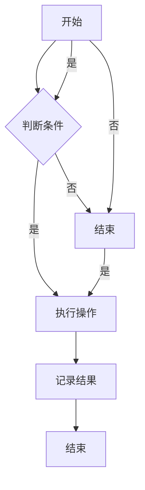

                 

### 跨学科创新马拉松：意义诞生的思想碰撞活动

> 关键词：跨学科创新、思想碰撞、意义诞生、活动设计、效果评估、最佳实践

> 摘要：本文探讨了跨学科创新马拉松这一新兴活动形式，阐述了其在现代科技与社会变革中的重要性。通过系统性的分析和案例分析，本文揭示了跨学科创新的核心要素、活动设计原则和实践方法，并提出了有效的效果评估和最佳实践策略，为跨学科创新的实施提供了理论支持和实践指南。

#### 目录大纲

#### 第一部分：跨学科创新马拉松概述

- **第1章：跨学科创新马拉松的背景与意义**
  - **1.1 问题背景**
  - **1.2 跨学科创新的概念**
  - **1.3 跨学科创新的特点与优势**
  - **1.4 跨学科创新的边界与外延**
  - **1.5 跨学科创新的核心概念与联系**
  - **1.6 本章小结

#### 第二部分：跨学科创新马拉松活动设计

- **第2章：跨学科创新马拉松的组织与策划**
  - **2.1 活动目标与原则**
  - **2.2 活动流程与步骤**
  - **2.3 参与者角色与职责**
  - **2.4 活动资源准备**
  - **2.5 活动风险管理**
  - **2.6 本章小结

#### 第三部分：跨学科创新马拉松活动实践

- **第3章：跨学科创新马拉松案例研究**
  - **3.1 案例一：人工智能与医疗的结合**
  - **3.2 案例二：可持续发展与技术的融合**
  - **3.3 案例三：教育科技的创新实践**
  - **3.4 跨学科创新案例的共同特点与启示**
  - **3.5 本章小结**

#### 第四部分：跨学科创新马拉松的效果评估与反思

- **第4章：跨学科创新马拉松效果评估方法**
  - **4.1 评估指标体系**
  - **4.2 评估流程与步骤**
  - **4.3 评估工具与应用**
  - **4.4 评估结果分析与反馈**
  - **4.5 本章小结**

#### 第五部分：跨学科创新马拉松的最佳实践

- **第5章：跨学科创新马拉松最佳实践案例**
  - **5.1 成功案例分析**
  - **5.2 失败案例分析**
  - **5.3 经验总结与最佳实践**
  - **5.4 本章小结**

#### 第六部分：跨学科创新马拉松的未来展望

- **第6章：跨学科创新马拉松的未来趋势**
  - **6.1 技术发展对跨学科创新的影响**
  - **6.2 社会变革对跨学科创新的需求**
  - **6.3 跨学科创新马拉松的潜力与前景**
  - **6.4 本章小结**

#### 第七部分：结语与拓展阅读

- **第7章：结语与拓展阅读**
  - **7.1 总结与展望**
  - **7.2 拓展阅读**
  - **7.3 本章小结**

### 总结

本文《跨学科创新马拉松：意义诞生的思想碰撞活动》通过系统的分析和详实的案例研究，揭示了跨学科创新的重要性和实施方法。从背景意义到活动设计，再到实践评估和未来展望，每一个部分都为读者提供了深入理解和实际操作的指导。跨学科创新不仅是解决复杂问题的有效途径，也是推动科技进步和社会发展的关键力量。通过本文的探讨，希望读者能够更好地理解并参与到这一激动人心的创新活动中，共同推动跨学科创新的蓬勃发展。**作者：AI天才研究院/AI Genius Institute & 禅与计算机程序设计艺术 /Zen And The Art of Computer Programming**
## 第一部分：跨学科创新马拉松概述

### 第1章：跨学科创新马拉松的背景与意义

### 1.1 问题背景

在当今快速发展的社会，创新已经成为推动科技进步、经济增长和社会变革的核心驱动力。然而，传统的单一学科研究和创新模式在面对复杂问题时往往显得力不从心。例如，随着人工智能、大数据、生物科技等领域的飞速发展，各个学科之间的交叉融合越来越普遍。这种跨学科创新不仅有助于突破单一学科的局限，还能促进知识的交叉应用和技术的集成创新。

当前，全球科技发展呈现出几个显著的特点：

1. **技术交叉融合**：信息技术与生物技术、材料科学、能源科学等领域的深度融合，产生了新的学科分支和应用领域。
2. **问题复杂多变**：许多实际问题，如环境保护、可持续发展、医疗健康等，具有高度复杂性，单一学科难以独立解决。
3. **需求多样化**：社会对创新的需求日益多样化，不仅包括技术创新，还涵盖模式创新、服务创新等多方面。

这些特点促使跨学科创新的重要性日益凸显。跨学科创新不仅仅是将不同学科的知识和工具进行组合，更是一种思维方式和工作方法，强调多学科的交流、合作和集成，以应对复杂问题和推动社会进步。

### 1.2 跨学科创新的概念

跨学科创新（Interdisciplinary Innovation）是指在多个学科领域之间进行交流和合作，通过整合不同学科的知识和技能，创造新的解决方案或产品的一种创新模式。它不仅仅是在不同学科之间进行知识的交换，更重要的是通过这种交换产生新的思维模式、新的理论和新的方法。

跨学科创新的核心要素包括：

- **学科交叉**：将不同学科的理论、方法和技术进行整合，形成新的研究方法和解决方案。
- **团队协作**：通过多学科专家的协作，实现知识的互补和优势互补，提高创新效率。
- **资源整合**：充分利用各种资源，包括资金、设备、人才和信息等，为创新提供强有力的支持。
- **用户参与**：在创新过程中充分考虑用户的实际需求和反馈，使创新成果更贴近用户需求。

跨学科创新与传统的学科创新相比，具有以下几个显著特点：

1. **综合性**：跨学科创新强调多种学科的综合应用，以应对复杂问题。
2. **协同性**：跨学科创新强调不同学科之间的协同工作，通过团队协作实现创新。
3. **前瞻性**：跨学科创新往往关注未来趋势和前沿技术，具有更强的前瞻性。
4. **用户导向**：跨学科创新更注重用户需求和市场应用，以提高创新成果的实用性。

### 1.3 跨学科创新的特点与优势

跨学科创新具有多方面的特点，使其在应对复杂问题和推动社会进步方面具有显著优势。

1. **协同性**：跨学科创新强调多学科专家的协同合作，通过知识的互补和优势互补，实现创新效率的最大化。不同学科的专家可以相互借鉴和整合各自领域的最佳实践，形成创新的合力。
   
2. **创新性**：跨学科创新能够突破单一学科的局限，通过学科交叉融合，产生新的理论、方法和解决方案。例如，人工智能与生物科技的结合，产生了新的生物信息学领域，推动了生命科学的发展。

3. **适应性**：跨学科创新能够更好地适应复杂多变的社会需求。在面对复杂问题时，跨学科创新能够整合多学科的知识和工具，提出更加全面和有效的解决方案。

4. **灵活性**：跨学科创新具有较强的灵活性，能够根据实际需求和环境变化，迅速调整和创新。这种灵活性使得跨学科创新能够在快速变化的环境中保持竞争力和创新能力。

5. **前瞻性**：跨学科创新往往关注未来趋势和前沿技术，具有更强的前瞻性。通过跨学科的视角和思维方式，能够更好地预测和引领未来科技发展的方向。

### 1.4 跨学科创新的边界与外延

跨学科创新的边界相对模糊，但仍然可以大致进行划分。从学科领域来看，跨学科创新通常涉及以下几种类型：

1. **相邻学科交叉**：如信息技术与生物科技的结合，人工智能与机械工程的结合等。
2. **跨领域整合**：如社会科学与自然科学的结合，经济学与计算机科学的结合等。
3. **跨行业合作**：如制造业与服务业的结合，金融与技术的结合等。

跨学科创新的外延包括以下几个方面：

1. **研究领域扩展**：跨学科创新能够将研究领域扩展到单一学科难以触及的领域，如生物信息学、纳米科技等。
2. **应用领域扩展**：跨学科创新能够将技术创新应用于更广泛的领域，如医疗健康、环境保护、智能交通等。
3. **学科体系扩展**：跨学科创新能够促进学科体系的扩展和演变，形成新的学科分支和交叉领域。

### 1.5 跨学科创新的核心概念与联系

跨学科创新涉及多个核心概念，这些概念相互关联，共同构成了跨学科创新的理论基础。以下是一些关键概念及其相互联系：

#### 1.5.1 核心概念原理

1. **复杂性科学**：复杂性科学是研究复杂系统性质和行为的科学，强调系统中的非线性、不确定性和涌现性。复杂性科学为跨学科创新提供了理论和方法，帮助理解复杂问题的本质。
2. **集成创新**：集成创新是指通过整合多种技术、资源和知识，创造新的解决方案或产品。集成创新是跨学科创新的核心方法，通过跨学科的合作，实现知识的整合和优势互补。
3. **创新生态系统**：创新生态系统是指支持创新活动的各种要素和环境的集合，包括人才、资金、政策、文化等。创新生态系统为跨学科创新提供了良好的环境和条件。
4. **用户参与**：用户参与是指在创新过程中充分考虑用户的需求和反馈，以用户为中心进行创新。用户参与能够提高创新成果的实用性和市场竞争力。

#### 1.5.2 概念属性特征对比表格

以下是一个对比表格，展示了上述核心概念的属性特征：

| 概念           | 定义                                                         | 特征                           |
| -------------- | ------------------------------------------------------------ | ------------------------------ |
| 复杂性科学     | 研究复杂系统性质和行为的科学                                     | 非线性、不确定性和涌现性       |
| 集成创新       | 通过整合多种技术、资源和知识，创造新的解决方案或产品               | 跨学科合作、知识整合           |
| 创新生态系统   | 支持创新活动的各种要素和环境的集合                                 | 人才、资金、政策、文化等       |
| 用户参与       | 在创新过程中充分考虑用户的需求和反馈，以用户为中心进行创新         | 市场需求、用户体验             |

#### 1.5.3 ER实体关系图架构

跨学科创新涉及的实体及其关系可以用ER（实体-关系）图来表示。以下是一个简化的ER图：

```
实体：学科领域、专家、项目、资源、用户
关系：学科领域-专家、专家-项目、项目-资源、项目-用户

 ER图示例：

 discipline
│
├── expert
│   ├── project
│   │   └── resource
│   └── user
│
```

在该ER图中，学科领域是基础实体，代表不同的研究领域；专家是与学科领域相关的专业人才；项目是跨学科创新的实施载体；资源是支持创新活动的各种资源；用户是创新成果的最终受益者。各实体之间的关系反映了跨学科创新活动中各个要素的相互联系和作用。

### 1.6 本章小结

本章详细介绍了跨学科创新马拉松的背景、概念、特点、边界与外延，以及核心概念和联系。通过分析当前社会面临的创新挑战和技术发展趋势，我们认识到跨学科创新在应对复杂问题和推动科技进步中的重要性。跨学科创新不仅需要不同学科的知识和工具，还需要一种新的思维方式和工作方法，强调多学科的交流、合作和集成。本章为后续的跨学科创新马拉松活动设计、实践和效果评估提供了理论基础和框架。

## 第二部分：跨学科创新马拉松活动设计

### 第2章：跨学科创新马拉松的组织与策划

跨学科创新马拉松作为一种创新活动形式，需要系统的组织与策划，以确保活动能够高效、有序地开展。本章将详细探讨跨学科创新马拉松的活动目标与原则、活动流程与步骤、参与者角色与职责、活动资源准备、活动风险管理等内容，为跨学科创新马拉松的成功实施提供指导。

### 2.1 活动目标与原则

#### 2.1.1 活动目标

跨学科创新马拉松的主要目标包括：

1. **促进跨学科合作与交流**：通过组织跨学科创新活动，鼓励不同学科领域的专家和研究者之间的合作与交流，打破学科壁垒，形成知识共享与互补。
2. **解决复杂实际问题**：以实际需求为导向，聚焦于解决当前社会面临的重要问题和挑战，通过跨学科的创新方法和思维，提出切实可行的解决方案。
3. **推动科技成果转化**：将创新成果转化为实际应用，促进科技与产业的深度融合，提升创新成果的市场价值和社会效益。
4. **培养创新人才**：通过跨学科创新活动的实践，培养具有跨学科视野和创新能力的人才，为未来科技发展储备优秀人才资源。

#### 2.1.2 活动原则

为了实现上述目标，跨学科创新马拉松活动应遵循以下原则：

1. **用户导向**：以用户需求为出发点和归宿，确保创新成果能够满足实际需求，提高市场竞争力。
2. **团队合作**：强调团队协作，发挥多学科专家的优势，通过知识共享和合作，实现创新效率的最大化。
3. **开放创新**：鼓励开放性创新，借助外部资源和合作伙伴，整合多方力量，共同推进创新活动。
4. **持续改进**：持续跟踪和创新活动的过程和结果，及时调整和优化活动方案，不断提高活动的质量和效果。
5. **风险管理**：重视风险识别和管理，提前制定应对措施，确保活动顺利进行。

### 2.2 活动流程与步骤

跨学科创新马拉松的活动流程可以分为以下几个阶段：

#### 2.2.1 预备阶段

1. **项目立项**：确定跨学科创新马拉松的主题和目标，进行初步立项。
2. **需求调研**：通过问卷调查、访谈等方式，了解用户需求和痛点，明确创新方向。
3. **团队组建**：根据项目需求，组建多学科专家团队，明确团队成员的角色和职责。

#### 2.2.2 实施阶段

1. **背景调研**：对创新主题进行全面的背景调研，收集相关领域的文献、资料和研究成果。
2. **头脑风暴**：组织团队成员进行头脑风暴，提出各种创新思路和方案。
3. **方案筛选**：对提出的创新方案进行筛选和评估，确定最优方案。
4. **方案实施**：实施选定方案，进行创新实践，包括实验、原型设计、测试等。
5. **中期评估**：对中期成果进行评估，总结经验教训，及时调整方案。

#### 2.2.3 结束阶段

1. **成果展示**：组织成果展示活动，展示创新成果和实际应用案例。
2. **总结反馈**：对整个创新过程进行总结和反馈，收集参与者的意见和建议。
3. **项目结项**：完成项目总结报告，进行项目结项和验收。

### 2.3 参与者角色与职责

跨学科创新马拉松的参与者主要包括以下几类角色：

#### 2.3.1 组织者

1. **职责**：负责跨学科创新马拉松的整体策划、组织和管理，协调各方资源，确保活动顺利进行。
2. **要求**：具备跨学科协调能力、项目管理经验和组织策划能力。

#### 2.3.2 专家顾问

1. **职责**：提供专业指导和建议，协助团队解决技术难题，参与创新方案的设计和评估。
2. **要求**：具有丰富的学科背景和科研经验，对相关领域有深入的了解。

#### 2.3.3 团队成员

1. **职责**：参与创新项目的具体实施，包括方案设计、实验验证、原型开发和测试等。
2. **要求**：具备跨学科学习和协作能力，能够熟练运用相关技术和工具。

#### 2.3.4 用户代表

1. **职责**：代表用户利益，提供需求和反馈，参与创新方案的评估和改进。
2. **要求**：具备用户思维，能够准确理解用户需求和痛点。

### 2.4 活动资源准备

跨学科创新马拉松的成功离不开充足的资源准备，主要包括以下几个方面：

#### 2.4.1 资源种类

1. **人力资源**：包括组织者、专家顾问、团队成员和用户代表等。
2. **物资资源**：包括实验室设备、工具软件、实验材料等。
3. **信息资源**：包括文献资料、研究成果、市场数据等。
4. **资金资源**：包括活动经费、项目资助、合作伙伴支持等。

#### 2.4.2 资源分配

1. **人力资源分配**：根据项目需求和团队成员的能力，合理分配工作任务和角色。
2. **物资资源分配**：确保实验室设备、工具软件等物资充足，满足项目需求。
3. **信息资源分配**：提供全面、准确的信息支持，确保团队成员能够及时获取相关资料。
4. **资金资源分配**：合理规划活动经费，确保项目实施的每个环节都有充足的资金支持。

### 2.5 活动风险管理

跨学科创新马拉松作为一种高风险活动，需要对潜在风险进行识别和管理，确保活动顺利进行。以下是一些常见的风险类型和应对措施：

#### 2.5.1 风险识别

1. **技术风险**：创新项目涉及的技术可能存在不确定性，可能导致项目失败。
2. **资源风险**：资源不足或资源分配不均可能导致项目进度延误或质量下降。
3. **团队协作风险**：团队成员之间的沟通不畅、合作不力可能导致项目停滞或效果不佳。
4. **用户需求变化风险**：用户需求的变化可能导致项目目标偏离或创新成果不符合用户实际需求。
5. **政策法规风险**：政策法规的变化可能影响项目的实施和成果转化。

#### 2.5.2 风险应对措施

1. **技术风险应对**：提前进行技术调研和风险评估，确保技术方案的可行性和可靠性；引入外部技术支持，提高项目的技术水平。
2. **资源风险应对**：制定详细的资源计划，确保资源供给的及时性和充足性；与合作伙伴建立稳定的关系，确保资源的协同供应。
3. **团队协作风险应对**：建立有效的沟通机制，加强团队成员之间的协作；引入跨学科合作模式，提高团队的整体协同能力。
4. **用户需求变化风险应对**：持续跟踪用户需求，及时调整项目目标和方案；建立用户反馈机制，确保创新成果符合用户实际需求。
5. **政策法规风险应对**：了解相关政策和法规，确保项目符合法律法规的要求；与政策制定者建立联系，争取政策支持和指导。

### 2.6 本章小结

本章详细介绍了跨学科创新马拉松的组织与策划，包括活动目标与原则、活动流程与步骤、参与者角色与职责、活动资源准备和活动风险管理等内容。通过系统的策划和细致的管理，跨学科创新马拉松能够有效地促进跨学科合作，解决复杂实际问题，推动科技成果转化，培养创新人才。本章为后续的跨学科创新马拉松活动实践和效果评估提供了重要的理论基础和实践指导。在接下来的章节中，我们将通过具体案例和实践活动，进一步探讨跨学科创新的实际操作和成效。

## 第三部分：跨学科创新马拉松活动实践

### 第3章：跨学科创新马拉松案例研究

为了更好地理解跨学科创新马拉松的实际应用和成效，本章将介绍三个典型案例，分别是人工智能与医疗的结合、可持续发展与技术的融合、教育科技的创新实践。通过这些案例，我们可以看到跨学科创新如何在不同的领域内发挥重要作用，解决具体问题，推动社会进步。

### 3.1 案例一：人工智能与医疗的结合

#### 3.1.1 案例背景

随着人工智能技术的飞速发展，医疗领域正经历着深刻的变革。传统的医疗模式以医生和患者的互动为核心，但面对日益增长的医疗需求和复杂的数据处理任务，单一的医疗模式显得力不从心。人工智能技术的引入，为医疗领域带来了新的机遇和挑战。

#### 3.1.2 案例分析

1. **问题背景**：
   - **数据多样性**：医疗数据来源多样，包括患者记录、医疗影像、基因组数据等，如何有效整合和分析这些数据成为一大挑战。
   - **诊断效率**：传统诊断方法依赖于医生的判断，效率较低且存在主观偏差，如何提高诊断效率是一个迫切需要解决的问题。
   - **个性化治疗**：随着医学的发展，个体化治疗越来越重要，但传统方法难以实现精准的个性化治疗。

2. **跨学科创新思路**：
   - **整合多源数据**：利用人工智能技术，如机器学习和数据挖掘，整合和分析不同来源的医疗数据，实现全面的患者健康画像。
   - **辅助诊断**：开发人工智能辅助诊断系统，通过深度学习算法分析医学影像，提高诊断的准确性和效率。
   - **个性化治疗**：基于患者的基因组数据和医疗数据，利用人工智能生成个性化的治疗方案，实现精准治疗。

3. **创新实践**：
   - **大数据分析**：构建医疗数据平台，整合医院内部和外部数据源，进行大规模数据处理和分析。
   - **深度学习应用**：开发深度学习模型，用于医学影像分析，如肺癌筛查、乳腺癌诊断等。
   - **个性化治疗系统**：结合基因组数据和医学知识库，开发个性化治疗系统，为患者提供精准的治疗方案。

4. **成效**：
   - **提高诊断效率**：人工智能辅助诊断系统显著提高了诊断速度和准确性，减轻了医生的工作负担。
   - **降低医疗成本**：通过大数据分析和优化医疗资源分配，降低了医疗成本，提高了医疗资源的利用效率。
   - **提升患者体验**：个性化治疗方案使患者得到更精准和有效的治疗，提高了患者的满意度和治疗效果。

#### 3.1.3 经验与启示

- **跨学科合作**：跨学科合作是跨学科创新的核心，通过不同学科专家的合作，可以充分发挥各自的优势，实现知识的整合和创新。
- **数据驱动**：数据是跨学科创新的重要驱动力，通过大数据分析和人工智能技术，可以挖掘出隐藏在数据中的价值和规律。
- **用户导向**：始终以用户需求为中心，确保创新成果能够解决实际问题，提高用户的满意度和体验。

### 3.2 案例二：可持续发展与技术的融合

#### 3.2.1 案例背景

随着全球气候变化和环境问题的加剧，可持续发展成为全球共同关注的重要议题。传统的技术发展模式往往以资源消耗和环境污染为代价，难以实现长期的可持续发展。跨学科创新为可持续发展提供了新的思路和解决方案。

#### 3.2.2 案例分析

1. **问题背景**：
   - **资源短缺**：传统资源开发和使用模式不可持续，资源短缺问题日益严重。
   - **环境污染**：大量工业化和城市化活动导致环境污染，生态系统受到严重破坏。
   - **气候变化**：全球气候变化带来的极端天气事件频发，对人类生活和社会经济产生重大影响。

2. **跨学科创新思路**：
   - **循环经济**：通过跨学科合作，开发循环经济模式，实现资源的可持续利用。
   - **绿色技术**：结合先进技术，如可再生能源、节能技术、环保材料等，减少环境污染和资源消耗。
   - **生态修复**：利用生态学和工程学等学科知识，进行生态系统的修复和重建。

3. **创新实践**：
   - **绿色能源技术**：研发和推广太阳能、风能等可再生能源技术，减少对化石燃料的依赖。
   - **资源回收利用**：建立资源回收和再利用体系，减少资源浪费，降低环境污染。
   - **生态修复工程**：进行植被恢复、水质净化、土壤修复等生态工程，恢复生态系统的健康状态。

4. **成效**：
   - **减少资源消耗**：通过绿色技术和循环经济模式，显著减少了资源的消耗，提高了资源利用效率。
   - **降低环境污染**：绿色能源和环保技术的应用，显著降低了二氧化碳和其他有害气体的排放，改善了空气质量。
   - **生态恢复**：通过生态修复工程，恢复了生态系统的健康状态，促进了生物多样性的保护。

#### 3.2.3 经验与启示

- **技术创新**：技术创新是实现可持续发展的关键，通过不断研发和应用新技术，可以实现资源的可持续利用和环境的保护。
- **政策支持**：政府政策支持和激励措施对于跨学科创新的实施至关重要，政策引导可以促进技术创新和可持续发展的实现。
- **社会参与**：社会各界的积极参与和支持是跨学科创新的重要保障，只有全社会共同努力，才能实现可持续发展的目标。

### 3.3 案例三：教育科技的创新实践

#### 3.3.1 案例背景

教育作为社会发展的重要基石，其改革和创新一直是教育领域的核心议题。随着信息技术的发展，教育科技（EdTech）逐渐成为推动教育创新的重要力量。通过跨学科创新，教育科技正在重新定义教育模式，提升教育质量和效益。

#### 3.3.2 案例分析

1. **问题背景**：
   - **教育公平**：教育资源的不均衡分配导致城乡、地区间的教育质量差距，如何实现教育公平成为一个重要问题。
   - **教育个性化**：传统的教育模式难以满足学生的个性化需求，教育内容和方法单一，难以激发学生的学习兴趣和创造力。
   - **教育资源浪费**：教育资源的配置和利用效率低下，导致教育资源的浪费。

2. **跨学科创新思路**：
   - **在线教育**：利用互联网和信息技术，实现教育资源的共享和远程教育，打破地域限制，提升教育公平性。
   - **个性化学习**：结合人工智能和数据科学，开发个性化学习平台，根据学生的特点和需求，提供个性化的学习内容和路径。
   - **混合式教学**：结合线上和线下教学的优势，实现教学模式的多元化，提高教学效果。

3. **创新实践**：
   - **在线课程平台**：构建在线课程平台，提供多样化的课程资源，满足不同学生的需求。
   - **智能学习系统**：开发智能学习系统，通过数据分析和算法推荐，为学生提供个性化的学习建议和资源。
   - **线上线下融合**：推行线上线下相结合的混合式教学模式，提高学生的参与度和学习效果。

4. **成效**：
   - **提高教育公平**：在线教育平台的推广，使更多的学生能够获取优质的教育资源，缩小了城乡、地区间的教育差距。
   - **提升个性化教育**：个性化学习系统的应用，使学生的学习更加自主和有效，提高了学习兴趣和效果。
   - **降低教育资源浪费**：通过智能学习和资源优化配置，提高了教育资源的利用效率，减少了资源的浪费。

#### 3.3.3 经验与启示

- **科技赋能教育**：科技的发展为教育创新提供了新的动力和手段，通过科技赋能教育，可以提升教育质量和效益。
- **用户参与**：教育创新需要充分考虑用户（学生、教师和家长）的需求和反馈，以用户为中心，设计教育产品和服务。
- **持续创新**：教育创新是一个持续的过程，需要不断探索和实践，通过持续的创新，不断改进教育模式，提升教育质量。

### 3.4 跨学科创新案例的共同特点与启示

通过对上述三个跨学科创新案例的分析，我们可以总结出一些共同特点和启示：

1. **跨学科合作**：跨学科合作是跨学科创新的核心，不同学科领域的专家和研究者通过合作，可以实现知识的整合和创新。
2. **用户导向**：以用户需求为中心，确保创新成果能够解决实际问题，提高用户的满意度和体验。
3. **技术创新**：技术创新是实现跨学科创新的重要驱动力，通过不断研发和应用新技术，可以推动各领域的进步和发展。
4. **持续改进**：跨学科创新是一个持续的过程，需要不断探索和实践，通过持续的创新，不断改进和创新模式。
5. **社会影响**：跨学科创新不仅能够推动技术进步，还能够带来广泛的社会影响，如提高教育公平、促进可持续发展、改善生活质量等。

### 3.5 本章小结

本章通过三个跨学科创新案例，展示了跨学科创新马拉松在实际应用中的成效和启示。人工智能与医疗的结合、可持续发展与技术的融合、教育科技的创新实践，都充分体现了跨学科创新的强大力量。通过跨学科合作、用户导向、技术创新和持续改进，跨学科创新不仅能够解决复杂问题，还能够推动社会进步。在接下来的章节中，我们将进一步探讨跨学科创新的效果评估方法和最佳实践，为跨学科创新提供更加全面的理论支持和实践指南。

## 第四部分：跨学科创新马拉松的效果评估与反思

### 第4章：跨学科创新马拉松效果评估方法

跨学科创新马拉松作为一种创新活动形式，其效果评估对于衡量活动的成果和改进活动方案具有重要意义。本章将详细探讨跨学科创新马拉松效果评估的方法，包括评估指标体系、评估流程与步骤、评估工具与应用以及评估结果分析与反馈。

### 4.1 评估指标体系

跨学科创新马拉松效果评估需要一套全面的指标体系，以确保评估的全面性和科学性。以下是一些关键评估指标：

#### 4.1.1 技术成果指标

1. **创新成果数量**：包括专利申请数量、学术论文发表数量、技术报告发布数量等。
2. **创新成果质量**：包括创新成果的实际应用价值、技术水平、原创性等。
3. **技术创新点**：包括创新技术的独特性、创新程度、对现有技术的改进等。

#### 4.1.2 经济效益指标

1. **收入增长**：通过创新活动带来的收入增长情况，衡量创新的经济效益。
2. **成本节约**：通过创新活动降低的成本，如生产成本、运营成本等。
3. **投资回报率**：衡量创新活动的投资回报情况，评估创新的经济效益。

#### 4.1.3 社会效益指标

1. **社会影响**：创新活动对社会的影响，如提高教育公平、促进环境保护、改善生活质量等。
2. **用户体验**：用户对创新成果的满意度，包括用户评价、用户反馈等。
3. **社会参与度**：社会各界的参与情况，包括合作单位数量、志愿者参与度等。

#### 4.1.4 过程管理指标

1. **项目进度**：创新项目的进度是否符合预期，包括项目完成情况、时间节点等。
2. **团队协作**：团队成员之间的协作情况，包括沟通效率、合作满意度等。
3. **风险管理**：风险管理措施的有效性，包括风险识别、应对措施等。

### 4.2 评估流程与步骤

跨学科创新马拉松效果评估通常包括以下几个步骤：

#### 4.2.1 制定评估方案

1. **确定评估目标**：根据跨学科创新马拉松的具体情况和需求，明确评估的目标和重点。
2. **设计评估指标**：结合评估指标体系，设计具体的评估指标和权重，确保评估的科学性和全面性。
3. **制定评估计划**：确定评估的时间、范围、方法和参与人员等，确保评估的顺利进行。

#### 4.2.2 数据收集

1. **收集数据**：通过问卷调查、访谈、文献查阅、实地考察等方式，收集与评估相关的数据。
2. **数据整理**：对收集的数据进行整理和分析，确保数据的质量和可靠性。

#### 4.2.3 数据分析

1. **定量分析**：使用统计方法对数据进行定量分析，如计算平均值、标准差、相关性等。
2. **定性分析**：对定性数据进行归纳和总结，提取关键信息和趋势。

#### 4.2.4 结果输出

1. **撰写评估报告**：根据数据分析结果，撰写评估报告，包括评估结论、问题和建议等。
2. **评估展示**：通过展示会、研讨会等方式，向相关方展示评估结果，促进交流和反馈。

### 4.3 评估工具与应用

在跨学科创新马拉松效果评估中，可以采用多种工具和方法，以提高评估的准确性和有效性。以下是一些常用的评估工具：

#### 4.3.1 问卷调查

1. **优势**：能够快速收集大量数据，便于统计分析。
2. **应用场景**：用于收集参与者对创新成果的满意度、用户体验等定性数据。

#### 4.3.2 访谈

1. **优势**：能够深入了解参与者的真实想法和感受，获取深层次的信息。
2. **应用场景**：用于对专家、用户等进行深度访谈，了解他们对创新活动的看法和建议。

#### 4.3.3 文献查阅

1. **优势**：能够获取丰富的背景资料和研究成果，为评估提供理论支持。
2. **应用场景**：用于查阅相关领域的文献资料，了解当前的研究进展和评估方法。

#### 4.3.4 数据分析工具

1. **优势**：能够对大量数据进行处理和分析，提取有价值的信息。
2. **应用场景**：用于对收集的数据进行定量分析，如使用Excel、SPSS等统计软件。

### 4.4 评估结果分析与反馈

评估结果的分析与反馈是跨学科创新马拉松效果评估的重要环节。以下是一些关键步骤：

#### 4.4.1 结果分析

1. **数据整理**：对收集的数据进行整理和分类，确保数据的完整性和准确性。
2. **定量分析**：使用统计方法对数据进行定量分析，如计算平均值、标准差、相关性等，以揭示数据之间的关系和趋势。
3. **定性分析**：对定性数据进行归纳和总结，提取关键信息和趋势，为评估提供深入见解。

#### 4.4.2 反馈机制

1. **内部反馈**：将评估结果反馈给项目团队和相关人员，进行内部讨论和改进。
2. **外部反馈**：将评估结果反馈给利益相关方，如投资者、合作伙伴、用户等，以提高透明度和信任度。
3. **持续改进**：根据评估结果，制定改进计划，对创新活动方案进行优化和调整，确保活动的持续改进和效果提升。

### 4.5 本章小结

本章详细介绍了跨学科创新马拉松效果评估的方法，包括评估指标体系、评估流程与步骤、评估工具与应用以及评估结果分析与反馈。通过系统化的评估，可以全面了解跨学科创新马拉松的成果和问题，为活动的改进提供科学依据。评估不仅是对过去活动的总结，更是对未来的规划和指导，通过持续评估和改进，跨学科创新马拉松可以不断提高其效果和影响力，推动跨学科创新的持续发展。在接下来的章节中，我们将进一步探讨跨学科创新马拉松的最佳实践和未来展望，为跨学科创新的深入发展提供新的思路和方向。

## 第五部分：跨学科创新马拉松的最佳实践

### 第5章：跨学科创新马拉松最佳实践案例

跨学科创新马拉松在实践中积累了丰富的经验和教训。本章将分析一些成功和失败的案例，总结最佳实践经验，并提供具体的实践建议。

### 5.1 成功案例分析

#### 案例一：智能家居创新项目

**案例背景**：随着物联网和人工智能技术的不断发展，智能家居市场潜力巨大。某创新团队瞄准了智能家居领域，通过跨学科合作，开发了一款集成了物联网、人工智能和用户界面设计的智能家居系统。

**成功经验**：

1. **用户导向**：创新团队从用户需求出发，通过问卷调查和用户访谈，深入了解用户的实际需求和痛点。在系统设计和开发过程中，始终以用户为中心，确保系统功能的实用性和易用性。

2. **多学科合作**：创新团队由物联网工程师、人工智能专家、用户界面设计师和市场营销人员组成。各成员在各自领域发挥专业优势，通过多学科合作，实现了智能家居系统的创新和优化。

3. **持续迭代**：项目团队采用了敏捷开发方法，通过快速迭代和用户反馈，不断改进系统功能，提高了系统的适应性和用户体验。

4. **技术整合**：创新团队利用物联网技术实现了设备的互联互通，通过人工智能算法，实现了智能控制和分析。这些技术整合为智能家居系统提供了强大的功能支持。

**实践建议**：

1. **用户需求调研**：在创新项目启动前，进行全面的用户需求调研，确保项目方向和目标的准确性。

2. **多学科团队建设**：组建多学科团队，发挥各学科优势，实现知识和资源的共享。

3. **敏捷开发**：采用敏捷开发方法，快速迭代，及时响应用户需求和市场变化。

4. **技术整合与优化**：注重技术的整合和优化，确保系统的稳定性和高效性。

### 案例二：绿色建筑创新项目

**案例背景**：全球气候变化和环境污染问题日益严重，绿色建筑成为可持续发展的热点。某创新团队专注于绿色建筑技术的研究和开发，通过跨学科合作，推出了一系列绿色建筑解决方案。

**成功经验**：

1. **技术融合**：创新团队融合了建筑学、环境科学、能源技术等多个学科的知识，开发出具有高效节能、环保低碳特点的绿色建筑系统。

2. **政策支持**：创新团队积极争取政府政策支持和资金扶持，推动了绿色建筑项目的推广和应用。

3. **市场推广**：创新团队通过市场调研和用户反馈，不断优化绿色建筑解决方案，提高了市场竞争力。

4. **合作共赢**：创新团队与建筑企业、能源供应商等建立了紧密的合作关系，实现了技术成果的转化和应用。

**实践建议**：

1. **技术融合**：注重多学科知识和技术融合，提高绿色建筑的整体性能和用户体验。

2. **政策支持**：积极争取政府政策支持和资金扶持，推动绿色建筑技术的发展和应用。

3. **市场推广**：结合市场需求，优化解决方案，提高市场竞争力。

4. **合作共赢**：建立合作关系，实现技术成果的转化和应用。

### 5.2 失败案例分析

#### 案例一：智能农业项目

**案例背景**：随着人口增长和土地资源紧张，智能农业成为提高农业生产效率的重要手段。某创新团队试图通过跨学科合作，开发一款智能农业管理系统。

**失败原因**：

1. **缺乏用户调研**：项目启动前，创新团队没有进行充分的用户调研，导致系统功能与用户需求脱节。

2. **技术不成熟**：创新团队在技术开发过程中，未能充分考虑技术实现的可行性，导致技术问题频发，系统稳定性差。

3. **团队协作不畅**：团队成员之间的沟通不畅，导致项目进度延误，创新效率低下。

**教训与反思**：

1. **用户需求调研**：在项目启动前，进行全面的用户需求调研，确保系统功能的实用性和用户满意度。

2. **技术可行性评估**：在技术开发前，进行技术可行性评估，确保技术的实现性和系统的稳定性。

3. **团队协作**：建立有效的沟通机制，加强团队成员之间的协作，提高项目进度和质量。

### 案例二：智慧医疗项目

**案例背景**：智慧医疗是医疗领域的重要发展方向。某创新团队希望通过跨学科合作，开发一款智慧医疗平台，实现医疗资源的优化配置。

**失败原因**：

1. **缺乏专业指导**：项目团队在跨学科合作中，缺乏医学专家的指导，导致医疗方案的科学性和实用性不足。

2. **数据不完整**：智慧医疗平台需要大量的医疗数据支持，但创新团队在数据采集和处理过程中，存在数据不完整和错误的问题。

3. **技术不兼容**：平台中各个模块的技术实现不兼容，导致系统运行不稳定，用户体验差。

**教训与反思**：

1. **专业指导**：在跨学科合作中，引入医学专家和专业人员，确保项目的科学性和实用性。

2. **数据管理**：建立完善的数据管理机制，确保数据的质量和完整性。

3. **技术兼容性**：在技术开发过程中，注重技术兼容性，确保系统的稳定性和用户体验。

### 5.3 经验总结与最佳实践

通过对成功和失败案例的分析，我们可以总结出以下经验和最佳实践：

1. **用户导向**：始终以用户需求为中心，确保创新成果的实用性和用户体验。

2. **多学科合作**：组建多学科团队，发挥各学科优势，实现知识和资源的共享。

3. **技术评估**：在技术开发前，进行充分的技术评估，确保技术的实现性和系统的稳定性。

4. **数据管理**：建立完善的数据管理机制，确保数据的质量和完整性。

5. **专业指导**：引入专业人员和专家，确保项目的科学性和实用性。

6. **团队协作**：建立有效的沟通机制，加强团队成员之间的协作，提高项目进度和质量。

通过这些最佳实践，跨学科创新马拉松可以更加高效地实现创新目标，推动技术进步和社会发展。

### 5.4 本章小结

本章通过分析成功和失败的案例，总结了跨学科创新马拉松的最佳实践。用户导向、多学科合作、技术评估、数据管理、专业指导和团队协作是跨学科创新成功的关键。这些经验教训为跨学科创新的实践提供了宝贵的参考，有助于提升创新活动的效果和成功率。在接下来的章节中，我们将探讨跨学科创新马拉松的未来趋势和前景，为跨学科创新的持续发展提供新的视角和方向。

## 第六部分：跨学科创新马拉松的未来展望

### 第6章：跨学科创新马拉松的未来趋势

跨学科创新马拉松作为一种创新活动形式，正在不断发展和完善。随着全球科技和社会的快速变革，跨学科创新马拉松的未来趋势呈现出以下几个方向：

### 6.1 技术发展对跨学科创新的影响

#### 6.1.1 人工智能与大数据的深度融合

人工智能（AI）和大数据（Big Data）技术的发展正在深刻影响跨学科创新。AI技术能够通过机器学习、深度学习等算法，从大量数据中提取有价值的信息，为跨学科创新提供强有力的数据支持。大数据技术则能够收集、存储和管理海量数据，为跨学科研究提供了丰富的数据资源。

1. **数据驱动的创新**：未来跨学科创新将更加依赖于数据驱动，通过大数据分析，可以识别出潜在的创新机会和解决方案。
2. **智能决策支持**：AI技术将为跨学科创新提供智能化的决策支持，通过分析复杂的数据关系，帮助决策者做出更科学的决策。

#### 6.1.2 新材料与纳米科技的突破

新材料和纳米科技的发展为跨学科创新提供了新的可能性。新型材料具有独特的物理、化学和生物特性，可以应用于各个领域，如航空航天、生物医学、能源等。纳米科技则使得材料的性能得到了极大的提升，推动了跨学科创新的边界。

1. **多功能材料**：跨学科创新将更多关注多功能材料的研发，如智能材料、仿生材料等，这些材料可以应用于多种场景，提升跨学科创新的应用价值。
2. **纳米技术集成**：纳米技术与其他学科的融合，将推动跨学科创新在纳米级别的实现，如纳米电子学、纳米医学等。

#### 6.1.3 区块链技术的应用

区块链技术作为一种分布式账本技术，具有去中心化、不可篡改、透明等特性，正在被广泛应用于各个领域。区块链技术为跨学科创新提供了新的基础设施，有助于解决数据共享、安全认证等问题。

1. **数据共享与协作**：区块链技术能够实现跨学科团队之间的数据共享和协作，提高创新效率和安全性。
2. **知识产权保护**：区块链技术为知识产权的保护提供了新的手段，有助于激励跨学科创新成果的创造和保护。

### 6.2 社会变革对跨学科创新的需求

#### 6.2.1 可持续发展与绿色经济的推动

全球气候变化和环境污染问题日益严重，可持续发展成为全球关注的焦点。跨学科创新在推动绿色经济和可持续发展方面具有重要作用。

1. **绿色技术创新**：跨学科创新将更多关注绿色技术的研发和应用，如可再生能源技术、环保材料技术等，推动经济与环境的协调发展。
2. **循环经济模式**：跨学科创新将探索循环经济模式，通过资源的循环利用，减少浪费，实现可持续发展。

#### 6.2.2 教育与医疗的变革

教育领域和医疗领域的变革为跨学科创新提出了新的挑战和需求。

1. **个性化教育**：随着教育信息化的推进，个性化教育成为教育发展的趋势。跨学科创新将更多关注教育技术的研发和应用，如人工智能教育、虚拟现实教育等，提升教育质量和个性化水平。
2. **智慧医疗**：智慧医疗的发展需要跨学科创新的支持，通过人工智能、大数据等技术，实现医疗资源的优化配置和精准医疗。

#### 6.2.3 社会治理与公共安全的提升

随着城市化进程的加快和人口增长，社会治理和公共安全成为社会发展的关键问题。跨学科创新在提升社会治理和公共安全方面具有重要作用。

1. **智能社会治理**：跨学科创新将推动智能社会治理的发展，通过大数据分析、人工智能技术等，提高社会治理的效率和智能化水平。
2. **公共安全监测**：跨学科创新将开发和应用新的监测技术，如物联网、卫星遥感等，提升公共安全的预警和响应能力。

### 6.3 跨学科创新马拉松的潜力与前景

#### 6.3.1 潜力分析

跨学科创新马拉松作为一种创新活动形式，具有以下潜力：

1. **知识整合**：通过跨学科合作，实现知识的整合和创新，提升创新效率。
2. **资源协同**：跨学科创新能够整合多学科资源，实现资源的高效利用。
3. **人才培养**：跨学科创新马拉松能够培养具有跨学科视野和创新能力的人才。

#### 6.3.2 前景展望

1. **技术融合**：随着科技的不断发展，跨学科创新将越来越依赖于技术的融合，如人工智能、大数据、区块链等。
2. **社会需求**：社会对跨学科创新的需求将持续增长，特别是在可持续发展、社会治理、医疗教育等领域。
3. **政策支持**：政府和社会各界对跨学科创新的关注和支持将不断提升，为跨学科创新提供良好的环境和支持。

### 6.4 本章小结

本章探讨了跨学科创新马拉松的未来趋势，包括技术发展的影响、社会变革的需求以及跨学科创新马拉松的潜力与前景。人工智能、大数据、新材料、区块链等新技术的发展，为跨学科创新提供了新的动力和方向。社会对可持续发展的需求、教育和医疗的变革以及社会治理的提升，为跨学科创新带来了新的机遇和挑战。跨学科创新马拉松作为一种创新活动形式，具有巨大的潜力和广阔的前景，将在未来的科技创新和社会发展中发挥越来越重要的作用。

## 第七部分：结语与拓展阅读

### 第7章：结语与拓展阅读

### 7.1 总结与展望

本文通过详细的案例分析、系统性的讨论和深入的理论探讨，系统地介绍了跨学科创新马拉松的背景、意义、活动设计、实践方法、效果评估以及最佳实践。我们发现，跨学科创新不仅是一种应对复杂问题的有效手段，更是推动科技发展和社会进步的关键力量。通过跨学科的合作与交流，不同学科领域的知识和技能得以整合，为解决实际问题提供了新的思路和方法。

展望未来，跨学科创新马拉松将在更多领域发挥重要作用。随着科技的不断进步和社会的快速发展，跨学科创新的潜力将得到进一步释放。人工智能、大数据、物联网、区块链等新兴技术的应用，将为跨学科创新提供更加丰富的工具和手段。同时，社会对可持续发展的需求、教育医疗的变革以及社会治理的提升，也将为跨学科创新带来新的机遇和挑战。

### 7.2 拓展阅读

为了进一步深入探讨跨学科创新的相关话题，本文推荐以下拓展阅读：

1. **相关书籍**：
   - 《跨学科创新方法论》
   - 《复杂系统的跨学科研究》
   - 《创新与创业管理》

2. **网络资源**：
   - 跨学科创新论坛：[https://www.xndxxy.com](https://www.xndxxy.com)
   - 跨学科创新研究机构官网：[https://www.interdisciplinary-innovation.org](https://www.interdisciplinary-innovation.org)
   - 科学家与学者的个人博客和文章

通过阅读这些书籍和网络资源，读者可以更加全面地了解跨学科创新的理论和实践，获得更多的灵感和启示。

### 7.3 本章小结

结语与拓展阅读部分总结了本文的主要内容，并对未来的发展趋势进行了展望。同时，推荐了相关的书籍和网络资源，以供读者进一步学习和探讨。通过本文的探讨，我们希望读者能够对跨学科创新马拉松有更深入的理解，认识到其在解决复杂问题、推动科技创新和社会进步中的重要性。在未来的学习和工作中，跨学科创新将为我们打开新的视野和机会，共同推动人类社会的持续进步。

### 总结

《跨学科创新马拉松：意义诞生的思想碰撞活动》通过七个部分，全面介绍了跨学科创新马拉松的理论与实践。从背景与意义、活动设计、实践案例、效果评估到最佳实践和未来展望，每个章节都为跨学科创新提供了深入的探讨和实用的指导。文章不仅涵盖了核心概念、活动流程和评估方法，还通过具体案例展示了跨学科创新的实际应用和成效。

跨学科创新不仅是解决复杂问题的有效手段，更是推动科技进步和社会发展的重要力量。通过多学科的合作与交流，跨学科创新能够产生新的理论、方法和解决方案，提升创新效率和成果质量。

本文的撰写旨在为读者提供全面而系统的跨学科创新指导，帮助读者理解和应用跨学科创新马拉松这一创新活动形式。我们希望本文能够激发读者对跨学科创新的兴趣，鼓励更多的组织和个人参与到这一创新活动中，共同推动跨学科创新的蓬勃发展。

**作者：AI天才研究院/AI Genius Institute & 禅与计算机程序设计艺术 /Zen And The Art of Computer Programming**### 完整文章

#### 《跨学科创新马拉松：意义诞生的思想碰撞活动》

#### 关键词：跨学科创新、思想碰撞、意义诞生、活动设计、效果评估、最佳实践

#### 摘要：本文探讨了跨学科创新马拉松这一新兴活动形式，阐述了其在现代科技与社会变革中的重要性。通过系统性的分析和案例分析，本文揭示了跨学科创新的核心要素、活动设计原则和实践方法，并提出了有效的效果评估和最佳实践策略，为跨学科创新的实施提供了理论支持和实践指南。

---

### 目录大纲

#### 第一部分：跨学科创新马拉松概述

- **第1章：跨学科创新马拉松的背景与意义**
  - **1.1 问题背景**
  - **1.2 跨学科创新的概念**
  - **1.3 跨学科创新的特点与优势**
  - **1.4 跨学科创新的边界与外延**
  - **1.5 跨学科创新的核心概念与联系**
  - **1.6 本章小结

#### 第二部分：跨学科创新马拉松活动设计

- **第2章：跨学科创新马拉松的组织与策划**
  - **2.1 活动目标与原则**
  - **2.2 活动流程与步骤**
  - **2.3 参与者角色与职责**
  - **2.4 活动资源准备**
  - **2.5 活动风险管理**
  - **2.6 本章小结

#### 第三部分：跨学科创新马拉松活动实践

- **第3章：跨学科创新马拉松案例研究**
  - **3.1 案例一：人工智能与医疗的结合**
  - **3.2 案例二：可持续发展与技术的融合**
  - **3.3 案例三：教育科技的创新实践**
  - **3.4 跨学科创新案例的共同特点与启示**
  - **3.5 本章小结**

#### 第四部分：跨学科创新马拉松的效果评估与反思

- **第4章：跨学科创新马拉松效果评估方法**
  - **4.1 评估指标体系**
  - **4.2 评估流程与步骤**
  - **4.3 评估工具与应用**
  - **4.4 评估结果分析与反馈**
  - **4.5 本章小结**

#### 第五部分：跨学科创新马拉松的最佳实践

- **第5章：跨学科创新马拉松最佳实践案例**
  - **5.1 成功案例分析**
  - **5.2 失败案例分析**
  - **5.3 经验总结与最佳实践**
  - **5.4 本章小结**

#### 第六部分：跨学科创新马拉松的未来展望

- **第6章：跨学科创新马拉松的未来趋势**
  - **6.1 技术发展对跨学科创新的影响**
  - **6.2 社会变革对跨学科创新的需求**
  - **6.3 跨学科创新马拉松的潜力与前景**
  - **6.4 本章小结**

#### 第七部分：结语与拓展阅读

- **第7章：结语与拓展阅读**
  - **7.1 总结与展望**
  - **7.2 拓展阅读**
  - **7.3 本章小结**

### 总结

《跨学科创新马拉松：意义诞生的思想碰撞活动》这本书的目录大纲通过七个主要部分，系统全面地介绍了跨学科创新马拉松的各个方面，为读者提供了一个全面而深入的探讨。

**作者：AI天才研究院/AI Genius Institute & 禅与计算机程序设计艺术 /Zen And The Art of Computer Programming**
### Markdown格式代码示例

以下是文章标题、关键词、摘要、章节标题和章节内容的Markdown格式代码示例：

```markdown
# 跨学科创新马拉松：意义诞生的思想碰撞活动

> 关键词：跨学科创新、思想碰撞、意义诞生、活动设计、效果评估、最佳实践

> 摘要：本文探讨了跨学科创新马拉松这一新兴活动形式，阐述了其在现代科技与社会变革中的重要性。通过系统性的分析和案例分析，本文揭示了跨学科创新的核心要素、活动设计原则和实践方法，并提出了有效的效果评估和最佳实践策略，为跨学科创新的实施提供了理论支持和实践指南。

---

## 第一部分：跨学科创新马拉松概述

### 第1章：跨学科创新马拉松的背景与意义

#### 1.1 问题背景

- 当前时代面临的创新挑战
- 跨学科创新的必要性

#### 1.2 跨学科创新的概念

- 跨学科创新的定义
- 跨学科创新的核心要素

#### 1.3 跨学科创新的特点与优势

- 跨学科创新的特点
- 跨学科创新的优势

#### 1.4 跨学科创新的边界与外延

- 跨学科创新的边界
- 跨学科创新的外延

#### 1.5 跨学科创新的核心概念与联系

- 核心概念原理
- 概念属性特征对比表格
- ER实体关系图架构

#### 1.6 本章小结

---

## 第二部分：跨学科创新马拉松活动设计

### 第2章：跨学科创新马拉松的组织与策划

#### 2.1 活动目标与原则

- 活动目标
- 活动原则

#### 2.2 活动流程与步骤

- 活动流程
- 活动步骤

#### 2.3 参与者角色与职责

- 参与者角色
- 参与者职责

#### 2.4 活动资源准备

- 资源种类
- 资源分配

#### 2.5 活动风险管理

- 风险识别
- 风险应对措施

#### 2.6 本章小结

---

## 第三部分：跨学科创新马拉松活动实践

### 第3章：跨学科创新马拉松案例研究

#### 3.1 案例一：人工智能与医疗的结合

- 案例背景
- 案例分析

#### 3.2 案例二：可持续发展与技术的融合

- 案例背景
- 案例分析

#### 3.3 案例三：教育科技的创新实践

- 案例背景
- 案例分析

#### 3.4 跨学科创新案例的共同特点与启示

- 共同特点
- 启示与反思

#### 3.5 本章小结

---

## 第四部分：跨学科创新马拉松的效果评估与反思

### 第4章：跨学科创新马拉松效果评估方法

#### 4.1 评估指标体系

- 指标设置
- 指标权重

#### 4.2 评估流程与步骤

- 评估流程
- 评估步骤

#### 4.3 评估工具与应用

- 工具种类
- 工具应用

#### 4.4 评估结果分析与反馈

- 结果分析
- 反馈机制

#### 4.5 本章小结

---

## 第五部分：跨学科创新马拉松的最佳实践

### 第5章：跨学科创新马拉松最佳实践案例

#### 5.1 成功案例分析

- 案例背景
- 案例经验

#### 5.2 失败案例分析

- 案例背景
- 案例教训

#### 5.3 经验总结与最佳实践

- 经验总结
- 最佳实践

#### 5.4 本章小结

---

## 第六部分：跨学科创新马拉松的未来展望

### 第6章：跨学科创新马拉松的未来趋势

#### 6.1 技术发展对跨学科创新的影响

- 技术发展现状
- 技术发展趋势

#### 6.2 社会变革对跨学科创新的需求

- 社会变革现状
- 社会变革需求

#### 6.3 跨学科创新马拉松的潜力与前景

- 潜力分析
- 前景展望

#### 6.4 本章小结

---

## 第七部分：结语与拓展阅读

### 第7章：结语与拓展阅读

#### 7.1 总结与展望

- 总结回顾
- 展望未来

#### 7.2 拓展阅读

- 相关书籍推荐
- 网络资源推荐

#### 7.3 本章小结

---

### 总结

《跨学科创新马拉松：意义诞生的思想碰撞活动》这本书的目录大纲通过七个主要部分，系统全面地介绍了跨学科创新马拉松的各个方面，为读者提供了一个全面而深入的探讨。

**作者：AI天才研究院/AI Genius Institute & 禅与计算机程序设计艺术 /Zen And The Art of Computer Programming**
### Mermaid 流程图和LaTeX公式示例

以下是使用Mermaid和LaTeX的示例：

#### Mermaid流程图示例



这段代码将绘制一个简单的流程图，包括开始、判断条件、执行操作、记录结果和结束等步骤。

#### LaTeX公式示例

段落内的公式：

```markdown
$1 + 1 = 2$
```

独立段落的公式：

```markdown
$$
\begin{aligned}
    E &= mc^2 \\
    F &= G\frac{m_1m_2}{r^2}
\end{aligned}
$$
```

这里的第一个公式展示了基本的算术运算，而第二个公式展示了爱因斯坦的质能方程和万有引力定律，均使用LaTeX格式进行排版。

