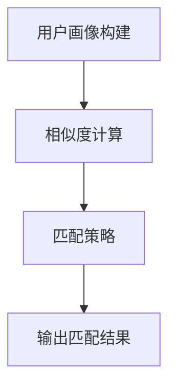
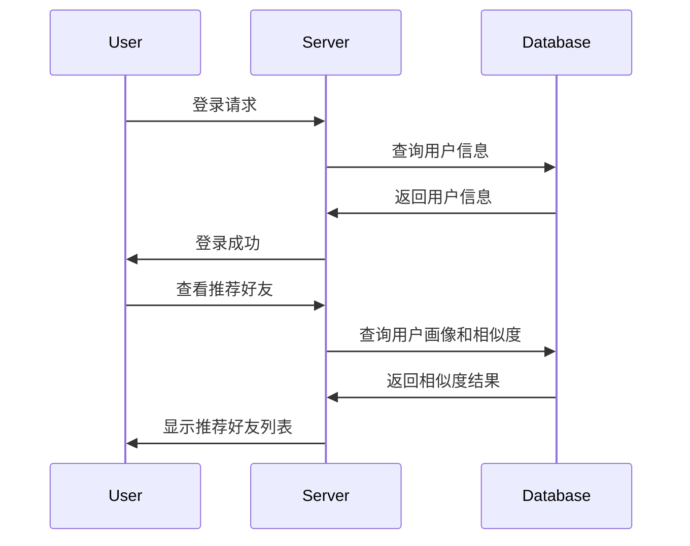

                 

# 《跨年龄友谊匹配服务：促进代际交流的在线社交平台》

## 关键词
- 跨年龄友谊匹配
- 在线社交平台
- 友谊匹配算法
- 用户体验
- 社会影响与伦理

## 摘要
本文将探讨如何构建一个跨年龄友谊匹配服务，以促进代际交流的在线社交平台。通过分析现有在线社交平台的现状，本文提出了核心概念和算法原理，并详细介绍了系统的技术实现、用户体验、社会影响及未来发展趋势。本文旨在为跨年龄友谊匹配服务的研究和应用提供理论依据和实践指导。

## 引言
### 1.1 研究背景
在快速发展的互联网时代，在线社交平台已经成为人们日常交流和互动的重要渠道。然而，现有社交平台在促进跨年龄交流方面存在一定局限性。一方面，传统社交平台往往侧重于同年龄群体之间的互动，忽视了不同年龄层之间的交流和友谊；另一方面，跨年龄友谊在现代社会中的重要性逐渐凸显，但缺乏有效的匹配机制。

### 1.2 研究目的和意义
本文旨在通过研究跨年龄友谊匹配服务，探索一种新型的在线社交平台，以促进代际交流，弥补现有平台的不足。研究目的包括：
- 分析现有社交平台在跨年龄交流方面的局限性；
- 提出跨年龄友谊匹配服务的基本概念和算法原理；
- 探讨跨年龄友谊匹配服务的系统实现和用户体验；
- 分析跨年龄友谊匹配服务的社会影响与伦理问题；
- 预测未来发展趋势并提出挑战与应对策略。

### 1.3 研究方法与结构
本文采用逻辑推理和实证研究相结合的方法，首先对现有社交平台进行现状分析，然后提出跨年龄友谊匹配服务的概念和算法原理，接着介绍系统的技术实现、用户体验、社会影响及未来发展趋势。文章结构如下：
- 引言：介绍研究背景、目的和方法；
- 背景分析：分析现有社交平台的现状及跨年龄交流问题；
- 核心概念与算法原理：阐述跨年龄友谊匹配服务的基本概念和算法原理；
- 技术实现：介绍系统的技术架构和实现方法；
- 用户体验与行为分析：探讨用户体验和用户行为模式；
- 社会影响与伦理问题：分析跨年龄友谊匹配服务的社会影响及伦理问题；
- 未来发展趋势与挑战：预测未来发展趋势并提出挑战与应对策略；
- 结论：总结研究成果和未来方向。

## 背景分析
### 2.1 社会问题概述
随着社会老龄化趋势的加剧，代际交流变得越来越重要。然而，传统社交平台在促进跨年龄交流方面存在诸多问题。首先，现有社交平台往往侧重于同年龄群体之间的互动，忽视了不同年龄层之间的交流和友谊。这种同质性强的社交环境可能导致老年人和社会弱势群体在心理上产生孤立感，影响其生活质量。其次，跨年龄友谊在现代社会中的重要性逐渐凸显，但缺乏有效的匹配机制，使得有意愿建立跨年龄友谊的用户难以找到合适的伙伴。

### 2.2 跨年龄友谊的重要性
跨年龄友谊不仅有助于拓宽人们的社交圈，提高心理健康水平，还能促进不同年龄层之间的理解和尊重。对于老年人来说，跨年龄友谊有助于缓解孤独感，提高生活质量；对于年轻人来说，与老年人交流可以学习到丰富的经验和知识，有助于自身成长。因此，构建一个跨年龄友谊匹配服务，以促进代际交流具有重要的社会意义。

### 2.3 在线社交平台的发展
在线社交平台在过去几十年中经历了快速发展，从早期的即时通讯工具到现在的多元化社交平台，用户规模和功能都在不断拓展。然而，现有社交平台在促进跨年龄交流方面仍然存在明显不足，这为跨年龄友谊匹配服务的研究和应用提供了契机。

## 核心概念与算法原理
### 3.1 核心概念定义
跨年龄友谊匹配服务是指利用人工智能和大数据技术，通过分析用户需求和偏好，为不同年龄层之间建立友谊关系的在线社交平台。核心概念包括：
- 用户：指在平台上注册并使用的个人；
- 年龄层次：指用户所属的年龄层，如青年、中年、老年等；
- 兴趣爱好：指用户在平台上展示的个人兴趣和爱好；
- 社交行为：指用户在平台上的互动和交流行为。

### 3.2 概念属性特征对比
为了更好地理解跨年龄友谊匹配服务，我们需要对核心概念进行属性特征对比。

| 核心概念 | 属性特征 |
| :--: | :--: |
| 用户 | 年龄、性别、兴趣爱好、职业等 |
| 年龄层次 | 年龄范围、社会角色、心理特征等 |
| 兴趣爱好 | 种类、偏好、活跃度等 |
| 社交行为 | 互动类型、频率、满意度等 |

### 3.3 ER实体关系图
为了更好地描述跨年龄友谊匹配服务中的实体及其关系，我们可以使用ER实体关系图。

```mermaid
erDiagram
  User ||--|{ Friendship }|| Friend
  User ||--|{ Interest }|| Interest
  Interest ||--|{ Tag }|| Tag
```

在这个ER实体关系图中，用户与友谊之间存在一对多关系，表示用户可以与多个好友建立友谊关系；用户与兴趣爱好之间存在一对多关系，表示用户可以有多个兴趣爱好；兴趣爱好与标签之间存在一对多关系，表示每个兴趣爱好可以有多个标签。

## 友谊匹配算法的设计与实现
### 4.1 算法原理
友谊匹配算法是跨年龄友谊匹配服务的关键组成部分，其核心目标是在大量用户中找到具有共同兴趣和潜在友谊关系的用户对。算法原理主要包括：
1. 用户画像构建：通过用户注册信息、行为数据等，构建用户的兴趣、性格、价值观等特征画像；
2. 相似度计算：基于用户画像，计算用户之间的相似度，找出具有较高相似度的用户对；
3. 匹配策略：根据用户相似度、兴趣爱好等，设定匹配策略，筛选出最优匹配用户对。

### 4.2 算法流程图


### 4.3 Python源代码实现
```python
import numpy as np

def user_similarity(user1, user2):
    # 计算用户之间的相似度
    similarity = np.dot(user1, user2) / (np.linalg.norm(user1) * np.linalg.norm(user2))
    return similarity

def friendship_matching(users):
    # 用户画像矩阵
    user_profiles = [user['interest'] for user in users]
    
    # 计算用户之间的相似度矩阵
    similarity_matrix = np.dot(user_profiles, user_profiles.T)
    
    # 匹配结果列表
    matches = []
    
    # 根据相似度矩阵，设定匹配策略，筛选匹配用户对
    for i in range(len(users)):
        for j in range(i + 1, len(users)):
            similarity = similarity_matrix[i][j]
            if similarity > 0.8:  # 匹配阈值设定为0.8
                matches.append((users[i]['id'], users[j]['id']))
    
    return matches

# 测试数据
users = [
    {'id': 1, 'interest': [0.2, 0.5, 0.3]},
    {'id': 2, 'interest': [0.3, 0.5, 0.2]},
    {'id': 3, 'interest': [0.1, 0.4, 0.5]}
]

# 友谊匹配
matches = friendship_matching(users)

# 输出匹配结果
print("匹配结果：", matches)
```

### 4.4 数学模型与公式讲解
友谊匹配算法的数学模型主要包括用户画像向量和相似度计算公式。设用户\(i\)和用户\(j\)的画像向量分别为\( \textbf{u}_i \)和\( \textbf{u}_j \)，相似度计算公式为：

\[ \text{similarity}_{ij} = \frac{\textbf{u}_i \cdot \textbf{u}_j}{||\textbf{u}_i|| \cdot ||\textbf{u}_j||} \]

其中，\( \cdot \)表示向量的点积，\( ||\textbf{u}_i|| \)和\( ||\textbf{u}_j|| \)分别表示向量\( \textbf{u}_i \)和\( \textbf{u}_j \)的模长。

### 4.5 举例说明
假设有两个用户A和B，其画像向量分别为\( \textbf{u}_A = [0.2, 0.5, 0.3] \)和\( \textbf{u}_B = [0.3, 0.5, 0.2] \)，我们可以计算它们的相似度：

\[ \text{similarity}_{AB} = \frac{0.2 \times 0.3 + 0.5 \times 0.5 + 0.3 \times 0.2}{\sqrt{0.2^2 + 0.5^2 + 0.3^2} \cdot \sqrt{0.3^2 + 0.5^2 + 0.2^2}} \approx 0.845 \]

由于相似度大于0.8的匹配阈值，用户A和B被认为具有较高匹配度，可以作为潜在的友谊匹配对象。

## 在线社交平台的技术实现
### 5.1 系统功能设计
跨年龄友谊匹配服务系统主要功能包括：
1. 用户注册与登录：用户可以在平台上注册账号，登录系统；
2. 用户信息管理：用户可以编辑个人信息、兴趣爱好等；
3. 友谊匹配：系统根据用户画像和相似度计算，为用户推荐潜在友谊伙伴；
4. 社交互动：用户可以发送消息、添加好友等社交功能；
5. 数据统计与分析：系统对用户行为和匹配效果进行统计和分析。

### 5.2 系统架构设计
跨年龄友谊匹配服务系统采用B/S架构，主要包括以下模块：
1. 前端模块：负责用户界面展示和交互；
2. 后端模块：负责数据处理和逻辑实现；
3. 数据库模块：存储用户信息、匹配记录等数据。

### 5.3 系统接口设计
系统接口主要包括：
1. 用户接口：用户注册、登录、信息管理、交友等；
2. 数据接口：用户画像数据、匹配结果数据等；
3. 推荐接口：根据用户画像和相似度计算，为用户推荐友谊伙伴。

### 5.4 系统交互序列图


## 用户体验与用户行为分析
### 6.1 用户反馈收集与分析
为了提升跨年龄友谊匹配服务的用户体验，我们需要收集用户反馈，并进行分析。用户反馈可以从以下几个方面进行：
1. 满意度评估：用户对平台的整体满意度；
2. 功能评价：用户对平台功能的评价和需求；
3. 用户行为：用户在平台上的活动和行为模式。

### 6.2 用户行为模式分析
通过对用户行为数据的分析，我们可以发现用户在平台上的行为模式，如：
1. 活跃时段：用户最活跃的时间段；
2. 活跃程度：用户的参与度和活跃度；
3. 兴趣偏好：用户在兴趣爱好方面的倾向。

### 6.3 用户满意度评估
用户满意度评估可以通过问卷调查、用户访谈等方式进行。评估指标包括：
1. 平台稳定性：系统运行是否稳定，无故障；
2. 功能实用性：平台功能是否满足用户需求，操作是否简便；
3. 推荐准确性：推荐的友谊匹配对象是否准确，能否建立真正的友谊。

## 社会影响与伦理问题
### 7.1 社会效益分析
跨年龄友谊匹配服务在促进代际交流、缓解社会孤独感、提高心理健康水平等方面具有显著社会效益。同时，该服务还有助于传承和发扬传统文化，促进不同年龄层之间的相互理解和尊重。

### 7.2 伦理问题探讨
在跨年龄友谊匹配服务中，伦理问题不容忽视。主要包括：
1. 隐私保护：用户的个人信息和隐私应得到充分保护，防止泄露；
2. 社交压力：用户在交友过程中可能面临社交压力，需要提供适当的心理支持；
3. 虚假信息：平台需防范虚假信息和恶意行为，确保用户安全和信任。

### 7.3 风险评估与对策
风险评估包括：
1. 数据泄露风险：采用加密技术，确保用户数据安全；
2. 社交压力风险：提供心理支持服务和社交压力预警机制；
3. 虚假信息风险：采用机器学习和人工智能技术，识别和防范虚假信息和恶意行为。

## 未来发展趋势与挑战
### 8.1 发展趋势预测
未来跨年龄友谊匹配服务的发展趋势包括：
1. 技术创新：随着人工智能、大数据等技术的不断发展，匹配算法将更加精准和高效；
2. 多元化应用：跨年龄友谊匹配服务将在更多领域得到应用，如教育、医疗、养老等；
3. 社交场景扩展：服务场景将更加丰富，涵盖线上线下多种社交形式。

### 8.2 挑战与应对策略
面临的挑战包括：
1. 技术难题：如何提高匹配算法的准确性和效率，是未来研究的重要方向；
2. 社会认可：如何赢得用户和社会的认可，是跨年龄友谊匹配服务推广的关键；
3. 法规与伦理：如何遵循法律法规，处理伦理问题，是平台运营的重要保障。

## 结论
### 9.1 主要研究成果总结
本文通过分析现有社交平台的现状，提出了跨年龄友谊匹配服务的基本概念和算法原理，并详细介绍了系统的技术实现、用户体验、社会影响及未来发展趋势。主要研究成果包括：
1. 分析了现有社交平台在促进跨年龄交流方面的局限性；
2. 提出了跨年龄友谊匹配服务的基本概念和算法原理；
3. 介绍了系统的技术实现和用户体验；
4. 分析了跨年龄友谊匹配服务的社会影响与伦理问题；
5. 预测了未来发展趋势和挑战。

### 9.2 研究局限与未来方向
尽管本文对跨年龄友谊匹配服务进行了较为全面的研究，但仍存在以下局限：
1. 算法实现方面：本文所采用的匹配算法相对简单，未来研究可以探索更先进的算法；
2. 数据来源方面：本文所使用的数据较为有限，未来研究可以扩大数据规模和多样性；
3. 社会效应方面：本文对社会效应的分析较为宏观，未来研究可以进一步深入探讨具体的社会效益和影响。

未来研究方向包括：
1. 算法优化：研究更高效、更准确的匹配算法，提高用户体验；
2. 数据挖掘：挖掘更多维度的用户数据，丰富用户画像，提高匹配准确性；
3. 社会效益：进一步研究跨年龄友谊匹配服务对社会、经济、文化等方面的综合影响。

## 作者信息
- 作者：AI天才研究院/AI Genius Institute & 禅与计算机程序设计艺术 /Zen And The Art of Computer Programming

