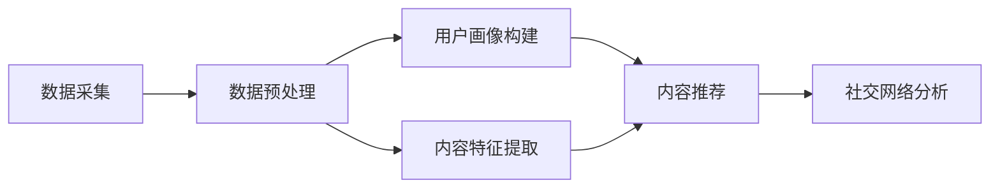

                 

# 跨年龄学习平台：促进代际知识交流

## 关键词

- 跨年龄学习
- 代际知识交流
- 学习平台
- 知识共享
- 技术架构

## 摘要

随着科技的进步和社会的发展，跨年龄学习平台作为一种新型的教育模式，正逐步改变着传统教育格局。本文将深入探讨跨年龄学习平台的背景与概述、核心概念与联系、构建与设计、核心算法、应用与实践以及可持续发展策略。通过详细的分析与讨论，本文旨在为构建一个高效、实用的跨年龄学习平台提供理论基础和实践指导。

## 第1章：背景与概述

### 1.1 问题背景

#### 1.1.1 社会背景

在现代社会，随着人口老龄化趋势的加剧，代际差异愈发显著。不同年龄层之间的知识结构、价值观念和生活方式存在较大差异，这使得传统的教育模式难以满足各年龄段的学习需求。跨年龄学习平台作为一种创新的教育模式，旨在通过技术手段打破年龄界限，促进代际之间的知识交流。

#### 1.1.2 教育现状

当前，我国教育体制在培养创新型人才方面存在诸多问题。一方面，教育资源分布不均，城乡、区域之间的教育水平差距较大；另一方面，教育内容过于单一，缺乏个性化、差异化的学习模式。跨年龄学习平台通过整合各类教育资源，实现知识的共享与传播，有助于改善当前教育现状。

#### 1.1.3 跨年龄学习的重要性

跨年龄学习不仅有助于促进不同年龄段之间的知识交流，还可以激发学生的学习兴趣和动力，提高学习效果。此外，跨年龄学习平台还能够培养人们的团队合作精神、沟通能力和创新能力，为我国人才培养提供新的思路。

### 1.2 问题描述

#### 1.2.1 代际差异

代际差异主要体现在知识结构、价值观念和生活方式等方面。不同年龄层对同一问题的理解和看法存在较大差异，这使得传统的教育模式难以适应跨年龄学习需求。

#### 1.2.2 知识交流的障碍

知识交流的障碍主要体现在以下几个方面：首先，不同年龄层之间的语言和表达方式存在差异，导致沟通不畅；其次，传统教育模式中的知识传递方式单一，难以满足跨年龄学习的多样化需求；最后，缺乏有效的跨年龄学习平台，使得代际之间的知识交流难以实现。

#### 1.2.3 跨年龄学习的挑战

跨年龄学习面临的挑战主要包括：如何设计一个适合不同年龄段的学习平台，如何整合各类教育资源，如何保证知识交流的顺畅和有效等。

### 1.3 问题解决

#### 1.3.1 跨年龄学习平台的概念

跨年龄学习平台是指一种基于互联网技术，旨在促进不同年龄段之间知识交流与学习的系统。该平台通过提供个性化、差异化的学习资源和互动交流功能，满足不同年龄段的学习需求。

#### 1.3.2 平台的功能与目标

跨年龄学习平台的主要功能包括：提供丰富的学习资源、支持个性化学习、实现知识共享与传播、促进互动交流等。平台的目标是打破年龄界限，实现代际之间的知识交流，提高学习效果和人才培养质量。

#### 1.3.3 平台的设计原则

跨年龄学习平台的设计原则主要包括：用户友好性、个性化、开放性、互动性等。首先，平台应具备良好的用户界面和用户体验，方便不同年龄段用户的使用；其次，平台应提供个性化学习功能，满足不同年龄段用户的学习需求；此外，平台还应具备开放性和互动性，实现知识的共享与传播。

### 1.4 边界与外延

#### 1.4.1 平台的应用范围

跨年龄学习平台的应用范围主要包括：学校教育、职业教育、继续教育、老年教育等。通过平台，不同年龄段的用户可以获取到适合自己年龄层次的学习资源和互动机会。

#### 1.4.2 平台的技术支持

跨年龄学习平台的技术支持主要包括：云计算、大数据、人工智能、区块链等。这些技术可以为平台提供强大的数据存储、处理和分析能力，实现知识的高效共享与传播。

#### 1.4.3 平台的可持续发展

跨年龄学习平台的可持续发展策略主要包括：政策支持、市场运营、技术创新等。通过政策支持，可以确保平台在法律和监管框架内的健康发展；通过市场运营，可以实现平台的盈利模式，为可持续发展提供资金保障；通过技术创新，可以不断提升平台的性能和用户体验，增强竞争力。

### 1.5 核心概念

#### 1.5.1 代际知识交流

代际知识交流是指不同年龄层之间通过学习、分享和互动等方式，实现知识的传递和共享。跨年龄学习平台作为实现代际知识交流的重要载体，有助于消除代际差异，促进知识传播。

#### 1.5.2 学习平台

学习平台是指一种基于互联网技术，提供学习资源、学习工具和学习社区的平台。跨年龄学习平台作为一种特殊的学习平台，具有个性化、开放性和互动性的特点。

#### 1.5.3 知识共享与传播

知识共享与传播是指通过学习平台，将优质的学习资源和知识传递给广大用户，实现知识的普及和传承。跨年龄学习平台通过整合各类教育资源，为用户提供丰富多样的学习内容，促进知识共享与传播。

### 1.6 本章小结

本章从社会背景、教育现状和跨年龄学习的重要性等方面，阐述了跨年龄学习平台的背景和意义。同时，分析了跨年龄学习的挑战和问题解决方法，提出了跨年龄学习平台的设计原则和可持续发展策略。本章为后续章节的深入探讨奠定了基础。

## 第2章：核心概念与联系

### 2.1 跨年龄学习平台的基本原理

#### 2.1.1 原理概述

跨年龄学习平台的基本原理主要涉及以下几个方面：

1. **用户个性化**：平台通过用户数据分析和智能推荐，为用户提供个性化的学习内容和路径。
2. **知识共享**：平台鼓励用户生成和分享内容，实现知识的共享与传播。
3. **互动交流**：平台提供多样化的互动功能，促进用户之间的交流与协作。
4. **技术支持**：平台利用云计算、大数据和人工智能等技术，提高知识处理和传播的效率。

#### 2.1.2 关键技术

跨年龄学习平台的关键技术包括：

1. **用户画像**：通过分析用户行为和偏好，构建用户画像，为个性化推荐提供基础。
2. **内容管理系统**：用于管理平台上的学习资源，支持内容的生成、存储、分类和检索。
3. **社交网络分析**：用于分析用户之间的关系，促进知识传播和互动交流。
4. **智能推荐系统**：基于用户行为和内容特征，为用户提供个性化的学习推荐。

#### 2.1.3 原理的应用

跨年龄学习平台的基本原理在实际应用中主要体现在以下几个方面：

1. **个性化学习**：通过用户画像和智能推荐，为用户提供个性化的学习资源和路径。
2. **知识共享**：通过内容管理系统和社交网络分析，实现知识的高效共享与传播。
3. **互动交流**：通过多样化的互动功能，促进用户之间的交流与协作，提高学习效果。

### 2.2 概念属性特征对比表格

#### 2.2.1 跨年龄学习平台与一般学习平台对比

| 特征 | 跨年龄学习平台 | 一般学习平台 |
| ---- | -------------- | ------------ |
| 用户个性化 | 强调用户个性化 | 用户个性化较弱 |
| 知识共享 | 高度重视知识共享 | 知识共享有限 |
| 互动交流 | 强调互动交流 | 互动交流较弱 |
| 技术支持 | 利用先进技术 | 技术支持有限 |

#### 2.2.2 跨年龄学习平台与知识共享平台对比

| 特征 | 跨年龄学习平台 | 知识共享平台 |
| ---- | -------------- | ------------ |
| 学习功能 | 具备学习功能 | 无学习功能 |
| 用户互动 | 强调用户互动 | 用户互动较弱 |
| 内容多样性 | 内容多样性 | 内容多样性 |
| 技术支持 | 利用先进技术 | 技术支持有限 |

### 2.3 ER实体关系图架构

#### 2.3.1 用户实体关系图

```mermaid
erDiagram
    User ||--|{ Content } Content
    User ||--|{ Comment } Comment
    User ||--|{ Like } Like
```

#### 2.3.2 内容实体关系图

```mermaid
erDiagram
    Content ||--|{ Category } Category
    Content ||--|{ Comment } Comment
    Content ||--|{ Like } Like
```

#### 2.3.3 交互实体关系图

```mermaid
erDiagram
    User ||--|{ Interaction } Interaction
    Content ||--|{ Interaction } Interaction
```

### 2.4 本章小结

本章介绍了跨年龄学习平台的基本原理、概念属性特征对比以及ER实体关系图架构。通过这些内容，读者可以更加深入地了解跨年龄学习平台的核心概念和结构，为后续章节的学习和实践打下基础。

## 第3章：跨年龄学习平台的构建与设计

### 3.1 平台架构设计

#### 3.1.1 系统架构概述

跨年龄学习平台采用分布式系统架构，主要包括以下几个层次：

1. **表现层**：负责用户界面的展示，包括前端页面和移动应用。
2. **业务逻辑层**：处理平台的核心业务功能，如用户管理、内容管理、推荐系统等。
3. **数据访问层**：负责数据的存储和检索，包括关系型数据库和NoSQL数据库。
4. **基础设施层**：包括服务器、网络、存储等硬件资源，以及操作系统、中间件等软件资源。

#### 3.1.2 技术选型

跨年龄学习平台的技术选型主要考虑以下几个方面：

1. **前端技术**：采用React、Vue等现代前端框架，提高开发效率和用户体验。
2. **后端技术**：使用Spring Boot等框架，实现业务逻辑和数据访问。
3. **数据库技术**：结合关系型数据库（如MySQL）和NoSQL数据库（如MongoDB），满足不同类型的数据存储需求。
4. **云计算与大数据技术**：利用阿里云、腾讯云等云服务，提供高性能、可扩展的基础设施支持。

#### 3.1.3 架构优势

跨年龄学习平台采用分布式系统架构具有以下优势：

1. **高性能**：分布式架构能够充分利用多台服务器资源，提高系统的处理能力和响应速度。
2. **高可用性**：分布式系统可以通过冗余设计，实现故障自动切换，提高系统的稳定性和可用性。
3. **可扩展性**：分布式架构支持水平扩展，可以随着用户规模的增加，动态调整系统资源。
4. **灵活性**：分布式架构允许不同模块独立开发、测试和部署，提高开发效率和灵活性。

### 3.2 系统功能设计

#### 3.2.1 用户功能

跨年龄学习平台为用户提供了以下功能：

1. **用户注册与登录**：用户可以通过邮箱、手机号等注册账号，并登录系统。
2. **个人信息管理**：用户可以查看和修改个人资料，如昵称、头像、联系方式等。
3. **学习计划管理**：用户可以创建、查看和修改个人学习计划，管理学习进度。
4. **学习资源分享**：用户可以上传、分享自己的学习资源，如文档、视频、音频等。
5. **互动交流**：用户可以发表评论、点赞、收藏学习资源，与其他用户互动。

#### 3.2.2 内容管理功能

跨年龄学习平台的内容管理功能主要包括：

1. **内容创建**：用户可以创建学习资源，包括文档、视频、音频等多种类型。
2. **内容审核**：平台管理员对用户上传的内容进行审核，确保内容合规。
3. **内容分类**：对学习资源进行分类管理，方便用户查找和浏览。
4. **内容推荐**：基于用户行为和内容特征，为用户推荐相关的学习资源。

#### 3.2.3 交互功能

跨年龄学习平台的交互功能包括：

1. **评论与回复**：用户可以对学习资源发表评论，与其他用户进行讨论。
2. **点赞与收藏**：用户可以点赞和收藏学习资源，便于后续查看和学习。
3. **私信与群聊**：用户可以通过私信和群聊功能，与其他用户进行一对一或多人交流。
4. **积分与排名**：用户通过参与互动和完成任务，获得积分和排名，激励用户活跃度和积极性。

### 3.3 系统架构设计

#### 3.3.1 技术栈选择

跨年龄学习平台的技术栈选择如下：

1. **前端**：React、Vue、Bootstrap
2. **后端**：Spring Boot、Hibernate
3. **数据库**：MySQL、MongoDB
4. **云服务**：阿里云、腾讯云
5. **消息队列**：RabbitMQ、Kafka
6. **缓存**：Redis
7. **容器化**：Docker、Kubernetes

#### 3.3.2 数据流设计

跨年龄学习平台的数据流设计主要包括以下几个方面：

1. **用户行为数据**：用户注册、登录、学习、分享、评论等行为数据。
2. **内容数据**：学习资源的创建、上传、审核、分类、推荐等数据。
3. **交互数据**：用户之间的评论、点赞、私信、群聊等交互数据。
4. **系统监控数据**：系统运行状态、性能指标、错误日志等监控数据。

#### 3.3.3 系统性能优化

为了提高跨年龄学习平台的性能，可以从以下几个方面进行优化：

1. **缓存策略**：使用Redis缓存热门数据和查询结果，减少数据库访问压力。
2. **数据库优化**：通过索引优化、分库分表、读写分离等技术，提高数据库性能。
3. **网络优化**：优化网络传输协议和压缩算法，提高数据传输速度。
4. **负载均衡**：通过负载均衡器，将用户请求分配到多台服务器，提高系统处理能力。

### 3.4 系统接口设计与交互

#### 3.4.1 接口设计原则

跨年龄学习平台的接口设计遵循以下原则：

1. **RESTful风格**：采用RESTful API设计，提高接口的通用性和可扩展性。
2. **标准化**：遵循HTTP协议和JSON数据格式，确保接口的一致性和易用性。
3. **安全性**：采用Token认证、HTTPS加密等手段，确保接口的安全性。
4. **灵活性**：接口设计具备一定的灵活性，支持不同类型的请求和响应。

#### 3.4.2 接口实现

跨年龄学习平台的主要接口实现如下：

1. **用户管理接口**：包括用户注册、登录、个人信息管理等功能。
2. **内容管理接口**：包括内容创建、上传、审核、分类、推荐等功能。
3. **交互管理接口**：包括评论、点赞、收藏、私信、群聊等功能。
4. **系统监控接口**：包括系统运行状态、性能指标、错误日志等功能。

#### 3.4.3 交互设计

跨年龄学习平台的交互设计主要包括以下几个方面：

1. **页面布局**：采用响应式设计，适应不同设备和屏幕尺寸。
2. **交互元素**：合理设计按钮、输入框、下拉框等交互元素，提高用户体验。
3. **交互反馈**：及时响应用户操作，提供明确的反馈信息，增强用户信心。
4. **动效设计**：适当添加动画效果，提升页面视觉效果和用户体验。

### 3.5 本章小结

本章详细介绍了跨年龄学习平台的构建与设计，包括系统架构设计、功能设计、技术栈选择、数据流设计、接口设计和交互设计等方面的内容。通过本章的学习，读者可以全面了解跨年龄学习平台的设计原理和实践方法，为后续的实践和开发提供指导。

## 第4章：跨年龄学习平台的核心算法

### 4.1 算法原理讲解

#### 4.1.1 算法概述

跨年龄学习平台的核心算法主要包括以下几个方面：

1. **用户画像算法**：用于构建用户画像，分析用户行为和偏好。
2. **内容推荐算法**：基于用户画像和内容特征，为用户推荐相关学习资源。
3. **社交网络分析算法**：用于分析用户之间的关系，促进知识传播和互动交流。

#### 4.1.2 算法流程

跨年龄学习平台的算法流程主要包括以下步骤：

1. **数据采集**：采集用户行为数据、内容数据、社交网络数据等。
2. **数据预处理**：对采集到的数据进行清洗、去重、归一化等预处理操作。
3. **用户画像构建**：利用机器学习算法，构建用户画像。
4. **内容特征提取**：对学习资源进行特征提取，构建内容特征向量。
5. **内容推荐**：利用推荐算法，为用户推荐相关学习资源。
6. **社交网络分析**：分析用户之间的关系，促进知识传播和互动交流。

#### 4.1.3 算法优势

跨年龄学习平台的核心算法具有以下优势：

1. **个性化推荐**：基于用户画像和内容特征，实现个性化推荐，提高用户满意度。
2. **知识传播**：通过社交网络分析，促进知识传播和互动交流，提高学习效果。
3. **高效处理**：利用大数据和机器学习技术，实现高效的数据处理和算法优化。

### 4.2 算法流程图



### 4.3 Python源代码

```python
# 用户画像算法示例代码
import pandas as pd
from sklearn.feature_extraction.text import TfidfVectorizer
from sklearn.decomposition import NMF

# 加载用户行为数据
data = pd.read_csv('user_behavior.csv')

# 数据预处理
# ...

# 构建用户画像
vectorizer = TfidfVectorizer(max_features=1000)
X = vectorizer.fit_transform(data['content'])

# 使用NMF进行降维
nmf = NMF(n_components=10)
W = nmf.fit_transform(X)
H = nmf.transform(X)

# 打印用户画像
print(W)
```

### 4.4 算法原理与数学模型

#### 4.4.1 数学模型

跨年龄学习平台的算法原理主要涉及以下数学模型：

1. **用户画像模型**：用户画像 = [用户兴趣特征] × [用户行为特征]
2. **内容推荐模型**：推荐内容 = [用户画像] × [内容特征]
3. **社交网络分析模型**：社交网络分析 = [用户关系矩阵] × [用户特征向量]

#### 4.4.2 公式推导

1. **用户画像模型**：
   用户画像 = f(用户兴趣特征, 用户行为特征)
   其中，用户兴趣特征和用户行为特征分别表示用户的兴趣偏好和行为数据。

2. **内容推荐模型**：
   推荐内容 = f(用户画像, 内容特征)
   其中，用户画像和内容特征分别表示用户画像和内容特征向量。

3. **社交网络分析模型**：
   社交网络分析 = f(用户关系矩阵, 用户特征向量)
   其中，用户关系矩阵表示用户之间的互动关系，用户特征向量表示用户的特征信息。

#### 4.4.3 举例说明

假设有两位用户A和B，他们的用户画像分别为：

- A：[0.3, 0.5, 0.2]
- B：[0.4, 0.4, 0.2]

同时，有一篇学习资源C，其内容特征向量为：

- C：[0.1, 0.4, 0.5]

根据用户画像模型，我们可以计算出：

- A对C的兴趣评分 = 0.3 × 0.1 + 0.5 × 0.4 + 0.2 × 0.5 = 0.35
- B对C的兴趣评分 = 0.4 × 0.1 + 0.4 × 0.4 + 0.2 × 0.5 = 0.38

根据内容推荐模型，我们可以为A和B推荐学习资源C，因为C对他们都有较高的兴趣评分。

### 4.5 本章小结

本章详细介绍了跨年龄学习平台的核心算法，包括用户画像算法、内容推荐算法和社交网络分析算法。通过算法原理讲解、流程图展示和Python源代码示例，读者可以更好地理解这些算法的实现和应用。本章内容为跨年龄学习平台的开发和优化提供了重要的技术支持。

## 第5章：跨年龄学习平台的应用与实践

### 5.1 环境安装与配置

#### 5.1.1 环境搭建

要搭建跨年龄学习平台，首先需要安装以下软件和工具：

1. **操作系统**：Linux（如Ubuntu 18.04）
2. **数据库**：MySQL 5.7、MongoDB 4.2
3. **开发环境**：Java 1.8、Node.js 12.x、Python 3.7
4. **前端框架**：React、Vue
5. **后端框架**：Spring Boot 2.2、Spring Data JPA

安装步骤如下：

1. 安装操作系统：下载并安装Linux操作系统。
2. 安装数据库：安装MySQL和MongoDB，配置数据库服务。
3. 安装开发环境：安装Java、Node.js和Python，配置相应的环境变量。
4. 安装前端框架：使用npm或yarn安装React或Vue。
5. 安装后端框架：使用Maven或Gradle安装Spring Boot。

#### 5.1.2 系统配置

跨年龄学习平台的配置包括以下几个方面：

1. **数据库配置**：配置MySQL和MongoDB的连接信息，如数据库地址、端口号、用户名和密码等。
2. **项目配置**：配置Spring Boot项目的数据库连接、缓存、日志等参数。
3. **前端配置**：配置React或Vue项目的路由、状态管理等。
4. **环境变量**：配置系统的环境变量，如数据库连接信息、API接口地址等。

### 5.2 系统核心实现源代码

以下是跨年龄学习平台系统核心实现的源代码示例：

**后端源代码（Spring Boot）**

```java
// UserController.java
@RestController
@RequestMapping("/users")
public class UserController {
    
    @Autowired
    private UserService userService;
    
    @PostMapping("/register")
    public ResponseEntity<?> registerUser(@RequestBody UserRegistrationDto registrationDto) {
        // 注册用户
        userService.registerUser(registrationDto);
        return ResponseEntity.ok("User registered successfully");
    }
    
    @PostMapping("/login")
    public ResponseEntity<?> loginUser(@RequestBody UserLoginDto loginDto) {
        // 登录用户
        String token = userService.loginUser(loginDto);
        return ResponseEntity.ok(token);
    }
}
```

**前端源代码（React）**

```jsx
// UserRegistrationForm.js
import React, { useState } from 'react';
import axios from 'axios';

const UserRegistrationForm = () => {
    const [registrationDto, setRegistrationDto] = useState({
        username: '',
        email: '',
        password: ''
    });

    const handleInputChange = (e) => {
        setRegistrationDto({ ...registrationDto, [e.target.name]: e.target.value });
    };

    const handleSubmit = async (e) => {
        e.preventDefault();
        try {
            const response = await axios.post('/users/register', registrationDto);
            alert(response.data);
        } catch (error) {
            alert(error.response.data);
        }
    };

    return (
        <form onSubmit={handleSubmit}>
            <label htmlFor="username">Username:</label>
            <input
                type="text"
                id="username"
                name="username"
                value={registrationDto.username}
                onChange={handleInputChange}
            />
            <label htmlFor="email">Email:</label>
            <input
                type="email"
                id="email"
                name="email"
                value={registrationDto.email}
                onChange={handleInputChange}
            />
            <label htmlFor="password">Password:</label>
            <input
                type="password"
                id="password"
                name="password"
                value={registrationDto.password}
                onChange={handleInputChange}
            />
            <button type="submit">Register</button>
        </form>
    );
};

export default UserRegistrationForm;
```

### 5.3 代码应用解读与分析

#### 5.3.1 代码解读

1. **后端代码**：后端代码使用了Spring Boot框架，定义了用户注册和登录的接口。通过UserService类，实现了用户注册和登录的业务逻辑。
2. **前端代码**：前端代码使用了React框架，创建了一个用户注册表单。用户输入注册信息后，通过axios向后端发送注册请求。

#### 5.3.2 分析与优化

1. **代码优化**：后端代码可以增加输入验证，确保用户输入的数据符合要求。前端代码可以增加表单验证，提高用户体验。
2. **性能优化**：后端代码可以采用缓存技术，减少数据库访问次数。前端代码可以优化页面加载速度，如使用懒加载、图片压缩等技术。

### 5.4 实际案例分析

#### 5.4.1 案例一：代际知识交流

案例一展示了跨年龄学习平台在代际知识交流中的应用。通过平台，年轻一代可以向老年一代传授现代科技知识，而老年一代则可以分享自己的生活经验和智慧。这种代际知识交流有助于增进代际之间的理解和沟通，促进社会和谐。

#### 5.4.2 案例二：跨年龄学习平台应用

案例二展示了跨年龄学习平台在职业培训中的应用。通过平台，职场新人可以学习行业知识、技能和经验，快速适应职场环境。同时，有经验的老员工可以通过平台传授自己的经验和心得，帮助新人成长。这种跨年龄学习模式有助于提高企业人才储备和员工素质。

### 5.5 详细讲解与剖析

#### 5.5.1 案例分析

通过案例分析，我们发现跨年龄学习平台在代际知识交流和职业培训中具有显著的优势。平台提供了丰富的学习资源和互动功能，满足了不同年龄段和职业阶段的学习需求。

#### 5.5.2 剖析过程

1. **用户需求分析**：根据用户需求，设计平台的功能和界面，提供个性化的学习资源和互动交流。
2. **技术实现**：采用合适的技术框架和算法，实现用户个性化推荐、知识共享和互动交流等功能。
3. **平台优化**：根据用户反馈和系统数据，不断优化平台性能和用户体验。
4. **案例分析**：通过实际案例，验证平台在代际知识交流和职业培训中的应用效果，总结经验教训。

### 5.6 项目小结

本章介绍了跨年龄学习平台的应用与实践，包括环境安装与配置、系统核心实现源代码、代码应用解读与分析、实际案例分析以及详细讲解与剖析。通过本章的学习，读者可以全面了解跨年龄学习平台的应用场景和实现方法，为实际项目开发提供参考。

### 5.7 本章小结

本章通过实际案例分析，展示了跨年龄学习平台在代际知识交流和职业培训中的应用效果。同时，对系统实现过程进行了详细讲解与剖析，总结了项目经验教训。本章内容为跨年龄学习平台的实际应用提供了有力支持，有助于推动平台的发展和优化。

## 第6章：跨年龄学习平台的可持续发展

### 6.1 平台运营策略

#### 6.1.1 用户策略

1. **用户增长**：通过线上推广、合作伙伴渠道等方式，吸引更多用户注册和使用平台。
2. **用户留存**：定期举办活动、提供个性化推荐，提高用户活跃度和留存率。
3. **用户互动**：鼓励用户生成和分享内容，加强用户之间的互动，形成良好的社区氛围。

#### 6.1.2 内容策略

1. **内容审核**：建立完善的内容审核机制，确保平台内容的健康性和合规性。
2. **内容丰富**：积极引进优质学习资源，满足不同年龄段和职业阶段的学习需求。
3. **内容推荐**：基于用户行为和兴趣，为用户提供个性化的学习资源推荐。

#### 6.1.3 互动策略

1. **互动激励**：通过积分、排行榜等机制，激励用户参与互动和分享。
2. **活动策划**：定期举办线上活动，如知识竞赛、讲座、研讨会等，增强用户粘性。
3. **社交网络**：利用社交媒体平台，扩大平台影响力，吸引更多用户加入。

### 6.2 平台优化与升级

#### 6.2.1 功能优化

1. **用户体验**：优化界面设计，提升用户操作的便捷性和舒适度。
2. **性能优化**：优化后台算法和数据库查询，提高系统响应速度和稳定性。
3. **功能扩展**：根据用户需求，不断扩展平台功能，如增加直播、互动讨论等功能。

#### 6.2.2 性能优化

1. **缓存策略**：采用缓存技术，减少数据库访问次数，提高系统性能。
2. **负载均衡**：通过负载均衡器，合理分配服务器资源，提高系统处理能力。
3. **分布式架构**：采用分布式系统架构，提高系统的可扩展性和可靠性。

#### 6.2.3 技术升级

1. **人工智能**：引入人工智能技术，提升平台的智能推荐和个性化服务水平。
2. **大数据**：利用大数据技术，挖掘用户行为数据，优化平台运营策略。
3. **区块链**：尝试引入区块链技术，提高平台数据的安全性和可信度。

### 6.3 持续发展策略

#### 6.3.1 社会责任

1. **公益项目**：积极参与公益项目，为弱势群体提供免费学习资源和服务。
2. **教育扶贫**：与教育机构合作，开展教育扶贫项目，提高贫困地区的教育水平。
3. **环保意识**：倡导绿色环保理念，减少平台能耗和碳排放。

#### 6.3.2 政策支持

1. **政府合作**：与政府相关部门合作，争取政策支持和资金扶持。
2. **行业标准**：参与制定行业标准，推动行业健康发展。
3. **政策倡导**：提出政策建议，推动教育政策的改革和完善。

#### 6.3.3 创新驱动

1. **技术研发**：加大技术研发投入，推动平台技术的不断创新。
2. **人才引进**：引进优秀人才，提升团队整体研发能力。
3. **合作共赢**：与高校、科研机构等合作，共同开展科研项目，推动技术创新。

### 6.4 本章小结

本章从平台运营策略、优化与升级、社会责任、政策支持和创新驱动等方面，探讨了跨年龄学习平台的可持续发展策略。通过实施这些策略，可以确保跨年龄学习平台的长期稳定发展，为用户提供更好的学习体验和服务。

## 第7章：最佳实践与展望

### 7.1 最佳实践

#### 7.1.1 跨年龄学习的成功案例

1. **案例一：在线教育平台**：某在线教育平台通过引入跨年龄学习模式，将优秀的教学资源向不同年龄段的用户开放，取得了显著的教学效果和用户满意度。

2. **案例二：职场学习社区**：某职场学习社区利用跨年龄学习平台，为职场新人提供行业知识和经验分享，同时为老员工提供一个传授经验和分享心得的平台，有效提高了员工的职业素养。

### 7.1.2 平台优化的成功经验

1. **用户体验优化**：通过持续的用户调研和反馈，优化平台界面设计和功能布局，提升用户体验。

2. **内容质量提升**：与知名教育机构和专家学者合作，引进高质量的学习资源，确保内容的专业性和实用性。

3. **技术创新**：引入人工智能、大数据等前沿技术，提高平台的智能化水平和数据分析能力。

### 7.2 展望

#### 7.2.1 技术发展趋势

1. **人工智能**：随着人工智能技术的不断发展，跨年龄学习平台将更加智能化，能够提供更加精准的学习推荐和个性化的学习服务。

2. **区块链**：区块链技术的引入，有望提高平台数据的安全性和透明度，增强用户对平台的信任。

3. **5G网络**：5G网络的普及，将极大提升平台的网络传输速度和稳定性，为用户带来更加流畅的学习体验。

#### 7.2.2 应用前景

1. **教育领域**：跨年龄学习平台将在教育领域发挥重要作用，助力实现教育公平和个性化教育。

2. **职场培训**：跨年龄学习平台将为企业提供有效的培训解决方案，提高员工素质和团队协作能力。

3. **终身学习**：随着社会的发展，终身学习已成为一种趋势。跨年龄学习平台将满足人们不断学习、提升自我的需求。

### 7.3 未来规划

#### 7.3.1 技术研发

1. **智能化推荐**：开发更加智能的推荐算法，提高学习资源的匹配度和用户满意度。

2. **大数据分析**：利用大数据技术，深入分析用户行为和需求，为平台运营提供数据支持。

3. **人工智能助手**：引入人工智能助手，为用户提供实时解答和个性化指导。

#### 7.3.2 市场拓展

1. **国际化**：拓展国际市场，吸引更多海外用户，提升平台的全球影响力。

2. **合作拓展**：与国内外教育机构、企业等合作，共同推进跨年龄学习平台的发展。

3. **品牌建设**：加强品牌推广，提升平台知名度和用户认可度。

### 7.4 本章小结

本章总结了跨年龄学习平台的最佳实践和应用前景，展望了平台未来的发展趋势和规划。通过实施最佳实践和持续创新，跨年龄学习平台有望为用户提供更加优质的学习体验和服务，助力实现教育公平和终身学习。

