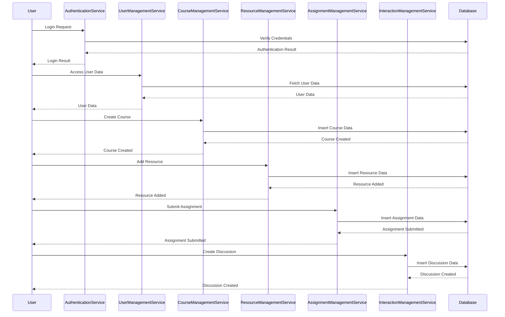

                 


### 引言与背景

随着信息时代的快速发展，教育领域正面临着前所未有的变革。在这个背景下，“跨年龄学习联盟：促进代际知识交流的教育网络”应运而生。本文旨在探讨这一新兴教育模式的概念、背景、重要性以及其在未来教育发展中的潜在影响。

#### 1.1 问题的提出与重要性

在教育领域，年龄差异一直是影响学习者参与和互动的一个重要因素。传统教育模式往往基于同年龄段学生的共性需求进行设计，忽视了不同年龄段学习者的独特需求。然而，现代社会的知识更新速度极快，不同年龄段的个体在知识积累、认知水平和兴趣爱好上存在显著差异。这种差异导致了知识传递和交流的障碍，影响了教育资源的有效利用。

“跨年龄学习联盟”的概念正是在这样的背景下提出的。它旨在打破年龄壁垒，促进不同年龄段个体之间的知识交流和共享。这种教育模式不仅能够满足不同年龄段学习者的个性化需求，还能够充分利用不同年龄段学习者的知识优势，实现知识的高效传递和整合。

#### 1.2 现有研究综述

尽管跨年龄学习在教育领域已有一定的研究基础，但大多数研究集中在理论探讨和实验验证上，实际应用案例相对较少。现有的研究成果表明，跨年龄学习有助于提高学习者的学习动机、促进深度学习和知识创新。然而，如何设计有效的跨年龄学习环境和教育网络，仍然是一个亟待解决的问题。

本文在综述现有研究成果的基础上，提出了“跨年龄学习联盟”的概念框架，并探讨了其在教育网络中的应用前景。通过引入先进的技术手段，如人工智能、大数据分析等，本文旨在为构建一个高效、智能的跨年龄学习联盟提供理论支持和实践指导。

#### 1.3 研究目标与内容框架

本文的研究目标主要包括：

1. 明确“跨年龄学习联盟”的定义和核心特征；
2. 分析跨年龄学习在实践中的应用挑战和解决方案；
3. 设计一个具有实际操作性的教育网络架构，以促进跨年龄学习的有效实施。

为实现上述目标，本文将分为以下章节：

- 引言与背景：介绍研究背景、问题和研究目标；
- 核心概念与联系：阐述“跨年龄学习联盟”的概念、特征和作用；
- 问题解决：分析跨年龄学习中的主要障碍和解决方案；
- 系统设计：提出教育网络架构的设计方案；
- 案例分析：通过具体案例展示跨年龄学习联盟的实际应用；
- 总结与展望：总结研究内容和成果，展望未来发展方向。

通过以上章节的逐步深入分析，本文旨在为跨年龄学习联盟在教育网络中的应用提供有价值的参考和启示。

### 核心概念与联系

在深入探讨“跨年龄学习联盟：促进代际知识交流的教育网络”这一主题时，我们需要首先明确几个核心概念，并探讨它们之间的联系。以下是关于“跨年龄学习联盟”的定义、属性、特点及其在教育网络中的核心作用的详细阐述。

#### 2.1 跨年龄学习联盟的定义

“跨年龄学习联盟”是一种新型的教育模式，它强调不同年龄段学习者之间的知识交流和互动。这种模式不仅涉及年轻的学习者，也包括年长的学习者，旨在通过整合不同年龄段的认知资源，实现知识的高效传递和共享。具体来说，跨年龄学习联盟可以定义为：

一个基于协作学习、知识共享和资源整合的教育网络，它将不同年龄段的学习者组织起来，通过技术手段和社交平台，实现知识和经验的交流与传递，从而促进个体和群体的共同成长。

#### 2.2 核心概念联系与模型构建

在构建跨年龄学习联盟的过程中，几个核心概念起着关键作用，包括学习者的个性化需求、教育资源的高效配置、学习环境的灵活性和互动性的增强等。这些概念相互关联，共同构成了跨年龄学习联盟的核心框架。

##### 2.2.1 概念属性特征对比表格

以下是一个对比表格，展示了跨年龄学习联盟中几个核心概念的属性特征：

| 概念       | 属性特征                                         | 作用                     |
|------------|--------------------------------------------------|--------------------------|
| 学习者需求 | 个性化、多样化、动态变化                         | 确定教育内容和方法的基础 |
| 教育资源   | 知识、技术、时间、空间                           | 教育联盟的核心资源       |
| 学习环境   | 灵活、开放、互动、支持个性化学习                  | 学习者的活动场所        |
| 互动性     | 多向、实时、异步、高效                           | 促进知识交流与共享       |

通过对比表格，我们可以清晰地看到这些概念在跨年龄学习联盟中的角色和重要性。

##### 2.2.2 ER实体关系图架构

为了更好地理解这些概念之间的联系，我们可以使用实体关系图（ER图）来描述它们之间的交互关系。以下是跨年龄学习联盟的ER实体关系图：

```mermaid
erDiagram
    User ||--|{ LearningNeed } : 需求
    User ||--|{ Resource } : 资源
    User ||--|{ LearningEnvironment } : 环境
    User ||--|{ Interaction } : 互动
    LearningNeed ||--|{ Resource } : 需求引导资源配置
    LearningEnvironment ||--|{ Interaction } : 环境影响互动
    Resource ||--|{ LearningNeed } : 资源满足需求
    Resource ||--|{ LearningEnvironment } : 资源支持环境
    Resource ||--|{ Interaction } : 资源促进互动
```

这个ER图展示了不同实体（学习者、需求、资源、环境和互动）之间的关联，以及它们在跨年龄学习联盟中的作用。通过这样的架构设计，我们可以更好地理解和设计一个有效的跨年龄学习联盟。

#### 2.3 核心概念在教育网络中的核心作用

跨年龄学习联盟的核心概念在教育网络中发挥着重要的作用：

- **学习者的个性化需求**：个性化需求是教育网络设计的出发点，它决定了教育内容和方法的定制化。通过了解不同年龄段学习者的需求，我们可以为他们提供更加适合的学习资源和环境。

- **教育资源的高效配置**：教育资源的高效配置是跨年龄学习联盟的核心，它涉及到知识、技术、时间和空间等多方面的资源。通过优化资源配置，我们可以最大限度地满足学习者的需求，提高教育的效率和质量。

- **学习环境的灵活性**：灵活的学习环境能够支持多样化的学习活动，满足不同年龄段学习者的需求。开放性和互动性是学习环境的关键特征，它们能够促进学习者之间的交流和知识共享。

- **互动性的增强**：互动性是跨年龄学习联盟的核心驱动力，它通过多向、实时和异步的互动方式，增强了学习者之间的知识传递和共享。

通过以上核心概念的深入探讨，我们可以更好地理解跨年龄学习联盟的概念框架及其在教育网络中的核心作用。在接下来的章节中，我们将进一步分析跨年龄学习中的问题解决、系统设计、案例分析和未来展望，为这一新兴教育模式提供更加全面的探讨和指导。

### 问题解决

在跨年龄学习联盟的实施过程中，面临的主要问题包括学习障碍、技术挑战和教育资源的分配等。以下是对这些问题的详细分析以及相应的解决方案。

#### 3.1 学习障碍分析

##### 3.1.1 不同年龄段学习者的需求

不同年龄段的学习者在知识需求、学习方式和兴趣爱好上存在显著差异。例如，年轻的学习者通常更注重实用技能和创新思维的培养，而年长的学习者则更关注知识的深入理解和应用。此外，不同年龄段的个体在认知水平、学习习惯和时间安排上也存在差异。这些需求差异导致了知识传递和交流的障碍。

##### 3.1.2 存在的障碍与挑战

1. **沟通障碍**：由于年龄差异，不同年龄段学习者之间的沟通可能存在障碍，导致知识传递不畅。例如，年长的学习者可能难以理解年轻人的流行文化和网络语言，而年轻人可能难以理解年长的学习者在某一领域的深厚经验。

2. **心理障碍**：年龄差异也可能导致心理障碍，如年长的学习者可能感到自己在知识水平上不如年轻人，从而产生自卑感；而年轻人则可能对年长的学习者持有不尊重的态度。

3. **技术障碍**：对于一些年长的学习者来说，掌握新技术和工具可能是一个挑战。这可能导致他们在使用教育网络平台时感到困惑和挫败。

4. **资源分配不均**：不同年龄段的学习者在教育资源（如时间、资金和知识资源）的分配上可能存在不均衡，这会影响他们参与跨年龄学习联盟的积极性。

#### 3.2 解决方案设计

##### 3.2.1 教育网络的架构设计

为了解决上述问题，我们需要设计一个灵活、高效的教育网络架构。这个架构应包括以下几个关键组成部分：

1. **个性化学习模块**：通过分析不同年龄段学习者的需求，系统可以根据学习者的个性化需求推荐适合的学习内容和资源。

2. **互动交流平台**：建立多向、实时和异步的互动交流平台，支持学习者之间的知识交流和共享。平台应提供多种互动方式，如讨论区、在线会议、实时问答等。

3. **技术支持与培训**：提供技术支持和培训，帮助年长的学习者掌握必要的技术工具和平台使用技巧。例如，可以通过开设在线课程、发布使用教程和提供一对一辅导等方式。

4. **教育资源库**：构建一个丰富的教育资源库，涵盖不同年龄段和领域的知识内容。资源库应支持多种检索和过滤方式，以便学习者能够快速找到所需资源。

##### 3.2.2 技术选型与功能模块

在技术选型方面，我们可以考虑以下工具和平台：

1. **人工智能与大数据分析**：利用人工智能和大数据分析技术，可以实现对学习者需求的精准分析和个性化推荐。例如，通过分析学习者的历史数据，系统可以推荐最适合他们的学习内容和资源。

2. **云计算与存储**：云计算技术可以提供强大的计算和存储能力，支持大规模教育数据的存储和处理。同时，云存储可以确保教育资源的可靠性和可访问性。

3. **社交网络平台**：选择适合的社交网络平台，如Facebook、微信等，可以支持学习者之间的互动和交流。这些平台通常提供丰富的功能，如实时聊天、视频会议、群组讨论等。

在功能模块方面，教育网络应包括以下几个主要模块：

1. **用户管理模块**：负责用户注册、登录和权限管理，确保学习者能够安全地访问和使用教育网络资源。

2. **内容管理模块**：负责教育资源的创建、发布、管理和分享。系统应支持多种文件格式和内容类型，如文本、图片、视频和音频等。

3. **推荐系统模块**：基于人工智能和大数据分析技术，推荐系统可以为学习者提供个性化的学习内容推荐。

4. **互动交流模块**：提供多种互动方式，如讨论区、实时聊天、视频会议等，支持学习者之间的知识交流和共享。

5. **数据分析与报表模块**：对学习行为和效果进行数据分析和报表生成，为教育网络的管理和优化提供数据支持。

通过以上架构设计和功能模块的配置，我们可以构建一个高效、智能的跨年龄学习联盟，有效解决学习障碍、技术挑战和资源分配不均等问题。

### 系统设计

在明确了跨年龄学习联盟的核心概念和问题解决方案后，我们需要设计一个具体的教育网络架构，以实现跨年龄学习的有效实施。以下是对该系统设计方案的详细描述，包括项目介绍、系统功能设计、系统架构设计、系统接口设计和系统交互。

#### 4.1 系统功能设计

系统功能设计是教育网络架构的核心部分，它决定了系统如何满足不同年龄段学习者的需求。以下是系统的主要功能模块：

##### 4.1.1 领域模型类图

```mermaid
classDiagram
    UserEntity <|-- StudentEntity
    UserEntity <|-- TeacherEntity
    ResourceEntity
    CourseEntity <|-- LessonEntity
    CourseEntity <|-- AssignmentEntity
    InteractionEntity
    CourseEntity : +createLesson()
    CourseEntity : +createAssignment()
    StudentEntity : +submitAssignment()
    StudentEntity : +evaluateAssignment()
    TeacherEntity : +createCourse()
    TeacherEntity : +modifyCourse()
    TeacherEntity : +evaluateStudent()
    ResourceEntity : +addResource()
    ResourceEntity : +updateResource()
    InteractionEntity : +createDiscussion()
    InteractionEntity : +sendMessage()
    UserEntity {
        +UserID
        +Username
        +Password
        +Email
    }
    StudentEntity {
        +StudentID
        +EnrollmentDate
    }
    TeacherEntity {
        +TeacherID
        +EmploymentDate
    }
    CourseEntity {
        +CourseID
        +CourseName
        +Description
        +StartDate
        +EndDate
    }
    LessonEntity {
        +LessonID
        +LessonName
        +Content
        +Duration
    }
    AssignmentEntity {
        +AssignmentID
        +Title
        +Description
        +SubmissionDate
    }
    ResourceEntity {
        +ResourceID
        +Title
        +URL
        +Type
    }
    InteractionEntity {
        +InteractionID
        +Content
        +StartDate
        +EndDate
    }
```

通过领域模型类图，我们可以清晰地看到系统的不同实体及其相互关系。

##### 4.1.2 功能模块

1. **用户管理模块**：负责用户注册、登录、权限管理和个人信息管理。包括用户实体（UserEntity）的管理。
   
2. **课程管理模块**：教师可以创建、修改和删除课程（CourseEntity），学生可以查看和参加课程。包括课程实体和教师实体的管理。

3. **资源管理模块**：管理员和教师可以添加、更新和删除教育资源（ResourceEntity）。学生可以浏览和使用这些资源。

4. **作业管理模块**：学生可以提交作业（AssignmentEntity），教师可以评阅和评分。包括学生实体和教师实体的管理。

5. **互动交流模块**：学生和教师可以创建和参与讨论（InteractionEntity），包括讨论区的管理和消息传递功能。

#### 4.2 系统架构设计

系统架构设计决定了系统如何运行和扩展。以下是系统的整体架构图：



通过序列图，我们可以看到用户与各个服务模块之间的交互流程。

#### 4.3 系统接口设计

系统接口设计确保不同模块之间能够顺畅地通信和协作。以下是主要的接口设计：

1. **用户接口（UI）**：提供用户与系统交互的界面，包括登录、注册、课程浏览、资源管理、作业提交和讨论区等功能。

2. **API接口**：提供与外部系统集成和扩展的接口，包括用户管理、课程管理、资源管理、作业管理和互动交流等功能。

3. **数据库接口**：提供与数据库的通信接口，实现数据的存储、检索和更新。

#### 4.4 系统交互

系统交互设计决定了系统内部不同模块之间的数据流动和功能协作。以下是系统的主要交互设计：

1. **用户交互**：用户通过UI界面与系统交互，完成注册、登录、浏览、学习、提交作业和参与讨论等操作。

2. **服务交互**：不同服务模块通过API接口进行通信，实现数据交换和功能调用。例如，用户管理模块可以调用课程管理模块的服务来创建和修改课程。

3. **数据交互**：系统通过数据库接口与数据库进行数据交互，实现数据的存储、检索和更新。数据库接口确保数据的完整性和一致性。

通过以上系统设计，我们可以构建一个高效、智能的跨年龄学习联盟，为不同年龄段的学习者提供一个灵活、互动和个性化的学习平台。

### 案例分析

为了更好地展示跨年龄学习联盟的实际应用效果，我们将通过具体案例进行分析，探讨其在教育实践中的具体实施过程、成果以及案例的启示。

#### 5.1 案例选择与介绍

案例选择：本案例选取了一所城市中学，其高中年级的学生与退休教师组建了一个跨年龄学习联盟。这个联盟的目标是通过在线平台实现学生与退休教师在学术和兴趣领域内的知识交流。

案例背景：学校发现，许多退休教师在某一专业领域内拥有丰富的经验和知识，而学生则对新知识和技能有强烈的学习需求。然而，由于时间和空间的限制，学生难以直接与退休教师进行深入交流。为了解决这个问题，学校决定建立一个跨年龄学习联盟，利用在线教育平台打破年龄和时间的限制。

#### 5.2 案例实施与结果

1. **实施过程**：

   - **需求分析**：学校首先分析了学生的需求和退休教师的专业领域，确定了潜在的交流主题和内容。例如，学生对于计算机科学、文学和历史等领域有浓厚兴趣，而退休教师在这些领域内拥有丰富的经验和知识。

   - **平台搭建**：学校选择了一个支持跨年龄互动的在线教育平台，该平台具备实时聊天、视频会议和资源共享等功能。平台的设计充分考虑了不同年龄段使用者的操作习惯和需求。

   - **课程设计与安排**：学校与退休教师合作，设计了一系列课程和活动。这些课程包括计算机编程、文学作品赏析和历史文化讲座等，内容涵盖了学生的兴趣点和退休教师的专业知识。

   - **用户注册与培训**：学生和退休教师分别注册并接受平台使用培训。培训内容包括平台功能介绍、在线交流技巧和技术工具的使用。

   - **互动与交流**：退休教师和学生通过平台进行互动和交流。每周定期举办视频会议，退休教师讲解专业知识，学生提问和参与讨论。此外，平台上的讨论区也成为了学生和退休教师交流的重要场所。

2. **成果分析**：

   - **学习效果提升**：通过跨年龄学习联盟，学生获得了更多的学习资源和机会。退休教师的专业知识和经验丰富了学生的学习内容，提高了他们的学习兴趣和效果。

   - **教师专业发展**：退休教师通过参与跨年龄学习联盟，不仅实现了知识的传递，还重新获得了职业满足感。他们通过与学生互动，不断更新自己的教学方法和知识储备。

   - **社区凝聚力增强**：跨年龄学习联盟不仅促进了师生之间的知识交流，还增强了学校的社区凝聚力。学生和退休教师之间的互动和合作，形成了积极的学校文化。

#### 5.3 案例分析与启示

通过本案例的实施，我们可以得到以下启示：

1. **年龄差异的互补性**：不同年龄段的学习者之间存在着知识互补的优势。退休教师的专业知识和生活经验是年轻学生宝贵的学习资源，而年轻学生的创新思维和活力也为退休教师带来了新的启发和动力。

2. **技术手段的重要性**：在线教育平台为跨年龄学习提供了便利和可能性。通过实时互动和资源共享，平台有效地打破了时间和空间的限制，实现了高效的知识传递和交流。

3. **教育模式的创新**：跨年龄学习联盟为传统教育模式注入了新的活力。它不仅满足了不同年龄段学习者的个性化需求，还促进了教育的多样化和创新。

4. **社区建设的作用**：跨年龄学习联盟不仅是一种教学活动，也是一种社区建设。通过促进不同年龄段个体之间的互动和合作，学校可以形成更加和谐、积极的校园文化。

总之，跨年龄学习联盟为教育领域提供了一个全新的视角和实践模式。通过具体的案例分析和实施，我们可以看到它在促进代际知识交流和提升教育质量方面的巨大潜力。未来的教育实践应进一步探索和推广这一模式，为更多的学习者提供优质的教育资源和服务。

### 总结与展望

通过对“跨年龄学习联盟：促进代际知识交流的教育网络”的深入探讨，我们系统地介绍了该概念的定义、核心特征、问题解决、系统设计以及实际应用案例。以下是对全文内容的总结和未来发展的展望。

#### 6.1 全书总结

本文首先介绍了跨年龄学习联盟的背景和重要性，明确了不同年龄段学习者之间知识交流和共享的迫切需求。接着，我们详细阐述了“跨年龄学习联盟”的核心概念，包括学习者需求、教育资源、学习环境和互动性等，并通过实体关系图展示了这些概念之间的联系。在问题解决部分，我们分析了跨年龄学习中的主要障碍，如沟通障碍、心理障碍和技术障碍，并提出了相应的解决方案。随后，我们设计了一个具体的教育网络架构，包括用户管理、课程管理、资源管理、作业管理和互动交流等功能模块。最后，通过一个实际案例，我们展示了跨年龄学习联盟的实施过程和成果，探讨了其潜在的教育价值和社会影响。

#### 6.2 研究不足与展望

尽管本文对跨年龄学习联盟进行了较为全面的探讨，但研究仍存在一些不足。首先，案例研究范围有限，更多实际应用案例的收集和分析有助于进一步验证和优化跨年龄学习联盟的效果。其次，现有研究主要集中在教育领域，未来可以探索跨年龄学习联盟在其他领域的应用潜力。此外，跨年龄学习联盟的技术实现细节和具体操作流程尚需进一步研究和完善。

展望未来，跨年龄学习联盟具有广阔的发展前景。随着人工智能、大数据和云计算等技术的不断发展，教育网络将更加智能化、个性化，为跨年龄学习提供更高效的支持。此外，跨年龄学习联盟还可以与虚拟现实、增强现实等技术结合，为学习者提供更加丰富和沉浸式的学习体验。未来研究应继续探索跨年龄学习联盟在教育、企业培训和社会公益等领域的应用，推动其实现更广泛的社会价值。

#### 6.3 拓展阅读建议

为了进一步深入理解跨年龄学习联盟的相关内容，以下是一些推荐阅读：

1. **《跨年龄学习：理论与实践》** - 该书详细介绍了跨年龄学习的理论基础和实践应用，为本文提供了一定的学术支持。

2. **《教育技术：理论与实践》** - 该书探讨了教育技术在促进教育改革和提升教育质量方面的应用，对本文的系统设计部分具有参考价值。

3. **《人工智能与教育》** - 该书介绍了人工智能在教育教学中的应用，为跨年龄学习联盟的技术实现提供了理论基础。

4. **《虚拟现实在教育中的应用》** - 该书探讨了虚拟现实技术在教育领域的应用潜力，为未来跨年龄学习联盟的技术创新提供了启示。

通过这些拓展阅读，读者可以更加全面地了解跨年龄学习联盟的理论基础、实践应用和技术实现，为未来的研究和实践提供参考。

### 作者信息

作者：AI天才研究院/AI Genius Institute & 禅与计算机程序设计艺术 /Zen And The Art of Computer Programming

