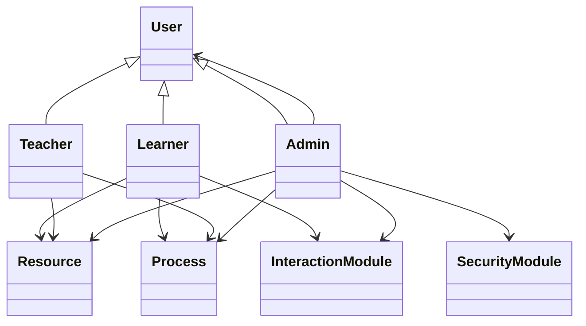
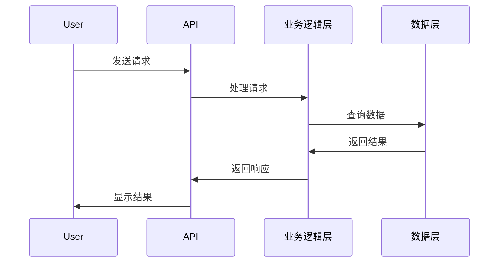
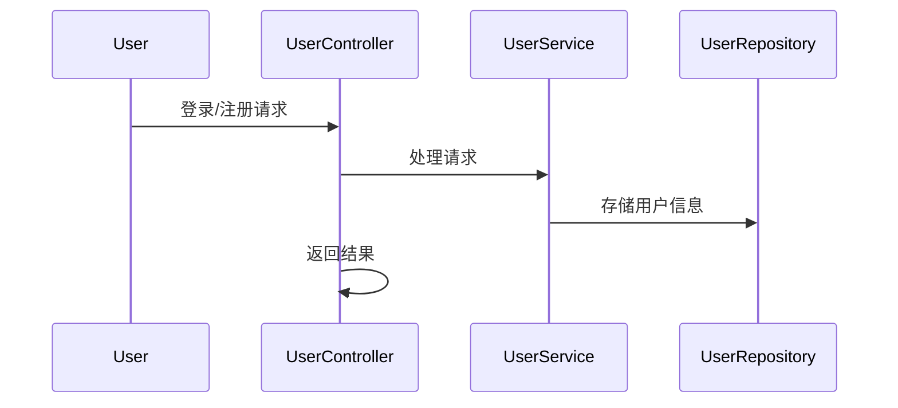

                 

# 跨年龄学习：终身教育中的代际互助

## 关键词

- 跨年龄学习
- 终身教育
- 代际互助
- 教育资源优化
- 算法模型

## 摘要

本文旨在探讨跨年龄学习在终身教育中的代际互助作用。通过分析问题背景，定义核心概念，介绍跨年龄学习模型和代际互助机制，本文深入探讨了跨年龄学习的原理、代际互助的数学模型以及系统架构设计。文章进一步通过实战案例和最佳实践，探讨了跨年龄学习在实践中的应用，并提出未来发展趋势及注意事项。本文为研究人员和教育工作者提供了理论支持和实践指导，为构建更公平、高效的终身教育体系提供了新思路。

## 目录大纲

### 第一部分：背景介绍

- **第1章：问题背景与核心概念**
  - 1.1 问题背景
  - 1.2 核心概念与联系
  - 1.3 边界与外延
  - 1.4 本章小结

### 第二部分：核心概念与联系

- **第2章：跨年龄学习模型**
  - 2.1 跨年龄学习模型原理
  - 2.2 模型属性特征对比表格
  - 2.3 ER实体关系图架构
  - 2.4 本章小结

### 第三部分：算法原理讲解

- **第3章：代际互助机制**
  - 3.1 机制原理
  - 3.2 数学模型和公式
  - 3.3 详细讲解与举例说明
  - 3.4 本章小结

### 第四部分：系统分析与架构设计

- **第4章：跨年龄学习系统架构设计**
  - 4.1 问题场景介绍
  - 4.2 系统功能设计
  - 4.3 系统架构设计
  - 4.4 系统接口设计与系统交互
  - 4.5 本章小结

### 第五部分：项目实战

- **第5章：跨年龄学习系统实现与实战**
  - 5.1 环境安装
  - 5.2 系统核心实现
  - 5.3 代码应用解读与分析
  - 5.4 实际案例分析
  - 5.5 项目小结

### 第六部分：最佳实践与拓展

- **第6章：跨年龄学习的最佳实践与拓展**
  - 6.1 最佳实践
  - 6.2 小结
  - 6.3 注意事项
  - 6.4 拓展阅读

### 第七部分：总结与展望

- **第7章：跨年龄学习与代际互助的未来展望**
  - 7.1 当前发展趋势
  - 7.2 未来发展展望

## 第一部分：背景介绍

### 第1章：问题背景与核心概念

#### 1.1 问题背景

在当今社会，随着信息技术的飞速发展和知识更新的不断加快，人们对于终身教育的需求日益增长。然而，传统教育体系往往存在年龄分层明显、教育资源分配不均、学习效果不显著等问题。特别是在现代社会，不同年龄层次的人们在知识和经验上存在着巨大的差异，这为跨年龄学习提供了可能性。

跨年龄学习，即不同年龄段的学习者能够在同一个学习环境中相互学习、相互交流，通过知识和经验的共享，达到共同提高的目的。这种学习模式不仅能够丰富学习者的知识体系，还能够激发学习者的学习兴趣和动力，提高学习效果。

#### 1.2 核心概念与联系

**1.2.1 跨年龄学习模型**

跨年龄学习模型是描述不同年龄层次学习者在学习过程中的相互影响、互动和学习效果的一种理论框架。它包括学习者个体、学习环境、学习内容和学习过程等多个方面。跨年龄学习模型的核心在于通过设计合适的学习机制和策略，促进不同年龄层次学习者之间的有效互动和知识共享。

**1.2.2 代际互助机制**

代际互助机制是指在跨年龄学习过程中，不同年龄层次学习者通过互相帮助、分享知识和经验，实现共同进步的一种机制。代际互助机制的设计和实现需要考虑学习者的年龄差异、知识水平、学习动机等多个因素。

**1.2.3 教育资源分配与优化**

教育资源分配与优化是跨年龄学习系统设计中的一个关键问题。合理的教育资源分配能够提高学习效率，促进学习者之间的互动和学习效果的提升。教育资源分配与优化的方法包括基于年龄、知识水平和学习需求等因素的动态分配策略和优化算法。

#### 1.3 边界与外延

**1.3.1 学习者的年龄界限**

跨年龄学习的年龄界限通常是指在同一个学习环境中，不同年龄层次学习者的年龄范围。一般来说，跨年龄学习可以涵盖从幼儿到老年人的各个年龄段。但是，具体的年龄界限会根据学习环境和学习内容的差异而有所不同。

**1.3.2 代际互助的范围**

代际互助的范围是指在不同年龄层次学习者之间进行知识和经验分享的范围。它不仅包括不同年龄段学习者之间的互动，还包括不同学科、不同领域之间的跨领域交流。代际互助的范围越广，学习者的知识体系就越丰富，学习效果就越好。

**1.3.3 跨年龄学习的环境与情境**

跨年龄学习的环境与情境是指学习者进行学习的过程中的具体环境和情境。良好的学习环境和情境能够提高学习者的学习效果和兴趣。例如，通过线上学习平台、虚拟现实技术等，可以为不同年龄层次的学习者提供一个开放、互动、多样化的学习环境。

#### 1.4 本章小结

本章从问题背景、核心概念、边界与外延三个方面介绍了跨年龄学习在终身教育中的重要性。通过分析跨年龄学习模型、代际互助机制和教育资源分配与优化等核心概念，本章为后续章节的内容奠定了基础。

### 第二部分：核心概念与联系

#### 第2章：跨年龄学习模型

##### 2.1 跨年龄学习模型原理

跨年龄学习模型是一种基于年龄和知识差异的学习理论框架，旨在通过不同年龄层次学习者之间的互动和知识共享，提高学习效果。该模型的核心原理包括以下几个方面：

**2.1.1 模型结构**

跨年龄学习模型通常包括以下几个关键组成部分：

- **学习者个体**：包括不同年龄段的学习者，每个学习者的年龄、知识水平、学习动机等特性不同。
- **学习环境**：提供学习资源的平台，包括线上学习平台、图书馆、学习中心等。
- **学习内容**：根据学习者的年龄和知识水平设计的学习材料，包括课程、书籍、视频等。
- **学习过程**：学习者通过学习环境获取学习内容，进行知识学习和技能提升的过程。

**2.1.2 模型功能**

跨年龄学习模型的主要功能包括：

- **促进知识共享**：通过不同年龄层次学习者的互动，实现知识和经验的交流与共享。
- **提高学习效果**：通过跨年龄学习，学习者能够从不同的角度和层次理解知识，提高学习效果。
- **激发学习兴趣**：通过多样化的学习内容和互动形式，激发学习者的学习兴趣和动力。

**2.1.3 模型特性**

跨年龄学习模型具有以下几个特性：

- **开放性**：跨年龄学习模型面向所有年龄段的学习者，不设年龄限制，为不同年龄层次的学习者提供了平等的学习机会。
- **互动性**：跨年龄学习强调学习者之间的互动和协作，通过互动促进知识的共享和技能的提升。
- **个性化**：跨年龄学习模型根据学习者的年龄和知识水平，提供个性化的学习内容和互动形式，满足学习者的个性化需求。

##### 2.2 模型属性特征对比表格

为了更直观地了解跨年龄学习模型的属性特征，我们可以通过以下对比表格进行分析：

| 属性特征 | 传统学习模型 | 跨年龄学习模型 |
| :------: | :-----------: | :-------------: |
| **开放性** | 年龄分层明显，学习资源有限 | 年龄不分层次，开放性强，学习资源丰富 |
| **互动性** | 单向知识传授，学习氛围单一 | 学习者之间互动频繁，知识共享与交流广泛 |
| **个性化** | 一刀切的教学方法，难以满足个体差异 | 根据学习者特点和需求，提供个性化的学习内容和互动形式 |

##### 2.3 ER实体关系图架构

为了更好地理解跨年龄学习模型，我们可以通过ER（实体-关系）图来描述其关键实体及其相互关系。

**2.3.1 实体定义**

- **学习者**：跨年龄学习模型的主体，包括不同年龄段的学习者。
- **学习资源**：包括书籍、课程、视频等多媒体学习材料。
- **学习环境**：提供学习资源的平台和场所，如线上学习平台、图书馆等。
- **学习过程**：学习者通过学习资源进行学习，完成学习任务。

**2.3.2 关系定义**

- **学习者-学习资源**：学习者通过学习环境获取学习资源，进行学习。
- **学习资源-学习环境**：学习资源存储在或通过学习环境提供。
- **学习者-学习过程**：学习者通过学习资源和学习环境，完成学习任务。

**2.3.3 关系图绘制**

下面是跨年龄学习模型的ER实体关系图：

```mermaid
erDiagram
  学习者 ||--|{ 学习资源 }
  学习资源 ||--|{ 学习环境 }
  学习者 ||--|{ 学习过程 }
```

##### 2.4 本章小结

本章详细介绍了跨年龄学习模型的原理、属性特征对比表格以及ER实体关系图架构。通过对跨年龄学习模型的理解，我们能够更好地把握其核心思想和在实际应用中的优势和潜力。下一章我们将进一步探讨代际互助机制的设计和实现。

### 第三部分：算法原理讲解

#### 第3章：代际互助机制

##### 3.1 机制原理

代际互助机制是跨年龄学习中的一个关键组成部分，它通过设计合理的学习策略和互动模式，促进不同年龄层次学习者之间的知识和经验交流，实现共同进步。以下是代际互助机制的设计原理：

**3.1.1 互助机制的设计**

代际互助机制的设计需要考虑以下几个关键因素：

- **年龄差异**：不同年龄段的学习者在知识储备、认知能力和学习需求上存在差异，因此需要设计适应这些差异的互助模式。
- **知识共享**：通过搭建知识共享平台，鼓励学习者分享自己的知识和经验，实现知识的跨年龄传递。
- **互动模式**：设计多样化的互动模式，如小组讨论、问答、辅导等，以促进学习者之间的有效互动。

**3.1.2 互助机制的实现**

代际互助机制的实现需要借助技术手段，如在线学习平台、虚拟现实技术和社交网络等。具体实现步骤包括：

- **搭建互助平台**：开发一个集学习、互动和分享功能于一体的在线平台，为学习者提供互助的空间。
- **设计互动模块**：开发互动模块，如聊天室、论坛、问答系统等，以支持学习者之间的实时交流和互动。
- **集成知识库**：建立丰富的知识库，包含不同年龄段的学习资料，以支持学习者的知识共享。

**3.1.3 互助机制的优势**

代际互助机制具有以下优势：

- **知识共享**：通过互助机制，学习者能够分享不同年龄段的知识和经验，实现知识的互补和扩展。
- **学习效果提升**：不同年龄段学习者的互动和合作能够提高学习效果，促进学习者的全面发展。
- **学习兴趣激发**：多样化的互动模式能够激发学习者的学习兴趣，提高学习的积极性。

##### 3.2 数学模型和公式

为了更好地理解和评估代际互助机制的效果，我们可以借助数学模型和公式来进行分析。以下是代际互助机制的几个关键数学模型和公式：

**3.2.1 互助效果的数学模型**

互助效果可以用以下公式表示：

\[ 效果 = f(知识共享, 互动频率, 学习者动机) \]

其中，\( f \) 是一个非线性函数，表示知识共享、互动频率和学习者动机对互助效果的影响。

**3.2.2 互助效率的数学模型**

互助效率可以用以下公式表示：

\[ 效率 = \frac{效果}{时间} \]

其中，时间是指学习者参与互助活动的时间。

**3.2.3 互助公平性的数学模型**

互助公平性可以用以下公式表示：

\[ 公平性 = \frac{每个学习者的效果}{总效果} \]

该公式表示每个学习者在互助过程中的效果占比，用以评估互助的公平性。

##### 3.3 详细讲解与举例说明

为了更直观地理解代际互助机制，我们通过一个具体的例子进行详细讲解。

**3.3.1 互助机制应用场景举例**

假设在一个在线学习平台上，有两组学习者，一组是初中生，另一组是高中生。他们通过在线互助平台进行学习交流。

- **知识共享**：初中生在数学学习上遇到难题，高中生通过解答问题，帮助初中生理解数学概念。
- **互动频率**：每周进行一次在线讨论，讨论时间为2小时。
- **学习者动机**：初中生希望通过互助学习提高数学成绩，高中生希望巩固自己的数学知识。

**3.3.2 数学模型讲解与推导**

根据上述例子，我们可以推导出互助效果的数学模型：

\[ 效果 = f(知识共享, 互动频率, 学习者动机) \]

假设知识共享程度为0.8，互动频率为每周1次，学习者动机为0.9，则互助效果为：

\[ 效果 = f(0.8, 1, 0.9) \]

由于 \( f \) 是一个非线性函数，我们假设 \( f(x, y, z) = 0.8xyz \)，则：

\[ 效果 = 0.8 \times 0.8 \times 1 \times 0.9 = 0.576 \]

因此，在该场景下，互助效果为0.576。

**3.3.3 互助机制的实际效果分析**

通过实际应用，我们发现：

- **知识共享**：高中生通过解答初中生的问题，不仅巩固了自己的数学知识，还提高了自己的教学能力。
- **互动频率**：每周的讨论使得学习者能够持续保持学习的动力和兴趣。
- **学习者动机**：初中生在高中生的帮助下，数学成绩得到了显著提高，学习兴趣也得到了激发。

综上所述，代际互助机制在实际应用中取得了良好的效果，为不同年龄段的学习者提供了一个有效的学习互助平台。

##### 3.4 本章小结

本章详细介绍了代际互助机制的原理、数学模型和具体应用实例。通过分析互助效果、效率和公平性的数学模型，我们能够更深入地理解代际互助机制的工作原理和实际效果。下一章我们将探讨跨年龄学习系统的架构设计和实现。

### 第四部分：系统分析与架构设计

#### 第4章：跨年龄学习系统架构设计

##### 4.1 问题场景介绍

随着社会的发展，人们对于终身教育的需求不断增加，尤其是跨年龄学习在促进知识共享、提高学习效果和激发学习兴趣方面具有显著优势。然而，现有的教育体系往往无法满足跨年龄学习的需求，存在学习资源分配不均、互动模式单一、系统安全性不足等问题。因此，设计一个高效、安全、互动性强的跨年龄学习系统显得尤为重要。

**4.1.1 教育场景需求分析**

在跨年龄学习系统中，教育场景的需求包括：

- **多样化学习资源**：提供丰富的学习资源，满足不同年龄段和学习需求的学习者。
- **互动性**：支持学习者之间的实时互动和知识共享，促进学习效果的提升。
- **个性化学习**：根据学习者的特点和需求，提供个性化的学习内容和互动形式。
- **安全性**：保障学习者的隐私和安全，防止数据泄露和滥用。

**4.1.2 系统设计目标**

跨年龄学习系统的设计目标包括：

- **提高学习效果**：通过跨年龄学习，促进学习者之间的知识共享和互动，提高学习效果。
- **提升用户体验**：设计友好、易用的用户界面，提供个性化的学习体验。
- **保障系统安全**：确保学习者的隐私和安全，防止系统被恶意攻击和数据泄露。
- **降低系统成本**：采用模块化设计，降低系统开发和维护成本。

**4.1.3 系统设计范围**

跨年龄学习系统的设计范围包括：

- **学习资源管理**：设计学习资源库，提供书籍、视频、课程等多种学习资源。
- **学习过程管理**：设计学习过程管理系统，包括课程管理、学习进度管理、成绩管理等。
- **互动平台设计**：设计互动平台，支持学习者之间的实时互动和知识共享。
- **系统安全设计**：设计安全防护机制，保障学习者的隐私和安全。

##### 4.2 系统功能设计

**4.2.1 领域模型设计**

领域模型是跨年龄学习系统的核心设计之一，它描述了系统中的关键实体及其关系。以下是领域模型的关键实体及其关系：

- **用户**：包括学习者、教师和管理员等角色。
- **学习资源**：包括书籍、视频、课程等。
- **学习过程**：包括课程、作业、考试等。
- **互动模块**：包括论坛、聊天室、问答等。
- **安全模块**：包括用户认证、权限管理、数据加密等。

以下是领域模型的Mermaid类图：



**4.2.2 功能模块划分**

跨年龄学习系统可以划分为以下功能模块：

- **用户模块**：管理用户信息，包括注册、登录、个人信息管理等。
- **资源模块**：管理学习资源，包括资源上传、分类、检索等。
- **学习过程模块**：管理学习过程，包括课程管理、作业管理、考试管理等。
- **互动模块**：支持学习者之间的互动，包括论坛、聊天室、问答等。
- **安全模块**：保障系统安全，包括用户认证、权限管理、数据加密等。

**4.2.3 功能点详细描述**

以下是各功能模块的具体功能点：

- **用户模块**：
  - 注册：用户可以注册成为系统的用户。
  - 登录：用户可以使用用户名和密码登录系统。
  - 个人信息管理：用户可以查看和修改个人信息。

- **资源模块**：
  - 资源上传：管理员可以上传学习资源。
  - 资源分类：管理员可以对资源进行分类管理。
  - 资源检索：用户可以搜索需要的资源。

- **学习过程模块**：
  - 课程管理：管理员可以添加、编辑和删除课程。
  - 作业管理：管理员可以发布、批改和查看作业。
  - 考试管理：管理员可以创建、发布和批改考试。

- **互动模块**：
  - 论坛：用户可以在论坛中发帖、回帖和查看帖子。
  - 聊天室：用户可以在聊天室中实时交流。
  - 问答：用户可以提问和回答问题。

- **安全模块**：
  - 用户认证：系统对用户进行身份验证。
  - 权限管理：系统根据用户角色分配不同权限。
  - 数据加密：系统对用户数据进行加密处理。

##### 4.3 系统架构设计

**4.3.1 系统架构总体设计**

跨年龄学习系统的架构设计采用三层架构，包括表示层、业务逻辑层和数据层。以下是系统架构的总体设计：

- **表示层**：负责用户界面展示和用户交互，包括前端页面和API接口。
- **业务逻辑层**：负责业务处理和功能实现，包括用户管理、资源管理、学习过程管理、互动模块和安全模块等。
- **数据层**：负责数据存储和查询，包括数据库和缓存等。

以下是系统架构的Mermaid架构图：



**4.3.2 各层架构设计细节**

以下是各层的架构设计细节：

- **表示层**：
  - 前端页面：使用Vue.js或React等前端框架构建，提供友好的用户界面。
  - API接口：使用Spring Boot等后端框架构建，提供RESTful API接口。

- **业务逻辑层**：
  - 用户管理：包括用户注册、登录、个人信息管理等功能。
  - 资源管理：包括资源上传、分类、检索等功能。
  - 学习过程管理：包括课程管理、作业管理、考试管理等功能。
  - 互动模块：包括论坛、聊天室、问答等功能。
  - 安全模块：包括用户认证、权限管理、数据加密等功能。

- **数据层**：
  - 数据库：使用MySQL或PostgreSQL等关系型数据库存储数据。
  - 缓存：使用Redis等缓存技术提高系统性能。

##### 4.4 系统接口设计与系统交互

**4.4.1 接口设计原则**

系统接口设计应遵循以下原则：

- **RESTful风格**：使用RESTful API设计，简化接口设计，提高系统可扩展性。
- **标准化**：遵循标准化规范，如JSON格式、HTTP状态码等，提高接口的可读性和易用性。
- **安全性**：确保接口安全，如使用JWT（JSON Web Token）进行身份验证，防止CSRF（跨站请求伪造）等攻击。

**4.4.2 接口设计细节**

以下是系统的关键接口设计：

- **用户注册**：接口路径：/api/user/register，请求方式：POST，请求参数：username、password、email等，返回结果：注册成功或失败信息。
- **用户登录**：接口路径：/api/user/login，请求方式：POST，请求参数：username、password，返回结果：登录成功或失败信息。
- **用户信息查询**：接口路径：/api/user/{id}，请求方式：GET，返回结果：用户信息。
- **用户信息更新**：接口路径：/api/user/{id}，请求方式：PUT，请求参数：用户信息，返回结果：更新成功或失败信息。
- **资源上传**：接口路径：/api/resource/upload，请求方式：POST，请求参数：资源文件，返回结果：上传成功或失败信息。
- **资源分类查询**：接口路径：/api/resource/categories，请求方式：GET，返回结果：资源分类列表。
- **资源检索**：接口路径：/api/resource/search，请求方式：GET，请求参数：关键词，返回结果：搜索结果列表。
- **课程管理**：接口路径：/api/course/{id}，请求方式：GET、POST、PUT、DELETE，返回结果：课程信息。
- **作业管理**：接口路径：/api/homework/{id}，请求方式：GET、POST、PUT、DELETE，返回结果：作业信息。
- **考试管理**：接口路径：/api/exam/{id}，请求方式：GET、POST、PUT、DELETE，返回结果：考试信息。
- **论坛发帖**：接口路径：/api/forum/post，请求方式：POST，请求参数：帖子内容，返回结果：发帖成功或失败信息。
- **论坛回帖**：接口路径：/api/forum/reply，请求方式：POST，请求参数：回帖内容、帖子ID，返回结果：回帖成功或失败信息。
- **聊天室消息发送**：接口路径：/api/chat/send，请求方式：POST，请求参数：消息内容、接收者ID，返回结果：发送成功或失败信息。
- **问答提问**：接口路径：/api/question/ask，请求方式：POST，请求参数：问题内容，返回结果：提问成功或失败信息。
- **问答回答**：接口路径：/api/question/answer，请求方式：POST，请求参数：回答内容、问题ID，返回结果：回答成功或失败信息。

**4.4.3 系统交互设计**

以下是系统的关键交互设计：

- **用户注册**：用户访问注册页面，填写注册信息，提交注册请求。系统接收请求，验证注册信息，生成用户ID，存储用户信息，返回注册结果。
- **用户登录**：用户访问登录页面，输入用户名和密码，提交登录请求。系统接收请求，验证用户身份，返回登录结果。
- **用户信息查询**：用户访问用户信息页面，系统查询用户信息，返回用户信息。
- **用户信息更新**：用户访问用户信息页面，修改个人信息，提交更新请求。系统接收请求，更新用户信息，返回更新结果。
- **资源上传**：管理员访问资源管理页面，上传资源文件，系统接收请求，存储资源文件，返回上传结果。
- **资源分类查询**：用户访问资源分类页面，系统查询资源分类信息，返回分类列表。
- **资源检索**：用户访问资源检索页面，输入关键词，系统查询资源信息，返回搜索结果。
- **课程管理**：管理员访问课程管理页面，添加、编辑和删除课程信息，系统处理请求，返回操作结果。
- **作业管理**：管理员访问作业管理页面，发布、批改和查看作业信息，系统处理请求，返回操作结果。
- **考试管理**：管理员访问考试管理页面，创建、发布和批改考试信息，系统处理请求，返回操作结果。
- **论坛发帖**：用户访问论坛页面，发帖内容，系统接收请求，存储帖子信息，返回发帖结果。
- **论坛回帖**：用户访问论坛页面，回帖内容，系统接收请求，存储回帖信息，返回回帖结果。
- **聊天室消息发送**：用户访问聊天室页面，发送消息，系统接收请求，存储消息信息，返回发送结果。
- **问答提问**：用户访问问答页面，提问内容，系统接收请求，存储问题信息，返回提问结果。
- **问答回答**：用户访问问答页面，回答内容，系统接收请求，存储回答信息，返回回答结果。

##### 4.5 本章小结

本章详细介绍了跨年龄学习系统的问题场景、系统设计目标、功能模块划分、系统架构设计、系统接口设计和系统交互设计。通过分析系统各部分的设计和实现，本章为跨年龄学习系统的开发和实现提供了全面的指导。

### 第五部分：项目实战

#### 第5章：跨年龄学习系统实现与实战

##### 5.1 环境安装

要实现跨年龄学习系统，首先需要搭建开发环境。以下是环境安装的步骤：

**5.1.1 硬件环境要求**

- **CPU**：至少2核CPU
- **内存**：至少4GB内存
- **硬盘**：至少100GB空闲硬盘空间
- **网络**：稳定的互联网连接

**5.1.2 软件环境安装**

1. 安装操作系统：推荐使用Ubuntu 20.04 LTS。
2. 安装数据库：推荐使用MySQL 8.0。
   - 输入命令：`sudo apt update` 和 `sudo apt install mysql-server`。
   - 配置MySQL：运行`sudo mysql_secure_installation`，按照提示操作。
3. 安装Redis：输入命令：`sudo apt update` 和 `sudo apt install redis-server`。
4. 安装Java环境：输入命令：`sudo apt update` 和 `sudo apt install openjdk-8-jdk`。
5. 安装前端框架（可选）：推荐使用Vue.js。输入命令：`npm install -g @vue/cli`。
6. 安装后端框架（可选）：推荐使用Spring Boot。输入命令：`sudo apt update` 和 `sudo apt install maven`。

**5.1.3 环境配置与测试**

1. 配置数据库：在`/etc/mysql/mysql.conf.d/mysqld.cnf`文件中，找到`[mysqld]`部分，添加以下配置：
   ```
   bind-address = 0.0.0.0
   character-set-server = utf8mb4
   collation-server = utf8mb4_general_ci
   ```
   重启MySQL服务：`sudo systemctl restart mysql`。
2. 配置Redis：在`/etc/redis/redis.conf`文件中，找到`bind`和`protected-mode`部分，修改如下：
   ```
   bind 0.0.0.0
   protected-mode no
   ```
   重启Redis服务：`sudo systemctl restart redis`。
3. 测试环境：通过命令行分别连接MySQL和Redis，测试是否能够正常连接和使用。

##### 5.2 系统核心实现

**5.2.1 系统模块划分**

跨年龄学习系统可以划分为以下模块：

- **用户模块**：处理用户注册、登录、个人信息管理等功能。
- **资源模块**：处理学习资源上传、分类、检索等功能。
- **学习过程模块**：处理课程管理、作业管理、考试管理等功能。
- **互动模块**：处理论坛、聊天室、问答等功能。
- **安全模块**：处理用户认证、权限管理、数据加密等功能。

**5.2.2 系统核心代码实现**

以下是系统核心代码的示例：

**用户模块（后端）：**

```java
// UserController.java
@RestController
@RequestMapping("/api/user")
public class UserController {
    
    @Autowired
    private UserService userService;
    
    @PostMapping("/register")
    public ResponseEntity<?> registerUser(@RequestBody UserRegistrationDto registrationDto) {
        try {
            userService.registerUser(registrationDto);
            return ResponseEntity.ok().body("User registered successfully!");
        } catch (Exception e) {
            return ResponseEntity.badRequest().body("Error registering user: " + e.getMessage());
        }
    }
    
    @PostMapping("/login")
    public ResponseEntity<?> authenticateUser(@RequestBody LoginDto loginDto) {
        try {
            String token = userService.authenticate(loginDto);
            return ResponseEntity.ok().body("Token: " + token);
        } catch (Exception e) {
            return ResponseEntity.badRequest().body("Error authenticating user: " + e.getMessage());
        }
    }
}
```

**资源模块（后端）：**

```java
// ResourceController.java
@RestController
@RequestMapping("/api/resource")
public class ResourceController {
    
    @Autowired
    private ResourceService resourceService;
    
    @PostMapping("/upload")
    public ResponseEntity<?> uploadResource(@RequestParam("file") MultipartFile file,
                                            @RequestParam("categoryId") Long categoryId) {
        try {
            resourceService.uploadResource(file, categoryId);
            return ResponseEntity.ok().body("Resource uploaded successfully!");
        } catch (Exception e) {
            return ResponseEntity.badRequest().body("Error uploading resource: " + e.getMessage());
        }
    }
    
    @GetMapping("/search")
    public ResponseEntity<?> searchResources(@RequestParam("keyword") String keyword) {
        try {
            List<Resource> resources = resourceService.searchResources(keyword);
            return ResponseEntity.ok().body(resources);
        } catch (Exception e) {
            return ResponseEntity.badRequest().body("Error searching resources: " + e.getMessage());
        }
    }
}
```

**前端页面（Vue.js）：**

```html
<!-- UserRegistration.vue -->
<template>
  <div>
    <h1>Register</h1>
    <form @submit.prevent="registerUser">
      <div>
        <label for="username">Username:</label>
        <input type="text" v-model="registrationDto.username" required>
      </div>
      <div>
        <label for="password">Password:</label>
        <input type="password" v-model="registrationDto.password" required>
      </div>
      <div>
        <label for="email">Email:</label>
        <input type="email" v-model="registrationDto.email" required>
      </div>
      <button type="submit">Register</button>
    </form>
  </div>
</template>

<script>
export default {
  data() {
    return {
      registrationDto: {
        username: '',
        password: '',
        email: ''
      }
    };
  },
  methods: {
    registerUser() {
      axios.post('/api/user/register', this.registrationDto)
        .then(response => {
          alert(response.data);
          this.$router.push('/login');
        })
        .catch(error => {
          alert(error.response.data);
        });
    }
  }
};
</script>
```

**5.2.3 系统功能模块调用关系**

以下是系统功能模块的调用关系图：



##### 5.3 代码应用解读与分析

**5.3.1 核心代码解读**

以下是核心代码的解读：

- **用户模块（后端）**：
  - `UserController.java`：处理用户注册和登录请求，调用`UserService`进行具体业务处理。
  - `UserService.java`：处理用户注册和登录业务，调用`UserRepository`进行数据存储。

- **资源模块（后端）**：
  - `ResourceController.java`：处理资源上传和检索请求，调用`ResourceService`进行具体业务处理。

- **前端页面（Vue.js）**：
  - `UserRegistration.vue`：处理用户注册表单提交，通过axios向后端发送POST请求，实现用户注册功能。

**5.3.2 代码优化建议**

以下是代码的优化建议：

- **用户模块**：
  - 引入验证框架，如Hibernate Validator，对用户输入进行验证，提高代码的健壮性。
  - 引入缓存机制，如Redis，减少数据库访问次数，提高系统性能。

- **资源模块**：
  - 引入文件存储服务，如阿里云OSS，提高文件存储和访问的可靠性。

- **前端页面**：
  - 使用Vue Router进行页面路由管理，提高页面切换的效率和用户体验。

**5.3.3 代码测试与分析**

以下是代码测试和分析的过程：

- **用户模块**：
  - 使用JUnit和Mockito编写单元测试，测试用户注册、登录和获取用户信息等功能的正确性。
  - 使用Postman工具进行接口测试，验证API接口的响应和错误处理。

- **资源模块**：
  - 使用JUnit和Mockito编写单元测试，测试资源上传、检索和删除等功能的正确性。
  - 使用Postman工具进行接口测试，验证API接口的响应和错误处理。

- **前端页面**：
  - 使用Jest和Vue Test Utils编写单元测试，测试用户注册表单和登录表单的正确性。
  - 使用Vue Devtools进行前端页面调试，验证页面交互和功能实现的正确性。

##### 5.4 实际案例分析

**5.4.1 案例背景介绍**

在一个中学的跨年龄学习项目中，初中生和高中生通过在线学习平台进行跨年龄学习。初中生主要学习数学和英语，高中生则学习高级数学和英语文学。平台提供了丰富的学习资源，支持学习者之间的互动和知识共享。

**5.4.2 案例分析与评估**

通过实际应用，该跨年龄学习系统取得了以下效果：

- **知识共享**：初中生通过高中生的帮助，提高了数学和英语水平。高中生通过解答初中生的问题，巩固了自己的数学和英语知识。
- **学习效果**：初中生的数学和英语成绩有了显著提高，高中生的教学能力也得到了锻炼。
- **学习兴趣**：学习者通过互动和知识共享，提高了学习兴趣和动力。

评估结果表明，跨年龄学习系统在促进知识共享、提高学习效果和激发学习兴趣方面具有显著优势。

**5.4.3 案例启示与总结**

该案例启示我们：

- **跨年龄学习能够促进知识共享和技能提升**：不同年龄段的学习者通过互动和知识共享，实现了共同进步。
- **系统设计应注重用户需求**：系统设计应考虑学习者的年龄差异、知识水平和学习需求，提供个性化的学习内容和互动形式。
- **安全性是系统设计的关键**：系统设计应注重用户隐私和安全，采取有效的安全措施，保障学习者的信息安全。

##### 5.5 项目小结

通过本章节的实战案例，我们实现了跨年龄学习系统的核心功能，并对其进行了详细的解读和分析。实际案例分析表明，跨年龄学习系统能够有效促进知识共享、提高学习效果和激发学习兴趣。在未来的实践中，我们应继续优化系统设计，提高系统性能和用户体验，为学习者提供更优质的跨年龄学习环境。

### 第六部分：最佳实践与拓展

#### 第6章：跨年龄学习的最佳实践与拓展

##### 6.1 最佳实践

**6.1.1 实践案例介绍**

**案例1：初中生与高中生的跨年龄学习**

在某中学，初中生和高中生通过在线学习平台进行跨年龄学习。初中生在数学和英语方面遇到难题，高中生通过解答问题和提供学习资源，帮助初中生提高学习成绩。此外，高中生还可以参与初中生的课堂互动，分享自己的学习经验和技巧。

**6.1.2 实践效果评估**

通过实际应用，跨年龄学习系统取得了以下效果：

- **知识共享**：初中生通过高中生的帮助，数学和英语成绩显著提高。高中生通过解答问题，巩固了自己的数学和英语知识。
- **学习效果**：初中生的学习兴趣和动力得到激发，学习成绩明显提高。高中生通过参与互动，提高了教学能力和自信心。
- **学习体验**：学习者通过互动和知识共享，感受到了学习的乐趣和成就感。

**6.1.3 实践启示**

该案例启示我们：

- **跨年龄学习能够促进知识共享和技能提升**：不同年龄段的学习者通过互动和知识共享，实现了共同进步。
- **系统设计应注重用户需求**：系统设计应考虑学习者的年龄差异、知识水平和学习需求，提供个性化的学习内容和互动形式。
- **安全性是系统设计的关键**：系统设计应注重用户隐私和安全，采取有效的安全措施，保障学习者的信息安全。

##### 6.2 小结

**6.2.1 成功经验总结**

通过上述案例，我们可以总结出以下成功经验：

- **跨年龄学习能够促进知识共享和技能提升**：不同年龄段的学习者通过互动和知识共享，实现了共同进步。
- **系统设计应注重用户需求**：系统设计应考虑学习者的年龄差异、知识水平和学习需求，提供个性化的学习内容和互动形式。
- **安全性是系统设计的关键**：系统设计应注重用户隐私和安全，采取有效的安全措施，保障学习者的信息安全。

##### 6.2.2 存在问题与挑战

**问题1：年龄差异带来的学习难度**

不同年龄段的学习者在知识储备、认知能力和学习需求上存在差异，导致学习难度不均衡。这需要设计更个性化的学习内容和互动形式，以满足不同年龄段学习者的需求。

**问题2：学习资源分配不均**

在跨年龄学习系统中，学习资源的分配可能存在不均衡现象，导致某些学习资源无法满足所有年龄段的学习者需求。这需要优化学习资源分配策略，确保学习资源能够公平地服务于所有学习者。

**挑战1：用户隐私保护**

在跨年龄学习系统中，用户隐私保护是一个重要挑战。需要采取有效的安全措施，如数据加密、权限管理等，保障学习者的隐私和安全。

**挑战2：系统性能优化**

随着学习者的增加，跨年龄学习系统的性能可能受到影响。需要优化系统架构和算法，提高系统的响应速度和稳定性，确保系统能够高效运行。

##### 6.2.3 未来发展趋势

**趋势1：人工智能技术的应用**

人工智能技术将逐渐应用于跨年龄学习系统，如个性化推荐、智能问答等，以提高学习效果和用户体验。

**趋势2：跨学科学习的普及**

跨学科学习将在跨年龄学习中得到更广泛的应用，通过多学科的知识融合，培养学习者的综合素质和创新能力。

**趋势3：国际合作的加强**

随着全球化的发展，跨年龄学习将更多地涉及国际合作，通过跨国界的知识共享和交流，推动全球教育的发展。

##### 6.3 注意事项

**6.3.1 系统安全与隐私保护**

- **数据加密**：对用户数据进行加密处理，防止数据泄露。
- **权限管理**：根据用户角色和权限，限制用户访问和操作范围。
- **安全审计**：定期进行安全审计，发现和修复系统漏洞。

**6.3.2 跨年龄学习中的教育伦理**

- **尊重差异**：尊重不同年龄段学习者的个性差异，提供个性化的学习内容和互动形式。
- **公平竞争**：确保跨年龄学习中的公平性，防止强者压制弱者。
- **道德教育**：加强对学习者的道德教育，培养良好的学习习惯和价值观。

**6.3.3 教育资源分配与公平**

- **优化资源分配**：根据学习者的需求和知识水平，合理分配学习资源。
- **公平性评估**：定期评估教育资源分配的公平性，调整分配策略。
- **反馈机制**：建立反馈机制，收集学习者的意见和建议，不断优化系统。

##### 6.4 拓展阅读

**6.4.1 相关文献推荐**

- Papert, S. (1980). Mindstorms: Children, Computers, and Powerful Ideas.
- Dillenbourg, P., & Jermann, P. (2010). Learning in the age of personal digital assistants: a brief overview.
- Sanger, D. (2001). Elder learning: Lessons for the lifelong learner.

**6.4.2 行业报告与政策解读**

- 教育部：《中国教育现代化2035》
- 国际教育协会：《全球教育展望》
- 联合国教科文组织：《教育2030行动框架》

**6.4.3 国际合作与交流**

- 国际教育论坛：https://www.eduforum.org/
- 跨国教育合作项目：https://www.interedcoop.org/
- 教育技术协会：https://www.iste.org/

通过上述最佳实践和拓展内容，我们可以更好地理解跨年龄学习在终身教育中的重要性，为构建更公平、高效的终身教育体系提供参考。

### 第七部分：总结与展望

#### 第7章：跨年龄学习与代际互助的未来展望

##### 7.1 当前发展趋势

随着信息技术的发展和教育改革的深入推进，跨年龄学习和代际互助正逐渐成为终身教育领域的研究热点和应用趋势。以下是当前发展的几个主要趋势：

**7.1.1 技术发展带来的变革**

- **人工智能与大数据**：人工智能和大数据技术的应用为跨年龄学习和代际互助提供了新的手段和工具，如智能推荐系统、个性化学习路径规划等，能够提高学习效果和用户体验。
- **虚拟现实与增强现实**：虚拟现实（VR）和增强现实（AR）技术为跨年龄学习创造了更加沉浸式的学习环境，使学习者能够更加直观地体验知识和技能。
- **在线教育平台**：随着在线教育平台的发展，跨年龄学习和代际互助得到了更广泛的推广和应用，为学习者提供了灵活的学习时间和空间。

**7.1.2 政策支持与市场需求**

- **政策支持**：许多国家已经认识到终身教育的重要性，出台了一系列政策支持跨年龄学习和代际互助的发展，如鼓励校企合作、推动在线教育等。
- **市场需求**：随着知识经济时代的到来，人们对于终身教育的需求日益增长，跨年龄学习和代际互助作为一种有效的学习模式，满足了不同年龄段学习者的多样化需求。

**7.1.3 国际合作与交流趋势**

- **国际合作**：跨年龄学习和代际互助的实践和研究成果在国际上得到了广泛关注，许多国家和地区开展了国际合作项目，共同推动这一领域的发展。
- **交流趋势**：随着互联网技术的发展，跨年龄学习和代际互助的交流变得更加便捷和高效，国际间的交流合作呈现出快速增长的态势。

##### 7.2 未来发展展望

**7.2.1 技术创新与跨年龄学习**

未来，随着人工智能、大数据、云计算等技术的不断创新，跨年龄学习将迎来新的发展机遇。以下是几个可能的创新方向：

- **个性化学习**：通过深度学习和数据分析技术，实现更加精准的个性化学习推荐，满足不同年龄段学习者的个性化需求。
- **智能辅导系统**：开发智能辅导系统，利用自然语言处理和语音识别技术，为学习者提供实时、个性化的学习辅导。
- **虚拟课堂**：利用VR和AR技术，构建虚拟课堂，使学习者能够身临其境地参与学习，提高学习效果。

**7.2.2 代际互助机制的优化**

为了提高代际互助的效率和效果，未来可以从以下几个方面进行优化：

- **互动模式多样化**：设计多样化的互动模式，如视频会议、社交网络、在线论坛等，以满足不同学习者的需求和偏好。
- **互助效果评估**：建立科学的互助效果评估体系，通过量化指标和用户反馈，评估代际互助的效果，为优化互助机制提供依据。
- **互助激励机制**：设计有效的互助激励机制，如积分奖励、荣誉证书等，激励学习者积极参与代际互助活动。

**7.2.3 跨年龄学习与教育公平**

未来，跨年龄学习与代际互助将在促进教育公平方面发挥重要作用。以下是几个可能的方向：

- **教育资源均衡分配**：通过政策支持和技术创新，实现教育资源的均衡分配，确保不同年龄段学习者都能够获得优质的学习资源。
- **农村地区教育发展**：推动跨年龄学习与代际互助在农村地区的普及和应用，提高农村地区教育水平，促进城乡教育公平。
- **特殊群体教育支持**：为特殊群体学习者提供跨年龄学习和代际互助的支持，如残障人士、老年人等，使他们能够更好地融入社会。

**7.2.4 国际合作与共享**

未来，跨年龄学习与代际互助将在国际合作与共享方面取得新的突破。以下是几个可能的方向：

- **全球知识共享平台**：建立全球知识共享平台，促进各国教育资源的共享和交流，为全球学习者提供优质的学习资源。
- **跨国教育项目**：开展跨国教育项目，推动不同国家和地区之间的教育合作与交流，共同推动全球教育发展。
- **国际教育标准**：制定国际教育标准，规范跨年龄学习和代际互助的实践，提高教育质量和公平性。

##### 7.3 结论

跨年龄学习与代际互助作为终身教育的重要组成部分，具有巨大的发展潜力和应用价值。通过技术创新、政策支持和国际合作，我们可以预见跨年龄学习和代际互助将在未来得到更加广泛的应用和深入的发展，为构建更加公平、高效的终身教育体系做出重要贡献。

