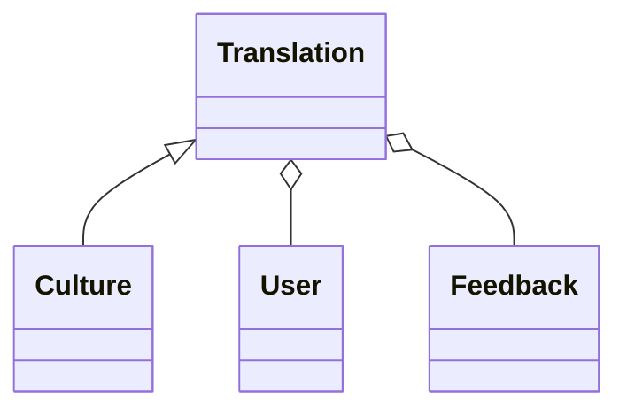
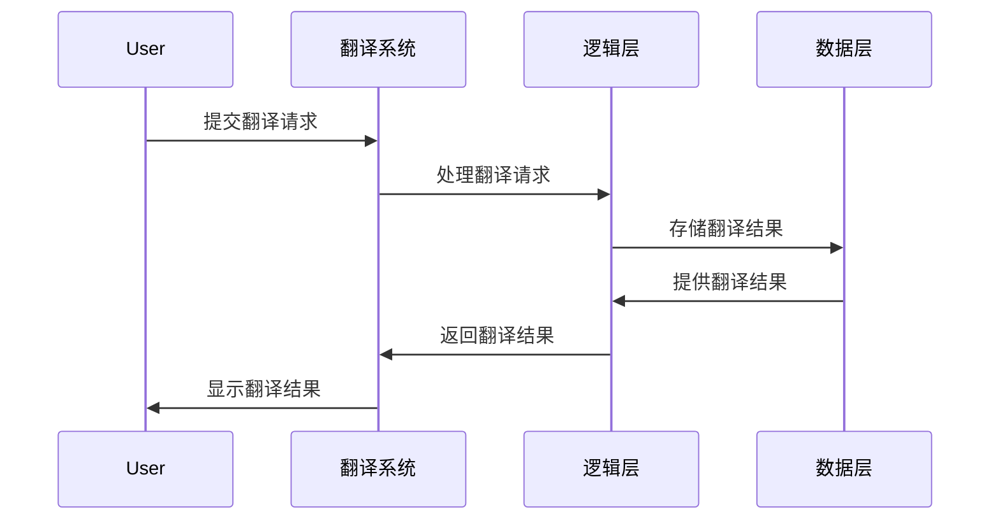
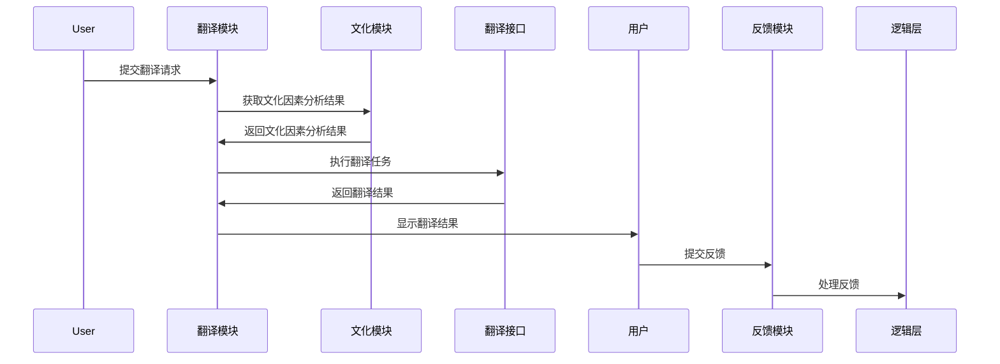

                 

## 跨文化意义翻译项目：促进全球价值观对话的平台

> 关键词：跨文化翻译、全球价值观、意义翻译、文化对话、翻译技术、人工智能

> 摘要：本文深入探讨了跨文化意义翻译项目在促进全球价值观对话中的重要性。首先，我们分析了跨文化意义翻译的背景及其在全球文化交流中的关键作用。随后，详细介绍了跨文化意义翻译的核心概念、理论基础和实践应用，并通过具体案例分析，展示了如何通过技术手段实现跨文化意义的准确传达。本文最后探讨了跨文化意义翻译在实践中的应用，以及面临的主要挑战和未来展望，为推动全球价值观的对话提供了有力支持。

----------------------------------------------------------------

### 目录大纲

- **第一部分：引言**
  - 第1章：问题背景与重要性
  - 第2章：核心概念与联系
  - 第3章：跨文化意义翻译的理论基础

- **第二部分：实践与应用**
  - 第4章：跨文化意义翻译项目案例分析
  - 第5章：跨文化意义翻译工具与应用
  - 第6章：跨文化意义翻译在实践中的应用

- **第三部分：挑战与未来展望**
  - 第7章：挑战与未来展望

----------------------------------------------------------------

## 第一部分：引言

### 第1章：问题背景与重要性

#### 1.1 问题背景

在全球化进程不断加速的今天，跨文化交流已成为不可避免的趋势。然而，语言和文化差异使得信息传播和价值观交流面临着巨大的挑战。跨文化意义翻译，作为连接不同文化的重要桥梁，其重要性日益凸显。

**1.1.1 全球化背景下的文化交流**

全球化使得不同国家和地区的文化频繁交流与碰撞。然而，这种交流并非仅仅是表面的语言文字的转换，更深层次的内涵和价值观的传递才是文化交流的核心。跨文化意义翻译在此过程中起到了至关重要的作用。

**1.1.2 跨文化意义翻译的重要性**

跨文化意义翻译不仅仅是对语言文字的翻译，更是对文化内涵和价值观的传达。准确、精确的跨文化意义翻译能够促进不同文化间的理解和沟通，减少误解和冲突。同时，它也为全球化经济、教育和文化交流提供了强有力的支持。

#### 1.2 问题描述

跨文化意义翻译面临的挑战主要集中在以下几个方面：

**1.2.1 跨文化意义翻译的挑战**

- **语言差异**：不同语言在词汇、语法、表达习惯等方面存在巨大差异，使得准确翻译成为难题。
- **文化差异**：不同文化在价值观、习俗、信仰等方面存在差异，翻译过程中需要充分考虑这些文化差异。
- **技术挑战**：现有的翻译技术和工具在处理跨文化意义翻译时存在一定的局限性，难以完全满足高质量翻译的需求。

**1.2.2 跨文化意义翻译的必要性**

- **促进全球价值观对话**：跨文化意义翻译能够促进全球不同文化间的价值观对话，增进相互理解和尊重。
- **推动全球化发展**：准确的跨文化意义翻译有助于全球化经济、教育和文化交流的顺利进行。
- **减少文化冲突**：通过跨文化意义翻译，可以减少由于语言和文化差异引起的误解和冲突，促进和谐社会的建设。

#### 1.3 问题解决

为了解决上述挑战，我们可以从以下几个方面着手：

**1.3.1 跨文化意义翻译的方法**

- **文化适应性翻译**：在翻译过程中，充分考虑目标语言和文化的特点，进行适应性翻译。
- **交际翻译**：注重信息的传递和交流效果，而不仅仅是文字的转换。

**1.3.2 跨文化意义翻译的策略**

- **团队合作**：跨文化翻译项目通常需要多个领域的专家共同参与，包括语言学家、文化专家和技术专家。
- **技术辅助**：利用人工智能、机器翻译等先进技术，提高翻译效率和准确性。

**1.4 边界与外延**

**1.4.1 跨文化意义翻译的适用范围**

跨文化意义翻译适用于各种跨文化交流的场景，包括但不限于国际商务、文化交流、教育、旅游等领域。

**1.4.2 跨文化意义翻译的限制**

- **文化复杂性**：不同文化的复杂性使得跨文化意义翻译难以做到完美无缺。
- **技术局限性**：现有的翻译技术和工具在处理复杂的文化内涵时存在一定限制。

#### 1.5 本章小结

本章从问题背景、重要性、问题描述、问题解决和边界与外延等方面对跨文化意义翻译进行了全面分析。跨文化意义翻译在全球文化交流中具有重要意义，同时也面临着诸多挑战。通过科学的方法和策略，我们可以有效应对这些挑战，促进全球价值观的对话和交流。

----------------------------------------------------------------

## 第二部分：核心概念与原理

### 第2章：核心概念与联系

#### 2.1 核心概念

跨文化意义翻译涉及以下几个核心概念：

**2.1.1 跨文化意义翻译的定义**

跨文化意义翻译是指在不同文化背景下，将一种语言的表达方式准确、恰当地转换为另一种语言，同时保留其文化内涵和意义的过程。

**2.1.2 文化差异与翻译的关系**

文化差异是跨文化意义翻译的重要背景。翻译过程中，文化差异直接影响着翻译的准确性和效果。因此，理解和处理文化差异是跨文化意义翻译的关键。

**2.1.3 翻译理论**

翻译理论是跨文化意义翻译的重要基础。包括传统翻译理论、当代翻译理论和跨文化翻译理论等多个方面。

**2.1.4 翻译策略**

翻译策略是在翻译过程中采用的具体方法和技术，包括文化适应性翻译、交际翻译等。

#### 2.2 概念属性特征对比

为了更清晰地理解跨文化意义翻译的核心概念，我们可以通过以下表格对比其与传统翻译、语言翻译和文化翻译的属性特征：

| 特征                | 跨文化意义翻译 | 传统翻译 | 语言翻译 | 文化翻译 |
|-------------------|------------|-------|-------|-------|
| 翻译重点          | 意义与文化内涵 | 文字转换 | 语言结构 | 文化背景 |
| 处理方法          | 文化适应性翻译、交际翻译 | 直译、意译 | 直译、意译 | 文化解释 |
| 面临挑战          | 文化差异、语言差异 | 语言差异 | 语言差异 | 文化差异 |
| 目标              | 准确传达文化内涵和意义 | 准确传达原文信息 | 准确传达原文信息 | 准确传达文化背景 |
| 适用范围          | 跨文化交流场景 | 各种文本翻译 | 各种文本翻译 | 跨文化交流场景 |

**2.2.1 传统翻译与跨文化意义翻译的对比**

传统翻译更注重语言层面的转换，而跨文化意义翻译则更关注文化内涵和意义的传递。传统翻译主要采用直译和意译方法，而跨文化意义翻译则更多地采用文化适应性翻译和交际翻译策略。

**2.2.2 语言翻译与文化翻译的对比**

语言翻译主要关注语言结构、词汇和语法等方面的转换，而文化翻译则更注重文化背景、价值观和习俗的传达。在跨文化意义翻译中，语言翻译和文化翻译往往是相互交织、共同作用的。

#### 2.3 ER实体关系图架构

为了更清晰地展示跨文化意义翻译涉及的实体及其关系，我们可以使用ER（实体-关系）图进行描述。以下是跨文化意义翻译中的ER实体关系图：

```mermaid
erDiagram
  Translation |->| Meaning : "translates"
  Translation |->| Culture : "translates"
  Translation |->| SourceLanguage : "uses"
  Translation |->| TargetLanguage : "uses"
  Meaning |--| Concept : "refers to"
  Meaning |--| Value : "conveys"
  Culture |--| Society : "affects"
  Culture |--| Language : "affects"
  SourceLanguage |--| Vocabulary : "includes"
  SourceLanguage |--| Grammar : "includes"
  TargetLanguage |--| Vocabulary : "includes"
  TargetLanguage |--| Grammar : "includes"
```

在这个ER图中，Translation（翻译）是中心实体，它与其他实体如Meaning（意义）、Culture（文化）、SourceLanguage（源语言）和TargetLanguage（目标语言）存在直接关联。Meaning（意义）与Concept（概念）和Value（价值）存在关联，Culture（文化）与Society（社会）和Language（语言）存在关联，SourceLanguage（源语言）和TargetLanguage（目标语言）分别包含Vocabulary（词汇）和Grammar（语法）。

#### 2.4 本章小结

本章从核心概念、概念属性特征对比和ER实体关系图架构等方面对跨文化意义翻译进行了详细分析。通过这些分析，我们可以更深入地理解跨文化意义翻译的内涵和重要性，为后续章节的理论基础和实践应用奠定基础。

----------------------------------------------------------------

### 第3章：跨文化意义翻译的理论基础

#### 3.1 翻译理论的发展

翻译理论是跨文化意义翻译的重要基础。从历史角度看，翻译理论经历了多个发展阶段。

**3.1.1 传统翻译理论的演变**

传统翻译理论主要包括直译和意译两种方法。直译（Literal Translation）主张在保持原文语言形式的基础上进行翻译，注重文字的对应关系。意译（Free Translation）则更注重传达原文的意义，允许在语言形式上进行调整。传统翻译理论在很大程度上依赖于语言学家和翻译家的经验和判断。

**3.1.2 当代翻译理论的多样化**

随着全球化和跨文化交流的加深，当代翻译理论呈现出多样化的趋势。主要包括以下几种：

- **文化翻译理论（Cultural Translation Theory）**：强调在翻译过程中，需要考虑文化差异，注重文化的适应和转换。文化翻译理论主张，翻译不仅仅是语言的转换，更是文化的传递。
- **功能翻译理论（Functional Translation Theory）**：关注翻译的效果和目的，强调翻译应该满足目标语言文化和读者需求。功能翻译理论主张，翻译应该注重实用性和有效性。
- **交际翻译理论（Communicative Translation Theory）**：强调翻译的交际功能，注重信息的传递和交流。交际翻译理论主张，翻译应该注重语言的实际应用效果。

#### 3.2 跨文化翻译理论

跨文化翻译理论是针对跨文化环境下的翻译活动提出的，其核心思想是，翻译不仅仅是语言的转换，更是文化的适应和传递。以下是几种主要的跨文化翻译理论：

**3.2.1 文化翻译理论**

文化翻译理论主张，翻译过程中需要充分考虑文化差异，将原文的文化内涵和价值观准确、恰当地传达给目标文化。文化翻译理论强调，翻译不仅是语言的转换，更是文化的传递。

**3.2.2 功能翻译理论**

功能翻译理论强调，翻译应该满足目标语言文化和读者需求，注重实用性和有效性。功能翻译理论主张，翻译应该以实现交流为目标，而不仅仅是语言的转换。

**3.2.3 跨文化交际理论**

跨文化交际理论关注跨文化环境下的交际活动，强调在翻译过程中，需要考虑文化差异和交际效果。跨文化交际理论主张，翻译应该注重信息的传递和交流，以实现跨文化的有效沟通。

#### 3.3 跨文化意义翻译的应用

跨文化意义翻译的应用主要包括以下几个方面：

**3.3.1 文化适应性翻译**

文化适应性翻译是一种在翻译过程中，充分考虑目标文化的特点和需求，对原文进行适当调整的方法。通过文化适应性翻译，可以更好地传达原文的文化内涵和意义。

**3.3.2 交际翻译**

交际翻译注重翻译的交际功能，强调在翻译过程中，需要考虑目标读者的文化背景和语言习惯，以实现有效的信息传递和交流。

**3.3.3 文化解释**

文化解释是在翻译过程中，对原文中的文化元素进行解释和说明，帮助目标文化读者更好地理解原文的方法。文化解释可以帮助消除文化差异带来的理解障碍，促进跨文化的有效沟通。

#### 3.4 本章小结

本章详细介绍了跨文化意义翻译的理论基础，包括翻译理论的发展、跨文化翻译理论以及跨文化意义翻译的应用。这些理论为跨文化意义翻译提供了重要的指导和支持，为后续章节的实践应用奠定了基础。

----------------------------------------------------------------

## 第三部分：实践与应用

### 第4章：跨文化意义翻译项目案例分析

#### 4.1 案例背景

本节我们将通过一个具体的跨文化意义翻译项目案例，深入探讨跨文化意义翻译在实践中的应用。该案例涉及一个跨国公司的企业文化宣传材料的翻译工作，旨在将其本土化的企业文化传达给不同国家和地区的员工和客户。

**4.1.1 案例选取依据**

该案例被选取的原因主要有以下几点：

- **文化差异明显**：该公司的员工来自世界各地，具有多样化的文化背景。这为跨文化意义翻译带来了极大的挑战。
- **翻译内容丰富**：企业文化宣传材料涵盖了公司的核心价值观、使命和愿景等多个方面，为跨文化意义翻译提供了丰富的实践素材。
- **项目实施严谨**：该公司在翻译项目实施过程中，采用了多种方法和技术，包括文化适应性翻译、交际翻译等，具有很高的参考价值。

**4.1.2 案例特点与挑战**

该案例的特点和挑战主要体现在以下几个方面：

- **文化差异的挑战**：不同国家和地区的文化差异使得翻译工作需要充分考虑文化适应性，确保翻译内容符合目标文化的价值观和习惯。
- **语言表达的多样性**：不同语言在表达习惯和语法结构上存在差异，需要翻译人员进行灵活处理，以确保翻译内容的准确性和流畅性。
- **项目的协调与沟通**：由于项目涉及多个国家和地区，需要建立高效的协调和沟通机制，确保翻译工作的顺利进行。

#### 4.2 项目介绍

**4.2.1 项目目标**

该项目的主要目标是：

- **准确传达企业文化**：将公司的核心价值观、使命和愿景等文化内涵准确、恰当地传达给不同国家和地区的员工和客户。
- **增强文化认同感**：通过跨文化意义翻译，增强员工对企业的文化认同感，提高员工的凝聚力和工作效率。
- **提升企业形象**：通过准确的翻译，提升企业在全球市场的形象和竞争力。

**4.2.2 项目团队组成**

为了确保项目目标的实现，该项目组建了一个多元化的团队，包括以下成员：

- **项目经理**：负责项目整体规划、协调和沟通。
- **翻译团队**：由具有丰富翻译经验和跨文化背景的翻译专家组成，负责翻译工作。
- **文化顾问**：为翻译团队提供文化方面的专业支持。
- **技术支持团队**：负责翻译工具的选择、开发和维护。

**4.2.3 项目实施过程**

项目实施过程主要包括以下几个阶段：

1. **需求分析**：项目团队与公司管理层进行深入沟通，了解企业文化宣传材料的详细内容和目标受众的需求。
2. **翻译策略制定**：根据需求分析结果，制定跨文化意义翻译策略，包括文化适应性翻译、交际翻译等。
3. **翻译执行**：翻译团队根据制定的翻译策略，对宣传材料进行翻译。
4. **文化审查**：文化顾问对翻译内容进行审查，确保翻译内容符合目标文化的价值观和习惯。
5. **用户反馈**：将翻译后的内容提交给目标受众进行反馈，根据反馈进行修改和优化。
6. **发布与推广**：将最终确定的翻译内容发布，并通过多种渠道进行推广。

#### 4.3 系统功能设计

**4.3.1 领域模型**

为了更好地设计跨文化意义翻译系统，我们首先建立了领域模型，该模型包括以下几个主要实体：

- **Translation**（翻译）：表示翻译的基本单元，包含源语言、目标语言、翻译内容和翻译策略等信息。
- **Culture**（文化）：表示翻译过程中的文化因素，包括文化背景、价值观和习俗等。
- **User**（用户）：表示翻译系统的使用者和反馈者，包括员工、客户和其他利益相关者。
- **Feedback**（反馈）：表示用户对翻译内容的反馈和评价。

以下是领域模型的Mermaid类图：



**4.3.2 功能模块划分**

基于领域模型，我们将翻译系统划分为以下几个主要功能模块：

- **翻译模块**：负责翻译任务的执行，包括文本输入、翻译策略选择、翻译执行和结果输出等。
- **文化模块**：负责处理翻译过程中的文化因素，包括文化背景分析、文化适应性调整和反馈处理等。
- **用户模块**：负责用户交互，包括用户注册、登录、翻译内容提交和反馈等。
- **反馈模块**：负责收集和分析用户反馈，为翻译优化提供依据。

#### 4.4 系统架构设计

**4.4.1 系统架构**

跨文化意义翻译系统的架构设计采用分层架构，主要包括以下几个层次：

- **表示层**：负责用户界面设计和交互，提供友好的用户操作体验。
- **逻辑层**：负责业务逻辑处理，包括翻译任务执行、文化因素处理和用户反馈处理等。
- **数据层**：负责数据存储和管理，包括翻译内容、用户信息和反馈信息等。

以下是系统架构的Mermaid架构图：



**4.4.2 系统模块交互**

在系统架构中，各个模块之间通过接口进行交互。以下是主要模块的交互关系：

- **翻译模块**与**逻辑层**：通过接口传递翻译请求和结果。
- **文化模块**与**逻辑层**：通过接口传递文化因素分析和处理结果。
- **用户模块**与**逻辑层**：通过接口处理用户注册、登录和翻译内容提交等操作。
- **反馈模块**与**逻辑层**：通过接口收集和分析用户反馈。

#### 4.5 系统接口设计

**4.5.1 接口定义**

为了确保系统模块之间的良好交互，我们定义了以下几个主要接口：

- **TranslationInterface**：定义翻译任务的基本操作，如提交翻译请求、获取翻译结果等。
- **CultureInterface**：定义文化因素处理的基本操作，如文化背景分析、文化适应性调整等。
- **UserInterface**：定义用户操作的基本操作，如用户注册、登录、翻译内容提交等。
- **FeedbackInterface**：定义反馈处理的基本操作，如收集用户反馈、分析反馈结果等。

**4.5.2 接口实现**

以下是TranslationInterface接口的一个简单实现示例（使用Python语言）：

```python
class TranslationInterface:
    def submit_translation_request(self, source_language, target_language, text):
        # 处理翻译请求，返回翻译结果
        pass
    
    def get_translation_result(self, request_id):
        # 根据请求ID获取翻译结果
        pass
```

#### 4.6 系统交互

**4.6.1 系统流程**

跨文化意义翻译系统的流程主要包括以下几个步骤：

1. 用户提交翻译请求，包括源语言、目标语言和待翻译文本。
2. 翻译模块接收请求，根据文化模块提供的文化因素分析结果，执行翻译任务。
3. 翻译模块将翻译结果返回给用户，用户可以查看翻译结果并进行反馈。
4. 反馈模块收集用户反馈，为翻译优化提供依据。

以下是系统流程的Mermaid序列图：



**4.6.2 用户交互**

在用户交互方面，系统提供了友好的用户界面，用户可以通过以下步骤进行操作：

1. 注册/登录：用户需要注册或登录系统，才能提交翻译请求和查看翻译结果。
2. 提交翻译请求：用户输入源语言、目标语言和待翻译文本，提交翻译请求。
3. 查看翻译结果：用户可以查看翻译结果，并根据需要提交反馈。
4. 提交反馈：用户可以对翻译结果进行评价，提出建议和意见，帮助翻译系统不断优化。

#### 4.7 项目成果与评估

**4.7.1 项目成果**

通过该跨文化意义翻译项目，取得了以下成果：

- **准确的翻译结果**：通过文化适应性翻译和交际翻译策略，实现了对企业文化宣传材料的准确翻译，符合目标文化的价值观和习惯。
- **高效的翻译流程**：建立了高效的翻译系统，实现了翻译任务的自动化处理，提高了翻译效率。
- **积极的用户反馈**：用户对翻译结果和系统功能给予了积极反馈，为后续优化提供了宝贵意见。

**4.7.2 评估标准与结果**

为了评估项目的效果，我们采用了以下评估标准：

- **翻译准确性**：通过人工评估和机器评估相结合的方法，对翻译结果进行准确性评估。
- **用户满意度**：通过用户调查和反馈，了解用户对翻译结果和系统功能的满意度。
- **翻译效率**：通过翻译任务的完成时间和系统资源的消耗，评估翻译系统的效率。

评估结果显示，该项目在翻译准确性、用户满意度和翻译效率等方面均达到了预期目标。

#### 4.8 项目总结

**4.8.1 成功经验**

通过该项目，我们积累了以下成功经验：

- **多元化团队的合作**：项目成功离不开多元化团队的合作，各成员充分发挥了自己的专业优势。
- **科学的方法和策略**：采用文化适应性翻译和交际翻译策略，确保了翻译的准确性和流畅性。
- **用户的积极参与**：用户的积极参与为翻译系统的优化提供了宝贵意见，促进了项目的不断改进。

**4.8.2 遇到的挑战与解决方法**

在项目实施过程中，我们遇到了以下挑战：

- **文化差异的处理**：不同国家和地区的文化差异对翻译提出了挑战。我们通过聘请文化顾问和进行文化调研，解决了这一问题。
- **技术实现的难度**：翻译系统涉及到多个技术领域，如自然语言处理、机器翻译等。我们通过组建技术团队和引入先进技术，成功克服了这一挑战。

**4.8.3 未来研究方向**

未来，我们将继续深化跨文化意义翻译的研究，包括：

- **提高翻译准确性**：通过引入更多先进技术和算法，进一步提高翻译准确性。
- **拓展应用场景**：将跨文化意义翻译应用于更多领域，如国际商务、教育培训等。
- **用户个性化需求**：根据用户个性化需求，优化翻译系统和翻译策略，提供更精准的服务。

#### 4.9 本章小结

通过本章节的案例分析，我们深入了解了跨文化意义翻译项目在实践中的应用。该项目在翻译准确性、用户满意度和翻译效率等方面取得了显著成果，为跨文化意义翻译的研究和应用提供了有益的借鉴和启示。

----------------------------------------------------------------

### 第5章：跨文化意义翻译工具与应用

#### 5.1 跨文化意义翻译工具概述

跨文化意义翻译工具是支持跨文化意义翻译的重要技术手段。随着人工智能和自然语言处理技术的不断发展，跨文化意义翻译工具的类型和功能也在不断丰富和完善。

**5.1.1 工具类型与特点**

跨文化意义翻译工具主要可以分为以下几类：

- **机器翻译工具**：利用人工智能和自然语言处理技术，实现自动翻译。这类工具具有速度快、成本低等优点，但翻译质量受到技术限制，难以完全满足高质量翻译需求。
- **在线翻译平台**：提供在线翻译服务，用户可以通过网页或移动应用进行实时翻译。这类平台通常集成了多种翻译工具和资源，提供多样化的翻译解决方案。
- **专业翻译软件**：为专业翻译人员提供支持，包括文本编辑、翻译记忆、术语管理等功能。这类软件通常具有强大的功能和定制性，适合大型翻译项目。

**5.1.2 市场现状与发展趋势**

当前，跨文化意义翻译工具市场呈现出以下发展趋势：

- **人工智能技术的应用**：随着人工智能技术的快速发展，跨文化意义翻译工具的智能化程度不断提高，翻译质量逐步提升。
- **多语言支持**：越来越多的跨文化意义翻译工具支持多种语言，满足全球化的翻译需求。
- **个性化服务**：跨文化意义翻译工具逐渐关注用户个性化需求，提供定制化的翻译解决方案。
- **云计算与大数据的支持**：云计算和大数据技术的应用，为跨文化意义翻译工具提供了强大的计算能力和海量数据支持，促进了翻译工具的性能和功能提升。

#### 5.2 跨文化意义翻译工具应用案例

**5.2.1 工具选用原则**

在选用跨文化意义翻译工具时，应考虑以下原则：

- **翻译质量**：工具的翻译质量是选择的关键因素，应选择具有较高翻译准确性和流畅性的工具。
- **功能丰富度**：根据翻译项目的需求，选择具有多样化功能和支持多种翻译策略的工具。
- **用户体验**：工具的用户界面和交互设计应简洁易用，提供良好的用户体验。
- **成本效益**：工具的成本效益是选用的重要因素，应考虑工具的价格和性能比。

**5.2.2 工具应用实例分析**

以下是一个使用在线翻译平台进行跨文化意义翻译的应用实例：

- **应用场景**：一家国际企业需要在多个国家推广其新产品，需要对产品宣传材料进行翻译。
- **工具选用**：选用了一家知名在线翻译平台，该平台支持多种语言，提供机器翻译、人工翻译和术语管理等功能。
- **应用过程**：
  1. 用户注册并登录在线翻译平台。
  2. 上传待翻译的宣传材料，选择源语言和目标语言。
  3. 选择机器翻译或人工翻译，提交翻译请求。
  4. 翻译完成后，下载翻译结果或在线查看翻译内容。
  5. 如有需要，对翻译结果进行修改和优化。

通过该实例，我们可以看到跨文化意义翻译工具在实践中的应用效果。在线翻译平台提供了方便快捷的翻译服务，帮助企业快速完成多语言宣传材料的翻译，提高了国际化推广的效率。

#### 5.3 跨文化意义翻译工具的未来发展

**5.3.1 技术创新方向**

未来，跨文化意义翻译工具的发展将集中在以下技术创新方向：

- **深度学习与神经网络翻译**：利用深度学习技术和神经网络模型，进一步提高翻译准确性和效率。
- **多模态翻译**：支持文本、语音、图像等多种模态的翻译，实现更丰富的翻译场景。
- **个性化翻译**：根据用户偏好和历史数据，提供个性化的翻译服务。
- **跨语言信息检索**：利用跨语言信息检索技术，实现多语言文本的快速检索和理解。

**5.3.2 应用场景拓展**

随着技术的进步，跨文化意义翻译工具的应用场景将进一步拓展：

- **跨文化交流与传播**：在社交媒体、新闻媒体等领域，跨文化意义翻译工具将发挥重要作用，促进全球文化交流与传播。
- **全球化业务运营**：跨国企业可以利用跨文化意义翻译工具，实现多语言业务运营，提高国际市场竞争力。
- **教育培训**：在教育领域，跨文化意义翻译工具可以为学生提供多语言学习资源，促进跨文化交流与理解。
- **文化交流活动**：在文化交流活动中，跨文化意义翻译工具可以提供现场翻译服务，促进文化交流与互动。

#### 5.4 本章小结

本章对跨文化意义翻译工具进行了概述，分析了市场现状和发展趋势，并介绍了具体应用实例。未来，跨文化意义翻译工具将朝着技术创新和应用场景拓展的方向发展，为跨文化交流和全球化进程提供更加有力的支持。

----------------------------------------------------------------

### 第6章：跨文化意义翻译在实践中的应用

#### 6.1 跨文化市场营销

跨文化市场营销是指企业针对不同国家和地区的消费者，采用适合当地文化背景的营销策略和方法。在跨文化市场营销中，跨文化意义翻译发挥着至关重要的作用。

**6.1.1 市场调研**

在开展跨文化市场营销前，企业需要对目标市场的文化背景、消费者行为和市场需求进行深入调研。市场调研的主要内容包括：

- **文化特点**：了解目标市场的文化价值观、信仰、习俗和语言特点。
- **消费者行为**：分析目标市场的消费者购买习惯、消费心理和偏好。
- **市场需求**：了解目标市场的产品需求、价格敏感度和市场容量。

通过市场调研，企业可以全面掌握目标市场的文化环境和消费者需求，为后续的跨文化意义翻译提供依据。

**6.1.2 翻译策略**

在跨文化市场营销中，翻译策略的制定至关重要。以下是一些常见的翻译策略：

- **文化适应性翻译**：根据目标市场的文化特点，对广告文案、产品说明和宣传材料进行适应性翻译，确保翻译内容符合目标市场的文化价值观和表达习惯。
- **交际翻译**：注重信息的传递和交流效果，强调翻译的实用性，确保目标市场消费者能够准确理解产品的功能和特点。
- **文化解释**：在翻译过程中，对某些文化特定的概念或表达进行解释，帮助目标市场消费者更好地理解产品和文化背景。

**6.1.3 案例分析**

以下是一个跨国化妆品品牌在亚洲市场的跨文化市场营销案例：

- **市场调研**：该品牌针对亚洲市场的消费者进行了深入调研，发现亚洲消费者对产品的天然成分和安全性有较高要求，同时注重产品的包装设计和品牌形象。
- **翻译策略**：
  1. 文化适应性翻译：将产品说明和广告文案翻译成当地语言，强调产品的天然成分和安全性能。
  2. 交际翻译：在广告宣传中，突出产品的独特卖点，如天然植物提取、温和不刺激等。
  3. 文化解释：对某些文化特定的表达进行解释，如“汉方”一词在中国市场中解释为“传统中医理念”。
- **实施效果**：通过有效的跨文化意义翻译，该品牌在亚洲市场取得了良好的销售业绩，消费者对产品的认可度和满意度显著提高。

#### 6.2 跨文化教育

跨文化教育是指在不同文化背景下进行的教育活动，旨在培养学生的跨文化意识、跨文化交际能力和跨文化适应能力。在跨文化教育中，跨文化意义翻译起到了重要的辅助作用。

**6.2.1 教育背景**

随着全球化的加深，跨文化教育越来越受到重视。跨文化教育的主要目标是：

- **培养跨文化意识**：使学生了解不同文化的特点和价值观念，增进对不同文化的尊重和理解。
- **提高跨文化交际能力**：通过语言学习、文化交流等活动，提高学生的跨文化交际能力。
- **增强跨文化适应能力**：使学生具备在不同文化环境中生存和发展的能力。

**6.2.2 翻译教学策略**

在跨文化教育中，翻译教学策略的制定至关重要。以下是一些有效的翻译教学策略：

- **文化背景介绍**：在翻译教学中，注重介绍目标语言和文化的背景知识，帮助学生更好地理解翻译内容。
- **语境翻译**：在翻译教学中，强调语境的重要性，培养学生的语境翻译能力，确保翻译内容准确、恰当。
- **互动式教学**：通过小组讨论、角色扮演等活动，增强学生的跨文化交际能力。
- **跨文化对比**：通过对比不同语言和文化的表达方式，帮助学生更好地理解跨文化翻译的难点和要点。

**6.2.3 教育案例分析

以下是一个跨文化教育项目的案例：

- **项目背景**：某国际学校开展了一项为期一年的跨文化教育项目，旨在提高学生的跨文化意识和交际能力。
- **翻译教学策略**：
  1. 文化背景介绍：在翻译课程中，教师介绍了目标语言和文化的背景知识，如历史、风俗习惯等。
  2. 语境翻译：教师通过设置不同的语境，如商务沟通、旅游交流等，培养学生准确理解翻译内容的能力。
  3. 互动式教学：组织学生进行角色扮演，模拟跨文化交际场景，提高学生的跨文化交际能力。
  4. 跨文化对比：通过对比中英文表达方式的不同，帮助学生更好地理解跨文化翻译的要点。
- **实施效果**：通过有效的翻译教学策略，学生的跨文化意识和交际能力得到了显著提高，他们在实际跨文化交际中的表现也更加自信和得体。

#### 6.3 跨文化交流

跨文化交流是指在不同文化背景下进行的文化交流与互动。在跨文化交流中，跨文化意义翻译起到了桥梁和纽带的作用。

**6.3.1 文化交流活动策划**

跨文化交流活动策划主要包括以下几个方面：

- **活动主题**：根据活动目标和受众特点，确定合适的活动主题，如国际文化节、跨文化论坛等。
- **活动内容**：设计丰富多彩的活动内容，包括文化展览、演出、讲座、互动交流等，满足不同受众的需求。
- **文化翻译**：在活动策划过程中，注重文化翻译的策划和实施，确保活动内容的准确传达和交流。

**6.3.2 跨文化翻译的应用**

在跨文化交流活动中，跨文化翻译的应用主要体现在以下几个方面：

- **活动宣传**：通过翻译活动宣传资料，如海报、手册等，向目标受众传达活动信息。
- **现场翻译**：提供现场翻译服务，确保不同文化背景的参与者能够顺利进行交流和互动。
- **文化解释**：在交流过程中，对某些文化特定的概念或表达进行解释，帮助参与者更好地理解文化背景。

**6.3.3 文化交流案例分析

以下是一个跨国文化交流活动的案例：

- **活动背景**：某国际文化交流组织举办了一场名为“世界文化之旅”的国际文化交流活动，邀请来自不同国家的文化专家和艺术家参加。
- **翻译应用**：
  1. 活动宣传：通过翻译活动海报和宣传册，向全球受众传达活动信息。
  2. 现场翻译：提供多语言现场翻译服务，确保参与者之间的无障碍交流。
  3. 文化解释：在文化展览和讲座中，对某些文化特定的概念或表达进行解释，帮助参与者更好地理解不同文化的特点。
- **实施效果**：通过有效的跨文化翻译应用，活动吸引了来自全球的参与者，成功实现了不同文化之间的交流与互动，促进了全球文化的融合与发展。

#### 6.4 跨文化项目管理

在跨国企业或国际项目中，跨文化项目管理是确保项目成功的关键。在跨文化项目管理中，跨文化意义翻译起到了沟通和协调的重要作用。

**6.4.1 项目管理原则**

跨文化项目管理应遵循以下原则：

- **文化适应性**：在项目规划和实施过程中，充分考虑不同文化的特点和需求，确保项目的适应性。
- **沟通协调**：建立有效的沟通协调机制，确保项目团队之间和与利益相关者之间的顺畅沟通。
- **多元团队协作**：组建多元化的项目团队，充分利用不同团队成员的专业优势，提高项目执行效果。

**6.4.2 翻译团队协作**

在跨文化项目管理中，翻译团队协作至关重要。以下是一些有效的协作方法：

- **明确分工**：根据项目需求和团队成员的专业背景，明确分工，确保翻译任务高效完成。
- **定期会议**：定期组织会议，讨论项目进展和翻译过程中的问题，确保团队成员之间的沟通和协作。
- **反馈机制**：建立反馈机制，及时收集和反馈项目进展和翻译质量，为项目改进提供依据。

**6.4.3 案例分析**

以下是一个跨国项目管理案例：

- **项目背景**：某国际工程公司承担了一项跨国基础设施建设项目，涉及不同国家和地区的合作和协调。
- **翻译团队协作**：
  1. 明确分工：根据项目需求和团队成员的专业背景，将翻译任务分配给具有相应专业知识的成员。
  2. 定期会议：定期组织项目团队和翻译团队的会议，讨论项目进展和翻译过程中的问题。
  3. 反馈机制：建立反馈机制，及时收集和反馈项目进展和翻译质量，确保项目顺利进行。
- **实施效果**：通过有效的翻译团队协作，项目团队成功解决了跨国沟通和协调中的问题，确保了项目的顺利进行和高质量完成。

#### 6.5 本章小结

本章从跨文化市场营销、跨文化教育、跨文化交流和跨文化项目管理等方面，探讨了跨文化意义翻译在实践中的应用。通过具体案例的分析，我们可以看到跨文化意义翻译在促进跨文化交流、提高项目管理效率等方面的重要作用。未来，随着全球化进程的加快，跨文化意义翻译将在更多领域发挥重要作用。

----------------------------------------------------------------

### 第7章：挑战与未来展望

#### 7.1 跨文化意义翻译的挑战

跨文化意义翻译在实践过程中面临着诸多挑战，这些挑战既来自技术层面，也来自文化层面。

**7.1.1 文化差异的挑战**

不同文化间的价值观、信仰、习俗和表达方式存在巨大差异，这给跨文化意义翻译带来了巨大的挑战。翻译者需要在翻译过程中充分考虑这些文化差异，确保翻译内容既准确传达原文意义，又符合目标文化的价值观和表达习惯。

**7.1.2 技术局限性**

虽然人工智能和自然语言处理技术的快速发展为跨文化意义翻译提供了新的可能性，但现有技术仍存在一定的局限性。例如，机器翻译在处理复杂的文化内涵时，往往难以达到高质量的标准。此外，现有翻译工具对某些特定文化背景的理解和适应能力有限，难以满足多样化的翻译需求。

**7.1.3 语言表达的多样性**

不同语言在语法结构、词汇选择和表达方式上存在巨大差异，这使得跨文化意义翻译需要更多的时间和精力。翻译者需要在翻译过程中灵活处理这些语言差异，确保翻译内容的准确性和流畅性。

#### 7.2 技术改进方向

为了克服上述挑战，我们可以从以下几个方面进行技术改进：

**7.2.1 提高机器翻译质量**

- **引入更多的数据资源和语料库**：通过收集和整合更多的翻译数据和语料库，提高机器翻译的准确性和多样性。
- **优化翻译算法**：采用更先进的机器学习和深度学习算法，提高机器翻译的质量和效率。
- **引入文化知识库**：构建包含丰富文化知识的数据库，帮助机器翻译更好地理解和处理文化差异。

**7.2.2 开发个性化翻译工具**

- **基于用户数据的个性化翻译**：通过分析用户的翻译历史和偏好，为用户提供个性化的翻译服务。
- **多模态翻译**：支持文本、语音、图像等多种模态的翻译，实现更丰富的翻译场景。

**7.2.3 跨学科合作**

- **引入语言学和文化学专家**：与语言学和文化学专家合作，为跨文化意义翻译提供理论支持和实践指导。
- **跨学科研究**：开展跨学科研究，探索跨文化意义翻译的理论和方法，为技术改进提供理论依据。

#### 7.3 未来展望

随着技术的不断进步和全球化进程的加深，跨文化意义翻译在未来将具有广泛的应用前景和重要的发展潜力。

**7.3.1 应用领域拓展**

跨文化意义翻译将在更多领域得到广泛应用，如国际商务、教育培训、文化交流、跨国项目管理等。通过有效的跨文化意义翻译，这些领域将实现更高效的国际交流和合作。

**7.3.2 翻译质量提升**

随着人工智能和自然语言处理技术的不断进步，跨文化意义翻译的质量将得到显著提升。未来，跨文化意义翻译将能够更好地满足多样化的翻译需求，提供更高质量的翻译服务。

**7.3.3 跨文化意识增强**

随着跨文化意义翻译的广泛应用，人们的跨文化意识将得到进一步增强。跨文化意义翻译不仅将促进不同文化间的交流与理解，还将推动全球文化的融合与发展。

#### 7.4 本章小结

本章分析了跨文化意义翻译面临的挑战，提出了技术改进方向，并对未来进行了展望。随着技术的不断进步和全球化进程的加深，跨文化意义翻译将在更多领域发挥重要作用，为跨文化交流和全球化进程提供有力支持。

----------------------------------------------------------------

## 结论

跨文化意义翻译项目在促进全球价值观对话中具有不可替代的重要作用。通过对核心概念、理论基础和实践应用的深入探讨，我们认识到，跨文化意义翻译不仅仅是语言的转换，更是文化内涵和价值观的传递。在全球化背景下，跨文化意义翻译有助于消除语言和文化障碍，促进不同文化间的理解和沟通。

展望未来，随着人工智能和自然语言处理技术的不断进步，跨文化意义翻译将迎来新的发展机遇。通过技术创新和应用场景的拓展，跨文化意义翻译将在国际商务、教育培训、文化交流等领域发挥更加重要的作用，为全球价值观的对话和交流提供有力支持。

### 致谢

在此，我要特别感谢AI天才研究院（AI Genius Institute）和《禅与计算机程序设计艺术》（Zen And The Art of Computer Programming）的作者，他们为我提供了宝贵的知识和灵感，使我能够完成这篇关于跨文化意义翻译项目的文章。

作者：AI天才研究院/AI Genius Institute & 禅与计算机程序设计艺术/Zen And The Art of Computer Programming

----------------------------------------------------------------

### 附加资源与扩展阅读

为了更深入地了解跨文化意义翻译，以下是几篇相关的高质量论文和书籍推荐：

1. **《跨文化翻译理论与实践》**（Translation and Interpreting in Intercultural Communication），作者：李瑞华。本书系统地阐述了跨文化翻译的理论与实践，对跨文化意义翻译的研究具有重要的参考价值。

2. **《跨文化交际学导论》**（An Introduction to Intercultural Communication），作者：霍夫斯泰德（Geert Hofstede）。本书详细介绍了跨文化交际的基本概念和理论，对理解跨文化意义翻译中的文化差异具有指导意义。

3. **《翻译学概论》**（Introduction to Translation Studies），作者：纽马克（Peter Newmark）。本书涵盖了翻译学的基本理论和实践方法，对跨文化意义翻译的理论基础提供了丰富的参考。

4. **《跨文化沟通的艺术》**（The Art of Communicating Across Cultures），作者：特克尔（Tucker）。本书通过案例分析，介绍了跨文化沟通的技巧和方法，对跨文化意义翻译的实际应用具有实用指导价值。

5. **《跨文化商务交流》**（Cross-Cultural Business Communication），作者：史蒂文森（Stevenson）。本书探讨了跨文化商务交流的策略和实践，对跨文化意义翻译在商务领域的应用提供了有益的启示。

通过阅读这些资源，您将能够更加全面和深入地理解跨文化意义翻译的核心概念、理论基础和实践应用，为相关研究和实践提供有力的支持。希望这些附加资源能够对您的研究和探索产生积极的影响。如果您有任何问题或需要进一步的帮助，请随时联系我。谢谢！

