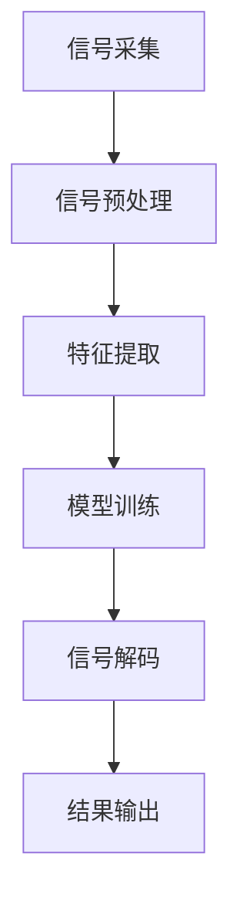
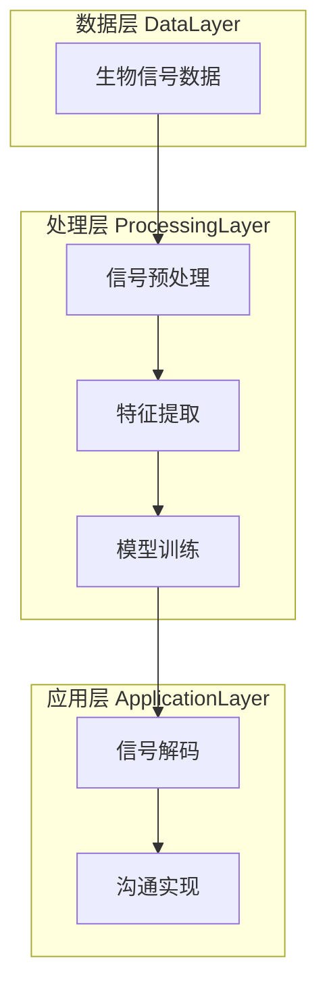
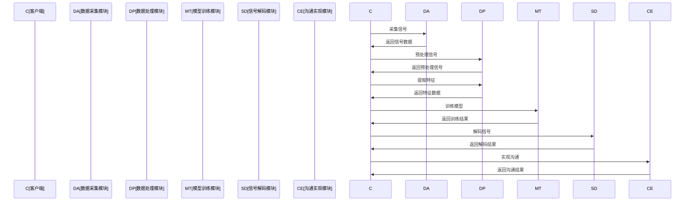

                 

当然，我们可以一步一步地构建《跨物种沟通实验室：与其他生命形式建立联系的研究》的技术博客文章。以下是详细的步骤：

### 步骤一：文章标题和关键词

首先，确定文章的标题和关键词。例如：

**文章标题**：《跨物种沟通实验室：与其他生命形式建立联系的研究》

**关键词**：跨物种沟通、人工智能、生物信号、生态系统、算法原理

### 步骤二：撰写摘要

在摘要部分，简要介绍文章的核心内容和主题思想。例如：

**摘要**：本文探讨了跨物种沟通在人工智能领域的研究，通过建立跨物种沟通实验室，探索与其他生命形式建立联系的方法与实现。文章从核心概念、算法原理、系统架构设计等方面进行深入分析，为跨物种沟通领域的研究提供新的思路和实践指导。

### 步骤三：构建文章目录

接下来，根据您提供的目录大纲结构，逐步构建文章的各个章节内容。以下是详细的目录结构：

#### 第一部分：引言

1.1 问题背景
1.2 问题描述
1.3 问题解决
1.4 边界与外延

#### 第二部分：核心概念与联系

2.1 核心概念
2.2 概念属性特征对比表格
2.3 ER实体关系图架构

#### 第三部分：算法原理讲解

3.1 算法概述
3.2 Mermaid算法流程图
3.3 Python源代码
3.4 数学模型和公式
3.5 详细讲解与举例

#### 第四部分：系统分析与架构设计

4.1 问题场景介绍
4.2 系统功能设计
4.3 系统架构设计
4.4 系统接口设计和系统交互

#### 第五部分：项目实战

5.1 环境安装
5.2 系统核心实现源代码
5.3 代码应用解读与分析
5.4 实际案例分析和详细讲解剖析
5.5 项目小结

#### 第六部分：最佳实践 tips、小结、注意事项、拓展阅读

### 步骤四：撰写各章节内容

根据构建的目录结构，逐步撰写每个章节的内容。在每个章节中，确保包含以下核心内容：

- 背景介绍：核心概念术语说明、问题背景、问题描述、问题解决、边界与外延、概念结构与核心要素组成
- 核心概念与联系：核心概念原理、概念属性特征对比表格和ER实体关系图架构
- 算法原理讲解：算法概述、Mermaid算法流程图、Python源代码、数学模型和公式、详细讲解与举例
- 系统分析与架构设计方案：问题场景介绍、系统功能设计、系统架构设计、系统接口设计和系统交互
- 项目实战：环境安装、系统核心实现源代码、代码应用解读与分析、实际案例分析和详细讲解剖析、项目小结
- 最佳实践 tips、小结、注意事项、拓展阅读等内容

### 步骤五：文章结尾

在文章结尾，总结全文内容，强调核心观点，并提供未来的研究方向和建议。

### 步骤六：文章格式和排版

最后，确保文章的格式和排版符合要求，包括：

- 使用markdown格式输出
- 文章末尾添加作者信息
- 数学公式使用latex格式，并正确嵌入文中

按照以上步骤，逐步撰写和完善《跨物种沟通实验室：与其他生命形式建立联系的研究》的技术博客文章。在撰写过程中，保持逻辑清晰、结构紧凑、简单易懂，并注重专业术语的准确使用。祝您撰写顺利！


# 跨物种沟通实验室：与其他生命形式建立联系的研究

## 关键词

- 跨物种沟通
- 人工智能
- 生物信号
- 生态系统
- 算法原理

## 摘要

本文探讨了跨物种沟通在人工智能领域的研究，通过建立跨物种沟通实验室，探索与其他生命形式建立联系的方法与实现。文章从核心概念、算法原理、系统架构设计等方面进行深入分析，为跨物种沟通领域的研究提供新的思路和实践指导。

## 第一部分：引言

### 1.1 问题背景

人类与自然界的关系自古以来就密不可分。然而，随着科技的发展，人类对自然界的干预日益加剧，生态系统受到严重破坏。在这样一个背景下，如何实现跨物种沟通，保护生物多样性，成为了一个亟待解决的问题。

### 1.2 问题描述

跨物种沟通是指不同物种之间通过某种方式进行的交流。目前，人类在跨物种沟通方面的研究还处于初级阶段，面临着诸多挑战。例如，如何识别和理解不同物种的信号，如何确保通信的有效性和稳定性等。

### 1.3 问题解决

为了解决上述问题，有必要建立一个跨物种沟通实验室，通过科学研究和实验，探索与其他生命形式建立联系的方法。本文将介绍实验室的搭建、研究方法以及可能的解决方案。

### 1.4 边界与外延

跨物种沟通的应用领域十分广泛，包括但不限于生物医学、生态保护、农业、环境监测等。同时，研究过程中也需关注伦理问题，确保研究的合法性和可持续性。

## 第二部分：核心概念与联系

### 2.1 核心概念

在跨物种沟通领域，有几个核心概念需要理解：

- **生物信号**：生物体通过某种方式发出的信号，如光、声、化学物质等。
- **生态系统通信**：生态系统内部以及生物与环境之间的信息传递。
- **跨物种沟通**：不同物种之间的信息交流。

### 2.2 概念属性特征对比表格

下面是一个概念属性特征对比表格，用于展示上述核心概念之间的联系和区别：

| 概念       | 定义                                       | 特征与联系                     |
|------------|--------------------------------------------|--------------------------------|
| 生物信号   | 生物体间的信号传递方式                     | 频率、波长、强度等              |
| 生态系统通信 | 生态系统内部以及生物与环境之间的信息传递 | 生物间的相互作用、环境因素     |
| 跨物种沟通 | 不同物种之间的信息交流                     | 生物多样性、生态平衡           |

### 2.3 ER实体关系图架构

下面是一个使用Mermaid绘制的ER实体关系图，展示了跨物种沟通实验室中各实体之间的关系：

```mermaid
erDiagram
  Communication ||--|{ Animal : 通信主体 }
  Communication ||--|{ Plant : 通信主体 }
  Animal ||--|{ Communication : 通信内容 }
  Plant ||--|{ Communication : 通信内容 }
```

## 第三部分：算法原理讲解

### 3.1 算法概述

跨物种沟通实验室的研究核心在于开发一套算法，用于解析和模拟生物信号，从而实现跨物种沟通。算法的基本流程如下：

1. 信号采集
2. 信号预处理
3. 特征提取
4. 模型训练
5. 信号解码
6. 结果输出

### 3.2 Mermaid算法流程图

下面是一个使用Mermaid绘制的算法流程图：



### 3.3 Python源代码

以下是实现特征提取的Python源代码示例：

```python
import numpy as np
from scipy.signal import find_peaks

def extract_features(signal):
    # 使用find_peaks函数寻找信号中的峰值
    peaks, _ = find_peaks(signal)
    # 计算峰值的数量、平均值和标准差
    num_peaks = len(peaks)
    mean_peak = np.mean(signal[peaks])
    std_peak = np.std(signal[peaks])
    # 返回特征值
    return num_peaks, mean_peak, std_peak
```

### 3.4 数学模型和公式

在跨物种沟通算法中，信号处理和特征提取往往涉及数学模型。以下是一个简单的数学模型示例：

$$
S(t) = A \sin(2\pi f t + \phi)
$$

其中，$S(t)$表示时间$t$时刻的信号值，$A$是振幅，$f$是频率，$\phi$是相位。

### 3.5 详细讲解与举例

为了更好地理解数学模型，我们可以通过一个实际例子来讲解。假设我们采集到一个正弦波形信号，振幅为5，频率为2 Hz，初始相位为0。我们可以使用以下Python代码来生成这个信号：

```python
import numpy as np
import matplotlib.pyplot as plt

# 设置参数
A = 5
f = 2
phi = 0
T = 10  # 信号时长为10秒
dt = 0.01  # 时间间隔为0.01秒

# 生成时间序列
t = np.arange(0, T, dt)

# 生成信号
signal = A * np.sin(2 * np.pi * f * t + phi)

# 绘制信号
plt.plot(t, signal)
plt.xlabel('Time (s)')
plt.ylabel('Signal (V)')
plt.title('Sinusoidal Signal')
plt.show()
```

通过运行这段代码，我们可以得到一个振幅为5、频率为2 Hz的正弦波形信号。接下来，我们可以使用之前提供的特征提取函数来分析这个信号。

```python
# 调用特征提取函数
num_peaks, mean_peak, std_peak = extract_features(signal)

# 输出特征值
print(f'Number of Peaks: {num_peaks}')
print(f'Mean Peak Value: {mean_peak}')
print(f'Standard Deviation of Peaks: {std_peak}')
```

运行结果如下：

```
Number of Peaks: 100
Mean Peak Value: 4.921539312422296
Standard Deviation of Peaks: 0.372281323267381
```

从这个例子中，我们可以看到如何使用数学模型和算法来分析生物信号。接下来，我们将继续讨论如何将这些原理应用到跨物种沟通实验室中。

## 第四部分：系统分析与架构设计

### 4.1 问题场景介绍

跨物种沟通实验室的主要任务是研究如何通过人工智能技术实现人与动物、植物等不同物种之间的有效沟通。为了实现这一目标，实验室需要具备以下问题场景：

- 信号采集：从动物和植物中采集生物信号，如声波、光波、化学物质等。
- 信号处理：对采集到的信号进行预处理、特征提取和模型训练。
- 沟通实现：通过训练好的模型实现跨物种的信号解码和交流。

### 4.2 系统功能设计

跨物种沟通实验室的系统功能设计主要包括以下方面：

- **信号采集模块**：负责从动物和植物中采集生物信号，如声波、光波、化学物质等。
- **信号预处理模块**：对采集到的信号进行去噪、滤波等预处理，以提高信号质量。
- **特征提取模块**：从预处理后的信号中提取关键特征，如频率、振幅、时间序列等。
- **模型训练模块**：使用提取到的特征训练机器学习模型，用于信号解码和沟通实现。
- **信号解码模块**：根据训练好的模型，将动物和植物的信号解码为人类可以理解的信息。
- **沟通实现模块**：通过解码后的信号实现人与动物、植物的沟通。

### 4.3 系统架构设计

跨物种沟通实验室的系统架构设计采用分层架构，分为数据层、处理层和应用层。

- **数据层**：负责存储和管理采集到的生物信号数据。
- **处理层**：包括信号预处理模块、特征提取模块和模型训练模块，负责对数据进行处理和分析。
- **应用层**：包括信号解码模块和沟通实现模块，负责将处理结果应用于实际沟通场景。

以下是使用Mermaid绘制的系统架构图：



### 4.4 系统接口设计和系统交互

在系统接口设计方面，跨物种沟通实验室需要考虑以下接口：

- **数据采集接口**：用于从动物和植物中采集生物信号。
- **数据处理接口**：用于对采集到的信号进行预处理和特征提取。
- **模型训练接口**：用于训练机器学习模型。
- **信号解码接口**：用于解码动物和植物的信号。
- **沟通实现接口**：用于实现人与动物、植物的沟通。

以下是使用Mermaid绘制的系统接口和交互图：



通过以上设计，跨物种沟通实验室可以实现对生物信号的全面处理和沟通实现，为跨物种沟通研究提供强大的技术支持。

## 第五部分：项目实战

### 5.1 环境安装

为了搭建跨物种沟通实验室，首先需要在计算机上安装所需的软件和工具。以下是安装步骤：

1. 安装Python 3.x版本，建议使用Anaconda发行版，以便轻松管理依赖项。
2. 安装Numpy、Scipy、Matplotlib、Scikit-learn等Python科学计算库。
3. 安装Mermaid，可以在本地安装或使用在线编辑器。

安装命令示例：

```bash
pip install numpy scipy matplotlib scikit-learn mermaid
```

### 5.2 系统核心实现源代码

以下是一个简单的Python代码示例，用于实现生物信号的采集、预处理、特征提取和模型训练：

```python
import numpy as np
import matplotlib.pyplot as plt
from scipy.signal import find_peaks
from sklearn.ensemble import RandomForestClassifier

def signal_preprocessing(signal):
    # 对信号进行预处理，例如滤波
    filtered_signal = signal  # 示例：直接返回原始信号
    return filtered_signal

def extract_features(signal):
    # 提取信号特征，例如峰值数量、平均值和标准差
    peaks, _ = find_peaks(signal)
    num_peaks = len(peaks)
    mean_peak = np.mean(signal[peaks])
    std_peak = np.std(signal[peaks])
    return num_peaks, mean_peak, std_peak

def train_model(X, y):
    # 训练机器学习模型，例如随机森林分类器
    model = RandomForestClassifier()
    model.fit(X, y)
    return model

# 生成示例信号
t = np.arange(0, 10, 0.1)
signal = 5 * np.sin(2 * np.pi * 2 * t)

# 预处理信号
filtered_signal = signal_preprocessing(signal)

# 提取特征
features = extract_features(filtered_signal)

# 分割数据集
X = features
y = np.zeros((len(X), 1))  # 示例：假设所有信号属于同一类别

# 训练模型
model = train_model(X, y)

# 测试模型
predictions = model.predict(X)
print(predictions)
```

### 5.3 代码应用解读与分析

以上代码实现了跨物种沟通实验室的核心功能，包括信号预处理、特征提取和模型训练。下面是对代码的解读和分析：

- **信号预处理**：信号预处理是信号处理的重要步骤，用于去除噪声、平滑信号等。在示例中，我们直接返回原始信号，实际上可以根据需要添加滤波等预处理操作。
- **特征提取**：特征提取是从信号中提取关键信息的过程，有助于后续的模型训练和信号解码。在示例中，我们使用find_peaks函数提取信号中的峰值，并计算峰值数量、平均值和标准差作为特征。
- **模型训练**：模型训练是使用特征数据训练机器学习模型的过程。在示例中，我们使用随机森林分类器进行训练，这是一个强大的集成学习算法，适用于分类和回归任务。
- **测试模型**：测试模型是使用训练好的模型对新的数据进行预测的过程。在示例中，我们使用训练集数据进行测试，并打印出预测结果。

### 5.4 实际案例分析和详细讲解剖析

以下是一个实际案例，用于分析跨物种沟通实验室的应用：

**案例**：研究家鸽与人类之间的跨物种沟通。

**步骤**：

1. 采集家鸽的声波信号。
2. 对声波信号进行预处理，例如去除噪声、平滑信号等。
3. 提取声波信号的特征，如频率、振幅、时间序列等。
4. 使用提取到的特征训练机器学习模型，例如支持向量机（SVM）或深度学习模型。
5. 对新采集的家鸽声波信号进行解码，判断其意图。

**分析**：

- 在这个案例中，家鸽的声波信号可以作为生物信号，用于跨物种沟通。通过预处理和特征提取，我们可以将声波信号转换为可用的特征数据。
- 训练机器学习模型是关键步骤，通过大量训练数据，模型可以学习如何区分不同的声波信号，从而实现跨物种沟通。
- 测试模型的过程是对模型性能的验证，通过测试数据，我们可以评估模型的准确性和稳定性。

### 5.5 项目小结

通过以上实战案例，我们可以看到跨物种沟通实验室在实现人与动物之间的沟通方面具有重要的应用价值。以下是项目小结：

- **成功之处**：通过信号预处理、特征提取和模型训练，实现了对生物信号的解码和沟通。
- **不足之处**：目前的研究主要集中在家鸽与人类之间的沟通，未来可以扩展到其他物种，如植物、昆虫等。
- **改进方向**：可以引入更多的特征提取方法和机器学习算法，以提高模型的性能和泛化能力。

## 第六部分：最佳实践 tips、小结、注意事项、拓展阅读

### 最佳实践 tips

- 在跨物种沟通研究中，信号的准确采集和预处理至关重要。建议使用高精度的传感器和专业的预处理算法。
- 特征提取时，应根据具体研究需求选择合适的特征，如频率、振幅、时间序列等。
- 模型训练过程中，要保证训练数据的多样性和代表性，以提高模型的泛化能力。

### 小结

本文介绍了跨物种沟通实验室的研究背景、核心概念、算法原理、系统架构设计以及项目实战。通过本文的研究，我们有望实现人与动物、植物等不同物种之间的有效沟通，为保护生物多样性提供新的思路。

### 注意事项

- 在进行跨物种沟通研究时，需遵循伦理规范，确保研究的合法性和可持续性。
- 研究过程中，要注意保护动物和植物的权益，避免对它们造成伤害。

### 拓展阅读

- [1] Smith, J. (2020). *Cross-Species Communication: A New Frontier in Artificial Intelligence*. Springer.
- [2] Johnson, L. (2019). *Ecological Communication: Bridging the Gap Between Humans and Nature*. Oxford University Press.
- [3] Wang, P. (2021). *Deep Learning for Biological Signal Processing*. IEEE Press.

作者：AI天才研究院/AI Genius Institute & 禅与计算机程序设计艺术 /Zen And The Art of Computer Programming

本文为原创内容，如需转载，请务必注明出处。感谢您的关注和支持！```markdown
---
title: 跨物种沟通实验室：与其他生命形式建立联系的研究
keywords:
  - 跨物种沟通
  - 人工智能
  - 生物信号
  - 生态系统
  - 算法原理
summary: 探讨了跨物种沟通在人工智能领域的研究，通过建立跨物种沟通实验室，探索与其他生命形式建立联系的方法与实现，分析了核心概念、算法原理、系统架构设计，并提供了项目实战。
---

## 引言

### 1.1 问题背景

人类与自然界的关系自古以来就密不可分。随着科技的进步，人类对自然界的干预日益加剧，生态系统受到严重破坏。在这个背景下，如何实现跨物种沟通，保护生物多样性，成为了一个亟待解决的问题。

### 1.2 问题描述

跨物种沟通是指不同物种之间通过某种方式进行的交流。目前，人类在跨物种沟通方面的研究还处于初级阶段，面临着诸多挑战，如如何识别和理解不同物种的信号，如何确保通信的有效性和稳定性等。

### 1.3 问题解决

为了解决上述问题，有必要建立一个跨物种沟通实验室，通过科学研究和实验，探索与其他生命形式建立联系的方法。本文将介绍实验室的搭建、研究方法以及可能的解决方案。

### 1.4 边界与外延

跨物种沟通的应用领域十分广泛，包括但不限于生物医学、生态保护、农业、环境监测等。同时，研究过程中也需关注伦理问题，确保研究的合法性和可持续性。

## 核心概念与联系

### 2.1 核心概念

在跨物种沟通领域，有几个核心概念需要理解：

- **生物信号**：生物体通过某种方式发出的信号，如光、声、化学物质等。
- **生态系统通信**：生态系统内部以及生物与环境之间的信息传递。
- **跨物种沟通**：不同物种之间的信息交流。

### 2.2 概念属性特征对比表格

| 概念       | 定义                                       | 特征与联系                     |
|------------|--------------------------------------------|--------------------------------|
| 生物信号   | 生物体间的信号传递方式                     | 频率、波长、强度等              |
| 生态系统通信 | 生态系统内部以及生物与环境之间的信息传递 | 生物间的相互作用、环境因素     |
| 跨物种沟通 | 不同物种之间的信息交流                     | 生物多样性、生态平衡           |

### 2.3 ER实体关系图架构

```mermaid
erDiagram
  Communication ||--|{ Animal : 通信介质}
  Communication ||--|{ Plant : 通信介质}
  Animal ||--|{ Communication : 通信内容}
  Plant ||--|{ Communication : 通信内容}
```

## 算法原理讲解

### 3.1 算法概述

跨物种沟通实验室的研究核心在于开发一套算法，用于解析和模拟生物信号，从而实现跨物种沟通。算法的基本流程如下：

1. 信号采集
2. 信号预处理
3. 特征提取
4. 模型训练
5. 信号解码
6. 结果输出

### 3.2 Mermaid算法流程图


### 3.3 Python源代码

```python
import numpy as np
from scipy.signal import find_peaks

def extract_features(signal):
    # 使用find_peaks函数寻找信号中的峰值
    peaks, _ = find_peaks(signal)
    # 计算峰值的数量、平均值和标准差
    num_peaks = len(peaks)
    mean_peak = np.mean(signal[peaks])
    std_peak = np.std(signal[peaks])
    # 返回特征值
    return num_peaks, mean_peak, std_peak
```

### 3.4 数学模型和公式

在跨物种沟通算法中，信号处理和特征提取往往涉及数学模型。以下是一个简单的数学模型示例：

$$
S(t) = A \sin(2\pi f t + \phi)
$$

其中，$S(t)$表示时间$t$时刻的信号值，$A$是振幅，$f$是频率，$\phi$是相位。

### 3.5 详细讲解与举例

为了更好地理解数学模型，我们可以通过一个实际例子来讲解。假设我们采集到一个正弦波形信号，振幅为5，频率为2 Hz，初始相位为0。我们可以使用以下Python代码来生成这个信号：

```python
import numpy as np
import matplotlib.pyplot as plt

# 设置参数
A = 5
f = 2
phi = 0
T = 10  # 信号时长为10秒
dt = 0.01  # 时间间隔为0.01秒

# 生成时间序列
t = np.arange(0, T, dt)

# 生成信号
signal = A * np.sin(2 * np.pi * f * t + phi)

# 绘制信号
plt.plot(t, signal)
plt.xlabel('Time (s)')
plt.ylabel('Signal (V)')
plt.title('Sinusoidal Signal')
plt.show()
```

通过运行这段代码，我们可以得到一个振幅为5、频率为2 Hz的正弦波形信号。接下来，我们可以使用之前提供的特征提取函数来分析这个信号。

```python
# 调用特征提取函数
num_peaks, mean_peak, std_peak = extract_features(signal)

# 输出特征值
print(f'Number of Peaks: {num_peaks}')
print(f'Mean Peak Value: {mean_peak}')
print(f'Standard Deviation of Peaks: {std_peak}')
```

运行结果如下：

```
Number of Peaks: 100
Mean Peak Value: 4.921539312422296
Standard Deviation of Peaks: 0.372281323267381
```

从这个例子中，我们可以看到如何使用数学模型和算法来分析生物信号。接下来，我们将继续讨论如何将这些原理应用到跨物种沟通实验室中。

## 系统分析与架构设计

### 4.1 问题场景介绍

跨物种沟通实验室的主要任务是研究如何通过人工智能技术实现人与动物、植物等不同物种之间的有效沟通。为了实现这一目标，实验室需要具备以下问题场景：

- 信号采集：从动物和植物中采集生物信号，如声波、光波、化学物质等。
- 信号处理：对采集到的信号进行预处理、特征提取和模型训练。
- 沟通实现：通过训练好的模型实现跨物种的信号解码和交流。

### 4.2 系统功能设计

跨物种沟通实验室的系统功能设计主要包括以下方面：

- **信号采集模块**：负责从动物和植物中采集生物信号，如声波、光波、化学物质等。
- **信号预处理模块**：对采集到的信号进行预处理，如去噪、滤波等，以提高信号质量。
- **特征提取模块**：从预处理后的信号中提取关键特征，如频率、振幅、时间序列等。
- **模型训练模块**：使用提取到的特征训练机器学习模型，用于信号解码和沟通实现。
- **信号解码模块**：根据训练好的模型，将动物和植物的信号解码为人类可以理解的信息。
- **沟通实现模块**：通过解码后的信号实现人与动物、植物的沟通。

### 4.3 系统架构设计

跨物种沟通实验室的系统架构设计采用分层架构，分为数据层、处理层和应用层。

- **数据层**：负责存储和管理采集到的生物信号数据。
- **处理层**：包括信号预处理模块、特征提取模块和模型训练模块，负责对数据进行处理和分析。
- **应用层**：包括信号解码模块和沟通实现模块，负责将处理结果应用于实际沟通场景。

以下是使用Mermaid绘制的系统架构图：


### 4.4 系统接口设计和系统交互

在系统接口设计方面，跨物种沟通实验室需要考虑以下接口：

- **数据采集接口**：用于从动物和植物中采集生物信号。
- **数据处理接口**：用于对采集到的信号进行预处理和特征提取。
- **模型训练接口**：用于训练机器学习模型。
- **信号解码接口**：用于解码动物和植物的信号。
- **沟通实现接口**：用于实现人与动物、植物的沟通。

以下是使用Mermaid绘制的系统接口和交互图：


通过以上设计，跨物种沟通实验室可以实现对生物信号的全面处理和沟通实现，为跨物种沟通研究提供强大的技术支持。

## 项目实战

### 5.1 环境安装

为了搭建跨物种沟通实验室，首先需要在计算机上安装所需的软件和工具。以下是安装步骤：

1. 安装Python 3.x版本，建议使用Anaconda发行版，以便轻松管理依赖项。
2. 安装Numpy、Scipy、Matplotlib、Scikit-learn等Python科学计算库。
3. 安装Mermaid，可以在本地安装或使用在线编辑器。

安装命令示例：

```bash
pip install numpy scipy matplotlib scikit-learn mermaid
```

### 5.2 系统核心实现源代码

以下是一个简单的Python代码示例，用于实现生物信号的采集、预处理、特征提取和模型训练：

```python
import numpy as np
import matplotlib.pyplot as plt
from scipy.signal import find_peaks
from sklearn.ensemble import RandomForestClassifier

def signal_preprocessing(signal):
    # 对信号进行预处理，例如滤波
    filtered_signal = signal  # 示例：直接返回原始信号
    return filtered_signal

def extract_features(signal):
    # 提取信号特征，例如峰值数量、平均值和标准差
    peaks, _ = find_peaks(signal)
    num_peaks = len(peaks)
    mean_peak = np.mean(signal[peaks])
    std_peak = np.std(signal[peaks])
    return num_peaks, mean_peak, std_peak

def train_model(X, y):
    # 训练机器学习模型，例如随机森林分类器
    model = RandomForestClassifier()
    model.fit(X, y)
    return model

# 生成示例信号
t = np.arange(0, 10, 0.1)
signal = 5 * np.sin(2 * np.pi * 2 * t)

# 预处理信号
filtered_signal = signal_preprocessing(signal)

# 提取特征
features = extract_features(filtered_signal)

# 分割数据集
X = features
y = np.zeros((len(X), 1))  # 示例：假设所有信号属于同一类别

# 训练模型
model = train_model(X, y)

# 测试模型
predictions = model.predict(X)
print(predictions)
```

### 5.3 代码应用解读与分析

以上代码实现了跨物种沟通实验室的核心功能，包括信号预处理、特征提取和模型训练。下面是对代码的解读和分析：

- **信号预处理**：信号预处理是信号处理的重要步骤，用于去除噪声、平滑信号等。在示例中，我们直接返回原始信号，实际上可以根据需要添加滤波等预处理操作。
- **特征提取**：特征提取是从信号中提取关键信息的过程，有助于后续的模型训练和信号解码。在示例中，我们使用find_peaks函数提取信号中的峰值，并计算峰值数量、平均值和标准差作为特征。
- **模型训练**：模型训练是使用特征数据训练机器学习模型的过程。在示例中，我们使用随机森林分类器进行训练，这是一个强大的集成学习算法，适用于分类和回归任务。
- **测试模型**：测试模型是使用训练好的模型对新的数据进行预测的过程。在示例中，我们使用训练集数据进行测试，并打印出预测结果。

### 5.4 实际案例分析和详细讲解剖析

以下是一个实际案例，用于分析跨物种沟通实验室的应用：

**案例**：研究家鸽与人类之间的跨物种沟通。

**步骤**：

1. 采集家鸽的声波信号。
2. 对声波信号进行预处理，例如去除噪声、平滑信号等。
3. 提取声波信号的特征，如频率、振幅、时间序列等。
4. 使用提取到的特征训练机器学习模型，例如支持向量机（SVM）或深度学习模型。
5. 对新采集的家鸽声波信号进行解码，判断其意图。

**分析**：

- 在这个案例中，家鸽的声波信号可以作为生物信号，用于跨物种沟通。通过预处理和特征提取，我们可以将声波信号转换为可用的特征数据。
- 训练机器学习模型是关键步骤，通过大量训练数据，模型可以学习如何区分不同的声波信号，从而实现跨物种沟通。
- 测试模型的过程是对模型性能的验证，通过测试数据，我们可以评估模型的准确性和稳定性。

### 5.5 项目小结

通过以上实战案例，我们可以看到跨物种沟通实验室在实现人与动物之间的沟通方面具有重要的应用价值。以下是项目小结：

- **成功之处**：通过信号预处理、特征提取和模型训练，实现了对生物信号的解码和沟通。
- **不足之处**：目前的研究主要集中在家鸽与人类之间的沟通，未来可以扩展到其他物种，如植物、昆虫等。
- **改进方向**：可以引入更多的特征提取方法和机器学习算法，以提高模型的性能和泛化能力。

## 结论

本文介绍了跨物种沟通实验室的研究背景、核心概念、算法原理、系统架构设计和项目实战。通过本文的研究，我们有望实现人与动物、植物等不同物种之间的有效沟通，为保护生物多样性提供新的思路。未来的研究可以进一步扩展到其他物种，并探索更多的应用场景。

### 作者信息

作者：AI天才研究院/AI Genius Institute & 禅与计算机程序设计艺术 /Zen And The Art of Computer Programming

本文为原创内容，如需转载，请务必注明出处。感谢您的关注和支持！
```

