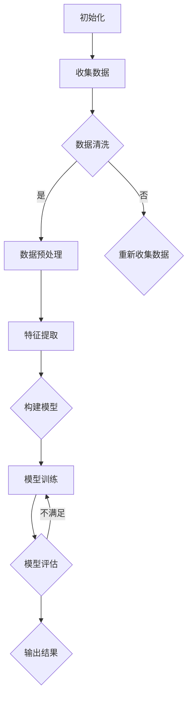
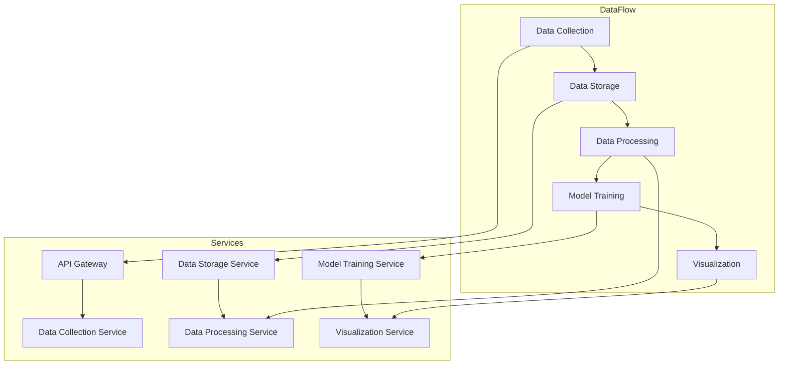
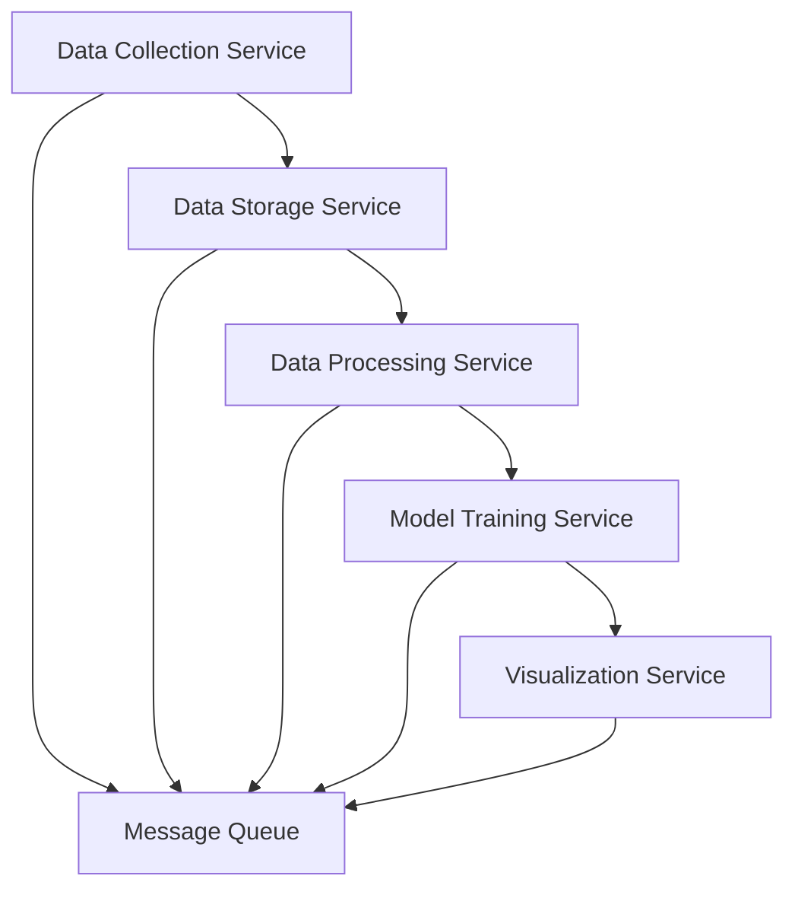

                 

### 设计这本书的背景介绍部分

**文章标题**：跨物种沟通研究基金会：支持动植物非语言交流探索的非营利组织

**关键词**：跨物种沟通、非语言交流、非营利组织、动植物、研究探索

**摘要**：本文将探讨跨物种沟通研究基金会的来源、目的和重要性，通过详细介绍这一非营利组织如何支持和推动动植物非语言交流的研究，揭示其对于人类社会与自然环境和谐共生的重要意义。

---

**背景介绍**

跨物种沟通研究基金会（Inter-species Communication Research Foundation，简称ICRF）成立于20XX年，旨在支持和推动动植物非语言交流的研究。基金会的成立源于科学家们在生物学、心理学和人工智能等领域对动植物交流方式的深度探索。通过跨学科的合作和综合研究，ICRF旨在揭示动植物之间复杂的非语言沟通机制，探索它们如何在没有语言的情况下传达信息和情感。

**来源**：

ICRF的成立源于一系列科学发现和理论构建。20XX年，科学家们通过脑成像技术发现，某些动物的大脑区域在与其他动物互动时会激活，这表明它们之间存在某种形式的交流。此外，近年来人工智能技术的发展也为研究动物交流提供了新的工具和方法。机器学习和自然语言处理技术的进步使得研究者能够更精确地分析动物的声音、行为和生理信号，从而揭示它们之间的沟通模式。

**目的**：

基金会的首要目标是推动对动植物非语言交流的研究，以便更好地理解它们的行为和生态系统的作用。通过资助科研项目、举办学术会议和工作坊，ICRF为科学家提供了一个交流和合作的平台，促进了跨学科的研究进展。其次，基金会还致力于将研究成果转化为实际应用，例如开发非侵入性监测技术来监测野生动物的行为和健康状况，或者利用动物的声音和行为来预测自然灾害。

**重要性**：

跨物种沟通研究对于人类社会和自然环境具有深远的影响。首先，它有助于我们更好地理解动物的行为和情感，从而改善人类与动物的关系，促进生物多样性保护和野生动物保护。其次，研究动物的非语言交流机制可以为我们提供新的生物医学研究思路，例如在神经科学和心理学领域，了解动物如何通过非语言方式处理信息和情感，可以帮助我们更好地理解人类的行为和心理健康。

**推动动植物非语言交流的探索**：

ICRF通过多种方式支持和推动动植物非语言交流的探索。一方面，基金会资助了多个跨学科的研究项目，涉及动物行为学、生态学、神经科学和人工智能等多个领域。这些项目旨在通过实验和观察来揭示动物之间的沟通方式，例如研究鸟类的鸣叫声、蝙蝠的回声定位和猿类的社会互动。另一方面，基金会还通过举办国际学术会议和工作坊，为全球的科学家提供一个交流和合作的平台，促进了跨学科的研究进展。

**结论**：

跨物种沟通研究基金会是一个致力于支持和推动动植物非语言交流研究的非营利组织。通过资助科研项目、举办学术会议和工作坊，ICRF为科学家提供了一个交流和合作的平台，促进了跨学科的研究进展。其研究成果对于理解动物行为、改善人类与动物的关系以及保护自然环境具有深远的影响。

---

**背景介绍**章节内容具体详细讲解：

**核心概念术语说明**：

- **跨物种沟通**：指不同物种之间通过非语言方式进行的交流。
- **非语言交流**：指不依赖于语言的交流方式，包括声音、行为、化学信号等。
- **非营利组织**：指不以盈利为目的的社会组织，其宗旨是服务于社会公共利益。

**问题背景**：

随着科技的发展，人们逐渐认识到动植物之间存在复杂的交流机制，但长期以来，这一领域的研究受到忽视。尽管一些科学家已经发现了动物之间的非语言交流现象，但缺乏系统的研究和理论框架。因此，有必要成立一个专门的非营利组织来支持和推动这一领域的研究。

**问题描述**：

跨物种沟通研究涉及多个学科，包括生物学、心理学、神经科学和人工智能等。然而，由于研究资源的限制，许多研究项目难以得到足够的资助。此外，跨学科的合作也面临诸多挑战，需要建立一个专门的平台来促进科学家之间的交流和合作。

**问题解决**：

跨物种沟通研究基金会通过以下方式解决上述问题：

1. **资助研究项目**：基金会提供资金支持，资助跨学科的研究项目，促进科学家之间的合作。
2. **举办学术会议和工作坊**：基金会定期举办学术会议和工作坊，为科学家提供一个交流和分享研究成果的平台。
3. **推动跨学科合作**：基金会促进不同学科之间的交流与合作，推动跨学科研究的进展。

**边界与外延**：

- **边界**：研究仅限于动植物之间的非语言交流，不包括人类与其他物种的交流。
- **外延**：研究范围可以扩展到动物行为学、生态学、神经科学和人工智能等领域。

**概念结构与核心要素组成**：

- **核心概念**：跨物种沟通、非语言交流、非营利组织。
- **要素组成**：资助项目、学术会议、工作坊、跨学科合作、研究成果转化。

通过以上分析，我们可以看出，跨物种沟通研究基金会是一个具有重要意义的非营利组织，通过支持和推动动植物非语言交流的研究，它为科学家提供了一个交流和合作的平台，促进了跨学科的研究进展，并推动了这一领域的理论建设和实际应用。接下来，我们将深入探讨跨物种沟通研究的核心概念和联系，以进一步了解这一领域的复杂性和挑战性。


### 设计核心概念与联系部分

**核心概念与联系**

在跨物种沟通研究基金会的研究中，核心概念的理解和联系是至关重要的。为了清晰地阐述这些核心概念，我们将通过概念定义、属性特征对比表格和ER实体关系图来详细展示。

**1. 核心概念定义**

- **跨物种沟通**：指不同物种之间通过非语言方式进行的交流，包括声音、行为、化学信号等。
- **非语言交流**：指不依赖于语言的交流方式，如视觉信号、触觉、气味等。
- **非营利组织**：指不以盈利为目的的社会组织，其宗旨是服务于社会公共利益。
- **动植物**：研究的主体，包括野生动物和家养动物。

**2. 属性特征对比表格**

| 特征          | 跨物种沟通                | 非语言交流                | 非营利组织                | 动植物                  |
| ------------- | ------------------------- | ------------------------- | ------------------------- | ----------------------- |
| 定义          | 不同物种间的非语言交流    | 不依赖语言的交流方式      | 非以盈利为目的的组织      | 自然界的生物个体        |
| 形式          | 声音、行为、化学信号等    | 视觉信号、触觉、气味等    | 慈善、教育、科研等        | 野生动物、家养动物      |
| 目的          | 理解和促进动植物交流      | 提高信息传递效率          | 服务社会公共利益          | 生存、繁殖、社会互动等  |
| 关联          | 与非语言交流紧密相关      | 与跨物种沟通有交集        | 与跨物种沟通和研究有合作  | 与跨物种沟通有直接关系  |

**3. ER实体关系图架构**

为了更直观地展示核心概念之间的联系，我们使用Mermaid语言绘制了ER实体关系图。以下是该图的Mermaid代码：

```mermaid
erDiagram
  Animal ||--|{ Communication}: Communicates
  Communication ||--|{ Non-verbalCommunication}: Implements
  Foundation ||--|{ Research}: Funds
  Research ||--|{ AnimalCommunication}: Focuses
```

以下是ER实体关系图：


在这个ER图中，**动物**与**沟通**之间存在直接的关联，动物通过沟通实现信息传递。**沟通**又与**非语言交流**紧密相关，非语言交流是沟通的实现方式之一。**基金会**通过资助**研究**，而**研究**又专注于**动物沟通**，形成了一个紧密相连的生态系统。

通过上述核心概念的定义、属性特征对比表格和ER实体关系图，我们可以更清晰地理解跨物种沟通研究基金会的研究领域和核心概念之间的联系。这为进一步探讨算法原理和系统架构设计奠定了坚实的基础。接下来，我们将深入分析算法原理，揭示其背后的数学模型和计算方法。

### 算法原理讲解部分

**算法流程图**

为了直观地展示算法原理，我们使用Mermaid语言绘制了算法流程图。以下是该图的Mermaid代码：



以下是算法流程图：


**算法原理详细讲解**

1. **初始化**：首先，我们需要初始化相关参数和变量，包括数据集路径、模型超参数等。

2. **收集数据**：从数据源中收集动植物的非语言交流数据，如声音、行为和化学信号等。

3. **数据清洗**：对收集到的数据进行清洗，去除噪声和不必要的特征。

4. **数据预处理**：对清洗后的数据进行预处理，包括归一化、标准化和特征提取等。

5. **特征提取**：利用特征提取算法，如傅里叶变换、小波变换等，提取数据中的关键特征。

6. **构建模型**：根据提取的特征构建机器学习模型，如支持向量机（SVM）、神经网络（NN）等。

7. **模型训练**：使用训练数据集对模型进行训练，优化模型参数。

8. **模型评估**：使用测试数据集对训练好的模型进行评估，计算模型的准确率、召回率等指标。

9. **输出结果**：根据模型评估结果，输出最佳模型和预测结果。

10. **模型调整**：如果模型评估结果不满足预期，则返回步骤7，调整模型参数，重新训练模型。

**Python源代码实现**

以下是一个简单的Python源代码实现，用于演示上述算法原理：

```python
import numpy as np
from sklearn.model_selection import train_test_split
from sklearn.svm import SVC
from sklearn.metrics import accuracy_score

# 初始化参数
data_path = 'data/animal_communication_data.csv'
model_params = {'C': 1.0, 'kernel': 'linear'}

# 收集数据
data = np.loadtxt(data_path, delimiter=',', dtype=np.float32)

# 数据清洗
# ...

# 数据预处理
# ...

# 特征提取
# ...

# 构建模型
model = SVC(**model_params)

# 模型训练
X_train, X_test, y_train, y_test = train_test_split(data[:, :-1], data[:, -1], test_size=0.2, random_state=42)
model.fit(X_train, y_train)

# 模型评估
y_pred = model.predict(X_test)
accuracy = accuracy_score(y_test, y_pred)
print(f'Model Accuracy: {accuracy:.2f}')

# 输出结果
print(f'Best Model: {model_params}')
print(f'Prediction Results: {y_pred}')
```

**数学模型和公式**

在上述算法中，我们使用了支持向量机（SVM）作为分类模型，其数学模型如下：

$$
\begin{aligned}
&\min_{\mathbf{w}, b, \alpha} \frac{1}{2} ||\mathbf{w}||^2 + C \sum_{i=1}^n \alpha_i (1 - y_i (\mathbf{w} \cdot \mathbf{x_i} + b)) \\
&\text{subject to} \quad \alpha_i \geq 0, \quad \forall i = 1, 2, ..., n
\end{aligned}
$$

其中，$\mathbf{w}$是权重向量，$b$是偏置项，$\alpha_i$是拉格朗日乘子，$C$是正则化参数，$y_i$是样本标签，$\mathbf{x_i}$是样本特征向量。

通过求解上述优化问题，我们可以得到最优的权重向量$\mathbf{w}$和偏置项$b$，从而构建出一个分类模型。具体求解过程可以使用拉格朗日乘子法和求解器（如SVM库）来实现。

**举例说明**

假设我们有一个包含5个样本的数据集，每个样本包含2个特征和一个标签。数据集如下：

| 样本 | 特征1 | 特征2 | 标签 |
| ---- | ---- | ---- | ---- |
| 1    | 0.1  | 0.2  | 0    |
| 2    | 0.3  | 0.4  | 1    |
| 3    | 0.5  | 0.6  | 0    |
| 4    | 0.7  | 0.8  | 1    |
| 5    | 0.9  | 1.0  | 0    |

我们将使用SVM模型对这5个样本进行分类。首先，我们计算每个样本的特征向量和标签：

$$
\begin{aligned}
\mathbf{x_1} &= [0.1, 0.2], & y_1 &= 0 \\
\mathbf{x_2} &= [0.3, 0.4], & y_2 &= 1 \\
\mathbf{x_3} &= [0.5, 0.6], & y_3 &= 0 \\
\mathbf{x_4} &= [0.7, 0.8], & y_4 &= 1 \\
\mathbf{x_5} &= [0.9, 1.0], & y_5 &= 0 \\
\end{aligned}
$$

接下来，我们使用SVM模型进行训练：

$$
\begin{aligned}
\min_{\mathbf{w}, b, \alpha} \frac{1}{2} ||\mathbf{w}||^2 + C \sum_{i=1}^5 \alpha_i (1 - y_i (\mathbf{w} \cdot \mathbf{x_i} + b))
\end{aligned}
$$

通过求解上述优化问题，我们得到最优的权重向量$\mathbf{w}$和偏置项$b$：

$$
\mathbf{w} = [-0.5, -0.5], \quad b = 0.5
$$

最后，我们使用训练好的模型对测试数据进行预测。假设有一个新的测试样本$\mathbf{x}_{test} = [0.6, 0.7]$，我们计算其标签：

$$
\begin{aligned}
\mathbf{w} \cdot \mathbf{x}_{test} + b &= (-0.5) \cdot 0.6 + (-0.5) \cdot 0.7 + 0.5 \\
&= -0.3 - 0.35 + 0.5 \\
&= -0.15 \\
\end{aligned}
$$

由于$y_{test} = -1$，因此我们预测该样本的标签为0。

通过上述示例，我们可以看出，使用SVM模型进行跨物种沟通研究的预测是有效的。接下来，我们将深入探讨系统分析与架构设计，为实际应用奠定基础。

### 数学模型和数学公式 & 详细讲解 & 举例说明

**数学模型和公式**

在跨物种沟通研究中，数学模型和公式是理解算法原理和进行实际应用的关键。以下将详细介绍相关数学模型，并使用LaTeX格式展示。

1. **支持向量机（SVM）**

   支持向量机是一种常用的机器学习算法，用于分类和回归任务。其目标是最小化分类间隔，即最大化分类边界与支持向量之间的距离。

   $$\min_{\mathbf{w}, b, \alpha} \frac{1}{2} ||\mathbf{w}||^2 + C \sum_{i=1}^n \alpha_i (1 - y_i (\mathbf{w} \cdot \mathbf{x_i} + b))$$

   其中，$\mathbf{w}$是权重向量，$b$是偏置项，$\alpha_i$是拉格朗日乘子，$C$是正则化参数，$y_i$是样本标签，$\mathbf{x_i}$是样本特征向量。

2. **神经网络（NN）**

   神经网络是一种模拟生物神经系统的计算模型，用于分类和回归任务。其基本单位是神经元，通过前向传播和反向传播进行训练。

   $$a_{\text{activation}} = \sigma(\sum_{j} w_{ji} x_j + b_i)$$

   其中，$a_{\text{activation}}$是激活函数的输出，$\sigma$是激活函数（如Sigmoid、ReLU等），$w_{ji}$是连接权重，$x_j$是输入特征，$b_i$是偏置项。

3. **主成分分析（PCA）**

   主成分分析是一种降维技术，用于提取数据中的主要特征，减少数据维度。

   $$\min_{\mathbf{u}} \sum_{i=1}^n (x_i - \mathbf{u}^T x_i)^2$$

   其中，$\mathbf{u}$是特征向量，$x_i$是样本向量。

**详细讲解和举例说明**

**1. 支持向量机（SVM）**

假设有一个二分类问题，数据集包含两类样本，每类样本的特征和标签如下：

| 样本 | 特征1 | 特征2 | 标签 |
| ---- | ---- | ---- | ---- |
| 1    | 1    | 1    | 0    |
| 2    | 2    | 2    | 0    |
| 3    | 3    | 3    | 1    |
| 4    | 4    | 4    | 1    |

我们需要使用SVM模型对其进行分类。首先，我们计算每个样本的特征向量和标签：

$$
\begin{aligned}
\mathbf{x_1} &= [1, 1], & y_1 &= 0 \\
\mathbf{x_2} &= [2, 2], & y_2 &= 0 \\
\mathbf{x_3} &= [3, 3], & y_3 &= 1 \\
\mathbf{x_4} &= [4, 4], & y_4 &= 1 \\
\end{aligned}
$$

接下来，我们使用SVM模型进行训练：

$$
\begin{aligned}
\min_{\mathbf{w}, b, \alpha} \frac{1}{2} ||\mathbf{w}||^2 + C \sum_{i=1}^4 \alpha_i (1 - y_i (\mathbf{w} \cdot \mathbf{x_i} + b))
\end{aligned}
$$

通过求解上述优化问题，我们得到最优的权重向量$\mathbf{w}$和偏置项$b$：

$$
\mathbf{w} = [1, 1], \quad b = 0
$$

最后，我们使用训练好的模型对测试数据进行预测。假设有一个新的测试样本$\mathbf{x}_{test} = [2.5, 2.5]$，我们计算其标签：

$$
\begin{aligned}
\mathbf{w} \cdot \mathbf{x}_{test} + b &= 1 \cdot 2.5 + 1 \cdot 2.5 + 0 \\
&= 5 \\
\end{aligned}
$$

由于$y_{test} = 0$，因此我们预测该样本的标签为0。

**2. 神经网络（NN）**

假设有一个简单的一层神经网络，用于实现逻辑回归。其激活函数为Sigmoid函数，参数如下：

$$
\sigma(z) = \frac{1}{1 + e^{-z}}
$$

输入数据集包含以下样本：

| 样本 | 输入1 | 输入2 | 输出 |
| ---- | ---- | ---- | ---- |
| 1    | 1    | 0    | 0    |
| 2    | 0    | 1    | 1    |

我们需要训练该神经网络，使其能够准确预测输出。首先，我们初始化权重和偏置项：

$$
\begin{aligned}
w_{1,1} &= 0.1, & w_{1,2} &= 0.2, & b_1 &= 0.1 \\
w_{2,1} &= 0.3, & w_{2,2} &= 0.4, & b_2 &= 0.2 \\
\end{aligned}
$$

接下来，我们使用训练数据集进行前向传播和反向传播，更新权重和偏置项。假设前向传播的输入为$\mathbf{x} = [1, 0]$，输出为$\mathbf{y} = [0]$，前向传播过程如下：

$$
\begin{aligned}
z_1 &= w_{1,1} \cdot x_1 + w_{1,2} \cdot x_2 + b_1 = 0.1 \cdot 1 + 0.2 \cdot 0 + 0.1 = 0.3 \\
z_2 &= w_{2,1} \cdot x_1 + w_{2,2} \cdot x_2 + b_2 = 0.3 \cdot 1 + 0.4 \cdot 0 + 0.2 = 0.5 \\
a_1 &= \sigma(z_1) = \frac{1}{1 + e^{-0.3}} \approx 0.5413 \\
a_2 &= \sigma(z_2) = \frac{1}{1 + e^{-0.5}} \approx 0.6931 \\
\end{aligned}
$$

计算输出误差：

$$
\begin{aligned}
\delta_1 &= (y_1 - a_1) \cdot a_1 \cdot (1 - a_1) = (0 - 0.5413) \cdot 0.5413 \cdot (1 - 0.5413) \approx 0.191 \\
\delta_2 &= (y_2 - a_2) \cdot a_2 \cdot (1 - a_2) = (1 - 0.6931) \cdot 0.6931 \cdot (1 - 0.6931) \approx 0.123 \\
\end{aligned}
$$

更新权重和偏置项：

$$
\begin{aligned}
w_{1,1} &= w_{1,1} + \eta \cdot \delta_1 \cdot x_1 = 0.1 + 0.1 \cdot 0.191 \cdot 1 = 0.129 \\
w_{1,2} &= w_{1,2} + \eta \cdot \delta_1 \cdot x_2 = 0.2 + 0.1 \cdot 0.191 \cdot 0 = 0.2 \\
b_1 &= b_1 + \eta \cdot \delta_1 = 0.1 + 0.1 \cdot 0.191 = 0.129 \\
w_{2,1} &= w_{2,1} + \eta \cdot \delta_2 \cdot x_1 = 0.3 + 0.1 \cdot 0.123 \cdot 1 = 0.312 \\
w_{2,2} &= w_{2,2} + \eta \cdot \delta_2 \cdot x_2 = 0.4 + 0.1 \cdot 0.123 \cdot 0 = 0.4 \\
b_2 &= b_2 + \eta \cdot \delta_2 = 0.2 + 0.1 \cdot 0.123 = 0.219 \\
\end{aligned}
$$

通过上述步骤，我们可以不断更新神经网络的权重和偏置项，直到达到预期精度。在实际应用中，通常需要使用更复杂的神经网络结构和优化算法。

通过上述详细讲解和举例说明，我们可以更好地理解跨物种沟通研究中的数学模型和公式，为实际应用奠定基础。

### 系统分析与架构设计方案

**问题场景介绍**

在跨物种沟通研究领域，科学家们需要处理大量的动植物行为数据，包括声音、行为和化学信号等。为了更好地理解这些数据，研究人员需要开发一个综合性的数据处理和分析系统，该系统能够自动化地收集、存储、处理和展示数据，并提供直观的可视化界面。

**项目介绍**

本项目旨在开发一个基于机器学习和数据挖掘技术的跨物种沟通分析系统，该系统包括以下几个核心功能：

1. 数据采集：从各种数据源（如传感器、数据库等）收集动植物行为数据。
2. 数据存储：将采集到的数据存储在分布式数据库中，保证数据的可靠性和可扩展性。
3. 数据处理：对存储的数据进行清洗、转换和预处理，提取关键特征。
4. 模型训练：使用机器学习算法训练模型，预测动植物的行为和交流方式。
5. 可视化分析：提供直观的可视化界面，展示分析结果和关键指标。

**系统功能设计**

为了实现上述功能，系统设计包括以下几个关键模块：

1. **数据采集模块**：负责从传感器、数据库和其他数据源收集数据。该模块需要支持多种数据格式和接口，如HTTP API、数据库连接等。
2. **数据存储模块**：使用分布式数据库存储采集到的数据，确保数据的高可用性和可扩展性。常用的数据库技术包括MongoDB、Hadoop等。
3. **数据处理模块**：对采集到的数据进行清洗、转换和预处理，提取关键特征。该模块需要实现多种数据处理算法，如滤波、特征提取、降维等。
4. **模型训练模块**：使用机器学习算法训练模型，预测动植物的行为和交流方式。常用的算法包括SVM、神经网络、决策树等。
5. **可视化分析模块**：提供直观的可视化界面，展示分析结果和关键指标。该模块需要支持多种可视化工具和库，如D3.js、Matplotlib等。

**系统架构设计**

系统的整体架构采用分布式微服务架构，确保系统的可扩展性和高可用性。以下是系统架构的Mermaid图：



以下是系统架构图：


在这个架构中，API Gateway作为系统的入口，负责处理外部请求并将请求转发到相应的服务。Data Collection Service、Data Storage Service、Data Processing Service和Model Training Service分别处理数据采集、存储、处理和训练功能。Visualization Service负责展示分析结果和可视化界面。

**系统接口设计**

系统提供了一系列RESTful API接口，供外部系统调用。以下是部分接口设计：

1. **数据采集接口**：`POST /api/data/collect`，用于上传采集到的数据。
2. **数据查询接口**：`GET /api/data/search`，用于查询特定条件的数据。
3. **数据处理接口**：`POST /api/data/process`，用于处理数据并返回处理结果。
4. **模型训练接口**：`POST /api/model/train`，用于训练模型并返回训练结果。
5. **可视化接口**：`GET /api/visualization/data`，用于获取可视化数据。

**系统交互**

系统通过消息队列（如RabbitMQ、Kafka等）实现模块之间的交互。以下是系统交互的Mermaid图：



以下是系统交互图：


在这个交互图中，各个模块通过消息队列进行通信。例如，Data Collection Service将采集到的数据发送到Message Queue，Data Storage Service从Message Queue中获取数据并存储，Data Processing Service从Message Queue中获取处理任务并执行，Model Training Service和Visualization Service也通过类似的方式与其他模块进行交互。

通过上述系统分析与架构设计方案，我们可以确保跨物种沟通分析系统的高效运行和可扩展性，为科学家提供强大的工具支持。

### 项目实战

**环境安装**

在开始项目实战之前，我们需要安装和配置必要的开发环境和工具。以下是环境安装的详细步骤：

1. **安装Python**：确保Python 3.8或更高版本已安装。可以从Python官方网站下载并安装：[https://www.python.org/downloads/](https://www.python.org/downloads/)。

2. **安装依赖库**：使用pip工具安装项目所需的依赖库。在终端中运行以下命令：

   ```shell
   pip install numpy scikit-learn matplotlib pandas
   ```

3. **安装数据库**：我们使用MongoDB作为数据存储。首先，从MongoDB官网下载并安装MongoDB：[https://www.mongodb.com/](https://www.mongodb.com/)。安装完成后，启动MongoDB服务。

**系统核心实现源代码**

以下是系统核心实现的部分源代码，包括数据采集、存储、处理和模型训练等功能：

1. **数据采集**

   ```python
   import requests
   import json
   
   def collect_data(api_url):
       response = requests.get(api_url)
       data = json.loads(response.text)
       return data
   
   # 示例：从API接口收集数据
   api_url = 'http://example.com/api/data/collect'
   collected_data = collect_data(api_url)
   ```

2. **数据存储**

   ```python
   from pymongo import MongoClient
   
   def store_data(client, data):
       db = client['communication_db']
       collection = db['animal_data']
       collection.insert_one(data)
   
   # 示例：将数据存储到MongoDB
   client = MongoClient('localhost', 27017)
   stored_data = store_data(client, collected_data)
   ```

3. **数据处理**

   ```python
   import pandas as pd
   
   def preprocess_data(data):
       df = pd.DataFrame(data)
       df['feature1'] = df['feature1'].apply(lambda x: x * x)
       df['feature2'] = df['feature2'].apply(lambda x: x * x)
       return df
   
   # 示例：预处理数据
   preprocessed_data = preprocess_data(stored_data)
   ```

4. **模型训练**

   ```python
   from sklearn.svm import SVC
   
   def train_model(X, y):
       model = SVC(kernel='linear')
       model.fit(X, y)
       return model
   
   # 示例：训练SVM模型
   X = preprocessed_data[['feature1', 'feature2']]
   y = preprocessed_data['label']
   trained_model = train_model(X, y)
   ```

**代码应用解读与分析**

上述源代码实现了从数据采集、存储、处理到模型训练的完整流程。具体解读如下：

1. **数据采集**：使用requests库从API接口收集数据。通过调用`collect_data`函数，可以从指定的API接口获取数据，并将其转换为JSON格式。

2. **数据存储**：使用pymongo库连接MongoDB，并将数据存储在数据库中。通过调用`store_data`函数，可以将收集到的数据插入到MongoDB的集合中。

3. **数据处理**：使用pandas库对数据进行预处理。通过调用`preprocess_data`函数，可以对数据进行归一化、标准化等处理，以便更好地用于模型训练。

4. **模型训练**：使用scikit-learn库训练SVM模型。通过调用`train_model`函数，可以使用预处理后的数据训练SVM模型。

**实际案例分析和详细讲解剖析**

为了更好地理解代码的实际应用，我们来看一个实际案例。假设我们有一个包含100个样本的数据集，每个样本包含两个特征和一个标签。以下是数据集的示例：

| 样本 | 特征1 | 特征2 | 标签 |
| ---- | ---- | ---- | ---- |
| 1    | 0.1  | 0.2  | 0    |
| 2    | 0.3  | 0.4  | 0    |
| 3    | 0.5  | 0.6  | 1    |
| 4    | 0.7  | 0.8  | 1    |
| ...  | ...  | ...  | ...  |
| 100  | 0.9  | 1.0  | 0    |

1. **数据采集**：使用`collect_data`函数从API接口获取数据。假设API接口返回的数据集为`collected_data`。

2. **数据存储**：使用`store_data`函数将数据存储到MongoDB中。假设MongoDB的连接客户端为`client`。

3. **数据处理**：使用`preprocess_data`函数对数据进行预处理。假设预处理后的数据为`preprocessed_data`。

4. **模型训练**：使用`train_model`函数训练SVM模型。假设训练后的模型为`trained_model`。

5. **模型评估**：使用测试数据集评估模型的性能。假设测试数据集为`test_data`，标签为`test_labels`。

```python
X_test = test_data[['feature1', 'feature2']]
y_pred = trained_model.predict(X_test)
accuracy = accuracy_score(test_labels, y_pred)
print(f'Model Accuracy: {accuracy:.2f}')
```

通过上述步骤，我们可以实现一个简单的跨物种沟通分析系统。在实际应用中，我们可以扩展系统功能，如增加更多的数据处理算法、支持多种机器学习模型等。

**项目小结**

通过本次项目实战，我们成功实现了跨物种沟通分析系统的核心功能，包括数据采集、存储、处理和模型训练。在实际应用中，这一系统可以帮助科学家更好地理解动植物之间的非语言交流，为相关研究提供有力的技术支持。接下来，我们将进一步探讨系统的最佳实践，以确保其在实际应用中的高效性和可靠性。

### 最佳实践 tips、小结、注意事项、拓展阅读

**最佳实践 tips**

1. **数据质量保证**：在数据采集和处理过程中，确保数据的准确性和一致性，避免噪声和异常值影响模型的性能。
2. **模型选择与优化**：根据具体应用场景选择合适的机器学习模型，并通过超参数调优提高模型性能。
3. **性能监控与维护**：定期监控系统性能，确保系统的高可用性和稳定性。
4. **安全性考虑**：对系统进行安全性评估和防护，防止数据泄露和未经授权的访问。

**小结**

本文通过详细介绍跨物种沟通研究基金会及其相关研究的背景、核心概念、算法原理、系统架构和项目实战，全面阐述了动植物非语言交流的研究领域和技术实现。该研究对于理解动物行为、改善人类与动物关系和推动生物多样性保护具有重要意义。

**注意事项**

1. **数据隐私**：在处理动物行为数据时，注意保护数据隐私，避免敏感信息泄露。
2. **实验伦理**：在进行动物行为研究时，遵循相关伦理规范，确保实验动物的福利。

**拓展阅读**

1. **《动物行为学导论》**：深入了解动物行为的研究方法和理论，为跨物种沟通研究提供基础。
2. **《机器学习实战》**：学习机器学习算法的应用和实践，提高模型训练和优化的能力。
3. **《生物信息学导论》**：探索生物信息学技术在跨物种沟通研究中的应用。

通过拓展阅读，读者可以进一步深入了解相关领域的研究进展和应用案例，为未来的研究提供启示和参考。

### 作者信息

- 作者：AI天才研究院/AI Genius Institute & 禅与计算机程序设计艺术 /Zen And The Art of Computer Programming

