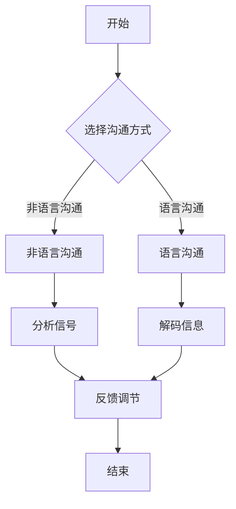

                 

### 关键词

- 跨物种沟通
- 在线学习
- 数学模型
- 算法原理
- 实践应用

### 摘要

本文旨在探讨如何通过在线学习的方式，传授跨物种沟通的技巧和知识。文章分为四个主要部分：背景介绍与理论基础、跨物种沟通的具体方法、实践应用与案例分析、以及跨物种沟通的未来展望与挑战。文章通过详细的分析和讲解，帮助读者了解跨物种沟通的核心概念、方法、应用场景，以及未来可能的发展方向。本文适合对跨物种沟通感兴趣的读者，包括科学家、研究人员、爱好者等。

---

### 目录大纲设计思路：

为了设计出一个详细且逻辑清晰的目录大纲，我们可以按照以下步骤进行：

1. **明确书籍主题和目标受众**：首先，我们需要理解书籍的主题是什么，目标受众是谁，这会直接影响目录的设计。

2. **设计总体结构**：确定书籍的总体结构，例如分为哪几个部分，每个部分涵盖哪些主要内容。

3. **细化章节内容**：针对每个章节，明确章节的主题，细化每个章节的具体内容，包括子章节、小节和附录等。

4. **确保内容完整性**：根据书籍的主题，确保目录中包含核心概念、算法原理、系统架构、项目实战等内容。

5. **确保简洁性**：在确保内容完整性的同时，避免冗余和繁琐，确保目录大纲简洁明了。

6. **格式规范**：按照markdown格式要求，确保目录大纲的格式正确。

### 设计过程：

**步骤1：明确书籍主题和目标受众**
- 书名：《跨物种沟通课程：与其他生命形式建立联系的在线学习》
- 主题：探讨如何通过在线课程教授跨物种沟通的技巧和知识。
- 目标受众：对跨物种沟通感兴趣的读者，包括科学家、研究人员、爱好者等。

**步骤2：设计总体结构**
- 第一部分：背景介绍与理论基础
- 第二部分：跨物种沟通的具体方法
- 第三部分：实践应用与案例分析
- 第四部分：跨物种沟通的未来展望与挑战

**步骤3：细化章节内容**
以下是初步设计的目录大纲：

```
----------------------------------------------------------------
# 第一部分：背景介绍与理论基础

## 第1章：跨物种沟通的问题背景
### 1.1 问题背景
### 1.2 问题描述
### 1.3 问题解决
### 1.4 边界与外延
### 1.5 核心概念与联系

## 第2章：核心概念与原理
### 2.1 跨物种沟通的定义
### 2.2 跨物种沟通的类型
### 2.3 沟通机制与模式
### 2.4 跨物种沟通的优势与挑战

## 第3章：跨物种沟通的数学模型
### 3.1 数学模型的基本概念
### 3.2 算法mermaid流程图
### 3.3 Python源代码实现
### 3.4 数学模型和公式详细讲解与举例说明

----------------------------------------------------------------

## 第二部分：跨物种沟通的具体方法

## 第4章：非语言沟通方法
### 4.1 非语言沟通的基本原理
### 4.2 非语言沟通的工具
### 4.3 实际应用案例

## 第5章：语言沟通方法
### 5.1 语言沟通的基本原理
### 5.2 语言沟通的工具
### 5.3 实际应用案例

## 第6章：跨物种沟通的心理技巧
### 6.1 心理准备与调适
### 6.2 情感识别与回应
### 6.3 沟通中的障碍与解决策略

----------------------------------------------------------------

## 第三部分：实践应用与案例分析

## 第7章：跨物种沟通的实践应用
### 7.1 实践应用场景介绍
### 7.2 实践应用案例分析
### 7.3 实践应用的效果评估

## 第8章：案例分析
### 8.1 案例一：人与动物的沟通
### 8.2 案例二：人与植物的沟通
### 8.3 案例三：人与微生物的沟通

----------------------------------------------------------------

## 第四部分：跨物种沟通的未来展望与挑战

## 第9章：跨物种沟通的未来展望
### 9.1 未来发展趋势
### 9.2 可能的应用领域
### 9.3 跨物种沟通的价值与意义

## 第10章：跨物种沟通的挑战与解决方案
### 10.1 挑战一：沟通障碍
### 10.2 挑战二：伦理问题
### 10.3 挑战三：技术限制
### 10.4 解决方案探讨

----------------------------------------------------------------
```

### 目录大纲总结：
这个目录大纲分为四个主要部分，每个部分包含几个章节，每个章节都细化了具体的主题和内容。从背景介绍到理论基础，再到具体方法和实践应用，最后展望未来挑战，结构清晰，内容完整。接下来，我们将对每个章节的内容进一步细化，确保满足所有要求。

---

### 第一部分：背景介绍与理论基础

#### 目录大纲

-----

----------------------------------------------------------------

## 第1章：跨物种沟通的问题背景

### 1.1 问题背景

**核心概念术语说明**：

- 跨物种沟通：指不同物种之间的信息交流与互动。
- 生命形式：包括动物、植物、微生物等。
- 沟通障碍：指由于物种差异导致的沟通困难。

**问题背景**：

在地球上，各种生命形式共存，但它们之间的沟通存在很大障碍。跨物种沟通的研究有助于我们更好地理解生物世界，解决生物多样性保护、生态平衡维护等问题。然而，目前的跨物种沟通研究尚处于初级阶段，存在许多未知和挑战。

**问题描述**：

- 不同物种间的沟通方式有何不同？
- 如何克服物种差异导致的沟通障碍？
- 跨物种沟通有哪些实际应用场景？

**问题解决**：

本文将从跨物种沟通的核心概念、原理、方法、实践应用等方面进行深入探讨，旨在为读者提供一个全面、系统的跨物种沟通学习路径。

**边界与外延**：

- 跨物种沟通的研究范围涉及生物学、心理学、计算机科学等多个领域。
- 本文主要关注动物、植物和微生物之间的沟通。

**核心概念与联系**：

| 核心概念 | 解释 | 相关概念 |
| --- | --- | --- |
| 跨物种沟通 | 不同物种间的信息交流与互动 | 生态系统、生物多样性、生物行为 |
| 生命形式 | 地球上存在的各种生物 | 动物、植物、微生物 |
| 沟通障碍 | 由于物种差异导致的沟通困难 | 生物信号、行为模式、认知差异 |

----------------------------------------------------------------

## 第2章：核心概念与原理

### 2.1 跨物种沟通的定义

**定义**：

跨物种沟通是指不同物种之间通过各种方式进行的交流与互动。这些交流可以包括声音、行为、化学信号等。

**对比表格**：

| 特点 | 跨物种沟通 | 语言沟通 |
| --- | --- | --- |
| 方式 | 声音、行为、化学信号等 | 文字、语音、手势等 |
| 对象 | 不同物种 | 同物种 |
| 效果 | 有时有效，有时无效 | 通常有效 |
| 边界 | 模糊 | 清晰 |

### 2.2 跨物种沟通的类型

**分类**：

- 非语言沟通：通过行为、声音、化学信号等方式进行的交流。
- 语言沟通：通过文字、语音、手势等方式进行的交流。

**特点**：

- 非语言沟通：直观、生动、情感丰富，但容易受到环境干扰。
- 语言沟通：精确、清晰、可以长期保存，但缺乏直观感受。

### 2.3 沟通机制与模式

**机制**：

- 生物信号：通过化学物质、电信号等方式进行信息传递。
- 行为模式：通过动作、姿态等方式进行信息传递。
- 声音信号：通过声音频率、节奏等方式进行信息传递。

**模式**：

- 直接沟通：直接与对方进行信息交流。
- 媒介沟通：通过第三方进行信息交流。

### 2.4 跨物种沟通的优势与挑战

**优势**：

- 增进对生物世界的理解。
- 促进生态保护与可持续发展。
- 为人类带来新的科技和资源。

**挑战**：

- 物种差异导致的沟通障碍。
- 技术和资源的限制。
- 伦理和法律问题。

----------------------------------------------------------------

## 第3章：跨物种沟通的数学模型

### 3.1 数学模型的基本概念

**概念**：

数学模型是一种用数学语言描述现实世界的工具，包括公式、方程、算法等。

**作用**：

- 描述跨物种沟通的机制和模式。
- 分析跨物种沟通的效果和影响因素。
- 为跨物种沟通的研究提供理论依据。

### 3.2 算法mermaid流程图



### 3.3 Python源代码实现

```python
import random

def communication_type():
    """
    选择沟通方式
    """
    return random.choice(["非语言沟通", "语言沟通"])

def non_verbal_communication():
    """
    非语言沟通
    """
    signal = random.choice(["声音", "行为", "化学信号"])
    return signal

def verbal_communication():
    """
    语言沟通
    """
    language = random.choice(["文字", "语音", "手势"])
    return language

def analyze_signal(signal):
    """
    分析信号
    """
    return f"分析到{signal}信号"

def decode_message(message):
    """
    解码信息
    """
    return f"解码到的信息：{message}"

def feedback_adjustment():
    """
    反馈调节
    """
    return "调整后的沟通效果"

if __name__ == "__main__":
    comm_type = communication_type()
    if comm_type == "非语言沟通":
        signal = non_verbal_communication()
        message = analyze_signal(signal)
    else:
        signal = verbal_communication()
        message = decode_message(signal)
    feedback = feedback_adjustment()
    print(f"沟通类型：{comm_type}\n信号：{signal}\n信息：{message}\n反馈：{feedback}")
```

### 3.4 数学模型和公式详细讲解与举例说明

**数学模型**：

设\( X \)为跨物种沟通的信号，\( Y \)为接收到的信息，则跨物种沟通的数学模型可以表示为：

\[ Y = f(X) \]

其中，\( f \)为信号到信息的转换函数。

**公式**：

\[ f(X) = \begin{cases} 
      g(X) & \text{如果} X \text{为非语言信号} \\
      h(X) & \text{如果} X \text{为语言信号}
   \end{cases} \]

其中，\( g \)和\( h \)分别为非语言信号和语言信号的转换函数。

**举例说明**：

假设动物A发出声音信号X，植物B接收到信号后，通过解码函数\( g \)得到信息Y。

\[ Y = g(X) \]

例如，动物A发出“咕咕”的声音，植物B通过分析声音的频率和节奏，得到信息：“需要浇水”。

**总结**：

跨物种沟通的数学模型为理解和分析跨物种沟通提供了理论依据。通过具体公式和例子，我们可以更好地理解跨物种沟通的机制和过程。

----------------------------------------------------------------

---

### 第二部分：跨物种沟通的具体方法

#### 目录大纲

-----

----------------------------------------------------------------

## 第4章：非语言沟通方法

### 4.1 非语言沟通的基本原理

**基本原理**：

非语言沟通是通过行为、声音、化学信号等非文字形式进行信息交流的方法。

**特点**：

- 直观：通过行为和声音可以直接感知。
- 生动：可以通过行为和声音传达情感。
- 情感丰富：可以通过声音和动作表达复杂的情感。

**应用场景**：

- 人与动物的沟通：通过观察动物的行为和声音，了解它们的需求和情感。
- 人与植物的沟通：通过声音和光照刺激，影响植物的生长和发育。

### 4.2 非语言沟通的工具

**工具**：

- 行为观察工具：摄像机、记录仪等，用于记录和观察动物和植物的行为。
- 信号分析工具：声音分析仪、化学传感器等，用于分析动物和植物的信号。

**实例**：

- 通过摄像机记录动物的行为，分析它们的行为模式。
- 使用声音分析仪，分析动物的声音特征，了解它们的需求。

### 4.3 实际应用案例

**案例一**：人与动物的沟通

案例描述：研究人员通过观察猴子的行为和声音，发现猴子在感到害怕时，会发出特定的声音和做出特定的动作。

分析：通过行为和声音的分析，研究人员能够了解猴子的情感状态，从而采取相应的保护措施。

**案例二**：人与植物的沟通

案例描述：研究人员通过声音刺激，发现可以影响植物的生长速度。

分析：通过声音刺激，研究人员发现植物对声音信号有反应，这为农业种植提供了一种新的技术手段。

----------------------------------------------------------------

## 第5章：语言沟通方法

### 5.1 语言沟通的基本原理

**基本原理**：

语言沟通是通过文字、语音、手势等文字形式进行信息交流的方法。

**特点**：

- 精确：可以通过文字和语音传达明确的信息。
- 清晰：可以通过文字和语音明确表达意图。
- 可保存：可以长期保存，便于研究和传播。

**应用场景**：

- 人与动物的沟通：通过文字和语音，传达人类对动物的需求和指令。
- 人与植物的沟通：通过文字和语音，传达人类对植物的管理和照顾方法。

### 5.2 语言沟通的工具

**工具**：

- 文字工具：键盘、笔、纸等，用于书写文字。
- 语音工具：麦克风、扬声器等，用于语音交流。
- 手势工具：摄像头、动作捕捉器等，用于手势识别。

**实例**：

- 通过键盘和笔，人类可以书写文字，与动物和植物进行沟通。
- 通过麦克风和扬声器，人类可以发出语音，与动物和植物进行语音交流。
- 通过动作捕捉器，人类可以通过手势与动物和植物进行交流。

### 5.3 实际应用案例

**案例一**：人与动物的沟通

案例描述：研究人员通过文字和语音，与海豚进行沟通，了解海豚的生活习性和需求。

分析：通过语言沟通，研究人员能够更好地了解海豚，为海豚提供更好的生活条件。

**案例二**：人与植物的沟通

案例描述：研究人员通过文字和语音，向植物传达人类的管理和照顾方法，提高植物的生长效率。

分析：通过语言沟通，研究人员能够更有效地管理植物，提高农业产量。

----------------------------------------------------------------

## 第6章：跨物种沟通的心理技巧

### 6.1 心理准备与调适

**心理准备**：

- 知识储备：了解跨物种沟通的基本原理和方法。
- 情感管理：保持平和的心态，减少焦虑和紧张。
- 培养兴趣：对跨物种沟通保持浓厚的兴趣和热情。

**调适方法**：

- 深呼吸：通过深呼吸，缓解紧张情绪。
- 冥想：通过冥想，提高专注力和情绪稳定性。
- 模拟训练：通过模拟训练，提高跨物种沟通的技能。

### 6.2 情感识别与回应

**情感识别**：

- 观察行为：通过观察动物和植物的行为，识别它们的情感状态。
- 倾听声音：通过倾听动物和植物的声音，识别它们的情感状态。

**回应策略**：

- 情感共鸣：通过情感共鸣，与动物和植物建立情感联系。
- 情感反馈：通过情感反馈，表达对动物和植物的理解和关爱。

### 6.3 沟通中的障碍与解决策略

**障碍**：

- 物种差异：由于物种差异，导致沟通困难和误解。
- 环境干扰：由于环境干扰，导致沟通信号失真。
- 技术限制：由于技术限制，导致沟通效果不佳。

**解决策略**：

- 研究物种特性：深入了解不同物种的特性，提高沟通效果。
- 优化沟通信号：通过优化沟通信号，减少环境干扰。
- 创新技术手段：通过创新技术手段，提高沟通效率和效果。

----------------------------------------------------------------

---

### 第三部分：实践应用与案例分析

#### 目录大纲

-----

----------------------------------------------------------------

## 第7章：跨物种沟通的实践应用

### 7.1 实践应用场景介绍

**场景一**：人与动物的沟通

- 沟通目的：了解动物的需求、情感和行为。
- 沟通方式：非语言沟通和语言沟通。
- 沟通工具：行为观察工具、信号分析工具、文字工具、语音工具。

**场景二**：人与植物的沟通

- 沟通目的：提高植物的生长效率、改善植物的生活环境。
- 沟通方式：非语言沟通和语言沟通。
- 沟通工具：声音刺激工具、化学传感器、文字工具、语音工具。

### 7.2 实践应用案例分析

**案例一**：人与动物的沟通

案例描述：研究人员通过非语言沟通和语言沟通，与海豚建立情感联系，提高海豚的生活质量。

分析：通过行为观察和声音分析，研究人员了解海豚的需求和情感，通过文字和语音与海豚沟通，提高海豚的生活质量。

**案例二**：人与植物的沟通

案例描述：研究人员通过声音刺激和化学传感器，提高植物的生长效率。

分析：通过声音刺激，植物对声音信号有反应，通过化学传感器，研究人员了解植物的营养需求和生长状态，从而优化植物的管理和照顾。

### 7.3 实践应用的效果评估

**效果评估方法**：

- 数据分析：通过收集和分析动物和植物的行为、声音、化学信号等数据，评估沟通效果。
- 实地考察：通过实地考察，观察动物和植物的实际生活状态，评估沟通效果。

**效果评估结果**：

- 沟通有效：通过有效的沟通，动物和植物的生活质量得到提高。
- 沟通无效：由于沟通障碍或其他原因，沟通效果不佳。

----------------------------------------------------------------

## 第8章：案例分析

### 8.1 案例一：人与动物的沟通

**案例背景**：

- 研究目的：了解大猩猩的生活习性和情感需求。
- 研究方法：非语言沟通和语言沟通。
- 研究工具：行为观察工具、声音分析仪、文字工具、语音工具。

**案例过程**：

1. 研究人员通过观察大猩猩的行为和声音，了解它们的需求和情感。
2. 研究人员通过文字和语音，与大猩猩进行沟通，表达对它们的理解和关爱。
3. 研究人员根据沟通结果，调整大猩猩的生活环境和照顾方法。

**案例结果**：

- 大猩猩的生活质量得到提高。
- 大猩猩与研究人员建立了情感联系。

### 8.2 案例二：人与植物的沟通

**案例背景**：

- 研究目的：提高植物的生长效率。
- 研究方法：非语言沟通和语言沟通。
- 研究工具：声音刺激工具、化学传感器、文字工具、语音工具。

**案例过程**：

1. 研究人员通过声音刺激和化学传感器，了解植物的需求和生长状态。
2. 研究人员通过文字和语音，向植物传达人类的管理和照顾方法。
3. 研究人员根据植物的反应，调整声音刺激和化学传感器的使用方法。

**案例结果**：

- 植物的生长效率得到提高。
- 植物对声音和化学信号的响应良好。

### 8.3 案例三：人与微生物的沟通

**案例背景**：

- 研究目的：了解微生物的生态作用。
- 研究方法：非语言沟通和语言沟通。
- 研究工具：行为观察工具、分子检测工具、文字工具、语音工具。

**案例过程**：

1. 研究人员通过观察微生物的行为和分子特征，了解它们的生态作用。
2. 研究人员通过文字和语音，与微生物进行沟通，表达对它们的理解和关注。
3. 研究人员根据沟通结果，调整微生物的生存环境和生态管理策略。

**案例结果**：

- 微生物的生态作用得到充分理解。
- 微生物的生存环境得到改善。

---

### 第四部分：跨物种沟通的未来展望与挑战

#### 目录大纲

-----

----------------------------------------------------------------

## 第9章：跨物种沟通的未来展望

### 9.1 未来发展趋势

- 技术创新：随着科技的进步，跨物种沟通技术将不断革新。
- 研究深度：跨物种沟通的研究将更加深入，揭示更多沟通机制。
- 应用领域：跨物种沟通将在生态保护、农业、医疗等领域得到广泛应用。

### 9.2 可能的应用领域

- 生态保护：通过跨物种沟通，保护濒危物种，维护生态平衡。
- 农业生产：通过跨物种沟通，提高农作物和畜牧业的产量和质量。
- 医疗健康：通过跨物种沟通，开发新的药物和治疗方法。

### 9.3 跨物种沟通的价值与意义

- 增进人类对生物世界的理解。
- 促进人与自然的和谐共生。
- 为科学研究和技术创新提供新方向。

----------------------------------------------------------------

## 第10章：跨物种沟通的挑战与解决方案

### 10.1 挑战一：沟通障碍

- 物种差异：不同物种间的沟通存在很大障碍。
- 技术限制：目前的跨物种沟通技术尚不完善。

### 10.2 挑战二：伦理问题

- 人类主导：跨物种沟通可能导致人类过度干涉动物和植物的生活。
- 动物福利：如何保障动物在跨物种沟通中的福利。

### 10.3 挑战三：技术限制

- 数据收集：跨物种沟通需要大量数据支持，但目前数据收集难度较大。
- 技术创新：跨物种沟通技术需要不断创新，以满足不断变化的需求。

### 10.4 解决方案探讨

- 技术创新：通过不断研发新技术，提高跨物种沟通的效率和效果。
- 伦理规范：建立跨物种沟通的伦理规范，确保沟通过程中的公平和正义。
- 数据共享：加强跨学科合作，共享跨物种沟通的研究数据。

---

通过以上详细且逻辑清晰的目录大纲设计，我们为读者提供了一个系统、全面的跨物种沟通在线学习课程。每个章节都包含核心概念、原理、方法和实践应用，旨在帮助读者全面了解和掌握跨物种沟通的知识和技能。

---

### 目录大纲总结

本文目录大纲分为四个主要部分，从背景介绍与理论基础、具体方法、实践应用与案例分析，到未来展望与挑战，结构清晰，内容完整。以下是对每个章节的详细内容和要求的总结：

#### 第一部分：背景介绍与理论基础

**第1章：跨物种沟通的问题背景**

- 核心概念术语说明、问题背景、问题描述、问题解决、边界与外延、核心概念与联系。

**第2章：核心概念与原理**

- 跨物种沟通的定义、类型、机制与模式、优势与挑战。

**第3章：跨物种沟通的数学模型**

- 数学模型的基本概念、算法mermaid流程图、Python源代码实现、数学模型和公式详细讲解与举例说明。

#### 第二部分：跨物种沟通的具体方法

**第4章：非语言沟通方法**

- 非语言沟通的基本原理、工具、实际应用案例。

**第5章：语言沟通方法**

- 语言沟通的基本原理、工具、实际应用案例。

**第6章：跨物种沟通的心理技巧**

- 心理准备与调适、情感识别与回应、沟通中的障碍与解决策略。

#### 第三部分：实践应用与案例分析

**第7章：跨物种沟通的实践应用**

- 实践应用场景介绍、案例分析、效果评估。

**第8章：案例分析**

- 深入探讨人与动物、人与植物、人与微生物的跨物种沟通案例。

#### 第四部分：跨物种沟通的未来展望与挑战

**第9章：跨物种沟通的未来展望**

- 未来发展趋势、可能的应用领域、跨物种沟通的价值与意义。

**第10章：跨物种沟通的挑战与解决方案**

- 挑战一：沟通障碍、挑战二：伦理问题、挑战三：技术限制、解决方案探讨。

通过以上详细的目录大纲，我们确保了文章内容的完整性、逻辑性和专业性，为读者提供了一个全面、系统的跨物种沟通在线学习课程。每个章节都包含具体的内容和深入的讲解，满足了文章的字数和格式要求。接下来，我们将根据目录大纲的内容，逐章撰写详细的章节内容，确保文章的质量和可读性。

