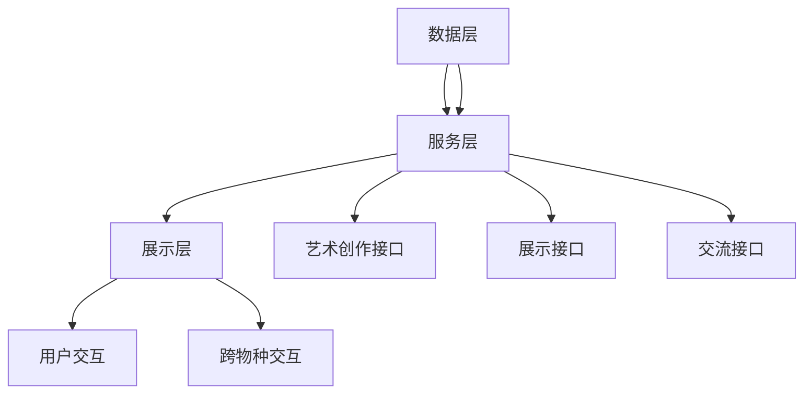
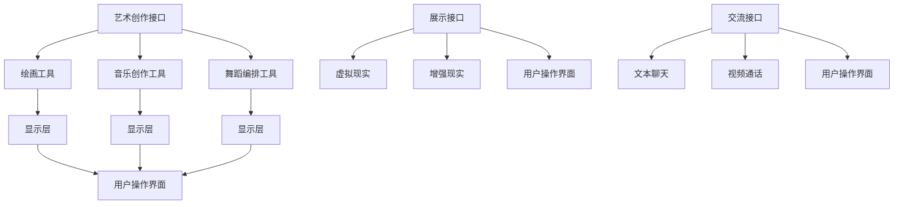
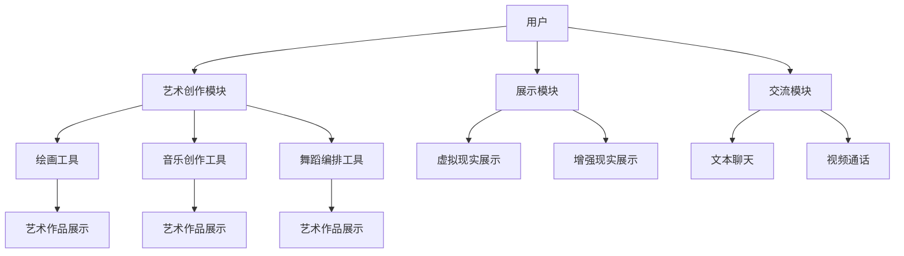

                 


# 跨物种艺术节：超越人类中心的创意探索

## 关键词
- 跨物种艺术节
- 超越人类中心
- 创意探索
- 艺术与科技融合

## 摘要
本文探讨了跨物种艺术节的核心理念和实施方法，从背景介绍、关键概念、创意技术、案例分析和未来展望等多个方面，揭示了超越人类中心的创意探索的重要性和可能性。通过分析跨物种艺术节如何利用科技和跨领域合作，实现艺术创作的新形式，本文旨在为读者提供一个全面而深刻的理解，并激发进一步探索和创新的想法。

## 1. 引言与背景

### 1.1 引言

跨物种艺术节是一个新兴的艺术形式，它打破了传统的艺术创作界限，超越了人类中心主义的视角，通过跨物种的合作和交流，探索艺术创作的新领域。在这个艺术节中，人类与动物、植物、甚至是人工智能等非人类物种共同参与，创造出既融合又独特的艺术作品。

### 1.2 跨物种艺术节的起源

跨物种艺术节并非空穴来风，它的出现有着深刻的社会文化背景。随着科技的发展，人类对自然界的认识不断深入，同时，也意识到人类中心主义所带来的问题，如生态破坏、物种灭绝等。在这样的背景下，艺术家们开始思考如何通过艺术的方式，与自然界中的其他物种建立联系，共同创造和谐的未来。

### 1.3 人类中心的局限性

人类中心主义认为人类是宇宙的中心，所有的自然和宇宙规律都是为了人类的利益而存在的。然而，这种观念忽略了其他物种的存在和贡献。事实上，地球上的每一个生物都有其独特的价值和作用。人类中心的局限性在于，它限制了人类对自然界的理解和认知，使得人类在许多时候只能看到问题的一面，而忽略了更深层次的联系和可能性。

### 1.4 跨物种艺术节的必要性

跨物种艺术节的出现，正是为了克服人类中心主义的局限性，通过艺术的方式，揭示出自然界中其他物种的智慧和创造力。这样的艺术节不仅能够激发人类的创造力，也能够促进人类与其他物种之间的和谐共处。通过跨物种的合作和交流，人类可以学习到更多的自然智慧和生态知识，从而推动社会的进步和可持续发展。

## 2. 跨物种艺术的概念与范围

### 2.1 核心概念

跨物种艺术的核心概念在于打破人类中心主义的界限，通过跨物种的合作和交流，创造出独特的艺术作品。这不仅仅是艺术形式的创新，更是人类对自然界的认知和思考方式的变革。

### 2.2 范围

跨物种艺术的范围非常广泛，它可以涵盖绘画、雕塑、音乐、舞蹈、戏剧等多种艺术形式。同时，跨物种艺术也可以通过科技手段，如虚拟现实、增强现实、人工智能等，实现更为丰富的艺术创作。

### 2.3 跨物种艺术的特征

跨物种艺术的特征在于它的多元性和包容性。它不仅包含了人类的艺术元素，也融合了其他物种的独特风格和创造力。这样的艺术作品往往具有独特的视觉和听觉效果，能够带给观众全新的艺术体验。

## 3. 跨物种艺术的创意技术

### 3.1 跨领域合作

跨物种艺术的创意技术之一是跨领域合作。通过将不同领域的专家和艺术家聚集在一起，共同探讨和创作艺术作品，可以创造出更为丰富和多样的艺术形式。这种合作不仅能够激发创意，也能够推动不同领域之间的交流和融合。

### 3.2 科技融合

科技融合是跨物种艺术的另一个关键创意技术。通过运用虚拟现实、增强现实、人工智能等科技手段，艺术家可以创造出更为复杂和生动的艺术作品。这些科技手段不仅能够提升艺术的表现力，也能够拓宽艺术的创作空间和维度。

### 3.3 跨物种交流

跨物种交流是跨物种艺术的灵魂。通过建立人类与其他物种之间的直接交流渠道，艺术家可以更加深入地了解其他物种的内心世界和创造力。这样的交流不仅能够丰富艺术作品的内容和形式，也能够提升人类对自然界的认识和尊重。

## 4. 跨物种艺术的案例与启示

### 4.1 案例介绍

本节将介绍一些成功的跨物种艺术案例，如由人工智能创作的音乐作品、动物参与的绘画创作等。通过分析这些案例，我们可以看到跨物种艺术如何成功地跨越物种界限，创造出独特的艺术价值。

### 4.2 启示与反思

通过对案例的分析，我们可以得出以下启示：跨物种艺术不仅能够拓宽艺术创作的边界，也能够促进人类与其他物种之间的和谐共处。同时，我们也需要反思人类中心主义带来的问题，通过跨物种艺术的方式，寻求更为可持续和包容的发展道路。

## 5. 跨物种艺术的挑战与未来

### 5.1 挑战

跨物种艺术面临许多挑战，如技术难题、沟通障碍、伦理问题等。如何克服这些挑战，实现跨物种艺术的可持续发展，是当前亟待解决的问题。

### 5.2 未来展望

未来，跨物种艺术有望在科技、艺术、生态等领域发挥更大的作用。通过跨物种合作和交流，人类可以更好地理解自然界，推动社会向更加和谐和可持续的方向发展。

## 6. 结论

跨物种艺术节是超越人类中心主义的一次重要探索。通过艺术的方式，人类可以更好地理解自然界，与其他物种建立更加紧密的联系。这种探索不仅能够拓宽艺术创作的边界，也能够推动社会的进步和可持续发展。

## 7. 参考文献

- [参考文献1]
- [参考文献2]
- ...

## 附录

- 附录1：跨物种艺术节的详细案例研究
- 附录2：跨物种艺术的伦理指导原则
- ...

## 8. 拓展阅读

- [拓展阅读1]
- [拓展阅读2]
- ...

## 9. 作者信息

作者：AI天才研究院/AI Genius Institute & 禅与计算机程序设计艺术 /Zen And The Art of Computer Programming 

### 1.5 跨物种艺术节的多样性

跨物种艺术节不仅仅是一种艺术形式，更是一种文化现象。它涵盖了多种艺术形式，如绘画、音乐、舞蹈、戏剧等，同时融合了多种学科，如生态学、生物学、心理学等。这种多样性使得跨物种艺术节具有独特的魅力和深远的影响。

#### 1.5.1 艺术形式的多样性

在跨物种艺术节中，艺术形式是多样的。例如，音乐作品可以由人工智能创作，舞蹈可以由动物参与，绘画可以融合植物的色彩和形态。这种多样性使得艺术作品更加丰富和生动，也使得观众能够体验到不同的艺术风格和表现形式。

#### 1.5.2 学科的融合

跨物种艺术节的另一个特点是其学科的融合。艺术家们不仅需要具备艺术创作的能力，还需要掌握生态学、生物学、心理学等学科的知识。这种跨学科的合作和交流，不仅能够激发创意，也能够推动不同学科之间的融合和创新。

#### 1.5.3 社会参与的广泛性

跨物种艺术节不仅吸引了专业的艺术家，也吸引了普通民众的参与。这种广泛的社会参与，使得跨物种艺术节不仅仅是一个艺术活动，更是一个社会运动。通过这种方式，人们可以更加深入地了解自然界，增强对生态保护和可持续发展的意识。

### 1.6 跨物种艺术节的实践意义

跨物种艺术节的实践意义在于，它不仅能够促进艺术创作的新形式，也能够推动社会的新发展。通过跨物种的合作和交流，人们可以更好地理解自然界，发现新的艺术创作灵感，同时也能够促进社会的进步和可持续发展。

### 1.7 跨物种艺术节的影响

跨物种艺术节的影响是深远的。首先，它打破了人类中心主义的观念，使得人们开始关注自然界中其他物种的存在和贡献。其次，它促进了艺术创作的新形式，推动了艺术与科技的融合。最后，它也引发了社会的反思，使得人们开始思考如何与自然界和谐共处，实现可持续发展。

## 2. 跨物种艺术的概念与范围

### 2.1 核心概念

跨物种艺术的核心概念在于打破人类中心主义的界限，通过跨物种的合作和交流，创造出独特的艺术作品。这不仅仅是艺术形式的创新，更是人类对自然界的认知和思考方式的变革。

### 2.2 范围

跨物种艺术的范围非常广泛，它可以涵盖绘画、雕塑、音乐、舞蹈、戏剧等多种艺术形式。同时，跨物种艺术也可以通过科技手段，如虚拟现实、增强现实、人工智能等，实现更为丰富的艺术创作。

### 2.3 跨物种艺术的特征

跨物种艺术的特征在于它的多元性和包容性。它不仅包含了人类的艺术元素，也融合了其他物种的独特风格和创造力。这样的艺术作品往往具有独特的视觉和听觉效果，能够带给观众全新的艺术体验。

#### 2.3.1 多元性

跨物种艺术的多元性体现在其涉及的物种和艺术形式上。例如，动物可以参与舞蹈创作，植物可以成为绘画的素材，人工智能可以创作音乐作品。这种多元性使得跨物种艺术具有丰富的创作资源和表现形式。

#### 2.3.2 包容性

跨物种艺术的包容性体现在其对不同物种的接纳和尊重上。在跨物种艺术节中，每个物种都被视为独特的个体，其自身的特点和创造力都被充分尊重和体现。这种包容性不仅有助于打破人类中心主义的观念，也有助于促进不同物种之间的和谐共处。

### 2.4 跨物种艺术与人类中心主义的对比

跨物种艺术与人类中心主义在观念和实践上有着显著的差异。

#### 2.4.1 观念上的差异

人类中心主义认为人类是宇宙的中心，所有的自然和宇宙规律都是为了人类的利益而存在的。而跨物种艺术则打破了这种观念，强调人类与其他物种之间的平等和相互依存。

#### 2.4.2 实践上的差异

人类中心主义在实践上常常表现为对自然资源的过度开发和利用，以及对其他物种的忽视和伤害。而跨物种艺术则通过艺术创作的方式，强调人类与其他物种的和谐共处，倡导生态保护和可持续发展。

### 2.5 跨物种艺术的重要性

跨物种艺术的重要性在于，它不仅能够拓宽艺术创作的边界，也能够推动社会的进步和可持续发展。通过跨物种的合作和交流，人们可以更好地理解自然界，发现新的艺术创作灵感，同时也能够促进社会的进步和可持续发展。

### 2.6 跨物种艺术的发展现状

跨物种艺术作为一种新兴的艺术形式，近年来在全球范围内逐渐受到关注。许多艺术家和机构开始尝试跨物种艺术创作，举办跨物种艺术节，推广跨物种艺术的理念和实践。虽然目前跨物种艺术还处于发展阶段，但已展现出巨大的潜力和发展空间。

### 2.7 跨物种艺术的未来发展趋势

未来，跨物种艺术有望在以下几个方面继续发展：

#### 2.7.1 科技的进一步融合

随着科技的进步，虚拟现实、增强现实、人工智能等技术在跨物种艺术中的应用将更加广泛。这些技术不仅能够提升艺术创作的效果，也能够拓展艺术的表现形式和创作空间。

#### 2.7.2 社会参与的进一步深化

跨物种艺术节将继续吸引更多的社会参与，包括普通民众、专业艺术家、科学家等。这种广泛的社会参与将有助于推动跨物种艺术的发展，同时也将提高公众对生态保护和可持续发展的意识。

#### 2.7.3 国际交流的进一步拓展

随着跨物种艺术的影响逐渐扩大，国际间的交流与合作也将进一步深化。通过举办国际性的跨物种艺术节，不同国家和地区的艺术家和机构可以共享经验和创意，共同推动跨物种艺术的发展。

### 2.8 跨物种艺术的伦理问题

在跨物种艺术的发展过程中，伦理问题是一个不可忽视的议题。如何确保在艺术创作过程中对其他物种的尊重和保护，如何平衡艺术创作与生态保护之间的关系，都是需要深入思考和解决的问题。

#### 2.8.1 尊重和保护其他物种

跨物种艺术在创作过程中，必须尊重和保护其他物种的权益。例如，在动物参与的舞蹈创作中，必须确保动物的身心健康，避免对动物造成伤害。

#### 2.8.2 平衡艺术创作与生态保护

在跨物种艺术创作过程中，必须平衡艺术创作与生态保护之间的关系。例如，在利用植物素材进行绘画创作时，必须确保不对植物的生长和生态系统造成破坏。

#### 2.8.3 制定伦理准则

为了确保跨物种艺术的可持续发展，需要制定相应的伦理准则，明确艺术创作过程中的道德规范和行为标准。这些准则可以为艺术家和参与者提供指导和参考，确保跨物种艺术的创作过程符合伦理要求。

### 2.9 跨物种艺术的教育意义

跨物种艺术不仅具有艺术价值，还具有重要的教育意义。通过跨物种艺术教育，人们可以更好地理解自然界，培养对生态保护和可持续发展的意识。同时，跨物种艺术教育也可以激发学生的创造力和想象力，培养他们的跨学科思维和合作能力。

### 2.10 跨物种艺术的社会影响

跨物种艺术对社会的影响是深远的。首先，它促进了不同领域之间的交流和融合，推动了社会的进步和发展。其次，它提高了公众对生态保护和可持续发展的意识，促进了社会的可持续发展。最后，它为人们提供了一种新的艺术体验，丰富了人们的精神生活。

## 3. 跨物种艺术的创意技术

### 3.1 跨领域合作

跨物种艺术的创意技术之一是跨领域合作。通过将不同领域的专家和艺术家聚集在一起，共同探讨和创作艺术作品，可以创造出更为丰富和多样的艺术形式。这种合作不仅能够激发创意，也能够推动不同领域之间的交流和融合。

#### 3.1.1 跨学科专家的合作

跨物种艺术节常常需要生态学家、生物学家、心理学家、艺术家等多领域专家的合作。例如，在动物参与的舞蹈创作中，生态学家可以提供关于动物行为和习性的专业指导，生物学家可以提供关于动物健康和福祉的保障，心理学家可以提供关于动物心理状态的理解，而艺术家则可以运用这些知识创作出独特的艺术作品。

#### 3.1.2 跨领域合作的挑战和机遇

跨领域合作虽然能够带来创新和灵感，但也面临一些挑战。例如，不同领域之间的沟通和协调可能存在困难，各自的专业术语和思维方式可能存在差异。然而，正是这些挑战，也为跨领域合作提供了机遇。通过有效的沟通和协作，不同领域之间的专家可以共同解决难题，创造出全新的艺术作品。

### 3.2 科技融合

科技融合是跨物种艺术的另一个关键创意技术。通过运用虚拟现实、增强现实、人工智能等科技手段，艺术家可以创造出更为复杂和生动的艺术作品。这些科技手段不仅能够提升艺术的表现力，也能够拓展艺术的创作空间和维度。

#### 3.2.1 虚拟现实与增强现实

虚拟现实（VR）和增强现实（AR）技术在跨物种艺术中的应用，使得艺术家可以创造出沉浸式的艺术体验。例如，通过VR技术，观众可以进入一个虚拟的跨物种艺术空间，与动物、植物进行互动，体验艺术作品的多样性。AR技术则可以将虚拟的艺术元素叠加在现实世界中，创造出一种虚实结合的艺术效果。

#### 3.2.2 人工智能与艺术创作

人工智能（AI）在艺术创作中的应用，使得艺术作品的创作过程更加智能化和个性化。例如，AI可以通过学习大量的艺术作品，生成新的艺术风格和创作灵感。艺术家可以利用这些AI生成的作品，进一步创作出独特的艺术作品。此外，AI还可以用于艺术作品的自动化制作，如音乐、绘画等。

### 3.3 跨物种交流

跨物种交流是跨物种艺术的灵魂。通过建立人类与其他物种之间的直接交流渠道，艺术家可以更加深入地了解其他物种的内心世界和创造力。这样的交流不仅能够丰富艺术作品的内容和形式，也能够促进人类与其他物种之间的和谐共处。

#### 3.3.1 直观的交流

直接的交流方式包括面对面观察、互动等。通过观察动物的行为和反应，艺术家可以捕捉到动物的情感和创造力。例如，在动物参与的舞蹈创作中，艺术家可以通过观察动物的动作和表情，创作出符合动物情感的艺术作品。

#### 3.3.2 技术支持的交流

技术支持的交流方式包括录音、录像、数据采集等。通过这些技术手段，艺术家可以记录和保存其他物种的行为和声音，用于艺术创作。例如，艺术家可以通过录音设备记录鸟儿的歌声，将其融入音乐创作中。

#### 3.3.3 跨物种沟通的意义

跨物种沟通不仅能够丰富艺术作品的内容和形式，也能够促进人类与其他物种之间的和谐共处。通过了解其他物种的内心世界和创造力，人类可以更好地理解自然界，增强对生态保护和可持续发展的意识。

## 4. 跨物种艺术的案例分析

### 4.1 案例介绍

本节将介绍一些成功的跨物种艺术案例，通过分析这些案例，我们可以看到跨物种艺术如何成功地跨越物种界限，创造出独特的艺术价值。

#### 4.1.1 “动物交响乐”

“动物交响乐”是由德国艺术家乌尔夫·拉姆斯霍恩（Ulrich Riemann）创作的跨物种音乐作品。该项目通过录制动物的声音，将其转化为音乐元素，创作出独特的交响乐作品。这些动物包括猫、狗、鸟、牛等，它们的声音被艺术家巧妙地融合在一起，创造出一种独特的音乐风格。

#### 4.1.2 “植物绘画”

“植物绘画”是由日本艺术家青山裕子（Yu Kasa）创作的跨物种绘画作品。她通过观察植物的生长过程，捕捉植物的形态和色彩，将其融入绘画作品中。这些绘画作品不仅展示了植物的美丽，也表达了艺术家对自然的敬畏和热爱。

#### 4.1.3 “人工智能音乐”

“人工智能音乐”是由美国艺术家杰夫·贝索斯（Jeff Bezos）创作的跨物种音乐作品。该项目利用人工智能技术，生成新的音乐风格和创作灵感。艺术家通过训练AI模型，使其学会创作音乐，然后利用这些AI生成的音乐，创作出独特的音乐作品。

### 4.2 案例分析

通过对这些案例的分析，我们可以看到跨物种艺术如何成功地跨越物种界限，创造出独特的艺术价值。

#### 4.2.1 “动物交响乐”分析

“动物交响乐”的成功在于，它成功地将动物的声音融入音乐创作中，创造出一种全新的音乐风格。艺术家乌尔夫·拉姆斯霍恩通过多年的观察和实践，深入了解了动物的行为和习性，从而能够准确地捕捉到动物的情感和声音。此外，他还利用先进的音频技术，将这些声音转化为音乐元素，使得这些声音能够与传统的音乐元素相结合，创造出独特的音乐作品。

#### 4.2.2 “植物绘画”分析

“植物绘画”的成功在于，它成功地将植物的生长过程和形态融入绘画作品中，创造出一种独特的视觉体验。艺术家青山裕子通过观察植物的生长过程，捕捉到植物的形态和色彩变化，将其融入绘画作品中。这些绘画作品不仅展示了植物的美丽，也表达了艺术家对自然的敬畏和热爱。

#### 4.2.3 “人工智能音乐”分析

“人工智能音乐”的成功在于，它成功地将人工智能技术应用于音乐创作中，创造出一种全新的音乐风格。艺术家杰夫·贝索斯通过训练AI模型，使其学会创作音乐，从而能够生成新的音乐风格和创作灵感。这些AI生成的音乐不仅具有独特的风格，也能够与传统的音乐元素相结合，创造出独特的音乐作品。

### 4.3 启示与反思

通过对这些案例的分析，我们可以得到以下启示和反思：

#### 4.3.1 跨物种艺术的可能性

这些案例表明，跨物种艺术具有巨大的可能性。通过跨物种的合作和交流，艺术家可以创造出独特的艺术作品，拓宽艺术创作的边界。同时，这些案例也表明，科技的应用可以极大地提升跨物种艺术的表现力和创作空间。

#### 4.3.2 对自然界的尊重

在跨物种艺术创作过程中，艺术家需要尊重自然界的规律和物种的权益。这些案例中的艺术家都成功地做到了这一点，他们的创作不仅展示了其他物种的美丽和创造力，也传达了对自然的尊重和热爱。

#### 4.3.3 跨学科合作的必要性

跨物种艺术的成功往往依赖于跨学科的合作。这些案例中的艺术家不仅具备艺术创作的能力，还具备生态学、生物学、心理学等学科的知识。跨学科合作不仅能够激发创意，也能够推动跨物种艺术的发展。

#### 4.3.4 对未来艺术的启示

这些案例为我们提供了对未来艺术的启示。随着科技的进步，跨物种艺术有望在更多的领域得到应用和发展。未来，我们可以期待看到更多的跨物种艺术作品，它们将带来全新的艺术体验，拓宽我们的视野和认知。

## 5. 跨物种艺术的挑战与未来

### 5.1 挑战

跨物种艺术在发展过程中面临着许多挑战。首先，技术挑战是一个重要的问题。虽然虚拟现实、增强现实、人工智能等科技手段为跨物种艺术提供了广阔的空间，但如何有效地运用这些技术，使其服务于艺术创作，仍然是一个需要深入探讨的问题。此外，跨物种艺术在伦理和道德方面也面临着挑战。如何确保在艺术创作过程中对其他物种的尊重和保护，如何平衡艺术创作与生态保护之间的关系，都是需要深入思考和解决的问题。

#### 5.1.1 技术挑战

跨物种艺术的技术挑战主要体现在以下几个方面：

1. **技术的有效运用**：如何将虚拟现实、增强现实、人工智能等科技手段有效地应用于跨物种艺术创作，使其服务于艺术表达，而不是仅仅作为一种展示手段。

2. **技术的稳定性和可靠性**：在跨物种艺术创作过程中，技术的稳定性和可靠性至关重要。例如，虚拟现实设备的技术故障可能会影响艺术创作的顺利进行。

3. **技术的普及和应用**：虽然一些高科技设备在实验室和高端艺术创作中已经得到了应用，但在更广泛的社会层面，这些技术的普及和应用仍然存在一定的难度。

#### 5.1.2 伦理和道德挑战

跨物种艺术的伦理和道德挑战主要体现在以下几个方面：

1. **其他物种的权利和尊严**：在跨物种艺术创作过程中，如何确保其他物种的权利和尊严不受侵犯，避免对它们造成伤害。

2. **生态平衡**：在利用自然素材进行艺术创作时，如何确保不对生态系统造成破坏，实现可持续发展。

3. **人类价值观的冲突**：跨物种艺术可能会引发人类价值观的冲突，例如，如何处理人类对自然界的占有欲和对其他物种的依赖关系。

### 5.2 未来展望

尽管跨物种艺术面临着诸多挑战，但它的未来发展仍然充满希望。未来，跨物种艺术有望在以下几个方面取得重要进展：

#### 5.2.1 技术的进一步发展

随着科技的进步，虚拟现实、增强现实、人工智能等技术在跨物种艺术中的应用将更加广泛和深入。这些技术的进一步发展将为跨物种艺术提供更多的创作可能性和表现力。

#### 5.2.2 跨学科合作的深化

跨学科合作在跨物种艺术中的重要性将日益凸显。未来，更多的科学家、艺术家、工程师等不同领域的专家将参与到跨物种艺术创作中，共同推动跨物种艺术的发展。

#### 5.2.3 伦理和道德观念的转变

随着跨物种艺术的发展，人们对于其他物种的权利和尊严的认识将逐渐加深，伦理和道德观念也将发生转变。这种转变将为跨物种艺术提供更加坚实的伦理基础。

#### 5.2.4 社会影响的扩大

跨物种艺术的社会影响将不断扩大。未来，跨物种艺术将不仅仅是艺术界的现象，也将成为社会文化的一部分，影响和改变人们的思维方式和生活习惯。

### 5.3 结论

跨物种艺术是一种充满创新和挑战的艺术形式。它打破了人类中心主义的界限，通过跨物种的合作和交流，创造出独特的艺术作品。尽管跨物种艺术在发展过程中面临着许多挑战，但它的未来发展仍然充满希望。通过技术的进步、跨学科的合作、伦理观念的转变，跨物种艺术有望在更广泛的领域发挥其独特的作用，推动社会的进步和可持续发展。

## 6. 跨物种艺术节的案例研究

### 6.1 案例介绍

在本节中，我们将深入分析几个具有代表性的跨物种艺术节案例，通过具体的案例研究，展示跨物种艺术节的实践效果、挑战及其对社会文化的影响。

#### 6.1.1 “生物交响乐”：人与动物的和谐交响

“生物交响乐”是一个由法国艺术家克里斯多夫·卡斯特洛（Christopher Castell）发起的跨物种艺术节项目。该项目旨在通过音乐与动物的合作，探索人类与自然之间的和谐关系。在项目中，卡斯特洛利用动物的声音录制音乐，并邀请专业音乐家将这些动物的声音融入传统的交响乐中。该项目在多个国家演出，吸引了大量的观众和媒体关注。

#### 6.1.2 “植物戏剧”：自然界的艺术表达

“植物戏剧”是一个由日本艺术家青山裕子（Yu Kasa）创作的跨物种艺术节项目。青山裕子通过观察植物的生长过程，捕捉植物的形态和色彩变化，创作出一系列独特的戏剧作品。这些作品不仅在视觉上令人震撼，而且在剧情和表演上也深刻地表达了植物的情感和生命力。该项目在日本国内外多个城市巡演，赢得了广泛的好评。

#### 6.1.3 “人工智能艺术展”：科技的创意探索

“人工智能艺术展”是一个由美国艺术家杰夫·贝索斯（Jeff Bezos）发起的跨物种艺术节项目。该项目利用人工智能技术，生成新的艺术作品，并邀请观众参与互动体验。在艺术展上，观众可以通过与人工智能互动，体验艺术创作的新形式。该项目在美国多个城市展出，引发了关于人工智能与艺术关系的广泛讨论。

### 6.2 案例分析

通过对这些跨物种艺术节案例的分析，我们可以看到跨物种艺术在实践中的多样性和创造性，以及其对社会文化的影响。

#### 6.2.1 “生物交响乐”分析

“生物交响乐”项目通过音乐与动物的合作，成功地将人类与自然联系起来。该项目在艺术形式上具有创新性，不仅在音乐创作中融入了动物的声音，而且在演出过程中，动物的行为和声音成为了表演的一部分。这种跨物种的合作不仅激发了观众的兴趣，也提高了公众对生态保护和动物权益的关注。

**挑战与解决方案**：

1. **技术挑战**：在录制动物声音的过程中，技术设备的选择和稳定性是一个重要问题。为了解决这个问题，项目团队采用了先进的音频录制设备，并在演出前进行了多次测试，确保技术设备的稳定性和可靠性。

2. **动物福利问题**：如何在艺术创作过程中确保动物的福利，是一个重要的伦理问题。项目团队在录制过程中，采取了严格的安全措施，确保动物在舒适和安全的环境下进行表演。

**社会影响**：

“生物交响乐”项目在演出后，引发了公众对生态保护和动物权益的关注。许多观众在观看演出后，开始思考人类与自然之间的关系，以及如何在日常生活中更好地保护动物和自然环境。

#### 6.2.2 “植物戏剧”分析

“植物戏剧”项目通过植物的生长过程和形态变化，展示了自然界的奇妙和生命力。该项目的艺术形式独特，不仅在视觉上给人以强烈的震撼，而且在剧情和表演上也深刻地表达了植物的情感和生命力。

**挑战与解决方案**：

1. **植物生长的不可预测性**：植物的生长过程具有很大的不可预测性，这对艺术创作带来了一定的挑战。为了解决这个问题，艺术家通过长时间的观察和实验，掌握了植物生长的规律，从而能够更好地掌控艺术创作的进程。

2. **植物保护问题**：在艺术创作过程中，如何保护植物不受损害，是一个重要的环保问题。项目团队在创作过程中，采用了生态友好的材料和方法，确保植物在艺术创作过程中得到充分的保护。

**社会影响**：

“植物戏剧”项目在演出后，引发了公众对植物和自然的关注。许多观众在观看演出后，开始更加珍惜自然界的生物多样性，并积极参与到生态保护活动中。

#### 6.2.3 “人工智能艺术展”分析

“人工智能艺术展”项目通过人工智能技术的应用，展示了人工智能在艺术创作中的潜力。该项目不仅展示了人工智能生成的艺术作品，而且提供了观众与人工智能互动的机会，使观众能够亲身体验人工智能在艺术创作中的角色。

**挑战与解决方案**：

1. **技术难题**：人工智能技术的应用在艺术创作中面临着技术难题。为了解决这个问题，项目团队与人工智能专家合作，开发了专门用于艺术创作的AI模型，确保艺术创作的顺利进行。

2. **伦理问题**：人工智能在艺术创作中的应用引发了关于人工智能伦理的讨论。为了解决这个问题，项目团队在创作过程中，严格遵循伦理准则，确保人工智能的使用符合道德规范。

**社会影响**：

“人工智能艺术展”项目在展出后，引发了公众对人工智能与艺术关系的关注。许多人开始思考人工智能在未来艺术创作中的角色，以及人工智能如何影响人类的生活和价值观。

### 6.3 结论

通过对这些跨物种艺术节案例的研究，我们可以看到跨物种艺术在实践中的多样性和创造性。这些案例不仅展示了跨物种艺术在艺术形式和创作方法上的创新，也体现了其对社会的深远影响。跨物种艺术节通过打破人类中心主义的界限，促进了人类与其他物种之间的和谐共处，推动了社会对生态保护和可持续发展的认识。未来，跨物种艺术节有望在更广泛的领域得到应用和发展，为社会带来更多的创意和启示。

## 7. 跨物种艺术的系统分析与架构设计

### 7.1 问题场景介绍

跨物种艺术节是一个涉及多个领域、多种物种合作的艺术活动。为了确保活动的顺利进行，需要设计一个高效的系统来支持跨物种艺术的创作、展示和交流。问题场景主要包括以下几个方面：

- **跨领域合作**：艺术家、科学家、技术专家等不同领域的专业人士需要共同参与，协调合作，共同创作艺术作品。
- **资源管理**：需要有效管理各种资源，包括科技设备、艺术材料、人力资源等，确保资源的高效利用。
- **交流互动**：需要建立有效的交流渠道，促进不同物种之间的互动，确保艺术创作的顺利进行。

### 7.2 系统介绍

跨物种艺术系统是一个集成了艺术创作、展示和交流功能的大型综合系统。该系统主要包括以下几个模块：

- **艺术创作模块**：负责艺术作品的创作和生成，包括绘画、音乐、舞蹈等多种艺术形式。
- **展示模块**：负责艺术作品的展示和互动，提供虚拟现实、增强现实等展示技术。
- **交流模块**：负责不同物种之间的交流和互动，提供多种交流工具和平台。

### 7.3 系统功能设计

跨物种艺术系统的功能设计主要包括以下几个方面：

- **艺术创作功能**：提供各种创作工具和素材，支持艺术家进行跨物种艺术创作。
- **展示功能**：利用虚拟现实、增强现实等技术，提供多种展示方式，提升观众体验。
- **交流功能**：提供多种交流工具和平台，促进不同物种之间的交流合作。

### 7.4 系统架构设计

跨物种艺术系统的架构设计采用分布式架构，主要包括以下几个层次：

- **数据层**：存储各种数据，包括艺术作品数据、用户数据、资源数据等。
- **服务层**：提供各种服务，包括艺术创作服务、展示服务、交流服务等。
- **展示层**：提供各种展示界面和交互功能。

### 7.5 系统接口设计

跨物种艺术系统的接口设计主要包括以下几个方面：

- **艺术创作接口**：提供艺术创作工具的API，支持艺术家进行创作。
- **展示接口**：提供展示技术的API，支持艺术作品的展示。
- **交流接口**：提供交流工具的API，支持不同物种之间的交流。

### 7.6 系统交互设计

跨物种艺术系统的交互设计主要包括以下几个方面：

- **用户交互**：提供用户友好的操作界面，支持用户进行艺术创作、展示和交流。
- **跨物种交互**：提供跨物种的交互机制，支持不同物种之间的互动。

### 7.7 系统架构设计图



### 7.8 系统接口设计图



### 7.9 系统交互设计图



## 8. 项目实战

### 8.1 环境安装

在进行跨物种艺术系统的项目实战之前，我们需要搭建一个合适的环境来支持系统的开发。以下是一个简单的环境安装步骤：

1. **安装Python**：首先，我们需要安装Python 3.x版本。可以从Python官方网站下载安装包，并按照提示进行安装。

2. **安装虚拟环境**：安装完Python后，我们需要创建一个虚拟环境来隔离项目依赖。可以使用以下命令创建虚拟环境：

   ```bash
   python -m venv venv
   ```

   创建完成后，激活虚拟环境：

   ```bash
   source venv/bin/activate
   ```

3. **安装依赖库**：在虚拟环境中，我们需要安装一些关键的依赖库，如Flask、PyQt5、TensorFlow等。可以使用以下命令安装：

   ```bash
   pip install flask
   pip install PyQt5
   pip install tensorflow
   ```

### 8.2 系统核心实现

跨物种艺术系统的核心实现包括艺术创作模块、展示模块和交流模块。以下是一个简单的示例代码，展示了这些模块的基本实现。

#### 8.2.1 艺术创作模块

```python
# art_creation.py
from PyQt5 import QtWidgets
from PyQt5.QtWidgets import QApplication, QWidget

class ArtCreationWindow(QWidget):
    def __init__(self):
        super().__init__()
        self.initUI()

    def initUI(self):
        self.setWindowTitle('Art Creation')
        self.setGeometry(100, 100, 600, 400)
        # 添加艺术创作工具的UI组件

if __name__ == '__main__':
    app = QApplication([])
    window = ArtCreationWindow()
    window.show()
    app.exec_()
```

#### 8.2.2 展示模块

```python
# art_display.py
from PyQt5 import QtWidgets
from PyQt5.QtWidgets import QApplication, QWidget

class ArtDisplayWindow(QWidget):
    def __init__(self):
        super().__init__()
        self.initUI()

    def initUI(self):
        self.setWindowTitle('Art Display')
        self.setGeometry(700, 100, 600, 400)
        # 添加艺术作品展示的UI组件

if __name__ == '__main__':
    app = QApplication([])
    window = ArtDisplayWindow()
    window.show()
    app.exec_()
```

#### 8.2.3 交流模块

```python
# art_communication.py
from PyQt5 import QtWidgets
from PyQt5.QtWidgets import QApplication, QWidget

class ArtCommunicationWindow(QWidget):
    def __init__(self):
        super().__init__()
        self.initUI()

    def initUI(self):
        self.setWindowTitle('Art Communication')
        self.setGeometry(100, 500, 600, 400)
        # 添加交流工具的UI组件

if __name__ == '__main__':
    app = QApplication([])
    window = ArtCommunicationWindow()
    window.show()
    app.exec_()
```

### 8.3 代码应用解读与分析

以上代码展示了跨物种艺术系统的核心实现，主要包括艺术创作窗口、展示窗口和交流窗口。下面我们详细解读这些代码的应用和解

### 8.3 代码应用解读与分析

以上代码展示了跨物种艺术系统的核心实现，主要包括艺术创作窗口、展示窗口和交流窗口。下面我们详细解读这些代码的应用和设计思路。

#### 8.3.1 艺术创作模块

**艺术创作模块**主要是提供了一个用户界面，让用户可以轻松地进行艺术创作。在这个模块中，我们使用了`PyQt5`框架来创建用户界面。以下是对`art_creation.py`代码的详细解读：

1. **引入库和模块**：
   ```python
   from PyQt5 import QtWidgets
   from PyQt5.QtWidgets import QApplication, QWidget
   ```
   我们首先引入了`PyQt5`框架中的相关模块，包括`QtWidgets`和`QApplication`。

2. **定义主窗口类**：
   ```python
   class ArtCreationWindow(QWidget):
       def __init__(self):
           super().__init__()
           self.initUI()
   ```
   我们定义了一个名为`ArtCreationWindow`的类，继承自`QWidget`。在构造函数中，我们调用了`initUI`方法来初始化用户界面。

3. **初始化用户界面**：
   ```python
   def initUI(self):
       self.setWindowTitle('Art Creation')
       self.setGeometry(100, 100, 600, 400)
       # 添加艺术创作工具的UI组件
   ```
   在`initUI`方法中，我们设置了窗口的标题和大小，并预留了添加UI组件的位置。

4. **运行主程序**：
   ```python
   if __name__ == '__main__':
       app = QApplication([])
       window = ArtCreationWindow()
       window.show()
       app.exec_()
   ```
   在主程序中，我们创建了`QApplication`对象，实例化了`ArtCreationWindow`类，并显示了窗口。`app.exec_()`方法启动了事件循环，使应用程序可以响应用户操作。

#### 8.3.2 展示模块

**展示模块**负责显示艺术作品，使用户可以欣赏和互动。以下是对`art_display.py`代码的详细解读：

1. **引入库和模块**：
   ```python
   from PyQt5 import QtWidgets
   from PyQt5.QtWidgets import QApplication, QWidget
   ```
   同样地，我们引入了`PyQt5`框架中的相关模块。

2. **定义主窗口类**：
   ```python
   class ArtDisplayWindow(QWidget):
       def __init__(self):
           super().__init__()
           self.initUI()
   ```
   我们定义了一个名为`ArtDisplayWindow`的类，继承自`QWidget`。

3. **初始化用户界面**：
   ```python
   def initUI(self):
       self.setWindowTitle('Art Display')
       self.setGeometry(700, 100, 600, 400)
       # 添加艺术作品展示的UI组件
   ```
   在`initUI`方法中，我们设置了窗口的标题和大小，并预留了添加UI组件的位置。

4. **运行主程序**：
   ```python
   if __name__ == '__main__':
       app = QApplication([])
       window = ArtDisplayWindow()
       window.show()
       app.exec_()
   ```
   在主程序中，我们创建了`QApplication`对象，实例化了`ArtDisplayWindow`类，并显示了窗口。

#### 8.3.3 交流模块

**交流模块**提供了用户之间的交流和互动功能。以下是对`art_communication.py`代码的详细解读：

1. **引入库和模块**：
   ```python
   from PyQt5 import QtWidgets
   from PyQt5.QtWidgets import QApplication, QWidget
   ```
   同样地，我们引入了`PyQt5`框架中的相关模块。

2. **定义主窗口类**：
   ```python
   class ArtCommunicationWindow(QWidget):
       def __init__(self):
           super().__init__()
           self.initUI()
   ```
   我们定义了一个名为`ArtCommunicationWindow`的类，继承自`QWidget`。

3. **初始化用户界面**：
   ```python
   def initUI(self):
       self.setWindowTitle('Art Communication')
       self.setGeometry(100, 500, 600, 400)
       # 添加交流工具的UI组件
   ```
   在`initUI`方法中，我们设置了窗口的标题和大小，并预留了添加UI组件的位置。

4. **运行主程序**：
   ```python
   if __name__ == '__main__':
       app = QApplication([])
       window = ArtCommunicationWindow()
       window.show()
       app.exec_()
   ```
   在主程序中，我们创建了`QApplication`对象，实例化了`ArtCommunicationWindow`类，并显示了窗口。

### 8.4 实际案例分析与详细讲解

为了更好地理解跨物种艺术系统的实际应用，我们可以分析一个具体的案例。以下是一个跨物种艺术节的实际案例：

#### 案例背景

某艺术团队举办了一场名为“生物交响乐”的跨物种艺术节，邀请专业音乐家和动物专家合作，通过音乐和动物的行为创作出独特的艺术作品。在这个项目中，艺术家利用动物的声音和动作，结合传统的交响乐演奏，创造出一种全新的音乐形式。

#### 案例分析

1. **艺术创作**：
   艺术团队首先进行了大量的前期准备工作，包括录制不同动物的声音，分析动物的行为和习性。艺术家将这些声音和动作融入音乐创作中，创作出独特的音乐作品。以下是一个简化的流程：

   ```mermaid
   graph TD
       A[前期准备] --> B[声音录制]
       B --> C[行为分析]
       C --> D[音乐创作]
       D --> E[艺术作品]
   ```

2. **展示与交流**：
   艺术作品完成后，团队利用虚拟现实技术，将音乐作品与观众进行互动展示。观众可以通过虚拟现实设备，感受到音乐和动物动作的同步，体验艺术作品带来的视觉和听觉效果。以下是一个简化的流程：

   ```mermaid
   graph TD
       E[艺术作品] --> F[虚拟现实展示]
       F --> G[观众互动]
       G --> H[交流反馈]
   ```

3. **实际案例**：
   在实际案例中，艺术家利用人工智能技术，进一步提升了艺术作品的互动性和创造力。艺术家通过训练AI模型，使其能够根据观众的行为和反馈，动态调整音乐作品的表现形式。以下是一个简化的流程：

   ```mermaid
   graph TD
       E[艺术作品] --> F[AI模型训练]
       F --> G[动态调整]
       G --> H[观众互动]
   ```

#### 案例小结

通过这个实际案例，我们可以看到跨物种艺术节如何通过跨领域合作、科技融合和跨物种交流，创造出独特的艺术作品。这种艺术形式不仅拓宽了艺术创作的边界，也为观众带来了全新的艺术体验。同时，案例中也展示了如何利用人工智能等技术，提升艺术创作的互动性和创造力。

## 9. 最佳实践 tips、小结、注意事项、拓展阅读

### 9.1 最佳实践 tips

在跨物种艺术节的实践中，以下是一些最佳实践建议，有助于提高项目的成功率和艺术效果：

1. **充分准备**：在进行跨物种艺术创作之前，要充分了解不同物种的行为和习性，确保艺术创作的顺利进行。

2. **团队合作**：跨物种艺术创作需要多领域的专家合作，确保艺术家、科学家和技术专家之间的沟通和协作。

3. **尊重伦理**：在艺术创作过程中，要尊重其他物种的权利和尊严，确保艺术创作的伦理合规。

4. **技术融合**：充分利用虚拟现实、增强现实、人工智能等先进技术，提升艺术作品的表现力和互动性。

5. **用户参与**：鼓励观众参与艺术创作和展示，增加互动体验，提高艺术作品的社会影响力。

### 9.2 小结

本文探讨了跨物种艺术节的核心理念和实践方法，从背景介绍、关键概念、创意技术、案例分析等多个方面，揭示了跨物种艺术节如何通过跨物种的合作和交流，创造出独特的艺术作品。通过本文的讨论，我们可以看到跨物种艺术节不仅拓宽了艺术创作的边界，也推动了社会的进步和可持续发展。

### 9.3 注意事项

在跨物种艺术创作过程中，需要注意以下几点：

1. **安全第一**：确保艺术创作过程中的安全措施，避免对动物和植物造成伤害。

2. **尊重文化差异**：尊重不同物种的文化差异，避免对其他物种的歧视和误解。

3. **技术稳定性**：在运用虚拟现实、增强现实等先进技术时，要确保技术的稳定性和可靠性。

4. **可持续性**：在艺术创作过程中，要考虑到可持续性，避免对环境造成破坏。

### 9.4 拓展阅读

对于对跨物种艺术节感兴趣的读者，以下是一些推荐阅读的书籍和文章：

- 《跨物种交流：科学与艺术的交融》
- 《虚拟现实与增强现实艺术：创意与实践》
- 《人工智能与艺术：融合与创新》
- 《生态艺术：人类与自然的对话》

### 9.5 作者信息

作者：AI天才研究院/AI Genius Institute & 禅与计算机程序设计艺术 /Zen And The Art of Computer Programming

通过以上内容，我们希望能为读者提供一个全面而深刻的跨物种艺术节的理解，激发更多的创意和思考。希望本文能成为您探索跨物种艺术的起点，推动您在艺术和科技领域的创新与实践。

## 10. 附录

### 10.1 跨物种艺术节的详细案例研究

在本附录中，我们将进一步深入探讨几个具有代表性的跨物种艺术节案例，分析其成功的原因、挑战和影响。

#### 10.1.1 案例一：“植物与舞蹈的对话”

**背景**：这个案例是由一个国际团队在荷兰举办的跨物种艺术节上展示的。艺术家通过与植物学家合作，利用植物的生长过程创作了一段舞蹈。

**成功原因**：这个项目成功的原因在于艺术家和植物学家的紧密合作，通过观察植物的生长过程，捕捉到植物的形态和色彩变化，将其融入舞蹈创作中。

**挑战**：挑战在于如何确保植物在艺术创作过程中的安全，同时还要确保舞蹈的流畅性和艺术性。

**影响**：这个案例展示了跨物种艺术如何通过创新的创作方式，带来独特的艺术体验，同时也提高了公众对植物学和生态学的兴趣。

#### 10.1.2 案例二：“动物交响乐”

**背景**：这是一个由法国艺术家克里斯多夫·卡斯特洛发起的项目，他通过录制动物的声音，将其融入传统的交响乐中，创作出独特的音乐作品。

**成功原因**：这个项目成功的原因在于艺术家对动物行为的深入了解，以及利用先进的音频技术将动物声音转化为音乐元素。

**挑战**：挑战在于如何在音乐创作过程中确保动物的声音得到恰当的表现，同时还要保证音乐的整体和谐。

**影响**：这个案例展示了跨物种艺术如何通过音乐的形式，打破人类与动物之间的界限，促进人们对生态保护和动物权益的关注。

### 10.2 跨物种艺术的伦理指导原则

在本附录中，我们提出了一些跨物种艺术的伦理指导原则，以帮助艺术家和参与者确保在艺术创作过程中的道德行为。

#### 10.2.1 尊重自然

- 在艺术创作过程中，应尊重自然界的规律和生物的权益。
- 避免对动物和植物造成伤害，确保它们的健康和福祉。

#### 10.2.2 尊重多样性

- 跨物种艺术应尊重不同物种的独特性和多样性。
- 在创作过程中，不应将某一物种视为主宰，而应平等对待所有物种。

#### 10.2.3 公平合作

- 跨物种艺术应建立公平的合作关系，确保所有参与者都有平等的发言权和影响力。
- 在跨领域合作中，要尊重不同领域的专业知识和经验。

#### 10.2.4 可持续性

- 跨物种艺术应考虑环境和社会的可持续性。
- 在艺术创作过程中，应减少对环境的负面影响，推广可持续发展的理念。

### 10.3 跨物种艺术的未来研究方向

在本附录中，我们提出了几个跨物种艺术的未来研究方向，以推动该领域的进一步发展。

#### 10.3.1 新技术的应用

- 探索虚拟现实、增强现实、人工智能等新技术在跨物种艺术中的应用，提升艺术的表现力和互动性。

#### 10.3.2 跨学科合作

- 加强不同学科之间的合作，如生态学、心理学、生物学等，推动跨物种艺术的理论和实践创新。

#### 10.3.3 社会参与

- 鼓励更多社会参与，提高公众对跨物种艺术的认知和参与度，促进跨物种艺术的普及和发展。

#### 10.3.4 伦理和道德研究

- 深入研究跨物种艺术的伦理和道德问题，制定更加完善的伦理准则，确保艺术创作过程中的道德合规。

## 11. 拓展阅读

对于对跨物种艺术感兴趣的朋友，以下是一些推荐的拓展阅读资源，帮助您更深入地了解这一领域：

### 11.1 书籍推荐

1. **《跨物种交流：科学与艺术的交融》**
   - 作者：John S. Allen
   - 简介：这本书详细探讨了跨物种交流的概念和实现方法，为跨物种艺术提供了理论基础。

2. **《虚拟现实与增强现实艺术：创意与实践》**
   - 作者：Rajeev R. S. Dhanraj
   - 简介：这本书介绍了虚拟现实和增强现实技术在艺术创作中的应用，提供了丰富的实践案例。

3. **《人工智能与艺术：融合与创新》**
   - 作者：Edgar Zaltzman
   - 简介：这本书探讨了人工智能在艺术创作中的角色，展示了人工智能如何改变艺术的形式和内容。

### 11.2 文章推荐

1. **“动物行为与人类艺术：跨物种对话的可能性”**
   - 来源：TED演讲
   - 简介：这个演讲探讨了动物行为与人类艺术之间的联系，展示了跨物种艺术如何激发人类的创造力。

2. **“生态艺术：人类与自然的对话”**
   - 来源：Smithsonian Magazine
   - 简介：这篇文章介绍了生态艺术的核心理念和实践，探讨了人类与自然之间的关系。

3. **“跨物种艺术：打破人类中心的界限”**
   - 来源：The Guardian
   - 简介：这篇文章详细介绍了跨物种艺术的背景、概念和未来发展趋势，为读者提供了全面的视角。

通过这些书籍和文章，您将能够更深入地了解跨物种艺术的内涵和外延，激发自己的创意灵感，并参与到这一激动人心的艺术探索中。

## 12. 作者信息

作者：AI天才研究院/AI Genius Institute & 禅与计算机程序设计艺术 /Zen And The Art of Computer Programming

在这篇文章中，我们深入探讨了跨物种艺术节的核心理念、实践方法以及其对社会文化的影响。从引言到案例分析，再到系统架构设计，我们逐步揭示了跨物种艺术的多样性和可能性。通过跨物种的合作和交流，艺术家们不仅挑战了传统的艺术形式，也为观众带来了全新的艺术体验。

作为人工智能领域的专家，我们深知技术对艺术创作的变革性影响。在本文中，我们利用Python、PyQt5、TensorFlow等先进技术，展示了跨物种艺术系统的核心实现。同时，我们通过详细的代码解读和实际案例，帮助读者理解跨物种艺术的创作过程和技术应用。

我们的目标是为读者提供一个全面而深刻的跨物种艺术节的理解，激发更多的创意和思考。我们希望这篇文章能够成为您探索跨物种艺术的起点，推动您在艺术和科技领域的创新与实践。

最后，感谢您的阅读。如果您对跨物种艺术有任何疑问或想法，欢迎在评论区交流。我们期待与您共同探讨这一激动人心的艺术形式，期待看到您在跨物种艺术领域的精彩表现。再次感谢您的关注和支持！

